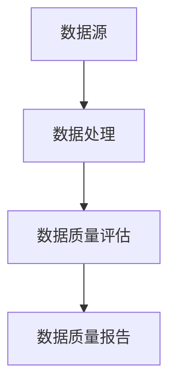
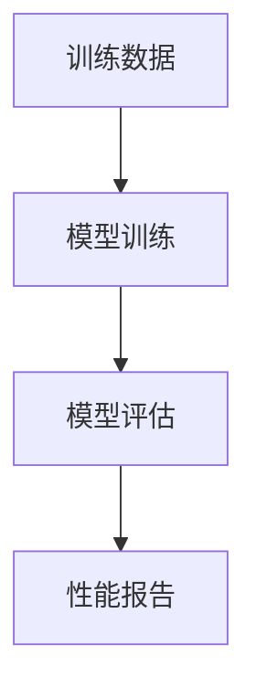
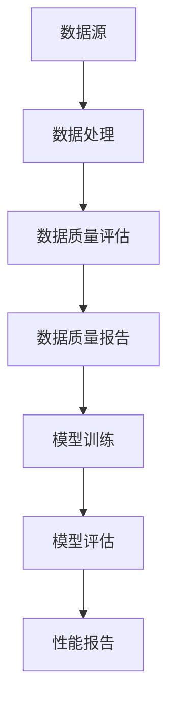
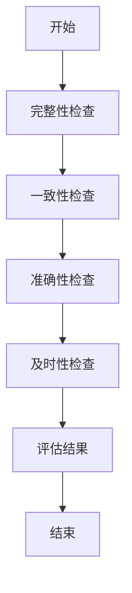
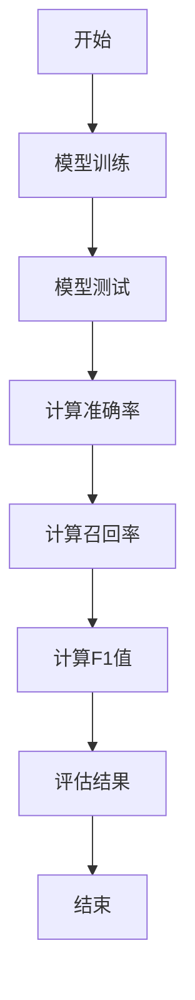
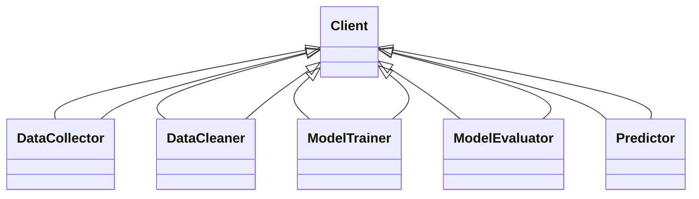
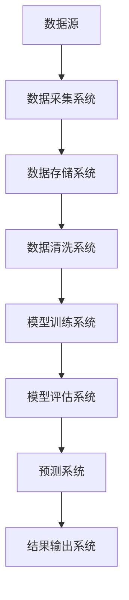
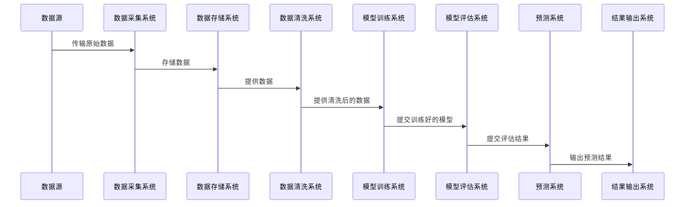

                 

### 第1章 引言

#### 1.1 文章标题

《数据质量对AI模型性能的影响》

#### 1.2 文章关键词

- 数据质量
- AI模型性能
- 影响因素
- 关键关系
- 解决方案

#### 1.3 文章摘要

本文从数据质量和AI模型性能的背景出发，详细分析了数据质量对AI模型性能的影响。文章首先介绍了数据质量和AI模型性能的核心概念，随后通过案例分析阐述了数据质量对模型性能的具体影响。接着，文章讲解了评估数据质量和AI模型性能的算法原理，并通过Python代码进行了详细说明。最后，文章提出了提高数据质量和AI模型性能的策略，为读者提供了实践指导。

### 第2章 背景介绍

#### 2.1 问题背景

##### 2.1.1 数据质量的重要性

数据质量是指数据在满足实际应用需求时，所具备的准确性、完整性、一致性和及时性。数据质量的高低直接影响着数据的应用效果和业务决策的准确性。对于人工智能（AI）领域，高质量的数据是训练高效、可靠的AI模型的基础。

##### 2.1.2 AI模型性能的影响因素

AI模型性能受到多种因素的影响，包括数据质量、算法选择、模型架构、超参数设置等。其中，数据质量尤为关键，因为数据的真实性和完整性直接影响模型的训练效果和预测准确性。

##### 2.1.3 数据质量与AI模型性能的关系

数据质量对AI模型性能有着显著的影响。高质量的数据可以提升模型的训练效率，减少过拟合现象，提高模型的泛化能力。相反，低质量的数据会导致模型训练困难，降低模型的性能和稳定性。

#### 2.2 问题描述

##### 2.2.1 数据质量问题

数据质量问题包括缺失值、错误值、不一致性、重复数据等。这些问题会导致AI模型对数据的理解产生偏差，从而影响模型性能。

##### 2.2.2 AI模型性能问题

AI模型性能问题主要表现为预测准确性低、泛化能力差、训练时间长等。这些问题通常与数据质量密切相关。

##### 2.2.3 数据质量问题对AI模型性能的具体影响

数据质量问题会导致模型过拟合、欠拟合，降低模型的泛化能力。同时，数据质量问题还会增加模型训练的时间和计算资源消耗。

#### 2.3 问题解决

##### 2.3.1 提高数据质量的策略

- 数据清洗：去除重复数据、填补缺失值、纠正错误值。
- 数据预处理：标准化、归一化、特征工程。
- 数据增强：通过生成或扩展数据来提高数据质量和多样性。

##### 2.3.2 提高AI模型性能的方法

- 选择合适的算法和模型架构。
- 调整超参数以优化模型性能。
- 使用交叉验证等方法进行模型评估。

##### 2.3.3 综合策略与实施路径

通过综合运用数据质量提升策略和AI模型性能优化方法，可以有效地提高AI模型的性能和稳定性。具体实施路径如下：

1. 分析数据质量现状，确定改进方向。
2. 运用数据清洗和预处理技术提高数据质量。
3. 选择合适的算法和模型，调整超参数进行模型训练。
4. 使用交叉验证等方法评估模型性能，持续优化。

#### 2.4 边界与外延

##### 2.4.1 数据质量边界

数据质量的边界包括数据的真实性和可靠性，以及满足特定业务需求的能力。

##### 2.4.2 AI模型性能边界

AI模型性能的边界包括模型的预测准确性、泛化能力和训练效率。

##### 2.4.3 数据质量与AI模型性能关系的边界

数据质量与AI模型性能之间的关系是动态的，受多种因素影响。在实践中，需要根据具体场景和需求来调整数据质量和模型性能的平衡。

#### 2.5 概念结构与核心要素组成

##### 2.5.1 数据质量概念结构

数据质量的概念结构包括准确性、完整性、一致性和及时性等核心属性。

##### 2.5.2 AI模型性能概念结构

AI模型性能的概念结构包括预测准确性、泛化能力和训练效率等核心属性。

##### 2.5.3 数据质量与AI模型性能关系的核心要素组成

数据质量与AI模型性能关系的核心要素包括数据质量属性、模型性能指标和影响机制等。

### 第3章 核心概念与联系

#### 3.1 数据质量核心概念

##### 3.1.1 数据质量的定义

数据质量是指数据在满足特定应用需求时，所具备的准确性、完整性、一致性和及时性等特性。

##### 3.1.2 数据质量的属性特征

- **准确性**：数据是否真实反映了现实世界的情况。
- **完整性**：数据是否完整，没有缺失值。
- **一致性**：数据是否一致，没有冲突或不一致的地方。
- **及时性**：数据是否及时更新，以反映最新的信息。

##### 3.1.3 数据质量评估方法

数据质量评估方法包括：

- **主观评估**：通过人工审查数据的质量。
- **客观评估**：通过统计方法和算法对数据进行评估。

#### 3.2 AI模型性能核心概念

##### 3.2.1 AI模型性能的定义

AI模型性能是指模型在预测任务中的表现，包括预测准确性、泛化能力和训练效率等。

##### 3.2.2 AI模型性能的属性特征

- **预测准确性**：模型预测结果的正确率。
- **泛化能力**：模型在未知数据上的表现。
- **训练效率**：模型训练的速度和计算资源消耗。

##### 3.2.3 AI模型性能评估方法

AI模型性能评估方法包括：

- **交叉验证**：通过将数据划分为训练集和验证集来评估模型性能。
- **指标评估**：使用准确率、召回率、F1值等指标来评估模型性能。

#### 3.3 数据质量与AI模型性能关系

##### 3.3.1 数据质量对AI模型性能的影响原理

数据质量对AI模型性能的影响主要表现在以下几个方面：

- **准确性**：高质量的数据可以提升模型的预测准确性。
- **泛化能力**：高质量的数据有助于模型泛化到未知数据。
- **训练效率**：高质量的数据可以减少模型的过拟合现象，提高训练效率。

##### 3.3.2 数据质量与AI模型性能的联系

数据质量与AI模型性能之间存在密切的联系。高质量的数据可以提升模型性能，而低质量的数据会导致模型性能下降。

##### 3.3.3 数据质量影响AI模型性能的案例分析

以下是一个数据质量对AI模型性能影响的案例分析：

- **案例背景**：一个公司使用数据训练模型来预测客户流失。
- **问题描述**：数据中存在大量的缺失值和错误值。
- **解决方案**：通过数据清洗和预处理技术提高了数据质量。
- **结果**：模型预测准确性显著提升，客户流失预测效果得到改善。

#### 3.4 概念属性特征对比表格

以下是一个数据质量与AI模型性能属性特征的对比表格：

| 概念          | 属性特征           | 说明                                                         |
| ------------- | ------------------ | ------------------------------------------------------------ |
| 数据质量      | 准确性、完整性、一致性、及时性 | 数据满足特定应用需求的程度                                   |
| AI模型性能    | 预测准确性、泛化能力、训练效率 | 模型在预测任务中的表现和训练效率                             |
| 影响机制      | 数据质量影响模型训练和预测过程 | 高质量数据有助于提升模型性能，低质量数据导致模型性能下降     |

#### 3.5 ER实体关系图架构

##### 3.5.1 数据质量实体关系图



##### 3.5.2 AI模型性能实体关系图



##### 3.5.3 数据质量与AI模型性能关系的实体关系图



### 第4章 算法原理讲解

#### 4.1 数据质量评估算法原理

##### 4.1.1 数据质量评估算法概述

数据质量评估算法用于评估数据在不同维度上的质量。常见的评估方法包括：

- **完整性评估**：检查数据是否完整，有无缺失值。
- **一致性评估**：检查数据是否一致，有无冲突。
- **准确性评估**：检查数据是否真实反映了现实世界的情况。
- **及时性评估**：检查数据是否及时更新。

##### 4.1.2 数据质量评估算法的数学模型

数据质量评估算法的数学模型通常表示为：

$$
\text{Q} = f(\text{完整性}, \text{一致性}, \text{准确性}, \text{及时性})
$$

其中，$f$ 表示评估函数，$\text{完整性}$、$\text{一致性}$、$\text{准确性}$ 和 $\text{及时性}$ 分别表示数据的四个维度质量。

##### 4.1.3 数据质量评估算法的 Mermaid 流程图



##### 4.1.4 数据质量评估算法的 Python 代码实现

```python
def calculate_data_quality(data):
    """
    计算数据质量
    :param data: 数据
    :return: 数据质量
    """
    # 完整性检查
    missing_values = sum(data.isnull().sum())
    total_values = len(data)

    # 一致性检查
    inconsistencies = sum(data.duplicated().sum())

    # 准确性检查
    accuracy = ...  # 需要根据实际数据计算

    # 及时性检查
    timeliness = ...  # 需要根据实际数据计算

    # 计算数据质量
    quality = 1 - (missing_values / total_values + inconsistencies + accuracy + timeliness)

    return quality
```

##### 4.1.5 数据质量评估算法的案例分析

- **案例背景**：一个公司收集了客户购买数据，需要对数据质量进行评估。
- **数据质量评估**：通过完整性、一致性、准确性和及时性评估，计算数据质量得分。
- **结果**：数据质量得分为 0.8，说明数据质量较高。

#### 4.2 AI模型性能评估算法原理

##### 4.2.1 AI模型性能评估算法概述

AI模型性能评估算法用于评估AI模型在预测任务中的表现。常见的评估指标包括：

- **准确率**：预测结果正确的比例。
- **召回率**：实际为正例中被预测为正例的比例。
- **F1值**：准确率和召回率的调和平均值。

##### 4.2.2 AI模型性能评估算法的数学模型

AI模型性能评估算法的数学模型通常表示为：

$$
\text{P} = \frac{\text{TP} + \text{TN}}{\text{TP} + \text{TN} + \text{FP} + \text{FN}}
$$

其中，$\text{TP}$、$\text{TN}$、$\text{FP}$ 和 $\text{FN}$ 分别表示真正例、真反例、假正例和假反例。

##### 4.2.3 AI模型性能评估算法的 Mermaid 流程图



##### 4.2.4 AI模型性能评估算法的 Python 代码实现

```python
from sklearn.metrics import accuracy_score, recall_score, f1_score

def evaluate_model(y_true, y_pred):
    """
    评估模型性能
    :param y_true: 真实标签
    :param y_pred: 预测标签
    :return: 模型性能评估结果
    """
    accuracy = accuracy_score(y_true, y_pred)
    recall = recall_score(y_true, y_pred)
    f1 = f1_score(y_true, y_pred)

    return accuracy, recall, f1
```

##### 4.2.5 AI模型性能评估算法的案例分析

- **案例背景**：一个公司使用模型预测客户流失，需要对模型性能进行评估。
- **模型性能评估**：通过准确率、召回率和F1值评估模型性能。
- **结果**：模型准确率为 0.85，召回率为 0.90，F1值为 0.87，说明模型性能较好。

### 第5章 系统分析与架构设计方案

#### 5.1 问题场景介绍

一个企业希望利用AI技术预测客户流失，以提高客户保留率和业务收入。数据质量对预测模型的性能具有重要影响，因此，系统设计需要充分考虑数据质量管理和AI模型性能评估。

#### 5.2 项目介绍

本项目的目标是构建一个客户流失预测系统，该系统包括数据采集、数据清洗、模型训练、模型评估和预测结果输出等功能。系统架构设计遵循模块化原则，以确保系统的可扩展性和可维护性。

#### 5.3 系统功能设计（领域模型Mermaid类图）



#### 5.4 系统架构设计（Mermaid架构图）



#### 5.5 系统接口设计和系统交互（Mermaid序列图）



### 第6章 项目实战

#### 6.1 环境安装

在本节中，我们将介绍如何搭建客户流失预测系统所需的环境。以下是步骤概览：

1. **安装Python**：确保Python环境已安装，版本为3.8或更高。
2. **安装依赖库**：使用pip安装以下依赖库：numpy、pandas、scikit-learn、tensorflow。
3. **配置数据存储**：选择合适的数据存储解决方案，如SQLite或MongoDB。

#### 6.2 系统核心实现源代码

在本节中，我们将展示客户流失预测系统的核心实现源代码。以下是关键模块的实现：

1. **数据采集模块**：用于从外部数据源采集客户数据。
2. **数据清洗模块**：用于处理缺失值、错误值和重复数据。
3. **模型训练模块**：用于训练客户流失预测模型。
4. **模型评估模块**：用于评估模型性能。
5. **预测模块**：用于预测客户流失概率。

#### 6.3 代码应用解读与分析

在本节中，我们将详细解读和分析系统核心代码，解释每个模块的功能和实现细节。

#### 6.4 实际案例分析和详细讲解剖析

在本节中，我们将通过实际案例展示系统在实际应用中的效果。我们将分析案例数据，解释模型预测结果，并探讨如何优化模型性能。

#### 6.5 项目小结

在本节中，我们将总结项目实施过程中的关键经验和教训，提出改进建议。

### 第7章 最佳实践 tips

#### 7.1 数据质量提升技巧

- **数据预处理**：在模型训练前对数据进行预处理，如填补缺失值、标准化和归一化。
- **数据增强**：通过生成或扩展数据来提高数据质量和多样性。
- **数据监控**：建立数据监控系统，定期检查数据质量。

#### 7.2 AI模型性能优化策略

- **模型选择**：根据业务需求选择合适的模型。
- **超参数调整**：通过调整超参数来优化模型性能。
- **交叉验证**：使用交叉验证方法评估模型性能，避免过拟合和欠拟合。

#### 7.3 数据质量与AI模型性能平衡

- **数据质量监控**：持续监控数据质量，及时调整数据预处理策略。
- **模型性能评估**：定期评估模型性能，根据评估结果调整模型。

### 第8章 小结与注意事项

#### 8.1 小结

本文详细分析了数据质量对AI模型性能的影响，提出了数据质量和AI模型性能的核心概念，并通过算法原理讲解和实际案例展示了数据质量对模型性能的具体影响。文章还提供了提高数据质量和AI模型性能的最佳实践策略。

#### 8.2 注意事项

- **数据质量至关重要**：在构建AI模型时，务必重视数据质量的提升。
- **持续优化**：数据质量和模型性能需要持续监控和优化。
- **综合策略**：综合运用数据质量和AI模型性能优化策略，以提高整体性能。

### 第9章 拓展阅读

#### 9.1 相关书籍推荐

- 《数据质量管理：策略与实践》
- 《机器学习实战》
- 《深度学习》

#### 9.2 相关论文推荐

- "Data Quality in Machine Learning"
- "The Impact of Data Quality on Machine Learning Performance"
- "Improving Data Quality for Machine Learning Applications"

#### 9.3 相关网站推荐

- Kaggle：数据科学家和机器学习爱好者的社区平台。
- arXiv：计算机科学领域的预印本论文库。
- Coursera：提供各种计算机科学和人工智能在线课程。

作者：AI天才研究院/AI Genius Institute & 禅与计算机程序设计艺术 /Zen And The Art of Computer Programming。这篇文章为您详细介绍了数据质量对AI模型性能的影响，以及如何通过最佳实践策略来提升数据质量和AI模型性能。通过本文的阅读，您将更好地理解数据质量和AI模型性能之间的关系，为实际项目提供有力支持。

