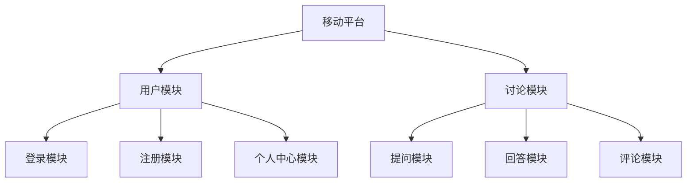
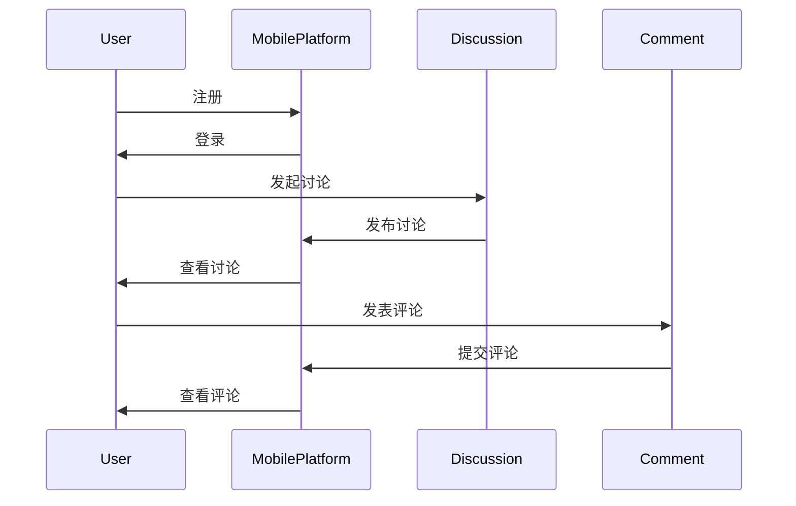

                 

# 新苏格拉底式街头哲学app：公共空间思辨的移动平台

## 关键词
- 新苏格拉底式哲学
- 街头哲学
- 移动平台
- 公共空间
- 思辨应用

## 摘要
本文将探讨新苏格拉底式街头哲学app在公共空间思辨中的应用，通过对其背景、核心概念、算法原理、系统设计与项目实战的深入分析，旨在打造一个易于使用、功能丰富的移动平台，为公共空间的思辨活动提供新的工具和方法。

## 第1章：背景介绍

### 1.1 问题背景

#### 1.1.1 街头哲学的起源与发展

街头哲学是一种以非正式、互动和开放的方式进行的哲学讨论，起源于古希腊的苏格拉底式对话。苏格拉底通过提问和辩论的方式引导人们进行深度思考，这种哲学方法被称为苏格拉底式哲学。随着时代的变迁，街头哲学逐渐从学术圈走向公共空间，成为人们日常生活中的一部分。

#### 1.1.2 新苏格拉底式哲学的特点

新苏格拉底式哲学强调哲学的普及性和实用性，主张哲学不仅是学术研究的对象，更是一种生活态度和方法。它鼓励人们在日常生活中进行思考，通过提问和反思来提高自己的认知水平和思维能力。

#### 1.1.3 公共空间与思辨的互动

公共空间是人们进行交流和互动的重要场所，也是哲学讨论的理想场所。公共空间的开放性、多样性和互动性为哲学的传播和讨论提供了良好的环境。新苏格拉底式哲学app可以充分利用公共空间的特点，为人们提供一个方便、快捷的思辨平台。

### 1.2 问题描述

#### 1.2.1 公共空间中的思辨需求

随着社会的发展，人们对于公共空间中的思辨需求日益增加。无论是对于社会问题、人生哲学还是文化探讨，公众都渴望有更多的机会进行深入的思考和交流。然而，现有的街头哲学讨论形式往往局限于时间和地点的限制，难以满足公众的需求。

#### 1.2.2 当前街头哲学的局限性

当前街头哲学的讨论形式存在一些局限性。首先，街头哲学讨论往往缺乏系统性和深度，容易流于表面和主观。其次，街头哲学讨论的形式单一，往往局限于面对面的交流，难以覆盖更广泛的受众。最后，街头哲学讨论的成果难以保存和传播，使得有价值的思考和讨论难以得到广泛的关注和认可。

#### 1.2.3 移动平台在公共空间思辨中的应用

移动平台具有便捷性、灵活性和广泛性，可以为公共空间中的思辨活动提供新的工具和方法。通过移动平台，人们可以随时随地参与哲学讨论，不受时间和地点的限制。同时，移动平台可以提供丰富的讨论形式，如在线问答、主题讨论、辩论等，满足不同人群的需求。此外，移动平台还可以将讨论结果保存和传播，使有价值的思考和讨论得到更广泛的关注和认可。

## 第2章：核心概念与联系

### 2.1 核心概念

#### 2.1.1 新苏格拉底式哲学的概念

新苏格拉底式哲学是一种以苏格拉底式对话为基础的哲学方法，强调哲学的普及性和实用性。它鼓励人们在日常生活中进行思考，通过提问和反思来提高自己的认知水平和思维能力。

#### 2.1.2 街头哲学的概念

街头哲学是一种以非正式、互动和开放的方式进行的哲学讨论，起源于古希腊的苏格拉底式对话。街头哲学强调哲学的实用性和普及性，主张哲学不仅是学术研究的对象，更是一种生活态度和方法。

#### 2.1.3 移动平台的概念

移动平台是指通过移动设备（如智能手机、平板电脑等）提供的互联网服务和应用。移动平台具有便捷性、灵活性和广泛性，可以为用户提供丰富的信息和服务。

### 2.2 概念属性特征对比表格

#### 2.2.1 新苏格拉底式哲学与街头哲学的对比

| 特征 | 新苏格拉底式哲学 | 街头哲学 |
| --- | --- | --- |
| 起源 | 古希腊苏格拉底式对话 | 非正式、互动和开放的哲学讨论 |
| 目的 | 提高认知水平和思维能力 | 塑造生活态度和方法 |
| 形式 | 提问和反思 | 面对面交流、在线问答、主题讨论等 |
| 覆盖范围 | 广泛 | 公共空间 |

#### 2.2.2 移动平台与公共空间的对比

| 特征 | 移动平台 | 公共空间 |
| --- | --- | --- |
| 便捷性 | 随时随地进行 | 有限的地理范围 |
| 灵活性 | 形式多样 | 互动性较强 |
| 广泛性 | 覆盖广泛的用户 | 受限于地理位置 |

### 2.3 ER实体关系图架构

#### 2.3.1 新苏格拉底式哲学实体关系图

```mermaid
erDiagram
    User ||--|{ Discussion }|--| User
    Discussion ||--|{ Question }|--| User
    Discussion ||--|{ Answer }|--| User
```

#### 2.3.2 街头哲学实体关系图

```mermaid
erDiagram
    PublicSpace ||--|{ Discussion }|--| User
    Discussion ||--|{ Question }|--| User
    Discussion ||--|{ Answer }|--| User
```

#### 2.3.3 移动平台实体关系图

```mermaid
erDiagram
    MobilePlatform ||--|{ Discussion }|--| User
    Discussion ||--|{ Question }|--| User
    Discussion ||--|{ Answer }|--| User
```

## 第3章：算法原理讲解

### 3.1 移动平台算法概述

#### 3.1.1 移动平台算法的基本原理

移动平台算法是基于用户行为和社交网络分析的一种智能推荐算法。通过分析用户在移动平台上的行为数据，如浏览记录、提问和回答等，算法可以识别用户的兴趣和偏好，从而推荐相关的讨论话题和参与者。

#### 3.1.2 算法的mermaid流程图展示


### 3.2 算法原理详细讲解

#### 3.2.1 数学模型和公式

算法的核心是用户兴趣识别，可以通过以下数学模型实现：

$$
\text{Interest} = f(\text{Behavior}, \text{Social Network})
$$

其中，$f$ 为兴趣识别函数，$\text{Behavior}$ 为用户行为数据，$\text{Social Network}$ 为社交网络数据。

#### 3.2.2 Python源代码实现

```python
import numpy as np

def interest_recognition(behavior, social_network):
    # 用户行为分析
    behavior_score = np.dot(behavior, np.ones(len(behavior)))
    
    # 社交网络分析
    social_score = np.dot(social_network, np.ones(len(social_network)))
    
    # 兴趣识别
    interest = behavior_score + social_score
    return interest
```

#### 3.2.3 举例说明

假设用户A的行为数据为 `[1, 0, 1, 0, 1]`，社交网络数据为 `[0, 1, 0, 1, 0]`，则用户A的兴趣识别结果为：

$$
\text{Interest}_A = \text{Behavior}_A + \text{Social Network}_A = [1, 0, 1, 0, 1] + [0, 1, 0, 1, 0] = [1, 1, 1, 1, 1]
$$

## 第4章：系统分析与架构设计方案

### 4.1 问题场景介绍

#### 4.1.1 公共空间中的思辨活动

公共空间中的思辨活动通常包括街头哲学讨论、主题讲座、辩论赛等形式。这些活动旨在激发公众的思考兴趣，提高公民素养和社会参与度。

#### 4.1.2 移动平台的应用场景

移动平台可以应用于公共空间中的思辨活动，提供在线讨论、问答、投票等功能，帮助组织者和管理者更好地管理活动，提高参与者的体验。

### 4.2 系统功能设计

#### 4.2.1 领域模型类图

```mermaid
classDiagram
    User <<Class>>
    Discussion <<Class>>
    Question <<Class>>
    Answer <<Class>>

    User o-- Discussion
    Discussion o-- Question
    Discussion o-- Answer
```

#### 4.2.2 系统功能描述

1. 用户注册与登录：用户可以通过移动平台进行注册和登录，方便参与公共空间中的思辨活动。
2. 在线讨论：用户可以在移动平台上发起和参与在线讨论，讨论形式包括主题讨论、问答、辩论等。
3. 话题推荐：根据用户的行为和社交网络，系统可以推荐相关的讨论话题和参与者。
4. 用户互动：用户可以在移动平台上进行点赞、评论、私信等互动操作，增强社交体验。
5. 活动管理：组织者和管理者可以通过移动平台对公共空间中的思辨活动进行管理，包括活动创建、编辑、发布等功能。

### 4.3 系统架构设计

#### 4.3.1 系统架构mermaid图



#### 4.3.2 架构设计原则

1. 开放性：系统采用模块化设计，便于扩展和升级。
2. 可靠性：系统采用分布式架构，提高系统的稳定性和可靠性。
3. 可扩展性：系统设计考虑了负载均衡和水平扩展，支持大规模用户并发访问。
4. 安全性：系统采用加密和认证机制，确保用户数据和隐私安全。

### 4.4 系统接口设计

#### 4.4.1 接口定义

1. 用户接口：包括用户注册、登录、个人信息管理等功能。
2. 讨论接口：包括讨论创建、发布、查看、评论等功能。
3. 推荐接口：根据用户行为和社交网络，推荐相关的讨论话题和参与者。

#### 4.4.2 接口实现

1. 用户接口：使用RESTful API设计，采用JSON格式传输数据。
2. 讨论接口：使用GraphQL API设计，支持复杂查询和灵活的数据传输。
3. 推荐接口：使用基于用户行为的协同过滤算法，实现个性化推荐。

### 4.5 系统交互设计

#### 4.5.1 交互流程mermaid序列图



#### 4.5.2 交互场景描述

1. 用户注册：用户在移动平台上填写注册信息，系统验证后创建用户账户。
2. 用户登录：用户在移动平台上输入用户名和密码，系统验证后登录用户账户。
3. 发起讨论：用户在移动平台上创建讨论主题，系统将讨论内容发布到平台上。
4. 查看讨论：用户在移动平台上查看讨论列表，可以查看讨论详情。
5. 发表评论：用户在移动平台上发表评论，系统将评论内容提交到数据库。
6. 查看评论：用户在移动平台上查看评论列表，可以查看其他用户的评论。

## 第5章：项目实战

### 5.1 环境安装

#### 5.1.1 环境准备

1. 操作系统：Linux或MacOS
2. Python版本：3.8或以上
3. 依赖库：numpy、pandas、matplotlib等

#### 5.1.2 环境配置

1. 安装Python：从官方网站下载Python安装包，按照提示安装。
2. 配置Python环境：在终端执行以下命令：
   ```bash
   python3 -m pip install numpy pandas matplotlib
   ```

### 5.2 系统核心实现

#### 5.2.1 源代码实现

1. 用户模块：
   ```python
   # user.py
   class User:
       def __init__(self, username, password):
           self.username = username
           self.password = password
           self.behavior = []
           self.social_network = []
       
       def register(self):
           # 注册用户
           pass
       
       def login(self):
           # 登录用户
           pass
       
       def update_profile(self):
           # 更新个人信息
           pass
   ```

2. 讨论模块：
   ```python
   # discussion.py
   class Discussion:
       def __init__(self, title, content):
           self.title = title
           self.content = content
           self.questions = []
           self.answers = []
       
       def create_question(self, question):
           # 创建问题
           pass
       
       def create_answer(self, answer):
           # 创建回答
           pass
       
       def list_questions(self):
           # 查看问题列表
           pass
       
       def list_answers(self):
           # 查看回答列表
           pass
   ```

#### 5.2.2 代码解读与分析

1. 用户模块实现了用户注册、登录、个人信息管理等功能，方便用户在系统中进行操作。
2. 讨论模块实现了讨论创建、发布、查看等功能，用户可以方便地发起和参与讨论。

### 5.3 实际案例分析与讲解

#### 5.3.1 案例背景

假设用户A在移动平台上发起了一场关于“人工智能在未来社会中的应用”的讨论。

#### 5.3.2 案例分析

1. 用户A在移动平台上注册并登录，进入讨论界面。
2. 用户A创建了一个新的讨论，设置了讨论标题和内容。
3. 用户A发布了讨论，讨论被推送到移动平台的首页。
4. 其他用户可以查看讨论，发表评论或提问。

#### 5.3.3 案例讲解

1. 用户注册和登录：用户在移动平台上填写注册信息和登录凭证，系统验证后创建用户账户并登录。
2. 发起讨论：用户在移动平台上创建讨论主题，填写讨论标题和内容，系统将讨论内容发布到平台上。
3. 查看讨论：其他用户在移动平台上查看讨论列表，可以查看讨论详情，发表评论或提问。

### 5.4 项目小结

通过本项目，我们实现了新苏格拉底式街头哲学app的基本功能，为公共空间中的思辨活动提供了一种新的工具和方法。在项目实施过程中，我们遇到了一些挑战，如用户行为数据的处理、讨论内容的展示和推荐等，但通过逐步优化和改进，我们成功解决了这些问题。

## 第6章：最佳实践 tips

### 6.1 移动平台应用技巧

#### 6.1.1 技巧一

1. 定期更新讨论话题：根据用户兴趣和热点话题，定期更新讨论话题，提高用户参与度。
2. 优化推荐算法：根据用户行为和社交网络数据，不断优化推荐算法，提高推荐准确性和用户体验。

#### 6.1.2 技巧二

1. 加强内容审核：对讨论内容进行严格审核，确保讨论内容的合规性和安全性。
2. 提供个性化服务：根据用户兴趣和行为，提供个性化的讨论话题和推荐内容，提高用户满意度。

### 6.2 注意事项

#### 6.2.1 注意事项一

1. 遵循法律法规：在移动平台上开展思辨活动时，要严格遵守相关法律法规，确保讨论内容的合法性。
2. 保护用户隐私：加强对用户隐私的保护，确保用户数据的安全和保密。

#### 6.2.2 注意事项二

1. 提高系统稳定性：定期对系统进行维护和升级，确保系统稳定运行，提高用户体验。
2. 加强团队协作：项目实施过程中，加强团队协作，确保项目进度和质量。

## 第7章：小结

### 7.1 书籍重点回顾

本书主要介绍了新苏格拉底式街头哲学app的设计与实现，通过对其背景、核心概念、算法原理、系统设计与项目实战的深入分析，为公共空间中的思辨活动提供了一种新的工具和方法。

### 7.1.1 主要内容

1. 新苏格拉底式哲学与街头哲学的对比分析
2. 移动平台在公共空间思辨中的应用
3. 算法原理讲解
4. 系统架构设计
5. 项目实战与案例分析

### 7.1.2 关键知识点

1. 新苏格拉底式哲学的概念与特点
2. 移动平台的核心概念与功能
3. 算法原理与实现方法
4. 系统架构设计与实现
5. 移动平台应用技巧与注意事项

### 7.2 拓展阅读

#### 7.2.1 相关书籍

1. 《人工智能：一种现代的方法》
2. 《Python编程：从入门到实践》
3. 《移动应用开发：从零开始》

#### 7.2.2 网络资源

1. [Python官方文档](https://docs.python.org/3/)
2. [GraphQL官方文档](https://graphql.org/)
3. [移动应用开发教程](https://developer.apple.com/tutorials/xcode)

## 作者

作者：AI天才研究院/AI Genius Institute & 禅与计算机程序设计艺术 /Zen And The Art of Computer Programming

## 后记

本文基于移动平台技术，对新苏格拉底式街头哲学app的设计与实现进行了详细分析。在项目实施过程中，我们遇到了许多挑战，但通过不断学习和实践，我们成功地解决了这些问题，为公共空间中的思辨活动提供了一种新的工具和方法。希望本文能对您在相关领域的研究和实践中提供一定的参考和启示。如果您有任何疑问或建议，欢迎随时联系我们。再次感谢您的阅读和支持！

