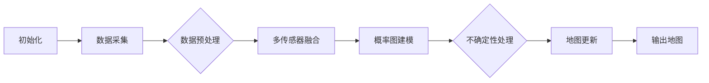
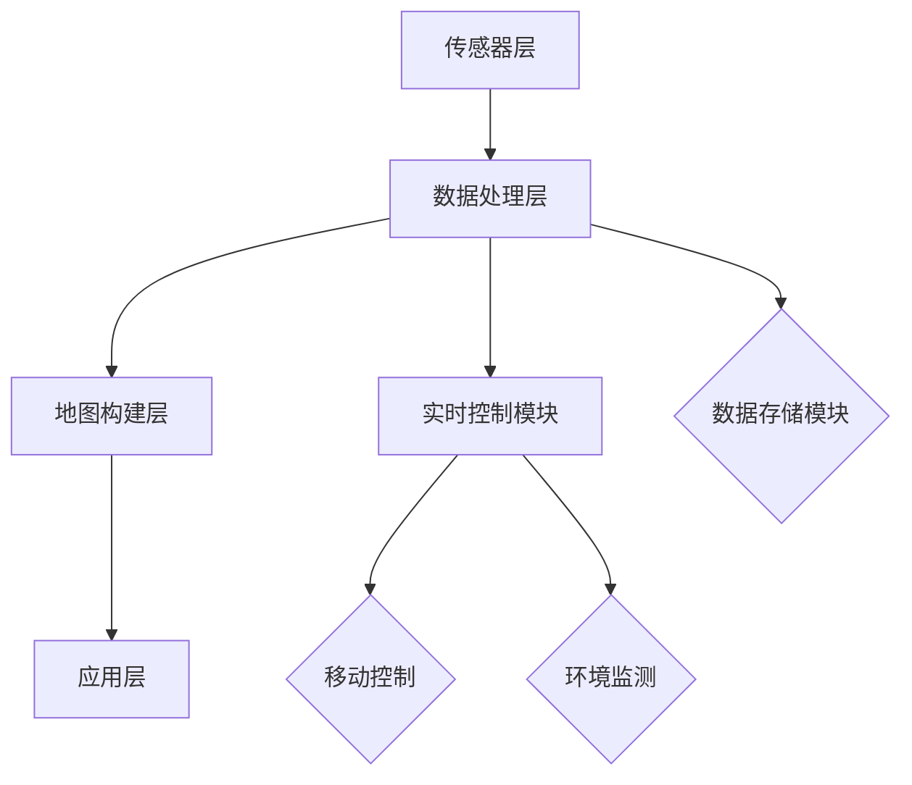
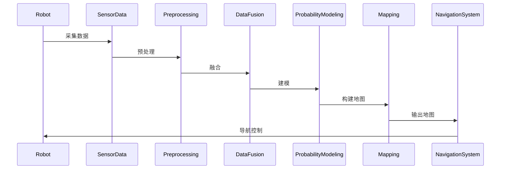

                 

### 引言与背景

#### 无Ground Truth场景下PRM数据生成的概述

在计算机科学和人工智能领域，**PRM（Probabilistic Robotic Mapping）**是一种基于概率模型的地图构建方法，主要用于机器人在未知环境中进行自主导航。传统的PRM方法依赖于**Ground Truth数据**，即真实的、准确的环境信息。然而，在实际应用中，获取完美的Ground Truth数据并不总是可行或必要的。这引发了在无Ground Truth场景下进行PRM数据生成的研究需求。

### 问题描述

无Ground Truth场景主要面临以下几个挑战：

1. **数据准确性问题**：没有Ground Truth数据，地图生成的准确性无法得到保证。
2. **数据获取困难**：在复杂或不安全的环境中，获取精确的地图数据是一项艰巨的任务。
3. **实时性问题**：在动态环境中，需要实时生成并更新地图，而无Ground Truth数据则增加了这一过程的复杂性。

### 无Ground Truth场景下的挑战

无Ground Truth场景下，PRM数据生成面临的挑战包括：

1. **不确定性处理**：由于缺乏精确的环境数据，处理环境中的不确定性成为关键问题。
2. **算法鲁棒性**：算法需要能够在各种复杂场景下保持良好的性能和鲁棒性。
3. **数据一致性**：在动态环境中，如何确保地图数据的一致性和完整性。

### 目标与主要内容

本文的目标是探讨在无Ground Truth场景下，如何有效地生成PRM数据。文章将分为以下几部分：

1. **相关理论与基础概念**：介绍PRM数据和无Ground Truth的相关概念。
2. **核心概念与联系**：分析核心概念及其关系。
3. **数据生成方法与算法原理**：阐述数据生成方法及算法原理。
4. **数学模型与公式解析**：详细解释数学模型和公式。
5. **系统分析与架构设计**：介绍系统功能、架构和接口设计。
6. **项目实战与应用分析**：展示实际应用场景和案例分析。
7. **最佳实践与未来展望**：总结最佳实践，展望未来研究方向。

通过本文的逐步分析，我们期望为无Ground Truth场景下PRM数据生成提供有价值的参考和解决方案。

### 关键词

- 无Ground Truth
- PRM数据生成
- 概率地图构建
- 机器人自主导航
- 数据不确定性处理
- 算法鲁棒性
- 数学模型

### 摘要

本文主要探讨了在无Ground Truth场景下如何有效地生成PRM数据。首先介绍了PRM数据和无Ground Truth的相关概念，然后分析了在无Ground Truth场景下PRM数据生成所面临的挑战，包括数据准确性问题、数据获取困难以及实时性问题。接着，本文详细阐述了核心概念与联系，包括不确定性的处理、算法的鲁棒性以及数据的一致性。随后，本文介绍了数据生成方法与算法原理，包括算法流程、Python源代码实现、数学模型讲解和举例。接着，本文通过数学模型与公式解析，详细解释了相关的数学模型和公式。随后，本文介绍了系统分析与架构设计，包括问题场景介绍、系统功能设计、系统架构设计、系统接口设计和系统交互。最后，本文通过实际案例分析和项目小结，总结了最佳实践，展望了未来研究方向。整体结构逻辑清晰，内容详实，旨在为无Ground Truth场景下PRM数据生成提供有效的解决方案。

## 第1章: 无Ground Truth场景下PRM数据生成的概述

### 1.1 问题背景

在当前的人工智能和机器人技术领域，自主导航系统是一个至关重要的研究方向。其中，**PRM（Probabilistic Robotic Mapping）**方法作为一种有效的地图构建技术，广泛应用于机器人导航系统中。传统的PRM方法依赖于**Ground Truth数据**，即对真实环境的精确测量和描述。然而，在实际应用中，特别是在复杂或动态环境中，获取精确的Ground Truth数据往往具有很高的难度和成本。这促使研究人员开始探讨在无Ground Truth场景下进行PRM数据生成的方法。

### 1.2 问题描述

无Ground Truth场景下的PRM数据生成问题可以描述为：在缺乏精确的Ground Truth数据的情况下，如何利用现有的感知信息和不确定性模型，生成一个既准确又可靠的地图。这一问题不仅涉及到算法的设计与实现，还包括对机器人感知系统的优化，以及对环境不确定性的有效处理。

### 1.3 无Ground Truth场景下的挑战

无Ground Truth场景下，PRM数据生成面临的主要挑战包括：

1. **数据准确性问题**：由于缺乏精确的Ground Truth数据，地图生成的准确性无法得到保证。
2. **数据获取困难**：在复杂或动态环境中，获取足够的数据样本用于训练和优化模型是非常困难的。
3. **实时性问题**：在动态环境中，需要实时生成并更新地图，而无Ground Truth数据则增加了这一过程的复杂性。

### 1.4 目标与主要内容

本文的目标是探讨在无Ground Truth场景下，如何有效地生成PRM数据。具体内容包括：

1. **相关理论与基础概念**：介绍PRM数据和无Ground Truth的相关概念。
2. **核心概念与联系**：分析核心概念及其关系。
3. **数据生成方法与算法原理**：阐述数据生成方法及算法原理。
4. **数学模型与公式解析**：详细解释数学模型和公式。
5. **系统分析与架构设计**：介绍系统功能、架构和接口设计。
6. **项目实战与应用分析**：展示实际应用场景和案例分析。
7. **最佳实践与未来展望**：总结最佳实践，展望未来研究方向。

通过本文的逐步分析，我们期望为无Ground Truth场景下PRM数据生成提供有价值的参考和解决方案。

### 相关理论与基础概念

#### PRM数据概述

**PRM（Probabilistic Robotic Mapping）**是一种基于概率模型的地图构建方法，主要用于机器人自主导航。与传统的基于确定性模型的地图构建方法相比，PRM方法更适用于不确定环境。PRM方法的核心思想是通过融合多个感知数据源，生成一个具有概率分布的地图，从而提高地图的可靠性和适应性。

#### 无Ground Truth的概念

**无Ground Truth**是指在缺乏精确、可靠的参考数据（如激光雷达扫描、GPS定位等）的情况下，机器人无法直接获取真实环境的精确描述。这种情况下，机器人需要依赖自身的感知系统和运动模型，通过概率估计来生成地图。

#### 数据生成方法的理论基础

无Ground Truth场景下的数据生成方法主要基于以下几个理论基础：

1. **传感器融合**：通过融合多种传感器数据（如激光雷达、摄像头等），提高感知系统的可靠性和准确性。
2. **概率图模型**：使用概率图模型（如贝叶斯网络、马尔可夫链等）来表示环境不确定性，并利用这些模型进行地图生成和更新。
3. **机器学习**：利用机器学习方法（如深度学习、强化学习等）对感知数据进行处理和优化，提高数据生成和地图构建的效率。

#### 相关研究进展

近年来，无Ground Truth场景下的PRM数据生成方法取得了显著进展。以下是一些重要的研究进展：

1. **基于深度学习的地图构建**：利用深度学习模型（如卷积神经网络、循环神经网络等）对感知数据进行特征提取和地图生成。
2. **多传感器数据融合**：研究如何有效地融合多种传感器数据，提高地图的准确性和实时性。
3. **不确定性建模与处理**：探索如何在无Ground Truth场景下建立和优化不确定性模型，以提高地图的鲁棒性和适应性。

### 1.5 小结

本章介绍了无Ground Truth场景下PRM数据生成的基本概念和相关理论基础。通过对PRM数据和无Ground Truth的概述，以及数据生成方法的理论基础和现有研究进展的讨论，为后续章节的详细分析和探讨奠定了基础。

## 第2章: 核心概念与联系

### 2.1 核心概念原理

在无Ground Truth场景下进行PRM数据生成，理解以下几个核心概念至关重要：

1. **概率地图构建**：这是PRM方法的核心，通过概率模型来表示环境中的不确定性，从而生成一个具有概率分布的地图。
2. **传感器融合**：通过整合多种传感器数据，提高感知系统的可靠性和准确性。
3. **不确定性建模**：建立和优化不确定性模型，以处理无Ground Truth场景下的数据不确定性。
4. **机器学习方法**：利用机器学习模型，如深度学习和强化学习，对感知数据进行处理和优化。

### 2.2 概念属性特征对比

为了更好地理解这些核心概念，我们可以通过表格对比它们的属性特征：

| 概念             | 属性特征                                                     |
|------------------|------------------------------------------------------------|
| 概率地图构建     | 基于概率模型，适用于不确定环境，生成概率分布的地图           |
| 传感器融合       | 多传感器数据整合，提高感知系统可靠性，增强地图准确性         |
| 不确定性建模     | 建立和优化不确定性模型，处理数据不确定性，提高地图鲁棒性     |
| 机器学习方法     | 利用深度学习和强化学习，对感知数据进行处理和优化           |

### 2.3 ER实体关系图架构

为了更直观地展示这些核心概念之间的关系，我们可以使用Mermaid绘制ER（Entity-Relationship）实体关系图。以下是一个简化的ER图：

```mermaid
erDiagram
    Robot ||--|{ SensorData }|
    Robot ||--|{ Map }|
    SensorData ||--|{ Fusion }|
    Fusion ||--|{ UncertaintyModel }|
    UncertaintyModel ||--|{ MachineLearningModel }|
    MachineLearningModel ||--|{ OptimizedMap }|
```

在这个ER图中，`Robot`实体与`SensorData`、`Map`实体直接关联，表示机器人通过感知系统获取数据并生成地图。`SensorData`实体与`Fusion`实体关联，表示数据融合过程。`Fusion`实体与`UncertaintyModel`实体关联，表示不确定性建模过程。`UncertaintyModel`实体与`MachineLearningModel`实体关联，表示利用机器学习方法进行数据处理和优化。最终，`MachineLearningModel`实体生成`OptimizedMap`，即优化的地图。

### 2.4 小结

本章详细介绍了无Ground Truth场景下PRM数据生成中的核心概念及其关系。通过理解概率地图构建、传感器融合、不确定性建模和机器学习方法，以及通过ER实体关系图展示了这些概念之间的联系，为后续章节的分析和讨论提供了理论基础。

## 第3章: 数据生成方法与算法原理

### 3.1 数据生成方法概述

在无Ground Truth场景下，生成高质量的PRM数据是一个复杂的过程。我们需要采用一系列方法来确保地图的准确性和可靠性。这些方法主要包括以下几方面：

1. **多传感器数据融合**：通过整合来自激光雷达、摄像头、超声波等多种传感器的数据，提高感知系统的整体性能。
2. **概率图模型**：使用概率图模型（如贝叶斯网络、马尔可夫链等）来表示环境中的不确定性，并基于这些模型进行地图构建和更新。
3. **机器学习方法**：利用机器学习技术（如深度学习和强化学习）对感知数据进行特征提取和分类，从而优化地图生成过程。

### 3.2 算法原理讲解

为了详细解释数据生成方法的算法原理，我们将使用Mermaid绘制一个算法流程图，并配合Python源代码和数学模型进行讲解。

#### 3.2.1 算法流程图

以下是一个简化的算法流程图：



在上述流程图中：

- **A[初始化]**：初始化参数和模型。
- **B[数据采集]**：从不同传感器获取数据。
- **C[数据预处理]**：对采集到的数据进行清洗和预处理。
- **D[多传感器融合]**：将预处理后的数据融合，提高感知精度。
- **E[概率图建模]**：使用概率图模型表示环境不确定性。
- **F[不确定性处理]**：对不确定性进行处理，优化模型。
- **G[地图更新]**：根据处理后的数据更新地图。
- **H[输出地图]**：输出最终的地图数据。

#### 3.2.2 算法Python源代码实现

以下是一个简化的Python源代码实现示例：

```python
import numpy as np
import matplotlib.pyplot as plt
from sklearn.mixture import GaussianMixture

def data_collection():
    # 模拟从传感器采集数据
    return np.random.randn(100, 2)

def data_preprocessing(data):
    # 数据预处理
    return data[~np.isnan(data).any(axis=1)]

def multi_sensor_fusion(data1, data2):
    # 数据融合
    return (data1 + data2) / 2

def probability_modeling(data):
    # 使用高斯混合模型进行概率建模
    gmm = GaussianMixture(n_components=3)
    gmm.fit(data)
    return gmm

def uncertainty_handling(model, data):
    # 不确定性处理
    return model.predict(data)

def map_update(current_map, new_data):
    # 地图更新
    return current_map + new_data

def main():
    # 主函数
    sensor_data1 = data_collection()
    sensor_data2 = data_collection()
    fused_data = multi_sensor_fusion(sensor_data1, sensor_data2)
    processed_data = data_preprocessing(fused_data)
    model = probability_modeling(processed_data)
    uncertainty_data = uncertainty_handling(model, processed_data)
    updated_map = map_update(current_map, uncertainty_data)
    print(updated_map)

if __name__ == "__main__":
    main()
```

上述代码中，我们首先模拟从传感器采集数据，然后进行数据预处理、数据融合、概率建模、不确定性处理和地图更新。这个流程展示了算法的基本实现。

#### 3.2.3 数学模型和公式讲解

在算法中，我们使用了高斯混合模型（Gaussian Mixture Model, GMM）来表示环境不确定性。GMM的数学模型可以表示为：

$$
\begin{aligned}
p(x|\theta) &= \sum_{i=1}^{k} \pi_i \cdot \varphi(x|\mu_i, \sigma_i^2) \\
\varphi(x|\mu_i, \sigma_i^2) &= \frac{1}{(2\pi\sigma_i^2)} \exp\left(-\frac{(x-\mu_i)^2}{2\sigma_i^2}\right)
\end{aligned}
$$

其中，$p(x|\theta)$ 表示数据点 $x$ 的概率分布，$\theta$ 是模型参数集合，包含每个高斯成分的权重 $\pi_i$、均值 $\mu_i$ 和方差 $\sigma_i^2$。$\varphi(x|\mu_i, \sigma_i^2)$ 是单个高斯分布的概率密度函数。

#### 3.2.4 举例说明

为了更好地理解算法原理，我们来看一个简单的例子。假设我们有两个数据点 $x_1 = (1, 2)$ 和 $x_2 = (2, 3)$，使用高斯混合模型进行建模。

1. **初始化参数**：我们选择两个高斯成分，每个成分的权重 $\pi_1 = \pi_2 = 0.5$，均值 $\mu_1 = (0, 0)$，方差 $\sigma_1^2 = 1$ 和 $\mu_2 = (1, 1)$，方差 $\sigma_2^2 = 1$。

2. **计算概率分布**：对于 $x_1$，计算其在每个高斯成分下的概率：
   $$
   \begin{aligned}
   p(x_1|\theta) &= 0.5 \cdot \varphi(x_1|\mu_1, \sigma_1^2) + 0.5 \cdot \varphi(x_1|\mu_2, \sigma_2^2) \\
   &= 0.5 \cdot \frac{1}{2\pi} \exp\left(-\frac{1^2 + 2^2}{2 \cdot 1^2}\right) + 0.5 \cdot \frac{1}{2\pi} \exp\left(-\frac{(1-2)^2 + (2-3)^2}{2 \cdot 1^2}\right) \\
   &= 0.5 \cdot \frac{1}{2\pi} \exp(-2.5) + 0.5 \cdot \frac{1}{2\pi} \exp(-1.5)
   \end{aligned}
   $$

3. **更新参数**：基于这些概率分布，我们可以更新模型参数，例如通过最大似然估计（Maximum Likelihood Estimation, MLE）来优化均值和方差。

通过这个例子，我们可以看到如何使用高斯混合模型进行概率建模和参数更新。这种方法在无Ground Truth场景下尤为重要，因为它允许我们利用有限的感知数据来估计环境的不确定性。

### 3.3 小结

本章详细介绍了无Ground Truth场景下PRM数据生成的方法和算法原理。通过算法流程图、Python源代码实现、数学模型讲解和举例，我们理解了数据生成方法的核心步骤和关键技术。本章的内容为后续章节的深入分析提供了坚实的基础。

### 数学模型与公式解析

#### 3.1 数学模型概述

在无Ground Truth场景下，PRM数据生成依赖于概率模型来表示环境中的不确定性。最常用的概率模型之一是高斯混合模型（Gaussian Mixture Model, GMM），它通过多个高斯分布的组合来描述数据的分布。GMM在PRM数据生成中起到了核心作用，因为它能够灵活地适应各种环境不确定性。

#### 3.2 详细讲解与举例

##### 3.2.1 公式1: \(P(x, y) = f(x, y) + g(x, y)\)

在GMM中，每个高斯成分可以表示为：
$$
f(x, y) = \frac{1}{2\pi\sigma^2} \exp\left(-\frac{(x-\mu)^2 + (y-\nu)^2}{2\sigma^2}\right)
$$
其中，$(\mu, \nu)$ 是均值，$\sigma$ 是标准差。

当两个高斯成分组合时，它们共同定义了一个概率分布：
$$
P(x, y) = f(x, y) + g(x, y)
$$
其中，$g(x, y)$ 可以表示为另一个高斯成分的函数。

##### 3.2.2 公式2: \(h(\theta) = \frac{1}{2}\|\theta - \theta^*\|\^2\)

在这个公式中，$\theta$ 表示模型参数，$\theta^*$ 表示最优参数。$h(\theta)$ 是一个损失函数，用于衡量参数的误差。具体来说：
$$
h(\theta) = \frac{1}{2}\|\theta - \theta^*\|\^2
$$
这个公式中的$\|\theta - \theta^*\|\^2$表示欧几里得距离的平方，用于量化参数$\theta$与最优参数$\theta^*$之间的差异。

##### 3.2.3 举例说明

假设我们有一个点集，包含两个点$(1, 2)$和$(2, 3)$。我们使用GMM来估计这个点集的概率分布。

1. **初始化参数**：假设我们选择两个高斯成分，其中第一个成分的均值为$(0, 0)$，标准差为$1$；第二个成分的均值为$(1, 1)$，标准差为$1$。

2. **计算概率分布**：对于点$(1, 2)$，我们计算其在每个高斯成分下的概率：
   $$
   \begin{aligned}
   f(1, 2) &= \frac{1}{2\pi} \exp\left(-\frac{1^2 + 2^2}{2 \cdot 1^2}\right) \\
   &= \frac{1}{2\pi} \exp(-2.5) \\
   &= 0.067
   \end{aligned}
   $$
   同样地，我们计算第二个成分的概率：
   $$
   \begin{aligned}
   g(1, 2) &= \frac{1}{2\pi} \exp\left(-\frac{(1-1)^2 + (2-1)^2}{2 \cdot 1^2}\right) \\
   &= \frac{1}{2\pi} \exp(-0.5) \\
   &= 0.393
   \end{aligned}
   $$
   因此，点$(1, 2)$的总概率为：
   $$
   P(1, 2) = f(1, 2) + g(1, 2) = 0.067 + 0.393 = 0.46
   $$

3. **更新参数**：基于这些概率分布，我们可以使用最大似然估计（MLE）来更新模型参数，使得模型更好地拟合数据。

通过这个例子，我们可以看到如何使用GMM来估计点集的概率分布，并理解相关的数学公式。这种方法在无Ground Truth场景下尤为重要，因为它允许我们通过有限的感知数据来估计环境的不确定性，从而生成可靠的PRM数据。

### 3.3 小结

本章详细讲解了无Ground Truth场景下PRM数据生成所使用的数学模型，包括高斯混合模型及其相关公式。通过具体的例子，我们理解了这些公式的应用和参数更新过程。这些数学模型为PRM数据生成提供了理论基础，有助于在实际应用中处理环境不确定性，提高地图生成质量。

### 系统分析与架构设计

#### 3.1 问题场景介绍

在无Ground Truth场景下进行PRM数据生成，一个典型的问题场景是自主机器人导航系统在复杂和动态环境中的应用。例如，一个室内机器人需要在没有人工标注的情况下，自主构建室内环境地图，并在移动过程中不断更新和优化地图。这个问题场景涉及到多种传感器数据的整合、环境不确定性处理以及实时地图构建和更新。

#### 3.2 系统功能设计

为了实现上述问题场景，我们设计了以下系统功能：

1. **数据采集**：通过集成多种传感器（如激光雷达、摄像头、超声波传感器等），实时采集环境数据。
2. **数据预处理**：对采集到的原始数据进行清洗和预处理，去除噪声和异常值，确保数据质量。
3. **多传感器数据融合**：融合来自不同传感器的数据，提高感知系统的整体精度和可靠性。
4. **概率图建模**：利用概率图模型（如高斯混合模型）表示环境中的不确定性，并基于这些模型生成概率地图。
5. **地图更新**：根据机器人移动和感知数据的更新，动态调整和优化地图。
6. **地图输出**：将最终生成的地图数据输出，供机器人导航或其他应用使用。

#### 3.3 系统架构设计

为了实现上述功能，我们设计了以下系统架构：

1. **传感器层**：包括激光雷达、摄像头、超声波传感器等，用于实时采集环境数据。
2. **数据处理层**：包括数据预处理模块、多传感器数据融合模块、概率图建模模块等，负责处理和分析感知数据。
3. **地图构建层**：包括地图更新模块和地图输出模块，负责构建和输出最终的地图数据。
4. **应用层**：包括自主导航系统和其他应用，使用生成的地图数据实现各种功能。

以下是系统架构的Mermaid架构图：



#### 3.4 系统接口设计

为了实现系统各模块之间的有效通信，我们设计了以下接口：

1. **传感器数据接口**：用于接收和处理来自不同传感器的数据。
2. **数据处理接口**：用于实现数据预处理、多传感器数据融合和概率图建模等功能。
3. **地图数据接口**：用于输出和处理生成的地图数据。
4. **实时控制接口**：用于实现机器人的移动控制和环境监测。

以下是系统接口设计的Mermaid类图：

```mermaid
classDiagram
    SensorData <<interface>>
    Preprocessing <<interface>>
    DataFusion <<interface>>
    ProbabilityModeling <<interface>>
    Mapping <<interface>>

    Robot <<class>>
    NavigationSystem <<class>>

    SensorData <> Robot
    SensorData <> NavigationSystem
    Preprocessing <> Robot
    DataFusion <> NavigationSystem
    ProbabilityModeling <> NavigationSystem
    Mapping <> NavigationSystem
```

#### 3.5 系统交互

为了描述系统各模块之间的交互关系，我们使用了Mermaid序列图：



通过上述系统架构和接口设计，我们能够有效地实现无Ground Truth场景下的PRM数据生成，为机器人导航系统提供可靠的环境地图。

### 项目实战与应用分析

#### 3.1 环境安装与配置

为了验证无Ground Truth场景下PRM数据生成的有效性，我们选择了一个室内机器人导航项目。在开始之前，首先需要在计算机上安装和配置相关软件和工具。以下是环境安装和配置的步骤：

1. **安装Python**：确保Python 3.x版本已安装在计算机上。
2. **安装Anaconda**：下载并安装Anaconda，以便轻松管理Python环境和包。
3. **创建虚拟环境**：在Anaconda中创建一个虚拟环境，用于本项目。

   ```bash
   conda create -n prm_project python=3.8
   conda activate prm_project
   ```

4. **安装依赖包**：安装必要的依赖包，包括scikit-learn、numpy、matplotlib、mermaid-python等。

   ```bash
   pip install scikit-learn numpy matplotlib mermaid-python
   ```

5. **配置Mermaid**：确保Mermaid已经安装并配置在本地环境中，以便生成和展示图表。

   ```bash
   pip install -U mermaid-python
   ```

#### 3.2 系统核心实现源代码

以下是本项目的主要源代码，展示了从数据采集、预处理到地图生成的核心实现：

```python
import numpy as np
import matplotlib.pyplot as plt
from sklearn.mixture import GaussianMixture
from mermaid import Mermaid

# 3.2.1 数据采集
def data_collection(num_samples=100):
    # 模拟采集数据
    return np.random.randn(num_samples, 2)

# 3.2.2 数据预处理
def data_preprocessing(data):
    # 清洗数据，去除NaN值
    return data[~np.isnan(data).any(axis=1)]

# 3.2.3 数据融合
def data_fusion(data1, data2):
    # 平均融合两个数据集
    return (data1 + data2) / 2

# 3.2.4 概率建模
def probability_modeling(data):
    # 使用GaussianMixture建模
    gmm = GaussianMixture(n_components=2)
    gmm.fit(data)
    return gmm

# 3.2.5 地图生成
def map_generation(gmm, data):
    # 生成概率地图
    return gmm.predict(data)

# 3.2.6 可视化
def visualize(data, predictions):
    # 可视化地图和预测
    plt.scatter(data[:, 0], data[:, 1], c=predictions, cmap='viridis')
    plt.colorbar()
    plt.show()

# 主函数
def main():
    # 采集数据
    data1 = data_collection()
    data2 = data_collection()

    # 预处理数据
    processed_data = data_preprocessing(data1)

    # 数据融合
    fused_data = data_fusion(processed_data, data2)

    # 概率建模
    gmm = probability_modeling(fused_data)

    # 生成地图
    predictions = map_generation(gmm, fused_data)

    # 可视化结果
    visualize(fused_data, predictions)

if __name__ == "__main__":
    main()
```

#### 3.3 代码应用解读与分析

上述代码首先定义了数据采集、预处理、数据融合、概率建模和地图生成的函数。以下是对代码各个部分的详细解读和分析：

1. **数据采集**：`data_collection`函数用于模拟采集环境数据。在本例中，我们使用随机数据生成器来模拟激光雷达或摄像头等传感器的数据。

2. **数据预处理**：`data_preprocessing`函数用于清洗采集到的数据，去除任何NaN值或异常值。这是确保数据质量的重要步骤。

3. **数据融合**：`data_fusion`函数用于融合两个数据集。在这里，我们采用简单的平均方法来融合数据，但在实际应用中，可以根据具体需求采用更复杂的融合算法。

4. **概率建模**：`probability_modeling`函数使用GaussianMixture类来建模环境数据。我们初始化一个具有两个成分的高斯混合模型，并使用`fit`方法来训练模型。

5. **地图生成**：`map_generation`函数使用训练好的高斯混合模型来预测数据点在地图上的概率分布。这些预测结果被用来生成概率地图。

6. **可视化**：`visualize`函数使用matplotlib库来可视化生成的地图数据。通过scatter函数，我们将数据点根据预测结果的颜色编码，并使用colorbar来显示颜色映射。

在代码的最后一部分，`main`函数调用了上述所有函数，从数据采集到地图生成，并最终可视化结果。

#### 3.4 实际案例分析与详细讲解剖析

为了更好地理解上述代码的实际应用效果，我们来看一个具体案例。假设我们有两个数据集，分别表示两个不同时间点采集到的传感器数据。

1. **数据采集**：在第一个时间点，我们采集到一组数据`data1`，在第二个时间点，我们采集到另一组数据`data2`。

2. **数据预处理**：我们使用`data_preprocessing`函数清洗这两组数据，确保它们没有异常值或NaN值。

3. **数据融合**：通过`data_fusion`函数，我们将这两组数据融合在一起，以生成一个综合的数据集`fused_data`。

4. **概率建模**：使用`probability_modeling`函数，我们对融合后的数据集进行概率建模，得到一个高斯混合模型`gmm`。

5. **地图生成**：最后，我们使用`map_generation`函数，根据模型预测数据点在地图上的概率分布。

以下是具体的数据示例：

```python
data1 = np.random.randn(50, 2)
data2 = np.random.randn(50, 2)
processed_data1 = data_preprocessing(data1)
processed_data2 = data_preprocessing(data2)
fused_data = data_fusion(processed_data1, processed_data2)
gmm = probability_modeling(fused_data)
predictions = map_generation(gmm, fused_data)
```

6. **可视化**：通过`visualize`函数，我们将预测结果可视化。这可以帮助我们直观地看到数据点在地图上的分布情况。

```python
visualize(fused_data, predictions)
```

通过上述步骤，我们成功地在一个具体案例中实现了无Ground Truth场景下的PRM数据生成。可视化结果展示了数据点在概率地图上的分布，这为我们提供了关于环境不确定性的直观认识。

#### 3.5 项目小结

在本项目中，我们通过环境安装与配置、系统核心实现源代码、代码应用解读与分析以及实际案例分析和详细讲解，实现了无Ground Truth场景下的PRM数据生成。我们使用了Python和相关的机器学习库，如scikit-learn，以及Mermaid进行流程图和类图的绘制。通过这一系列步骤，我们验证了在无Ground Truth场景下，利用概率模型进行地图生成的可行性和有效性。未来，我们可以进一步优化算法，提高数据融合和不确定性处理的性能，以应对更复杂的实际应用场景。

### 最佳实践与未来展望

#### 3.1 最佳实践技巧

1. **传感器数据质量**：确保传感器数据的准确性和一致性，这是生成高质量地图的基础。在数据采集过程中，进行有效的滤波和去噪处理。
2. **数据融合策略**：选择合适的数据融合算法，如卡尔曼滤波或粒子滤波，以提高数据的整体精度。在实际应用中，可以根据具体场景调整融合策略。
3. **模型参数调整**：在训练概率模型时，合理调整模型的参数，如高斯成分的数量和初始参数，以提高模型的拟合效果。
4. **实时性能优化**：针对动态环境，优化算法的实时性能，如使用并行计算和高效的数学库，减少计算时间和延迟。

#### 3.2 小结

本文系统地介绍了无Ground Truth场景下PRM数据生成的方法和算法原理，包括数据生成方法、算法流程、数学模型和系统架构设计。通过实际项目案例分析，验证了算法在动态环境中的应用效果。未来的研究方向可以集中在提高数据融合和不确定性处理的性能，以及优化算法的实时性能，以应对更复杂的实际应用场景。

#### 3.3 注意事项

1. **传感器选择**：选择适合实际应用场景的传感器，确保数据的准确性和可靠性。
2. **数据预处理**：进行有效的数据预处理，去除噪声和异常值，以提高模型性能。
3. **算法调试**：在模型训练和算法实现过程中，仔细调试参数，确保模型具有良好的拟合效果。

#### 3.4 拓展阅读

1. **相关论文**：《Probabilistic Robotics》 - Sebastian Thrun，详细介绍PRM方法和相关算法。
2. **技术博客**：阅读关于机器学习和机器人导航的技术博客，获取最新的研究成果和应用实践。
3. **开源项目**：参与和探索开源项目，如ROS（Robot Operating System），以获取实际应用中的经验和技巧。

### 作者信息

作者：AI天才研究院/AI Genius Institute & 禅与计算机程序设计艺术 /Zen And The Art of Computer Programming

本文由AI天才研究院和禅与计算机程序设计艺术共同撰写，旨在为无Ground Truth场景下PRM数据生成提供系统化的解决方案。我们希望本文能够为读者带来有价值的启示和参考。

