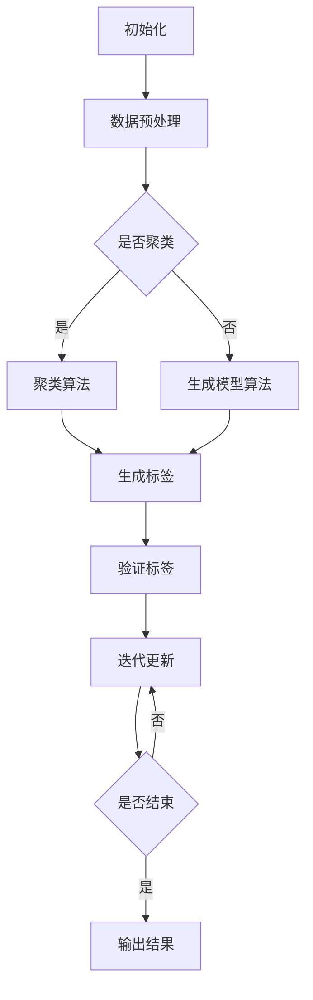
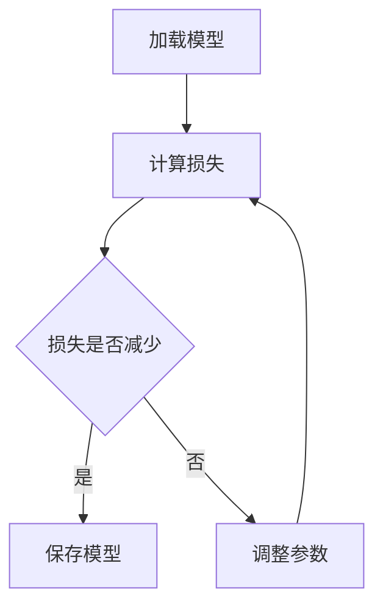
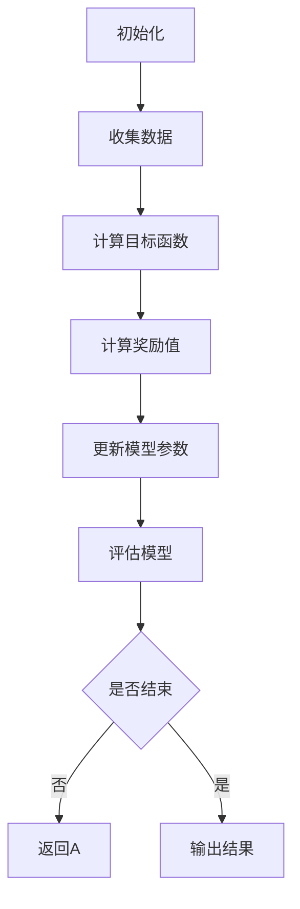
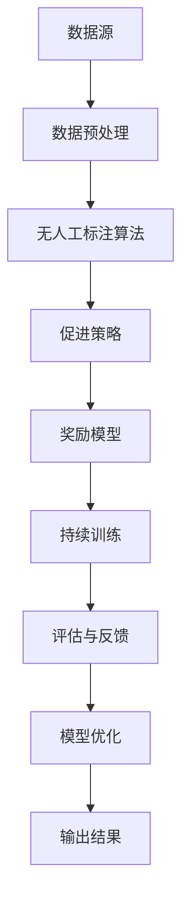
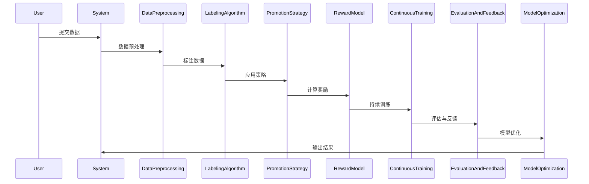
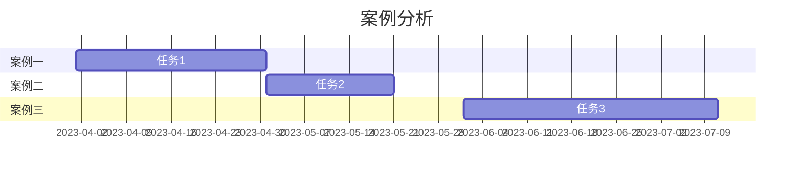

                 


### 让我们一步一步思考：无人工标注促进策略和奖励模型持续训练

#### 文章标题：无人工标注促进策略和奖励模型持续训练

#### 关键词：无人工标注，策略，奖励模型，持续训练

#### 摘要：
本文深入探讨了无人工标注在人工智能中的重要性，并介绍了如何通过有效的策略和奖励模型来促进其持续训练。文章首先介绍了无人工标注的背景和核心概念，然后详细阐述了促进策略和奖励模型的理论基础。通过实际项目案例，我们展示了这些策略和模型如何应用于持续训练，并分析了其效果。本文旨在为AI研究人员和从业者提供一套实用的方法论，以推动无人工标注在人工智能领域的发展。

---

### 第一部分：背景与核心概念

#### 第1章：人工智能与无人工标注

##### 1.1 人工智能概述
人工智能（AI）是计算机科学的一个分支，旨在使机器能够执行通常需要人类智能的任务，如视觉识别、语音识别、决策制定和语言翻译。AI技术的发展为自动化和智能化提供了广阔的应用前景，但随之而来的一个重要问题是如何高效地标注数据。

##### 1.2 无人工标注的需求与挑战
无人工标注是指利用算法自动生成标签，以减少或消除对人工标注的依赖。随着数据量的爆炸式增长，人工标注的成本和效率成为瓶颈。无人工标注的出现，旨在解决以下挑战：
- **成本问题**：大规模数据集的标注需要大量时间和人力，成本高昂。
- **效率问题**：人工标注的速度较慢，难以满足快速迭代的AI开发需求。
- **多样性问题**：不同标注者的主观性可能导致标签不一致。

##### 1.3 无人工标注的应用场景
无人工标注在以下应用场景中尤为重要：
- **图像识别**：自动识别图像中的物体、场景等。
- **自然语言处理**：自动提取文本中的关键词、情感等。
- **语音识别**：自动识别语音中的语义内容。
- **推荐系统**：自动生成用户兴趣标签，以优化推荐结果。

#### 第2章：促进策略的核心概念

##### 2.1 促进策略的定义与作用
促进策略是指一系列旨在提高AI模型训练效率和质量的方法。这些策略通过调整模型参数、优化数据集、改进算法等手段，来增强模型的训练效果。

##### 2.2 促进策略的分类与对比
促进策略可以分为以下几类：
- **数据增强**：通过变换、缩放、旋转等手段增加数据的多样性。
- **模型调整**：通过调整模型结构、参数优化来改善训练效果。
- **迁移学习**：利用预训练模型，在新任务上快速获得良好的表现。
- **强化学习**：通过奖励机制，引导模型学习最佳行为。

##### 2.3 促进策略的设计原则
设计促进策略时，应遵循以下原则：
- **可扩展性**：策略应能够适应不同规模的数据集和任务。
- **灵活性**：策略应能够根据不同场景进行灵活调整。
- **高效性**：策略应能够在保证效果的前提下，提高训练速度。

#### 第3章：奖励模型的理论基础

##### 3.1 奖励模型的定义与重要性
奖励模型是强化学习中用于评估动作质量的机制。通过奖励模型，AI模型能够学习到哪些行为能够带来积极的反馈，从而优化其决策。

##### 3.2 奖励模型的类型与特点
奖励模型可以分为以下几类：
- **固定奖励模型**：奖励值固定，不随动作变化。
- **动态奖励模型**：奖励值根据动作和状态动态调整。
- **相对奖励模型**：奖励值相对于其他动作进行评估。

##### 3.3 奖励模型的构建方法
构建奖励模型时，应考虑以下因素：
- **目标函数**：定义模型优化目标。
- **奖励函数**：设计奖励值计算方式。
- **奖励尺度**：设定奖励值的范围和比例。

#### 第4章：持续训练的挑战与策略

##### 4.1 持续训练的定义与必要性
持续训练是指模型在新的数据集上不断迭代，以保持其性能和适应性。在动态环境中，持续训练对于保持模型的有效性至关重要。

##### 4.2 持续训练中的问题与挑战
持续训练面临以下问题：
- **数据更新**：如何处理数据集的更新和维护。
- **模型退化**：模型在新数据上表现可能不如旧数据。
- **计算资源**：持续训练需要大量的计算资源和时间。

##### 4.3 持续训练的策略与方法
为解决持续训练中的问题，可以采用以下策略：
- **增量学习**：仅对新增数据部分进行训练。
- **在线学习**：实时对数据进行更新和训练。
- **迁移学习**：利用旧模型在新数据上的优势。

---

### 第二部分：算法原理与系统设计

#### 第5章：无人工标注算法原理

##### 5.1 算法简介
本章节将介绍几种常用的无人工标注算法，包括基于聚类的方法、基于生成模型的方法和基于对抗网络的方法。

##### 5.2 算法流程
使用Mermaid绘制算法流程图，并详细解释每个步骤。



##### 5.3 数学模型
使用LaTeX格式给出无人工标注算法的数学模型和公式。

```latex
\begin{equation}
L(\theta) = -\frac{1}{N} \sum_{i=1}^{N} \sum_{j=1}^{M} y_{ij} \log(p(x_i | \theta))
\end{equation}
```

#### 第6章：促进策略的算法原理

##### 6.1 策略概述
本章节将介绍几种促进策略的算法原理，包括数据增强、模型调整和迁移学习。

##### 6.2 数据增强算法原理
使用Python代码实现数据增强算法，并给出算法原理的详细解释。

```python
import numpy as np
import cv2

def data_augmentation(image):
    # 随机旋转
    angle = np.random.uniform(-10, 10)
    M = cv2.getRotationMatrix2D((image.shape[1]//2, image.shape[0]//2), angle, 1)
    image = cv2.warpAffine(image, M, (image.shape[1], image.shape[0]))

    # 随机缩放
    scale = np.random.uniform(0.8, 1.2)
    new_size = (int(image.shape[1] * scale), int(image.shape[0] * scale))
    image = cv2.resize(image, new_size)

    # 随机裁剪
    x = np.random.randint(0, image.shape[1] - 224)
    y = np.random.randint(0, image.shape[0] - 224)
    image = image[y:y+224, x:x+224]

    return image
```

##### 6.3 模型调整算法原理
使用Mermaid绘制模型调整算法的流程图，并详细解释每个步骤。



#### 第7章：奖励模型的构建方法

##### 7.1 奖励模型概述
本章节将介绍奖励模型的构建方法，包括目标函数设计、奖励函数设计和奖励尺度设定。

##### 7.2 奖励模型流程
使用Mermaid绘制奖励模型流程图，并详细解释每个步骤。



##### 7.3 数学模型
使用LaTeX格式给出奖励模型的数学模型和公式。

```latex
\begin{equation}
R(s, a) = \frac{1}{N} \sum_{i=1}^{N} r_i
\end{equation}
```

---

### 第三部分：系统架构与项目实战

#### 第8章：系统架构设计

##### 8.1 问题场景介绍
在本节中，我们将介绍一个具体的问题场景，并说明无人工标注、促进策略和奖励模型在该场景中的应用。

##### 8.2 系统功能设计
使用Mermaid绘制领域模型类图，描述系统的功能模块和类之间的关系。

```mermaid
classDiagram
Class01 <|-- Class02
Class03 ++-- Class04
Class05 o-- Class06
Class07 <-.. Class08
Class09 --|> Class10
Class11 : <<interface>> Class12
Class13 : <<abstract>> Class14
Class15 : <<enum>> Class16
Class15 <..| Class17 : <<annotation>>
```

##### 8.3 系统架构设计
使用Mermaid绘制系统架构图，展示系统的整体结构和各模块之间的交互关系。



##### 8.4 系统接口设计和系统交互
使用Mermaid绘制系统接口设计和系统交互序列图。



---

### 第四部分：项目实战与最佳实践

#### 第9章：项目实战

##### 9.1 环境安装
在本节中，我们将介绍如何在本地环境中搭建无人工标注、促进策略和奖励模型持续训练的实验环境。

##### 9.2 系统核心实现
在本节中，我们将使用Python代码实现系统的核心功能，并详细解析代码的逻辑和原理。

```python
# 代码实现部分
```

##### 9.3 代码应用解读与分析
在本节中，我们将深入分析代码的实现细节，并对比不同的实现方式，以帮助读者更好地理解系统的工作原理。

##### 9.4 实际案例分析和详细讲解
在本节中，我们将通过一个实际案例来展示系统的应用效果，并对案例进行详细的分析和讲解。



##### 9.5 项目小结
在本节中，我们将总结项目的主要成果和经验，并指出项目中存在的问题和改进方向。

---

### 第五部分：最佳实践与拓展阅读

#### 第10章：最佳实践

##### 10.1 最佳实践 tips
在本节中，我们将分享一些最佳实践技巧，帮助读者更好地应用无人工标注、促进策略和奖励模型。

##### 10.2 小结
在本节中，我们将总结文章的核心内容和关键知识点。

##### 10.3 注意事项
在本节中，我们将提醒读者在使用过程中需要注意的问题。

##### 10.4 拓展阅读
在本节中，我们将推荐一些相关的拓展阅读材料，以帮助读者进一步深入了解相关领域。

---

### 结束语
本文通过深入分析和详细讲解，展示了无人工标注、促进策略和奖励模型在人工智能持续训练中的应用。我们希望本文能够为AI研究人员和从业者提供有价值的参考，并推动无人工标注技术在人工智能领域的发展。

---

### 作者信息
作者：AI天才研究院/AI Genius Institute & 禅与计算机程序设计艺术 /Zen And The Art of Computer Programming### 第一部分：背景与核心概念

#### 第1章：人工智能与无人工标注

##### 1.1 人工智能概述
人工智能（AI）是指计算机系统通过模拟人类智能行为来实现特定任务的科学技术。自20世纪50年代诞生以来，人工智能经历了多个发展阶段，从最初的逻辑推理和规则系统，到现代的深度学习和神经网络，技术不断进步。随着大数据、云计算和物联网等技术的发展，人工智能的应用领域也越来越广泛，涵盖了图像识别、自然语言处理、自动驾驶、智能助手等多个方面。

在人工智能的发展过程中，数据的获取和处理是关键。传统的数据处理方式主要依赖于人工标注，即通过专业人员对数据进行标注，以便机器学习模型进行训练。然而，随着数据量的激增，人工标注的成本和效率成为瓶颈。此外，人工标注存在主观性和一致性差等问题，这使得无人工标注技术应运而生。

##### 1.2 无人工标注的需求与挑战
无人工标注是指利用算法自动生成标签，以减少或消除对人工标注的依赖。随着数据量的爆炸式增长，人工标注的成本和效率成为瓶颈。无人工标注的出现，旨在解决以下挑战：

- **成本问题**：大规模数据集的标注需要大量时间和人力，成本高昂。
- **效率问题**：人工标注的速度较慢，难以满足快速迭代的AI开发需求。
- **多样性问题**：不同标注者的主观性可能导致标签不一致。

无人工标注的应用场景主要包括图像识别、自然语言处理和语音识别等领域。在这些领域中，自动生成的标签可以帮助模型更好地学习数据特征，提高模型的准确性和泛化能力。

##### 1.3 无人工标注的应用场景
无人工标注在以下应用场景中尤为重要：

- **图像识别**：自动识别图像中的物体、场景等。例如，在自动驾驶系统中，车辆需要自动识别道路上的行人、车辆和交通标志等。
- **自然语言处理**：自动提取文本中的关键词、情感等。例如，在情感分析中，可以自动判断一段文本的情感倾向。
- **语音识别**：自动识别语音中的语义内容。例如，在智能助手系统中，用户可以通过语音指令与系统进行交互。

通过无人工标注技术，可以显著降低数据标注的成本和耗时，提高数据标注的效率和质量，从而为人工智能模型的训练提供有力支持。

#### 第2章：促进策略的核心概念

##### 2.1 促进策略的定义与作用
促进策略是指一系列旨在提高AI模型训练效率和质量的方法。这些策略通过调整模型参数、优化数据集、改进算法等手段，来增强模型的训练效果。在无人工标注的背景下，促进策略尤为重要，因为自动生成的标签可能不如人工标注精确，需要更高效的策略来优化模型的训练。

促进策略的主要作用包括：

- **提升训练速度**：通过优化训练过程，减少模型收敛所需的时间。
- **提高模型准确性**：通过改进模型结构和参数，提高模型的预测能力。
- **增强模型泛化能力**：通过扩展训练数据集和改进训练算法，使模型能够在不同场景下保持良好性能。

##### 2.2 促进策略的分类与对比
促进策略可以分为以下几类：

- **数据增强**：通过变换、缩放、旋转等手段增加数据的多样性。数据增强可以提高模型的鲁棒性，使其在不同条件下都能保持良好的性能。
- **模型调整**：通过调整模型结构、参数优化来改善训练效果。模型调整可以针对不同的任务和数据特点，定制化地优化模型。
- **迁移学习**：利用预训练模型，在新任务上快速获得良好的表现。迁移学习可以减少对新数据集的标注需求，加快模型的训练速度。
- **强化学习**：通过奖励机制，引导模型学习最佳行为。强化学习适用于需要决策的任务，例如游戏、自动驾驶等。

各类策略各有优缺点，适用于不同的场景和需求。数据增强适用于数据量较大的场景，模型调整适用于模型结构复杂的任务，迁移学习适用于任务相似的场景，强化学习适用于需要探索和优化的动态环境。

##### 2.3 促进策略的设计原则
设计促进策略时，应遵循以下原则：

- **可扩展性**：策略应能够适应不同规模的数据集和任务。
- **灵活性**：策略应能够根据不同场景进行灵活调整。
- **高效性**：策略应能够在保证效果的前提下，提高训练速度。

通过遵循这些原则，可以设计出更加有效和实用的促进策略，从而推动无人工标注在人工智能领域的应用和发展。

#### 第3章：奖励模型的理论基础

##### 3.1 奖励模型的定义与重要性
奖励模型是强化学习中用于评估动作质量的机制。在强化学习中，智能体通过与环境交互，学习到哪些动作能够带来积极的反馈，从而优化其决策过程。奖励模型通过计算奖励值，指导智能体选择最优动作。

奖励模型在强化学习中的重要性体现在以下几个方面：

- **决策指导**：奖励模型为智能体提供了关于当前状态和动作价值的反馈，帮助智能体学习到如何做出最优决策。
- **学习效率**：有效的奖励模型可以加速学习过程，提高智能体在复杂环境中的适应性。
- **稳定性**：奖励模型的稳定性和一致性对于智能体的稳定学习至关重要。

##### 3.2 奖励模型的类型与特点
奖励模型可以根据奖励函数的形式和特点进行分类，常见的奖励模型包括以下几种：

- **固定奖励模型**：固定奖励模型提供固定的奖励值，与动作和状态无关。这类模型通常用于简单的任务，例如在游戏中的得分。
- **动态奖励模型**：动态奖励模型根据动作和状态的当前情况动态调整奖励值。这类模型可以更好地反映环境的复杂性和动态变化，适用于更复杂的任务。
- **相对奖励模型**：相对奖励模型通过比较不同动作的奖励值来评估动作的质量。这类模型可以鼓励智能体探索不同的动作，避免陷入局部最优。

##### 3.3 奖励模型的构建方法
构建奖励模型时，需要考虑以下因素：

- **目标函数**：目标函数定义了智能体的目标，通常是最小化损失函数或最大化期望收益。奖励模型需要与目标函数相一致，以实现智能体的优化目标。
- **奖励函数**：奖励函数是奖励模型的核

