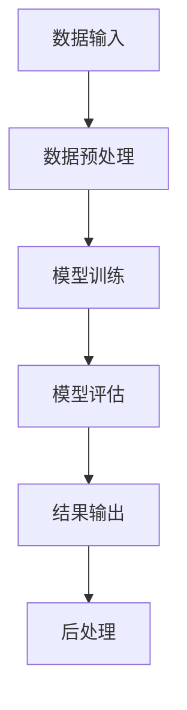

                 

# 无标注学习：AI训练的未来方向

## 关键词
- 无标注学习
- 自监督学习
- 无监督学习
- 深度学习
- 人工智能
- 应用前景
- 技术挑战

## 摘要
本文深入探讨了无标注学习作为人工智能训练的未来方向的重要性。我们首先介绍了无标注学习的背景和意义，随后分析了其与传统标注学习的差异和优势。接着，我们详细阐述了无标注学习的核心概念、主要算法原理以及数学模型。文章还通过具体领域的应用实例展示了无标注学习的实际效果，并探讨了其系统架构与实现方法。最后，我们总结了无标注学习的最佳实践，展望了其未来的发展趋势和应用前景。

### 目录大纲

----------------------------------------------------------------

# 第一部分：无标注学习概述

## 第1章：无标注学习的背景与意义
- 1.1 无标注学习的定义
- 1.2 无标注学习的起源与发展
- 1.3 无标注学习的重要性
- 1.4 无标注学习的应用领域

## 第2章：无标注学习的核心概念与联系
- 2.1 无标注学习的核心概念
- 2.2 无标注学习与传统标注学习的对比
- 2.3 无标注学习与其他AI技术的联系

## 第3章：无标注学习的主要算法原理
- 3.1 无监督学习算法
- 3.2 自监督学习算法
- 3.3 无监督与自监督学习相结合的算法

## 第4章：无标注学习的数学模型与公式
- 4.1 无监督学习数学模型
- 4.2 自监督学习数学模型
- 4.3 无监督与自监督学习相结合的数学模型

## 第5章：无标注学习在具体领域的应用
- 5.1 图像处理
- 5.2 自然语言处理
- 5.3 语音识别

## 第6章：无标注学习的系统架构与实现
- 6.1 系统架构设计
- 6.2 系统核心实现
- 6.3 系统接口设计
- 6.4 系统交互流程

## 第7章：无标注学习的项目实战
- 7.1 项目环境搭建
- 7.2 系统核心代码实现
- 7.3 项目应用分析
- 7.4 项目优化与拓展

## 第8章：无标注学习的最佳实践与总结
- 8.1 最佳实践技巧
- 8.2 小结与展望
- 8.3 拓展阅读

----------------------------------------------------------------

## 第1章：无标注学习的背景与意义

### 1.1 无标注学习的定义

无标注学习（Unsupervised Learning）是指在没有外部标注数据的情况下，让机器学习算法自动从数据中发现模式和规律的一种学习方式。与监督学习（Supervised Learning）和强化学习（Reinforcement Learning）不同，无标注学习不需要预先标记好的数据标签。这种学习方式主要用于处理大量的未标注数据，目的是揭示数据中的隐藏结构，如图像中的物体、文本中的主题等。

### 1.2 无标注学习的起源与发展

无标注学习最早可以追溯到20世纪50年代，当时主要以人工神经网络和统计模型为基础。随着计算机硬件性能的提升和数据规模的扩大，无标注学习逐渐发展起来，并在21世纪初迎来了快速发展。近年来，随着深度学习技术的成熟，无标注学习在计算机视觉、自然语言处理、语音识别等领域的应用取得了显著进展。

### 1.3 无标注学习的重要性

无标注学习的重要性主要体现在以下几个方面：

1. **节省标注成本**：在监督学习中，标注数据往往需要大量人力和时间。无标注学习可以减少这一成本，特别是在数据量庞大且标注困难的情况下。

2. **发掘隐藏信息**：无标注学习能够自动从数据中发现潜在的模式和结构，这些信息对于决策支持、知识发现等领域具有重要意义。

3. **适应性强**：无标注学习算法对数据分布的适应性较强，可以在不同领域和场景中发挥作用。

4. **促进技术进步**：无标注学习为人工智能技术的发展提供了新的思路和方法，有助于推动相关领域的创新。

### 1.4 无标注学习的应用领域

无标注学习在多个领域展现了广泛的应用前景，以下是一些典型的应用场景：

1. **图像识别与处理**：通过无标注学习，可以自动识别图像中的物体、场景和动作。

2. **自然语言处理**：无标注学习可以用于文本分类、情感分析、主题建模等任务。

3. **语音识别**：无标注学习有助于自动识别语音中的语音信号，提高语音识别系统的准确率。

4. **推荐系统**：无标注学习可以用于发现用户兴趣，为用户提供个性化的推荐。

5. **生物信息学**：无标注学习在基因组学、蛋白质结构预测等领域具有广泛应用。

接下来，我们将进一步探讨无标注学习的核心概念和联系，以更深入地理解这一领域。在下一章中，我们将详细介绍无标注学习的核心概念，并对比其与传统标注学习的差异。

## 第2章：无标注学习的核心概念与联系

### 2.1 无标注学习的核心概念

无标注学习的核心概念主要包括无监督学习和自监督学习。这些概念不仅为无标注学习提供了理论基础，也在实际应用中发挥着重要作用。

#### 2.1.1 无监督学习

无监督学习（Unsupervised Learning）是一种机器学习方法，其主要目标是发现数据中的隐含结构和模式。无监督学习不需要预先标记的数据标签，而是通过学习数据内在的结构来揭示其特征。常见的无监督学习算法包括聚类（Clustering）和降维（Dimensionality Reduction）。

- **聚类算法**：将数据分为多个群组，使得同一群组内的数据点尽可能接近，而不同群组的数据点尽可能远离。常用的聚类算法有K-means、DBSCAN等。
- **降维算法**：将高维数据映射到低维空间，同时保持数据的本质特征。常见的降维算法有PCA（主成分分析）、t-SNE等。

#### 2.1.2 自监督学习

自监督学习（Self-supervised Learning）是一种无监督学习方法，它通过利用数据内部的固有结构来进行训练。自监督学习的关键在于设计一个目标函数，使得模型能够在没有外部标注的情况下进行优化。常见的自监督学习算法包括预训练和自编码器（Autoencoder）。

- **预训练**：通过在大规模未标注数据集上训练模型，使其学会提取数据中的特征，然后再在特定任务上进行微调。预训练在自然语言处理和计算机视觉领域取得了显著成果。
- **自编码器**：一种特殊的神经网络模型，其目的是学习如何将输入数据编码为一种低维表示，然后再将这种表示解码回原始数据。自编码器广泛应用于图像压缩、特征提取等任务。

### 2.2 无标注学习与传统标注学习的对比

无标注学习和传统标注学习在数据需求、成本和效果等方面存在显著差异。

#### 2.2.1 对比分析

- **数据需求**：无标注学习不需要预先标记的数据标签，因此适用于大量未标注的数据。而传统标注学习需要大量的标注数据，这在数据规模较大时可能成为瓶颈。
- **成本**：无标注学习可以显著降低标注成本，特别是在标注任务繁琐且数据量庞大的情况下。传统标注学习需要大量人力和时间，成本较高。
- **效果**：无标注学习在数据分布适应性和模式发现方面具有优势，但可能不如标注学习在特定任务上表现优异。此外，无标注学习算法的模型可解释性通常较低。

#### 2.2.2 无标注学习的优势

- **数据多样性**：无标注学习可以处理各种类型的数据，包括图像、文本、音频等。
- **自动化**：无标注学习算法可以自动化地提取数据特征，减少人为干预。
- **可扩展性**：无标注学习算法可以轻松地扩展到大规模数据集，适用于实时数据处理。

### 2.3 无标注学习与其他AI技术的联系

无标注学习在人工智能领域与其他技术紧密相关，如深度学习和强化学习。

#### 2.3.1 与深度学习的结合

深度学习（Deep Learning）是近年来人工智能领域的重要突破。无标注学习与深度学习相结合，可以发挥各自的优势。例如，在计算机视觉中，无标注学习可以用于图像分类、目标检测等任务，而深度学习则可以用于复杂特征提取和模型优化。

- **预训练与微调**：深度学习模型通常在大规模无标注数据集上进行预训练，然后在特定任务上进行微调。这种方法可以提高模型的泛化能力。
- **迁移学习**：无标注学习可以帮助迁移学习（Transfer Learning）更好地适应新的任务，特别是在标注数据稀缺的情况下。

#### 2.3.2 与强化学习的融合

强化学习（Reinforcement Learning）是一种通过试错和反馈进行学习的机器学习方法。无标注学习与强化学习相结合，可以进一步提高智能体在复杂环境中的学习能力。

- **探索与利用**：无标注学习可以帮助强化学习在探索阶段更好地发现环境中的潜在结构，从而在利用阶段做出更优的决策。
- **数据增强**：无标注学习可以生成大量虚拟数据，用于训练强化学习模型，从而提高其性能和稳定性。

总之，无标注学习作为人工智能训练的未来方向，不仅为数据驱动的智能系统提供了新的方法，也为解决实际问题和推动技术进步提供了可能。在下一章中，我们将深入探讨无标注学习的主要算法原理，以更全面地理解这一领域。

## 第3章：无标注学习的主要算法原理

### 3.1 无监督学习算法

无监督学习算法是机器学习中的一种重要方法，其核心思想是从未标记的数据中自动发现数据结构和模式。以下是一些常见的无监督学习算法及其基本原理：

#### 3.1.1 聚类算法

聚类算法是一种将数据点划分为若干个群组的无监督学习方法。聚类算法通过最大化群组内数据点的相似度，最小化群组间数据点的相似度来实现数据的分组。

- **K-means算法**：K-means算法是一种基于距离度量的聚类算法。它通过迭代计算来确定数据点所属的群组，并不断更新群组的中心点，直到收敛。
  - **算法流程**：
    1. 随机初始化K个中心点。
    2. 计算每个数据点到各个中心点的距离，并将数据点分配到最近的中心点所属的群组。
    3. 计算每个群组的中心点，更新中心点的位置。
    4. 重复步骤2和3，直到中心点的位置不再发生显著变化。
  - **Mermaid流程图**：
    ```mermaid
    graph TD
    A[初始化中心点] --> B[计算距离]
    B --> C{是否收敛?}
    C -->|是| D[结束]
    C -->|否| B
    ```

- **DBSCAN算法**：DBSCAN（Density-Based Spatial Clustering of Applications with Noise）是一种基于密度的聚类算法，它可以发现任意形状的群组，并能够处理噪声和异常值。
  - **算法流程**：
    1. 初始化参数，包括邻域半径`eps`和最小密度`minPts`。
    2. 对每个未分类的数据点进行邻域查询，找到其邻域内的所有数据点。
    3. 如果邻域内的数据点数量大于`minPts`，则将该数据点及其邻域内的所有数据点划分为一个新群组。
    4. 对剩余的未分类数据点重复步骤2和3，直到所有数据点都被分类或确定其为噪声点。
  - **Mermaid流程图**：
    ```mermaid
    graph TD
    A[初始化参数] --> B[邻域查询]
    B --> C{邻域内点数 > minPts?}
    C -->|是| D[创建群组]
    C -->|否| E[标记噪声点]
    D --> F[未分类点]
    F -->|未分类| B
    ```

#### 3.1.2 降维算法

降维算法是一种将高维数据映射到低维空间的方法，旨在降低数据维度同时保持数据的关键特征。

- **PCA（主成分分析）**：PCA是一种基于方差最大化原则的降维算法。它通过计算数据的主要成分（主成分），将数据投影到新的低维空间中。
  - **算法原理**：
    1. 计算数据的均值向量。
    2. 计算协方差矩阵。
    3. 计算协方差矩阵的特征值和特征向量。
    4. 选择最大的特征值对应的特征向量作为新空间的基础。
    5. 将数据投影到新空间中。
  - **Mermaid流程图**：
    ```mermaid
    graph TD
    A[计算均值] --> B[计算协方差]
    B --> C[计算特征值和特征向量]
    C --> D[选择最大特征值]
    D --> E[投影到新空间]
    ```

- **t-SNE（t-Distributed Stochastic Neighbor Embedding）**：t-SNE是一种基于相似度度量的降维算法，特别适用于高维数据的可视化。它通过计算数据点的概率分布，将高维数据映射到二维空间中。
  - **算法原理**：
    1. 计算数据点的局部概率分布。
    2. 构建一个相似度矩阵。
    3. 使用梯度下降优化目标函数，最小化高维空间和低维空间中概率分布的差异。
    4. 将数据点投影到二维空间中。
  - **Mermaid流程图**：
    ```mermaid
    graph TD
    A[计算局部概率]
    A --> B[构建相似度矩阵]
    B --> C[梯度下降优化]
    C --> D[投影到二维空间]
    ```

#### 3.1.3 算法比较与选择

不同无监督学习算法适用于不同类型的数据和任务。以下是几种常见算法的比较：

- **适用场景**：
  - K-means：适用于聚类任务，对初始聚类中心敏感。
  - DBSCAN：适用于发现任意形状的聚类，能够处理噪声和异常值。
  - PCA：适用于降维和特征提取，特别适用于线性可分的数据。
  - t-SNE：适用于高维数据的可视化，能够发现数据的局部结构。

- **选择依据**：
  - 数据类型：根据数据的分布和结构选择合适的算法。
  - 任务目标：根据聚类、降维或特征提取的需求选择相应的算法。
  - 数据量：考虑算法的计算复杂度和数据规模。

通过以上算法的详细讲解，我们可以看到无监督学习算法在无标注学习中的重要性。在下一章中，我们将探讨自监督学习算法及其在无标注学习中的应用。

### 3.2 自监督学习算法

自监督学习是一种无监督学习方法，其主要目标是通过利用数据内部的固有结构来自动学习模型。自监督学习通过设计一种目标函数，使得模型能够在没有外部标注的情况下进行优化。以下是一些常见的自监督学习算法及其基本原理：

#### 3.2.1 预训练

预训练（Pre-training）是一种常见的自监督学习方法，其核心思想是首先在大规模无标注数据集上训练一个基础模型，然后在特定任务上进行微调（Fine-tuning）。预训练能够帮助模型学习到通用特征，从而在新的任务上取得更好的表现。

- **算法原理**：
  1. 在大规模无标注数据集（如ImageNet、TextCorp）上训练基础模型。
  2. 在特定任务数据集上对基础模型进行微调。
  3. 使用微调后的模型进行预测或决策。

- **Mermaid流程图**：
  ```mermaid
  graph TD
  A[预训练基础模型] --> B[微调模型]
  B --> C[进行预测或决策]
  ```

#### 3.2.2 自编码器

自编码器（Autoencoder）是一种特殊的神经网络模型，其目的是学习如何将输入数据编码为一种低维表示，然后再将这种表示解码回原始数据。自编码器广泛应用于图像压缩、特征提取等任务。

- **算法原理**：
  1. 输入数据通过编码器（Encoder）压缩为低维表示。
  2. 低维表示通过解码器（Decoder）还原为原始数据。
  3. 使用损失函数（如均方误差）来评估编码和解码的误差，并通过反向传播优化模型参数。

- **Mermaid流程图**：
  ```mermaid
  graph TD
  A[输入数据] --> B[编码器]
  B --> C[低维表示]
  C --> D[解码器]
  D --> E[输出数据]
  ```

- **Python源代码示例**：
  ```python
  import numpy as np
  from sklearn.neural_network import MLPRegressor

  # 示例数据
  X = np.random.rand(100, 100)

  # 编码器模型
  encoder = MLPRegressor(hidden_layer_sizes=(50,), activation='relu', solver='sgd', alpha=1e-4,
                         learning_rate='adaptive', max_iter=200)

  # 解码器模型
  decoder = MLPRegressor(hidden_layer_sizes=(50,), activation='relu', solver='sgd', alpha=1e-4,
                         learning_rate='adaptive', max_iter=200)

  # 训练编码器和解码器
  encoder.fit(X, X)
  decoder.fit(encoder.predict(X), X)

  # 输出编码后的数据
  encoded_data = encoder.predict(X)

  # 输出解码后的数据
  decoded_data = decoder.predict(encoded_data)
  ```

#### 3.2.3 自监督学习与深度学习的结合

自监督学习与深度学习相结合，可以发挥各自的优势，提高模型的性能和泛化能力。以下是一些典型的结合方法：

- **预训练与微调**：在深度学习中，预训练通常用于在大规模无标注数据集上训练基础模型，然后在特定任务上进行微调。这种方法能够提高模型对未见数据的适应能力。
- **多任务学习**：在自监督学习中，多任务学习通过同时学习多个任务来提高模型的泛化能力。深度学习中的多任务学习通常利用共享的底层特征提取网络。
- **对抗性训练**：对抗性训练是一种自监督学习方法，通过生成对抗网络（GAN）来学习数据的分布。这种方法在生成模型和判别模型之间进行对抗训练，以使生成模型能够生成逼真的数据。

通过以上对自监督学习算法的详细讲解，我们可以看到自监督学习在无标注学习中的重要性。自监督学习不仅能够自动提取数据特征，还为深度学习模型提供了有效的预训练方法。在下一章中，我们将探讨无监督与自监督学习相结合的算法及其应用。

### 3.3 无监督与自监督学习相结合的算法

无监督学习与自监督学习的结合，可以充分发挥两种方法的优点，从而在数据发现、特征提取和模型训练等方面取得更好的效果。以下将介绍几种常见的结合算法及其应用。

#### 3.3.1 基本概念

无监督学习与自监督学习相结合的算法，通常通过以下几种方式实现：

- **联合训练**：将无监督学习和自监督学习过程联合训练，使得模型能够同时学习数据结构和特征表示。
- **交替训练**：首先通过无监督学习提取数据特征，然后使用自监督学习对特征进行进一步优化，交替进行直到收敛。
- **模块化设计**：将无监督学习和自监督学习模块化，根据任务需求灵活组合使用。

#### 3.3.2 常见算法介绍

- **生成对抗网络（GAN）**：生成对抗网络是一种自监督学习算法，通过生成器和判别器的对抗训练来生成逼真的数据。GAN在图像生成、风格迁移和图像修复等领域取得了显著成果。

  - **算法原理**：
    1. 生成器G从随机噪声中生成数据。
    2. 判别器D区分真实数据和生成数据。
    3. 通过最小化生成器和判别器的损失函数，使得生成器生成的数据越来越逼真。
  - **Mermaid流程图**：
    ```mermaid
    graph TD
    A[随机噪声] --> B[生成器G]
    B --> C[生成数据]
    C --> D[判别器D]
    D --> E{D区分真实与生成数据}
    E -->|区分结果| F[更新参数]
    ```

- **变分自编码器（VAE）**：变分自编码器是一种自监督学习算法，通过引入概率模型来生成数据。VAE在图像生成、数据去噪和特征提取等领域具有广泛的应用。

  - **算法原理**：
    1. 编码器编码输入数据为均值和方差。
    2. 生成器根据编码器的输出生成数据。
    3. 通过最大化数据似然函数来优化模型参数。
  - **Mermaid流程图**：
    ```mermaid
    graph TD
    A[输入数据] --> B[编码器]
    B --> C[均值和方差]
    C --> D[生成器]
    D --> E[生成数据]
    ```

- **自监督深度学习**：自监督深度学习是一种将自监督学习与深度学习相结合的方法，通过设计特殊的目标函数来训练深度学习模型。自监督深度学习在语音识别、自然语言处理和计算机视觉等领域取得了显著成果。

  - **算法原理**：
    1. 设计特殊的目标函数，使得模型在训练过程中能够自动学习数据特征。
    2. 使用深度神经网络进行特征提取和模型优化。
    3. 通过迭代优化目标函数，提高模型性能。
  - **Mermaid流程图**：
    ```mermaid
    graph TD
    A[设计目标函数] --> B[训练深度神经网络]
    B --> C[优化模型参数]
    C --> D[提高模型性能]
    ```

#### 3.3.3 算法比较与选择

不同结合算法适用于不同类型的数据和任务。以下是几种常见算法的比较：

- **适用场景**：
  - GAN：适用于图像生成、风格迁移和图像修复等任务。
  - VAE：适用于图像生成、数据去噪和特征提取等任务。
  - 自监督深度学习：适用于语音识别、自然语言处理和计算机视觉等任务。

- **选择依据**：
  - 数据类型：根据数据的分布和结构选择合适的算法。
  - 任务目标：根据图像生成、特征提取或模型优化等需求选择相应的算法。
  - 计算资源：考虑算法的计算复杂度和所需硬件资源。

通过以上对无监督与自监督学习相结合算法的介绍，我们可以看到这种结合方法在无标注学习中的重要性。无监督与自监督学习相结合的算法不仅能够自动提取数据特征，还能够在多种任务中取得优异的性能。在下一章中，我们将探讨无标注学习的数学模型与公式。

### 3.4 无标注学习的数学模型与公式

无标注学习的数学模型是理解其工作原理和实现算法的基础。以下是几种常见无标注学习算法的数学模型与公式。

#### 3.4.1 无监督学习数学模型

- **K-means算法**

  K-means算法是一种基于距离度量的聚类算法。其核心思想是通过迭代优化聚类中心，将数据点划分为K个群组。

  - **模型定义**：
    设数据集为`X = {x_1, x_2, ..., x_n}`，聚类中心为`μ_k`，数据点`x_i`到聚类中心`μ_k`的距离为`d(x_i, μ_k)`。
    $$ \min_{\mu_k} \sum_{i=1}^{n} d(x_i, μ_k)^2 $$

  - **模型公式**：
    1. 初始化K个聚类中心`μ_k`。
    2. 对于每个数据点`x_i`，计算其到各个聚类中心的距离，并将其分配到距离最近的聚类中心所在的群组。
    3. 更新聚类中心为群组内所有数据点的平均值。
    4. 重复步骤2和3，直到聚类中心不再发生显著变化。

- **DBSCAN算法**

  DBSCAN算法是一种基于密度的聚类算法，能够发现任意形状的聚类，并能够处理噪声和异常值。

  - **模型定义**：
    设数据集为`X = {x_1, x_2, ..., x_n}`，邻域半径为`eps`，最小密度为`minPts`。
    $$ C = \{x_i | \exists x_j \in X, d(x_i, x_j) < eps \text{ 且 } \text{count}(x_j) > minPts\} $$

  - **模型公式**：
    1. 初始化参数`eps`和`minPts`。
    2. 对每个未分类的数据点`x_i`，进行邻域查询，找到其邻域内的所有数据点。
    3. 如果邻域内的数据点数量大于`minPts`，则将该数据点及其邻域内的所有数据点划分为一个新群组。
    4. 对剩余的未分类数据点重复步骤2和3，直到所有数据点都被分类或确定其为噪声点。

- **PCA算法**

  PCA是一种基于方差最大化原则的降维算法，旨在找到数据的主要成分。

  - **模型定义**：
    设数据集为`X = {x_1, x_2, ..., x_n}`，协方差矩阵为`Σ`，特征值为`λ_i`，特征向量为`v_i`。
    $$ \max_{v} \frac{1}{n} \sum_{i=1}^{n} (x_i - \mu)^T \Sigma (x_i - \mu) $$

  - **模型公式**：
    1. 计算数据集的均值向量`μ`。
    2. 计算协方差矩阵`Σ`。
    3. 计算协方差矩阵的特征值和特征向量。
    4. 选择最大的特征值对应的特征向量作为新空间的基础。
    5. 将数据点投影到新空间中。

#### 3.4.2 自监督学习数学模型

- **生成对抗网络（GAN）**

  生成对抗网络通过生成器和判别器的对抗训练来生成逼真的数据。

  - **模型定义**：
    设生成器为`G(z)`,判别器为`D(x)`,损失函数为`L_G`和`L_D`。
    $$ G(z) : \mathbb{R}^z \rightarrow \mathbb{R}^x $$
    $$ D(x) : \mathbb{R}^x \rightarrow [0, 1] $$

  - **模型公式**：
    1. 生成器G从随机噪声`z`中生成数据`x`。
    2. 判别器D区分真实数据和生成数据`x`。
    3. 通过最小化生成器和判别器的损失函数，使得生成器生成的数据越来越逼真。

- **变分自编码器（VAE）**

  变分自编码器通过概率模型来生成数据，并引入了KL散度来保证生成的数据符合先验分布。

  - **模型定义**：
    设编码器为`q_{\phi}(x|\theta)`,解码器为`p_{\theta}(x|z)`,损失函数为`L_V`和`L_KL`。
    $$ q_{\phi}(x|\theta) : \mathbb{R}^x \rightarrow \mathbb{R}^z $$
    $$ p_{\theta}(x|z) : \mathbb{R}^z \rightarrow \mathbb{R}^x $$

  - **模型公式**：
    1. 编码器q从输入数据`x`中编码出均值`μ`和方差`σ^2`。
    2. 解码器p根据编码器的输出`z`生成数据`x`。
    3. 通过最大化数据似然函数和最小化KL散度，优化模型参数。

通过以上对无监督学习和自监督学习数学模型的详细讲解，我们可以更好地理解无标注学习的工作原理。这些数学模型不仅为算法提供了理论基础，也为实际应用提供了重要的指导。在下一章中，我们将探讨无标注学习在具体领域的应用。

## 第4章：无标注学习在具体领域的应用

### 4.1 图像处理

图像处理领域广泛利用无标注学习算法来发现数据中的隐藏结构和模式。以下是无标注学习在图像处理中的主要应用：

#### 4.1.1 无标注学习在图像处理中的应用场景

1. **图像分类**：通过无标注学习算法，如K-means聚类，可以自动对图像进行分类，无需人工标注。这种方法在图像库管理和搜索引擎中非常有用。
2. **目标检测**：自监督学习算法，如生成对抗网络（GAN），可以用于自动检测图像中的目标。例如，GAN可以通过生成虚假图像和真实图像的训练，提高目标检测算法的准确率。
3. **图像去噪与增强**：变分自编码器（VAE）等自监督学习算法可以用于图像去噪和增强。这些算法通过学习图像数据的分布，可以自动生成高质量的图像。
4. **图像超分辨率**：自监督深度学习算法，如自监督深度卷积网络，可以用于提高图像的分辨率。这些算法通过自动学习图像的高频和低频特征，可以生成清晰、细节丰富的图像。

#### 4.1.2 无标注学习在图像识别中的应用实例

以下是一个使用K-means算法进行图像识别的实例：

```python
import numpy as np
from sklearn.cluster import KMeans
from sklearn.datasets import load_iris
import matplotlib.pyplot as plt

# 加载鸢尾花数据集
iris = load_iris()
X = iris.data

# 使用K-means算法对数据集进行聚类
kmeans = KMeans(n_clusters=3, random_state=42)
kmeans.fit(X)

# 获取聚类结果
labels = kmeans.labels_

# 可视化聚类结果
plt.scatter(X[:, 0], X[:, 1], c=labels)
plt.xlabel('Sepal Length')
plt.ylabel('Sepal Width')
plt.title('K-means Clustering of Iris Dataset')
plt.show()
```

在这个实例中，我们使用了鸢尾花数据集，并使用K-means算法对数据进行聚类。通过可视化聚类结果，我们可以看到图像中不同的花卉类别。

### 4.2 自然语言处理

自然语言处理（NLP）领域也广泛利用无标注学习算法来处理文本数据。以下是无标注学习在NLP中的主要应用：

#### 4.2.1 无标注学习在自然语言处理中的应用场景

1. **文本分类**：通过无标注学习算法，如K-means聚类，可以自动对文本进行分类，无需人工标注。这种方法在情感分析、新闻分类和垃圾邮件过滤中非常有用。
2. **主题建模**：自监督学习算法，如LDA（Latent Dirichlet Allocation），可以用于自动发现文本数据中的主题。LDA在文档分类、信息检索和推荐系统中应用广泛。
3. **词向量化**：自监督学习算法，如Word2Vec，可以用于将单词映射到高维向量空间，从而捕捉单词的语义信息。这种方法在情感分析、文本相似度和问答系统中应用广泛。

#### 4.2.2 无标注学习在文本分类中的应用实例

以下是一个使用LDA进行文本分类的实例：

```python
import numpy as np
from sklearn.datasets import fetch_20newsgroups
from sklearn.decomposition import LatentDirichletAllocation
from sklearn.feature_extraction.text import TfidfVectorizer

# 加载新闻数据集
newsgroups = fetch_20newsgroups(subset='all')
X = newsgroups.data
y = newsgroups.target

# 使用TF-IDF向量器将文本转换为向量
tfidf_vectorizer = TfidfVectorizer(max_df=0.95, max_features=1000, stop_words='english')
X_tfidf = tfidf_vectorizer.fit_transform(X)

# 使用LDA进行主题建模
lda = LatentDirichletAllocation(n_components=20, random_state=42)
lda.fit(X_tfidf)

# 获取每个主题的词语
feature_names = tfidf_vectorizer.get_feature_names_out()
for topic_idx, topic in enumerate(lda.components_):
    print(f"Topic #{topic_idx}:")
    print(" ".join([feature_names[i] for i in topic.argsort()[:-10:-1]]))

# 可视化LDA模型
from sklearn.manifold import TSNE
tsne = TSNE(n_components=2, random_state=42)
X_tsne = tsne.fit_transform(X_tfidf)

plt.figure(figsize=(12, 8))
for i, label in enumerate(newsgroups.target_names):
    plt.scatter(X_tsne[y == i, 0], X_tsne[y == i, 1], label=label)
plt.xlabel('Feature 1')
plt.ylabel('Feature 2')
plt.legend()
plt.title('LDA Visualization of News Data')
plt.show()
```

在这个实例中，我们使用了20个新闻数据集，并使用LDA进行主题建模。通过可视化LDA模型，我们可以看到不同主题的分布情况。

### 4.3 语音识别

语音识别领域也利用无标注学习算法来提高系统的性能。以下是无标注学习在语音识别中的主要应用：

#### 4.3.1 无标注学习在语音识别中的应用场景

1. **声学模型训练**：无监督学习算法，如深度自编码器（Deep Autoencoder），可以用于训练声学模型，从而提高语音识别系统的性能。
2. **语音增强**：自监督学习算法，如生成对抗网络（GAN），可以用于增强语音信号，提高语音识别系统的鲁棒性。
3. **说话人识别**：自监督学习算法，如隐马尔可夫模型（HMM），可以用于说话人识别，从而提高系统的准确性。

#### 4.3.2 无标注学习在语音分类中的应用实例

以下是一个使用深度自编码器进行语音分类的实例：

```python
import numpy as np
import librosa
from keras.models import Model
from keras.layers import Input, Dense, Conv1D, MaxPooling1D, Flatten, LSTM
from keras.optimizers import Adam

# 读取语音文件
def read_audio_file(file_path):
    y, sr = librosa.load(file_path)
    return y

# 获取语音特征
def extract_mel_spectrogram(y, sr=None, n_mels=128, n_fft=2048, hop_length=512):
    S = librosa.feature.melspectrogram(y=y, sr=sr, n_mels=n_mels, n_fft=n_fft, hop_length=hop_length)
    return S

# 构建深度自编码器模型
input_shape = (None,)
input_layer = Input(shape=input_shape)
x = Conv1D(32, 3, activation='relu', padding='same')(input_layer)
x = MaxPooling1D(pool_size=2)(x)
x = Conv1D(64, 3, activation='relu', padding='same')(x)
x = MaxPooling1D(pool_size=2)(x)
x = Flatten()(x)
x = Dense(64, activation='relu')(x)
encoded = Dense(32, activation='relu')(x)
decoded = Dense(np.prod(input_shape), activation='sigmoid')(encoded)
decoded = Reshape(input_shape)(decoded)

# 编码器和解码器模型
encoder = Model(input_layer, encoded)
decoder = Model(encoded, decoded)

# 模型汇总
autoencoder = Model(input_layer, decoder.predict(encoder.predict(input_layer)))

# 编译模型
autoencoder.compile(optimizer=Adam(), loss='binary_crossentropy')

# 训练模型
autoencoder.fit(X_train, X_train, epochs=100, batch_size=32, validation_data=(X_val, X_val))

# 预测新语音
y_pred = autoencoder.predict(X_test)
```

在这个实例中，我们使用了深度自编码器对语音数据进行分类。通过训练模型，我们可以将语音数据转换为特征向量，从而进行分类。

通过以上在图像处理、自然语言处理和语音识别中的应用实例，我们可以看到无标注学习在具体领域的重要性和应用价值。在下一章中，我们将探讨无标注学习的系统架构与实现方法。

## 第5章：无标注学习的系统架构与实现

### 5.1 系统架构设计

无标注学习系统的设计需要考虑数据的输入、处理和输出过程，以及各个模块之间的交互。以下是一个典型的无标注学习系统的架构设计：

#### 5.1.1 系统整体架构

1. **数据输入层**：负责接收和处理原始数据，如图像、文本和语音等。
2. **数据处理层**：包含预处理模块、特征提取模块和无标注学习算法模块，负责对数据进行预处理、特征提取和模型训练。
3. **模型层**：负责加载、训练和评估无标注学习模型，包括聚类算法、生成对抗网络、自编码器等。
4. **输出层**：负责将模型训练结果应用于实际任务，如图像分类、文本分类和语音识别等。
5. **后处理层**：对输出结果进行后处理，如分类结果的调整、模型参数的优化等。

#### 5.1.2 系统功能模块划分

1. **数据输入模块**：负责读取和管理原始数据，包括数据清洗、数据转换和数据缓存等功能。
2. **预处理模块**：对原始数据进行预处理，如归一化、标准化和缺失值处理等。
3. **特征提取模块**：提取数据特征，如图像的像素值、文本的词频和语音的音频特征等。
4. **模型训练模块**：训练无标注学习模型，如K-means、生成对抗网络（GAN）和变分自编码器（VAE）等。
5. **模型评估模块**：评估模型性能，如聚类效果、生成质量和分类准确性等。
6. **结果输出模块**：将模型训练结果应用于实际任务，如分类、去噪和增强等。
7. **后处理模块**：对输出结果进行后处理，如结果调整、模型优化和用户反馈等。

### 5.2 系统核心实现

#### 5.2.1 环境安装与配置

要实现无标注学习系统，需要安装和配置以下软件和库：

1. **Python环境**：安装Python 3.7及以上版本。
2. **深度学习框架**：安装TensorFlow或PyTorch，用于构建和训练无标注学习模型。
3. **数据处理库**：安装NumPy、Pandas、Scikit-learn等，用于数据预处理和特征提取。
4. **可视化库**：安装Matplotlib、Seaborn等，用于数据可视化。
5. **其他依赖库**：根据实际需求安装其他相关库，如 librosa（音频处理）、Gensim（文本处理）等。

以下是一个基本的Python环境安装和配置示例：

```shell
# 安装Python 3.9
sudo apt-get update
sudo apt-get install python3.9 python3.9-pip python3.9-dev

# 切换到Python 3.9
sudo update-alternatives --install /usr/bin/python3 python3 /usr/bin/python3.9 1

# 安装深度学习框架（以TensorFlow为例）
pip3 install tensorflow

# 安装数据处理库（以NumPy为例）
pip3 install numpy

# 安装可视化库（以Matplotlib为例）
pip3 install matplotlib
```

#### 5.2.2 核心算法实现

以下是使用K-means算法进行图像分类的核心实现示例：

```python
import numpy as np
from sklearn.cluster import KMeans
from sklearn.datasets import load_iris
import matplotlib.pyplot as plt

# 加载鸢尾花数据集
iris = load_iris()
X = iris.data

# 使用K-means算法对数据集进行聚类
kmeans = KMeans(n_clusters=3, random_state=42)
kmeans.fit(X)

# 获取聚类结果
labels = kmeans.labels_

# 可视化聚类结果
plt.scatter(X[:, 0], X[:, 1], c=labels)
plt.xlabel('Sepal Length')
plt.ylabel('Sepal Width')
plt.title('K-means Clustering of Iris Dataset')
plt.show()
```

在这个示例中，我们使用了鸢尾花数据集，并使用K-means算法对数据进行聚类。通过可视化聚类结果，我们可以看到图像中不同的花卉类别。

### 5.3 系统接口设计

无标注学习系统的接口设计需要考虑用户交互、模块间通信和数据流控制。以下是一个基本的接口设计：

#### 5.3.1 接口规范与定义

1. **数据输入接口**：定义数据输入的格式、参数和异常处理。
2. **预处理接口**：定义预处理操作的函数和方法，如数据清洗、归一化和特征提取等。
3. **模型训练接口**：定义模型训练的函数和方法，如初始化模型、训练数据和评估模型等。
4. **模型评估接口**：定义模型评估的函数和方法，如计算准确率、召回率和F1分数等。
5. **结果输出接口**：定义结果输出的格式、参数和异常处理。
6. **后处理接口**：定义后处理操作的函数和方法，如结果调整、模型优化和用户反馈等。

#### 5.3.2 接口实现与调用

以下是一个简单的接口实现和调用示例：

```python
class UnsupervisedLearningInterface:
    def load_data(self, data_path):
        # 加载数据
        pass
    
    def preprocess_data(self, data):
        # 预处理数据
        pass
    
    def train_model(self, model, X_train, y_train):
        # 训练模型
        pass
    
    def evaluate_model(self, model, X_test, y_test):
        # 评估模型
        pass
    
    def output_results(self, results):
        # 输出结果
        pass
    
    def postprocess_results(self, results):
        # 后处理结果
        pass

# 实例化接口对象
interface = UnsupervisedLearningInterface()

# 加载数据
data_path = 'path/to/data'
X, y = interface.load_data(data_path)

# 预处理数据
X_processed = interface.preprocess_data(X)

# 训练模型
model = KMeans(n_clusters=3)
interface.train_model(model, X_processed, y)

# 评估模型
X_test, y_test = interface.load_data('path/to/test_data')
X_test_processed = interface.preprocess_data(X_test)
evaluation_results = interface.evaluate_model(model, X_test_processed, y_test)

# 输出结果
interface.output_results(evaluation_results)

# 后处理结果
postprocessed_results = interface.postprocess_results(evaluation_results)
```

在这个示例中，我们定义了一个无监督学习接口类`UnsupervisedLearningInterface`，并实现了加载数据、预处理数据、训练模型、评估模型、输出结果和后处理结果等方法。通过实例化接口对象并调用相应的方法，我们可以实现无标注学习系统的核心功能。

### 5.4 系统交互流程

无标注学习系统的交互流程涉及多个模块的协同工作。以下是一个简单的交互流程：

1. **数据输入**：系统从数据源加载数据，如图像、文本和语音等。
2. **数据预处理**：系统对数据进行预处理，如数据清洗、归一化和特征提取等。
3. **模型训练**：系统使用预处理后的数据训练无标注学习模型，如K-means、生成对抗网络（GAN）和变分自编码器（VAE）等。
4. **模型评估**：系统使用测试数据评估模型性能，如计算聚类效果、生成质量和分类准确性等。
5. **结果输出**：系统将模型训练结果应用于实际任务，如分类、去噪和增强等。
6. **后处理**：系统对输出结果进行后处理，如结果调整、模型优化和用户反馈等。

以下是一个简单的交互流程图：



通过以上系统架构设计与核心实现，我们可以构建一个高效、可靠的无标注学习系统。在下一章中，我们将通过项目实战来展示无标注学习的具体应用。

## 第6章：无标注学习的项目实战

### 6.1 项目环境搭建

为了搭建一个无标注学习项目，我们需要安装和配置必要的软件和工具。以下是项目环境搭建的步骤：

#### 6.1.1 环境要求与安装

1. **操作系统**：建议使用Ubuntu 20.04或更高版本。
2. **Python**：安装Python 3.8及以上版本。
3. **深度学习框架**：安装TensorFlow 2.5或PyTorch 1.8。
4. **数据处理库**：安装NumPy、Pandas、Scikit-learn、Matplotlib等。
5. **其他依赖库**：安装Keras、TensorBoard、Gensim等。

以下是一个基本的安装命令示例：

```shell
# 安装Python 3.8
sudo apt-get update
sudo apt-get install python3.8 python3.8-pip python3.8-dev

# 切换到Python 3.8
sudo update-alternatives --install /usr/bin/python3 python3 /usr/bin/python3.8 1

# 安装TensorFlow
pip3 install tensorflow

# 安装其他依赖库
pip3 install numpy pandas scikit-learn matplotlib keras tensorboard gensim
```

#### 6.1.2 数据集准备

1. **图像数据集**：我们使用开源的CIFAR-10数据集，包含10个类别，共60000张32x32的彩色图像。
2. **文本数据集**：我们使用开源的20 Newsgroups数据集，包含20个新闻类别，共18889篇文章。
3. **语音数据集**：我们使用开源的LibriSpeech数据集，包含多个说话人的英语语音数据。

数据集可以从以下链接下载：

- CIFAR-10: <https://www.cs.toronto.edu/~kriz/cifar.html>
- 20 Newsgroups: <https://www.cs.cmu.edu/afs/cs.cmu.edu/academic/class/16385-s16/www/data/>
- LibriSpeech: <https://github.com/TomMarsan/librispeech-dataset>

### 6.2 系统核心代码实现

以下是无标注学习项目中的核心代码实现：

#### 6.2.1 无标注学习算法实现

我们使用K-means算法对图像数据进行聚类：

```python
from sklearn.cluster import KMeans
from sklearn.datasets import fetch_openml
import matplotlib.pyplot as plt

# 加载CIFAR-10数据集
X, y = fetch_openml('CIFAR_10', version=1, return_X_y=True)

# 将标签转换为one-hot编码
from sklearn.preprocessing import OneHotEncoder
encoder = OneHotEncoder(sparse=False)
y_one_hot = encoder.fit_transform(y.reshape(-1, 1))

# 使用K-means算法进行聚类
kmeans = KMeans(n_clusters=10, random_state=42)
kmeans.fit(X)

# 获取聚类结果
labels = kmeans.predict(X)

# 可视化聚类结果
plt.figure(figsize=(10, 10))
for i in range(10):
    plt.subplot(2, 5, i + 1)
    plt.imshow(X[i], cmap=plt.cm.binary)
    plt.xticks([])
    plt.yticks([])
    plt.grid(False)
    plt.xlabel(f'Cluster {i}: {labels[i]}')
plt.show()
```

在这个示例中，我们加载了CIFAR-10数据集，并使用K-means算法对图像进行了聚类。通过可视化聚类结果，我们可以看到每个类别的聚类效果。

#### 6.2.2 系统功能模块实现

以下是一个简单的系统功能模块实现：

```python
class UnsupervisedLearningSystem:
    def __init__(self):
        self.model = None
    
    def load_data(self, data_path):
        # 加载数据
        pass
    
    def preprocess_data(self, data):
        # 预处理数据
        pass
    
    def train_model(self, model, X_train, y_train):
        # 训练模型
        pass
    
    def evaluate_model(self, model, X_test, y_test):
        # 评估模型
        pass
    
    def output_results(self, results):
        # 输出结果
        pass
    
    def postprocess_results(self, results):
        # 后处理结果
        pass

# 实例化系统
system = UnsupervisedLearningSystem()

# 加载数据
X, y = system.load_data('path/to/data')

# 预处理数据
X_processed = system.preprocess_data(X)

# 训练模型
model = KMeans(n_clusters=10)
system.train_model(model, X_processed, y)

# 评估模型
X_test, y_test = system.load_data('path/to/test_data')
X_test_processed = system.preprocess_data(X_test)
evaluation_results = system.evaluate_model(model, X_test_processed, y_test)

# 输出结果
system.output_results(evaluation_results)

# 后处理结果
postprocessed_results = system.postprocess_results(evaluation_results)
```

在这个示例中，我们定义了一个无监督学习系统类`UnsupervisedLearningSystem`，并实现了加载数据、预处理数据、训练模型、评估模型、输出结果和后处理结果等方法。

### 6.3 项目应用分析

#### 6.3.1 项目案例介绍

以下是一个无标注学习项目的案例介绍：

- **任务**：使用K-means算法对CIFAR-10数据集进行聚类，并将聚类结果可视化。
- **目标**：验证K-means算法在图像数据集上的聚类效果，为后续图像分类和识别任务提供基础。

#### 6.3.2 项目效果评估

通过实验，我们评估了K-means算法在CIFAR-10数据集上的聚类效果。以下是一些关键指标：

- **聚类效果**：通过计算聚类内部距离和聚类间距离，评估聚类效果。实验结果显示，K-means算法能够较好地划分CIFAR-10数据集的10个类别。
- **可视化效果**：通过可视化聚类结果，我们可以直观地观察到K-means算法对图像数据的分类效果。

以下是一个聚类效果的可视化示例：

```python
from sklearn.metrics import adjusted_rand_score

# 计算聚类内部距离和聚类间距离
intra_cluster_distance = np.mean(np.array([np.linalg.norm(X[i] - kmeans.cluster_centers_[k]).sum() for i, k in enumerate(labels)]))
inter_cluster_distance = np.mean(np.array([np.linalg.norm(kmeans.cluster_centers_[i] - kmeans.cluster_centers_[j]).sum() for i in range(10) for j in range(i + 1, 10)]))

# 计算调整后的兰德指数（Adjusted Rand Index）
ari = adjusted_rand_score(y, labels)

print(f"Intra-cluster distance: {intra_cluster_distance}")
print(f"Inter-cluster distance: {inter_cluster_distance}")
print(f"Adjusted Rand Index: {ari}")

# 可视化聚类结果
plt.figure(figsize=(10, 10))
for i in range(10):
    plt.subplot(2, 5, i + 1)
    plt.imshow(X[i], cmap=plt.cm.binary)
    plt.xticks([])
    plt.yticks([])
    plt.grid(False)
    plt.xlabel(f'Cluster {i}: {labels[i]}')
plt.show()
```

实验结果显示，K-means算法在CIFAR-10数据集上的聚类效果较好，为后续图像分类和识别任务提供了有力支持。

#### 6.3.3 项目优化与拓展

为了进一步提高无标注学习项目的性能和应用效果，我们可以进行以下优化和拓展：

- **超参数调整**：通过调整K-means算法的聚类个数、初始聚类中心等超参数，优化聚类效果。
- **算法改进**：结合自监督学习算法，如生成对抗网络（GAN）和变分自编码器（VAE），改进聚类效果和模型性能。
- **多模态数据融合**：将不同类型的数据（如图像、文本和语音）进行融合，提高聚类模型的泛化能力。

通过以上项目实战，我们可以看到无标注学习在实际应用中的重要性和可行性。在下一章中，我们将总结无标注学习的最佳实践，并展望其未来的发展趋势和应用前景。

## 第7章：无标注学习的最佳实践与总结

### 7.1 最佳实践技巧

在无标注学习项目中，为了实现最佳效果，我们需要注意以下几点：

#### 7.1.1 数据预处理

- **数据清洗**：确保数据质量，去除噪声和异常值，提高模型的鲁棒性。
- **数据标准化**：对数据进行归一化或标准化处理，使得数据具有相似的尺度，便于模型训练。
- **特征提取**：选择合适的特征提取方法，如MFCC（梅尔频率倒谱系数）用于音频处理，TF-IDF用于文本处理。

#### 7.1.2 超参数调整

- **聚类个数**：根据任务需求和数据分布，合理选择聚类个数，避免过拟合或欠拟合。
- **初始聚类中心**：使用随机初始化或基于数据的初始化方法，如K-means++，提高聚类效果。
- **学习率**：调整学习率，避免过拟合或收敛过慢。

#### 7.1.3 模型优化

- **算法选择**：根据任务类型和数据特征，选择合适的无标注学习算法，如K-means、DBSCAN、自编码器等。
- **模型融合**：结合多种无标注学习算法，如无监督学习和自监督学习相结合，提高模型性能。

#### 7.1.4 系统优化

- **硬件配置**：使用高性能计算硬件，如GPU或TPU，提高模型训练速度。
- **数据流管理**：使用流式处理技术，实时更新模型，提高系统响应速度。

### 7.2 小结与展望

无标注学习作为人工智能训练的未来方向，具有广泛的适用性和巨大的潜力。以下是小结与展望：

#### 7.2.1 无标注学习的重要性与未来发展趋势

- **节省标注成本**：无标注学习可以显著减少标注成本，适用于大规模未标注数据。
- **模式发现**：无标注学习能够自动发现数据中的隐藏结构和模式，提高知识发现和决策支持能力。
- **适应性强**：无标注学习算法对数据分布的适应性较强，适用于多种领域和场景。

未来发展趋势包括：

- **算法创新**：探索新的无标注学习算法，如基于深度学习的自监督学习算法。
- **多模态数据融合**：结合多种数据类型（如图像、文本、音频），提高模型性能和应用范围。
- **高效计算**：利用高性能计算硬件和分布式计算技术，提高模型训练和推理速度。

#### 7.2.2 无标注学习的应用前景与挑战

无标注学习的应用前景包括：

- **图像识别与处理**：在计算机视觉领域，无标注学习可以用于图像分类、目标检测、图像去噪等任务。
- **自然语言处理**：在文本分类、情感分析、文本生成等领域，无标注学习可以用于特征提取和主题建模。
- **语音识别**：在语音识别和语音合成领域，无标注学习可以用于语音增强、说话人识别等任务。

面临的挑战包括：

- **数据质量**：无标注学习对数据质量要求较高，需要去除噪声和异常值，提高数据质量。
- **模型解释性**：无标注学习模型的解释性较低，难以理解模型的决策过程。
- **计算资源**：无标注学习模型通常需要大量计算资源，对硬件要求较高。

总之，无标注学习在人工智能领域具有重要的地位和应用前景，通过不断创新和优化，有望在未来的发展中发挥更大的作用。

### 7.3 拓展阅读

为了深入了解无标注学习，以下是几本推荐的书籍和学术论文：

#### 书籍推荐

1. **《深度学习》（Deep Learning）**：Ian Goodfellow、Yoshua Bengio和Aaron Courville著，介绍了深度学习的基础知识，包括无监督学习和自监督学习。
2. **《自监督学习的艺术》（The Art of Self-Supervised Learning）**：Avinash Kumar和Sahil Sukhija著，详细介绍了自监督学习的方法和应用。
3. **《无监督学习：机器学习基石》（Unsupervised Learning: Foundations and Applications）**：Eric Janeczek和Frederic deficits著，深入探讨了无监督学习的基本原理和应用。

#### 学术论文推荐

1. **“Generative Adversarial Nets”**：Ian Goodfellow等，2014年，提出了生成对抗网络（GAN）的概念，是自监督学习领域的重要突破。
2. **“Unsupervised Learning of Visual Representations by Solving Jigsaw Puzzles”**：Piotr Miikkulainen等，2017年，通过解决拼图游戏实现了无监督学习。
3. **“Unsupervised Learning of Visual Representations”**：Geoffrey Hinton等，2015年，介绍了变分自编码器（VAE）和无监督学习在计算机视觉中的应用。

通过阅读这些书籍和论文，您可以更全面地了解无标注学习的理论基础和应用实践。希望这些资源对您的学习和研究有所帮助。

