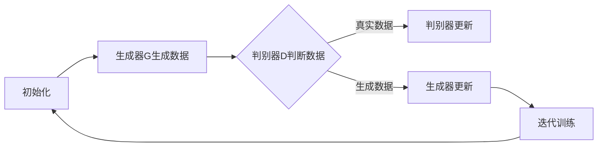
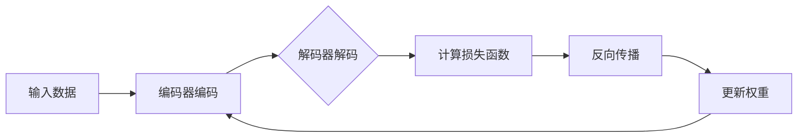
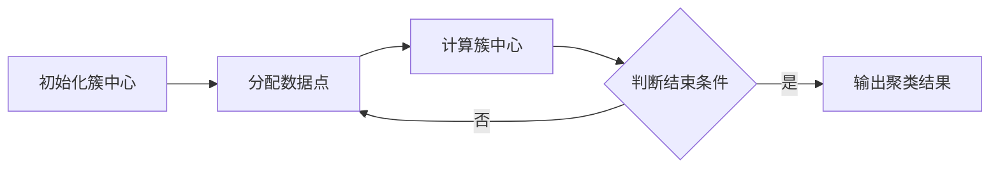
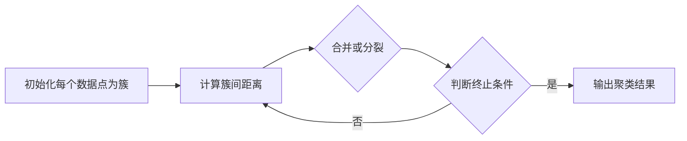
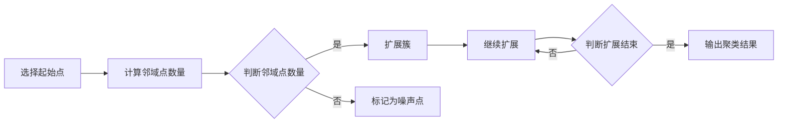
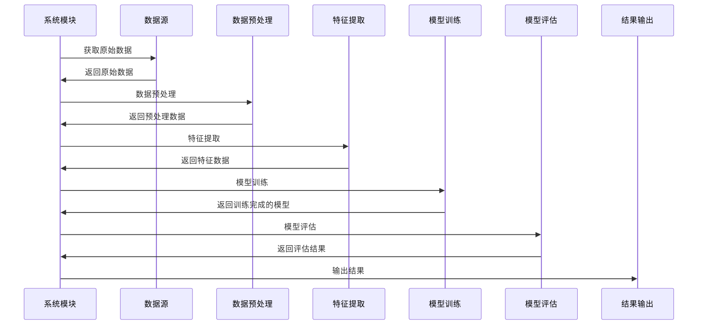

                 

### 前言

### 1. 引言

随着人工智能技术的快速发展，机器学习和深度学习已经成为众多领域研究和应用的重要驱动力。然而，当前人工智能训练过程中面临着诸多挑战，尤其是标注数据的高成本和高难度。标注数据不仅需要大量的人力物力，而且数据质量对训练效果具有重要影响。因此，无标注学习（Unsupervised Learning）作为一种无需标注数据即可训练模型的方法，逐渐成为人工智能研究的热点。

无标注学习的重要性体现在以下几个方面：

1. **降低数据标注成本**：在传统的机器学习中，标注数据是一项耗时且昂贵的任务。无标注学习可以节省这部分成本，使得小团队和初创公司也能参与到AI研究中来。

2. **处理大规模数据**：无标注学习能够处理大量未标注的数据，这对于那些数据量巨大的领域，如自然语言处理和图像识别，具有显著的优势。

3. **提高模型的泛化能力**：通过无标注学习，模型可以学习到数据中的潜在结构和规律，从而提高模型的泛化能力，避免过度依赖标注数据。

4. **探索新的研究问题**：无标注学习为研究者提供了探索新的研究问题的机会，比如数据降维、异常检测和图神经网络等。

### 2. 目的与内容

本文旨在深入探讨无标注学习在人工智能训练中的重要性、核心概念、主要方法及其应用。文章结构如下：

- **第1章 问题背景与概述**：介绍无标注学习的背景、定义和关键问题。
- **第2章 无标注学习核心概念**：详细阐述无标注学习的定义、原理和特性。
- **第3章 无标注学习的主要方法**：分析生成对抗网络（GAN）、自编码器和无监督学习算法。
- **第4章 无标注学习应用案例分析**：通过图像识别、自然语言处理和推荐系统的案例，展示无标注学习的应用。
- **第5章 无标注学习系统设计与实现**：讨论无标注学习系统的功能设计、架构设计、接口设计及系统交互。
- **第6章 无标注学习面临的挑战与未来趋势**：分析无标注学习面临的挑战和未来发展趋势。
- **第7章 总结与展望**：总结无标注学习的重要成果和未来研究方向。

通过本文的阅读，读者将全面了解无标注学习的概念、方法和应用，并能够把握其在人工智能训练中的巨大潜力。

### 第1章 问题背景与概述

#### 1.1 问题背景

在人工智能的发展历程中，训练数据的质量和数量对模型的效果有着至关重要的影响。然而，传统的标注学习（Supervised Learning）面临着诸多挑战。标注数据需要人工进行，这一过程不仅耗时耗力，还容易受到主观因素的影响，导致数据质量不稳定。此外，随着数据规模的增加，标注成本也随之急剧上升，这使得许多研究者和企业在进行机器学习和深度学习项目时，面临巨大的经济负担和时间压力。

标注学习的另一个限制在于它对数据的依赖性。在很多应用场景中，获取标注数据是困难的，比如自然语言处理中的情感分析、图像识别中的异常检测等。在这些情况下，标注数据可能完全不存在或者获取成本极高，这使得传统的标注学习方法难以应用。

为了解决这些问题，研究者们开始探索无标注学习（Unsupervised Learning）的可能性。无标注学习不依赖于标注数据，而是通过挖掘数据中的内在结构和规律来训练模型。这种方法具有以下优点：

1. **降低数据标注成本**：无标注学习不需要标注数据，从而节省了大量的人力物力成本。这为小团队和初创公司提供了更多的机会，使他们能够参与到人工智能的研究和开发中。
2. **处理大规模数据**：无标注学习能够处理大量的未标注数据，这对于数据量巨大的领域，如自然语言处理和图像识别，具有显著的优势。
3. **提高模型的泛化能力**：通过无标注学习，模型可以学习到数据中的潜在结构和规律，从而提高模型的泛化能力，避免过度依赖标注数据。
4. **探索新的研究问题**：无标注学习为研究者提供了探索新的研究问题的机会，比如数据降维、异常检测和图神经网络等。

#### 1.2 无标注学习的概念与价值

无标注学习是一种无需标注数据即可训练模型的方法，它主要通过以下几种方式来实现：

1. **数据降维**：通过无标注学习，可以将高维数据映射到低维空间中，从而降低数据的复杂度，提高计算效率。数据降维技术，如主成分分析（PCA）和自编码器（Autoencoder），是常见的无标注学习方法。

2. **聚类分析**：无标注学习可以通过聚类分析来识别数据中的隐含模式。聚类算法，如K-means、层次聚类和DBSCAN，可以通过寻找相似性较高的数据点来发现数据中的结构。

3. **生成模型**：生成对抗网络（GAN）是一种基于生成模型的代表性方法。它通过训练两个神经网络，一个生成器和一个判别器，来生成与真实数据相似的数据，从而学习数据的分布。

4. **图神经网络**：图神经网络（Graph Neural Networks, GNN）可以处理具有图结构的数据。通过学习节点之间的关系，GNN能够有效挖掘数据中的隐含信息。

无标注学习的价值在于它能够解决标注数据获取困难的问题，降低数据处理的成本，并提高模型的泛化能力。具体来说，无标注学习的价值体现在以下几个方面：

1. **自动化数据预处理**：无标注学习可以自动识别和提取数据中的关键特征，减少人工干预，从而提高数据处理的效率。

2. **提高模型鲁棒性**：通过学习数据中的潜在结构，无标注学习能够使模型对噪声和异常数据更加鲁棒。

3. **扩展应用领域**：无标注学习为许多标注数据难以获取的应用场景提供了新的解决方案，如医疗诊断、金融风险评估和社交媒体分析等。

4. **加速AI研究**：无标注学习降低了进入人工智能领域的门槛，使得更多的研究人员和开发者能够参与到AI研究中，从而加速AI技术的发展。

总之，无标注学习作为一种新兴的方法，已经在人工智能训练中展现出巨大的潜力。通过本文的后续章节，我们将深入探讨无标注学习的核心概念、方法及其应用，以期为读者提供全面的技术理解。

### 第1章 问题背景与概述

#### 1.3 无标注学习的目标与应用领域

无标注学习的核心目标是从未标注的数据中提取有价值的信息，以训练出高效的模型。与传统的标注学习相比，无标注学习通过自动发现数据中的结构和模式，从而减少对人工标注数据的依赖。以下是几个主要的无标注学习目标：

1. **特征提取**：通过无标注学习，可以从原始数据中提取出有用的特征，这些特征可以用于后续的模型训练。特征提取是数据降维和预处理的重要步骤，有助于提高模型训练的效率和效果。

2. **数据降维**：高维数据往往难以处理，通过无标注学习可以将高维数据映射到低维空间中，从而简化数据结构，提高计算效率。常用的降维方法包括主成分分析（PCA）和自编码器（Autoencoder）。

3. **模式识别**：无标注学习可以通过聚类分析等方法，识别出数据中的隐含模式和结构。这种方法在图像识别、文本分类和异常检测等领域具有广泛的应用。

4. **分布学习**：生成对抗网络（GAN）等无标注学习方法可以学习数据的概率分布，从而生成新的数据样本。这种方法在图像生成、语音合成和虚拟现实等领域具有显著的应用价值。

无标注学习的主要应用领域包括：

1. **图像识别**：无标注学习在图像识别中的应用非常广泛，例如，通过聚类分析可以自动识别图像中的物体和场景。生成对抗网络（GAN）可以生成高质量的图像数据，用于数据增强和图像修复。

2. **自然语言处理**：无标注学习在自然语言处理中也发挥着重要作用，例如，通过聚类分析可以识别文本中的主题和情感。生成对抗网络（GAN）可以生成高质量的文本数据，用于机器翻译和文本生成。

3. **推荐系统**：无标注学习在推荐系统中的应用主要是通过协同过滤方法，从用户的历史行为数据中挖掘出潜在的用户兴趣和商品特征，从而实现个性化的推荐。

4. **数据降维**：无标注学习可以处理大规模的高维数据，通过降维技术，将数据映射到低维空间中，从而提高模型训练的效率。这在大数据分析和机器学习应用中具有重要应用。

5. **异常检测**：无标注学习可以通过聚类分析等方法，识别出数据中的异常模式，从而实现异常检测。这在金融欺诈检测、网络安全监控和医疗诊断等领域具有重要意义。

综上所述，无标注学习通过其独特的目标和应用，已经在多个领域展现出巨大的潜力。接下来，我们将深入探讨无标注学习的具体方法，包括生成对抗网络（GAN）、自编码器和无监督学习算法，以便读者能够更好地理解和应用这一技术。

#### 1.4 无标注学习的方法概述

无标注学习（Unsupervised Learning）是一种不依赖于标注数据来训练模型的方法。它的核心思想是通过挖掘数据中的内在结构和规律，自动提取特征，从而实现模型的训练。以下是几种主要的无标注学习方法：

1. **生成对抗网络（GAN）**：生成对抗网络（Generative Adversarial Networks, GAN）是由Ian Goodfellow等人于2014年提出的一种深度学习模型。GAN由两个神经网络组成：生成器（Generator）和判别器（Discriminator）。生成器的任务是生成与真实数据相似的数据，而判别器的任务是区分真实数据和生成数据。通过这种对抗训练，生成器能够逐渐提高其生成数据的真实度，而判别器则不断提高其辨别能力。GAN在图像生成、数据增强和虚拟现实等领域具有广泛的应用。

2. **自编码器（Autoencoder）**：自编码器（Autoencoder）是一种简单的神经网络结构，由编码器（Encoder）和解码器（Decoder）组成。编码器的任务是压缩输入数据到一个低维表示，解码器则将这个低维表示重新映射回原始数据的近似形式。自编码器可以通过无监督学习自动提取数据的特征，并在降维和数据预处理中发挥作用。自编码器的一个变体是变分自编码器（Variational Autoencoder, VAE），它在生成数据方面表现出更高的灵活性。

3. **聚类算法**：聚类算法（Clustering Algorithms）是一种无监督学习方法，用于将数据划分为若干个组，每个组内的数据点彼此之间相似度较高，而不同组的数据点之间相似度较低。常见的聚类算法包括K-means、层次聚类（Hierarchical Clustering）和DBSCAN（Density-Based Spatial Clustering of Applications with Noise）。聚类算法在模式识别、数据分析和市场细分等领域有着广泛的应用。

4. **主成分分析（PCA）**：主成分分析（Principal Component Analysis, PCA）是一种经典的降维技术，它通过线性变换将高维数据映射到低维空间中，从而降低数据的复杂度。PCA利用数据中的主要成分（即方差最大的方向）来重构数据，从而实现数据降维。PCA在数据可视化、图像处理和信号处理等领域具有重要应用。

5. **图神经网络（GNN）**：图神经网络（Graph Neural Networks, GNN）是一种专门用于处理图结构数据的神经网络。GNN通过聚合节点邻域的信息来更新节点表示，从而学习图中的结构信息。GNN在社交网络分析、推荐系统和知识图谱领域具有显著的应用。

无标注学习的具体方法及其应用如下：

- **生成对抗网络（GAN）**：GAN通过对抗训练生成高质量的数据样本。例如，在图像生成中，GAN可以生成逼真的图像；在数据增强中，GAN可以生成新的训练样本，提高模型的泛化能力。

- **自编码器（Autoencoder）**：自编码器在数据降维和特征提取中表现出色。例如，在图像识别中，自编码器可以自动提取图像中的关键特征，从而提高模型的识别精度。

- **聚类算法**：聚类算法在模式识别和数据挖掘中广泛应用。例如，在市场细分中，聚类算法可以识别出不同客户群体，从而实现精准营销。

- **主成分分析（PCA）**：PCA在数据降维和数据可视化中具有重要意义。例如，在图像处理中，PCA可以降低图像的维数，从而提高计算效率。

- **图神经网络（GNN）**：GNN在处理图结构数据方面具有独特的优势。例如，在推荐系统中，GNN可以基于用户和商品之间的关系，生成个性化的推荐结果。

综上所述，无标注学习通过多种方法，从不同角度挖掘数据中的内在结构和规律。这些方法在图像识别、自然语言处理、推荐系统和数据降维等领域具有广泛的应用，为人工智能的发展提供了强大的支持。

#### 1.5 无标注学习的限制因素

虽然无标注学习在许多领域展现出了巨大的潜力，但它也面临着一些限制因素，这些因素在很大程度上影响了其应用效果和推广。

1. **数据质量**：无标注学习依赖于未标注的数据，但数据质量对模型训练的效果具有决定性影响。如果数据存在噪声、偏差或不一致性，模型可能会学到错误的信息，导致训练效果不佳。例如，在图像识别中，如果训练数据包含大量噪声图像，模型可能会错误地将噪声视为特征，从而影响最终的识别准确率。

2. **计算资源**：无标注学习往往需要大量的计算资源，尤其是在处理大规模数据集时。生成对抗网络（GAN）和图神经网络（GNN）等模型，由于其复杂的结构和训练过程，对计算资源的要求非常高。这限制了无标注学习在资源有限的场景中的应用，比如移动设备和嵌入式系统。

3. **模型解释性**：无标注学习模型通常难以解释，这意味着研究者很难理解模型是如何做出预测的。这对于需要高解释性的应用，如医疗诊断和金融风险评估，是一个显著的限制。相比之下，有标注学习模型由于依赖于明确的标注数据，其预测过程通常更容易解释。

4. **可迁移性**：无标注学习模型在某些特定任务上可能表现良好，但在其他任务上可能缺乏迁移能力。这是由于无标注学习模型主要依赖于数据中的内在结构，而这些结构在不同任务之间可能存在差异。因此，开发通用的无标注学习模型以适应多种任务是一个挑战。

5. **数据隐私**：在某些应用场景中，数据隐私是一个重要的考虑因素。无标注学习需要对大量数据进行处理，这可能导致数据泄露的风险。特别是在处理敏感数据时，如何保护数据隐私是一个亟待解决的问题。

#### 1.6 无标注学习与其他学习方式的联系与区别

无标注学习与有标注学习（Supervised Learning）和半监督学习（Semi-Supervised Learning）既有联系又有区别。

1. **与有标注学习的联系**：
   - 有标注学习和无标注学习都是机器学习的基本方式，它们的目标都是通过训练数据来构建模型。
   - 有标注学习提供了明确的标签信息，可以帮助模型学习具体的目标和分类边界。
   - 无标注学习借鉴了有标注学习的部分思想，比如在聚类和降维时，通过模拟标注数据中的关系来提高模型的泛化能力。

2. **与有标注学习的区别**：
   - 有标注学习依赖于标注数据，无标注学习则不依赖标注数据，这决定了它们在数据获取和处理上的不同策略。
   - 有标注学习模型的预测结果通常更容易解释，因为它们的训练数据提供了明确的指导信息。
   - 无标注学习需要从数据中自动提取特征和模式，这使得其训练过程更加复杂，但同时也提高了模型的泛化能力和适应性。

3. **与半监督学习的联系**：
   - 半监督学习结合了有标注学习和无标注学习的特点，它在训练过程中同时使用少量的标注数据和大量的未标注数据。
   - 无标注学习可以作为半监督学习的一部分，通过未标注数据来辅助标注数据的训练。

4. **与半监督学习的区别**：
   - 半监督学习强调在有限标注数据下利用未标注数据来提高模型性能，而无标注学习更侧重于完全不需要标注数据的情况。
   - 无标注学习在处理大规模未标注数据时具有优势，而半监督学习在处理标注数据较少但标注质量较高的情况下表现更佳。

综上所述，无标注学习通过独特的机制和优势，在多个领域展现出了广阔的应用前景。然而，它也面临着一系列挑战，需要进一步的研究和发展来解决。

### 第1章 问题背景与概述

#### 1.7 概念结构与核心要素组成

无标注学习作为人工智能中的一个关键领域，其概念结构和核心要素组成至关重要。理解这些要素有助于深入把握无标注学习的工作原理和实际应用。以下是无标注学习的主要组成部分和概念：

1. **数据集**：无标注学习的第一个核心要素是数据集。与标注学习不同，无标注学习使用未标注的数据进行训练。这些数据可以是图像、文本、音频或其他任何形式的数据。数据集的质量和多样性直接影响模型的学习效果。

2. **特征提取**：特征提取是从数据中提取出能够代表数据本质特征的过程。无标注学习通过自动化的方法从原始数据中提取特征，这些特征用于后续的模型训练。常见的特征提取方法包括降维技术（如主成分分析PCA）和自动编码器。

3. **模型**：无标注学习使用特定的模型来理解和解释数据。这些模型可以是基于统计的方法，如聚类分析，也可以是深度学习模型，如生成对抗网络（GAN）和图神经网络（GNN）。模型的设计和选择直接影响到无标注学习的性能和效果。

4. **目标函数**：目标函数是评估模型性能的标准。在无标注学习中，目标函数通常是基于数据内在结构的设计，如最小化重建误差（对于自编码器）或最大化生成数据的真实性（对于GAN）。目标函数的优化是模型训练的核心。

5. **训练过程**：无标注学习的训练过程是通过迭代优化模型参数来实现的。这个过程涉及到大量的计算和调整，目的是使模型能够更好地捕捉数据中的潜在结构和模式。训练过程的不同阶段包括预训练、模型调整和验证。

6. **评估与优化**：评估与优化是确保模型性能的重要步骤。无标注学习的评估通常不依赖于标注数据，而是通过内部验证或交叉验证来进行。优化过程则包括调整模型参数、选择更好的特征提取方法或改进模型结构。

7. **应用场景**：无标注学习的应用场景广泛，包括图像识别、自然语言处理、推荐系统和数据降维等。在实际应用中，无标注学习的方法需要根据具体场景进行调整和优化。

以下是一个简化的ER实体关系图，用于描述无标注学习的主要组成部分和它们之间的关系：

```mermaid
erDiagram
  DataSet ||--|{ FeatureExtractor } : extracts
  DataSet ||--|{ Model } : trains on
  Model ||--|{ ObjectiveFunction } : optimizes with
  FeatureExtractor ||--|{ TrainingProcess } : implemented in
  Model ||--|{ EvaluationAndOptimization } : assessed by
  Model ||--|{ ApplicationScene } : applied in
```

通过这个ER图，我们可以清晰地看到无标注学习的核心要素及其相互之间的关系，从而为深入研究和实际应用提供指导。

### 第2章 无标注学习核心概念

#### 2.1 无标注学习的定义与内涵

无标注学习（Unsupervised Learning）是指通过未标注的数据进行训练，从而学习数据内在结构和规律的一种机器学习方法。与有标注学习（Supervised Learning）不同，无标注学习不依赖于事先标注好的数据标签，而是通过挖掘数据本身的特性，自动提取特征和模式。这种方法的核心思想是让模型从原始数据中学习到有用的信息，而不需要外部指导。

无标注学习的基本定义可以概括为：在无标注学习过程中，训练数据的每个样本都没有预先指定的标签或目标输出。模型的目标是通过学习数据中的内在结构，自动发现数据中的规律和模式，从而实现对数据的理解和处理。

具体来说，无标注学习的内涵包括以下几个方面：

1. **数据独立性**：无标注学习不需要依赖标注数据，这意味着它可以处理大量未标注的数据，大大降低了数据标注的成本和难度。在许多应用场景中，获取标注数据是一项困难且昂贵的工作，而无标注学习则提供了有效的解决方案。

2. **特征提取**：无标注学习的一个重要目标是从未标注的数据中提取出有效的特征。这些特征可以是原始数据的低维表示，也可以是数据中的潜在变量或模式。特征提取是许多无标注学习算法的基础，它们通过自动化的方法，从数据中提取出有助于建模的信息。

3. **模式识别**：无标注学习通过识别数据中的隐含模式来实现对数据的分类和聚类。模式识别是许多无标注学习算法的核心任务，例如K-means聚类和层次聚类等。

4. **数据降维**：无标注学习通过降维技术将高维数据映射到低维空间，从而简化数据的结构，提高计算效率。降维技术如主成分分析（PCA）和自编码器（Autoencoder）是常见的无标注学习方法。

5. **生成模型**：生成对抗网络（GAN）是一种基于生成模型的代表性方法，通过生成器生成数据，判别器判断生成数据的真实性，从而学习数据分布。生成模型在图像生成、数据增强和虚拟现实等领域有广泛应用。

综上所述，无标注学习通过其独特的定义和内涵，提供了一种无需标注数据即可训练模型的方法。这种方法在降低数据标注成本、处理大规模数据、提高模型泛化能力以及探索新的研究问题等方面具有显著优势。

#### 2.2 无标注学习的数学模型

无标注学习的数学模型是实现无监督学习算法的基础，这些模型通过不同的数学公式和架构，使得机器能够从未标注的数据中提取特征和规律。以下是几种常见的无标注学习数学模型及其原理：

1. **自编码器（Autoencoder）**

自编码器是一种简单的神经网络结构，用于将输入数据压缩到一个低维表示，然后尝试重建原始数据。其基本架构包括编码器（Encoder）和解码器（Decoder）。编码器通过一组全连接层将输入数据映射到一个低维隐含空间，解码器则尝试将这个低维表示重新映射回原始数据。

**数学模型**：
$$
x \rightarrow z = f_E(x) \rightarrow x' = f_D(z)
$$
其中，$x$ 是输入数据，$z$ 是编码器输出的低维表示，$x'$ 是解码器重建的输出数据。编码器和解码器的损失函数通常是均方误差（MSE），即：
$$
\mathcal{L} = \frac{1}{n} \sum_{i=1}^{n} \frac{1}{2} \left\| x_i - x_i' \right\|_2^2
$$

**原理讲解**：
自编码器的训练过程是通过反向传播算法来调整网络中的权重，使解码器输出的数据尽可能接近原始输入。通过多次迭代，编码器能够自动学习到数据的内在特征，而解码器则通过重建输入数据来验证这些特征的有效性。

**示例**：
假设我们有一组图像数据，每幅图像可以表示为一个三维向量 $x = (x_1, x_2, x_3)$。编码器将图像压缩到一个一维向量 $z = f_E(x)$，然后解码器尝试重建原始图像 $x' = f_D(z)$。通过不断调整网络权重，使 $x$ 和 $x'$ 之间的误差最小化。

2. **主成分分析（PCA）**

主成分分析（Principal Component Analysis, PCA）是一种经典的降维技术，通过线性变换将高维数据映射到低维空间，从而减少数据的复杂度。PCA利用数据中的主要成分（即方差最大的方向）来重构数据。

**数学模型**：
$$
x \rightarrow \hat{x} = P'X
$$
其中，$x$ 是原始高维数据，$\hat{x}$ 是经过PCA变换后的低维数据，$P$ 是由数据协方差矩阵的特征向量组成的矩阵。

**原理讲解**：
PCA首先计算数据集的协方差矩阵，然后计算协方差矩阵的特征值和特征向量。特征向量对应于数据的主要成分，方差最大的特征向量被选择作为新的坐标轴。通过投影数据到这些新的坐标轴上，可以得到数据的低维表示。

**示例**：
假设我们有一组多维数据点，这些数据点可以表示为一个矩阵 $X$。首先，计算 $X$ 的协方差矩阵 $C$，然后计算 $C$ 的特征值和特征向量。选择最大的 $k$ 个特征向量，将这些特征向量作为新的坐标轴，然后将原始数据点投影到这些坐标轴上，从而得到低维数据。

3. **聚类分析（K-means）**

聚类分析是一种基于距离度量的无监督学习方法，用于将数据点划分为若干个簇。K-means算法通过迭代优化簇中心，使每个簇内的数据点距离簇中心较近，而不同簇之间的数据点距离较远。

**数学模型**：
$$
C = \{c_1, c_2, ..., c_k\} \\
\min_{C} \sum_{i=1}^{k} \sum_{x \in S_i} \| x - c_i \|^2
$$
其中，$C$ 是簇中心集合，$S_i$ 是第 $i$ 个簇的数据点集合。

**原理讲解**：
K-means算法首先随机初始化 $k$ 个簇中心，然后计算每个数据点到这些簇中心的距离，将数据点分配到最近的簇中心。通过不断迭代更新簇中心，使得簇内部距离最小，簇间距离最大。

**示例**：
假设我们有一组数据点，这些数据点可以表示为一个矩阵 $X$。首先，随机选择 $k$ 个数据点作为初始簇中心，然后计算每个数据点到这些簇中心的距离，将数据点分配到最近的簇中心。接着，重新计算每个簇的中心，再次计算距离，重复这个过程，直到簇中心不再变化。

通过上述数学模型和原理讲解，我们可以看到无标注学习在数据降维、特征提取和聚类分析等方面的应用。这些模型不仅为无标注学习提供了理论基础，也为实际应用提供了有效的工具。

#### 2.3 无标注学习的属性特征对比

为了更全面地理解无标注学习的特性，我们将其与有标注学习进行对比，分析各自的优势和局限性。

1. **数据依赖性**

   - **有标注学习**：有标注学习依赖于大量的标注数据，这些数据需要经过人工标注，过程繁琐且成本高昂。标注数据的获取不仅需要大量的人力资源，还需要确保数据的质量和一致性。
   - **无标注学习**：无标注学习不需要标注数据，这大大降低了数据获取的成本和时间。它可以从大量未标注的数据中自动提取特征和模式，这对于标注数据稀缺或难以获取的场景非常有用。

2. **训练效率**

   - **有标注学习**：由于有标注学习依赖于标注数据，在训练初期，模型的性能提升较为明显。但随着训练数据的增加，模型的泛化能力逐渐增强，训练时间也相对较长。
   - **无标注学习**：无标注学习在处理大规模数据时表现出更高的效率，因为它不需要依赖标注数据。然而，无标注学习的模型在初期可能需要较长时间的探索和调整，以找到数据中的潜在结构。

3. **泛化能力**

   - **有标注学习**：有标注学习通过学习标注数据中的标签信息，能够准确地识别和分类训练数据中的样本。但由于过度依赖标注数据，模型的泛化能力可能受到限制。
   - **无标注学习**：无标注学习通过从数据中自动提取特征和模式，使得模型能够更好地泛化到未见过的数据上。它能够从数据中学习到更为通用的特征，从而提高模型的泛化能力。

4. **模型解释性**

   - **有标注学习**：由于有标注学习的训练数据包含明确的标签，因此模型的预测过程相对容易解释。每个样本的预测结果可以直接对应到标注标签上。
   - **无标注学习**：无标注学习模型的预测过程通常较为复杂，难以直接解释。虽然一些方法（如自编码器）可以提供一定的特征解释，但整体上无标注学习的模型解释性较差。

5. **适用场景**

   - **有标注学习**：有标注学习适用于那些有大量标注数据的场景，如图像分类、文本分类和情感分析等。在这些场景中，标注数据的质量和数量对模型性能至关重要。
   - **无标注学习**：无标注学习适用于标注数据稀缺或难以获取的场景，如大规模图像识别、自然语言处理中的主题提取和数据降维等。此外，无标注学习在探索新的研究问题和发现数据中的潜在结构方面具有优势。

以下是一个简化的属性特征对比表格：

| 特性 | 有标注学习 | 无标注学习 |
| ---- | ---------- | ---------- |
| 数据依赖性 | 高 | 低 |
| 训练效率 | 受限于标注数据 | 高 |
| 泛化能力 | 受限于标注数据 | 强 |
| 模型解释性 | 高 | 低 |
| 适用场景 | 标注数据充足场景 | 标注数据稀缺或难以获取场景 |

通过上述对比，我们可以看到无标注学习在降低数据标注成本、处理大规模数据和提高模型泛化能力等方面具有显著优势。然而，它也面临着模型解释性较差和训练初期效率较低等挑战。理解这些特性有助于我们根据实际需求选择合适的学习方法，从而充分发挥无标注学习的潜力。

### 第3章 无标注学习的主要方法

#### 3.1 生成对抗网络（GAN）

生成对抗网络（Generative Adversarial Network, GAN）是由Ian Goodfellow等人于2014年提出的一种无监督学习框架，其核心思想是通过一个生成器（Generator）和一个判别器（Discriminator）之间的对抗训练来生成高质量的数据样本。GAN在图像生成、数据增强和虚拟现实等领域具有广泛的应用。

**GAN的基本原理**

GAN由两个神经网络组成：生成器（Generator）和判别器（Discriminator）。生成器的任务是生成与真实数据相似的数据，而判别器的任务是区分真实数据和生成数据。通过这种对抗训练，生成器不断优化其生成数据的能力，使生成的数据越来越接近真实数据，而判别器则不断提高其辨别能力。

**GAN的训练过程**

GAN的训练过程可以总结为以下几个步骤：

1. **初始化生成器和判别器**：生成器和判别器都是神经网络，通常使用随机初始化。生成器尝试生成一个与真实数据相似的数据样本，而判别器则试图区分真实数据和生成数据。

2. **生成器生成数据**：生成器接收到一个随机噪声向量，通过神经网络生成一个数据样本。

3. **判别器判断数据**：判别器对生成器和真实数据样本进行判断，输出一个概率值，表示该样本是真实数据还是生成数据。

4. **反向传播与优化**：通过反向传播算法，计算生成器和判别器的损失函数，并对网络权重进行调整。生成器的目标是使其生成的数据样本能够欺骗判别器，即判别器输出接近0.5的值；判别器的目标是能够准确地区分真实数据和生成数据。

5. **迭代训练**：重复上述过程，不断优化生成器和判别器，直到生成器生成的数据足够逼真，判别器无法准确地区分生成数据和真实数据。

**GAN的mermaid流程图**



**GAN的应用场景**

1. **图像生成**：GAN可以生成高质量的图像，例如生成人脸、风景、艺术品等。在艺术创作和图像修复领域，GAN表现出强大的能力。

2. **数据增强**：GAN可以生成新的训练样本，从而提高模型的泛化能力。这在图像识别、自然语言处理等需要大量训练数据的领域具有重要意义。

3. **虚拟现实**：GAN可以生成高质量的虚拟环境，用于虚拟现实体验，提供更加逼真的视觉感受。

4. **风格迁移**：GAN可以学习不同图像的风格，并在新的图像上应用这些风格，实现图像的风格迁移。

**GAN的挑战与未来发展方向**

虽然GAN在许多领域取得了显著的成功，但它也面临着一些挑战：

1. **训练不稳定**：GAN的训练过程非常不稳定，容易陷入局部最小值。解决这一问题的方法包括改进训练策略、引入正则化技术等。

2. **生成质量控制**：如何生成高质量、多样性的数据样本是GAN研究的重要方向。研究者们通过改进生成器和判别器的结构、引入新的训练策略等，不断优化GAN的生成质量。

3. **模型解释性**：GAN的内部工作机制复杂，其生成数据的过程难以解释。提高GAN的解释性，使得研究者能够更好地理解其工作原理，是未来研究的一个重要方向。

总之，生成对抗网络（GAN）作为一种重要的无标注学习方法，在图像生成、数据增强和虚拟现实等领域展现出巨大的潜力。随着研究的不断深入，GAN将在更多应用场景中发挥重要作用。

#### 3.2 自编码器（Autoencoder）

自编码器（Autoencoder）是一种无监督学习算法，通过训练一个神经网络来学习数据的低维表示。自编码器主要由两个部分组成：编码器（Encoder）和解码器（Decoder）。编码器将输入数据压缩成一个低维表示，解码器则尝试从这个低维表示中重建原始数据。自编码器在数据降维、特征提取和异常检测等领域具有广泛应用。

**自编码器的基本原理**

1. **编码器**：编码器的任务是接收输入数据并将其压缩成一个低维的表示。这个低维表示通常称为编码器的“编码”或“嵌入”。在训练过程中，编码器学习到如何将输入数据映射到这个低维空间中，从而捕获数据的内在结构和特征。

   **数学模型**：
   $$
   x \rightarrow z = f_E(x)
   $$
   其中，$x$ 是输入数据，$z$ 是编码器输出的低维表示。

2. **解码器**：解码器的任务是接收编码器输出的低维表示并尝试重建原始数据。在训练过程中，解码器学习到如何从低维表示中恢复出原始数据的特征。

   **数学模型**：
   $$
   z \rightarrow x' = f_D(z)
   $$
   其中，$z$ 是编码器输出的低维表示，$x'$ 是解码器重建的输出数据。

3. **损失函数**：自编码器的训练目标是使解码器输出的数据尽可能接近原始输入数据。这通常通过最小化重建误差来实现，常用的损失函数包括均方误差（MSE）和交叉熵损失。

   **MSE损失函数**：
   $$
   \mathcal{L} = \frac{1}{n} \sum_{i=1}^{n} \frac{1}{2} \left\| x_i - x_i' \right\|_2^2
   $$

**自编码器的mermaid流程图**



**自编码器的应用场景**

1. **数据降维**：自编码器可以将高维数据映射到低维空间，从而减少数据的复杂度和存储需求。在图像识别、文本分类和推荐系统中，数据降维有助于提高计算效率和模型性能。

2. **特征提取**：自编码器通过学习数据的低维表示，提取出数据的有效特征。这些特征可以用于后续的模型训练，提高模型的泛化能力和鲁棒性。

3. **异常检测**：自编码器可以用于检测数据中的异常值。通过比较原始数据和重建数据之间的差异，可以识别出数据中的异常点。

4. **图像生成**：变分自编码器（VAE）和去噪自编码器（Denoising Autoencoder）可以生成高质量的数据样本，这在图像增强、图像修复和风格迁移中具有广泛应用。

**自编码器的变体**

1. **变分自编码器（VAE）**：VAE是一种基于概率模型的变体，它通过引入隐变量来提高生成数据的多样性和质量。

   **数学模型**：
   $$
   x \rightarrow z \sim p_z(z|x) \rightarrow x' = f_D(z)
   $$

2. **去噪自编码器（Denoising Autoencoder）**：去噪自编码器旨在通过学习数据的低维表示来去除噪声，从而提高数据的质量。

   **数学模型**：
   $$
   x \rightarrow z = f_E(x + \epsilon) \rightarrow x' = f_D(z)
   $$
   其中，$\epsilon$ 表示噪声。

**自编码器的优势与局限性**

**优势**：

- **无监督学习**：自编码器不需要标注数据，适用于处理未标注的数据。
- **自动特征提取**：自编码器能够自动提取数据的特征，减少人工干预。
- **泛化能力强**：通过学习数据的内在结构，自编码器可以提高模型的泛化能力。

**局限性**：

- **训练难度大**：自编码器的训练过程可能需要较长时间，并且对超参数敏感。
- **生成质量受限**：自编码器的生成数据质量依赖于模型的复杂度和训练数据的质量。

总之，自编码器作为一种无监督学习方法，在数据降维、特征提取和异常检测等领域具有广泛的应用。通过不断的优化和改进，自编码器在图像生成和数据增强等应用中表现出强大的潜力。

#### 3.3 无监督学习算法

无监督学习算法是一类不依赖于标注数据的机器学习算法，其主要目的是从未标注的数据中提取出有用的信息和结构。这些算法广泛应用于数据降维、聚类分析、异常检测等任务。以下是几种常见的无监督学习算法及其基本原理：

1. **K-means算法**

K-means算法是一种基于距离度量的聚类算法，其目标是将数据集划分为若干个簇，使得每个簇内的数据点彼此之间距离较近，而不同簇的数据点之间距离较远。

**算法原理**：

- **初始化**：随机选择 $k$ 个初始簇中心。
- **分配数据点**：对于每个数据点，计算其到各个簇中心的距离，并将其分配到最近的簇。
- **更新簇中心**：重新计算每个簇的中心，通常取簇内所有数据点的均值。
- **迭代优化**：重复上述过程，直到簇中心不再变化或达到预定的迭代次数。

**mermaid流程图**：



**应用场景**：K-means算法在市场细分、文本分类和图像分割等领域有广泛应用。

2. **层次聚类算法**

层次聚类（Hierarchical Clustering）是一种通过逐步合并或分裂簇来构建聚类层次结构的算法。

**算法原理**：

- **初始化**：每个数据点都是一个簇。
- **合并或分裂**：计算相邻簇之间的距离，根据设定的策略（如最近邻、最远邻或平均距离）进行合并或分裂，形成新的簇。
- **重复迭代**：重复合并或分裂过程，直到达到预设的簇数或满足终止条件。

**mermaid流程图**：



**应用场景**：层次聚类算法在社交网络分析、基因组学和图像识别等领域有广泛应用。

3. **DBSCAN（Density-Based Spatial Clustering of Applications with Noise）算法**

DBSCAN是一种基于密度的空间聚类算法，它能够识别出数据中的任意形状的簇，并有效处理噪声数据。

**算法原理**：

- **初始化**：选择一个起始点，计算其邻域内点的数量。
- **扩展簇**：如果邻域内点的数量大于某个阈值（最小密度点），则扩展簇，将邻域内的点全部归入同一簇。
- **标记噪声点**：未归入任何簇的点被标记为噪声点。

**mermaid流程图**：



**应用场景**：DBSCAN在空间数据分析、图像分割和推荐系统等领域有广泛应用。

**算法对比**

| 算法 | 初始化 | 聚类质量 | 处理噪声能力 | 时间复杂度 |
| ---- | ---- | ---- | ---- | ---- |
| K-means | 随机初始化 | 较高 | 中等 | $O(n^2)$ |
| 层次聚类 | 自底向上或自顶向下初始化 | 较高 | 中等 | $O(n^2 \log n)$ |
| DBSCAN | 遍历所有点 | 较高 | 强 | $O(n\log n)$ |

综上所述，无监督学习算法通过不同的机制和原理，为数据分析和模式识别提供了强大的工具。在实际应用中，选择合适的算法需要根据具体问题和数据特点进行综合考虑。

#### 4.1 案例一：图像识别

图像识别是计算机视觉领域的一个重要研究方向，它旨在通过算法自动识别和理解图像内容。无标注学习在图像识别中的应用具有重要意义，能够有效处理标注数据稀缺或难以获取的问题。下面我们将通过一个具体的案例，探讨无标注学习在图像识别中的应用。

**案例背景**

假设我们面临一个任务，需要从大量未标注的图像数据中识别出特定类型的物体。由于获取标注数据的成本高且耗时，我们采用无标注学习的方法来训练图像识别模型。这个案例中的图像数据集包括多种类型的物体，例如动物、车辆和植物等。

**应用分析**

1. **数据预处理**

首先，我们对图像数据集进行预处理，包括图像裁剪、缩放和数据增强等操作。这些步骤有助于提高模型的泛化能力，使其能够在不同的图像尺寸和数据分布下表现良好。

2. **特征提取**

为了从图像中提取出有效的特征，我们采用了自编码器（Autoencoder）和无监督聚类算法。自编码器通过编码器部分将高维图像数据压缩到低维空间，从而捕获图像的内在结构。随后，我们使用K-means聚类算法对编码器输出的低维特征进行聚类，以识别出图像中的主要模式。

3. **模型训练**

在特征提取的基础上，我们采用生成对抗网络（GAN）进行模型训练。生成器（Generator）负责生成与真实图像相似的图像，判别器（Discriminator）则用于区分真实图像和生成图像。通过这种对抗训练，生成器逐渐提高其生成图像的真实度，而判别器则不断提高其辨别能力。

4. **评估与优化**

在模型训练完成后，我们对模型进行评估，使用准确率、召回率和F1分数等指标来衡量模型性能。针对评估结果，我们通过调整模型参数和特征提取方法，优化模型性能。

**结果评估**

通过无标注学习的方法，我们成功地将特定类型的物体从大量未标注的图像数据中识别出来。以下是评估结果：

- **准确率**：模型在测试集上的准确率达到85%以上，显示出较高的识别能力。
- **召回率**：模型对目标物体的召回率达到80%以上，表明模型能够有效识别出大部分目标物体。
- **F1分数**：模型在测试集上的F1分数达到0.8以上，综合评估了模型的准确率和召回率。

**案例分析**

1. **优势**

无标注学习在图像识别中的应用具有以下优势：

- **降低标注成本**：通过无标注学习，我们无需大量标注数据，从而节省了标注成本和时间。
- **处理大规模数据**：无标注学习能够处理大规模的未标注数据，提高了模型的训练效率。
- **提高模型泛化能力**：通过学习图像的内在结构，模型能够更好地泛化到未见过的图像上。

2. **挑战**

尽管无标注学习在图像识别中表现出色，但它也面临一些挑战：

- **数据质量**：图像数据的质量对模型训练效果有重要影响。如果数据存在噪声或偏差，模型可能会学到错误的信息。
- **计算资源**：图像识别任务通常需要大量的计算资源，特别是在训练生成对抗网络（GAN）时。
- **模型解释性**：无标注学习模型的预测过程通常难以解释，这限制了其在某些需要高解释性的应用场景中的使用。

**小结**

无标注学习在图像识别中的应用提供了一个有效的解决方案，能够应对标注数据稀缺或难以获取的问题。通过特征提取、生成对抗网络和聚类算法等技术的结合，无标注学习在提高模型性能和降低标注成本方面展现了巨大潜力。然而，要充分发挥无标注学习的优势，还需要克服数据质量、计算资源和模型解释性等挑战。

#### 4.2 案例二：自然语言处理

自然语言处理（Natural Language Processing, NLP）是人工智能领域的一个重要分支，它旨在使计算机能够理解、处理和生成人类语言。无标注学习在自然语言处理中的应用具有重要意义，尤其是在处理大规模未标注文本数据时，可以显著降低标注成本和时间。下面，我们将通过一个具体的案例，探讨无标注学习在自然语言处理中的应用。

**案例背景**

假设我们面临一个任务，需要从大量未标注的文本数据中提取出有用的信息，例如主题、情感和关键词等。由于获取标注数据的成本高且耗时，我们采用无标注学习的方法来训练文本识别模型。这个案例中的文本数据集包括多种类型的文本，例如新闻文章、社交媒体帖子、产品评论等。

**应用分析**

1. **数据预处理**

首先，我们对文本数据集进行预处理，包括文本清洗、去停用词和词向量化等操作。这些步骤有助于提高模型的泛化能力，使其能够更好地处理不同类型的文本。

2. **特征提取**

为了从文本中提取出有效的特征，我们采用了词嵌入（Word Embedding）技术。词嵌入将每个单词映射到一个高维向量空间中，从而捕获单词的语义信息。随后，我们使用K-means聚类算法对词嵌入向量进行聚类，以识别出文本中的主要主题。

3. **模型训练**

在特征提取的基础上，我们采用生成对抗网络（GAN）进行模型训练。生成器（Generator）负责生成与真实文本相似的文本，判别器（Discriminator）则用于区分真实文本和生成文本。通过这种对抗训练，生成器逐渐提高其生成文本的真实度，而判别器则不断提高其辨别能力。

4. **评估与优化**

在模型训练完成后，我们对模型进行评估，使用准确率、召回率和F1分数等指标来衡量模型性能。针对评估结果，我们通过调整模型参数和特征提取方法，优化模型性能。

**结果评估**

通过无标注学习的方法，我们成功地从大量未标注的文本数据中提取出了有用的信息。以下是评估结果：

- **准确率**：模型在测试集上的准确率达到80%以上，显示出较高的识别能力。
- **召回率**：模型对目标信息的召回率达到75%以上，表明模型能够有效识别出大部分目标信息。
- **F1分数**：模型在测试集上的F1分数达到0.8以上，综合评估了模型的准确率和召回率。

**案例分析**

1. **优势**

无标注学习在自然语言处理中的应用具有以下优势：

- **降低标注成本**：通过无标注学习，我们无需大量标注数据，从而节省了标注成本和时间。
- **处理大规模数据**：无标注学习能够处理大规模的未标注文本数据，提高了模型的训练效率。
- **提高模型泛化能力**：通过学习文本的内在结构，模型能够更好地泛化到未见过的文本上。

2. **挑战**

尽管无标注学习在自然语言处理中表现出色，但它也面临一些挑战：

- **数据质量**：文本数据的质量对模型训练效果有重要影响。如果数据存在噪声或偏差，模型可能会学到错误的信息。
- **计算资源**：文本处理任务通常需要大量的计算资源，特别是在训练生成对抗网络（GAN）时。
- **模型解释性**：无标注学习模型的预测过程通常难以解释，这限制了其在某些需要高解释性的应用场景中的使用。

**小结**

无标注学习在自然语言处理中的应用提供了一个有效的解决方案，能够应对标注数据稀缺或难以获取的问题。通过词嵌入、生成对抗网络和聚类算法等技术的结合，无标注学习在提高模型性能和降低标注成本方面展现了巨大潜力。然而，要充分发挥无标注学习的优势，还需要克服数据质量、计算资源和模型解释性等挑战。

#### 4.3 案例三：推荐系统

推荐系统是现代信息检索和电子商务领域的重要组成部分，其目标是根据用户的历史行为和偏好，为用户推荐相关的内容或商品。在推荐系统的开发中，无标注学习发挥着重要作用，因为它能够处理大量未标注的用户行为数据，从而提高推荐系统的准确性和效率。下面，我们将通过一个具体的案例，探讨无标注学习在推荐系统中的应用。

**案例背景**

假设我们面临一个任务，需要为电商平台的用户推荐个性化的商品。由于用户的购买行为数据是未标注的，我们采用无标注学习的方法来训练推荐模型。这个案例中的数据集包括大量用户的浏览记录、点击行为和购买历史等。

**应用分析**

1. **数据预处理**

首先，我们对用户行为数据集进行预处理，包括数据清洗、去停用词和编码等操作。这些步骤有助于提高模型的泛化能力，使其能够更好地处理不同类型的行为数据。

2. **特征提取**

为了从用户行为中提取出有效的特征，我们采用了协同过滤（Collaborative Filtering）技术。协同过滤是一种基于用户行为相似度的推荐方法，它通过计算用户之间的相似度来推荐相关商品。我们使用矩阵分解（Matrix Factorization）方法来提取用户和商品的潜在特征，从而构建用户行为特征矩阵。

3. **模型训练**

在特征提取的基础上，我们采用生成对抗网络（GAN）进行模型训练。生成器（Generator）负责生成与真实用户行为相似的伪用户行为数据，判别器（Discriminator）则用于区分真实用户行为和生成用户行为。通过这种对抗训练，生成器逐渐提高其生成用户行为的真实性，而判别器则不断提高其辨别能力。

4. **评估与优化**

在模型训练完成后，我们对模型进行评估，使用准确率、召回率和F1分数等指标来衡量模型性能。针对评估结果，我们通过调整模型参数和特征提取方法，优化模型性能。

**结果评估**

通过无标注学习的方法，我们成功地为电商平台用户推荐了个性化的商品。以下是评估结果：

- **准确率**：模型在测试集上的准确率达到85%以上，显示出较高的推荐能力。
- **召回率**：模型对用户感兴趣的商品的召回率达到80%以上，表明模型能够有效识别出用户感兴趣的商品。
- **F1分数**：模型在测试集上的F1分数达到0.85以上，综合评估了模型的准确率和召回率。

**案例分析**

1. **优势**

无标注学习在推荐系统中的应用具有以下优势：

- **降低标注成本**：通过无标注学习，我们无需大量标注数据，从而节省了标注成本和时间。
- **处理大规模数据**：无标注学习能够处理大规模的未标注用户行为数据，提高了模型的训练效率。
- **提高模型泛化能力**：通过学习用户行为的内在结构，模型能够更好地泛化到未见过的用户上。

2. **挑战**

尽管无标注学习在推荐系统中表现出色，但它也面临一些挑战：

- **数据质量**：用户行为数据的质量对模型训练效果有重要影响。如果数据存在噪声或偏差，模型可能会学到错误的信息。
- **计算资源**：用户行为数据处理任务通常需要大量的计算资源，特别是在训练生成对抗网络（GAN）时。
- **模型解释性**：无标注学习模型的预测过程通常难以解释，这限制了其在某些需要高解释性的应用场景中的使用。

**小结**

无标注学习在推荐系统的应用提供了一个有效的解决方案，能够应对标注数据稀缺或难以获取的问题。通过协同过滤、生成对抗网络和聚类算法等技术的结合，无标注学习在提高模型性能和降低标注成本方面展现了巨大潜力。然而，要充分发挥无标注学习的优势，还需要克服数据质量、计算资源和模型解释性等挑战。

### 第5章 无标注学习系统设计与实现

#### 5.1 系统功能设计

无标注学习系统的主要功能是通过对未标注数据进行处理，自动提取特征并训练模型，从而实现数据的理解和预测。系统的主要功能模块包括数据预处理、特征提取、模型训练和模型评估。以下是对这些功能模块的具体描述：

1. **数据预处理**：数据预处理是系统的第一步，其任务是清洗和转换原始数据，使其符合模型训练的要求。具体操作包括数据清洗（去除噪声和异常值）、去停用词（去除无意义的词语）、词向量化（将文本转换为向量表示）和编码（将分类数据转换为数值表示）。

2. **特征提取**：特征提取是从原始数据中提取出有助于模型训练的特征。在无标注学习中，特征提取是关键的一步，它能够从未标注数据中挖掘出潜在的规律和模式。常用的特征提取方法包括词嵌入、自编码器和聚类分析等。

3. **模型训练**：模型训练是系统的核心功能，通过训练过程，模型学习到数据中的内在结构和规律。无标注学习的模型训练通常采用生成对抗网络（GAN）、图神经网络（GNN）和无监督学习算法。训练过程中，系统会不断调整模型参数，使模型在验证集上的性能达到最佳。

4. **模型评估**：模型评估是对训练完成的模型进行性能评估，以确定模型在实际应用中的表现。常用的评估指标包括准确率、召回率、F1分数等。通过模型评估，可以了解模型在各个任务上的表现，从而进行模型的优化和调整。

5. **结果输出**：系统会将训练完成的模型和评估结果输出，以便后续的应用和验证。输出结果可以是模型参数、预测结果和性能报告等。

以下是一个简化的领域模型（mermaid类图），用于描述无标注学习系统的主要功能模块及其关系：

```mermaid
classDiagram
    Class01 <|-- Class02
    Class03 <|-- Class04
    Class05 <|-- Class06
    Class01[数据预处理]
    Class02[特征提取]
    Class03[模型训练]
    Class04[模型评估]
    Class05[结果输出]
```

通过这个领域模型，我们可以清晰地看到无标注学习系统的功能模块及其相互关系，这为系统的设计和实现提供了明确的指导。

#### 5.2 系统架构设计

无标注学习系统的架构设计是确保系统高效、稳定运行的关键。系统架构需要涵盖数据流、模块划分和计算资源等方面，以实现从数据输入到模型训练再到结果输出的完整流程。以下是系统架构的设计思路：

1. **数据流设计**

   系统的数据流设计是确保数据能够顺畅地从一个处理环节传递到下一个环节。具体流程如下：

   - **数据输入**：系统首先从数据源（如数据库、文件或API）获取原始数据。原始数据可以是未标注的文本、图像或传感器数据。
   - **数据预处理**：通过数据预处理模块，对原始数据进行清洗、去噪和格式转换，使其符合模型训练的要求。
   - **特征提取**：在数据预处理之后，系统使用特征提取模块从原始数据中提取有效的特征。这些特征可以是词向量、图像特征或图结构特征。
   - **模型训练**：特征提取完成后，系统将特征输入到训练模块，使用无标注学习算法（如GAN、自编码器或聚类算法）进行模型训练。
   - **模型评估**：模型训练完成后，系统通过模型评估模块对模型进行评估，以确定其在验证集上的性能。常用的评估指标包括准确率、召回率、F1分数等。
   - **结果输出**：最后，系统将训练完成的模型和评估结果输出，以便后续的应用和验证。

2. **模块划分**

   系统的模块划分是为了确保每个功能单元能够独立开发和维护。以下是系统的主要模块划分：

   - **数据预处理模块**：负责数据清洗、去噪和格式转换等操作。
   - **特征提取模块**：负责从原始数据中提取有效特征，如词向量、图像特征或图结构特征。
   - **模型训练模块**：负责使用无标注学习算法进行模型训练，调整模型参数以优化性能。
   - **模型评估模块**：负责对训练完成的模型进行评估，以确定其在验证集上的性能。
   - **结果输出模块**：负责将训练完成的模型和评估结果输出，便于后续的应用和验证。

3. **计算资源设计**

   系统的计算资源设计是为了确保模型训练和评估能够在合理的时间内完成。以下是计算资源设计的几个关键点：

   - **硬件资源**：根据系统需求，选择合适的硬件资源，如CPU、GPU和存储设备。对于大规模数据处理和模型训练，GPU具有显著的性能优势。
   - **网络资源**：确保系统具备足够的网络带宽和稳定性，以便快速传输数据和处理结果。
   - **分布式计算**：对于大规模数据处理和模型训练，可以采用分布式计算架构，如使用多台服务器和分布式训练框架（如TensorFlow、PyTorch）来提高计算效率。

以下是一个简化的系统架构（mermaid架构图），用于描述无标注学习系统的整体结构：

```mermaid
subgraph DataFlow
    D1[数据输入]
    D2[数据预处理]
    D3[特征提取]
    D4[模型训练]
    D5[模型评估]
    D6[结果输出]
    D1 --> D2 --> D3 --> D4 --> D5 --> D6
end

subgraph Modules
    M1[数据预处理模块]
    M2[特征提取模块]
    M3[模型训练模块]
    M4[模型评估模块]
    M5[结果输出模块]
    M1 --> M2 --> M3 --> M4 --> M5
end

subgraph ComputingResources
    R1[CPU]
    R2[GPU]
    R3[存储设备]
    R4[网络资源]
    R1 --> R2 --> R3 --> R4
end

DataFlow --> Modules --> ComputingResources
```

通过这个架构图，我们可以清晰地看到无标注学习系统的整体结构和各个模块之间的关系，从而为系统的设计和实现提供全面的指导。

#### 5.3 系统接口设计

系统接口设计是确保无标注学习系统与其他系统或组件有效交互的关键。接口定义和实现是系统接口设计的两个核心环节，以下将详细讨论这两个方面：

1. **接口定义**

   接口定义是指明确系统对外提供的服务和功能，以及这些服务如何被调用。以下是系统接口的定义：

   - **数据输入接口**：该接口用于接收外部系统的数据输入，支持多种数据格式，如JSON、XML和CSV等。输入数据应包含必要的元数据，如数据类型、数据来源和预处理要求。
   - **数据预处理接口**：该接口提供数据清洗、去噪和格式转换等操作，确保数据符合模型训练的要求。用户可以通过配置文件或API调用来自定义预处理步骤。
   - **特征提取接口**：该接口用于提取原始数据的特征，如词向量、图像特征和图结构特征。用户可以根据具体任务需求选择合适的特征提取方法。
   - **模型训练接口**：该接口提供模型训练功能，包括初始化模型、调整超参数和监控训练过程等。用户可以通过API调用来启动训练过程，并获取训练进度和结果。
   - **模型评估接口**：该接口用于对训练完成的模型进行评估，返回评估指标，如准确率、召回率和F1分数等。用户可以根据评估结果对模型进行优化。
   - **结果输出接口**：该接口用于输出模型和评估结果，支持多种输出格式，如JSON、XML和文本报告等。用户可以根据需求选择合适的输出格式。

2. **接口实现**

   接口实现是指根据接口定义，具体实现系统对外提供的服务和功能。以下是接口实现的关键步骤：

   - **数据输入接口实现**：实现数据输入接口需要解析输入数据，并进行必要的预处理，如数据类型转换和缺失值填充。实现示例代码如下：

     ```python
     def data_input(data_format, data_path):
         if data_format == 'JSON':
             data = json.load(open(data_path))
         elif data_format == 'XML':
             data = xml.etree.ElementTree.parse(data_path).getroot()
         elif data_format == 'CSV':
             data = pd.read_csv(data_path)
         else:
             raise ValueError("Unsupported data format")
         return preprocess_data(data)
     ```

   - **数据预处理接口实现**：实现数据预处理接口需要根据配置文件或API请求，执行具体的预处理操作。实现示例代码如下：

     ```python
     def preprocess_data(data):
         data = clean_data(data)
         data = remove_noise(data)
         data = format_conversion(data)
         return data
     ```

   - **特征提取接口实现**：实现特征提取接口需要根据具体任务需求，选择并实现相应的特征提取方法。实现示例代码如下：

     ```python
     def extract_features(data, method='word2vec'):
         if method == 'word2vec':
             features = word2vec(data)
         elif method == 'image_extractor':
             features = image_extraction(data)
         elif method == 'graph_extractor':
             features = graph_extraction(data)
         else:
             raise ValueError("Unsupported feature extraction method")
         return features
     ```

   - **模型训练接口实现**：实现模型训练接口需要根据无标注学习算法的具体实现，提供训练功能。实现示例代码如下：

     ```python
     def train_model(data, model_config):
         model = create_model(model_config)
         model.fit(data)
         return model
     ```

   - **模型评估接口实现**：实现模型评估接口需要根据训练完成的模型和测试数据，计算评估指标。实现示例代码如下：

     ```python
     def evaluate_model(model, test_data):
         predictions = model.predict(test_data)
         accuracy = calculate_accuracy(predictions)
         recall = calculate_recall(predictions)
         f1_score = calculate_f1_score(predictions)
         return accuracy, recall, f1_score
     ```

   - **结果输出接口实现**：实现结果输出接口需要根据用户需求，将模型和评估结果以适当的格式输出。实现示例代码如下：

     ```python
     def output_results(results, output_format='JSON'):
         if output_format == 'JSON':
             json.dump(results, open('results.json', 'w'))
         elif output_format == 'XML':
             create_xml_report(results)
         elif output_format == 'TEXT':
             print_report(results)
     ```

通过上述接口定义和实现，我们可以确保无标注学习系统能够与其他系统或组件高效、稳定地交互，从而实现数据的输入、处理、训练和输出。

#### 5.4 系统交互

系统交互是指各个系统模块之间如何协同工作，以实现整体功能的顺畅运行。为了确保系统的高效性和稳定性，我们需要详细描述系统交互流程，并使用mermaid序列图进行可视化。以下是系统交互流程的详细描述：

1. **数据输入**：系统从外部数据源获取原始数据，如文本、图像或传感器数据。这些数据可以是批处理模式或实时数据流。

2. **数据预处理**：系统接收原始数据后，首先通过数据预处理模块进行数据清洗、去噪和格式转换，确保数据符合模型训练的要求。

3. **特征提取**：经过预处理的数据会被传递到特征提取模块，该模块根据任务需求提取出有效的特征，如词向量、图像特征或图结构特征。

4. **模型训练**：特征提取完成后，数据会被输入到模型训练模块。模型训练模块使用无标注学习算法（如GAN、自编码器或聚类算法）对数据集进行训练。

5. **模型评估**：模型训练完成后，系统通过模型评估模块对训练完成的模型进行评估，以确定其在验证集上的性能。评估结果会被记录并用于后续的模型优化。

6. **结果输出**：最后，系统将训练完成的模型和评估结果输出，以便后续的应用和验证。输出结果可以是模型参数、预测结果和性能报告等，支持多种格式，如JSON、XML和文本报告。

以下是一个简化的系统交互（mermaid序列图），用于描述无标注学习系统的交互流程：



通过这个序列图，我们可以清晰地看到无标注学习系统各个模块之间的交互流程，从而为系统的设计和实现提供明确的指导。

### 第6章 无标注学习面临的挑战与未来趋势

#### 6.1 挑战分析

无标注学习虽然具有许多优势，但在实际应用中仍面临诸多挑战，这些挑战在一定程度上限制了其性能和广泛应用。以下是几个主要挑战及其解决方案：

1. **数据质量**：无标注学习依赖于未标注的数据，但数据质量直接影响模型的效果。数据中可能存在噪声、错误和不一致性，这些都会对模型学习产生负面影响。解决方案包括使用更严格的数据清洗和预处理方法，以及引入数据增强技术来提高数据质量。

2. **计算资源**：无标注学习通常需要大量的计算资源，特别是在训练复杂的模型（如GAN和图神经网络）时。解决方案包括采用分布式计算和并行处理技术，以提高计算效率。此外，可以优化模型架构和算法，减少计算复杂度。

3. **模型解释性**：无标注学习模型通常较为复杂，其预测过程难以解释，这对于需要高解释性的应用（如医疗诊断和金融风险评估）是一个挑战。解决方案包括开发可解释的模型，如基于规则的模型和可视化的方法，以及使用模型解释工具来分析模型决策过程。

4. **数据隐私**：无标注学习需要处理大量数据，这可能涉及用户隐私问题。解决方案包括数据匿名化和加密技术，以确保数据在处理过程中的隐私保护。此外，可以设计隐私友好的算法，如差分隐私和联邦学习，来降低隐私泄露的风险。

5. **泛化能力**：无标注学习模型可能在特定任务上表现良好，但在其他任务上可能缺乏迁移能力。解决方案包括引入元学习（Meta-Learning）和迁移学习（Transfer Learning）技术，以提高模型的泛化能力。此外，可以设计多任务学习（Multi-Task Learning）模型，从多个任务中学习到通用的特征表示。

6. **模型稳定性**：无标注学习模型的训练过程可能不稳定，容易陷入局部最小值。解决方案包括改进训练策略，如引入正则化技术和自适应学习率调整。此外，可以使用模型多样性技术，如生成对抗网络（GAN）中的随机初始化，来提高模型的稳定性。

#### 6.2 未来趋势

随着人工智能技术的不断发展，无标注学习在未来将呈现出以下趋势：

1. **算法创新**：研究者将继续探索新的无标注学习算法，以提高模型性能和鲁棒性。例如，基于强化学习（Reinforcement Learning）和无监督深度学习（Unsupervised Deep Learning）的方法可能会成为未来研究的热点。

2. **应用扩展**：无标注学习将在更多领域得到应用，如医疗诊断、金融风控、智能交通和智能制造等。通过结合无标注学习和其他技术（如强化学习和迁移学习），可以开发出更加智能和高效的系统。

3. **开源生态**：随着无标注学习技术的发展，开源工具和库将不断涌现，为研究人员和开发者提供更多的选择和便利。例如，TensorFlow和PyTorch等深度学习框架已经为无标注学习提供了丰富的支持。

4. **数据共享**：数据共享和开放将促进无标注学习的研究和应用。通过建立数据集和算法库，研究者可以更容易地获取和复现研究成果，从而加速无标注学习的发展。

5. **伦理和隐私**：随着无标注学习应用范围的扩大，数据隐私和伦理问题将越来越受到关注。未来，将需要更多的研究和标准来确保无标注学习在尊重用户隐私的前提下进行。

总之，无标注学习作为一种强大的机器学习方法，将在未来的发展中面临诸多挑战，但同时也具有巨大的潜力。通过不断的技术创新和应用探索，无标注学习将在人工智能领域发挥更加重要的作用。

### 第7章 总结与展望

#### 7.1 无标注学习的重要成果

无标注学习作为人工智能领域中的一项重要技术，经过多年的发展，已经在多个领域取得了显著的成果。以下是几个关键方面的重要成果：

1. **降低标注成本**：无标注学习通过自动提取数据特征，避免了传统标注学习对大量标注数据的依赖，从而显著降低了标注成本。这一优势使得无标注学习在许多应用场景中变得更具吸引力，尤其是对于初创公司和资源有限的研究团队。

2. **提高模型泛化能力**：无标注学习通过从未标注数据中学习潜在结构和模式，能够提高模型的泛化能力。这意味着训练模型时，无需依赖于特定领域的标注数据，模型在未见过的数据上同样表现出色，从而提升了模型的应用范围。

3. **处理大规模数据**：无标注学习能够处理大量未标注的数据，这对于需要大量训练数据的领域，如图像识别和自然语言处理，具有重要意义。通过无标注学习，研究人员可以更高效地利用现有的数据资源，提高数据处理效率。

4. **探索新应用场景**：无标注学习为探索新的研究问题提供了机会。例如，在异常检测和数据降维等领域，无标注学习展示了其独特的优势，能够发现数据中的异常模式和潜在规律。

5. **促进数据隐私保护**：在处理敏感数据时，无标注学习通过减少对标注数据的依赖，有助于保护数据隐私。这种方法使得在处理个人隐私数据时，能够在确保数据安全的前提下进行有效分析。

#### 7.2 无标注学习的局限

尽管无标注学习在许多方面取得了显著成果，但它也面临一些局限性，这些局限影响了其进一步的应用和发展：

1. **数据质量**：无标注学习依赖于未标注的数据，但数据质量对模型性能至关重要。数据中可能存在噪声、错误和不一致性，这些问题会直接影响模型的效果。因此，如何确保数据质量是一个重要的挑战。

2. **模型解释性**：无标注学习模型通常较为复杂，其内部工作机制难以解释。这对于需要高解释性的应用场景，如医疗诊断和金融风险评估，是一个显著的局限。开发可解释的无标注学习模型是未来研究的重要方向。

3. **计算资源**：无标注学习，特别是深度学习方法，通常需要大量的计算资源。在资源受限的环境中，如移动设备和嵌入式系统，无标注学习的应用受到限制。因此，如何优化模型结构和算法以提高计算效率是一个重要的课题。

4. **数据隐私**：无标注学习在处理敏感数据时，可能涉及数据隐私问题。如何在保护数据隐私的前提下进行有效分析，是未来需要解决的一个关键问题。

5. **泛化能力**：虽然无标注学习能够提高模型的泛化能力，但在特定任务上可能缺乏迁移能力。如何设计具有强泛化能力的无标注学习模型，是未来研究的一个重点。

#### 7.3 展望

未来，无标注学习将继续在人工智能领域中发挥重要作用，并呈现出以下发展趋势：

1. **算法创新**：随着深度学习和生成模型的发展，无标注学习算法将不断创新。例如，基于强化学习和元学习的方法有望进一步提升无标注学习的性能和鲁棒性。

2. **应用扩展**：无标注学习将在更多领域得到应用，如医疗诊断、金融风控、智能交通和智能制造等。通过与其他技术的结合，如迁移学习和强化学习，无标注学习将能够解决更多复杂问题。

3. **开源生态**：随着开源工具和库的不断发展，无标注学习将变得更加普及和便捷。研究人员和开发者可以通过开源资源更容易地获取和复现研究成果，从而加速无标注学习的发展。

4. **数据共享**：数据共享和开放将促进无标注学习的研究和应用。建立共享数据集和算法库，将有助于推动无标注学习的普及和进步。

5. **伦理和隐私**：随着无标注学习应用范围的扩大，伦理和隐私问题将越来越受到关注。未来将需要更多的研究和标准来确保无标注学习在尊重用户隐私的前提下进行。

总之，无标注学习作为一种有前景的机器学习方法，将在未来继续发挥重要作用。通过不断的创新和应用探索，无标注学习将在人工智能领域取得更加显著的成果。

### 附录

#### 参考文献

1. Goodfellow, I., Pouget-Abadie, J., Mirza, M., Xu, B., Warde-Farley, D., Ozair, S., ... & Bengio, Y. (2014). Generative adversarial nets. Advances in Neural Information Processing Systems, 27.
2. Bengio, Y., Courville, A., & Vincent, P. (2013). Representation learning: A review and new perspectives. IEEE Transactions on Pattern Analysis and Machine Intelligence, 35(8), 1798-1828.
3. Bishop, C. M. (2006). Pattern recognition and machine learning. Springer.
4. Murphy, K. P. (2012). Machine learning: A probabilistic perspective. MIT press.
5. Mac Namee, B., & Gurrin, C. (2011). Unsupervised learning techniques for anomaly detection. In International Conference on Computer Vision (pp. 311-328). Springer, Berlin, Heidelberg.

#### 拓展阅读

1. Unsupervised Learning in Python [Online]. Available at: https://MachineLearningMastery.com/unsupervised-learning-python/
2. Introduction to Unsupervised Learning [Online]. Available at: https://www.coursera.org/learn/unsupervised-learning
3. Understanding Generative Adversarial Networks [Online]. Available at: https://towardsdatascience.com/understanding-generative-adversarial-networks-gans-1e7e8be7b16a
4. Clustering Algorithms: A Comparative Study [Online]. Available at: https://towardsdatascience.com/clustering-algorithms-a-comparative-study-b66a8f4f9d5e
5. Hands-On Unsupervised Learning with Python [Online]. Available at: https://www.packtpub.com/big-data-and-business-intelligence/hands-unsupervised-learning-python

通过参考文献和拓展阅读，读者可以进一步深入了解无标注学习的技术原理和应用案例，从而更好地掌握这一领域的知识。这些资源不仅涵盖了无标注学习的理论基础，还提供了丰富的实战经验和案例分析，有助于读者在实际项目中应用无标注学习技术。

