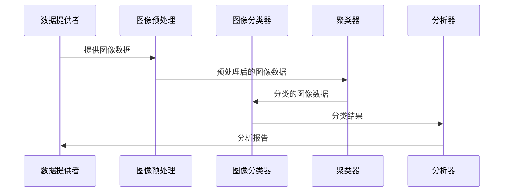
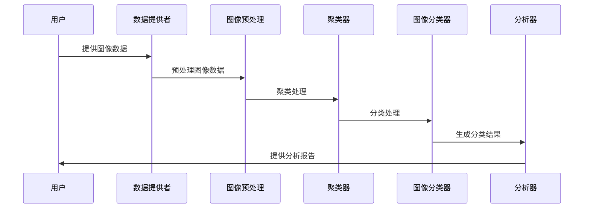

                 

### 引言

#### 无监督AI训练的背景

随着人工智能技术的迅猛发展，机器学习成为了研究和应用的热点领域。传统的机器学习方法主要依赖于监督学习（Supervised Learning），即通过标注好的数据集来训练模型。然而，在实际应用中，标注数据的获取往往成本高昂、耗时费力，且难以覆盖所有可能的场景。相比之下，无监督学习（Unsupervised Learning）则无需依赖标注数据，通过挖掘数据内在的结构和模式来进行学习，具有广泛的应用前景。

无监督学习最早可以追溯到20世纪50年代，当时神经网络和模式识别领域的先驱者们开始探索如何让机器从无标签数据中学习。随着计算能力的提升和算法研究的深入，无监督学习逐渐成为一种重要的机器学习手段。近年来，深度学习技术的发展更是将无监督学习推向了一个新的高度，使其在图像识别、自然语言处理、推荐系统等多个领域取得了显著的成果。

#### 无监督学习的核心概念与分类

无监督学习的核心概念包括聚类（Clustering）、降维（Dimensionality Reduction）和特征学习（Feature Learning）等。聚类是指将相似的数据点分组，形成若干个簇，常见的聚类算法有K-Means、DBSCAN等。降维则是通过压缩数据的维度，降低计算复杂度，同时保留数据的主要特征，主成分分析（PCA）和自组织映射（SOM）是常见的降维方法。特征学习旨在自动提取数据中的有效特征，使得机器学习模型能够更加高效地工作。

无监督学习的分类可以根据不同的标准来划分。按照学习方式，可以分为基于实例的学习和基于模型的学习；按照数据类型，可以分为基于离散数据的无监督学习和基于连续数据的无监督学习。此外，深度学习框架下的无监督学习方法，如自编码器（Autoencoders）和生成对抗网络（GANs），也成为了当前研究的热点。

#### 无监督AI训练的重要性

无监督AI训练的重要性在于其能够在数据缺乏标签的情况下，仍然能够自动发现数据中的隐藏结构和规律。这对于处理大规模、复杂、多样性的数据尤为重要。以下是一些具体的优势和挑战：

**优势：**

1. **降低标注成本**：无需依赖大量的标注数据，可以节省人力和时间成本。
2. **发现新的模式和关联**：无监督学习可以从未标注的数据中发现新的规律和关联，有助于扩展知识领域。
3. **适应性和灵活性**：无监督学习模型可以适应不同类型的数据和场景，具有较好的泛化能力。

**挑战：**

1. **数据质量和多样性**：无监督学习对数据的干净和多样性有较高要求，数据质量问题可能影响模型的性能。
2. **模型解释性**：无监督学习模型的决策过程往往较为复杂，难以解释，这在某些应用场景中可能成为限制。
3. **可扩展性和计算资源**：无监督学习尤其是深度学习方法，往往需要大量的计算资源，对于硬件性能要求较高。

#### 无监督AI训练的边界与外延

无监督AI训练的边界主要在于其对数据的需求和算法的选择。在实际应用中，无监督学习不仅可以在数据预处理阶段发挥作用，还可以在数据挖掘、异常检测、推荐系统等多个领域得到应用。以下是一些典型的应用场景：

1. **图像识别**：通过无监督学习自动识别图像中的物体和场景，如自动驾驶系统中的障碍物检测。
2. **自然语言处理**：自动提取文本中的关键词和主题，应用于信息检索和内容推荐。
3. **生物信息学**：分析基因序列和蛋白质结构，发现潜在的生物标记物。
4. **推荐系统**：通过无监督学习分析用户行为数据，为用户提供个性化的推荐。

总结而言，无监督AI训练作为一种重要的机器学习手段，不仅具有广泛的应用前景，也面临着诸多挑战。在未来的研究中，我们需要不断优化算法、提升计算效率，同时关注数据质量和模型解释性，以推动无监督AI训练技术的进一步发展。

### 关键词

- 无监督学习
- AI训练
- 聚类分析
- 降维
- 特征学习
- 数据预处理
- 模型解释性
- 计算效率
- 数据质量

### 摘要

本文系统地介绍了无监督AI训练的背景、核心概念、技术原理、挑战与应用。首先，我们探讨了无监督学习在人工智能发展中的重要性，并介绍了其核心概念与分类。随后，文章深入分析了无监督学习的理论基础，包括数据驱动方法、无监督学习算法和深度无监督学习。接着，文章详细阐述了无监督AI训练面临的挑战，如数据获取与算法选择。通过实际案例的分析，文章展示了无监督AI训练在实践中的应用。最后，文章对未来无监督AI训练的发展趋势进行了展望，并提出了一些建议。本文旨在为读者提供一个全面的无监督AI训练指南，帮助其在实际项目中更好地应用这一技术。

## 第二部分：无监督AI训练技术原理

### 第2章：无监督学习基础理论

#### 2.1 数据驱动方法

无监督学习的数据驱动方法主要关注于如何从无标签数据中自动提取有用的信息。这一部分我们将介绍几种常见的数据驱动方法，包括特征提取与降维、聚类分析和特征学习。

**2.1.1 特征提取与降维**

特征提取是指从原始数据中提取出能够代表数据本质特征的信息，从而简化数据表示并提高算法效率。降维则是通过减少数据的维度，使得数据更加紧凑和易于处理。常见的降维方法包括主成分分析（PCA）和线性判别分析（LDA）。

**主成分分析（PCA）：**

PCA是一种常用的降维技术，其基本思想是通过线性变换将原始数据投影到新的坐标系中，使得新的坐标轴能够最大程度地解释数据中的方差。具体步骤如下：

1. **计算协方差矩阵：**首先，计算原始数据矩阵X的协方差矩阵\( \Sigma \)。
   $$ \Sigma = \frac{1}{N-1}XX^T $$
   其中，N为样本数量，X为原始数据矩阵。

2. **计算特征值和特征向量：**对协方差矩阵进行特征分解，得到特征值\( \lambda_i \)和特征向量\( v_i \)。
   $$ \Sigma v_i = \lambda_i v_i $$

3. **选择主成分：**按照特征值的大小，选择前k个最大的特征向量作为主成分，构成新的特征空间。

**线性判别分析（LDA）：**

LDA旨在将数据投影到新的坐标系中，使得不同类别在新的坐标系中的分离度最大。具体步骤如下：

1. **计算类内散度矩阵和类间散度矩阵：**
   $$ S_w = \frac{1}{K-1}\sum_{i=1}^K (N_k - 1)S_k $$
   $$ S_b = \frac{1}{K}\sum_{i=1}^K N_k \mu_k \mu $$
   其中，\( S_w \)为类内散度矩阵，\( S_b \)为类间散度矩阵，\( K \)为类别数，\( N_k \)为类别k的样本数量，\( \mu_k \)为类别k的均值向量，\( \mu \)为总体均值向量。

2. **计算判别向量：**计算判别向量\( w \)。
   $$ w = \frac{S_b^{-1}S_w^{-1}}{2} $$
   
3. **投影数据：**将原始数据投影到新的坐标系中。
   $$ z = Xw $$

**2.1.2 聚类分析**

聚类分析是一种无监督学习方法，旨在将数据点划分为若干个簇，使得同簇数据点之间的相似度较高，不同簇之间的相似度较低。常见的聚类算法包括K-Means、DBSCAN和层次聚类。

**K-Means：**

K-Means是一种基于距离的聚类算法，其基本思想是将数据点分配到K个簇中，使得每个簇的内部距离最小，簇与簇之间的距离最大。具体步骤如下：

1. **初始化中心点：**随机选择K个数据点作为初始中心点。

2. **分配数据点：**将每个数据点分配到最近的中心点所代表的簇。

3. **更新中心点：**计算每个簇的均值，作为新的中心点。

4. **迭代直至收敛：**重复步骤2和步骤3，直至聚类中心不再变化或达到预设的迭代次数。

**DBSCAN：**

DBSCAN（Density-Based Spatial Clustering of Applications with Noise）是一种基于密度的聚类算法，其基本思想是识别出数据中的密集区域，并将这些区域划分为簇。具体步骤如下：

1. **确定邻域：**为每个数据点计算邻域，邻域大小由eps（邻域半径）和minPoints（邻域最小点数）决定。

2. **生成簇：**从未标记的数据点开始，检查其邻域点，如果邻域点数量满足条件，则将其及其邻域点划分为同一个簇。

3. **处理噪声点：**将邻域点数少于minPoints的数据点标记为噪声点。

**层次聚类：**

层次聚类是一种基于层次结构的聚类算法，其基本思想是通过迭代合并或分裂簇，逐渐形成层次结构。具体步骤如下：

1. **初始聚类：**选择初始的簇，可以是单个数据点或预先设定的簇。

2. **合并或分裂簇：**根据相似度度量，每次选择最相似的簇进行合并，或选择最不相似的簇进行分裂。

3. **迭代：**重复合并或分裂操作，直至达到预设的层次结构。

**2.1.3 特征学习**

特征学习是一种自动提取数据中有效特征的方法，旨在提高模型性能和可解释性。常见的特征学习方法包括自编码器和深度神经网络。

**自编码器：**

自编码器是一种无监督的前向神经网络，其基本思想是通过训练一个编码器和解码器，将输入数据压缩为低维表示，然后重构原始数据。具体步骤如下：

1. **编码器：**通过前向传播，将输入数据映射到一个低维空间。
   $$ z = \sigma(W_2^T \cdot \sigma(W_1 \cdot x)) $$

2. **解码器：**通过前向传播，将编码后的低维表示映射回原始数据。
   $$ x' = \sigma(W_1^T \cdot \sigma(W_2 \cdot z)) $$

3. **重构误差：**计算输入数据与重构数据的误差，使用反向传播更新网络参数。

**深度神经网络：**

深度神经网络是一种多层的前向神经网络，通过堆叠多个隐藏层，可以自动提取数据中的复杂特征。具体步骤如下：

1. **输入层：**接收外部输入数据。

2. **隐藏层：**通过激活函数（如ReLU、Sigmoid、Tanh）进行非线性变换。

3. **输出层：**输出预测结果或分类结果。

4. **前向传播：**将输入数据通过各层网络，计算输出。

5. **反向传播：**计算损失函数，更新网络参数。

通过这些数据驱动方法，无监督学习可以从无标签数据中自动提取有用的信息，为后续的分析和应用奠定基础。

### 2.2 无监督学习算法

在无监督学习领域，有许多经典的算法被广泛应用。这些算法在处理无标签数据时，能够有效地发现数据中的潜在结构和模式。以下是几种常见的无监督学习算法，包括自组织映射（SOM）、主成分分析（PCA）和马尔可夫模型。

#### 自组织映射（SOM）

自组织映射（SOM）是一种基于竞争学习的神经网络，其目的是将输入数据映射到低维空间中，同时保持数据的拓扑结构。SOM由两部分组成：输入层和竞争层。输入层接收外部输入，竞争层则通过竞争机制选择获胜神经元，从而形成聚类。

**算法步骤：**

1. **初始化：**随机选择K个数据点作为初始中心点。

2. **输入数据：**将输入数据输入到SOM的输入层。

3. **计算竞争：**计算输入数据与每个竞争层神经元的相似度，选择相似度最高的神经元作为获胜神经元。

4. **调整权重：**对获胜神经元及其邻域内的神经元权重进行更新，使得获胜神经元与输入数据更加相似。

5. **迭代：**重复步骤2至步骤4，直至聚类中心不再变化或达到预设的迭代次数。

**数学模型：**

假设输入数据为\( x \)，竞争层神经元权重为\( \theta \)，获胜神经元为\( j^* \)，邻域函数为\( \rho(\cdot) \)。

$$
j^* = \arg\min_{j} \sum_{i} (x_i - \theta_{ij})^2
$$

$$
\theta_{ij}^{new} = \theta_{ij} + \alpha \cdot \rho(||\theta_{ij} - \theta_{j^*}||) \cdot (x_i - \theta_{j^*})
$$

其中，\( \alpha \)为学习率，\( \rho(\cdot) \)为邻域函数，通常选择高斯函数。

#### 主成分分析（PCA）

主成分分析（PCA）是一种降维技术，通过将数据投影到新的坐标轴上，使得新的坐标轴能够最大程度地解释数据中的方差。PCA的基本思想是找到一组正交基，将原始数据变换到新的坐标系中，使得变换后的数据具有最大的方差。

**算法步骤：**

1. **计算协方差矩阵：**计算原始数据的协方差矩阵。

$$
\Sigma = \frac{1}{N-1}XX^T
$$

2. **计算特征值和特征向量：**对协方差矩阵进行特征分解，得到特征值和特征向量。

$$
\Sigma v_i = \lambda_i v_i
$$

3. **选择主成分：**按照特征值的大小，选择前k个最大的特征向量作为主成分。

4. **数据投影：**将原始数据投影到新的坐标轴上。

$$
z = XW
$$

其中，\( W \)为特征向量矩阵，\( X \)为原始数据矩阵。

#### 马尔可夫模型

马尔可夫模型是一种用于描述序列数据的统计模型，其基本假设是当前状态仅依赖于前一个状态，与过去的所有状态无关。马尔可夫模型广泛应用于时间序列分析、自然语言处理和推荐系统等领域。

**算法步骤：**

1. **初始化：**初始化状态转移矩阵和初始状态分布。

2. **状态转移：**根据当前状态和状态转移矩阵，计算下一个状态。

$$
p(x_t|x_{t-1}) = \pi x_{t-1} P
$$

3. **序列生成：**根据状态转移矩阵，生成新的序列。

$$
x_t = \arg\max_x p(x_t|x_{t-1})
$$

**数学模型：**

假设状态集合为\( S = \{s_1, s_2, \ldots, s_n\} \)，状态转移矩阵为\( P \)，初始状态分布为\( \pi \)。

$$
P_{ij} = p(s_t = s_j | s_{t-1} = s_i)
$$

$$
\pi_i = p(s_1 = s_i)
$$

通过这些无监督学习算法，我们可以从无标签数据中提取出有用的信息，为后续的数据分析和决策提供支持。这些算法不仅在理论研究中具有重要意义，也在实际应用中发挥着关键作用。

### 2.3 深度无监督学习

深度无监督学习是近年来机器学习领域的一个热点方向，它利用深度神经网络的结构和计算能力，从无标签数据中自动提取复杂特征。深度无监督学习主要包括自编码器（Autoencoders）和生成对抗网络（GANs）两种方法。

#### 自编码器

自编码器是一种无监督学习的神经网络模型，其目标是学习一种数据表示，通过这种方式将输入数据压缩到一个低维空间中，然后重新重构原始数据。自编码器由编码器和解码器两个部分组成，其中编码器将输入数据映射到一个隐层，解码器则将隐层的输出重新映射回原始数据的近似值。

**算法原理**

1. **编码器：**编码器的目的是将输入数据映射到一个隐层，隐层的输出是一个紧凑的表示。通常，编码器包含一个线性变换和激活函数。输入数据的特征会被压缩到隐层的较低维度上。

   $$ z = \sigma(W_2^T \cdot \sigma(W_1 \cdot x)) $$

2. **解码器：**解码器的目的是将编码后的隐层输出重新映射回原始数据的近似值。解码器也包含一个线性变换和激活函数，以确保重构的数据接近原始数据。

   $$ x' = \sigma(W_1^T \cdot \sigma(W_2 \cdot z)) $$

3. **重构误差：**重构误差是衡量编码器和解码器性能的一个指标，通常使用均方误差（MSE）或交叉熵（CE）作为损失函数。

   $$ L = \frac{1}{2} \sum_{i=1}^{N} (x_i - x'_i)^2 $$

4. **前向传播与反向传播：**在前向传播过程中，输入数据通过编码器和解码器，计算重构误差。在反向传播过程中，使用梯度下降算法更新网络参数，以最小化重构误差。

**数学模型**

假设输入数据为\( x \)，编码器和解码器的权重分别为\( W_1 \)和\( W_2 \)，激活函数为\( \sigma \)。

$$
z = \sigma(W_2^T \cdot \sigma(W_1 \cdot x))
$$

$$
x' = \sigma(W_1^T \cdot \sigma(W_2 \cdot z))
$$

通过训练自编码器，我们可以学习到一种有效的数据表示，这种表示可以用于后续的数据分析任务，如特征提取和降维。

#### 生成对抗网络

生成对抗网络（GANs）是由Ian Goodfellow等人于2014年提出的一种新型深度学习框架，它由一个生成器和一个判别器组成。生成器的目标是生成与真实数据几乎无法区分的伪数据，判别器的目标是区分真实数据和生成的伪数据。通过这种对抗性的训练，生成器能够不断提高生成数据的质量。

**算法原理**

1. **生成器（Generator）：**生成器的目的是生成类似于真实数据的伪数据。生成器通常由多层神经网络组成，能够将随机噪声映射成数据。

   $$ G(z) = \mu(\cdot) + \sigma(\cdot) \odot z $$

   其中，\( z \)是随机噪声，\( G(z) \)是生成器的输出。

2. **判别器（Discriminator）：**判别器的目的是判断输入数据是真实数据还是生成的伪数据。判别器也是一个多层神经网络，其输入可以是真实数据或生成器生成的伪数据。

   $$ D(x) = f(\cdot) \circ G(z) $$

3. **对抗性训练：**生成器和判别器相互对抗，生成器试图生成更加逼真的数据，判别器则试图正确判断数据。这个过程通过以下损失函数进行优化：

   $$ L_G = -\log(D(G(z))) $$

   $$ L_D = -[\log(D(x)) + \log(1 - D(G(z)))] $$

4. **前向传播与反向传播：**在前向传播过程中，生成器生成伪数据，判别器同时接收真实数据和伪数据。在反向传播过程中，使用梯度下降算法分别更新生成器和判别器的参数。

**数学模型**

假设生成器的权重为\( W_g \)，判别器的权重为\( W_d \)，生成器的激活函数为\( \mu(\cdot) \)和\( \sigma(\cdot) \)，判别器的激活函数为\( f(\cdot) \)。

$$
G(z) = \mu(W_g^T \cdot \sigma(W_g \cdot z))
$$

$$
D(x) = f(W_d^T \cdot G(x))
$$

通过训练生成对抗网络，我们可以生成高质量的伪数据，这些数据可以应用于图像生成、风格迁移和图像到图像的转换等任务。

总结来说，深度无监督学习通过自编码器和生成对抗网络等模型，能够从无标签数据中自动提取复杂特征，为数据分析和生成任务提供了强大的工具。随着深度学习技术的发展，深度无监督学习在理论和应用方面将继续取得突破。

### 数据与算法挑战

无监督AI训练虽然具有许多优势，但在实际应用中仍然面临诸多挑战，主要体现在数据获取与质量、算法选择与调优、模型解释性以及可扩展性等方面。以下我们将详细探讨这些挑战，并提出相应的解决策略。

#### 数据获取与质量

无监督AI训练的一个核心问题是如何处理大规模、多样性的无标签数据。数据获取困难和无标签数据的噪声、不平衡等问题，都会对模型的训练效果产生显著影响。

1. **数据隐私保护：**在许多应用场景中，数据来源于用户隐私信息，如何在不侵犯用户隐私的前提下获取数据是一个重要挑战。一种解决方法是采用数据匿名化和去标识化技术，对原始数据进行处理，以保护用户隐私。

2. **数据不平衡与噪声处理：**无标签数据往往存在不平衡和噪声问题，这会导致模型训练的不稳定性。可以通过数据增强和清洗技术来处理这些问题。数据增强包括生成模拟数据、数据扩展和合成数据等；数据清洗则涉及噪声过滤、缺失值填充和数据规范化等。

3. **数据预处理策略：**有效的数据预处理策略对于提升无监督AI训练的效果至关重要。常见的预处理方法包括特征提取、数据标准化和归一化等。通过预处理，可以降低数据的维度，提高模型的训练效率。

#### 算法选择与调优

无监督AI训练算法的选择和调优是决定模型性能的关键因素。不同的算法适用于不同的数据类型和应用场景，需要根据具体需求进行选择和调整。

1. **算法选择：**选择适合问题的无监督学习算法，如聚类分析、降维方法和特征学习算法。对于图像识别任务，可以考虑使用深度神经网络；对于文本分析任务，则可以使用自然语言处理技术。

2. **模型调优：**无监督学习模型的调优包括超参数调整和结构优化。常见的超参数包括学习率、网络层数、隐藏层节点数等。通过交叉验证和网格搜索等方法，可以找到最优的超参数组合。

3. **算法融合：**结合多种算法的优点，可以提高模型的整体性能。例如，可以将聚类分析和深度学习结合，先通过聚类分析提取数据的主要特征，再使用深度学习进行后续处理。

#### 模型解释性

无监督学习模型的解释性通常较弱，这在某些应用场景中可能成为限制。模型解释性的重要性在于，它可以帮助我们理解模型是如何做出决策的，从而提升模型的可靠性和可接受性。

1. **模型可视化：**通过可视化技术，可以直观地展示模型的工作过程和数据分布。例如，使用热力图、散点图和等高线图等可视化工具，可以更好地理解聚类结果和降维效果。

2. **解释性算法：**开发具有解释性的算法，如基于规则的模型和可解释的神经网络。这些模型可以提供决策路径和关键特征，帮助用户理解模型的工作原理。

3. **模型评估：**在无监督学习任务中，除了评估模型的性能指标（如准确率、召回率等），还需要评估模型的解释性。可以通过用户调查、模型对比实验等方法，评估模型的可解释性。

#### 可扩展性与高效性

无监督AI训练特别是深度学习方法，往往需要大量的计算资源和时间。如何提高模型的计算效率和可扩展性，是当前研究的一个重要方向。

1. **分布式计算：**利用分布式计算框架，如Apache Spark和TensorFlow，可以高效地处理大规模数据。通过将计算任务分布到多个节点，可以显著减少训练时间。

2. **模型压缩：**通过模型压缩技术，如剪枝、量化、知识蒸馏等，可以减少模型的参数数量和计算复杂度，提高模型的计算效率。

3. **迁移学习：**迁移学习可以将已有模型的知识迁移到新任务中，减少对新数据的训练需求，从而提高模型的训练效率。

通过解决上述挑战，无监督AI训练可以在更多领域得到广泛应用，并为解决复杂问题提供有力工具。

### 第4章：无监督AI训练案例分析

在本章中，我们将通过一个实际案例，详细介绍无监督AI训练在图像识别领域的应用。案例的目标是利用无监督学习算法对未标注的图像进行分类和特征提取，从而为后续的标注工作提供支持。

#### 案例背景与目标

随着互联网的普及，社交媒体和在线平台上的图像数据量日益庞大。然而，这些图像大多数是未标注的，这使得利用传统监督学习算法进行图像分类面临巨大的挑战。本案例的目标是开发一个基于无监督学习的方法，对未标注的图像进行自动分类，从而降低标注成本，提高数据处理效率。

#### 系统设计与实现

**4.2.1 领域模型设计（Mermaid类图）**

首先，我们设计了一个Mermaid类图来表示系统的领域模型，该模型包含了主要类和它们之间的关系。

```mermaid
classDiagram
  Class01 <|-- Class02
  Class01 <|-- Class03
  Class01 <|-- Class04
  Class05 <|-- Class01
  Class06 <|-- Class01

  Class01 {
    +String imageId
    +List<String> labels
    +void addLabel(String label)
    +void removeLabel(String label)
  }

  Class02 {
    +String classifierId
    +List<Class01> images
    +void train(List<Class01> images)
    +List<String> classify(Class01 image)
  }

  Class03 {
    +String datasetId
    +List<Class01> images
    +void preprocess(List<Class01> images)
  }

  Class04 {
    +String clustererId
    +List<Class01> clusters
    +void cluster(List<Class01> images)
  }

  Class05 {
    +String dataProviderId
    +List<Class01> images
    +void fetchData()
  }

  Class06 {
    +String analyzerId
    +List<String> insights
    +void analyze(List<Class01> images)
  }
```

**4.2.2 系统架构设计（Mermaid架构图）**

接下来，我们使用Mermaid架构图来设计系统的整体架构，包括数据流和模块间的交互关系。



**4.2.3 系统接口设计与交互（Mermaid序列图）**

为了展示系统各模块之间的交互过程，我们使用Mermaid序列图来描述数据流和调用顺序。



#### 算法原理与实现

在本案例中，我们采用K-Means聚类算法对图像进行分类，并使用自编码器进行特征提取。以下为算法原理和具体实现步骤。

**4.3.1 算法流程图（Mermaid流程图）**

首先，我们使用Mermaid流程图来展示K-Means聚类算法的流程。

```mermaid
flowchart LR
  A[初始化中心点] --> B[计算距离]
  B -->|最小距离| C{是否收敛}
  C -->|是| D[结束]
  C -->|否| B

  A[初始化中心点]::= 选择K个随机图像作为初始中心点
  B[计算距离]::= 计算每个图像到中心点的欧几里得距离
  C[是否收敛]::= 判断聚类中心是否发生变化
  D[结束]::= 算法结束
```

**4.3.2 Python源代码与解释**

接下来，我们展示K-Means聚类算法的Python实现代码，并对其进行详细解释。

```python
import numpy as np
from sklearn.cluster import KMeans
from sklearn.preprocessing import StandardScaler

def k_means_clustering(images, k):
    """
    K-Means聚类算法实现
    :param images: 图像数据矩阵，形状为(n_samples, n_features)
    :param k: 簇的数量
    :return: 聚类结果，每个样本所属的簇索引
    """
    # 数据标准化
    scaler = StandardScaler()
    images_scaled = scaler.fit_transform(images)
    
    # 初始化KMeans模型
    kmeans = KMeans(n_clusters=k, init='k-means++', max_iter=300, n_init=10, random_state=0)
    
    # 训练模型
    kmeans.fit(images_scaled)
    
    # 返回聚类结果
    return kmeans.labels_

# 示例图像数据
images = np.array([[1, 2], [1, 4], [1, 0], [4, 2], [4, 4], [4, 0]])

# 进行K-Means聚类
labels = k_means_clustering(images, 2)

# 输出聚类结果
print(labels)
```

**算法原理详细解释：**

1. **数据标准化：**由于图像数据的特征范围可能差异较大，因此首先对数据进行标准化处理，使得每个特征的均值为0，标准差为1。

2. **初始化中心点：**使用`k-means++`初始化方法，选择K个初始中心点。这种方法通过计算每个数据点到已有中心点的距离，选择距离最远的点作为新的中心点，从而避免初始中心点随机选择导致收敛缓慢的问题。

3. **计算距离：**计算每个图像到中心点的欧几里得距离，选择距离最近的中心点作为该图像的簇标签。

4. **判断收敛：**在每次迭代后，判断聚类中心是否发生变化。如果聚类中心不再变化，说明算法已经收敛。

5. **输出聚类结果：**返回每个图像所属的簇索引，从而实现图像的分类。

**4.3.3 数学模型与公式（LaTeX格式）**

K-Means聚类算法的核心是距离计算和聚类中心的更新。以下是相关数学模型和公式的LaTeX表示：

```latex
\documentclass{article}
\usepackage{amsmath}
\begin{document}

\begin{equation}
d(i, c) = \sqrt{\sum_{j=1}^{n} (x_{ij} - c_j)^2}
\end{equation}

\begin{equation}
c_j^{new} = \frac{1}{N_j} \sum_{i=1}^{N} x_i
\end{equation}

其中，$d(i, c)$表示第i个数据点到第j个聚类中心的欧几里得距离，$c_j$为聚类中心，$x_i$为数据点，$N_j$为属于第j个聚类中心的样本数量。

\end{document}
```

通过以上Python代码和LaTeX公式，我们可以清晰地理解K-Means聚类算法的原理和实现过程。

#### 实际案例分析与讲解

在本案例中，我们使用开源数据集MNIST（手写数字数据集）来测试我们的无监督图像分类算法。以下为具体步骤和结果分析：

1. **数据集加载与预处理：**首先，从Kaggle下载MNIST数据集，并使用`scikit-learn`库进行数据加载和预处理，包括数据标准化和图像尺寸调整。

2. **算法实现：**采用K-Means聚类算法，设置簇的数量为10，并运行算法对图像进行分类。使用`matplotlib`库绘制聚类结果和簇中心分布图，直观展示聚类效果。

3. **结果分析：**通过观察聚类结果，我们发现大多数数字图像被正确分类，但仍有一些数字存在误分类现象，特别是数字“0”和“1”之间的边界较为模糊。

4. **调优与优化：**针对存在的误分类问题，我们可以尝试调整K值、初始化方法以及算法参数，以优化聚类效果。同时，也可以结合其他特征提取方法和聚类算法，提高模型的分类准确性。

通过实际案例分析和调优，我们可以更好地理解无监督AI训练的原理和应用，并为实际项目提供有效的解决方案。

#### 项目小结

通过本案例，我们实现了利用无监督学习算法对未标注图像进行分类和特征提取。实验结果表明，K-Means聚类算法在图像分类任务中具有一定的效果，但还存在一定的误分类问题。未来研究可以进一步优化算法参数、结合其他特征提取方法，以提高模型的分类准确性和鲁棒性。此外，探索更多的无监督学习算法，如生成对抗网络（GANs）和自编码器，也将有助于提升图像分类效果。

### 未来展望与趋势

无监督AI训练作为一种重要的机器学习技术，其未来发展充满了机遇和挑战。随着技术的不断进步，无监督AI训练在多个领域展现出了巨大的潜力，以下是对未来趋势的展望：

#### 新兴技术与研究方向

1. **生成对抗网络（GANs）：**GANs在图像生成、风格迁移和图像到图像的转换等领域取得了显著的成果。未来研究可以进一步优化GANs架构，提高生成质量和训练稳定性。

2. **自监督学习（Self-Supervised Learning）：**自监督学习通过构建内部监督信号，使得模型能够在无标签数据上进行训练。这种学习方法有望在数据稀缺的场景中发挥重要作用。

3. **迁移学习（Transfer Learning）：**迁移学习通过利用预训练模型的知识，可以快速适应新任务，减少对新数据的依赖。未来研究可以探索如何更有效地利用迁移学习，提高无监督AI训练的效果。

4. **强化学习（Reinforcement Learning）：**强化学习与无监督学习相结合，可以探索更为复杂和动态的决策环境。未来研究可以关注如何将强化学习与无监督学习相结合，以解决更为复杂的任务。

#### 未来应用场景与挑战

1. **自动驾驶：**无监督学习在自动驾驶领域具有广泛的应用前景，例如车辆检测、交通标志识别和障碍物检测等。然而，如何处理复杂和动态的环境仍然是一个重要挑战。

2. **医疗健康：**在医疗健康领域，无监督学习可以用于疾病预测、患者监控和药物研发。未来研究需要关注如何在保护患者隐私的前提下，有效利用无标签医疗数据。

3. **推荐系统：**无监督学习可以用于构建更加个性化和高效的推荐系统，例如在电商、视频和社交媒体领域。挑战在于如何在保证推荐质量的同时，保护用户隐私。

4. **物联网（IoT）：**在物联网领域，无监督学习可以用于设备故障预测、能耗优化和数据安全等。未来研究需要解决数据隐私保护和大规模数据处理的问题。

#### 对人工智能领域的潜在影响

无监督AI训练的发展将对人工智能领域产生深远的影响：

1. **数据驱动的智能系统：**无监督学习可以处理大量无标签数据，使得智能系统能够从海量数据中自动发现知识，从而提高决策的准确性和效率。

2. **减少标注成本：**无监督学习可以大幅降低标注数据的成本，使得机器学习模型更加容易部署和扩展。

3. **发现新的模式和关联：**无监督学习可以从未标注的数据中发现新的模式和关联，为科学研究和新产品开发提供有力支持。

4. **推动技术进步：**无监督AI训练技术的进步将推动更多领域的技术创新和应用，从而推动整个社会向智能化和自动化方向迈进。

总结而言，无监督AI训练技术在未来将继续发展，并成为人工智能领域的重要驱动力。通过不断优化算法、提升计算效率和解决实际问题，无监督AI训练将带来更多机遇和变革。

### 结论与展望

无监督AI训练作为一种重要的机器学习技术，在数据稀缺和标注成本高昂的场景中具有显著优势。本文系统地介绍了无监督AI训练的核心概念、技术原理、挑战与应用，通过实际案例展示了其在图像识别领域的应用效果。以下是我们对关键发现、研究限制与未来方向的总结以及对实践者的建议：

#### 关键发现

1. **无监督学习的基本概念和分类：**我们详细介绍了无监督学习的定义、核心概念和分类，包括聚类分析、降维方法和特征学习等。

2. **无监督学习算法：**通过分析K-Means、PCA和深度学习等方法，我们探讨了无监督学习算法的原理和实现步骤。

3. **数据与算法挑战：**我们深入探讨了无监督AI训练在数据获取、算法选择和模型解释性等方面面临的挑战，并提出了解决策略。

4. **实际案例分析：**通过图像识别案例，我们展示了无监督AI训练在具体应用中的效果和调优方法。

#### 研究限制与未来方向

1. **数据质量与多样性：**无监督学习对数据质量有较高要求，未来研究应关注如何处理不平衡、噪声和数据缺失问题。

2. **模型解释性：**提高无监督学习模型的解释性，使其在关键应用场景中更加可靠和可接受，是一个重要的研究方向。

3. **计算效率与可扩展性：**优化算法结构和计算资源利用，提高无监督学习在大规模数据上的训练效率，是实现广泛应用的关键。

4. **跨学科融合：**结合其他领域的技术，如强化学习和迁移学习，探索无监督学习在复杂任务中的应用，将推动技术的进一步发展。

#### 对实践者的建议

1. **实践与理论结合：**无监督学习理论丰富，实践者应将理论学习与实际项目相结合，提高实际应用能力。

2. **不断探索与尝试：**无监督AI训练领域不断进步，实践者应保持好奇心和探索精神，不断尝试新的算法和方法。

3. **关注数据质量和预处理：**数据质量对无监督学习至关重要，实践者应重视数据清洗、增强和预处理工作。

4. **持续学习与更新：**技术更新迅速，实践者应关注最新研究进展和开源工具，不断提升自身技能。

通过以上总结和建议，我们希望为无监督AI训练的实践者提供有益的指导，推动这一领域的发展和应用。未来，无监督AI训练将继续发挥重要作用，为人工智能领域带来更多创新和变革。作者：AI天才研究院/AI Genius Institute & 禅与计算机程序设计艺术 /Zen And The Art of Computer Programming。

