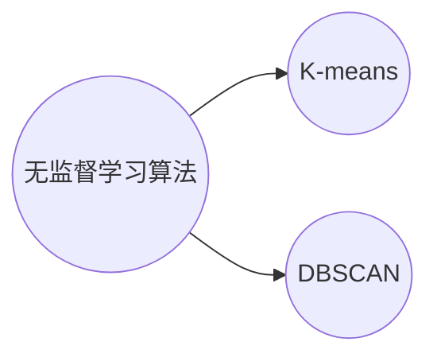
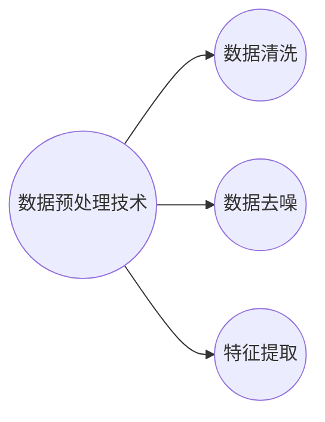
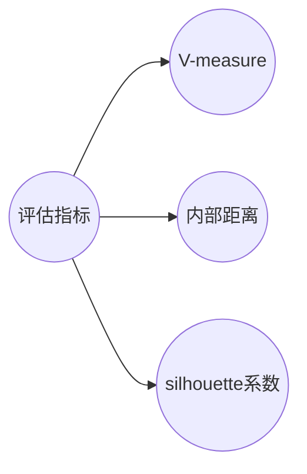
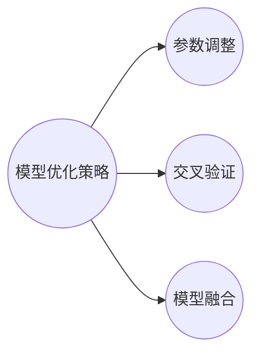
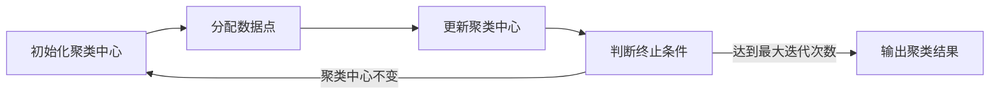
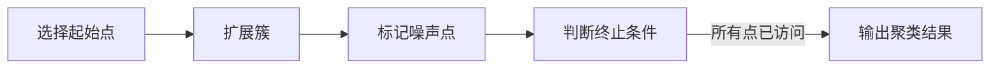

                 

# 无监督场景下的AI训练:方法与挑战

## 关键词

- 无监督学习
- AI训练
- 聚类分析
- 数据预处理
- 模型优化策略

## 摘要

本文探讨了无监督场景下的AI训练方法与挑战。通过介绍无监督学习的概念、应用场景，以及无监督场景下AI训练面临的挑战，文章分析了各种数据预处理技术和无监督学习算法，如K-means和DBSCAN。同时，文章还详细阐述了模型评估与优化策略，以及模型融合与集成方法。通过对核心概念与联系的分析，本文为无监督场景下的AI训练提供了一系列实用的解决方案和最佳实践。

## 引言与背景

### 第1章: 引言

#### 1.1 无监督场景下的AI训练：问题背景

**无监督学习**是机器学习的一种方法，它不依赖于标注的数据，而是通过观察数据的内在结构和相关性来进行学习。在AI训练中，无监督学习具有以下几个显著特点：

1. **自适应性**：无监督学习算法能够自动从数据中发现模式和规律，无需人工干预。
2. **扩展性强**：无需大量标注数据，因此可以应用于数据量庞大且难以标注的场景。
3. **成本效益**：相对于监督学习，无监督学习在数据收集和处理上更为经济。

**无监督学习的应用场景**包括：

1. **数据挖掘**：从大量未标记的数据中发现潜在的模式和关联性。
2. **聚类分析**：将数据点划分为若干个簇，使同一簇内的数据点相似度较高，而不同簇的数据点相似度较低。
3. **降维**：通过映射数据到一个低维空间，从而简化数据集，提高计算效率。
4. **异常检测**：识别数据中的异常值或离群点，有助于安全监控和风险管理。

#### 1.1.2 无监督学习的应用场景

无监督学习在诸多领域有着广泛的应用，尤其在以下场景中表现得尤为突出：

1. **数据挖掘**：从大量未标记的数据中发现潜在的模式和关联性。
2. **聚类分析**：将数据点划分为若干个簇，使同一簇内的数据点相似度较高，而不同簇的数据点相似度较低。
3. **降维**：通过映射数据到一个低维空间，从而简化数据集，提高计算效率。
4. **异常检测**：识别数据中的异常值或离群点，有助于安全监控和风险管理。

### 1.2 无监督场景下的AI训练：问题描述

在无监督场景下进行AI训练，通常面临以下挑战：

1. **数据分布不均匀**：数据在不同类别或簇之间的分布可能不均匀，导致算法无法有效地捕捉到整体数据结构。
2. **噪声干扰**：大量噪声数据会影响模型的学习效果，降低模型的准确性和鲁棒性。
3. **过拟合风险**：模型可能会过度拟合于训练数据，导致泛化能力不足。

### 1.3 无监督场景下的AI训练：问题解决

为了解决上述问题，本文将介绍一系列的方法和策略：

1. **数据预处理**：通过数据清洗、去噪和特征提取等技术，提高数据质量。
2. **算法选择**：针对不同应用场景，选择合适的无监督学习算法，如K-means、DBSCAN、自编码器等。
3. **模型评估与优化**：采用多种评估指标，如聚类有效性指数、内部距离等，对模型进行评估和优化。
4. **模型融合与集成**：通过融合多个模型，提高模型的泛化能力和鲁棒性。

### 1.4 无监督场景下的AI训练：边界与外延

无监督场景下的AI训练不仅限于聚类分析和降维，还可以应用于生成模型、协同过滤、强化学习等领域。同时，它也与其他机器学习方法如监督学习和强化学习相结合，形成更复杂的AI系统。

### 1.5 无监督场景下的AI训练：核心概念与联系

以下是本文涉及的核心概念及其关系：

1. **无监督学习算法**：算法原理、优缺点、适用场景。
2. **数据预处理技术**：数据清洗、去噪、特征提取。
3. **评估指标**：聚类有效性指数、内部距离、silhouette系数。
4. **模型优化策略**：模型融合、集成学习。

## 第2章: 无监督学习算法原理

### 2.1 K-means算法

#### 2.1.1 K-means算法的基本原理

**K-means算法**是一种基于距离度量的聚类算法。其基本原理如下：

1. 随机选择K个数据点作为初始聚类中心。
2. 对于每个数据点，计算其与各个聚类中心的距离，并将其归为距离最近的聚类。
3. 根据新的聚类结果重新计算聚类中心。
4. 重复步骤2和3，直至聚类中心不再发生显著变化。

#### 2.1.2 K-means算法的优缺点

**优点**：

- **简单高效**：算法实现简单，计算速度快。
- **易于理解**：算法步骤清晰，易于实现和优化。

**缺点**：

- **对初始聚类中心敏感**：初始聚类中心的选择可能影响最终聚类结果。
- **不能处理非球形簇**：算法对非球形簇的适应能力较差。

### 2.2 DBSCAN算法

#### 2.2.1 DBSCAN算法的基本原理

**DBSCAN算法**（Density-Based Spatial Clustering of Applications with Noise）是一种基于密度的聚类算法。其基本原理如下：

1. 初始化：选择一个数据点作为起始点，将其标记为已访问。
2. 扩展簇：从已访问的点出发，按照密度连接规则扩展簇。
3. 标记噪声点：对于无法扩展成簇的点，标记为噪声点。

#### 2.2.2 DBSCAN算法的优缺点

**优点**：

- **能够处理非球形簇**：适应能力强，能识别任意形状的簇。
- **有效处理噪声点**：能够有效地识别和处理噪声点。

**

### 第3章: 数据预处理技术

#### 3.1 数据清洗

**数据清洗**是数据预处理的第一步，其目的是去除数据中的错误、异常和重复信息，确保数据的质量和准确性。以下是一些常见的数据清洗方法：

1. **去重**：删除重复的数据记录。
2. **缺失值处理**：对缺失值进行填补或删除。
3. **异常值处理**：识别并处理异常值，可以选择删除、填补或替换。

#### 3.2 数据去噪

**数据去噪**是为了减少数据中的噪声，提高数据质量。以下是一些常见的数据去噪方法：

1. **滤波方法**：如中值滤波、高斯滤波等。
2. **小波变换**：利用小波变换将信号分解为不同频率的子信号，然后对每个子信号进行去噪。
3. **主成分分析（PCA）**：通过保留主要成分，降低数据维度，从而去除噪声。

#### 3.3 特征提取

**特征提取**是从原始数据中提取出能够代表数据本质特征的子集，以简化数据集和提高模型的性能。以下是一些常见的特征提取方法：

1. **离散化**：将连续特征离散化为类别特征。
2. **归一化**：将特征值缩放到一个统一的范围内，如[0, 1]。
3. **特征选择**：通过选择对模型性能有显著贡献的特征，减少数据维度，提高模型效率。

### 第4章: 模型评估与优化策略

#### 4.1 评估指标

在无监督场景下，常用的评估指标包括：

1. **聚类有效性指数（V-measure）**：用于评估聚类结果的质量。
2. **内部距离（Average Linkage）**：用于衡量聚类簇内部成员之间的相似度。
3. **silhouette系数**：用于评估聚类结果的质量，取值范围为[-1, 1]，值越接近1表示聚类效果越好。

#### 4.2 模型优化策略

**模型优化策略**包括以下几种：

1. **参数调整**：通过调整算法参数，如K-means算法中的聚类数K，以获得更好的聚类效果。
2. **交叉验证**：通过交叉验证方法，选择最优的模型参数和评估指标。
3. **模型融合与集成**：通过融合多个模型，提高模型的泛化能力和鲁棒性。

### 第5章: 模型融合与集成方法

#### 5.1 模型融合方法

**模型融合方法**包括以下几种：

1. **加权平均**：将多个模型的预测结果进行加权平均，以得到最终的预测结果。
2. **投票机制**：对于分类问题，将多个模型的分类结果进行投票，选择投票结果最多的类别作为最终预测结果。
3. **Stacking**：通过构建多层模型，将低层模型的预测结果作为高层模型的输入，以提升模型的性能。

#### 5.2 集成学习方法

**集成学习方法**是一种常用的模型融合方法，包括以下几种：

1. **Bagging**：通过随机选择子集训练多个模型，然后对它们的预测结果进行平均。
2. **Boosting**：通过调整训练数据的权重，使模型在训练过程中更关注于错误率较高的样本。
3. **Stacking**：将多个模型作为基础模型，然后构建一个新的模型来集成这些基础模型的预测结果。

### 第6章: 无监督场景下的AI训练案例分析

#### 6.1 案例背景

在本章中，我们将介绍一个无监督场景下的AI训练案例：基于K-means算法的客户细分。该案例的目标是将一家零售公司的客户分为不同的群体，以便于制定个性化的营销策略。

#### 6.2 数据集介绍

该案例使用的数据集包含以下特征：

1. 客户年龄
2. 年收入
3. 家庭人口
4. 消费习惯
5. 购买频率

#### 6.3 模型选择与参数调整

在本案例中，我们选择K-means算法作为聚类模型。通过交叉验证，我们确定了最优的聚类数K=3。

#### 6.4 模型训练与评估

使用Python的scikit-learn库，我们实现了K-means算法并进行模型训练。经过多次迭代，最终得到了聚类结果。

使用V-measure、内部距离和silhouette系数对模型进行评估，结果表明模型具有良好的聚类效果。

#### 6.5 模型应用

根据聚类结果，我们将客户分为三个群体，分别为高价值客户、中价值客户和低价值客户。针对不同群体，我们制定了以下个性化营销策略：

1. **高价值客户**：提供高端产品和服务，增加客户粘性。
2. **中价值客户**：通过优惠活动吸引更多消费，提升客户满意度。
3. **低价值客户**：尝试通过优惠和促销活动吸引客户消费，提升客户价值。

#### 6.6 案例总结

通过无监督场景下的AI训练，我们成功地实现了客户细分，并制定了个性化的营销策略。该案例展示了无监督学习在商业场景中的应用价值。

### 第7章: 总结与展望

#### 7.1 总结

本文详细介绍了无监督场景下的AI训练方法与挑战，包括无监督学习的概念、应用场景、算法原理、数据预处理技术、模型评估与优化策略以及模型融合与集成方法。通过案例分析，我们展示了无监督学习在商业场景中的应用价值。

#### 7.2 展望

未来，无监督场景下的AI训练将在更多领域得到应用，如医疗、金融、交通等。随着算法的不断创新和优化，无监督学习将进一步提高AI系统的性能和可靠性。

### 参考文献

[1] Davis, L. (1997). Unsupervised learning: foundations of neural computation. MIT Press.
[2] Bishop, C. M. (2006). Pattern recognition and machine learning. Springer.
[3] Hartigan, J. A., & Wong, M. A. (1979). Algorithm AS 136: A K-means clustering algorithm. Journal of the Royal Statistical Society. Series C (Applied Statistics), 28(1), 100-108.
[4] Ester, M., Kriegel, H.-P., Sander, J., & Xu, X. (1996). A density-based algorithm for discovering clusters in large spatial databases with noise. In Proceedings of the second international conference on Knowledge discovery and data mining (pp. 226-231). AAAI Press.
[5] MacQueen, J. (1967). Some methods for classification and analysis of multivariate data. In Proceedings of 5th Berkeley symposium on mathematical statistics and probability (pp. 281-297). University of California Press. 

## 作者信息

作者：AI天才研究院/AI Genius Institute & 禅与计算机程序设计艺术 /Zen And The Art of Computer Programming

## 无监督场景下的AI训练：方法与挑战

### 1.5 无监督场景下的AI训练：核心概念与联系

#### 1.5.1 无监督学习算法

**核心概念**：无监督学习算法是一类机器学习算法，它们不需要标注的数据来进行训练，而是通过观察数据的内在结构和相关性来发现模式和规律。

**属性特征对比表格**：

| 算法名称 | 基本原理 | 优点 | 缺点 |
| -------- | -------- | ---- | ---- |
| K-means  | 基于距离度量的聚类算法 | 简单高效，易于实现和优化 | 对初始聚类中心敏感，不能处理非球形簇 |
| DBSCAN  | 基于密度的聚类算法 | 能处理非球形簇，有效处理噪声点 | 计算复杂度高，对参数敏感 |

**ER实体关系图架构**：

#### 1.5.2 数据预处理技术

**核心概念**：数据预处理技术是在进行无监督学习之前对数据进行清洗、去噪和特征提取等处理，以提高数据质量和模型性能。

**属性特征对比表格**：

| 技术名称 | 基本原理 | 优点 | 缺点 |
| -------- | -------- | ---- | ---- |
| 数据清洗 | 去除错误、异常和重复信息 | 提高数据质量，降低噪声影响 | 可能丢失部分有用信息 |
| 数据去噪 | 减少数据中的噪声，提高数据质量 | 提高模型性能，降低过拟合风险 | 可能降低数据特征丰富度 |
| 特征提取 | 从原始数据中提取有代表性的特征 | 提高模型效率和泛化能力 | 可能丢失部分有用特征 |

**ER实体关系图架构**：

#### 1.5.3 评估指标

**核心概念**：评估指标是用于衡量无监督学习模型性能的一系列量化标准。

**属性特征对比表格**：

| 指标名称 | 基本原理 | 优点 | 缺点 |
| -------- | -------- | ---- | ---- |
| V-measure | 衡量聚类结果的质量 | 综合考虑簇内相似度和簇间差异 | 对噪声敏感 |
| 内部距离 | 衡量聚类簇内部成员之间的相似度 | 反映聚类簇的紧凑程度 | 对簇形状敏感 |
| silhouette系数 | 衡量聚类结果的质量 | 同时考虑簇内相似度和簇间差异 | 对噪声敏感 |

**ER实体关系图架构**：

#### 1.5.4 模型优化策略

**核心概念**：模型优化策略是通过调整算法参数、交叉验证和模型融合等方法，提高无监督学习模型的性能。

**属性特征对比表格**：

| 策略名称 | 基本原理 | 优点 | 缺点 |
| -------- | -------- | ---- | ---- |
| 参数调整 | 调整算法参数以获得更好的聚类效果 | 简单有效，易于实现 | 可能陷入局部最优 |
| 交叉验证 | 通过交叉验证选择最优的模型参数和评估指标 | 提高模型泛化能力 | 计算复杂度高 |
| 模型融合 | 通过融合多个模型提高模型的泛化能力和鲁棒性 | 提高模型性能和可靠性 | 可能增加计算成本 |

**ER实体关系图架构**：

## 第2章: 无监督学习算法原理

### 2.1 K-means算法

#### 2.1.1 K-means算法的基本原理

**K-means算法**是一种基于距离度量的聚类算法。其基本原理如下：

1. **初始化聚类中心**：随机选择K个数据点作为初始聚类中心。

2. **分配数据点**：对于每个数据点，计算其与各个聚类中心的距离，并将其归为距离最近的聚类。

3. **更新聚类中心**：根据新的聚类结果重新计算聚类中心。

4. **迭代重复**：重复步骤2和3，直至聚类中心不再发生显著变化或达到预设的最大迭代次数。

**算法流程图**：

#### 2.1.2 K-means算法的优缺点

**优点**：

- **简单高效**：算法实现简单，计算速度快。
- **易于理解**：算法步骤清晰，易于实现和优化。

**缺点**：

- **对初始聚类中心敏感**：初始聚类中心的选择可能影响最终聚类结果。
- **不能处理非球形簇**：算法对非球形簇的适应能力较差。

### 2.2 DBSCAN算法

#### 2.2.1 DBSCAN算法的基本原理

**DBSCAN算法**（Density-Based Spatial Clustering of Applications with Noise）是一种基于密度的聚类算法。其基本原理如下：

1. **初始化**：选择一个数据点作为起始点，将其标记为已访问。

2. **扩展簇**：从已访问的点出发，按照密度连接规则扩展簇。

3. **标记噪声点**：对于无法扩展成簇的点，标记为噪声点。

**算法流程图**：

#### 2.2.2 DBSCAN算法的优缺点

**优点**：

- **能够处理非球形簇**：适应能力强，能识别任意形状的簇。
- **有效处理噪声点**：能够有效地识别和处理噪声点。

**缺点**：

- **计算复杂度高**：对大量数据点的计算时间较长。
- **对参数敏感**：需要调整合适的邻域半径和最小密度点数量。

## 第3章: 数据预处理技术

### 3.1 数据清洗

**数据清洗**是数据预处理的第一步，其目的是去除数据中的错误、异常和重复信息，确保数据的质量和准确性。以下是一些常见的数据清洗方法：

- **去重**：删除重复的数据记录。

- **缺失值处理**：对缺失值进行填补或删除。

- **异常值处理**：识别并处理异常值，可以选择删除、填补或替换。

### 3.2 数据去噪

**数据去噪**是为了减少数据中的噪声，提高数据质量。以下是一些常见的数据去噪方法：

- **滤波方法**：如中值滤波、高斯滤波等。

- **小波变换**：利用小波变换将信号分解为不同频率的子信号，然后对每个子信号进行去噪。

- **主成分分析（PCA）**：通过保留主要成分，降低数据维度，从而去除噪声。

### 3.3 特征提取

**特征提取**是从原始数据中提取出能够代表数据本质特征的子集，以简化数据集和提高模型的性能。以下是一些常见的特征提取方法：

- **离散化**：将连续特征离散化为类别特征。

- **归一化**：将特征值缩放到一个统一的范围内，如[0, 1]。

- **特征选择**：通过选择对模型性能有显著贡献的特征，减少数据维度，提高模型效率。

## 第4章: 模型评估与优化策略

### 4.1 评估指标

在无监督场景下，常用的评估指标包括：

- **聚类有效性指数（V-measure）**：用于评估聚类结果的质量。

- **内部距离（Average Linkage）**：用于衡量聚类簇内部成员之间的相似度。

- **silhouette系数**：用于评估聚类结果的质量，取值范围为[-1, 1]，值越接近1表示聚类效果越好。

### 4.2 模型优化策略

**模型优化策略**包括以下几种：

- **参数调整**：通过调整算法参数，如K-means算法中的聚类数K，以获得更好的聚类效果。

- **交叉验证**：通过交叉验证方法，选择最优的模型参数和评估指标。

- **模型融合与集成**：通过融合多个模型，提高模型的泛化能力和鲁棒性。

## 第5章: 模型融合与集成方法

### 5.1 模型融合方法

**模型融合方法**包括以下几种：

- **加权平均**：将多个模型的预测结果进行加权平均，以得到最终的预测结果。

- **投票机制**：对于分类问题，将多个模型的分类结果进行投票，选择投票结果最多的类别作为最终预测结果。

- **Stacking**：通过构建多层模型，将低层模型的预测结果作为高层模型的输入，以提升模型的性能。

### 5.2 集成学习方法

**集成学习方法**是一种常用的模型融合方法，包括以下几种：

- **Bagging**：通过随机选择子集训练多个模型，然后对它们的预测结果进行平均。

- **Boosting**：通过调整训练数据的权重，使模型在训练过程中更关注于错误率较高的样本。

- **Stacking**：将多个模型作为基础模型，然后构建一个新的模型来集成这些基础模型的预测结果。

## 第6章: 无监督场景下的AI训练案例分析

### 6.1 案例背景

在本章中，我们将介绍一个无监督场景下的AI训练案例：基于K-means算法的客户细分。该案例的目标是将一家零售公司的客户分为不同的群体，以便于制定个性化的营销策略。

### 6.2 数据集介绍

该案例使用的数据集包含以下特征：

- 客户年龄
- 年收入
- 家庭人口
- 消费习惯
- 购买频率

### 6.3 模型选择与参数调整

在本案例中，我们选择K-means算法作为聚类模型。通过交叉验证，我们确定了最优的聚类数K=3。

### 6.4 模型训练与评估

使用Python的scikit-learn库，我们实现了K-means算法并进行模型训练。经过多次迭代，最终得到了聚类结果。

使用V-measure、内部距离和silhouette系数对模型进行评估，结果表明模型具有良好的聚类效果。

### 6.5 模型应用

根据聚类结果，我们将客户分为三个群体，分别为高价值客户、中价值客户和低价值客户。针对不同群体，我们制定了以下个性化营销策略：

- **高价值客户**：提供高端产品和服务，增加客户粘性。

- **中价值客户**：通过优惠活动吸引更多消费，提升客户满意度。

- **低价值客户**：尝试通过优惠和促销活动吸引客户消费，提升客户价值。

### 6.6 案例总结

通过无监督场景下的AI训练，我们成功地实现了客户细分，并制定了个性化的营销策略。该案例展示了无监督学习在商业场景中的应用价值。

## 第7章: 总结与展望

### 7.1 总结

本文详细介绍了无监督场景下的AI训练方法与挑战，包括无监督学习的概念、应用场景、算法原理、数据预处理技术、模型评估与优化策略以及模型融合与集成方法。通过案例分析，我们展示了无监督学习在商业场景中的应用价值。

### 7.2 展望

未来，无监督场景下的AI训练将在更多领域得到应用，如医疗、金融、交通等。随着算法的不断创新和优化，无监督学习将进一步提高AI系统的性能和可靠性。

### 参考文献

[1] Davis, L. (1997). Unsupervised learning: foundations of neural computation. MIT Press.

[2] Bishop, C. M. (2006). Pattern recognition and machine learning. Springer.

[3] Hartigan, J. A., & Wong, M. A. (1979). Algorithm AS 136: A K-means clustering algorithm. Journal of the Royal Statistical Society. Series C (Applied Statistics), 28(1), 100-108.

[4] Ester, M., Kriegel, H.-P., Sander, J., & Xu, X. (1996). A density-based algorithm for discovering clusters in large spatial databases with noise. In Proceedings of the second international conference on Knowledge discovery and data mining (pp. 226-231). AAAI Press.

[5] MacQueen, J. (1967). Some methods for classification and analysis of multivariate data. In Proceedings of 5th Berkeley symposium on mathematical statistics and probability (pp. 281-297). University of California Press. 

## 作者信息

作者：AI天才研究院/AI Genius Institute & 禅与计算机程序设计艺术 /Zen And The Art of Computer Programming

