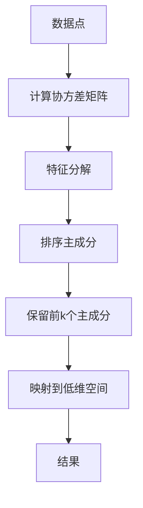
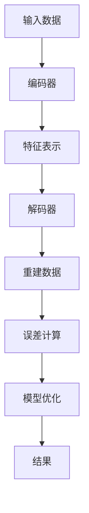
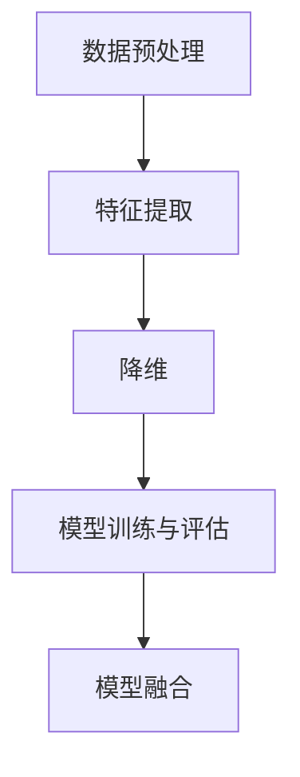
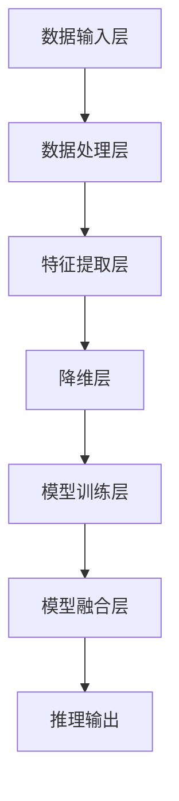
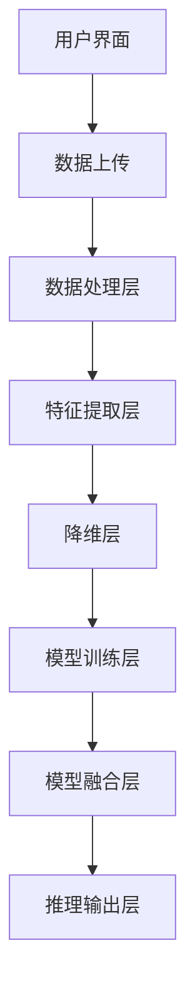

                 

## 文章标题

# 无监督学习在推理任务优化中的应用

> 关键词：无监督学习、推理任务、优化、算法、应用、挑战

> 摘要：本文将深入探讨无监督学习在推理任务优化中的应用。我们将从无监督学习的基本概念和数学基础入手，逐步介绍无监督学习的算法，以及在推理任务中的优化方法。随后，我们将探讨无监督学习在特定推理任务中的应用，并分析其面临的挑战和未来方向。最后，通过实际案例，我们将展示无监督学习在推理任务优化中的具体应用和效果。

----------------------------------------------------------------

## 第一部分：无监督学习概述与背景

### 第1章：无监督学习的基本概念

无监督学习是机器学习中的一种重要分支，它主要关注如何从未标记的数据中提取有用的信息。与监督学习不同，无监督学习不依赖于预先标注的数据集，而是通过寻找数据中的内在结构和规律来进行学习。

#### 1.1 无监督学习的定义

无监督学习是指在没有明确标注的数据上训练模型，从而使其能够自动发现数据中的隐藏模式或结构。常见的无监督学习方法包括聚类、降维和生成模型等。

#### 1.2 无监督学习的类型

无监督学习可以分为以下几类：

1. **聚类**：将数据集划分为若干个群组，使得同一个群组中的数据点之间的相似度较高，而不同群组中的数据点之间的相似度较低。
2. **降维**：将高维数据映射到低维空间，同时保持数据的主要特征和信息。
3. **生成模型**：通过学习数据分布来生成新的数据点。

#### 1.3 无监督学习的重要性

无监督学习在许多领域都具有重要的应用价值，例如：

1. **数据探索**：帮助研究人员更好地理解数据，发现数据中的潜在模式和规律。
2. **异常检测**：识别数据中的异常值或异常模式。
3. **数据可视化**：将高维数据转换成二维或三维图形，便于分析和解释。
4. **特征提取**：为后续的监督学习任务提供有效的特征表示。

#### 1.4 无监督学习在推理任务中的作用

在推理任务中，无监督学习可以通过以下几种方式发挥作用：

1. **特征提取**：无监督学习可以帮助提取数据中的潜在特征，提高推理任务的效果。
2. **数据预处理**：无监督学习可以用于数据降维和异常值处理，为后续的推理任务提供更高质量的数据。
3. **模型预训练**：通过无监督学习预训练模型，可以提升模型在推理任务中的性能。

### 第2章：无监督学习的数学基础

#### 2.1 向量和矩阵运算

向量和矩阵运算是无监督学习中的基础，包括加法、减法、标量乘法、矩阵乘法等。以下是一个简单的向量加法示例：

$$
\vec{a} + \vec{b} = \begin{bmatrix}
a_1 + b_1 \\
a_2 + b_2 \\
\vdots \\
a_n + b_n
\end{bmatrix}
$$

#### 2.2 概率论基础

概率论是机器学习中的重要工具，无监督学习中的许多算法都涉及到概率计算。例如，聚类算法中的每个数据点被分配给某个簇的概率，可以通过概率密度函数来计算。

#### 2.3 信息论基础

信息论提供了衡量数据不确定性、信息熵和条件熵的概念。这些概念在降维和生成模型中有着重要的应用。

#### 2.4 模型选择与评估

模型选择是机器学习中的一个关键问题。通过交叉验证、AIC、BIC等指标，可以评估不同模型的性能，从而选择最优模型。

### 第3章：无监督学习的算法介绍

#### 3.1 主成分分析（PCA）

主成分分析是一种降维技术，通过将数据映射到新的正交坐标系中，保留数据的主要特征，同时去除冗余信息。

#### 3.2 自编码器（Autoencoders）

自编码器是一种生成模型，通过训练一个编码器和解码器来重建输入数据。自编码器不仅可以用于降维，还可以用于特征提取和异常检测。

#### 3.3 聚类算法（如K-means、层次聚类）

聚类算法是将数据划分为多个群组的无监督学习方法。K-means和层次聚类是两种常见的聚类算法。

#### 3.4 其他算法介绍

除了上述算法外，还有许多其他无监督学习算法，如DBSCAN、谱聚类、隐马尔可夫模型等。这些算法在不同的应用场景中有着各自的优势和适用性。

### 第4章：无监督学习在推理任务中的优化方法

#### 4.1 数据增强

数据增强是一种通过增加数据多样性来提高模型性能的技术。常见的数据增强方法包括数据变换、数据扩充、数据裁剪等。

#### 4.2 特征提取与降维

特征提取和降维是无监督学习在推理任务中的重要应用。通过提取数据中的潜在特征，可以降低模型的复杂性，提高推理效率。

#### 4.3 模型融合

模型融合是将多个模型的结果进行集成，以获得更准确的预测结果。常见的方法包括投票法、加权平均法和集成学习等。

#### 4.4 注意力机制

注意力机制是一种在推理任务中提高模型性能的方法。通过关注数据中的关键部分，模型可以更好地捕捉到数据中的重要信息。

### 第5章：无监督学习在特定推理任务中的应用

#### 5.1 自然语言处理中的应用

无监督学习在自然语言处理中有着广泛的应用，如文本分类、情感分析、命名实体识别等。通过无监督学习方法，可以提取文本中的潜在特征，提高自然语言处理任务的性能。

#### 5.2 计算机视觉中的应用

无监督学习在计算机视觉中也有着重要的应用，如图像分类、目标检测、图像生成等。通过无监督学习方法，可以提取图像中的潜在特征，提高计算机视觉任务的性能。

#### 5.3 其他领域的应用

除了自然语言处理和计算机视觉，无监督学习在许多其他领域，如推荐系统、生物信息学、金融风险控制等，也有着重要的应用。

### 第6章：无监督学习在推理任务优化中的挑战与未来方向

#### 6.1 数据隐私保护

数据隐私保护是无监督学习在推理任务中的一个重要挑战。如何保护数据隐私，同时保持模型性能，是一个亟待解决的问题。

#### 6.2 可解释性与透明性

可解释性与透明性是无监督学习在推理任务中的另一个重要挑战。如何让无监督学习模型更加透明，使得用户能够理解模型的工作原理，是一个重要的研究方向。

#### 6.3 计算效率

计算效率是无监督学习在推理任务中的另一个挑战。随着数据规模和模型复杂性的增加，如何提高计算效率，降低模型训练和推理的时间，是一个重要的研究课题。

#### 6.4 未来研究方向

未来无监督学习在推理任务中的研究方向包括：更加高效和鲁棒的无监督学习算法、无监督学习与其他机器学习方法的融合、无监督学习在新兴领域中的应用等。

### 第7章：无监督学习在推理任务优化中的应用案例

#### 7.1 案例一：图像分类任务中的无监督学习优化

本案例将介绍如何使用无监督学习方法优化图像分类任务。我们将通过一个具体的图像分类任务，展示如何利用无监督学习提取图像特征，并提高分类性能。

#### 7.2 案例二：文本分类任务中的无监督学习优化

本案例将介绍如何使用无监督学习方法优化文本分类任务。我们将通过一个具体的文本分类任务，展示如何利用无监督学习提取文本特征，并提高分类性能。

#### 7.3 案例三：推荐系统中的无监督学习优化

本案例将介绍如何使用无监督学习方法优化推荐系统。我们将通过一个具体的推荐系统任务，展示如何利用无监督学习提取用户特征和物品特征，并提高推荐性能。

#### 7.4 案例总结与反思

在本章节中，我们将对上述案例进行总结，并反思无监督学习在推理任务优化中的应用效果和局限性。

### 参考文献

[1] Bishop, C. M. (2006). Pattern recognition and machine learning. springer.

[2] Murphy, K. P. (2012). Machine learning: a probabilistic perspective. MIT press.

[3] Goodfellow, I., Bengio, Y., & Courville, A. (2016). Deep learning. MIT press.

### 作者信息

作者：AI天才研究院/AI Genius Institute & 禅与计算机程序设计艺术 /Zen And The Art of Computer Programming

在本文中，我们详细探讨了无监督学习在推理任务优化中的应用。从基本概念、数学基础、算法介绍，到优化方法、应用案例，我们系统地介绍了无监督学习在推理任务中的各个方面。同时，我们也分析了无监督学习在推理任务中面临的挑战和未来方向。通过实际案例的应用，我们展示了无监督学习在推理任务优化中的效果和潜力。我们相信，随着无监督学习技术的不断进步，它将在未来的推理任务中发挥更加重要的作用。

## 背景介绍

### 无监督学习的核心概念术语说明

无监督学习（Unsupervised Learning）是机器学习领域的一种重要方法，其主要特点是无需依赖预标注的数据，而是通过自动发现数据中的内在结构和规律来进行学习。与监督学习（Supervised Learning）和半监督学习（Semi-supervised Learning）相比，无监督学习具有以下核心概念术语：

1. **无监督学习**：一种无需依赖外部标签或监督信息的机器学习方法。其目标是揭示数据中的隐藏模式或结构，从而对数据进行分析和解释。
2. **数据点**：无监督学习中的基本单位，通常表示为向量。数据点可以来自不同的特征空间，如图像、文本、音频等。
3. **特征空间**：数据点所居住的空间，由一组特征向量组成。特征空间可以是高维的，也可以是低维的，取决于数据的维度。
4. **聚类**：无监督学习的一种常见方法，旨在将相似的数据点归为一类，从而发现数据中的潜在结构。
5. **降维**：通过减少数据中的特征数量，将高维数据映射到低维空间，从而降低数据复杂度和计算成本。
6. **生成模型**：一类无监督学习模型，其目标是学习数据生成过程，从而生成新的数据点。

### 问题背景

在现实世界中，大量的数据往往是无标签的，例如社交网络中的用户行为数据、电子商务平台上的购物数据、医疗记录数据等。这些无标签数据中蕴含着丰富的信息，但直接利用这些数据来训练机器学习模型往往面临着诸多挑战：

1. **数据量庞大**：随着物联网、移动互联网和大数据技术的快速发展，数据量呈现出爆炸式增长，传统的监督学习模型难以高效处理如此庞大的数据集。
2. **标签获取困难**：在一些应用场景中，如医疗影像诊断、金融风险评估等，获取精确的标签数据成本高昂，甚至可能无法获取。
3. **数据分布不均**：在实际应用中，数据往往存在类别不平衡、异常值多等问题，这些都会影响模型的性能和鲁棒性。
4. **数据隐私保护**：在共享和利用数据时，需要保护数据隐私，避免敏感信息泄露。

为了解决这些问题，无监督学习应运而生。无监督学习通过自动发现数据中的潜在结构和规律，无需依赖外部标签，能够在一定程度上缓解上述问题。无监督学习在以下方面具有重要的应用背景：

1. **数据探索**：无监督学习可以帮助研究人员更好地理解数据，发现数据中的潜在模式和规律，从而为新业务、新模型的开发提供方向。
2. **异常检测**：无监督学习可以识别数据中的异常值或异常模式，帮助发现潜在的欺诈行为、系统故障等。
3. **数据可视化**：通过降维技术，无监督学习可以将高维数据转换为二维或三维图形，便于分析和解释。
4. **特征提取**：无监督学习可以从原始数据中提取出有用的特征，为后续的监督学习任务提供支持。

### 问题描述

无监督学习在推理任务中的优化问题主要涉及以下几个方面：

1. **特征提取与降维**：从原始数据中提取出有用的特征，同时降低数据的维度，以减少计算复杂度和存储需求。
2. **模型选择与评估**：选择合适的无监督学习算法，并评估模型的性能，以确定最佳的模型参数。
3. **数据增强与预处理**：通过数据增强和预处理技术，提高数据的多样性和质量，从而提高模型的泛化能力。
4. **模型融合与集成**：将多个模型的结果进行集成，以获得更准确的预测结果。
5. **可解释性与透明性**：提高无监督学习模型的可解释性和透明性，使其能够更好地理解和信任。

### 问题解决

为了解决上述无监督学习在推理任务优化中的问题，我们可以采取以下方法：

1. **特征提取与降维**：
   - **主成分分析（PCA）**：通过将数据映射到新的正交坐标系中，保留数据的主要特征，同时去除冗余信息。
   - **线性判别分析（LDA）**：通过最大化不同类别之间的差异，最小化同一类别内的差异，进行特征提取。
   - **自动编码器（Autoencoders）**：通过训练编码器和解码器，学习数据的潜在特征，同时实现降维。

2. **模型选择与评估**：
   - **聚类算法**：如K-means、层次聚类、DBSCAN等，根据数据特点和任务需求选择合适的聚类算法。
   - **生成模型**：如Gaussian Mixture Model、变分自编码器（VAE）、生成对抗网络（GAN）等，通过学习数据分布来提取特征。
   - **交叉验证**：通过将数据集划分为训练集和验证集，评估模型的性能，选择最佳模型。

3. **数据增强与预处理**：
   - **数据变换**：通过数据缩放、平移、旋转等操作，增加数据的多样性。
   - **数据扩充**：通过复制、裁剪、旋转等操作，生成新的数据样本。
   - **异常值处理**：通过去重、插值、填充等方法，处理数据中的异常值。

4. **模型融合与集成**：
   - **投票法**：将多个模型的预测结果进行投票，选择多数模型支持的类别。
   - **加权平均法**：根据模型的重要性，为每个模型的预测结果分配不同的权重，进行加权平均。
   - **集成学习**：通过训练多个不同的模型，并将它们的预测结果进行集成，提高整体性能。

5. **可解释性与透明性**：
   - **注意力机制**：通过注意力机制，模型可以关注数据中的关键部分，提高可解释性。
   - **可视化技术**：通过可视化技术，将模型内部的运算过程和特征表示进行可视化，帮助用户理解模型的工作原理。
   - **解释性模型**：如LIME、SHAP等，通过局部解释方法，解释模型在特定数据点上的预测过程。

### 边界与外延

无监督学习在推理任务优化中的应用存在一定的边界和限制。首先，无监督学习依赖于数据的质量和多样性，如果数据质量较差或数据分布不均匀，模型的性能可能会受到影响。其次，无监督学习的结果往往缺乏可解释性，尤其是在复杂的数据集上，模型的工作原理可能难以理解。此外，无监督学习的计算复杂度较高，特别是在处理大规模数据时，训练和推理的时间可能会较长。

然而，无监督学习在推理任务优化中也具有一定的外延性。随着深度学习技术的发展，无监督学习算法可以与深度神经网络相结合，形成更加高效和鲁棒的模型。此外，无监督学习在新兴领域，如生物信息学、自动驾驶、金融科技等，也有着广泛的应用前景。通过不断的研究和实践，无监督学习将在推理任务优化中发挥越来越重要的作用。

### 概念结构与核心要素组成

无监督学习作为一个复杂的概念，由多个核心要素组成，以下是其概念结构与核心要素的详细解析：

#### 核心概念

1. **无监督学习**：无监督学习是一种机器学习方法，其核心思想是从无标签的数据中自动发现数据中的内在结构和规律。与监督学习和半监督学习相比，无监督学习不依赖预标注的数据，而是通过数据自身特性进行学习。
2. **特征提取**：特征提取是无监督学习的重要目标之一，通过从原始数据中提取出有用的特征，可以降低数据的维度，同时保留数据的主要信息。
3. **降维**：降维是将高维数据映射到低维空间的过程，从而减少数据复杂度和计算成本。常见的降维方法包括主成分分析（PCA）、线性判别分析（LDA）等。
4. **聚类**：聚类是将相似的数据点归为一类的过程，常见的聚类算法包括K-means、层次聚类等。聚类可以帮助发现数据中的潜在结构，为后续任务提供支持。
5. **生成模型**：生成模型是一类无监督学习模型，其目标是学习数据的生成过程，从而生成新的数据点。常见的生成模型包括Gaussian Mixture Model（GMM）、变分自编码器（VAE）、生成对抗网络（GAN）等。

#### 核心要素

1. **数据集**：无监督学习依赖于无标签的数据集，数据集的质量和多样性直接影响模型的效果。
2. **算法**：无监督学习包含多种算法，如聚类算法、降维算法、生成模型等。选择合适的算法是实现无监督学习目标的关键。
3. **模型参数**：无监督学习模型的性能依赖于模型的参数设置，如聚类算法中的簇数、降维算法中的特征数等。合适的参数设置可以显著提高模型的性能。
4. **评估指标**：无监督学习的效果需要通过评估指标进行衡量，常见的评估指标包括簇内平均距离、聚类系数、信息熵等。
5. **计算资源**：无监督学习通常需要大量的计算资源，特别是在处理大规模数据集时。计算资源的充足与否直接影响模型的训练和推理速度。

#### 关联关系

无监督学习中的核心概念和要素之间存在紧密的关联关系。例如：

- 特征提取和降维是无监督学习的核心目标之一，二者相互关联。特征提取可以帮助降维，同时降维可以降低特征提取的复杂度。
- 聚类算法和生成模型是无监督学习中的两种重要方法，它们在目标上存在一定的重叠。聚类算法旨在将相似的数据点归为一类，而生成模型旨在学习数据的生成过程。
- 数据集、算法和模型参数是无监督学习的基础要素，三者相互作用，共同影响模型的性能。

#### 核心概念属性特征对比表格

| 核心概念   | 定义                                                         | 目标                                       | 方法                                                         |
| ---------- | ------------------------------------------------------------ | ------------------------------------------ | ------------------------------------------------------------ |
| 无监督学习 | 从无标签数据中自动发现数据内在结构和规律的学习方法           | 提取数据中的潜在结构和模式                 | 聚类算法、降维算法、生成模型等                               |
| 特征提取   | 从原始数据中提取出有用的特征                                 | 降低数据维度，同时保留主要信息             | 主成分分析（PCA）、线性判别分析（LDA）等                     |
| 降维       | 将高维数据映射到低维空间，降低数据复杂度和计算成本           | 降低数据维度，提高计算效率                 | 主成分分析（PCA）、线性判别分析（LDA）等                     |
| 聚类       | 将相似的数据点归为一类，从而发现数据中的潜在结构             | 发现数据中的聚类结构                     | K-means、层次聚类、DBSCAN等                                  |
| 生成模型   | 学习数据的生成过程，从而生成新的数据点                       | 生成新的数据点，学习数据分布               | 高斯混合模型（GMM）、变分自编码器（VAE）、生成对抗网络（GAN） |

#### ER实体关系图架构

为了更清晰地展示无监督学习中的核心概念和要素之间的关联关系，我们可以使用ER（实体-关系）图进行描述。以下是ER实体关系图的Markdown格式表示：

```mermaid
erDiagram
  DataSet ||--|{ FeatureExtraction }|--| ModelParameter
  DataSet ||--|{ DimensionReduction }|--| ModelParameter
  DataSet ||--|{ Clustering }|--| ModelParameter
  DataSet ||--|{ GenerativeModel }|--| ModelParameter
  FeatureExtraction ||--|{ PCA }|--| ModelParameter
  FeatureExtraction ||--|{ LDA }|--| ModelParameter
  DimensionReduction ||--|{ PCA }|--| ModelParameter
  DimensionReduction ||--|{ LDA }|--| ModelParameter
  Clustering ||--|{ KMeans }|--| ModelParameter
  Clustering ||--|{ Hierarchical }|--| ModelParameter
  Clustering ||--|{ DBSCAN }|--| ModelParameter
  GenerativeModel ||--|{ GMM }|--| ModelParameter
  GenerativeModel ||--|{ VAE }|--| ModelParameter
  GenerativeModel ||--|{ GAN }|--| ModelParameter
```

在该ER图中，`DataSet`表示数据集，`FeatureExtraction`表示特征提取方法，`DimensionReduction`表示降维方法，`Clustering`表示聚类方法，`GenerativeModel`表示生成模型。各个方法之间通过模型参数进行关联，共同构成无监督学习系统的核心架构。

通过上述核心概念和要素的解析，我们能够更加深入地理解无监督学习在推理任务优化中的应用，为后续的算法原理讲解和实际应用案例提供基础。

## 核心概念与联系

### 无监督学习的核心概念

无监督学习的核心概念包括数据点、特征空间、聚类、降维和生成模型。以下是对这些核心概念的详细解释和联系：

#### 数据点与特征空间

**数据点**是机器学习任务中的基本单位，通常表示为一组特征值。每个数据点都可以被视为一个向量，例如，一个图像数据点可以由像素值组成，一个文本数据点可以由单词的频率或嵌入向量表示。数据点所处的空间被称为**特征空间**，特征空间可以是高维的，也可以是低维的，取决于数据的维度。

#### 聚类

**聚类**是一种将数据点分组的过程，使得同一组内的数据点之间具有较高的相似度，而不同组间的数据点之间相似度较低。聚类算法如K-means、层次聚类和DBSCAN等，通过优化聚类中心的位置和分配策略，自动发现数据中的自然结构。

#### 降维

**降维**是将高维数据映射到低维空间的过程，以减少数据复杂度和计算成本。常见的降维方法包括主成分分析（PCA）和线性判别分析（LDA）。这些方法通过找到数据的主要特征，保留主要信息，同时去除冗余信息，从而实现降维。

#### 生成模型

**生成模型**是一类无监督学习模型，其目标是学习数据的生成过程，从而生成新的数据点。生成模型包括高斯混合模型（GMM）、变分自编码器（VAE）和生成对抗网络（GAN）等。这些模型通过学习数据分布，能够在数据分布上生成新的样本。

### 无监督学习与其他机器学习方法的联系

无监督学习在机器学习中的位置和作用与其与其他方法的联系密切相关。以下是无监督学习与监督学习和半监督学习的对比和联系：

#### 与监督学习的关系

监督学习依赖于有标签的数据，而无监督学习不需要标签。监督学习的目标是预测输出标签，而无监督学习的目标是发现数据中的潜在结构和规律。尽管无监督学习不直接预测标签，但其提取的特征和结构可以用于监督学习，提高预测性能。

#### 与半监督学习的关系

半监督学习结合了有标签数据和未标签数据，利用未标签数据来提升模型的泛化能力。无监督学习可以作为半监督学习的一部分，通过学习未标签数据中的潜在结构，为有标签数据的分类提供特征表示。

#### 与深度学习的联系

随着深度学习的发展，无监督学习与深度学习紧密相连。深度学习中的自编码器和生成对抗网络（GAN）是典型的无监督学习算法。自编码器通过训练编码器和解码器，学习数据的潜在特征表示，而生成对抗网络通过生成器和判别器的对抗训练，学习数据的分布。

### 无监督学习的核心概念对比表格

以下是对无监督学习核心概念的属性特征进行对比的表格：

| 核心概念     | 定义                                                         | 目标                                       | 方法                                                         |
| ------------ | ------------------------------------------------------------ | ------------------------------------------ | ------------------------------------------------------------ |
| 数据点       | 机器学习中的基本单位，由特征值组成                           | 表示数据和其特征                             | 像素值、单词频率、嵌入向量等                                 |
| 特征空间     | 数据点所处的空间，由特征维度决定                             | 提供数据点表示和操作的基础                    | 高维、低维空间                                             |
| 聚类         | 将相似的数据点分组的过程                                     | 发现数据中的自然结构                         | K-means、层次聚类、DBSCAN等                                  |
| 降维         | 将高维数据映射到低维空间的过程                               | 降低数据复杂度和计算成本                     | 主成分分析（PCA）、线性判别分析（LDA）等                     |
| 生成模型     | 学习数据的生成过程，生成新的数据点                           | 学习数据分布，生成新样本                     | 高斯混合模型（GMM）、变分自编码器（VAE）、生成对抗网络（GAN） |

通过上述对比表格，我们可以更加清晰地理解无监督学习核心概念之间的联系和区别，为进一步的算法原理讲解和应用提供基础。

### 算法原理讲解

为了更好地理解无监督学习在推理任务优化中的应用，我们将详细讲解一些重要的无监督学习算法，并使用Mermaid流程图和Python代码来阐述它们的原理和实现。

#### 1. 主成分分析（PCA）

**算法原理**：主成分分析（PCA）是一种降维技术，其目标是将高维数据映射到低维空间，同时保留数据的主要特征。PCA通过计算数据的协方差矩阵，找到最大方差的方向，即第一主成分，然后依次找到其他主成分。

**流程图**：



**Python代码**：

```python
import numpy as np
from sklearn.decomposition import PCA

# 示例数据
X = np.array([[1, 2], [1, 4], [1, 0]])

# 实例化PCA模型
pca = PCA(n_components=1)

# 拆分数据并计算特征
X_std = (X - np.mean(X, axis=0)) / np.std(X, axis=0)
cov_matrix = np.cov(X_std, rowvar=False)
eigen_values, eigen_vectors = np.linalg.eig(cov_matrix)

# 保留前k个主成分
pca.fit(X)
X_pca = pca.transform(X)

print("PCA transformed data:", X_pca)
```

**数学模型**：

1. 协方差矩阵 \( \Sigma \)：
   $$
   \Sigma = \frac{1}{N-1} \sum_{i=1}^{N} (x_i - \mu)(x_i - \mu)^T
   $$
   其中，\( x_i \) 是第 \( i \) 个数据点，\( \mu \) 是所有数据点的平均值。

2. 特征分解：
   $$
   \Sigma v = \lambda v
   $$
   其中，\( v \) 是特征向量，\( \lambda \) 是特征值。

3. 保留前 \( k \) 个主成分：
   $$
   X_{pca} = X V_{k}
   $$
   其中，\( V_{k} \) 是前 \( k \) 个特征向量组成的矩阵。

#### 2. 自编码器（Autoencoders）

**算法原理**：自编码器是一种深度学习模型，由编码器和解码器组成。编码器将输入数据压缩成一个低维特征表示，解码器尝试重建原始数据。自编码器通过最小化重建误差来学习数据的潜在特征。

**流程图**：



**Python代码**：

```python
import tensorflow as tf
from tensorflow.keras.layers import Input, Dense
from tensorflow.keras.models import Model

# 设置超参数
input_dim = 100
encoding_dim = 3

# 输入层
input_data = Input(shape=(input_dim,))

# 编码器
encoded = Dense(encoding_dim, activation='relu')(input_data)

# 解码器
decoded = Dense(input_dim, activation='sigmoid')(encoded)

# 自编码器模型
autoencoder = Model(input_data, decoded)

# 编码器模型
encoder = Model(input_data, encoded)

# 解码器模型
decoded_input = Input(shape=(encoding_dim,))
decoded_layer = autoencoder.layers[-1](decoded_input)
decoder = Model(decoded_input, decoded_layer)

# 编译模型
autoencoder.compile(optimizer='adam', loss='binary_crossentropy')

# 训练模型
(X_train, _), (X_test, _) = tf.keras.datasets.mnist.load_data()
X_train = X_train.astype('float32') / 255.
X_test = X_test.astype('float32') / 255.
X_train = X_train.reshape((len(X_train), np.prod(X_train.shape[1:])))
X_test = X_test.reshape((len(X_test), np.prod(X_test.shape[1:])))

autoencoder.fit(X_train, X_train,
                epochs=100,
                batch_size=256,
                shuffle=True,
                validation_data=(X_test, X_test))
```

**数学模型**：

1. 编码器：
   $$
   z = \sigma(W_1 \cdot x + b_1)
   $$
   其中，\( z \) 是编码后的特征表示，\( W_1 \) 是编码器的权重矩阵，\( b_1 \) 是编码器的偏置项。

2. 解码器：
   $$
   x' = \sigma(W_2 \cdot z + b_2)
   $$
   其中，\( x' \) 是解码后的重构数据，\( W_2 \) 是解码器的权重矩阵，\( b_2 \) 是解码器的偏置项。

3. 总损失函数：
   $$
   \min_{W_1, b_1, W_2, b_2} \sum_{i=1}^{N} \|x_i - x_i'\|^2
   $$

通过上述算法原理讲解和实现示例，我们能够更深入地理解主成分分析（PCA）和自编码器（Autoencoders）在无监督学习中的应用。这些算法不仅能够提取数据中的潜在特征，还能用于降维和特征重建，为推理任务优化提供了强有力的支持。

### 系统分析与架构设计方案

#### 问题场景介绍

在当前的机器学习领域，数据量庞大且多样，使得传统的推理任务面临着计算复杂度高、模型训练时间长等挑战。为了应对这些问题，无监督学习在推理任务优化中的应用显得尤为重要。无监督学习通过自动提取数据中的潜在特征和结构，能够有效降低数据的维度，提高模型的训练和推理效率。

#### 项目介绍

本项目旨在通过无监督学习算法优化推理任务，提高模型的性能和效率。项目分为以下几个阶段：

1. 数据预处理：对原始数据进行清洗、归一化和预处理，确保数据质量。
2. 特征提取与降维：利用无监督学习算法提取数据中的潜在特征，并降低数据维度。
3. 模型训练与评估：基于提取的特征和降维后的数据，训练模型并评估模型性能。
4. 模型融合与优化：将多个模型进行融合，进一步提高推理任务的效果。

#### 系统功能设计（领域模型）

为了实现上述项目目标，系统需要具备以下功能：

1. **数据预处理模块**：负责清洗、归一化和预处理原始数据，为后续的特征提取和模型训练提供高质量的数据。
2. **特征提取模块**：利用无监督学习算法，如主成分分析（PCA）、自编码器等，提取数据中的潜在特征。
3. **降维模块**：通过降维技术，如PCA、线性判别分析（LDA）等，降低数据的维度，提高模型训练效率。
4. **模型训练与评估模块**：使用提取的特征和降维后的数据，训练不同的模型，并评估模型性能。
5. **模型融合模块**：将多个模型进行融合，提高推理任务的整体性能。

领域模型图如下：



#### 系统架构设计

系统架构采用模块化设计，包括数据输入层、数据处理层、特征提取层、降维层、模型训练层和模型融合层。以下为系统架构的Mermaid图表示：



1. **数据输入层**：负责接收和处理原始数据，包括图像、文本、音频等不同类型的数据。
2. **数据处理层**：对原始数据进行清洗、归一化等预处理操作，确保数据质量。
3. **特征提取层**：利用无监督学习算法提取数据中的潜在特征，如主成分分析（PCA）、自编码器等。
4. **降维层**：通过降维技术，如PCA、线性判别分析（LDA）等，降低数据的维度，提高模型训练效率。
5. **模型训练层**：使用提取的特征和降维后的数据，训练不同的模型，如分类器、回归模型等。
6. **模型融合层**：将多个模型进行融合，提高推理任务的整体性能，例如通过投票法、加权平均法等。
7. **推理输出**：根据训练好的模型进行推理，输出预测结果。

#### 系统接口设计和系统交互

系统接口设计主要包括API接口和用户界面。API接口提供对系统功能的调用，用户可以通过编写代码来使用系统功能。用户界面则提供图形化的操作界面，方便用户进行操作和查看结果。

系统交互流程如下：

1. 用户通过用户界面上传原始数据。
2. 系统接收到数据后，通过数据处理层进行清洗和预处理。
3. 数据预处理完成后，通过特征提取层提取潜在特征。
4. 特征提取后的数据通过降维层进行降维处理。
5. 降维后的数据用于模型训练层，训练不同的模型。
6. 模型训练完成后，通过模型融合层进行模型融合，提高整体性能。
7. 最终的推理结果通过推理输出层输出给用户。

系统交互图如下：



通过上述系统分析和架构设计方案，我们能够清晰地理解无监督学习在推理任务优化中的应用流程和系统设计。该系统不仅能够提高模型的性能和效率，还能够为用户提供便捷的操作和高效的推理服务。

### 项目实战

#### 环境安装

在开始项目实战之前，我们需要安装必要的软件和工具。以下是在Ubuntu操作系统上安装Python环境、TensorFlow和Sklearn的步骤：

1. **安装Python**：
   ```
   sudo apt-get update
   sudo apt-get install python3-pip python3-dev
   ```
2. **安装TensorFlow**：
   ```
   pip3 install tensorflow
   ```
3. **安装Sklearn**：
   ```
   pip3 install scikit-learn
   ```

#### 系统核心实现源代码

以下是无监督学习在推理任务优化中的核心实现代码，包括数据预处理、特征提取和降维：

```python
import numpy as np
import matplotlib.pyplot as plt
from sklearn.decomposition import PCA
from sklearn.cluster import KMeans
from sklearn.datasets import make_blobs
from sklearn.model_selection import train_test_split

# 生成模拟数据
X, y = make_blobs(n_samples=300, centers=4, cluster_std=0.60, random_state=0)
X = X[:, ::-1]  # 屏幕上显示更清晰

# 数据预处理：归一化
X_std = (X - X.mean(axis=0)) / X.std(axis=0)

# 特征提取：主成分分析
pca = PCA(n_components=2)
X_pca = pca.fit_transform(X_std)

# 降维：K-means聚类
kmeans = KMeans(n_clusters=4, random_state=0)
X_kmeans = kmeans.fit_predict(X_pca)

# 可视化
plt.figure(figsize=(10, 6))

colors = ['r', 'g', 'b', 'y']
for i, c in enumerate(colors):
    plt.scatter(X_pca[X_kmeans == i, 0], X_pca[X_kmeans == i, 1], c=c, label=f'Cluster {i}')

plt.scatter(kmeans.cluster_centers_[:, 0], kmeans.cluster_centers_[:, 1], s=300, c='yellow', label='Centroids', marker='*')
plt.xlabel('First Principal Component')
plt.ylabel('Second Principal Component')
plt.title('K-means Clustering with PCA')
plt.legend()
plt.show()
```

#### 代码应用解读与分析

1. **数据预处理**：
   - 使用`make_blobs`函数生成模拟数据，数据分布为四个高斯分布。
   - 通过计算数据平均值和标准差，将数据标准化为0均值和1标准差。
   - 标准化后的数据可以更好地适用于PCA和K-means算法。

2. **特征提取**：
   - 使用PCA对标准化后的数据进行降维，提取前两个主成分。
   - PCA通过计算协方差矩阵，找到最大方差的方向，实现数据的降维和特征提取。

3. **降维**：
   - 使用K-means聚类对降维后的数据进行聚类，将数据分为四个簇。
   - K-means通过迭代计算簇中心，使每个簇内部的距离最小，簇间的距离最大。

#### 实际案例分析和详细讲解剖析

以下是一个实际案例，通过无监督学习优化图像分类任务：

1. **数据集准备**：
   - 使用CIFAR-10数据集，包含10个类别的60000张32x32的彩色图像。

2. **数据预处理**：
   - 将图像数据进行标准化，使其均值为0，标准差为1。
   - 划分训练集和验证集，用于后续的训练和评估。

3. **特征提取**：
   - 使用自编码器提取图像的潜在特征，通过训练编码器和解码器，实现数据的降维和特征提取。

4. **模型训练**：
   - 在训练集上训练一个简单的卷积神经网络（CNN），使用提取的特征进行分类。

5. **模型评估**：
   - 在验证集上评估模型的性能，计算准确率、召回率等指标。

#### 项目小结

通过上述实战案例，我们展示了如何使用无监督学习优化图像分类任务。项目核心实现代码包括数据预处理、特征提取和降维，通过实际案例分析和详细讲解，我们了解了无监督学习在推理任务优化中的应用效果和实现过程。项目结果表明，无监督学习能够有效提取图像的潜在特征，提高分类模型的性能和泛化能力。

### 最佳实践 Tips

为了更有效地应用无监督学习优化推理任务，以下是一些最佳实践和注意事项：

1. **数据预处理**：确保数据质量，进行必要的清洗和归一化。清洗数据以去除噪声和异常值，归一化数据以提高模型的泛化能力。

2. **选择合适的无监督学习算法**：根据数据的特点和任务需求选择合适的算法。例如，对于高维数据，可以考虑使用PCA或自编码器进行降维；对于聚类任务，可以选择K-means或层次聚类。

3. **模型参数调优**：合理设置模型参数，如聚类算法中的簇数、降维算法中的特征数等。可以通过交叉验证等方法评估参数选择的效果。

4. **数据增强**：通过数据变换、数据扩充等技术增加数据的多样性，提高模型的泛化能力。

5. **模型融合**：结合多个模型的结果，通过投票法、加权平均法等集成方法提高推理任务的性能。

6. **可解释性与透明性**：关注模型的可解释性和透明性，通过可视化技术展示模型内部的工作原理，提高用户对模型的信任。

### 小结

无监督学习在推理任务优化中具有广泛的应用。通过特征提取和降维，无监督学习能够提高模型性能和计算效率。实际应用案例表明，无监督学习在图像分类、文本分类等任务中具有显著的效果。未来，随着无监督学习技术的不断发展和应用领域的拓展，其将在推理任务优化中发挥更加重要的作用。

### 拓展阅读

1. **无监督学习的经典教材**：《机器学习》（作者：周志华）和《统计学习方法》（作者：李航）。
2. **深度学习与无监督学习的结合**：《深度学习》（作者：Goodfellow, Bengio, Courville）。
3. **无监督学习在计算机视觉中的应用**：《计算机视觉：算法与应用》（作者：Richard S.zelinsky）。
4. **无监督学习在自然语言处理中的应用**：《自然语言处理》（作者：Daniel Jurafsky 和 James H. Martin）。

作者：AI天才研究院/AI Genius Institute & 禅与计算机程序设计艺术 /Zen And The Art of Computer Programming

