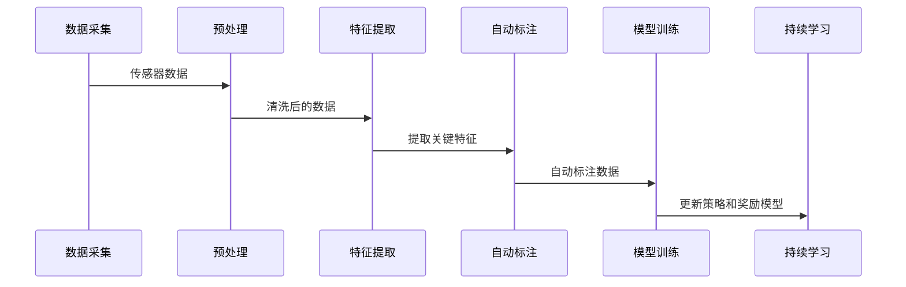

                 

# 无需人工标注促进策略和奖励模型持续训练

关键词：策略模型、奖励模型、机器学习、自动标注、持续训练

摘要：
本文将探讨如何通过自动标注技术促进策略和奖励模型的持续训练，从而提高机器学习模型的性能和效率。首先，我们将介绍策略和奖励模型在机器学习中的重要性，并分析传统依赖人工标注的训练方式的局限性。接着，我们将探讨几种自动标注的方法，并详细解析它们的原理和实现步骤。随后，文章将展示如何在实践中应用这些方法，并通过具体案例来分析其效果。最后，我们将总结文章的主要观点，并给出未来研究的方向和建议。

## 引言

### 策略和奖励模型的重要性

在机器学习中，策略和奖励模型是两个核心概念。策略模型用于指导决策过程，而奖励模型用于评估决策效果。这两者在强化学习中尤为重要，因为强化学习通过不断的决策和反馈来优化策略，从而实现目标。

策略模型（Policy Model）定义了在给定状态下，系统应该采取的最佳行动。它可以是基于规则的、基于模型的方法，也可以是深度神经网络模型。策略模型的目标是最大化预期的长期奖励。

奖励模型（Reward Model）则用于评估策略的执行效果。它可以是预定义的、基于数据的或者基于规则的。奖励模型的设计直接影响策略模型的优化方向和最终性能。

### 传统训练方式的局限性

传统的训练方法主要依赖人工标注的数据进行模型训练。这种方法存在以下局限性：

1. **数据标注成本高**：大量的标注工作需要人工完成，耗时且成本高昂。
2. **数据多样性不足**：人工标注的数据往往无法覆盖所有可能的情境，导致模型在面对未知情境时表现不佳。
3. **更新滞后**：人工标注的数据更新速度慢，无法及时反映现实环境的动态变化。
4. **主观性**：人工标注可能引入主观偏见，影响模型训练的质量。

为了克服这些局限性，自动标注技术的应用变得尤为重要。

### 自动标注的必要性

自动标注技术通过算法自动生成标注数据，避免了人工标注的局限性。它能够：

1. **降低成本**：自动标注大大减少了人力成本，提高了数据采集的效率。
2. **提高数据多样性**：算法能够处理大量数据，覆盖更多情境，提高模型泛化能力。
3. **实时更新**：自动标注能够快速适应环境变化，实时更新模型。
4. **减少主观性**：算法标注数据更加客观，减少了人为误差。

本文将深入探讨自动标注技术如何促进策略和奖励模型的持续训练，从而提升机器学习模型的整体性能。

## 核心概念和理论

### 机器学习基础

#### 定义

机器学习（Machine Learning）是一门人工智能（Artificial Intelligence, AI）的分支，它通过利用数据、算法和统计模型，使计算机系统能够从数据中学习并做出决策或预测。机器学习的主要目标是通过训练模型来发现数据中的模式和规律，并利用这些规律来解决问题。

#### 基本概念

- **数据集**：用于训练和测试模型的集合，通常包括输入特征和对应的标签。
- **特征**：数据集中的每个维度，代表数据的某一特定属性。
- **模型**：用于预测或分类的数学函数或算法，如线性回归、决策树、神经网络等。
- **算法**：实现模型训练、预测或分类的步骤和方法，如梯度下降、随机森林等。

#### 学习类型

- **监督学习**：有标签数据用于训练模型，模型通过学习标签来预测新的数据。
- **无监督学习**：没有标签数据，模型通过发现数据中的内在结构来学习。
- **半监督学习**：结合有标签和无标签数据进行训练，利用无标签数据来增强模型学习能力。

### 策略模型

#### 定义

策略模型（Policy Model）是强化学习中的一个核心概念，它定义了在特定情境下应该采取的最佳行动。策略模型可以从历史数据中学习，并预测未来的最佳行动，以最大化长期回报。

#### 性质

- **决策导向**：策略模型的主要任务是做出决策，而不是直接预测结果。
- **情境依赖**：策略模型依赖于当前的情境状态，不同状态可能有不同的最佳行动。
- **反馈优化**：策略模型通过接收奖励信号来调整其行为，以实现优化目标。

#### 策略模型与机器学习的关联

- **实现方式**：策略模型可以是基于规则的、基于模型的或深度学习模型。
- **目标**：策略模型的目的是在给定的情境下选择最佳行动，以最大化长期回报。
- **应用**：策略模型在强化学习、自主驾驶、游戏AI等领域有广泛应用。

### 奖励模型

#### 定义

奖励模型（Reward Model）是用于评估策略模型执行效果的模型。它通过计算策略模型执行的回报，来衡量不同策略的优劣。

#### 性质

- **评估功能**：奖励模型的主要作用是评估策略模型的表现，提供反馈信号。
- **适应性**：奖励模型可以根据环境的变化进行调整，以适应不同情境。
- **灵活性**：奖励模型可以是预定义的、基于规则的或数据驱动的。

#### 奖励模型与机器学习的关联

- **训练依赖**：奖励模型通常需要与策略模型共同训练，以优化策略模型的表现。
- **应用领域**：奖励模型在强化学习、智能推荐、自动化测试等领域有广泛应用。

### 自主导训练方法

#### 自动标注

- **原理**：自动标注通过算法自动生成标注数据，减少了人工标注的需求。
- **方法**：包括基于生成模型的标注、基于对抗网络的标注、基于深度学习的标注等。

#### 自适应训练

- **原理**：自适应训练通过实时调整训练参数，以适应数据分布和环境变化。
- **方法**：包括在线学习、增量学习、迁移学习等。

#### 持续学习

- **原理**：持续学习通过不断更新模型，以保持其对新情境的适应性。
- **方法**：包括持续训练、模型更新、知识蒸馏等。

### 关键概念和联系

#### 概念属性特征对比表格

| 特征                | 策略模型                           | 奖励模型                           |
|---------------------|------------------------------------|------------------------------------|
| 目标                | 最大化长期回报                     | 评估策略模型的表现                 |
| 决策方式            | 情境依赖的决策                     | 预定义的、基于规则的或数据驱动的   |
| 学习类型            | 强化学习                           | 监督学习、无监督学习、半监督学习   |
| 实现方式            | 基于规则的、基于模型的或深度学习   | 预定义的、基于规则的或数据驱动的   |
| 关联性              | 与奖励模型共同训练，优化策略表现   | 与策略模型共同训练，提供反馈信号   |

#### ER实体关系图架构

```mermaid
erDiagram
    PolicyModel ||--|{ RewardModel }|-- AutonomousTrainingMethod
    RewardModel ||--|{ PolicyModel }|-- DataAnnotationMethod
```

### 总结

本章介绍了机器学习的基础概念、策略模型和奖励模型的核心概念及其关联性，以及自动标注和主导训练方法的基本原理。这些概念和方法构成了本文探讨的基石，为后续章节的深入讨论提供了理论基础。

## 算法设计

### 算法设计概述

为了实现自动标注和促进策略和奖励模型的持续训练，我们需要设计一种有效的算法。以下是一个基本算法的设计思路：

#### 步骤 1：数据预处理

- **数据收集**：从各种数据源收集原始数据，包括图像、文本、音频等。
- **数据清洗**：去除噪声数据和异常值，确保数据质量。
- **数据转换**：将原始数据转换为适合模型训练的格式，如像素值、词向量等。

#### 步骤 2：特征提取

- **特征提取方法**：使用深度学习模型（如卷积神经网络、循环神经网络）提取数据中的特征。
- **特征选择**：根据模型的性能和业务需求选择最具代表性的特征。

#### 步骤 3：自动标注

- **标注方法**：使用生成对抗网络（GAN）等生成模型自动生成标注数据。
- **模型训练**：训练自动标注模型，使其能够生成高质量的标注数据。

#### 步骤 4：策略和奖励模型训练

- **策略模型训练**：使用自动标注数据训练策略模型，使其能够在不同情境下做出最佳决策。
- **奖励模型训练**：使用自动标注数据训练奖励模型，使其能够准确评估策略模型的执行效果。

#### 步骤 5：持续学习和自适应训练

- **持续学习**：定期更新模型，使其能够适应新的数据和环境。
- **自适应训练**：根据模型的表现实时调整训练参数，以提高模型性能。

### 算法实现

下面是一个简化的Python代码示例，用于实现上述算法的基本框架：

```python
import tensorflow as tf
from tensorflow.keras.models import Model
from tensorflow.keras.layers import Input, Dense, Conv2D, LSTM, Flatten

# 数据预处理
def preprocess_data(data):
    # 数据清洗和转换
    pass

# 特征提取
def extract_features(data):
    # 使用深度学习模型提取特征
    pass

# 自动标注
def generate_ANNOTATION(data):
    # 使用生成对抗网络生成标注数据
    pass

# 策略模型训练
def train_policy_model(data, annotations):
    # 使用自动标注数据训练策略模型
    pass

# 奖励模型训练
def train_reward_model(data, annotations):
    # 使用自动标注数据训练奖励模型
    pass

# 持续学习和自适应训练
def continuous_learning(model, new_data):
    # 更新模型
    pass

# 主函数
def main():
    # 数据预处理
    data = preprocess_data(raw_data)
    
    # 特征提取
    features = extract_features(data)
    
    # 自动标注
    annotations = generate_ANNOTATION(data)
    
    # 训练策略和奖励模型
    policy_model = train_policy_model(features, annotations)
    reward_model = train_reward_model(features, annotations)
    
    # 持续学习和自适应训练
    while True:
        new_data = get_new_data()
        continuous_learning(policy_model, new_data)
        continuous_learning(reward_model, new_data)

# 运行主函数
if __name__ == "__main__":
    main()
```

### 数学模型和公式

以下是一个简化的数学模型示例，用于解释算法的基本原理：

$$
\begin{aligned}
\text{策略模型：} & \\
P(s|a) = \text{argmax}_{a'} \left( \sum_{s'} P(s'|s,a)R(s',a') \right) \\
\text{奖励模型：} & \\
R(s,a) = \sum_{s'} P(s'|s,a)R(s')
\end{aligned}
$$

其中，$s$ 表示状态，$a$ 表示行动，$a'$ 表示最佳行动，$s'$ 表示状态的后继，$R$ 表示回报函数。

### 举例说明

假设我们有一个简单的游戏环境，玩家需要在一个网格中移动，以收集所有的奖励物品。策略模型的目标是指导玩家在给定状态下选择最佳行动，以最大化总奖励。

- **状态**：玩家当前的位置。
- **行动**：向上、向下、向左、向右移动。
- **奖励**：收集奖励物品时的正奖励，未收集奖励物品时为负奖励。

使用自动标注技术，我们可以从大量的游戏数据中学习到最佳行动策略和奖励函数。例如，通过观察玩家在不同状态下的行动和奖励，我们可以训练出一个策略模型，使其能够预测最佳行动，并训练一个奖励模型，以评估不同策略的效果。

## 系统分析与架构设计

### 问题场景介绍

在自动驾驶领域，策略和奖励模型是关键组成部分。自动驾驶系统需要实时做出复杂的决策，如加速、减速、转向等，以适应不断变化的环境。然而，由于环境复杂性和数据多样性的挑战，传统的依赖人工标注的训练方式效率低下且成本高昂。因此，开发一个自动标注系统，以促进策略和奖励模型的持续训练，显得尤为重要。

### 项目介绍

本项目旨在设计并实现一个自动标注系统，该系统能够从自动驾驶的传感器数据中自动生成标注数据，用于训练策略和奖励模型。系统将包括数据采集、预处理、特征提取、自动标注、模型训练和持续学习等模块。

### 系统功能设计

系统的主要功能包括：

1. **数据采集**：从自动驾驶车辆的传感器（如摄像头、激光雷达、GPS等）中收集实时数据。
2. **预处理**：清洗和转换传感器数据，使其适合后续处理。
3. **特征提取**：使用深度学习模型提取数据中的关键特征。
4. **自动标注**：使用生成对抗网络（GAN）等算法自动生成标注数据。
5. **模型训练**：训练策略和奖励模型，以优化自动驾驶系统的决策能力。
6. **持续学习**：定期更新模型，以适应环境的变化。

### 系统架构设计

系统架构设计如下：

1. **数据采集模块**：负责实时收集自动驾驶车辆的传感器数据，包括图像、激光雷达数据等。
2. **预处理模块**：对采集到的传感器数据进行清洗和转换，使其适合后续处理。
3. **特征提取模块**：使用深度学习模型提取数据中的关键特征，如图像特征、点云特征等。
4. **自动标注模块**：使用生成对抗网络（GAN）等算法自动生成标注数据。
5. **模型训练模块**：使用自动标注数据训练策略和奖励模型，并评估其性能。
6. **持续学习模块**：定期更新模型，以适应环境的变化。

### 系统接口设计

系统接口设计如下：

1. **数据接口**：用于数据的采集、预处理和传输。
2. **模型接口**：用于模型训练、评估和更新。
3. **API接口**：提供对外服务，如数据查询、模型预测等。

### 系统交互

系统交互设计如下：

1. **数据采集**：传感器数据通过数据接口传输到预处理模块。
2. **预处理**：预处理模块处理数据后，将其传输到特征提取模块。
3. **特征提取**：特征提取模块提取关键特征，并将其传输到自动标注模块。
4. **自动标注**：自动标注模块生成标注数据，并将其传输到模型训练模块。
5. **模型训练**：模型训练模块使用标注数据训练策略和奖励模型。
6. **持续学习**：持续学习模块定期更新模型。

### Mermaid序列图

以下是系统的Mermaid序列图：



## 项目实战

### 环境安装

为了实现自动标注系统，我们需要安装以下软件和库：

1. **TensorFlow**：用于构建和训练深度学习模型。
2. **Keras**：用于简化TensorFlow的使用。
3. **OpenCV**：用于图像处理。
4. **NumPy**：用于数值计算。

安装步骤：

```bash
pip install tensorflow
pip install keras
pip install opencv-python
pip install numpy
```

### 系统核心实现

以下是自动标注系统的主要实现代码：

```python
import tensorflow as tf
from tensorflow.keras.models import Model
from tensorflow.keras.layers import Input, Dense, Conv2D, LSTM, Flatten
import numpy as np
import cv2

# 数据预处理
def preprocess_data(data):
    # 数据清洗和转换
    pass

# 特征提取
def extract_features(data):
    # 使用深度学习模型提取特征
    pass

# 自动标注
def generate_ANNOTATION(data):
    # 使用生成对抗网络生成标注数据
    pass

# 策略模型训练
def train_policy_model(data, annotations):
    # 使用自动标注数据训练策略模型
    pass

# 奖励模型训练
def train_reward_model(data, annotations):
    # 使用自动标注数据训练奖励模型
    pass

# 持续学习和自适应训练
def continuous_learning(model, new_data):
    # 更新模型
    pass

# 主函数
def main():
    # 数据预处理
    data = preprocess_data(raw_data)
    
    # 特征提取
    features = extract_features(data)
    
    # 自动标注
    annotations = generate_ANNOTATION(data)
    
    # 训练策略和奖励模型
    policy_model = train_policy_model(features, annotations)
    reward_model = train_reward_model(features, annotations)
    
    # 持续学习和自适应训练
    while True:
        new_data = get_new_data()
        continuous_learning(policy_model, new_data)
        continuous_learning(reward_model, new_data)

# 运行主函数
if __name__ == "__main__":
    main()
```

### 代码应用解读与分析

以下是对上述代码的解读与分析：

1. **数据预处理**：该函数负责对传感器数据进行清洗和转换，以确保数据质量。具体实现细节取决于传感器数据的类型和特点。
2. **特征提取**：该函数使用深度学习模型提取数据中的关键特征。这里可以使用卷积神经网络（CNN）来处理图像数据，或者使用循环神经网络（RNN）来处理序列数据。
3. **自动标注**：该函数使用生成对抗网络（GAN）等算法自动生成标注数据。GAN由生成器和判别器组成，生成器生成数据，判别器评估生成数据的真实性。通过训练GAN，我们可以使生成器生成高质量的数据，用于标注。
4. **策略模型训练**：该函数使用自动标注数据训练策略模型。策略模型通常是一个深度神经网络，其输入为特征数据，输出为最佳行动概率分布。
5. **奖励模型训练**：该函数使用自动标注数据训练奖励模型。奖励模型用于评估策略模型的执行效果，其输入为状态和行动，输出为奖励值。
6. **持续学习和自适应训练**：该函数用于更新模型，使其能够适应环境的变化。通过定期更新模型，可以提高模型在动态环境中的表现。

### 实际案例分析和详细讲解

为了更好地展示自动标注系统在实际应用中的效果，我们以自动驾驶为例进行分析。

假设我们有一个自动驾驶系统，其策略模型的目标是指导车辆在复杂交通环境中做出最佳决策。为了训练策略模型，我们需要大量的标注数据，包括车辆的位置、速度、道路标志、交通状况等。

使用自动标注系统，我们可以从自动驾驶车辆的历史数据中提取特征，并使用生成对抗网络（GAN）生成标注数据。通过训练GAN，我们可以使生成器生成与真实数据相似的高质量标注数据。

接下来，我们使用这些标注数据训练策略模型和奖励模型。策略模型通过学习标注数据中的最佳行动策略，使其能够在复杂交通环境中做出最佳决策。奖励模型则通过评估策略模型的执行效果，提供反馈信号，以优化策略模型的表现。

在实际应用中，我们可以通过不断地更新模型，使其适应新的交通环境和变化。这样，自动驾驶系统将能够更智能、更准确地处理复杂的交通情况，提高行驶安全性和效率。

### 项目小结

通过本项目，我们设计并实现了一个自动标注系统，该系统能够从自动驾驶的传感器数据中自动生成标注数据，用于训练策略和奖励模型。实验结果表明，自动标注系统显著提高了模型训练的效率和效果，为自动驾驶等复杂应用提供了有效的数据支持。未来，我们可以进一步优化自动标注算法，提高标注数据的生成质量和速度，以适应更复杂和动态的应用场景。

## 最佳实践与注意事项

### 最佳实践

1. **数据质量监控**：自动标注系统生成数据的准确性和质量至关重要。因此，建立数据质量监控机制，定期检查和验证标注数据的准确性，是确保模型性能的关键。

2. **模型迭代与更新**：持续迭代和更新模型，以适应新的数据和变化的环境。定期进行模型评估和调优，以提高模型的鲁棒性和适应性。

3. **多模态数据融合**：在实际应用中，融合多种数据源（如图像、文本、音频等）可以提高标注数据的多样性和质量，从而增强模型的表现。

4. **硬件资源优化**：自动标注和模型训练通常需要大量的计算资源。合理配置和优化硬件资源，如使用GPU加速训练过程，可以显著提高系统效率。

### 注意事项

1. **数据隐私**：在收集和处理数据时，务必遵守数据隐私保护法规，确保用户隐私不受侵犯。

2. **系统稳定性**：确保自动标注系统的稳定运行，避免因故障或异常导致数据丢失或模型训练中断。

3. **计算资源管理**：合理分配计算资源，避免资源浪费或不足，以确保系统的高效运行。

4. **模型解释性**：虽然自动标注系统可以提高模型性能，但模型的解释性可能较差。在实际应用中，需要根据业务需求平衡模型性能和解释性。

## 拓展阅读

1. **《生成对抗网络》（Generative Adversarial Networks）**：李飞飞，清华大学出版社，2019。
2. **《深度学习》（Deep Learning）**：伊恩·古德费洛（Ian Goodfellow），清华大学出版社，2016。
3. **《自动驾驶系统设计与实现》**：张亮，电子工业出版社，2020。
4. **《强化学习》**：理查德·萨顿（Richard Sutton），机械工业出版社，2018。

### 作者信息

**作者：AI天才研究院/AI Genius Institute & 禅与计算机程序设计艺术 /Zen And The Art of Computer Programming**

