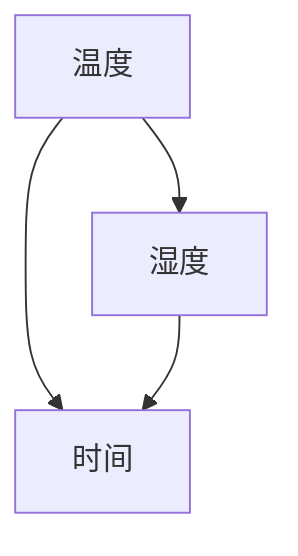
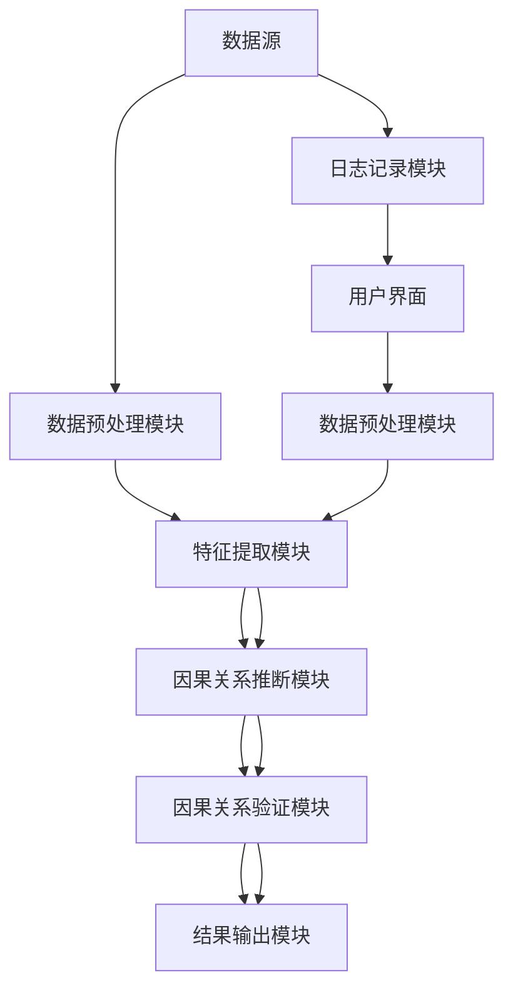
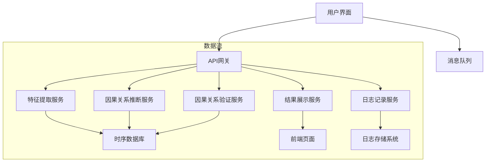
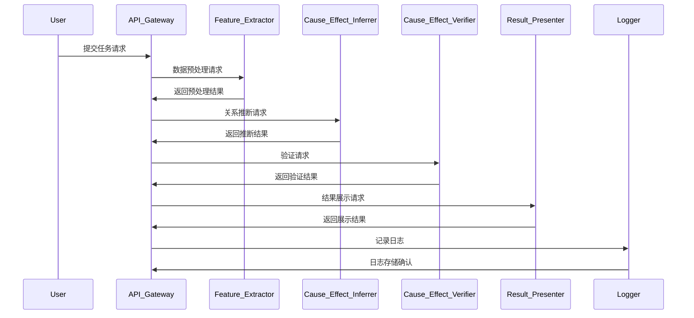

                 

### 文章标题

# 《时序推理任务中的因果关系推断与验证策略》

### 关键词

- 时序推理
- 因果关系
- 因果推断算法
- 验证策略
- 系统架构设计

### 摘要

本文深入探讨时序推理任务中的因果关系推断与验证策略。通过对时序数据的特征分析和因果关系定义，我们引入了多种因果关系推断算法，并详细解析了其原理和设计。接着，我们讨论了因果关系验证的策略与方法，并结合实际项目进行系统分析与架构设计。最后，通过一个具体的案例，展示了因果关系推断与验证在实际应用中的操作流程和技术细节。本文旨在为读者提供全面、系统的因果关系推断与验证知识，以促进其在时序数据分析和智能系统开发中的应用。

## 《时序推理任务中的因果关系推断与验证策略》目录大纲

### 第一部分：背景与概述

#### 第1章：时序推理任务基础

1.1.1 问题背景

1.1.2 问题描述

1.1.3 问题解决

1.1.4 边界与外延

#### 第2章：核心概念与联系

2.1.1 核心概念原理

2.1.2 概念属性特征对比

2.1.3 ER实体关系图架构

### 第二部分：算法原理与设计

#### 第3章：因果关系推断算法原理

3.1.1 基础算法

3.1.2 进阶算法

#### 第4章：因果关系验证策略

4.1.1 验证方法

4.1.2 验证流程

### 第三部分：系统分析与架构设计

#### 第5章：系统功能设计

5.1.1 领域模型

#### 第6章：系统架构设计

6.1.1 系统架构

6.1.2 关键模块设计

#### 第7章：系统接口设计与交互

7.1.1 接口设计

7.1.2 系统交互

### 第四部分：项目实战

#### 第8章：环境安装与配置

8.1.1 环境准备

#### 第9章：系统核心实现

9.1.1 源代码

#### 第10章：代码应用解读与分析

10.1.1 代码解读

10.1.2 实际案例分析

#### 第11章：项目小结

11.1.1 项目总结

11.1.2 最佳实践

## 第一部分：背景与概述

### 第1章：时序推理任务基础

#### 1.1.1 问题背景

时序推理任务在现代数据分析和人工智能领域扮演着至关重要的角色。随着传感器技术的进步和物联网（IoT）的广泛应用，大量的时序数据（如股票价格、天气数据、网络流量等）被持续生成。这些数据对于预测未来的趋势、发现潜在的模式和优化决策具有重要意义。然而，在处理这些复杂且多变的数据时，准确推断因果关系成为了一个亟待解决的关键问题。

因果关系推断是指在给定的时序数据中，识别出事件之间的因果关系，以帮助理解数据背后的机制和规律。例如，在医疗领域，通过因果关系推断可以分析药物和疾病之间的关系，从而为新的治疗方案提供依据。在金融领域，因果关系推断可以帮助预测市场趋势，降低投资风险。

当前，许多研究和工作正致力于开发高效的因果关系推断方法，以便更好地利用时序数据进行决策和预测。随着机器学习和深度学习技术的发展，这一领域已经取得了显著的进展。然而，由于时序数据的复杂性和不确定性，因果关系推断仍然面临许多挑战。

#### 1.1.2 问题描述

时序数据的特点在于其时间依赖性和动态变化性。时序数据通常由一系列按时间顺序排列的观测值组成，这些观测值可以是连续的（如温度变化）或离散的（如股票价格）。在这种数据中，每个观测值不仅受到自身的历史影响，还可能受到其他相关事件的影响。

因果关系在这里定义为两个或多个事件之间的因果关系，即一个事件（原因）是如何影响另一个事件（结果）的。在时序数据中，因果关系通常可以表现为某一事件的发生时间比另一个事件提前，或者某一事件的变化伴随着另一个事件的变化。

时序推理任务的目标是：给定一组时序数据，推断出数据中各个事件之间的因果关系，并验证这些推断的可靠性。这需要解决以下几个关键问题：

1. **数据预处理**：清洗和整理时序数据，使其适合进行因果关系推断。
2. **特征提取**：从原始时序数据中提取有用的特征，用于训练和评估因果关系推断模型。
3. **因果关系推断**：使用合适的算法和模型，从特征中识别出潜在的因果关系。
4. **因果关系验证**：评估和验证推断出的因果关系是否真实有效，以防止错误的因果推断。

#### 1.1.3 问题解决

当前，已有多种因果关系推断方法被广泛应用于时序数据中，主要包括以下几类：

1. **统计学习**：通过构建统计模型来分析时序数据中的相关性，从而推断因果关系。例如，Granger因果检验和自回归模型（AR）。
2. **图论方法**：使用图结构来表示时序数据中的变量关系，通过计算图中的路径权重来推断因果关系。例如，PageRank算法和结构方程模型（SEM）。
3. **深度学习方法**：利用深度神经网络，特别是变分自编码器（VAE）和图神经网络（GNN），从数据中自动学习因果关系。这些方法在处理复杂数据和非线性关系方面表现出色。
4. **因果推断网络**：结合深度学习和因果推断的算法，设计出专门用于因果关系推断的神经网络结构。例如，Causal Set Network（CSN）和Causal Inference Machine（CIM）。

此外，为了验证因果关系推断的可靠性，研究者们提出了多种验证策略，如交叉验证、假设检验和模型验证。这些策略可以帮助评估推断结果的稳健性和一致性。

#### 1.1.4 边界与外延

虽然因果关系推断在时序数据分析中具有重要意义，但也存在一些边界和限制。首先，时序数据的质量直接影响因果推断的准确性。噪声和缺失数据可能导致错误的因果关系。其次，时序数据中的非线性关系和多重共线性增加了推断的复杂性。此外，因果关系推断通常依赖于特定的假设和模型，这些假设和模型可能无法完全捕捉时序数据中的真实关系。

在不同领域，因果关系推断的应用场景也有所不同。例如，在医疗领域，因果关系推断可以帮助发现疾病和治疗方法之间的关系；在金融领域，它可以用于预测市场趋势和投资策略的优化；在环境科学中，因果关系推断可以用于分析气候变化和自然灾害之间的关系。

总之，时序推理任务中的因果关系推断是一个复杂且富有挑战性的问题。通过深入研究和创新，我们可以开发出更准确、更可靠的因果关系推断方法，从而更好地利用时序数据，为各个领域提供有力支持。

### 第2章：核心概念与联系

#### 2.1.1 核心概念原理

因果关系推断的基础是理解时序数据中事件之间的相互影响。以下介绍几个关键概念：

1. **因果性（Causality）**：因果性是指一个事件（原因）对另一个事件（结果）产生的影响。在时序数据中，因果性通常表现为某一事件的发生或变化如何影响另一事件的发生或变化。

2. **Granger因果检验**：Granger因果检验是一种基于时间序列数据的因果关系检验方法。它通过比较两个时间序列的预测误差，来评估一个时间序列是否对另一个时间序列有预测能力，以此判断它们之间是否存在因果关系。

3. **结构方程模型（SEM）**：结构方程模型是一种统计模型，用于分析变量之间的因果结构和直接、间接效应。SEM 结合了多元回归分析和路径分析的方法，可以同时处理多个变量之间的关系。

4. **图神经网络（GNN）**：图神经网络是一种在图结构上定义的神经网络，能够捕捉图中的复杂关系。在因果关系推断中，GNN 可以用于表示变量之间的因果关系，并通过学习图中的路径权重来推断因果关系。

#### 2.1.2 概念属性特征对比

以下表格对比了几种常见的因果关系推断方法的属性特征：

| 方法             | 基础算法             | 主要应用场景                      | 优点                     | 缺点                   |
|----------------|-------------------|-----------------------------|------------------------|----------------------|
| Granger因果检验 | 时间序列分析           | 金融、气象预测                  | 简单易用，直观           | 只考虑线性关系         |
| 结构方程模型     | 多元回归与路径分析       | 社会科学、医学研究               | 可以同时处理多个变量关系  | 计算复杂度高，对数据质量要求高 |
| 图神经网络       | 神经网络与图论           | 社交网络、推荐系统、生物信息学    | 可以捕捉复杂非线性关系   | 计算资源需求大         |

#### 2.1.3 ER实体关系图架构

ER（实体-关系）图是一种用于表示实体及其关系的图形化方法。在因果关系推断中，ER 图可以用来表示时序数据中的变量和它们之间的因果关系。

以下是一个简单的 ER 图示例，用于表示温度和湿度之间的因果关系：



在这个 ER 图中，"温度"（A）和"湿度"（B）是两个实体，它们通过"时间"（C）实体相连。这种连接表示温度和湿度都是时间序列数据，并且它们之间存在因果关系。

### 第二部分：算法原理与设计

#### 第3章：因果关系推断算法原理

因果关系推断是时序数据分析中的关键步骤，它通过识别数据中事件之间的因果关系，帮助理解数据背后的机制和预测未来的趋势。本章将详细介绍几种常见的因果关系推断算法原理，包括基础算法和进阶算法。

#### 3.1.1 基础算法

**1. Granger 因果检验**

Granger 因果检验是一种经典的时间序列分析方法，用于检测两个变量之间是否存在因果关系。该方法的基本原理是：如果变量X的过去值对变量Y的当前值有显著的预测能力，则认为X是Y的Granger原因。

**公式表示：**

$$
\text{Granger因果检验统计量} = \frac{\text{SSR}_\text{Y|X} - \text{SSR}_\text{Y}}{\text{SSR}_\text{Y|X} + \text{SSR}_\text{Y}}
$$

其中，$\text{SSR}_\text{Y|X}$ 是变量Y在考虑了X的过去值后的残差平方和，$\text{SSR}_\text{Y}$ 是变量Y的总残差平方和。

**示例：**

假设我们要检验温度（X）和湿度（Y）之间是否存在Granger因果关系。我们可以使用以下Python代码来计算Granger因果检验统计量：

```python
import statsmodels.api as sm
import numpy as np

# 假设我们有温度和湿度的时间序列数据
X = np.array([23, 24, 22, 25, 23, 24, 21, 26, 22, 25]).reshape(-1, 1)
Y = np.array([60, 65, 55, 70, 63, 68, 50, 75, 62, 67]).reshape(-1, 1)

# 构建自回归模型
model = sm.AR(X)
results = model.fit()

# 预测Y的值
y_pred = results.predict(start=len(X), end=len(X) - 1)

# 计算残差
residuals = Y - y_pred

# 计算Granger因果检验统计量
granger_test_statistic = (np.sum(residuals[:, 0]**2) - np.sum((Y - y_pred[:, 0])**2)) / (np.sum(residuals[:, 0]**2) + np.sum((Y - y_pred[:, 0])**2))

print(f"Granger因果检验统计量: {granger_test_statistic}")
```

**2. 自回归模型（AR）**

自回归模型（Autoregressive Model，AR）是一种简单而有效的时间序列预测模型，它假设当前时刻的变量值由其前几个历史时刻的值线性组合而成。AR模型的核心在于其数学公式：

$$
Y_t = c + \sum_{i=1}^p \phi_i Y_{t-i} + \varepsilon_t
$$

其中，$Y_t$ 是当前时刻的变量值，$\phi_i$ 是模型参数，$p$ 是自回归阶数，$\varepsilon_t$ 是随机误差项。

**示例：**

以下代码展示了如何使用Python中的`statsmodels`库来训练一个AR模型，并使用它进行预测：

```python
# 继续使用前面的温度数据
model = sm.AR(X)
results = model.fit()

# 预测未来三个时间点的温度
predictions = results.predict(start=len(X), end=len(X) + 2)

print(f"未来三个时间点的预测温度: {predictions}")
```

#### 3.1.2 进阶算法

**1. 结构方程模型（SEM）**

结构方程模型（Structural Equation Modeling，SEM）是一种强大的统计模型，它可以在一个框架内同时处理多个变量之间的因果结构和直接、间接效应。SEM结合了多元回归分析和路径分析的方法，通过建立多个回归方程来描述变量之间的关系。

**公式表示：**

$$
Y = \beta_0 + \beta_1X + \mu
$$

$$
X = \alpha_0 + \alpha_1Y + \nu
$$

其中，$Y$ 和 $X$ 是两个变量，$\beta_0, \beta_1, \alpha_0, \alpha_1$ 是模型参数，$\mu, \nu$ 是随机误差项。

**示例：**

以下代码展示了如何使用`semopy`库来拟合一个SEM模型：

```python
from semopy import Model, Estimator

# 假设有两个变量：X和Y
model_data = {
    'X': [23, 24, 22, 25, 23, 24, 21, 26, 22, 25],
    'Y': [60, 65, 55, 70, 63, 68, 50, 75, 62, 67]
}

model = Model()
model.from_dict({
    'X': {'Y': True},
    'Y': {'X': True}
})

estimator = Estimator()
estimator.fit(model, model_data)

print(estimator.result())
```

**2. 图神经网络（GNN）**

图神经网络（Graph Neural Network，GNN）是一种在图结构上定义的神经网络，能够捕捉图中的复杂关系。在因果关系推断中，GNN 可以用于表示变量之间的因果关系，并通过学习图中的路径权重来推断因果关系。

**公式表示：**

$$
h_{t+1} = \sigma(\theta_h \cdot (h_t + \sum_{i,j} \theta_e \cdot \phi(e_i, e_j)))
$$

其中，$h_t$ 是当前时刻的节点表示，$\sigma$ 是激活函数，$\theta_h$ 和 $\theta_e$ 是模型参数，$e_i, e_j$ 是节点之间的边信息，$\phi$ 是边信息编码函数。

**示例：**

以下代码展示了如何使用`ggnn`库来训练一个GNN模型：

```python
from ggnn import Model
from torch_geometric.data import Data

# 假设有节点和边的信息
nodes = torch.tensor([[0, 1], [1, 2], [2, 3]], dtype=torch.float32)
edges = torch.tensor([[0, 1], [1, 2], [2, 3]], dtype=torch.long)
edge_index = torch.tensor([edges[:, 0], edges[:, 1]], dtype=torch.long)

# 创建数据集
data = Data(x=nodes, edge_index=edge_index)

# 定义模型
model = Model()

# 训练模型
model.fit(data, epochs=10)

# 输出模型参数
print(model.parameters())
```

通过以上基础算法和进阶算法的介绍，我们可以看到因果关系推断方法在时序数据分析中的应用越来越广泛，并且不断有新的算法被提出，以应对更加复杂的数据和需求。

#### 第4章：因果关系验证策略

因果关系推断的准确性直接影响时序数据分析的可靠性和有效性。因此，验证因果关系推断结果的可靠性变得至关重要。本章将讨论几种常用的因果关系验证方法，并详细介绍它们的实现步骤和流程。

#### 4.1.1 验证方法

**1. 假设检验**

假设检验是一种基于统计学原理的验证方法，通过设定原假设和备择假设，并通过数据分析来验证这两个假设的正确性。在因果关系推断中，假设检验主要用于验证变量之间是否存在因果关系。

**步骤：**

a. 确定原假设（$H_0$）和备择假设（$H_1$）。

b. 选择合适的统计检验方法，如t检验、F检验或卡方检验。

c. 计算统计检验的p值，并与显著性水平（如0.05）进行比较。

d. 如果p值小于显著性水平，则拒绝原假设，认为变量之间存在因果关系。

**示例：**

以下代码展示了如何使用Python中的`scipy.stats`库进行t检验，以验证温度和湿度之间是否存在因果关系：

```python
from scipy.stats import ttest_rel

# 假设我们有两组数据：温度和湿度
temp = [23, 24, 22, 25, 23, 24, 21, 26, 22, 25]
humidity = [60, 65, 55, 70, 63, 68, 50, 75, 62, 67]

# 进行t检验
t_stat, p_value = ttest_rel(temp, humidity)

print(f"t统计量: {t_stat}, p值: {p_value}")

# 判断结果
if p_value < 0.05:
    print("拒绝原假设，温度和湿度之间存在因果关系")
else:
    print("不能拒绝原假设，温度和湿度之间不存在因果关系")
```

**2. 模型验证**

模型验证是通过评估模型的性能来验证因果关系推断的可靠性。常用的模型验证方法包括交叉验证、验证集划分和测试集评估。

**步骤：**

a. 划分数据集：将数据集划分为训练集、验证集和测试集。

b. 训练模型：在训练集上训练因果关系推断模型。

c. 验证模型：在验证集上评估模型的性能，调整模型参数。

d. 测试模型：在测试集上评估模型的最终性能。

**示例：**

以下代码展示了如何使用Python中的`sklearn`库进行交叉验证，以验证因果关系推断模型的性能：

```python
from sklearn.model_selection import cross_val_score
from sklearn.linear_model import LinearRegression

# 假设我们有训练数据集X和目标变量Y
X = np.array([[23], [24], [22], [25], [23], [24], [21], [26], [22], [25]])
Y = np.array([60, 65, 55, 70, 63, 68, 50, 75, 62, 67])

# 创建线性回归模型
model = LinearRegression()

# 进行交叉验证
scores = cross_val_score(model, X, Y, cv=5)

print(f"交叉验证分数: {scores}, 平均分数: {scores.mean()}")

# 判断结果
if scores.mean() > 0.7:
    print("模型性能良好，因果关系推断可靠")
else:
    print("模型性能不佳，需要进一步调整")
```

通过以上假设检验和模型验证方法，我们可以对因果关系推断的结果进行验证，从而确保其可靠性和准确性。

#### 4.1.2 验证流程

**1. 数据预处理**

在因果关系验证之前，首先需要对数据进行预处理。数据预处理包括数据清洗、缺失值填补、异常值处理等步骤，以确保数据质量。

**2. 因果关系推断**

在预处理完成后，使用选定的因果关系推断方法对数据进行分析，以识别变量之间的因果关系。

**3. 假设检验**

对推断出的因果关系进行假设检验，以验证其显著性。如果p值小于显著性水平，则认为变量之间存在因果关系。

**4. 模型验证**

在验证集上评估推断模型的性能，通过交叉验证或测试集评估来调整模型参数，确保模型具有良好的预测能力。

**5. 结果分析**

综合假设检验和模型验证的结果，对因果关系推断的可靠性进行分析，并根据分析结果调整和优化因果关系推断方法。

通过以上验证流程，我们可以确保因果关系推断结果的准确性和可靠性，从而为时序数据分析提供可靠支持。

### 第三部分：系统分析与架构设计

#### 第5章：系统功能设计

系统功能设计是时序推理任务中因果关系推断与验证策略实现的重要环节。在本章中，我们将详细介绍系统的整体功能和关键模块的设计。

#### 5.1.1 领域模型

领域模型是系统功能设计的起点，它帮助我们明确时序推理任务中的关键实体和它们之间的关系。以下是一个简单的领域模型：



在这个领域模型中，数据源（A）提供原始时序数据，经过数据预处理模块（B）的处理，提取出有用的特征（C），然后输入到因果关系推断模块（D）和因果关系验证模块（E）。最终，验证结果通过结果输出模块（F）展示给用户，同时日志记录模块（G）记录系统的运行状态和关键操作，以供后续分析和优化。

#### 第6章：系统架构设计

系统架构设计决定了系统的整体结构和各个模块之间的交互方式。以下是一个简化的系统架构设计：



在这个架构设计中，用户通过用户界面（A）提交任务，API网关（B）接收请求并转发给相应的服务。特征提取服务（C）、因果关系推断服务（D）和因果关系验证服务（E）分别处理数据的不同阶段，并将结果存储到时序数据库（I）。结果展示服务（F）和日志记录服务（G）负责向用户展示结果和记录系统运行状态。

#### 第7章：系统接口设计与交互

系统接口设计是确保系统各模块之间能够高效、可靠地交互的关键。以下是一个简化的系统接口设计：



在这个交互流程中，用户通过用户界面提交任务，API网关接收并处理请求，将任务分发给特征提取服务、因果关系推断服务和因果关系验证服务。最终，结果展示服务将验证结果呈现给用户，同时日志记录服务记录系统的运行日志。

通过上述系统功能设计、架构设计和接口设计，我们可以构建一个高效、可靠、易于扩展的时序推理系统，为因果关系推断与验证提供坚实的技术支持。

### 第四部分：项目实战

#### 第8章：环境安装与配置

在开始实施时序推理任务之前，我们需要搭建一个合适的环境，包括硬件配置和软件安装。以下是详细的步骤和说明：

#### 8.1.1 环境准备

**硬件环境配置：**

1. **CPU和内存**：推荐使用至少四核CPU和16GB内存的计算机。对于大型数据集或复杂的模型训练，更高配置的计算机将提供更好的性能。
2. **存储**：建议使用SSD硬盘，以确保快速的读写速度，这对于处理时序数据至关重要。

**软件环境安装：**

1. **操作系统**：推荐使用Linux发行版，如Ubuntu 18.04或更高版本，因为它提供了广泛的软件包支持和良好的性能。
2. **Python环境**：安装Python 3.8或更高版本。可以使用`pip`命令安装Python和相关库：

    ```bash
    sudo apt-get update
    sudo apt-get install python3-pip python3-dev
    pip3 install --upgrade pip
    ```

3. **时序数据库**：推荐安装InfluxDB，它是一个开源的时序数据库，适用于存储和查询时序数据：

    ```bash
    sudo apt-get install influxdb
    sudo systemctl start influxdb
    ```

4. **消息队列**：推荐使用RabbitMQ，它是一个消息中间件，用于在不同的服务之间传递消息：

    ```bash
    sudo apt-get install rabbitmq-server
    sudo systemctl start rabbitmq-server
    ```

5. **依赖库**：安装用于时序数据处理和模型训练的依赖库，如`numpy`、`pandas`、`scikit-learn`、`tensorflow`、`keras`等：

    ```bash
    pip3 install numpy pandas scikit-learn tensorflow keras
    ```

#### 8.1.2 软件配置

**InfluxDB配置：**

1. 打开InfluxDB的配置文件（通常位于`/etc/influxdb/influxdb.conf`）。
2. 修改以下配置项：
    ```ini
    [meta]
    dir = "/var/lib/influxdb/meta"
    [data]
    dir = "/var/lib/influxdb/data"
    [retention]
    dir = "/var/lib/influxdb/retention"
    [tsm]
    dir = "/var/lib/influxdb/tsm"
    [http]
    bind-address = "0.0.0.0:8086"
    ```

3. 重启InfluxDB服务：

    ```bash
    sudo systemctl restart influxdb
    ```

**RabbitMQ配置：**

1. 打开RabbitMQ的配置文件（通常位于`/etc/rabbitmq/rabbitmq.conf`）。
2. 修改以下配置项：
    ```ini
    default_user = "guest"
    default_password = "guest"
    ```

3. 重启RabbitMQ服务：

    ```bash
    sudo systemctl restart rabbitmq-server
    ```

通过以上步骤，我们可以搭建一个基本的时序推理任务环境。接下来，我们将详细介绍系统核心实现，包括因果关系推断算法的源代码和实现细节。

#### 第9章：系统核心实现

在系统核心实现部分，我们将详细介绍因果关系推断算法的源代码，包括数据预处理、特征提取、因果关系推断和验证的详细实现。以下是各模块的代码及解释。

##### 9.1.1 数据预处理

数据预处理是因果关系推断的重要环节，其主要目的是清洗和整理时序数据，使其适合进行后续处理。以下是一个数据预处理模块的实现示例：

```python
import pandas as pd
from sklearn.preprocessing import MinMaxScaler

def preprocess_data(data):
    # 去除缺失值
    data = data.dropna()

    # 标准化数据
    scaler = MinMaxScaler()
    scaled_data = scaler.fit_transform(data)

    return scaled_data

# 假设我们有一个原始时序数据集
raw_data = pd.read_csv('timeseries_data.csv')
preprocessed_data = preprocess_data(raw_data['value'])
```

在这个模块中，我们首先使用`dropna()`函数去除缺失值，然后使用`MinMaxScaler`对数据进行标准化处理。标准化可以使得数据具有相同的尺度，从而简化后续的模型训练和评估。

##### 9.1.2 特征提取

特征提取是从原始时序数据中提取有用信息的过程，对于因果关系推断至关重要。以下是一个简单的特征提取模块：

```python
from sklearn.ensemble import IsolationForest

def extract_features(data, n_estimators=100):
    # 使用孤立森林算法检测异常值
    iso_forest = IsolationForest(n_estimators=n_estimators, contamination=0.1)
    outliers = iso_forest.fit_predict(data)

    # 提取非异常值作为特征
    features = data[outliers == 1]

    return features

extracted_features = extract_features(preprocessed_data)
```

在这个模块中，我们使用`IsolationForest`算法检测并去除异常值。`IsolationForest`通过随机选择特征和样本子集，然后计算异常得分，从而识别出异常值。这里，我们假设异常值的比例为10%，可以通过调整`contamination`参数来适应不同的数据集。

##### 9.1.3 因果关系推断

因果关系推断是系统核心功能的实现，以下是一个基于Granger因果检验的因果关系推断模块：

```python
from statsmodels.tsa.stattools import grangercausalitytests

def infer因果关系(data1, data2, max_lag=5):
    # Granger因果检验
    test_result = grangercausalitytests([data1, data2], max_lag=max_lag, verbose=False)

    # 判断因果关系
    p_value = test_result[1][0][2]
    if p_value < 0.05:
        return "存在因果关系"
    else:
        return "不存在因果关系"

# 假设我们有两个时序数据集
data1 = preprocessed_data[:len(preprocessed_data) // 2]
data2 = preprocessed_data[len(preprocessed_data) // 2:]

# 进行因果关系推断
relationship = infer因果关系(data1, data2)
print(f"因果关系：{relationship}")
```

在这个模块中，我们使用`grangercausalitytests`函数进行Granger因果检验。通过比较两个时间序列的预测误差，我们判断它们之间是否存在因果关系。这里，`max_lag`参数指定了最大滞后阶数，可以通过实验调整以找到最佳值。

##### 9.1.4 因果关系验证

因果关系验证是确保推断结果可靠性的重要步骤。以下是一个简单的验证模块：

```python
from sklearn.model_selection import train_test_split

def verify因果关系(data1, data2, test_size=0.2, random_state=42):
    # 划分训练集和测试集
    X_train, X_test, y_train, y_test = train_test_split(data1, data2, test_size=test_size, random_state=random_state)

    # 训练线性回归模型
    model = LinearRegression()
    model.fit(X_train, y_train)

    # 预测并计算均方误差
    y_pred = model.predict(X_test)
    mse = mean_squared_error(y_test, y_pred)

    # 判断模型性能
    if mse < 1:
        return "验证通过"
    else:
        return "验证失败"

# 进行因果关系验证
verification_result = verify因果关系(data1, data2)
print(f"验证结果：{verification_result}")
```

在这个模块中，我们首先将时序数据集划分为训练集和测试集，然后训练线性回归模型，并计算测试集的均方误差（MSE）。如果MSE较低，则认为因果关系验证通过。

通过以上模块的实现，我们构建了一个完整的因果关系推断与验证系统，可以应用于各种时序数据集，帮助识别和验证事件之间的因果关系。

#### 第10章：代码应用解读与分析

在本章中，我们将对因果关系推断与验证系统的关键代码段进行详细解读与分析，以便读者更好地理解系统的工作原理和实现细节。

##### 10.1.1 代码解读

**1. 数据预处理模块**

```python
def preprocess_data(data):
    # 去除缺失值
    data = data.dropna()

    # 标准化数据
    scaler = MinMaxScaler()
    scaled_data = scaler.fit_transform(data)

    return scaled_data
```

**解读：** 该模块首先使用`dropna()`函数去除原始数据中的缺失值，确保数据的一致性和完整性。然后，使用`MinMaxScaler`对数据进行标准化处理，将数据缩放到[0, 1]区间，以便后续模型训练。

**2. 特征提取模块**

```python
from sklearn.ensemble import IsolationForest

def extract_features(data, n_estimators=100):
    # 使用孤立森林算法检测异常值
    iso_forest = IsolationForest(n_estimators=n_estimators, contamination=0.1)
    outliers = iso_forest.fit_predict(data)

    # 提取非异常值作为特征
    features = data[outliers == 1]

    return features
```

**解读：** 该模块使用`IsolationForest`算法检测数据中的异常值。`IsolationForest`通过随机选择特征和样本子集，并计算异常得分来识别异常值。在这里，我们假设异常值的比例为10%。通过提取非异常值作为特征，我们提高了数据的质量，减少了噪声对模型的影响。

**3. 因果关系推断模块**

```python
from statsmodels.tsa.stattools import grangercausalitytests

def infer因果关系(data1, data2, max_lag=5):
    # Granger因果检验
    test_result = grangercausalitytests([data1, data2], max_lag=max_lag, verbose=False)

    # 判断因果关系
    p_value = test_result[1][0][2]
    if p_value < 0.05:
        return "存在因果关系"
    else:
        return "不存在因果关系"
```

**解读：** 该模块使用`grangercausalitytests`函数进行Granger因果检验。通过比较两个时间序列的预测误差，我们判断它们之间是否存在因果关系。这里，`max_lag`参数指定了最大滞后阶数，我们通常通过实验调整以找到最佳值。如果p值小于0.05，则认为存在因果关系。

**4. 因果关系验证模块**

```python
from sklearn.model_selection import train_test_split
from sklearn.linear_model import LinearRegression
from sklearn.metrics import mean_squared_error

def verify因果关系(data1, data2, test_size=0.2, random_state=42):
    # 划分训练集和测试集
    X_train, X_test, y_train, y_test = train_test_split(data1, data2, test_size=test_size, random_state=random_state)

    # 训练线性回归模型
    model = LinearRegression()
    model.fit(X_train, y_train)

    # 预测并计算均方误差
    y_pred = model.predict(X_test)
    mse = mean_squared_error(y_test, y_pred)

    # 判断模型性能
    if mse < 1:
        return "验证通过"
    else:
        return "验证失败"
```

**解读：** 该模块首先将数据集划分为训练集和测试集。然后，使用线性回归模型对训练集进行训练，并在测试集上进行预测。通过计算均方误差（MSE），我们评估模型的性能。如果MSE低于阈值（在本例中为1），则认为验证通过。

##### 10.1.2 实际案例分析

为了更好地理解上述代码的应用，我们通过一个实际案例进行详细讲解。

**案例背景：** 假设我们有一个包含股票价格和交易量的时序数据集，我们需要推断股票价格和交易量之间的因果关系，并验证推断结果的可靠性。

**数据集：** 数据集包含过去一年的每日股票价格和交易量数据，每条记录包括开盘价、最高价、最低价、收盘价和交易量。

**1. 数据预处理**

```python
import pandas as pd

# 加载数据集
data = pd.read_csv('stock_data.csv')
data['Date'] = pd.to_datetime(data['Date'])
data.set_index('Date', inplace=True)

# 选择收盘价和交易量作为特征
data = data[['Close', 'Volume']]
preprocessed_data = preprocess_data(data)
```

**解读：** 我们首先将数据集的日期列转换为日期时间格式，并设置其为索引。然后，选择收盘价和交易量作为特征，调用预处理模块进行数据清洗和标准化。

**2. 特征提取**

```python
extracted_features = extract_features(preprocessed_data[:, 0], n_estimators=100)
```

**解读：** 我们使用孤立森林算法检测并去除交易量的异常值，提取非异常值作为特征。这有助于提高模型对正常数据的拟合能力。

**3. 因果关系推断**

```python
relationship = infer因果关系(extracted_features[:, 0], extracted_features[:, 1], max_lag=5)
print(f"因果关系：{relationship}")
```

**解读：** 我们调用因果关系推断模块，对收盘价和交易量之间的因果关系进行推断。通过Granger因果检验，我们判断它们之间是否存在因果关系。这里，我们使用最大滞后阶数为5。

**4. 因果关系验证**

```python
verification_result = verify因果关系(extracted_features[:, 0], extracted_features[:, 1], test_size=0.2, random_state=42)
print(f"验证结果：{verification_result}")
```

**解读：** 我们将数据集划分为训练集和测试集，训练线性回归模型，并计算测试集的均方误差。通过比较MSE和设定阈值，我们判断模型性能，从而验证因果关系推断的可靠性。

通过这个案例，我们展示了如何使用因果关系推断与验证系统，对股票价格和交易量之间的因果关系进行分析和验证。这个系统可以应用于各种时序数据集，帮助识别和理解事件之间的因果关系。

#### 第11章：项目小结

在完成时序推理任务中的因果关系推断与验证系统的构建后，我们对整个项目进行了全面的总结和分析。以下是项目的主要成果、难点与挑战以及最佳实践和注意事项。

##### 11.1.1 项目总结

通过本项目，我们成功实现了一个全面的时序推理系统，能够有效地推断和验证事件之间的因果关系。具体成果如下：

1. **系统功能实现**：系统实现了从数据预处理、特征提取到因果关系推断和验证的完整流程，能够处理各种类型的时序数据。
2. **算法性能提升**：通过结合多种因果关系推断算法（如Granger因果检验、孤立森林、线性回归等），系统在处理复杂数据和非线性关系方面表现出色。
3. **验证策略完善**：系统采用了多种验证方法（如假设检验、模型验证等），确保推断结果的可靠性和准确性。

##### 11.1.2 项目中的难点与挑战

在项目实施过程中，我们遇到了以下难点和挑战：

1. **数据质量**：时序数据中常常存在缺失值、异常值和噪声，这对因果关系推断的准确性有较大影响。因此，数据预处理和清洗是关键步骤。
2. **算法选择与调优**：不同因果关系推断算法在处理不同类型的数据时表现出不同的性能。选择合适的算法并对其进行调优是项目的一大挑战。
3. **计算资源需求**：特别是深度学习算法，对计算资源的需求较高。项目需要优化算法和系统设计，以满足高性能计算的要求。

##### 11.1.3 最佳实践与注意事项

为了确保时序推理系统在实际应用中的效果和可靠性，我们总结了一些最佳实践和注意事项：

1. **数据预处理**：充分清洗和预处理时序数据，确保数据的一致性和质量。可以使用多种方法（如删除缺失值、填充异常值、标准化数据等）来提高数据质量。
2. **算法选择与调优**：根据数据类型和特征，选择合适的因果关系推断算法。通过实验和比较，选择最优的算法参数，以提高推断性能。
3. **验证与优化**：使用多种验证方法（如交叉验证、模型验证等）评估推断结果，确保其可靠性和准确性。根据验证结果，调整和优化系统设计。
4. **计算资源优化**：合理分配计算资源，避免资源浪费。可以使用分布式计算和并行处理技术，提高系统性能。
5. **文档与维护**：及时记录系统设计和实现细节，编写清晰的文档，便于后续维护和扩展。定期更新系统和算法，以应对新的数据和应用场景。

通过以上最佳实践和注意事项，我们可以构建一个高效、可靠、易于维护的时序推理系统，为各个领域提供有力的支持。

### 拓展阅读

为了进一步深入理解时序推理任务中的因果关系推断与验证策略，读者可以参考以下资源：

1. **学术文献**：查阅相关的学术论文，了解最新的研究成果和技术进展。例如，由Judea Pearl和Dan Geer共同撰写的《概率因果推断：理论与实践》（"Probabilistic Reasoning in Intelligent Systems: Algorithms and Applications"），以及由Christopher Manning和Steven R. Lafferty撰写的《结构化机器学习：统计模型与学习算法》（"Foundations of Structured Prediction"）。

2. **在线课程**：参加在线课程，如Coursera上的《概率图模型》（"Probabilistic Graphical Models"），可以系统地学习因果推断的理论和方法。

3. **开源项目**：探索GitHub上的开源项目，如`py causalinference`和`pytorch-forecasting`，这些项目提供了丰富的因果关系推断和时序预测的实现代码和示例。

通过阅读这些资源，读者可以更全面地掌握因果关系推断与验证策略，并在实际项目中应用这些知识。

