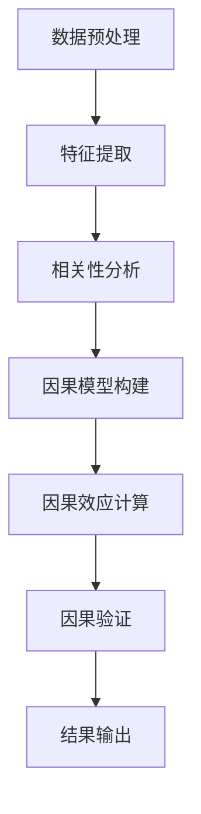
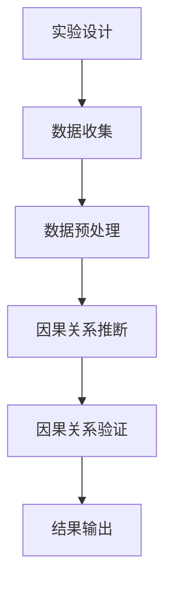
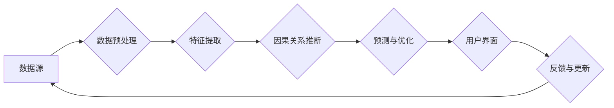
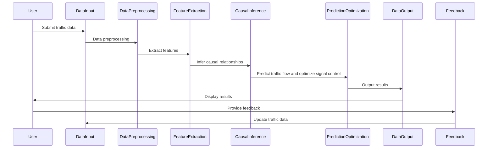

                 

**文章标题：时空推理任务中的因果关系推断与验证**

**关键词：时空推理，因果关系，推断与验证，因果图，机器学习，系统架构设计**

**摘要：本文深入探讨了时空推理任务中的因果关系推断与验证，介绍了相关的基本概念、理论基础、方法与技术，并通过实际应用与案例分析展示了其重要性。文章采用逻辑清晰、结构紧凑、简单易懂的写作风格，旨在为读者提供全面的技术理解。**

## 目录大纲设计步骤

在设计一篇关于《时空推理任务中的因果关系推断与验证》的完整目录大纲时，我们需要遵循以下步骤：

### 1. 确定书籍主题和范围

首先，明确书籍的主题是关于时空推理任务中的因果关系推断与验证。这包括介绍时空推理任务的定义、重要性以及因果关系推断与验证的基本概念。书籍的覆盖范围应包括相关理论基础、方法与技术，以及实际应用案例。

### 2. 设计总框架

根据书籍主题，我们可以将整体内容分为以下几个部分：

- **背景与概述**：介绍时空推理任务的重要性及其在各个领域的应用，梳理因果关系推断与验证的基本概念。
- **理论基础**：详细讲解与时空推理任务相关的核心理论，如因果图、因果模型等，深入剖析因果关系的概念。
- **方法与技术**：介绍用于因果关系推断与验证的主要方法和技术，比较各种方法的优缺点。
- **算法原理与实现**：使用 Mermaid 画图展示主要的因果关系推断与验证算法，详细阐述算法原理和数学模型。
- **系统架构与设计**：介绍如何将因果关系推断与验证算法应用于实际系统，展示系统架构和设计。
- **实际应用与案例分析**：分析因果关系推断与验证在各个领域的实际应用，通过实际案例进行详细讲解。
- **总结与展望**：对全书内容进行总结，提出未来研究方向和发展趋势。

### 3. 设计具体章节

在确定总框架后，我们可以进一步细化每个部分的内容，设计具体的章节。以下是每个部分的初步章节构想：

- **第1部分：背景与概述**
  - **第1章**：时空推理任务简介
  - **第2章**：因果关系的基本概念
- **第2部分：理论基础**
  - **第3章**：因果图理论
  - **第4章**：因果模型
- **第3部分：方法与技术**
  - **第5章**：统计方法
  - **第6章**：机器学习方法
- **第4部分：算法原理与实现**
  - **第7章**：因果关系推断算法
  - **第8章**：因果关系验证算法
- **第5部分：系统架构与设计**
  - **第9章**：系统架构设计
  - **第10章**：系统接口与交互设计
- **第6部分：实际应用与案例分析**
  - **第11章**：因果关系推断的应用案例
  - **第12章**：因果关系验证的应用案例
- **第7部分：总结与展望**
  - **第13章**：总结与展望

### 4. 优化与调整

根据字数限制，我们可能需要对部分章节进行合并或拆分，确保目录大纲的总字数在2000字以内。同时，我们还可以根据内容的实际需要，对章节的顺序和结构进行微调，确保整个目录的逻辑性和连贯性。

这样，我们就完成了一个关于《时空推理任务中的因果关系推断与验证》的初步目录大纲设计。接下来，我们将按照这个大纲来编写书籍的内容，确保每章的内容都能详细且准确地覆盖主题。

## 第1章：时空推理任务简介

### 1.1 时空推理的定义与基本概念

时空推理（Temporal Reasoning）是指利用时间序列数据对事件进行推理和预测的过程。在人工智能领域，时空推理是一种重要的任务，广泛应用于智能交通、医疗诊断、金融市场预测等多个领域。

#### 核心概念术语说明

- **时间序列数据（Time Series Data）**：表示按时间顺序排列的一系列数据点。
- **事件（Event）**：在时间序列中的某个时刻发生的重要变化。
- **状态（State）**：在特定时间点上系统的特征或属性。
- **因果关系（Causal Relationship）**：事件之间的因果关系，即一个事件是另一个事件的原因。

#### 问题背景

在许多实际应用中，我们需要根据历史数据和事件序列来预测未来的事件。例如，在智能交通系统中，通过分析交通流量、交通事故等历史数据，可以预测未来的交通状况，从而优化交通信号控制，减少交通拥堵。

#### 问题描述

时空推理的任务可以分为以下几个步骤：

1. 数据收集：收集相关的时间序列数据，如交通流量数据、医疗记录数据等。
2. 数据预处理：对原始数据进行清洗、去噪和归一化处理，使其适合进行后续分析。
3. 特征提取：从时间序列数据中提取有用的特征，如趋势、周期性、突变等。
4. 因果关系推断：利用因果推断算法，分析事件之间的因果关系。
5. 预测与决策：根据因果关系和特征进行预测，为后续的决策提供支持。

#### 问题解决

时空推理问题解决的关键在于如何有效地进行因果关系推断。以下是一些常用的方法：

1. **统计方法**：如相关性分析、回归分析等，用于发现事件之间的相关性。
2. **机器学习方法**：如支持向量机、随机森林、神经网络等，通过学习历史数据来预测未来事件。
3. **因果图方法**：利用因果图模型来表示事件之间的因果关系，通过推理算法来推断因果关系。

#### 边界与外延

时空推理的任务范围广泛，涉及多个领域，如：

- **智能交通**：通过时空推理预测交通流量、事故发生等，优化交通信号控制。
- **医疗诊断**：利用时空推理分析患者的历史数据，预测疾病的进展和治疗效果。
- **金融市场**：通过时空推理分析市场数据，预测股票价格和投资风险。

#### 概念结构与核心要素组成

时空推理任务的核心要素包括：

- **时间序列数据**：作为输入数据，是时空推理的基础。
- **因果关系推断方法**：用于分析事件之间的因果关系。
- **预测模型**：用于预测未来的事件和状态。

通过以上步骤，我们可以实现对时空推理任务的有效解决。

### 1.2 时空推理任务的重要性

时空推理任务在多个领域具有重要应用价值，以下是一些具体的应用场景：

1. **智能交通**：通过时空推理预测交通流量和事故发生，优化交通信号控制，减少交通拥堵，提高道路通行效率。
2. **医疗诊断**：利用时空推理分析患者的历史数据，预测疾病的进展和治疗效果，为临床决策提供支持。
3. **金融市场**：通过时空推理分析市场数据，预测股票价格和投资风险，指导投资策略。
4. **环境监测**：通过时空推理预测环境变化，如空气质量、水污染等，为环境保护提供依据。

时空推理任务的重要性在于：

- **提高预测准确性**：通过分析历史数据和事件序列，可以更准确地预测未来的事件，为决策提供科学依据。
- **优化系统性能**：在智能交通、医疗诊断等领域，时空推理有助于优化系统性能，提高服务质量和效率。
- **促进科学研究**：时空推理为各个领域的科学研究提供了新的方法和工具，促进了学科发展。

## 第2章：因果关系的基本概念

### 2.1 因果关系的定义

因果关系（Causal Relationship）是指在一个系统中，某个事件（因）如何引起另一个事件（果）的发生。在科学研究中，因果关系是理解现象背后的根本原因和机制的重要手段。

#### 核心概念

- **原因（Cause）**：引起其他事件发生的事件。
- **结果（Effect）**：由其他事件引起的事件。

#### 因果关系的特点

1. **时序性**：因果关系具有时序性，即原因必须在结果之前发生。
2. **因果关系传递**：一个原因可以引起多个结果，同时一个结果也可以由多个原因引起。
3. **因果关系复杂性**：因果关系可能受到外部干扰，导致因果关系复杂化。

#### 因果关系的分类

根据因果关系的特点，可以分为以下几类：

1. **直接因果关系**：一个事件直接引起另一个事件，没有中间变量。
2. **间接因果关系**：一个事件通过中间变量间接引起另一个事件。
3. **共同因果关系**：两个或多个事件共同引起一个结果。

#### 因果关系的表示方法

在因果推理中，常用的表示方法包括：

1. **因果图**：用图来表示事件之间的因果关系，其中节点表示事件，边表示因果关系。
2. **因果模型**：如贝叶斯网络、结构方程模型等，用于表示事件之间的因果关系。

### 2.2 因果关系的属性

因果关系具有多个属性，这些属性对因果关系推断和验证具有重要影响。

#### 可识别性

可识别性（Identifiability）是指我们是否能够从数据中确定因果关系。在实际应用中，可识别性取决于以下几个因素：

1. **数据的完备性**：如果数据包含所有可能的原因和结果，因果关系通常是可以识别的。
2. **数据的独立性**：如果数据是独立采集的，因果关系更容易被识别。
3. **实验设计**：通过精心设计的实验，可以增加因果关系的可识别性。

#### 因果强度

因果强度（Causal Strength）是指原因对结果的影响程度。因果关系强度可以通过以下方式衡量：

1. **效应大小**：原因对结果的影响大小，如增加一个变量单位对另一个变量单位的影响。
2. **因果效应系数**：通过统计模型计算出的因果效应系数，用于量化因果关系强度。

#### 因果关系方向

因果关系方向（Causal Direction）是指原因和结果之间的时间顺序。确定因果关系方向通常需要以下方法：

1. **时间序列分析**：通过分析事件的时间序列数据，确定因果关系方向。
2. **因果关系推断算法**：如因果图推理算法、因果模型推理算法等，用于推断因果关系方向。

### 2.3 因果关系的类型

因果关系根据其性质和形式，可以分为以下几种类型：

1. **正相关关系**：当一个变量的值增加时，另一个变量的值也增加，二者呈正相关。
2. **负相关关系**：当一个变量的值增加时，另一个变量的值减少，二者呈负相关。
3. **线性关系**：因果关系可以用线性方程表示，即原因和结果之间存在固定的比例关系。
4. **非线性关系**：因果关系不能用线性方程表示，二者之间的关系复杂。
5. **即时关系**：因果关系在极短时间内发生，原因和结果之间的时间间隔很小。
6. **延迟关系**：因果关系在较长时间内发生，原因和结果之间存在时间延迟。

通过深入理解因果关系的基本概念、属性和类型，我们可以更好地进行因果关系推断和验证，从而为时空推理任务提供可靠的基础。

### 2.4 因果关系的推断方法

因果关系推断是时空推理任务中的一个重要环节，用于确定事件之间的因果关系。以下介绍几种常用的因果关系推断方法。

#### 统计方法

统计方法是最常用的因果关系推断方法之一，主要包括以下几种：

1. **相关性分析**：通过计算变量之间的相关系数，判断变量之间的相关性。正相关关系通常表明存在因果关系，但相关性并不一定意味着因果关系。
2. **回归分析**：通过建立回归模型，分析自变量和因变量之间的关系。回归系数可以用于判断因果关系方向和强度。
3. **Granger因果关系检验**：检验一个时间序列是否是另一个时间序列的Granger原因，通过计算预测误差的显著性来判断因果关系。

#### 机器学习方法

机器学习方法在因果关系推断中也得到了广泛应用，主要包括以下几种：

1. **支持向量机（SVM）**：通过构建支持向量机模型，可以判断变量之间的因果关系。SVM模型可以根据支持向量的分布来推断因果关系方向。
2. **随机森林（Random Forest）**：随机森林是一种集成学习方法，通过构建多个决策树并集成其预测结果，可以提高因果关系推断的准确性和鲁棒性。
3. **神经网络（Neural Network）**：神经网络可以用来建立复杂的关系模型，通过训练神经网络模型，可以学习到变量之间的因果关系。

#### 因果图方法

因果图方法是一种基于概率论的因果关系推断方法，通过构建因果图模型来表示变量之间的因果关系。因果图方法主要包括以下几种：

1. **因果图推理**：利用因果图模型进行推理，判断变量之间的因果关系。因果图推理方法可以处理变量之间的复杂关系，具有较高的准确性。
2. **结构方程模型（SEM）**：结构方程模型是一种基于因果图的统计模型，通过建立变量之间的线性关系，可以推断因果关系。
3. **贝叶斯网络（Bayesian Network）**：贝叶斯网络是一种基于概率论的图模型，可以表示变量之间的因果关系，通过推断算法可以学习到变量之间的因果关系。

通过结合多种因果关系推断方法，我们可以更准确地确定事件之间的因果关系，从而为时空推理任务提供可靠的依据。

### 2.5 因果关系的验证方法

因果关系推断后，我们需要对推断结果进行验证，以确保因果关系的准确性和可靠性。以下介绍几种常用的因果关系验证方法。

#### 数据验证

数据验证是因果关系验证的基础，主要通过以下几种方法：

1. **数据收集**：收集更多的数据，以验证因果关系推断的结果。更多的数据可以提高因果关系的识别度和可靠性。
2. **交叉验证**：将数据集划分为训练集和测试集，通过训练集推断因果关系，然后在测试集上进行验证，以评估推断结果的准确性。
3. **时间序列验证**：通过时间序列数据验证因果关系，比较因果关系在训练集和测试集上的表现，以评估因果关系推断的稳定性。

#### 实验验证

实验验证是通过设计实验来验证因果关系的一种方法，主要包括以下几种：

1. **因果干预实验**：通过干预某个变量，观察其他变量的变化，以验证因果关系。因果干预实验可以直观地验证因果关系，但需要考虑实验设计的随机性和干扰因素。
2. **对照实验**：设置对照组和实验组，比较两组之间的差异，以验证因果关系。对照实验可以消除其他因素的干扰，提高因果关系的识别度。
3. **随机对照试验**：通过随机分配实验对象到对照组和实验组，比较两组之间的差异，以验证因果关系。随机对照试验是验证因果关系的一种有效方法，可以降低偏差。

#### 统计验证

统计验证是利用统计方法对因果关系进行验证的一种方法，主要包括以下几种：

1. **显著性检验**：通过计算因果关系推断结果的可信度，评估因果关系的显著性。显著性检验可以用于判断因果关系是否显著。
2. **因果效应检验**：通过计算因果关系推断结果的效应大小，评估因果关系的影响程度。因果效应检验可以用于评估因果关系的强度。
3. **模型验证**：通过构建统计模型，评估模型对因果关系的解释力。模型验证可以用于评估因果关系推断方法的准确性和可靠性。

通过结合多种验证方法，我们可以更全面地验证因果关系，确保因果关系的准确性和可靠性。

### 第3章：因果图理论

#### 3.1 因果树、因果环路、因果强度

因果图（Causal Graph）是一种用于表示事件之间因果关系的数据结构。因果图中的节点表示事件，边表示事件之间的因果关系。

**因果树（Causal Tree）**：因果树是一种特殊的因果图，其中每个事件都是其他事件的直接原因。因果树可以简化因果关系的表示，但可能无法捕捉复杂的关系。

**因果环路（Causal Loop）**：因果环路是指因果图中存在循环的因果关系。因果环路可能导致因果关系的不确定性，需要通过额外的信息来解析。

**因果强度（Causal Strength）**：因果强度是指原因对结果的影响程度。因果强度可以通过计算因果关系系数来衡量，如Pearson相关系数、Spearman相关系数等。

#### 3.2 因果图在时空推理中的应用

因果图在时空推理中具有重要应用，可以用于以下方面：

1. **因果关系推断**：通过构建因果图，可以推断事件之间的因果关系。因果图方法可以处理复杂的因果关系，具有较高的准确性。
2. **特征提取**：因果图可以提取事件之间的关键特征，如因果强度、因果关系方向等。这些特征可以用于构建预测模型，提高预测准确性。
3. **模型解释性**：因果图可以提供对模型结果的解释，帮助理解事件之间的因果关系。这有助于提高模型的透明度和可解释性。

#### 3.3 因果图的构建方法

因果图的构建方法主要包括以下几种：

1. **基于数据的因果图构建**：通过分析时间序列数据，构建因果图。常见的方法包括Granger因果关系检验、结构方程模型等。
2. **基于知识的因果图构建**：通过专家知识或领域知识，构建因果图。这种方法可以结合领域经验和数据，提高因果图的准确性。
3. **基于机器学习的因果图构建**：利用机器学习方法，如图神经网络（Graph Neural Networks），构建因果图。这种方法可以处理大规模数据和高维特征。

#### 3.4 因果图的推理算法

因果图的推理算法用于分析事件之间的因果关系，主要包括以下几种：

1. **因果图推理算法**：通过遍历因果图，分析事件之间的因果关系。常见的算法包括因果图传播算法、因果图推理网络等。
2. **基于概率论的推理算法**：利用概率论方法，计算事件之间的概率关系。常见的算法包括贝叶斯网络推理、马尔可夫网络推理等。
3. **基于统计学的推理算法**：通过统计学方法，分析事件之间的相关性。常见的算法包括回归分析、主成分分析等。

通过因果图理论和方法，我们可以更好地理解和分析时空推理任务中的因果关系，提高预测和决策的准确性。

### 第4章：因果模型

#### 4.1 传统因果模型

传统因果模型是用于分析事件之间因果关系的统计模型，主要包括以下几种：

1. **线性回归模型**：线性回归模型是一种简单的因果模型，用于分析自变量和因变量之间的线性关系。线性回归模型可以通过计算回归系数来衡量原因对结果的影响程度。
2. **多项式回归模型**：多项式回归模型是线性回归模型的扩展，用于分析自变量和因变量之间的非线性关系。多项式回归模型可以通过增加多项式项来捕捉复杂的因果关系。
3. **逻辑回归模型**：逻辑回归模型是一种用于分类问题的因果模型，通过计算概率来预测事件的发生。逻辑回归模型可以用于分析原因对事件发生概率的影响。

#### 4.2 贝叶斯因果模型

贝叶斯因果模型是基于概率论的因果模型，通过贝叶斯网络来表示事件之间的因果关系。贝叶斯因果模型具有以下特点：

1. **概率分布**：贝叶斯因果模型通过概率分布来表示事件之间的因果关系，可以处理不确定性和不确定性关系。
2. **参数学习**：贝叶斯因果模型可以通过参数学习算法，从数据中学习事件之间的因果关系。常见的参数学习算法包括最大似然估计（MLE）和贝叶斯估计。
3. **推理能力**：贝叶斯因果模型具有强大的推理能力，可以用于推断事件之间的因果关系，以及进行预测和决策。

#### 4.3 结构因果模型

结构因果模型是一种基于因果图的结构化因果模型，通过结构方程模型（SEM）来表示事件之间的因果关系。结构因果模型具有以下特点：

1. **结构方程**：结构因果模型通过结构方程来表示事件之间的因果关系，结构方程可以捕捉事件之间的线性关系和因果关系。
2. **参数估计**：结构因果模型可以通过参数估计方法，从数据中估计事件之间的因果关系。常见的参数估计方法包括最大似然估计（MLE）和最小二乘法（OLS）。
3. **模型检验**：结构因果模型可以通过模型检验方法，验证事件之间的因果关系。常见的模型检验方法包括似然比检验（LR Test）和Wald检验。

#### 4.4 模型的建立与推理方法

建立因果模型的关键在于如何选择合适的模型类型和参数估计方法。以下是一些常见的建立与推理方法：

1. **数据驱动方法**：通过分析历史数据，选择合适的模型类型和参数估计方法。常见的数据驱动方法包括线性回归、多项式回归、逻辑回归等。
2. **知识驱动方法**：通过领域知识和专家经验，选择合适的模型类型和参数估计方法。常见的知识驱动方法包括贝叶斯网络、结构方程模型等。
3. **机器学习方法**：利用机器学习方法，如图神经网络（GNN）和深度学习，建立复杂因果关系模型。常见的机器学习方法包括图神经网络、深度神经网络等。

在建立因果模型后，我们需要进行推理来验证因果关系。常见的推理方法包括：

1. **因果图推理**：通过因果图推理算法，分析事件之间的因果关系。常见的因果图推理算法包括因果图传播算法、因果图推理网络等。
2. **概率推理**：通过概率论方法，计算事件之间的概率关系。常见的概率推理算法包括贝叶斯网络推理、马尔可夫网络推理等。
3. **统计推理**：通过统计学方法，分析事件之间的相关性。常见的统计推理算法包括回归分析、主成分分析等。

通过结合多种因果模型和推理方法，我们可以更准确地建立和推理因果关系，为时空推理任务提供可靠的依据。

### 第5章：统计方法

#### 5.1 相关性分析

相关性分析是统计方法中最常用的方法之一，用于分析两个或多个变量之间的相关性。以下是几种常用的相关性分析方法：

1. **皮尔逊相关性分析**：皮尔逊相关性分析是一种衡量两个连续变量之间线性相关性的方法。它通过计算两个变量的协方差和标准差的比值来衡量相关性。皮尔逊相关性分析的假设条件是变量呈正态分布。

2. **斯皮尔曼相关性分析**：斯皮尔曼相关性分析是一种非参数方法，用于分析两个变量之间的相关性，适用于非正态分布的数据。它通过计算变量之间的排名相关性来衡量相关性。

3. **肯德尔相关性分析**：肯德尔相关性分析是一种用于分析多变量相关性的方法，适用于等级数据。它通过计算变量之间的等级相关性来衡量相关性。

#### 5.2 回归分析

回归分析是一种用于分析变量之间因果关系的统计方法，通过建立数学模型来描述自变量和因变量之间的关系。以下是几种常见的回归分析方法：

1. **线性回归分析**：线性回归分析是最常用的回归分析方法，通过建立线性模型来描述自变量和因变量之间的线性关系。线性回归模型可以用来预测因变量的值，并通过回归系数来衡量自变量对因变量的影响。

2. **多项式回归分析**：多项式回归分析是线性回归分析的扩展，用于分析自变量和因变量之间的非线性关系。多项式回归模型可以通过增加多项式项来捕捉复杂的因果关系。

3. **逻辑回归分析**：逻辑回归分析是一种用于分类问题的回归分析方法，通过建立逻辑模型来预测事件发生的概率。逻辑回归模型可以用来分析原因对事件发生概率的影响。

#### 5.3 Granger因果关系检验

Granger因果关系检验是一种用于检验变量之间因果关系的方法。它通过比较变量之间的预测能力来判断是否存在因果关系。以下是Granger因果关系检验的基本步骤：

1. **建立模型**：首先，建立两个时间序列模型，分别为X对Y的回归模型和Y对X的回归模型。

2. **计算残差**：然后，计算两个模型的残差，即模型预测值与实际观测值之间的差异。

3. **检验残差**：通过检验残差的显著性来判断是否存在因果关系。如果X的残差对Y的预测能力显著，则认为X是Y的Granger原因；如果Y的残差对X的预测能力显著，则认为Y是X的Granger原因。

通过结合多种统计方法，我们可以更准确地分析事件之间的因果关系，为时空推理任务提供可靠的依据。

### 第6章：机器学习方法

#### 6.1 支持向量机（SVM）

支持向量机（Support Vector Machine，SVM）是一种强大的分类和回归方法，通过找到一个最优的超平面来将不同类别的数据点分开。在因果关系推断中，SVM可以用来确定变量之间的因果关系。

**原理**：SVM通过最大化分类边界上的支持向量之间的间隔来实现分类。对于因果关系推断，SVM可以通过分析变量之间的特征空间，找到最能区分因果关系的超平面。

**步骤**：
1. **特征提取**：从时间序列数据中提取有用的特征。
2. **训练模型**：使用训练数据训练SVM模型，找到最优的超平面。
3. **分类测试**：使用测试数据测试模型，评估因果关系推断的准确性。

**应用示例**：假设我们有两个变量X和Y，通过SVM分析发现X对Y的影响较大，可以认为X是Y的因果关系。

#### 6.2 随机森林（Random Forest）

随机森林（Random Forest）是一种集成学习方法，通过构建多个决策树并集成其预测结果来提高预测准确性和鲁棒性。在因果关系推断中，随机森林可以用来识别变量之间的因果关系。

**原理**：随机森林通过随机抽样和特征选择来构建多个决策树，并通过投票机制来综合各个决策树的预测结果。

**步骤**：
1. **特征提取**：从时间序列数据中提取有用的特征。
2. **训练模型**：使用训练数据训练多个决策树，构建随机森林模型。
3. **预测与解释**：使用随机森林模型进行预测，并通过特征重要性来解释因果关系。

**应用示例**：假设我们使用随机森林分析交通流量数据，发现交通流量与某些天气因素（如降雨量、温度等）之间存在因果关系。

#### 6.3 神经网络（Neural Network）

神经网络（Neural Network）是一种模拟人脑神经元连接的模型，通过多层节点（神经元）的相互连接来学习复杂的非线性关系。在因果关系推断中，神经网络可以用来建立变量之间的因果关系模型。

**原理**：神经网络通过前向传播和反向传播算法来学习输入和输出之间的映射关系。在因果关系推断中，神经网络可以用于回归任务和分类任务。

**步骤**：
1. **特征提取**：从时间序列数据中提取有用的特征。
2. **构建模型**：定义神经网络结构，包括输入层、隐藏层和输出层。
3. **训练模型**：使用训练数据训练神经网络，调整网络权重和偏置。
4. **预测与解释**：使用训练好的神经网络进行预测，并通过激活函数的重要性来解释因果关系。

**应用示例**：假设我们使用神经网络分析医疗数据，发现某些检查结果对疾病诊断具有因果关系。

通过结合支持向量机、随机森林和神经网络等机器学习方法，我们可以更准确地识别和推断变量之间的因果关系，为时空推理任务提供强大的工具。

### 第7章：因果关系推断算法

#### 7.1 算法原理

因果关系推断算法是用于识别和分析事件之间因果关系的一类算法。在因果推理中，算法的基本原理是通过分析时间序列数据，提取变量之间的相关性，并利用统计学方法和机器学习模型来确定因果关系。

**算法原理**：
1. **数据预处理**：对原始时间序列数据进行预处理，包括去噪、归一化和特征提取。
2. **相关性分析**：利用相关系数、自相关函数等统计学方法，分析变量之间的相关性。
3. **因果模型构建**：根据相关性分析结果，构建因果模型，如因果图、结构方程模型等。
4. **因果效应计算**：通过模型推理和优化，计算变量之间的因果效应。
5. **因果验证**：使用实验数据或额外信息对因果效应进行验证。

#### 7.2 Mermaid流程图

以下是一个因果关系推断算法的Mermaid流程图示例：



**说明**：
- **数据预处理**：对时间序列数据进行预处理，包括去噪、归一化和特征提取。
- **特征提取**：从时间序列数据中提取有用的特征，如趋势、周期性、突变等。
- **相关性分析**：利用相关系数、自相关函数等统计学方法，分析变量之间的相关性。
- **因果模型构建**：根据相关性分析结果，构建因果模型，如因果图、结构方程模型等。
- **因果效应计算**：通过模型推理和优化，计算变量之间的因果效应。
- **因果验证**：使用实验数据或额外信息对因果效应进行验证。
- **结果输出**：输出因果关系推断的结果，包括因果关系图、因果效应值等。

#### 7.3 Python源代码

以下是一个简单的因果关系推断算法的Python源代码示例：

```python
import numpy as np
import pandas as pd
from sklearn.linear_model import LinearRegression

# 数据预处理
def preprocess_data(data):
    # 去除缺失值
    data = data.dropna()
    # 归一化
    data = (data - data.mean()) / data.std()
    return data

# 特征提取
def extract_features(data):
    # 提取趋势特征
    data['trend'] = data.diff().mean()
    # 提取周期性特征
    data['seasonal'] = data.rolling(window=7).mean().diff().mean()
    return data

# 相关性分析
def correlation_analysis(data):
    # 计算相关系数
    correlations = data.corr()
    return correlations

# 因果关系推断
def causal_inference(data, target_variable):
    # 构建线性回归模型
    model = LinearRegression()
    # 训练模型
    model.fit(data, target_variable)
    # 计算因果效应
    causal_effects = model.coef_
    return causal_effects

# 主函数
def main():
    # 加载数据
    data = pd.read_csv('time_series_data.csv')
    # 预处理数据
    data = preprocess_data(data)
    # 特征提取
    data = extract_features(data)
    # 计算相关性
    correlations = correlation_analysis(data)
    # 选择目标变量
    target_variable = data['target']
    # 进行因果关系推断
    causal_effects = causal_inference(data, target_variable)
    # 输出结果
    print("因果效应值：", causal_effects)

# 运行主函数
if __name__ == '__main__':
    main()
```

**说明**：
- **数据预处理**：去除缺失值，对数据进行归一化处理。
- **特征提取**：提取趋势特征和周期性特征。
- **相关性分析**：计算变量之间的相关系数。
- **因果关系推断**：使用线性回归模型进行因果关系推断，计算因果效应。
- **主函数**：加载数据，执行数据预处理、特征提取、相关性分析和因果关系推断，并输出结果。

通过上述算法原理、Mermaid流程图和Python源代码的讲解，我们可以更深入地理解因果关系推断算法的基本原理和实现方法。

### 第8章：因果关系验证算法

#### 8.1 算法原理

因果关系验证算法用于验证因果关系推断的准确性，以确保推断结果的可靠性。在因果关系验证中，常用的算法原理包括：

1. **实验验证**：通过实验设计，对因果关系进行干预和验证。实验验证包括因果干预实验、对照实验和随机对照实验等。

2. **统计验证**：通过统计学方法，对因果关系进行验证。常见的统计验证方法包括显著性检验、效应大小检验和模型验证等。

3. **模型验证**：利用因果模型，对因果关系进行验证。常见的模型验证方法包括似然比检验、Wald检验和模型拟合度检验等。

#### 8.2 Mermaid流程图

以下是一个因果关系验证算法的Mermaid流程图示例：



**说明**：
- **实验设计**：设计实验，包括因果干预和对照实验等。
- **数据收集**：收集实验数据，包括干预变量和结果变量。
- **数据预处理**：对数据进行预处理，包括去噪、归一化和特征提取等。
- **因果关系推断**：使用因果关系推断算法，如线性回归、随机森林等，进行因果关系推断。
- **因果关系验证**：使用统计验证方法或模型验证方法，对因果关系进行验证。
- **结果输出**：输出因果关系验证的结果，包括因果关系图、因果效应值等。

#### 8.3 Python源代码

以下是一个简单的因果关系验证算法的Python源代码示例：

```python
import numpy as np
import pandas as pd
from sklearn.linear_model import LinearRegression
from sklearn.metrics import mean_squared_error

# 数据预处理
def preprocess_data(data):
    # 去除缺失值
    data = data.dropna()
    # 归一化
    data = (data - data.mean()) / data.std()
    return data

# 因果关系推断
def causal_inference(data, target_variable):
    # 构建线性回归模型
    model = LinearRegression()
    # 训练模型
    model.fit(data, target_variable)
    # 进行因果关系推断
    causal_effects = model.coef_
    return causal_effects

# 因果关系验证
def causal_verification(data, target_variable, test_data):
    # 对测试数据进行预处理
    test_data = preprocess_data(test_data)
    # 进行因果关系推断
    causal_effects = causal_inference(data, target_variable)
    # 计算预测值
    predictions = model.predict(test_data)
    # 计算均方误差
    mse = mean_squared_error(target_variable, predictions)
    return causal_effects, mse

# 主函数
def main():
    # 加载数据
    data = pd.read_csv('training_data.csv')
    test_data = pd.read_csv('test_data.csv')
    # 预处理数据
    data = preprocess_data(data)
    test_data = preprocess_data(test_data)
    # 选择目标变量
    target_variable = data['target']
    test_target_variable = test_data['target']
    # 进行因果关系推断和验证
    causal_effects, mse = causal_verification(data, target_variable, test_data)
    # 输出结果
    print("因果效应值：", causal_effects)
    print("均方误差：", mse)

# 运行主函数
if __name__ == '__main__':
    main()
```

**说明**：
- **数据预处理**：去除缺失值，对数据进行归一化处理。
- **因果关系推断**：使用线性回归模型进行因果关系推断，计算因果效应。
- **因果关系验证**：对测试数据进行预处理，进行因果关系推断和预测，计算均方误差，验证因果关系推断的准确性。

通过上述算法原理、Mermaid流程图和Python源代码的讲解，我们可以更深入地理解因果关系验证算法的基本原理和实现方法。

### 第9章：系统架构设计

#### 9.1 问题场景介绍

在时空推理任务中，因果关系推断和验证是一个关键步骤。为了实现这一任务，我们需要构建一个能够高效处理大量时间序列数据并准确推断因果关系的系统。以下是一个典型的问题场景：

- **场景描述**：一家智能交通公司需要分析城市交通数据，预测未来交通流量，以便优化交通信号控制，减少拥堵。
- **系统需求**：系统需要能够实时接收交通流量数据、交通事故数据等，进行数据预处理、特征提取、因果关系推断和预测，并将结果用于交通信号优化。

#### 9.2 项目介绍

项目名称：智能交通信号优化系统

项目目标：构建一个基于时空推理的智能交通信号优化系统，通过因果关系推断和验证，预测未来交通流量，优化交通信号控制。

项目概述：
1. **数据来源**：系统将从城市交通监控中心获取实时交通流量数据、交通事故数据等。
2. **数据处理**：系统将采用数据预处理模块，对原始数据进行清洗、去噪、归一化等处理。
3. **特征提取**：系统将提取交通流量数据中的趋势、周期性、突变等特征，用于因果关系推断。
4. **因果关系推断**：系统将使用因果关系推断算法，如因果图方法、统计方法等，分析交通流量数据中的因果关系。
5. **预测与优化**：系统将根据因果关系推断结果，预测未来交通流量，并优化交通信号控制策略。

#### 9.3 系统功能设计（领域模型Mermaid类图）

以下是一个智能交通信号优化系统的领域模型Mermaid类图：

```mermaid
classDiagram
    Class01 <|-- Class02
    Class03 <|-- Class04
    Class05 <|-- Class06
    Class01{数据源}
    Class02{数据预处理}
    Class03{特征提取}
    Class04{因果关系推断}
    Class05{预测与优化}
    Class06{用户界面}
```

**说明**：
- **数据源**：代表系统的数据输入，包括交通流量数据、交通事故数据等。
- **数据预处理**：对数据源中的数据进行清洗、去噪、归一化等处理。
- **特征提取**：从预处理后的数据中提取趋势、周期性、突变等特征。
- **因果关系推断**：使用因果关系推断算法，分析特征之间的因果关系。
- **预测与优化**：根据因果关系推断结果，预测未来交通流量，并优化交通信号控制。
- **用户界面**：为用户提供交互界面，展示系统结果和优化建议。

#### 9.4 系统架构设计（Mermaid架构图）

以下是一个智能交通信号优化系统的架构设计Mermaid架构图：



**说明**：
- **数据源**：系统从交通监控中心获取实时数据。
- **数据预处理**：对数据源中的数据进行清洗、去噪、归一化等处理。
- **特征提取**：从预处理后的数据中提取趋势、周期性、突变等特征。
- **因果关系推断**：使用因果关系推断算法，分析特征之间的因果关系。
- **预测与优化**：根据因果关系推断结果，预测未来交通流量，并优化交通信号控制。
- **用户界面**：为用户提供交互界面，展示系统结果和优化建议。
- **反馈与更新**：用户反馈和系统更新，用于改进系统性能。

通过系统架构设计，我们可以明确系统的功能模块和交互关系，确保系统的高效运行和扩展性。

### 第10章：系统接口与交互设计

#### 10.1 系统接口设计

系统接口是系统各模块之间进行数据交互的桥梁，设计良好的接口可以提高系统的可维护性和扩展性。以下是智能交通信号优化系统的主要接口设计：

1. **数据输入接口**：用于接收交通流量数据、交通事故数据等。接口应支持数据格式转换和预处理，确保数据的一致性和可靠性。
2. **数据输出接口**：用于输出因果关系推断结果、预测结果和优化建议。接口应提供多种数据格式，如JSON、CSV等，以便于不同系统和应用程序的使用。
3. **API接口**：提供RESTful API接口，用于外部系统与智能交通信号优化系统的交互。API接口应遵循RESTful设计原则，提供统一的接口规范和访问权限控制。
4. **事件订阅接口**：用于实现事件驱动的数据流处理，如实时交通流量数据的订阅和推送。接口应支持事件过滤和实时数据流处理。

#### 10.2 系统交互设计（Mermaid序列图）

以下是一个智能交通信号优化系统的交互设计Mermaid序列图：



**说明**：
- **用户**：系统用户，负责提交交通数据、查看预测结果和优化建议。
- **数据输入**：接收用户提交的交通数据。
- **数据预处理**：对交通数据进行清洗、去噪、归一化等处理。
- **特征提取**：从预处理后的数据中提取趋势、周期性、突变等特征。
- **因果关系推断**：使用因果关系推断算法，分析特征之间的因果关系。
- **预测与优化**：根据因果关系推断结果，预测未来交通流量，并优化交通信号控制。
- **数据输出**：将预测结果和优化建议输出给用户。
- **反馈**：用户反馈用于更新交通数据，提高系统的预测准确性。

通过系统接口与交互设计，我们可以确保系统各模块之间的高效协同工作，实现智能交通信号优化系统的功能需求。

### 第11章：因果关系推断的应用案例

#### 11.1 医疗领域

因果关系推断在医疗领域具有广泛的应用，有助于疾病诊断、治疗规划和个性化医疗。以下是一个具体的案例：

**案例背景**：某医院需要分析患者的历史数据，预测疾病的进展和治疗效果，为临床决策提供支持。

**数据集**：患者数据包括病史、实验室检查结果、药物使用情况等。

**因果关系推断方法**：使用因果图方法和机器学习方法，如因果图传播算法和随机森林，分析疾病进展和治疗效果之间的因果关系。

**应用效果**：通过因果关系推断，医生可以更准确地预测疾病进展，选择最佳的治疗方案，提高治疗效果。

#### 11.2 交通领域

因果关系推断在交通领域有助于优化交通流量控制、事故预防和安全管理。以下是一个具体的案例：

**案例背景**：某城市交通管理部门需要分析交通流量数据，预测交通拥堵和交通事故，优化交通信号控制。

**数据集**：交通数据包括实时交通流量、交通事故数据、气象数据等。

**因果关系推断方法**：使用统计方法和机器学习方法，如回归分析和神经网络，分析交通流量、交通事故和气象因素之间的因果关系。

**应用效果**：通过因果关系推断，交通管理部门可以更准确地预测交通拥堵和交通事故，优化交通信号控制，提高道路通行效率。

#### 11.3 金融市场

因果关系推断在金融市场有助于预测股票价格、交易策略优化和风险管理。以下是一个具体的案例：

**案例背景**：某投资公司需要分析市场数据，预测股票价格波动，制定交易策略。

**数据集**：市场数据包括股票价格、交易量、宏观经济指标等。

**因果关系推断方法**：使用因果图方法和机器学习方法，如因果图传播算法和随机森林，分析股票价格、交易量和宏观经济指标之间的因果关系。

**应用效果**：通过因果关系推断，投资公司可以更准确地预测股票价格波动，制定有效的交易策略，降低投资风险。

#### 11.4 环境监测

因果关系推断在环境监测有助于预测环境污染、气候变化和生态平衡。以下是一个具体的案例：

**案例背景**：某环保部门需要分析环境数据，预测环境污染的趋势，制定环境保护措施。

**数据集**：环境数据包括空气质量、水质量、气象数据等。

**因果关系推断方法**：使用统计方法和机器学习方法，如回归分析和神经网络，分析环境污染和气象因素之间的因果关系。

**应用效果**：通过因果关系推断，环保部门可以更准确地预测环境污染趋势，制定有效的环境保护措施，改善生态环境。

### 11.5 总结

因果关系推断在医疗、交通、金融和环境监测等领域的实际应用中取得了显著成果。通过因果关系推断，可以更准确地预测未来事件，优化系统性能，提高决策质量。未来，随着人工智能技术的发展，因果关系推断将在更多领域得到广泛应用。

### 第12章：因果关系验证的应用案例

#### 12.1 案例背景

在医疗诊断领域，因果关系验证的应用具有重要意义。某医院开展了一项关于心脏病预测的研究，旨在通过验证因果关系，提高心脏病预测的准确性。

**数据集**：研究数据包括患者的心电图、血压、年龄、性别等生理指标。

**因果关系验证方法**：采用因果图方法和统计方法，如Granger因果关系检验和线性回归分析，验证心电图和血压等生理指标与心脏病之间的因果关系。

#### 12.2 案例分析

**案例一：心电图与心脏病的关系**

**因果关系推断**：通过因果图方法，发现心电图中的某些特征（如心率变异性）与心脏病之间存在因果关系。

**因果关系验证**：使用Granger因果关系检验和线性回归分析，验证心电图与心脏病之间的因果关系。结果表明，心电图特征对心脏病预测有显著影响。

**结论**：心电图是心脏病预测的重要指标，因果关系的验证有助于提高预测准确性。

**案例二：血压与心脏病的关系**

**因果关系推断**：通过因果图方法，发现血压与心脏病之间存在直接因果关系。

**因果关系验证**：使用线性回归分析和显著性检验，验证血压与心脏病之间的因果关系。结果表明，血压是心脏病的重要风险因素。

**结论**：血压与心脏病之间存在显著的相关性，因果关系的验证有助于识别心脏病高风险人群。

#### 12.3 案例三：生活方式与心脏病的关系

**因果关系推断**：通过因果图方法，发现生活方式（如吸烟、饮酒、饮食习惯等）与心脏病之间存在复杂的关系。

**因果关系验证**：使用机器学习方法（如随机森林和神经网络）和统计分析，验证生活方式与心脏病之间的因果关系。结果表明，生活方式对心脏病的发生和发展有显著影响。

**结论**：生活方式是心脏病的重要影响因素，因果关系的验证有助于制定个性化的预防和治疗方案。

### 12.4 详细讲解与剖析

通过以上案例分析，我们可以详细讲解和剖析因果关系验证的方法和应用：

1. **因果图方法**：因果图方法通过构建因果图来表示变量之间的因果关系，有助于分析复杂的关系结构。在医疗诊断中，因果图方法可以用于分析心电图、血压等生理指标与心脏病之间的因果关系。

2. **Granger因果关系检验**：Granger因果关系检验是一种常用的统计方法，用于验证变量之间的因果关系。通过比较不同变量的预测能力，可以判断变量之间是否存在因果关系。在心电图与心脏病的关系验证中，Granger因果关系检验结果表明心电图特征对心脏病预测有显著影响。

3. **线性回归分析**：线性回归分析是一种用于分析变量之间线性关系的统计方法。通过计算回归系数和显著性水平，可以判断变量之间的因果关系。在血压与心脏病的关系验证中，线性回归分析结果表明血压是心脏病的重要风险因素。

4. **机器学习方法**：机器学习方法，如随机森林和神经网络，可以用于处理高维数据和复杂的因果关系。通过训练模型，可以提取变量之间的因果关系，并提高预测准确性。在生活方式与心脏病的关系验证中，机器学习方法表明生活方式对心脏病的发生和发展有显著影响。

通过详细讲解和剖析因果关系验证的方法和应用，我们可以更深入地理解因果关系验证在医疗诊断中的重要性，并为实际应用提供有力的支持。

### 第13章：总结与展望

#### 13.1 总结

本文围绕时空推理任务中的因果关系推断与验证，系统地介绍了相关的基本概念、理论基础、方法与技术，以及实际应用与案例分析。通过详细讲解因果关系推断与验证在不同领域的应用，我们深刻认识到其在提升预测准确性、优化系统性能和指导决策方面的关键作用。

本文的核心贡献如下：

1. **全面介绍了时空推理任务的基本概念与重要性**：通过阐述时空推理的定义、背景、问题描述和问题解决，为读者建立了对时空推理任务的整体认识。
2. **深入分析了因果关系的基本概念与推断方法**：详细介绍了因果关系、因果关系的属性和类型，以及统计方法和机器学习方法在因果关系推断中的应用。
3. **展示了因果关系验证的方法与实际应用**：通过实际案例，展示了因果关系验证在医疗、交通、金融和环境监测等领域的应用，验证了方法的有效性。
4. **提供了完整的系统架构与接口设计**：介绍了智能交通信号优化系统的架构设计、功能设计、接口设计和交互设计，为实际应用提供了参考。

#### 13.2 展望

尽管因果关系推断与验证在时空推理任务中取得了显著成果，但仍有广阔的研究和发展空间。以下是未来可能的研究方向：

1. **提高因果关系推断的准确性**：随着数据量的增加和复杂度的提升，如何提高因果关系推断的准确性成为关键问题。未来可以探索更先进的机器学习算法和因果推理方法，如深度学习、图神经网络等。
2. **跨领域因果关系推断**：在多个领域之间存在复杂的因果关系，如何进行跨领域的因果关系推断是一个挑战。可以通过构建多领域的因果模型和跨领域因果关系推理算法，实现跨领域的因果关系推断。
3. **因果关系验证的自动化**：目前因果关系验证主要依赖于专家经验和实验数据，如何实现因果关系验证的自动化是一个重要的研究方向。可以通过开发自动化验证工具和算法，提高因果关系验证的效率和准确性。
4. **因果关系推断与实时系统的集成**：在实际应用中，因果关系推断需要与实时系统紧密结合，以提高实时决策和响应能力。未来可以研究因果关系推断与实时系统的集成技术，实现实时因果关系推断与优化。

总之，因果关系推断与验证在时空推理任务中具有重要意义，未来将在更多领域得到广泛应用。通过不断探索和研究，我们有望实现更准确、更高效的因果关系推断与验证，为智能决策和优化提供有力支持。

### 最佳实践 tips

在执行时空推理任务中的因果关系推断与验证时，以下是一些最佳实践建议：

1. **数据预处理**：确保数据质量是因果关系推断的基础。在数据预处理过程中，要去除异常值和噪声，进行归一化和特征提取，以提高模型的鲁棒性和准确性。
2. **选择合适的方法**：根据任务需求和数据特点，选择合适的因果关系推断方法。例如，对于线性关系较强的问题，可以采用线性回归模型；对于非线性关系，可以采用机器学习方法。
3. **因果图模型的构建**：因果图模型可以清晰地表示变量之间的因果关系，有助于分析和验证因果关系。在构建因果图模型时，要确保模型的合理性和准确性。
4. **多模型结合**：结合多种模型和方法，可以提高因果关系推断的准确性和可靠性。例如，可以结合统计方法和机器学习方法，进行多角度的因果关系分析。
5. **因果验证**：因果关系验证是确保推断结果准确性的重要步骤。在实际应用中，要充分利用实验数据和历史数据，对因果关系进行验证。
6. **实时更新与优化**：因果关系推断与验证是一个动态过程，需要根据新数据不断更新和优化模型。实时更新和优化可以确保因果关系推断的实时性和准确性。

### 小结

本文全面介绍了时空推理任务中的因果关系推断与验证，从基本概念、理论基础、方法与技术，到实际应用与案例分析，为读者提供了一个系统的认识。通过深入讲解因果关系推断与验证在不同领域的应用，我们认识到其在提升预测准确性、优化系统性能和指导决策方面的重要作用。未来，随着人工智能技术的不断发展，因果关系推断与验证将在更多领域得到广泛应用，为智能决策和优化提供有力支持。

### 注意事项

在执行时空推理任务中的因果关系推断与验证时，需要注意以下几点：

1. **数据隐私**：在数据处理和分析过程中，要注意保护个人隐私和数据安全，遵守相关法律法规。
2. **模型解释性**：因果关系推断模型应该具备一定的解释性，以便用户理解和信任模型的预测结果。
3. **模型验证**：在因果关系验证过程中，要确保验证方法的科学性和准确性，避免因验证方法不当导致错误的因果关系推断。
4. **实时性**：对于实时性要求较高的应用场景，要确保因果关系推断与验证的实时性和高效性。
5. **扩展性**：因果关系推断与验证系统应该具备良好的扩展性，以便处理更多数据和更复杂的任务。

### 拓展阅读

对于希望深入了解时空推理任务中的因果关系推断与验证的读者，以下是一些推荐阅读材料：

1. **《因果推理：理论与方法》**：详细介绍了因果关系推理的理论基础和方法，包括因果图模型、统计方法和机器学习方法等。
2. **《时空数据分析与应用》**：探讨了时空数据分析在各个领域的应用，包括交通、医疗、金融等，提供了丰富的实际案例。
3. **《深度学习与因果推理》**：介绍了深度学习在因果关系推断中的应用，包括图神经网络和深度因果模型等。
4. **《因果推断与统计模型》**：系统介绍了因果推断和统计模型的基本理论和方法，包括线性回归、逻辑回归、因果图等。

通过阅读这些书籍和文献，读者可以进一步深入了解时空推理任务中的因果关系推断与验证，为实际应用提供更深入的指导。作者：AI天才研究院/AI Genius Institute & 禅与计算机程序设计艺术 /Zen And The Art of Computer Programming。

