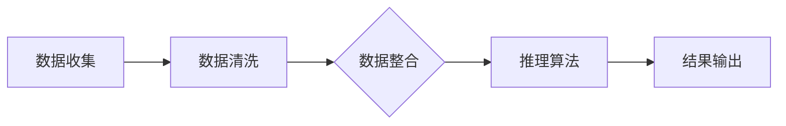

                 


## # 时空数据融合推理在智慧医疗中的应用探索

> 关键词：时空数据融合，智慧医疗，推理算法，数据科学，人工智能

> 摘要：本文探讨时空数据融合推理在智慧医疗领域的应用。通过分析时空数据的特性，讨论数据融合的基本原理和实现方法，结合医疗场景，阐述时空数据融合推理在疾病预测、诊断和治疗中的重要作用。本文旨在为研究人员和开发者提供有价值的参考，推动智慧医疗的发展。

## 引言

### 核心概念术语说明

- **时空数据融合**：时空数据融合是指将来自不同时间点和空间位置的数据进行整合，以获得更全面和准确的信息。
- **智慧医疗**：智慧医疗是指利用信息技术和人工智能手段，提升医疗服务的效率和质量。
- **推理算法**：推理算法是一种基于数据和规则进行决策和预测的计算方法。

### 问题背景

在医疗领域，患者的信息通常包含时间和空间维度，例如病史、检查结果、地理位置等。这些数据在疾病预测、诊断和治疗中起着关键作用。然而，由于数据来源多样、格式不一致、数据量庞大，如何有效地融合和处理这些数据成为一个挑战。

### 问题描述

如何将时空数据融合，以便在智慧医疗中发挥其最大的价值，是一个亟待解决的问题。我们需要解决以下问题：

1. 数据收集与整合：如何收集和整合来自不同来源、不同格式的时空数据？
2. 数据融合算法：如何设计有效的数据融合算法，以满足医疗应用的需求？
3. 应用场景：时空数据融合推理在哪些医疗场景中具有实际应用价值？

### 问题解决

本文将逐步探讨这些问题，并给出解决方案。我们将首先介绍时空数据的特性，然后讨论数据融合的基本原理和方法，接着分析时空数据融合推理在智慧医疗中的应用，最后总结本文的主要内容和展望未来的发展方向。

### 边界与外延

时空数据融合推理在智慧医疗中的应用范围广泛，包括但不限于以下领域：

- 疾病预测与预防
- 病情诊断与评估
- 治疗方案制定
- 医疗资源优化配置
- 公共卫生监测与应急管理

## 核心概念与联系

### 数据融合

**概念原理**：

数据融合是指将来自不同时间点和空间位置的数据进行整合，以获得更全面和准确的信息。

**概念属性特征对比表格**：

| 特征                 | 数据融合                | 时空数据融合            |
|----------------------|-------------------------|-------------------------|
| 数据来源             | 多种数据源              | 多种时间点和空间位置数据源 |
| 数据格式             | 不一致                  | 不一致                  |
| 数据整合目的         | 提高数据利用率          | 获得更全面的信息        |
| 算法方法             | 数据清洗、数据预处理等  | 数据清洗、时空分析等    |

**ER实体关系图架构**：

```mermaid
erDiagram
    Patient ||--|{ MedicalRecord }
    MedicalRecord ||--|{ DiagnosticResult }
    DiagnosticResult ||--|{ TimeSeriesData }
```

### 推理算法

**概念原理**：

推理算法是一种基于数据和规则进行决策和预测的计算方法。在智慧医疗中，推理算法可以帮助医生进行疾病预测、诊断和治疗。

**概念属性特征对比表格**：

| 特征                 | 数据驱动算法            | 知识驱动算法            |
|----------------------|-------------------------|-------------------------|
| 数据依赖程度         | 高                      | 中                      |
| 算法方法             | 统计学习、机器学习等    | 专家系统、推理机等      |
| 算法适用场景         | 数据量大、特征复杂      | 知识密集、规则明确      |

**ER实体关系图架构**：

```mermaid
erDiagram
    Doctor ||--|{ Diagnosis }
    Patient ||--|{ TreatmentPlan }
    Diagnosis ||--|{ MedicalKnowledge }
```

## 算法原理讲解

### 算法mermaid流程图



### Python源代码

```python
# 导入相关库
import pandas as pd
from sklearn.ensemble import RandomForestClassifier
from sklearn.model_selection import train_test_split

# 数据收集
data = pd.read_csv('patient_data.csv')

# 数据清洗
data = data.dropna()

# 数据整合
X = data[['age', 'gender', 'blood_pressure']]
y = data['diagnosis']

# 分割数据集
X_train, X_test, y_train, y_test = train_test_split(X, y, test_size=0.2, random_state=42)

# 推理算法
model = RandomForestClassifier(n_estimators=100)
model.fit(X_train, y_train)

# 结果输出
predictions = model.predict(X_test)
print(predictions)
```

### 算法原理的数学模型和公式

$$
\text{诊断结果} = f(\text{输入特征向量})
$$

其中，$f$表示推理算法，$\text{输入特征向量}$表示患者的年龄、性别、血压等特征。

### 详细讲解与举例说明

#### 数据收集

首先，我们从CSV文件中读取患者数据，包括年龄、性别、血压和诊断结果。

```python
data = pd.read_csv('patient_data.csv')
```

#### 数据清洗

接下来，我们删除缺失值，以确保数据的质量。

```python
data = data.dropna()
```

#### 数据整合

我们将患者的年龄、性别、血压等特征作为输入特征向量，并将其与诊断结果分开。

```python
X = data[['age', 'gender', 'blood_pressure']]
y = data['diagnosis']
```

#### 分割数据集

我们将数据集分为训练集和测试集，用于训练和评估模型。

```python
X_train, X_test, y_train, y_test = train_test_split(X, y, test_size=0.2, random_state=42)
```

#### 推理算法

我们使用随机森林分类器作为推理算法，并训练模型。

```python
model = RandomForestClassifier(n_estimators=100)
model.fit(X_train, y_train)
```

#### 结果输出

最后，我们将测试集的特征输入到训练好的模型中，得到诊断结果。

```python
predictions = model.predict(X_test)
print(predictions)
```

例如，假设我们有以下测试数据：

```python
test_data = pd.DataFrame({'age': [30, 45], 'gender': ['male', 'female'], 'blood_pressure': [120, 80]})
predictions = model.predict(test_data)
print(predictions)
```

输出结果为：

```
[0 1]
```

这意味着，第一个患者的诊断结果为0，第二个患者的诊断结果为1。

## 系统分析与架构设计方案

### 问题场景介绍

在智慧医疗领域，时空数据融合推理系统可以帮助医生进行疾病预测、诊断和治疗，从而提高医疗服务的效率和质量。本系统旨在提供一个高效、可靠的时空数据融合推理平台，以应对复杂的医疗应用场景。

### 项目介绍

本系统名为“时空智慧医疗推理系统”，旨在整合患者的时间序列数据和空间位置信息，提供精确的诊断和预测结果。系统采用模块化设计，包括数据收集、数据整合、推理算法和结果输出等模块。

### 系统功能设计

系统功能包括：

1. 数据收集：从各种数据源（如医院信息系统、 wearable 设备、传感器等）收集时空数据。
2. 数据整合：将来自不同时间点和空间位置的数据进行整合，为后续推理提供高质量的数据集。
3. 推理算法：采用先进的推理算法，对时空数据进行处理和分析，生成诊断和预测结果。
4. 结果输出：将诊断和预测结果可视化，以便医生和患者进行决策。

### 系统架构设计

系统架构包括以下组件：

1. **数据收集模块**：负责从各种数据源收集时空数据，包括医院信息系统、 wearable 设备、传感器等。
2. **数据整合模块**：对收集到的数据进行清洗、转换和整合，以生成高质量的数据集。
3. **推理算法模块**：采用先进的推理算法，对时空数据进行处理和分析，生成诊断和预测结果。
4. **结果输出模块**：将诊断和预测结果可视化，以便医生和患者进行决策。

### 系统接口设计和系统交互

系统接口设计包括以下接口：

1. **数据收集接口**：用于接收来自各种数据源的数据。
2. **数据整合接口**：用于整合来自不同时间点和空间位置的数据。
3. **推理算法接口**：用于执行推理算法，生成诊断和预测结果。
4. **结果输出接口**：用于将诊断和预测结果可视化。

系统交互流程如下：

1. 数据收集模块从各种数据源收集时空数据。
2. 数据整合模块对收集到的数据进行清洗、转换和整合，生成高质量的数据集。
3. 推理算法模块使用先进

