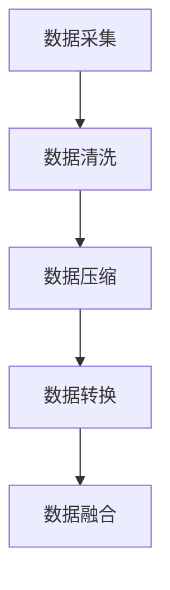
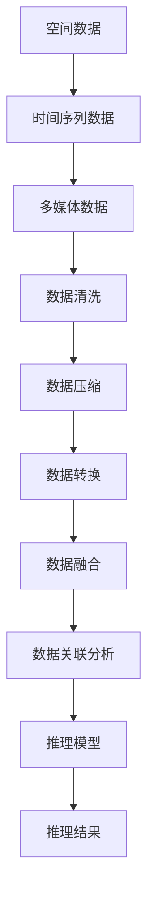
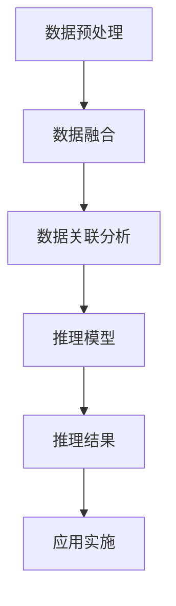
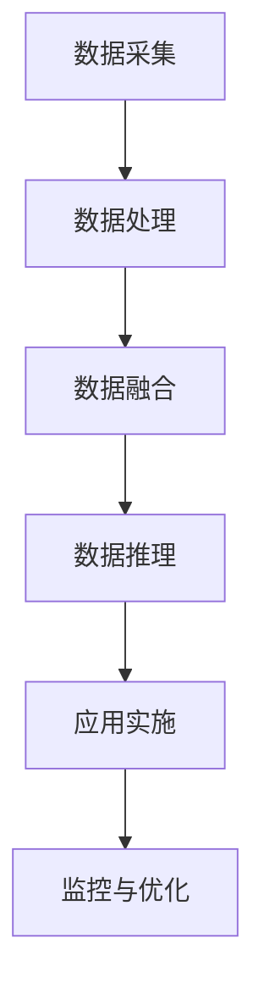

                 

### 1. 引言与背景

#### 问题背景

随着城市化进程的加速，智慧城市已成为未来城市发展的趋势。智慧城市通过整合各种数据资源，利用先进的信息技术，实现对城市运行状态的实时感知、智能决策和高效管理。然而，智慧城市建设过程中，面临着一系列挑战。

首先，城市规模的不断扩大和人口增长，导致城市管理和公共服务的需求日益增加。传统的城市管理模式已经无法满足现代城市的需求，需要借助新技术进行创新。

其次，城市数据量的爆炸式增长，带来了数据处理的挑战。智慧城市建设需要大量的时空数据，这些数据来源于不同的传感器、摄像头、物联网设备等，如何有效地采集、处理和利用这些数据，成为智慧城市建设的关键问题。

再次，不同来源、不同类型的数据之间存在着复杂的关系，如何对这些数据进行有效的融合，以提取有价值的信息，支持城市决策和优化资源配置，是智慧城市建设面临的另一个重要挑战。

#### 问题描述

智慧城市建设需要高效处理海量时空数据，并从中提取有价值的信息，以支持城市决策和优化资源配置。具体来说，问题描述可以分为以下几个方面：

1. **数据采集和处理**：如何高效地采集城市中的各种时空数据，包括交通流量、环境监测、公共安全等信息，并进行预处理，以消除噪声和异常值。

2. **数据融合**：如何将来自不同来源、不同类型的数据进行有效融合，形成一个统一的数据视图，以便更好地理解和分析城市运行状态。

3. **数据分析和推理**：如何利用融合后的数据进行深入分析，提取有价值的信息，支持城市决策和优化资源配置。

4. **应用实施**：如何将时空数据融合推理技术应用于实际场景，如城市交通管理、城市安全监控、城市环境监测等，以实现智慧城市的目标。

#### 问题解决

时空数据融合推理技术为智慧城市建设提供了一种有效的解决方案。该技术通过以下步骤实现：

1. **数据采集**：利用各种传感器和物联网设备，采集城市中的时空数据。

2. **数据处理**：对采集到的数据进行分析和处理，包括数据清洗、数据压缩和数据转换等，以提高数据的质量和可用性。

3. **数据融合**：采用多种数据融合方法，将不同来源、不同类型的数据进行融合，形成一个统一的数据视图。

4. **数据分析和推理**：利用数据分析和推理算法，对融合后的数据进行分析和推理，提取有价值的信息。

5. **应用实施**：将分析结果应用于实际场景，支持城市决策和优化资源配置。

#### 边界与外延

本章将讨论时空数据融合推理技术在智慧城市中的应用，包括数据采集、预处理、融合算法、推理模型以及应用案例分析。核心要素包括：

- **时空数据**：记录时间和空间位置及相关属性的数据。
- **数据融合方法**：包括基于统计、人工智能和模型的方法。
- **推理算法**：包括逻辑推理、概率推理和人工智能推理。
- **智慧城市建设需求**：如城市交通管理、城市安全监控、城市环境监测等。

### 2. 时空数据概述

#### 时空数据的定义

时空数据是记录时间、空间位置及相关属性的数据。它包括以下基本要素：

- **时间**：表示数据发生的时间。
- **空间**：表示数据发生的地理位置。
- **属性**：表示数据的其他相关信息，如温度、湿度、交通流量等。

时空数据可以用于描述事件、物体或现象的时空分布特征，如交通流量、空气质量、降雨量等。时空数据的特性包括动态性、多样性和时空关联性。

#### 时空数据类型

1. **空间数据**：记录空间位置及其属性的数据，如地图数据、GPS数据等。
2. **时间序列数据**：记录随时间变化的数值数据，如温度变化、交通流量变化等。
3. **多媒体数据**：包括图像、音频、视频等多媒体形式的数据。

#### 时空数据特性

1. **动态性**：时空数据随时间不断变化，反映了城市运行状态的动态变化。
2. **多样性**：时空数据来源广泛，包括传感器、摄像头、物联网设备等，数据类型多样。
3. **时空关联性**：不同时空数据之间存在复杂的关联关系，如交通流量与空气质量的关系、人口密度与犯罪率的关系等。

#### 时空数据采集与处理

1. **数据采集技术**：

- **GPS**：利用全球定位系统，获取地理位置信息。
- **遥感**：利用卫星遥感技术，获取大范围的地表信息。
- **物联网**：利用物联网设备，实时采集各类时空数据。

2. **数据处理方法**：

- **数据清洗**：去除数据中的噪声和异常值，提高数据质量。
- **数据压缩**：减少数据存储空间，提高数据传输效率。
- **数据转换**：将不同格式的数据进行统一转换，便于后续处理。

#### 数据融合方法

1. **数据融合原则**：

- **一致性**：保证融合后数据的一致性，减少误差。
- **准确性**：保证融合后数据的准确性，提高可靠性。
- **时效性**：保证融合后数据的时效性，及时反映城市运行状态。

2. **数据融合算法**：

- **基于统计的方法**：如均值融合、中值融合等，适用于简单场景。
- **基于人工智能的方法**：如深度学习、神经网络等，适用于复杂场景。
- **基于模型的方法**：如贝叶斯网络、马尔可夫模型等，适用于具有明确时空关系的数据。

### 3. 时空数据融合基础

#### 时空数据采集与处理

1. **数据采集技术**：

- **GPS**：利用全球定位系统，获取地理位置信息。
- **遥感**：利用卫星遥感技术，获取大范围的地表信息。
- **物联网**：利用物联网设备，实时采集各类时空数据。

2. **数据处理方法**：

- **数据清洗**：去除数据中的噪声和异常值，提高数据质量。
- **数据压缩**：减少数据存储空间，提高数据传输效率。
- **数据转换**：将不同格式的数据进行统一转换，便于后续处理。

#### 数据融合方法

1. **数据融合原则**：

- **一致性**：保证融合后数据的一致性，减少误差。
- **准确性**：保证融合后数据的准确性，提高可靠性。
- **时效性**：保证融合后数据的时效性，及时反映城市运行状态。

2. **数据融合算法**：

- **基于统计的方法**：如均值融合、中值融合等，适用于简单场景。
- **基于人工智能的方法**：如深度学习、神经网络等，适用于复杂场景。
- **基于模型的方法**：如贝叶斯网络、马尔可夫模型等，适用于具有明确时空关系的数据。

#### 数据关联分析

1. **关联规则挖掘**：

- **Apriori算法**：基于支持度和置信度的关联规则挖掘算法。
- **FP-Growth算法**：基于压缩数据结构的关联规则挖掘算法，适用于大数据集。

2. **社会网络分析**：

- **矩阵分解**：通过矩阵分解，提取社会网络中的隐藏关系。
- **图论方法**：利用图结构分析社会网络中的关系和模式。

#### 推理模型

1. **逻辑推理**：

- **命题逻辑**：基于命题和命题逻辑推理的算法。
- **谓词逻辑**：基于谓词和谓词逻辑推理的算法。

2. **概率推理**：

- **贝叶斯网络**：基于概率模型的推理方法，适用于不确定环境。
- **马尔可夫模型**：基于状态转移概率的推理方法，适用于序列数据。

3. **人工智能推理**：

- **深度学习**：基于神经网络的学习方法，适用于复杂模式识别。
- **强化学习**：基于奖励机制的学习方法，适用于决策问题。

#### 算法mermaid流程图

1. **数据预处理流程**：

2. **数据融合流程**：

3. **推理过程流程**：

### 4. 应用案例分析

#### 城市交通管理

1. **交通流量预测**：

- 使用时空数据融合推理技术，预测城市中的交通流量。
- 利用融合后的数据，优化交通信号控制，提高交通效率。

2. **公共交通优化**：

- 基于乘客流量预测，优化公交线路和站点设置。
- 提高公共交通的运行效率，满足乘客需求。

#### 城市安全监控

1. **犯罪预测**：

- 使用时空数据融合推理技术，预测城市中的犯罪热点。
- 优化警力部署，提高城市安全水平。

2. **突发事件响应**：

- 基于时空数据，快速定位突发事件。
- 制定应急措施，提高应对突发事件的效率。

#### 城市环境监测

1. **空气质量预测**：

- 使用时空数据融合推理技术，预测城市中的空气质量。
- 优化环保措施，提高空气质量。

2. **水资源管理**：

- 基于时空数据，优化水资源分配。
- 提高水资源利用效率，保障城市用水安全。

### 5. 系统设计与实现

#### 系统架构设计

1. **系统功能设计**：

- 数据采集与处理
- 数据融合与推理
- 应用实施与监控

2. **系统架构设计**：

3. **系统接口设计**：

- **数据接口**：定义数据输入和输出的格式和协议。
- **服务接口**：定义系统内部模块之间的交互接口。

#### 系统核心实现

1. **环境安装**：

- 安装Python、NumPy、Pandas、Scikit-learn等必要的软件和工具。

2. **源代码实现**：

- **数据预处理模块**：实现数据清洗、数据压缩、数据转换等功能。
- **数据融合模块**：实现基于统计、人工智能和模型的数据融合算法。
- **推理模块**：实现数据关联分析、逻辑推理、概率推理和人工智能推理算法。

3. **代码应用解读与分析**：

- 解释代码实现过程，分析代码优缺点。
- 提供实际案例，展示算法在实际应用中的效果。

### 6. 项目实战

#### 实际案例剖析

1. **案例背景**：

- 选择一个具体的城市交通管理案例，介绍案例的背景和目标。

2. **数据准备**：

- 采集城市中的交通流量数据，进行数据清洗和预处理。

3. **模型训练与评估**：

- 使用时空数据融合推理技术，构建交通流量预测模型。
- 训练模型，评估模型性能。

#### 项目小结

1. **项目总结**：

- 总结项目中的成功经验和挑战。

2. **改进方向**：

- 提出项目改进建议和未来研究方向。

### 7. 最佳实践与拓展

#### 最佳实践

1. **技巧与技巧**：

- 分享实战中的经验和技巧。

2. **案例分析**：

- 讨论成功的时空数据融合推理应用案例。

#### 拓展阅读

1. **最新研究进展**：

- 介绍时空数据融合推理的最新研究成果。

2. **未来发展**：

- 探讨时空数据融合推理技术在智慧城市中的应用前景。

### 8. 参考文献

- [参考文献列表]

---

**作者**：AI天才研究院/AI Genius Institute & 禅与计算机程序设计艺术 /Zen And The Art of Computer Programming

---

**注意事项**：

- 请确保文章内容完整、逻辑清晰，每个小节的内容都要具体详细讲解。
- 核心内容要包含背景介绍、核心概念与联系、算法原理讲解、系统分析与架构设计方案、项目实战等内容。
- 文章中使用的mermaid流程图、Python源代码和LaTeX公式要符合markdown格式要求。
- 注意控制文章字数，保持在10000-12000字左右。

**拓展阅读**：

- [相关领域的权威书籍和论文]
- [智慧城市相关的最新研究报告和文章]

