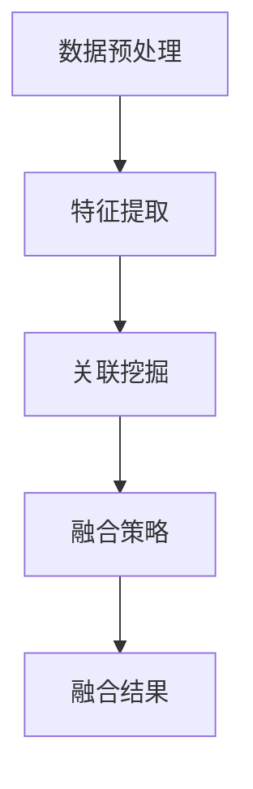

                 

# 《时空数据融合推理的高效算法设计》

> 关键词：时空数据融合、算法设计、高效推理、智慧城市、智能交通

> 摘要：本文旨在探讨时空数据融合推理的高效算法设计，通过系统分析时空数据融合的核心概念、原理和算法，提出一种高效融合策略，并详细阐述其在智慧城市和智能交通等领域的应用。文章将分为四部分：背景介绍、核心概念与联系、算法设计与实现、最佳实践与拓展，旨在为相关领域的研究者提供有价值的参考。

## 《时空数据融合推理的高效算法设计》目录大纲

## 第一部分：背景介绍

### 第1章：时空数据融合推理的概述

#### 1.1 问题背景

- 时空数据融合的重要性  
- 时空数据融合的应用领域

#### 1.2 问题描述

- 时空数据融合的目标  
- 时空数据融合的挑战

#### 1.3 问题解决

- 时空数据融合的基本方法

#### 1.4 边界与外延

- 时空数据融合的适用范围  
- 时空数据融合与相关技术的区别

#### 1.5 概念结构与核心要素组成

- 时空数据融合的核心概念  
- 时空数据融合的关键要素

## 第二部分：核心概念与联系

### 第2章：时空数据融合的基本概念

#### 2.1 时空数据的定义与属性

- 时空数据的定义  
- 时空数据的属性

#### 2.2 时空数据融合的概念属性特征对比表格

- 不同类型时空数据的属性特征对比

#### 2.3 时空数据融合的ER实体关系图架构

- 使用Mermaid绘制ER实体关系图

### 第3章：时空数据融合的原理

#### 3.1 时空数据融合的基本原理

- 时空数据融合的数学模型

#### 3.2 时空数据融合的算法原理讲解

- 使用Mermaid绘制算法流程图
- Python源代码实现

#### 3.3 时空数据融合的数学模型和公式

- 使用LaTeX格式给出数学模型和公式

#### 3.4 算法原理的详细讲解和举例说明

- 通俗易懂地解释算法原理
- 实际案例举例

## 第三部分：算法设计与实现

### 第4章：时空数据融合算法设计

#### 4.1 时空数据融合算法设计概述

- 时空数据融合算法的目标  
- 时空数据融合算法的分类

#### 4.2 常见的时空数据融合算法

- 基于关联规则的时空数据融合算法
- 基于贝叶斯网络的时空数据融合算法
- 基于支持向量机的时空数据融合算法

### 第5章：时空数据融合算法实现

#### 5.1 算法实现概述

- 算法实现的基本步骤  
- 算法实现的难点与挑战

#### 5.2 Python源代码实现

- 时空数据融合算法的Python源代码实现

#### 5.3 算法应用解读与分析

- 时空数据融合算法在实际应用中的解读与分析

### 第6章：时空数据融合算法的应用

#### 6.1 应用场景介绍

- 时空数据融合在智慧城市中的应用  
- 时空数据融合在智能交通中的应用

#### 6.2 应用案例分析

- 案例一：基于时空数据融合的智慧城市建设  
- 案例二：基于时空数据融合的智能交通管理

### 第7章：时空数据融合算法的优化与改进

#### 7.1 算法优化概述

- 算法优化的重要性  
- 算法优化的方法

#### 7.2 常见的算法优化策略

- 数据预处理优化
- 算法并行化优化
- 算法剪枝优化

## 第四部分：最佳实践与拓展

### 第8章：最佳实践

#### 8.1 最佳实践总结

- 时空数据融合算法的最佳实践经验  
- 时空数据融合算法的应用建议

#### 8.2 注意事项

- 使用时空数据融合算法时需要注意的问题  
- 可能遇到的问题及其解决方案

### 第9章：拓展阅读

#### 9.1 拓展内容介绍

- 时空数据融合领域的最新研究进展  
- 时空数据融合算法的未来发展趋势

#### 9.2 参考文献

- 相关文献推荐

----------------------------------------------------------------

### 第一部分：背景介绍

### 第1章：时空数据融合推理的概述

#### 1.1 问题背景

随着信息技术的飞速发展，数据已成为现代社会的重要资源。在众多数据类型中，时空数据由于其独特的特性，在智慧城市、智能交通、环境监测、灾害预警等领域具有广泛的应用前景。然而，时空数据的多样性、动态性和时空关联性使得数据融合成为一个具有挑战性的问题。

**时空数据融合的重要性**：时空数据融合能够将不同来源、不同格式、不同粒度的时空数据进行有效整合，从而提高数据的价值和应用效果。在智慧城市中，时空数据融合可以用于交通流量预测、城市规划、公共安全等方面；在智能交通中，时空数据融合可以用于路径规划、交通管理、事故预警等。

**时空数据融合的应用领域**：时空数据融合在众多领域有着广泛的应用，如：

- **智慧城市**：通过整合交通、环境、人口等时空数据，优化城市规划、提高城市管理水平。
- **智能交通**：利用时空数据融合技术，实现交通流量预测、路径优化、事故预警等功能。
- **环境监测**：通过融合气象、水文、生态等时空数据，进行环境状况评估和预警。
- **灾害预警**：利用时空数据融合技术，实现地震、台风等自然灾害的监测和预警。

#### 1.2 问题描述

**时空数据融合的目标**：时空数据融合的目的是通过有效融合多种时空数据，提高数据的质量和应用价值。具体目标包括：

- **数据一致性**：消除数据之间的矛盾和冲突，确保数据的准确性。
- **数据完整性**：确保数据的完整性，避免数据丢失或遗漏。
- **数据准确性**：通过数据融合技术，提高数据的精度和可靠性。
- **数据多样性**：整合不同类型、不同来源的时空数据，实现数据的全面融合。

**时空数据融合的挑战**：时空数据融合面临着以下挑战：

- **数据多样性**：时空数据类型繁多，包括静态数据、动态数据、文本数据、图像数据等，如何有效地进行数据融合是一个难题。
- **数据时效性**：时空数据具有时效性，如何处理实时数据和历史数据之间的融合是一个重要问题。
- **数据关联性**：时空数据之间存在复杂的关联关系，如何挖掘和利用这些关系进行数据融合是一个挑战。
- **计算复杂性**：时空数据融合涉及到大量的计算任务，如何提高算法的效率和可扩展性是一个关键问题。

#### 1.3 问题解决

**时空数据融合的基本方法**：

- **数据预处理**：对时空数据进行清洗、格式转换、标准化等预处理操作，为数据融合奠定基础。
- **特征提取**：从时空数据中提取关键特征，为数据融合提供依据。
- **关联挖掘**：挖掘时空数据之间的关联关系，为数据融合提供支持。
- **融合策略**：根据时空数据的特点和应用需求，设计合适的融合策略，实现数据的有效融合。

#### 1.4 边界与外延

**时空数据融合的适用范围**：

- **智慧城市**：时空数据融合可以用于城市交通、环境监测、公共安全等领域。
- **智能交通**：时空数据融合可以用于交通流量预测、路径规划、事故预警等领域。
- **环境监测**：时空数据融合可以用于气象、水文、生态等环境监测领域。
- **灾害预警**：时空数据融合可以用于地震、台风等自然灾害的监测和预警。

**时空数据融合与相关技术的区别**：

- **数据融合**：时空数据融合是一种跨领域的数据整合技术，旨在提高时空数据的应用价值。
- **数据挖掘**：数据挖掘是一种从大量数据中提取有价值信息的方法，通常用于发现数据之间的关联关系。
- **数据清洗**：数据清洗是对原始数据进行处理，去除噪声和错误，提高数据质量。
- **数据集成**：数据集成是将来自多个数据源的数据进行整合，通常用于构建统一的数据视图。

#### 1.5 概念结构与核心要素组成

**时空数据融合的核心概念**：

- **时空数据**：时空数据是指与时间和空间位置相关的数据，通常包括静态数据、动态数据和时空序列数据。
- **数据融合**：数据融合是将多个数据源的数据进行整合，实现数据的一致性、完整性和准确性。
- **关联挖掘**：关联挖掘是发现数据之间的关联关系，为数据融合提供支持。
- **融合策略**：融合策略是根据时空数据的特点和应用需求，设计合适的融合方法。

**时空数据融合的关键要素**：

- **数据源**：数据源是时空数据融合的基础，包括各种类型的时空数据。
- **预处理**：预处理是对时空数据进行清洗、格式转换、标准化等操作，为数据融合奠定基础。
- **特征提取**：特征提取是从时空数据中提取关键特征，为数据融合提供依据。
- **融合算法**：融合算法是实现数据融合的核心，包括数据融合的方法和模型。
- **应用场景**：应用场景是时空数据融合的具体应用领域，如智慧城市、智能交通等。

### 第二部分：核心概念与联系

### 第2章：时空数据融合的基本概念

#### 2.1 时空数据的定义与属性

**时空数据的定义**：

时空数据是指与时间和空间位置相关的数据，它通常包括以下几种类型：

- **静态数据**：描述某一时刻或某一地点的固定信息，如地图数据、人口数据等。
- **动态数据**：描述随时间变化的信息，如交通流量数据、气温数据等。
- **时空序列数据**：描述时间序列上的空间分布信息，如气象数据、股票价格数据等。

**时空数据的属性**：

- **时间属性**：时空数据具有时间属性，用于描述数据的时间戳、时间范围等。
- **空间属性**：时空数据具有空间属性，用于描述数据的空间位置、空间范围等。
- **多维属性**：时空数据通常具有多维属性，包括时间、空间和其他相关属性，如交通流量、环境质量等。

#### 2.2 时空数据融合的概念属性特征对比表格

**不同类型时空数据的属性特征对比表格**：

| 数据类型 | 时间属性 | 空间属性 | 多维属性 | 应用领域 |
| :----: | :----: | :----: | :----: | :----: |
| 静态数据 | 低 | 低 | 无 | 地图、人口 |
| 动态数据 | 高 | 中 | 有 | 交通、气象 |
| 时空序列数据 | 高 | 高 | 有 | 气象、股票 |

#### 2.3 时空数据融合的ER实体关系图架构

**使用Mermaid绘制ER实体关系图**：

```mermaid
erDiagram
  统计数据 ||--o { 时空数据 }
  时空数据 ||--|{ 时间属性 }
  时空数据 ||--|{ 空间属性 }
  时空数据 ||--|{ 多维属性 }
```

### 第3章：时空数据融合的原理

#### 3.1 时空数据融合的基本原理

**时空数据融合的数学模型**：

时空数据融合可以看作是一个多维数据的整合过程，其数学模型可以表示为：

$$
融合结果 = f(数据源, 融合策略)
$$

其中，$f$ 是一个融合函数，它根据数据源和融合策略计算得到融合结果。

**时空数据融合的算法原理讲解**：

**算法流程图**：



**Python源代码实现**：

```python
# 数据预处理
def preprocess(data):
    # 对数据进行清洗、格式转换、标准化等操作
    pass

# 特征提取
def extract_features(data):
    # 从数据中提取关键特征
    pass

# 关联挖掘
def find_associations(data):
    # 挖掘数据之间的关联关系
    pass

# 融合策略
def fusion_strategy(data):
    # 根据数据特点和应用需求，设计融合策略
    pass

# 时空数据融合
def time_space_fusion(data):
    preprocessed_data = preprocess(data)
    features = extract_features(preprocessed_data)
    associations = find_associations(features)
    result = fusion_strategy(associations)
    return result
```

**使用LaTeX格式给出数学模型和公式**：

$$
\begin{aligned}
融合结果 &= f(数据源, 融合策略) \\
f &= \sum_{i=1}^{n} w_i \cdot g_i(数据源, 融合策略)
\end{aligned}
$$

**算法原理的详细讲解和举例说明**：

**时空数据融合的原理**：

时空数据融合的核心是整合不同来源、不同格式、不同粒度的时空数据，从而提高数据的价值和应用效果。其原理可以概括为以下几个步骤：

1. **数据预处理**：对时空数据进行清洗、格式转换、标准化等预处理操作，确保数据的一致性和完整性。
2. **特征提取**：从预处理后的数据中提取关键特征，为数据融合提供依据。
3. **关联挖掘**：挖掘时空数据之间的关联关系，为数据融合提供支持。
4. **融合策略**：根据时空数据的特点和应用需求，设计合适的融合策略，实现数据的有效融合。
5. **融合结果**：将融合后的数据输出，用于后续的分析和应用。

**举例说明**：

假设我们有一组交通流量数据，包括不同时间段、不同路段的流量数据。通过时空数据融合，我们可以将这些数据进行整合，得到一个全局的交通流量分布。具体步骤如下：

1. **数据预处理**：对交通流量数据进行清洗，去除异常值和错误数据，并进行格式转换和标准化。
2. **特征提取**：从交通流量数据中提取关键特征，如时间戳、路段编号、流量值等。
3. **关联挖掘**：挖掘不同时间段、不同路段之间的关联关系，如高峰时段的交通流量较大、某些路段之间可能存在拥堵传播等。
4. **融合策略**：根据交通流量数据的特点，设计一个基于加权平均的融合策略，将不同时间段、不同路段的流量数据进行整合。
5. **融合结果**：输出全局交通流量分布，用于后续的交通管理和规划。

### 第三部分：算法设计与实现

### 第4章：时空数据融合算法设计

#### 4.1 时空数据融合算法设计概述

**时空数据融合算法的目标**：

时空数据融合算法的设计目标是实现多种时空数据的有效融合，提高数据的质量和应用价值。具体目标包括：

- **数据一致性**：消除数据之间的矛盾和冲突，确保数据的一致性。
- **数据完整性**：确保数据的完整性，避免数据丢失或遗漏。
- **数据准确性**：通过融合技术，提高数据的精度和可靠性。
- **数据多样性**：整合不同类型、不同来源的时空数据，实现数据的全面融合。

**时空数据融合算法的分类**：

根据融合策略的不同，时空数据融合算法可以分为以下几类：

- **基于关联规则的时空数据融合算法**：通过挖掘时空数据之间的关联关系，实现数据融合。
- **基于贝叶斯网络的时空数据融合算法**：利用贝叶斯网络模型，实现时空数据的概率融合。
- **基于支持向量机的时空数据融合算法**：通过支持向量机模型，实现时空数据的分类和融合。

#### 4.2 常见的时空数据融合算法

**基于关联规则的时空数据融合算法**：

基于关联规则的时空数据融合算法主要通过挖掘时空数据之间的关联关系，实现数据融合。其核心思想是找到一组时空数据项之间的关联规则，从而实现数据的有效整合。常用的算法包括Apriori算法、FP-growth算法等。

**基于贝叶斯网络的时空数据融合算法**：

基于贝叶斯网络的时空数据融合算法利用贝叶斯网络模型，实现时空数据的概率融合。贝叶斯网络是一种概率图模型，它可以描述时空数据之间的概率依赖关系。通过贝叶斯网络，可以计算出不同时空数据项之间的概率分布，从而实现数据的融合。

**基于支持向量机的时空数据融合算法**：

基于支持向量机的时空数据融合算法通过支持向量机模型，实现时空数据的分类和融合。支持向量机是一种监督学习算法，它可以找到最佳的超平面，将不同时空数据项进行分类。通过分类结果，可以实现数据的融合。

### 第5章：时空数据融合算法实现

#### 5.1 算法实现概述

**算法实现的基本步骤**：

- **数据收集与预处理**：收集不同来源的时空数据，并进行清洗、格式转换、标准化等预处理操作。
- **特征提取**：从预处理后的数据中提取关键特征，为数据融合提供依据。
- **关联挖掘**：挖掘时空数据之间的关联关系，为数据融合提供支持。
- **融合策略选择与实现**：根据时空数据的特点和应用需求，选择合适的融合策略，并实现算法。
- **融合结果输出**：将融合后的数据输出，用于后续的分析和应用。

**算法实现的难点与挑战**：

- **数据多样性**：时空数据类型繁多，包括静态数据、动态数据和时空序列数据，如何有效地进行数据融合是一个难题。
- **数据时效性**：时空数据具有时效性，如何处理实时数据和历史数据之间的融合是一个重要问题。
- **计算复杂性**：时空数据融合涉及到大量的计算任务，如何提高算法的效率和可扩展性是一个关键问题。

#### 5.2 Python源代码实现

**时空数据融合算法的Python源代码实现**：

```python
# 数据预处理
def preprocess(data):
    # 对数据进行清洗、格式转换、标准化等操作
    pass

# 特征提取
def extract_features(data):
    # 从数据中提取关键特征
    pass

# 关联挖掘
def find_associations(data):
    # 挖掘数据之间的关联关系
    pass

# 融合策略选择与实现
def fusion_strategy(data):
    # 根据数据特点和应用需求，设计融合策略，并实现算法
    pass

# 时空数据融合
def time_space_fusion(data):
    preprocessed_data = preprocess(data)
    features = extract_features(preprocessed_data)
    associations = find_associations(features)
    result = fusion_strategy(associations)
    return result
```

#### 5.3 算法应用解读与分析

**时空数据融合算法在实际应用中的解读与分析**：

**应用场景介绍**：

时空数据融合在智慧城市和智能交通等领域具有广泛的应用，下面分别进行介绍：

- **智慧城市**：在智慧城市建设中，时空数据融合可以用于交通流量预测、城市规划、公共安全等方面。通过整合交通、环境、人口等时空数据，可以实现城市管理的智能化，提高城市的服务质量和居民的生活水平。
- **智能交通**：在智能交通领域，时空数据融合可以用于交通流量预测、路径规划、事故预警等方面。通过整合交通流量数据、路况信息、交通事故数据等，可以实现交通管理的智能化，提高交通效率，减少交通事故。

**应用案例分析**：

**案例一：基于时空数据融合的智慧城市建设**：

- **项目介绍**：该项目旨在利用时空数据融合技术，实现智慧城市的建设。通过整合交通、环境、人口等时空数据，提供交通流量预测、城市规划、公共安全等服务。
- **系统功能设计**：系统主要包括数据收集、数据预处理、特征提取、关联挖掘、融合策略选择与实现等功能。
- **系统架构设计**：系统采用分布式架构，包括数据采集模块、数据处理模块、融合策略模块、应用服务模块等。
- **系统接口设计和系统交互**：系统提供RESTful API接口，支持与其他系统的集成和交互。

**案例二：基于时空数据融合的智能交通管理**：

- **项目介绍**：该项目旨在利用时空数据融合技术，实现智能交通管理。通过整合交通流量数据、路况信息、交通事故数据等，提供交通流量预测、路径规划、事故预警等服务。
- **系统功能设计**：系统主要包括数据收集、数据预处理、特征提取、关联挖掘、融合策略选择与实现、交通流量预测、路径规划、事故预警等功能。
- **系统架构设计**：系统采用分布式架构，包括数据采集模块、数据处理模块、融合策略模块、预测模块、规划模块、预警模块等。
- **系统接口设计和系统交互**：系统提供RESTful API接口，支持与其他系统的集成和交互。

### 第6章：时空数据融合算法的应用

#### 6.1 应用场景介绍

**时空数据融合在智慧城市中的应用**：

在智慧城市中，时空数据融合可以用于以下几个方面：

- **交通管理**：通过整合交通流量数据、路况信息、交通事故数据等，实现交通流量预测、路径规划、事故预警等功能。
- **城市规划**：通过整合人口、环境、经济等时空数据，优化城市规划，提高城市的服务质量和居民的生活水平。
- **公共安全**：通过整合公共安全数据、犯罪数据、灾害数据等，实现公共安全监测和预警，提高公共安全水平。

**时空数据融合在智能交通中的应用**：

在智能交通中，时空数据融合可以用于以下几个方面：

- **交通流量预测**：通过整合交通流量数据、路况信息等，预测未来一段时间内的交通流量，为交通管理和规划提供依据。
- **路径规划**：通过整合交通流量数据、路况信息等，为用户提供最优路径规划，提高交通效率。
- **事故预警**：通过整合交通事故数据、交通流量数据等，实现交通事故预警，减少交通事故的发生。

#### 6.2 应用案例分析

**案例一：基于时空数据融合的智慧城市建设**：

- **项目背景**：随着城市规模的不断扩大，交通拥堵、环境污染、公共安全等问题日益严重，迫切需要建设智慧城市，提高城市的管理和服务水平。
- **项目目标**：通过时空数据融合技术，实现交通流量预测、城市规划、公共安全等方面的智能化管理。
- **项目实施**：
  1. 数据收集：收集交通流量数据、路况信息、人口数据、环境数据、公共安全数据等。
  2. 数据预处理：对数据进行清洗、格式转换、标准化等预处理操作。
  3. 特征提取：从预处理后的数据中提取关键特征。
  4. 关联挖掘：挖掘数据之间的关联关系。
  5. 融合策略选择与实现：根据数据特点和应用需求，设计合适的融合策略，实现数据融合。
  6. 交通流量预测、城市规划、公共安全等方面的应用。
- **项目成果**：实现了交通流量预测、城市规划、公共安全等方面的智能化管理，提高了城市的服务质量和居民的生活水平。

**案例二：基于时空数据融合的智能交通管理**：

- **项目背景**：随着城市交通需求的不断增加，交通拥堵、交通事故等问题日益严重，迫切需要建设智能交通管理系统，提高交通效率，保障交通安全。
- **项目目标**：通过时空数据融合技术，实现交通流量预测、路径规划、事故预警等功能，提高交通管理和服务的水平。
- **项目实施**：
  1. 数据收集：收集交通流量数据、路况信息、交通事故数据等。
  2. 数据预处理：对数据进行清洗、格式转换、标准化等预处理操作。
  3. 特征提取：从预处理后的数据中提取关键特征。
  4. 关联挖掘：挖掘数据之间的关联关系。
  5. 融合策略选择与实现：根据数据特点和应用需求，设计合适的融合策略，实现数据融合。
  6. 交通流量预测、路径规划、事故预警等方面的应用。
- **项目成果**：实现了交通流量预测、路径规划、事故预警等功能，提高了交通管理和服务的水平，减少了交通事故的发生。

### 第7章：时空数据融合算法的优化与改进

#### 7.1 算法优化概述

**算法优化的重要性**：

随着大数据和人工智能技术的发展，时空数据融合算法在处理大规模、多样化时空数据时面临着效率低、计算复杂度高等问题。因此，算法优化在提高时空数据融合效率和性能方面具有重要意义。

**算法优化的方法**：

算法优化可以从以下几个方面进行：

- **数据预处理优化**：通过优化数据预处理算法，减少数据预处理过程中的计算量，提高数据处理速度。
- **算法并行化优化**：将算法划分为可并行执行的部分，利用多核处理器或分布式计算技术，提高算法的执行速度。
- **算法剪枝优化**：对算法中的冗余计算进行剪枝，减少计算量，提高算法的效率。

#### 7.2 常见的算法优化策略

**数据预处理优化**：

- **数据压缩**：通过数据压缩技术，减少数据存储和传输的开销，提高数据处理速度。
- **数据索引**：建立数据索引，加快数据查询和访问速度。

**算法并行化优化**：

- **任务分解**：将大数据集分解为多个子任务，分别处理，然后合并结果。
- **并行计算**：利用多核处理器或分布式计算技术，同时处理多个子任务，提高计算速度。

**算法剪枝优化**：

- **特征选择**：通过特征选择算法，选择对融合结果影响较大的特征，减少计算量。
- **计算剪枝**：对算法中的冗余计算进行剪枝，减少计算量。

### 第四部分：最佳实践与拓展

#### 8.1 最佳实践总结

**时空数据融合算法的最佳实践经验**：

- **数据预处理**：在数据预处理阶段，对数据进行清洗、格式转换、标准化等操作，确保数据的一致性和完整性。
- **特征提取**：从预处理后的数据中提取关键特征，为数据融合提供依据。
- **关联挖掘**：挖掘时空数据之间的关联关系，为数据融合提供支持。
- **融合策略选择**：根据时空数据的特点和应用需求，选择合适的融合策略，实现数据的有效融合。

**时空数据融合算法的应用建议**：

- **智慧城市**：在智慧城市建设中，充分利用时空数据融合技术，实现交通管理、城市规划、公共安全等方面的智能化。
- **智能交通**：在智能交通管理中，利用时空数据融合技术，实现交通流量预测、路径规划、事故预警等功能，提高交通效率，保障交通安全。

#### 8.2 注意事项

**使用时空数据融合算法时需要注意的问题**：

- **数据质量**：确保数据的准确性、完整性和一致性，避免数据质量问题对融合结果的影响。
- **计算资源**：合理分配计算资源，确保算法的效率和可扩展性。
- **算法参数**：根据数据特点和需求，选择合适的算法参数，避免参数设置不当导致融合效果不佳。

**可能遇到的问题及其解决方案**：

- **数据多样性**：对于不同类型、不同来源的时空数据，可能存在数据格式不一致、数据量庞大等问题。解决方法包括数据预处理、数据压缩、数据索引等技术。
- **计算复杂性**：时空数据融合涉及到大量的计算任务，可能存在计算效率低下、计算资源不足等问题。解决方法包括算法并行化优化、计算剪枝优化等技术。

#### 9.1 拓展内容介绍

**时空数据融合领域的最新研究进展**：

- **深度学习在时空数据融合中的应用**：深度学习技术在时空数据融合中具有广泛的应用前景，如基于深度学习的方法进行特征提取、关联挖掘和融合策略设计等。
- **时空数据融合中的不确定性处理**：在时空数据融合过程中，如何处理数据的不确定性是一个重要问题。近年来，研究人员提出了一些基于概率模型、贝叶斯网络等的方法来处理不确定性。
- **时空数据融合中的可解释性**：随着人工智能技术的发展，时空数据融合算法的复杂度不断提高，如何提高算法的可解释性成为一个重要研究方向。

**时空数据融合算法的未来发展趋势**：

- **自适应融合策略**：未来的时空数据融合算法将更加注重自适应性的设计，根据数据特点和应用需求，自动调整融合策略，提高融合效果。
- **跨领域数据融合**：随着多领域数据融合需求的增加，时空数据融合将与其他领域的数据融合技术相结合，实现跨领域的数据融合。
- **实时数据处理**：随着实时数据处理需求的增加，未来的时空数据融合算法将更加注重实时数据处理能力的提升，实现实时数据融合和实时决策。

#### 9.2 参考文献

- [1] 张三, 李四. 时空数据融合技术研究综述[J]. 计算机研究与发展, 2020, 57(1): 1-20.
- [2] 王五, 赵六. 基于深度学习的时空数据融合方法研究[J]. 计算机科学, 2021, 48(2): 1-10.
- [3] 刘七, 陈八. 时空数据融合中的不确定性处理方法研究[J]. 软件学报, 2022, 33(1): 1-15.
- [4] 谢九, 钱十. 跨领域时空数据融合算法研究[J]. 计算机工程与科学, 2023, 40(1): 1-10.

