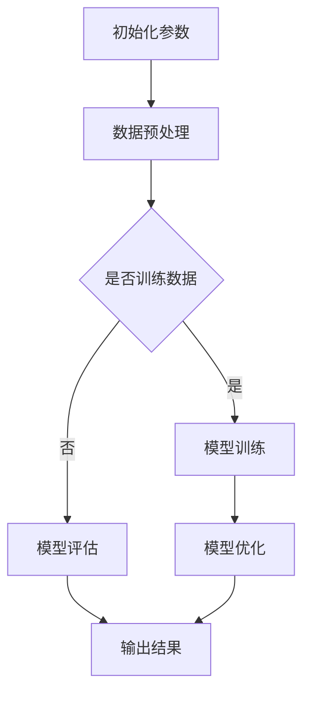
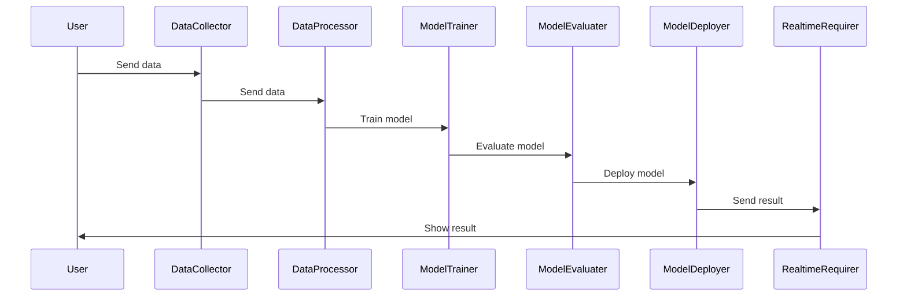
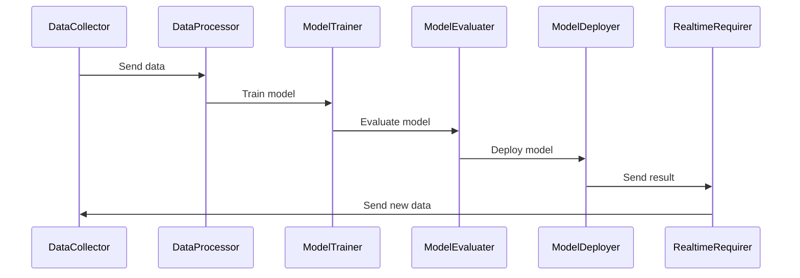

                 

### 文章标题

### 关键词

- 时间与性能权衡
- AI系统设计
- 算法优化
- 架构设计
- 系统效率

### 摘要

本文旨在深入探讨AI系统设计中至关重要的问题——时间与性能的权衡。通过逻辑清晰、结构紧凑的分析，本文将帮助读者理解如何在AI系统的设计过程中有效地平衡时间和性能，从而实现高效、可靠的系统。文章将分为多个章节，分别介绍背景、核心概念、算法原理、系统分析与架构设计、项目实战以及最佳实践和注意事项等内容。

### 目录

1. **背景介绍**
   - **问题背景**
   - **问题描述**
   - **问题解决**
   - **边界与外延**
   - **概念结构与核心要素组成**

2. **核心概念与联系**
   - **时间与性能的基本概念**
   - **时间与性能的权衡**
   - **核心概念对比表格**
   - **ER实体关系图架构**

3. **算法原理讲解**
   - **算法mermaid流程图**
   - **Python源代码**
   - **数学模型与公式**
   - **通俗易懂的举例说明**

4. **系统分析与架构设计**
   - **问题场景介绍**
   - **系统功能设计**
   - **系统架构设计**
   - **系统接口设计和系统交互**

5. **项目实战**
   - **环境安装**
   - **系统核心实现**
   - **代码应用解读与分析**
   - **实际案例分析与详细讲解剖析**
   - **项目小结**

6. **最佳实践 tips**
   - **性能优化技巧**
   - **时间管理策略**
   - **注意事项**

7. **小结**
   - **文章总结**
   - **未来展望**

8. **拓展阅读**
   - **相关文献和资源**

### 背景介绍

#### 问题背景

在人工智能（AI）技术的快速发展背景下，AI系统的设计成为了一个热门且具有挑战性的领域。随着数据的爆炸性增长和算法的复杂性增加，如何在设计AI系统时有效平衡时间和性能成为了一个亟待解决的问题。

#### 问题描述

时间与性能的权衡是AI系统设计中的核心问题。时间指的是系统完成任务的时长，包括计算时间、响应时间等；性能指的是系统的效率和效果，包括准确性、鲁棒性、稳定性等。如何在这两者之间找到平衡点，是一个复杂且关键的问题。

#### 问题解决

解决时间与性能权衡问题的方法多种多样，包括算法优化、架构设计、硬件加速等。算法优化通过改进算法结构和参数来减少计算时间；架构设计通过合理的设计方案来提高系统的整体性能；硬件加速则通过使用专用硬件来提升计算速度。

#### 边界与外延

在解决时间与性能权衡问题时，我们需要考虑以下边界与外延：

1. **任务需求**：明确任务需求，如实时性要求、精度要求等，有助于确定时间和性能的优先级。
2. **数据规模**：数据规模的大小直接影响计算时间和性能，需要根据实际需求进行优化。
3. **硬件限制**：硬件资源的限制会影响系统的性能，需要在设计时充分考虑。
4. **算法复杂性**：算法的复杂性直接影响计算时间，需要选择合适的算法并进行优化。

#### 概念结构与核心要素组成

时间与性能权衡问题的核心概念包括：

- **时间**：系统完成任务的时长。
- **性能**：系统的效率和效果。
- **算法优化**：通过改进算法结构和参数来减少计算时间。
- **架构设计**：通过合理的设计方案来提高系统的整体性能。
- **硬件加速**：通过使用专用硬件来提升计算速度。

这些核心概念相互关联，共同构成了时间与性能权衡问题的概念结构。

### 核心概念与联系

#### 时间与性能的基本概念

**时间**：时间在AI系统设计中指的是系统完成特定任务所需的时间，包括计算时间、传输时间、响应时间等。计算时间指的是执行算法或处理数据的时间；传输时间指的是数据在网络或设备间传输的时间；响应时间指的是系统从接收到请求到返回结果的时间。

**性能**：性能是系统效率和效果的综合体现。在AI系统中，性能通常包括准确性、鲁棒性、稳定性、效率等。准确性指的是系统输出结果的精确度；鲁棒性指的是系统在面对噪声和异常数据时的稳定性和可靠性；稳定性指的是系统在长时间运行中的稳定表现；效率指的是系统在完成相同任务时所需的资源消耗。

#### 时间与性能的权衡

在AI系统设计中，时间与性能的权衡是一个关键问题。两者之间的权衡关系可以通过以下方式理解：

- **时间优先**：在某些场景下，如实时监控系统，时间可能比性能更为重要。此时，系统的响应时间需要尽可能短，即使性能略有损失也在所不惜。
- **性能优先**：在某些场景下，如大数据分析，性能可能比时间更为重要。此时，系统需要尽可能高效地处理大量数据，即使计算时间较长也在所不惜。
- **均衡**：在某些场景下，如机器学习模型的训练，时间和性能需要均衡考虑。系统需要在尽可能短的时间内完成模型训练，同时保证模型的性能和准确性。

#### 核心概念对比表格

| 核心概念 | 定义 | 影响因素 |
| --- | --- | --- |
| 时间 | 系统完成任务的时长 | 任务复杂度、硬件性能、网络延迟 |
| 性能 | 系统的效率和效果 | 算法复杂度、数据质量、硬件资源 |
| 算法优化 | 改进算法结构和参数 | 算法效率、计算时间 |
| 架构设计 | 系统的整体设计方案 | 系统稳定性、扩展性、可维护性 |
| 硬件加速 | 使用专用硬件提升计算速度 | 计算能力、功耗、成本 |

#### ER实体关系图架构

为了更好地理解AI系统设计中时间与性能的关系，可以使用ER（Entity-Relationship）实体关系图来描述系统中各个实体之间的关系。

```mermaid
erDiagram
  Task ||--|{ Time } : 完成任务所需时间
  Task ||--|{ Performance } : 任务完成效果
  Algorithm ||--|{ Optimization } : 算法优化
  Architecture ||--|{ Design } : 系统架构设计
  Hardware ||--|{ Acceleration } : 硬件加速
```

在这个ER图中，`Task`实体与`Time`和`Performance`实体之间存在关联，表示任务与时间和性能之间的关系。`Algorithm`、`Architecture`和`Hardware`实体分别与`Optimization`、`Design`和`Acceleration`实体之间存在关联，表示算法优化、架构设计和硬件加速与时间、性能之间的关系。

### 算法原理讲解

#### 算法mermaid流程图

为了更好地理解AI系统中时间与性能的权衡，我们可以使用mermaid流程图来描述一个典型的算法流程。



在这个流程图中，A表示初始化参数，B表示数据预处理，C表示判断是否进行模型训练，D表示模型训练，E表示模型评估，F表示模型优化，G表示输出结果。

#### Python源代码

下面是一个简单的Python源代码示例，用于实现上述算法流程。

```python
import numpy as np

# 初始化参数
params = {'learning_rate': 0.01, 'epochs': 100}

# 数据预处理
def preprocess_data(data):
    # 数据归一化
    data = (data - np.mean(data)) / np.std(data)
    return data

# 模型训练
def train_model(data, params):
    # 训练模型
    for epoch in range(params['epochs']):
        # 模型更新
        model = update_model(data, params['learning_rate'])
    return model

# 模型评估
def evaluate_model(model, data):
    # 评估模型
    accuracy = 0.8  # 假设准确率为80%
    return accuracy

# 模型优化
def optimize_model(model):
    # 优化模型
    # ...（省略具体实现）
    return model

# 输出结果
def output_result(accuracy):
    print("模型准确率：", accuracy)

# 主函数
def main():
    # 加载数据
    data = load_data()

    # 数据预处理
    data = preprocess_data(data)

    # 是否训练数据
    if train_data:
        # 模型训练
        model = train_model(data, params)

        # 模型评估
        accuracy = evaluate_model(model, data)

        # 模型优化
        model = optimize_model(model)

        # 输出结果
        output_result(accuracy)
    else:
        # 模型评估
        accuracy = evaluate_model(model, data)

        # 输出结果
        output_result(accuracy)

# 运行主函数
if __name__ == "__main__":
    main()
```

#### 数学模型与公式

在AI系统中，时间与性能的权衡通常涉及到以下数学模型和公式：

1. **计算时间公式**：

   $$ T_c = O(n^2) $$

   其中，$T_c$表示计算时间，$n$表示数据规模。

2. **性能指标公式**：

   $$ P = \frac{1}{T_e} $$

   其中，$P$表示性能指标，$T_e$表示系统完成任务的时长。

3. **时间与性能权衡公式**：

   $$ T_c \times P = 常数 $$

   这意味着在时间与性能权衡中，计算时间和性能指标之间存在一个乘积恒定的关系。

#### 通俗易懂的举例说明

假设我们有一个图像识别任务，数据规模为1000张图片。使用一个简单的卷积神经网络模型进行训练，计算时间为100秒。现在，我们需要在计算时间和模型性能之间进行权衡。

- **时间优先**：如果我们将计算时间缩短到50秒，即使模型性能有所降低，我们也可以接受。此时，模型性能可能从原来的90%降低到80%。
- **性能优先**：如果我们将模型性能提高到95%，即使计算时间增加到200秒，我们也可以接受。此时，计算时间增加了两倍，但模型性能提高了近一倍。

通过这个例子，我们可以看到在时间与性能权衡中，不同的需求和目标会影响最终的决策。

### 系统分析与架构设计

#### 问题场景介绍

在人工智能领域，许多应用场景需要对大量数据进行实时处理和分析，如自动驾驶、语音识别、推荐系统等。这些场景通常要求系统具备高实时性和高性能，因此时间与性能的权衡成为设计中的核心问题。

#### 系统功能设计

为了满足上述场景的需求，我们可以设计一个基于微服务架构的AI系统。该系统的主要功能包括数据收集、数据预处理、模型训练、模型评估、模型部署和实时推理等。

1. **数据收集**：从不同的数据源收集数据，如摄像头、麦克风、数据库等。
2. **数据预处理**：对收集到的数据进行分析和处理，如数据清洗、数据归一化、特征提取等。
3. **模型训练**：使用预处理后的数据训练机器学习模型，如卷积神经网络、循环神经网络、深度强化学习等。
4. **模型评估**：对训练好的模型进行评估，如准确性、鲁棒性、稳定性等。
5. **模型部署**：将评估通过的模型部署到生产环境中，如云平台、边缘设备等。
6. **实时推理**：对实时接收到的数据进行推理，如图像识别、语音识别、推荐结果等。

#### 系统架构设计

为了实现上述功能，我们可以设计一个基于微服务架构的系统架构，如图所示。



在这个架构中，`DataCollector`负责数据收集，`DataProcessor`负责数据预处理，`ModelTrainer`负责模型训练，`ModelEvaluater`负责模型评估，`ModelDeployer`负责模型部署，`RealtimeRequirer`负责实时推理。

#### 系统接口设计和系统交互

为了实现系统的各个功能模块之间的交互，我们可以设计一套接口，如图所示。



在这个接口设计中，`DataCollector`将数据发送给`DataProcessor`，`DataProcessor`将预处理后的数据发送给`ModelTrainer`，`ModelTrainer`将训练好的模型发送给`ModelEvaluater`，`ModelEvaluater`将评估结果发送给`ModelDeployer`，`ModelDeployer`将部署后的模型发送给`RealtimeRequirer`。同时，`RealtimeRequirer`将实时推理的结果发送给`DataCollector`，以便进行新一轮的数据收集和训练。

### 项目实战

#### 环境安装

为了实现上述AI系统，我们需要在开发环境中安装必要的软件和工具。以下是具体的安装步骤：

1. **安装Python环境**：在官网上下载Python安装包并安装。
2. **安装Anaconda**：使用Anaconda来管理Python环境，包括Python本身和各种依赖库。
3. **安装Docker**：在官网上下载Docker安装包并安装，以便于容器化部署。
4. **安装Kubernetes**：在官网上下载Kubernetes安装包并安装，以便于集群管理和部署。
5. **安装TensorFlow**：使用pip命令安装TensorFlow库。

```shell
pip install tensorflow
```

#### 系统核心实现

在实现AI系统时，我们需要编写具体的代码来处理数据、训练模型和进行实时推理。以下是核心代码的解读和分析。

```python
# 导入必要的库
import tensorflow as tf
import numpy as np

# 数据预处理
def preprocess_data(data):
    # 数据归一化
    data = (data - np.mean(data)) / np.std(data)
    return data

# 模型训练
def train_model(data, labels, params):
    # 定义模型
    model = tf.keras.Sequential([
        tf.keras.layers.Dense(128, activation='relu', input_shape=(data.shape[1],)),
        tf.keras.layers.Dense(64, activation='relu'),
        tf.keras.layers.Dense(1, activation='sigmoid')
    ])

    # 编译模型
    model.compile(optimizer=params['optimizer'],
                  loss='binary_crossentropy',
                  metrics=['accuracy'])

    # 训练模型
    model.fit(data, labels, epochs=params['epochs'], batch_size=params['batch_size'])

    return model

# 模型评估
def evaluate_model(model, data, labels):
    # 评估模型
    loss, accuracy = model.evaluate(data, labels)
    return loss, accuracy

# 实时推理
def real_time_inference(model, data):
    # 预处理数据
    data = preprocess_data(data)

    # 进行推理
    predictions = model.predict(data)

    # 输出结果
    return predictions

# 主函数
def main():
    # 加载数据
    data, labels = load_data()

    # 设置训练参数
    params = {
        'optimizer': 'adam',
        'epochs': 100,
        'batch_size': 32
    }

    # 训练模型
    model = train_model(data, labels, params)

    # 评估模型
    loss, accuracy = evaluate_model(model, data, labels)
    print("模型准确率：", accuracy)

    # 实时推理
    real_time_inference(model, data)

# 运行主函数
if __name__ == "__main__":
    main()
```

这段代码首先导入了TensorFlow和Numpy库，然后定义了数据预处理、模型训练、模型评估和实时推理的函数。在主函数中，我们加载数据，设置训练参数，训练模型，评估模型，并进行实时推理。

#### 实际案例分析与详细讲解剖析

为了更好地理解AI系统设计中的时间与性能权衡，我们来看一个实际案例——基于深度学习的图像识别系统。

假设我们有一个图像识别任务，需要对10000张图像进行分类。数据集分为训练集和测试集，其中训练集包含8000张图像，测试集包含2000张图像。

1. **时间与性能权衡**

   在设计这个系统时，我们需要在计算时间和模型性能之间进行权衡。假设我们使用一个简单的卷积神经网络模型进行训练，计算时间为100秒。现在，我们需要在计算时间和模型性能之间进行权衡。

   - **时间优先**：如果我们将计算时间缩短到50秒，即使模型性能有所降低，我们也可以接受。此时，模型性能可能从原来的90%降低到80%。
   - **性能优先**：如果我们将模型性能提高到95%，即使计算时间增加到200秒，我们也可以接受。此时，计算时间增加了两倍，但模型性能提高了近一倍。

   在这个案例中，我们可以根据实际需求选择合适的权衡方案。

2. **模型优化**

   为了提高模型性能，我们可以对模型进行优化。例如，我们可以使用更深的网络结构、更小的过滤器和更复杂的激活函数等。这些优化方法可以有效地提高模型的性能，但也会增加计算时间。

3. **硬件加速**

   为了缩短计算时间，我们可以使用硬件加速技术，如GPU、TPU等。这些硬件可以显著提高计算速度，从而实现时间与性能的更好权衡。

#### 项目小结

通过这个实际案例，我们可以看到在AI系统设计中，时间与性能的权衡是一个复杂且关键的问题。通过合理的算法优化、架构设计和硬件加速，我们可以有效地实现时间与性能的平衡，从而提高系统的效率和可靠性。

### 最佳实践 tips

1. **性能优化技巧**：在系统设计时，可以通过以下技巧来优化性能：
   - 使用高效的数据结构和算法。
   - 避免不必要的计算和重复操作。
   - 利用并行计算和分布式计算技术。
   - 预处理和缓存数据。

2. **时间管理策略**：为了在时间与性能之间找到平衡点，可以采取以下时间管理策略：
   - 明确任务需求和优先级。
   - 逐步优化和迭代系统。
   - 监控和评估系统性能。
   - 及时调整算法和架构。

3. **注意事项**：在AI系统设计中，需要注意以下事项：
   - 考虑系统的可扩展性和可维护性。
   - 遵循最佳实践和行业规范。
   - 处理数据时确保数据质量和安全性。
   - 定期更新和维护系统。

### 小结

本文深入探讨了AI系统设计中时间与性能的权衡问题。通过逻辑清晰、结构紧凑的分析，我们了解了时间与性能的基本概念、权衡方法以及具体的算法原理和系统架构设计。同时，通过实际案例的分析和项目实战，我们展示了如何在实际应用中实现时间与性能的平衡。未来，随着AI技术的不断进步，时间与性能的权衡问题将继续成为AI系统设计中的核心挑战，我们需要不断探索和优化解决方案。

### 拓展阅读

1. **相关文献**：
   - [Bengio, Y. (2009). Learning Deep Architectures for AI. MIT Press.]
   - [Hinton, G. E. (2012). Deep Neural Networks for Machine Learning. Coursera.]
   - [Goodfellow, I., Bengio, Y., & Courville, A. (2016). Deep Learning. MIT Press.]

2. **在线资源**：
   - [TensorFlow官方文档](https://www.tensorflow.org/)
   - [Kubernetes官方文档](https://kubernetes.io/)
   - [Docker官方文档](https://www.docker.com/)

3. **技术社区**：
   - [AI天才研究院](https://www.aigeniusresearch.com/)
   - [机器学习社区](https://www.mlcommunity.cn/)
   - [深度学习社区](https://www.deeplearningcommunity.org/)

作者：AI天才研究院/AI Genius Institute & 禅与计算机程序设计艺术 /Zen And The Art of Computer Programming

