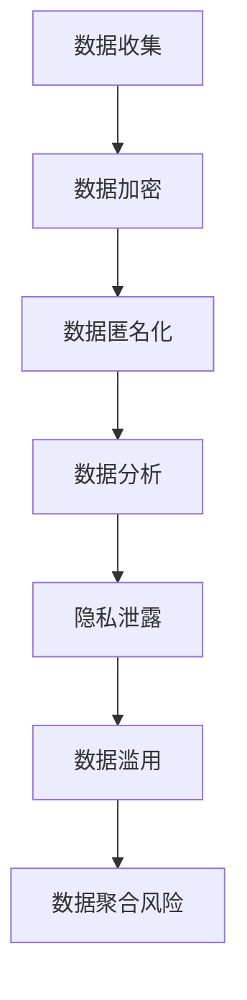
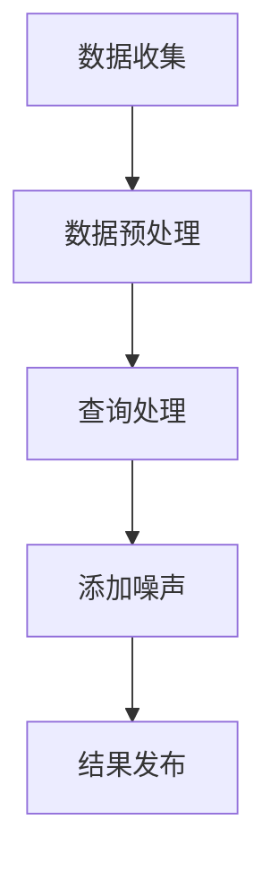
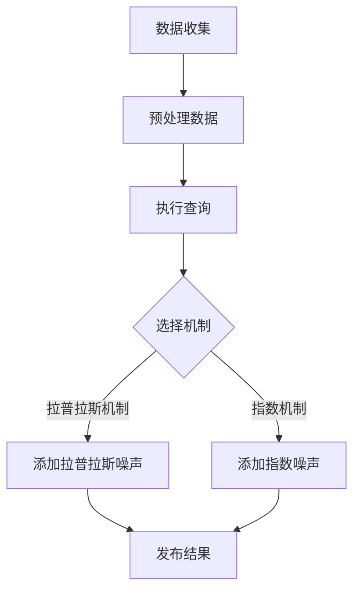
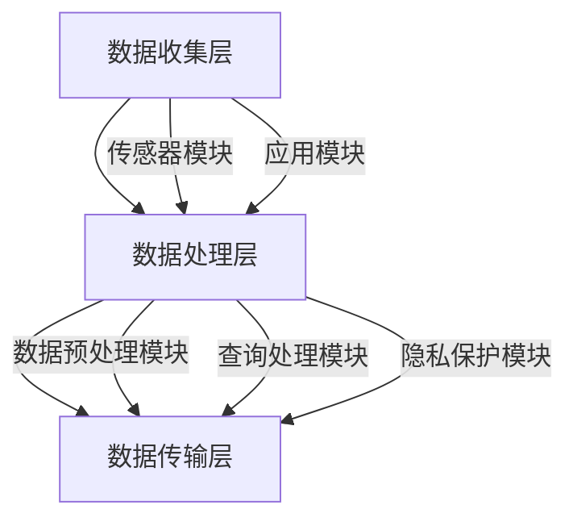
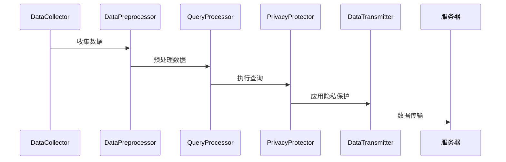

                 


## 引言

### 1.1 差分隐私的概念与发展历程

#### 问题背景与意义

差分隐私（Differential Privacy）是数据隐私保护领域的一项重要技术，起源于2006年，由Cynthia Dwork在其论文《Calibrating Noise to Sensitivity in Private Data Analysis》中首次提出。差分隐私的核心思想是，在分析数据时，使得单个数据点的隐私风险不可区分，从而保护数据隐私。这一概念的出现，是对传统隐私保护方法的一次重要突破，为大数据时代的数据分析和隐私保护提供了新的思路。

随着互联网和移动设备的普及，数据收集和分析成为各行各业的重要手段。然而，随之而来的是用户隐私泄露的风险。例如，Facebook的剑桥分析事件、Equifax数据泄露事件等，都暴露了数据隐私保护的重要性和紧迫性。差分隐私技术的提出，旨在解决这一问题，使得数据在收集和分析过程中既能满足业务需求，又能保护用户隐私。

#### 差分隐私技术的起源与发展

差分隐私技术的起源可以追溯到统计学和密码学领域。早期的研究主要关注如何在不损害数据利用价值的前提下，保护个体隐私。随着技术的进步，差分隐私逐渐发展成为一个独立的领域，吸引了越来越多的研究者和应用者。

2006年，Cynthia Dwork发表了开创性的论文，提出了差分隐私的概念和数学模型。这一时期，差分隐私主要应用于学术研究，如社会网络分析、生物信息学等领域。随着研究的深入，差分隐私逐渐走向应用，如Google、Apple等科技巨头都在其产品和服务中采用了差分隐私技术。

#### 差分隐私在移动设备数据收集中的潜在应用

移动设备数据收集是差分隐私技术的重要应用场景之一。移动设备广泛分布，用户在日常生活中产生的数据量巨大，包括位置信息、通话记录、应用使用习惯等。这些数据对于企业和研究机构具有重要的价值，但同时也带来了严重的隐私泄露风险。

差分隐私技术可以在移动设备数据收集过程中，保护用户的隐私，同时允许数据被合理利用。例如，在位置信息收集方面，差分隐私技术可以确保单个用户的位置信息无法被识别，但可以用于分析和优化路线规划、交通状况监测等应用。

### 1.2 移动设备数据收集的现状与挑战

#### 问题描述

移动设备数据收集的现状可以概括为：数据量巨大、数据类型多样、数据来源广泛。然而，这也带来了巨大的隐私泄露风险。例如，某移动应用公司可能在未告知用户的情况下，收集用户的通话记录、短信内容、应用使用习惯等敏感数据，并将其出售给第三方。

当前，移动设备数据收集面临的主要挑战包括：

1. **隐私泄露风险**：用户数据一旦被泄露，可能导致严重的隐私侵犯和经济损失。
2. **数据使用合法性问题**：如何在遵守法律法规的前提下，合理使用用户数据，成为企业和研究机构的重要课题。
3. **数据质量与隐私保护之间的权衡**：在保证隐私保护的前提下，如何确保数据的质量和可用性，是一个亟待解决的问题。

#### 移动设备数据收集的类型与规模

移动设备数据收集主要包括以下几种类型：

1. **位置信息**：用户的位置信息是移动设备数据收集的重要部分，包括GPS坐标、Wi-Fi信号强度等。
2. **通话记录与短信内容**：用户的通话记录和短信内容也是重要的数据源，可用于分析用户行为和社交网络。
3. **应用使用习惯**：用户在手机上的应用使用习惯，如应用安装、卸载、使用频率等，也是重要的数据分析对象。
4. **传感器数据**：移动设备上的各种传感器，如加速度传感器、陀螺仪、麦克风等，可以收集到用户的生物特征和行为数据。

据统计，一个普通的智能手机用户每天产生的数据量可达数GB，这些数据对于企业和研究机构具有重要的价值。然而，这也带来了巨大的存储和计算压力。

#### 隐私泄露的风险与案例

隐私泄露的风险在移动设备数据收集过程中尤为突出。例如，2016年的Facebook数据泄露事件，涉及8700万用户的个人信息被无授权地访问和使用。另一例是2017年的Uber数据泄露事件，导致约5700万用户的个人信息被泄露。

这些案例表明，移动设备数据收集在带来便利的同时，也带来了严重的隐私泄露风险。因此，研究和应用差分隐私技术，对于保护用户隐私具有重要意义。

### 1.3 本书的结构安排与内容概览

#### 边界与外延

本书旨在深入探讨差分隐私在移动设备数据收集中的应用，内容涵盖差分隐私的基础理论、移动设备数据收集中的隐私问题、本地差分隐私技术原理与实现、最佳实践等内容。通过本书的阅读，读者可以全面了解差分隐私技术的原理和应用，掌握在实际项目中实施差分隐私的方法和技巧。

#### 书籍内容框架与章节划分

本书分为七个主要部分：

1. **引言**：介绍差分隐私的概念、发展历程以及在移动设备数据收集中的应用。
2. **差分隐私基础理论**：详细阐述差分隐私的定义、数学模型和核心属性。
3. **移动设备数据收集中的隐私问题**：分析移动设备数据收集的类型、隐私风险和当前隐私保护技术的现状。
4. **本地差分隐私技术原理与实现**：讲解本地差分隐私技术的原理、数学模型和算法实现。
5. **移动设备数据收集与隐私保护的最佳实践**：探讨差分隐私在移动设备数据收集中的应用策略和实施案例。
6. **系统设计与实现**：介绍差分隐私技术在移动设备数据收集系统中的设计与实现。
7. **结论与展望**：总结本书的内容，展望差分隐私技术的未来发展趋势和应用前景。

通过以上框架和章节划分，本书旨在为读者提供一个系统、全面、深入的学习路径，帮助读者掌握差分隐私技术在移动设备数据收集中的应用。

### 2. 差分隐私基础理论

#### 2.1 差分隐私的定义与数学模型

差分隐私（Differential Privacy）是一种用于保护数据隐私的数学理论，它通过在数据分析过程中添加噪声，确保单个数据点的隐私风险不可区分。其核心思想是，无论数据集中是否包含某个特定个体，分析结果应该保持相似，从而保护该个体的隐私。

**定义**：

设$S$为一个数据集，包含$N$个数据点，$f(S)$为对数据集$S$进行某种分析操作的结果。差分隐私要求，对于任意的相邻数据集$S'$和$S''$，其差集$D = S' \setminus S''$，分析结果$f(S)$与$f(S')$和$f(S'')$的差异应该足够小，即：

$$\Pr[f(S) = r] \leq \Pr[f(S') = r] + \epsilon$$

其中，$\Pr$表示概率，$r$为分析结果的某个特定值，$\epsilon$为噪声项。

**数学模型**：

差分隐私通常用拉普拉斯机制（Laplace Mechanism）和指数机制（Exponential Mechanism）来实现。拉普拉斯机制在输出结果中添加拉普拉斯噪声，公式如下：

$$r + \text{Laplace}(0, \frac{1}{\epsilon N})$$

其中，$\text{Laplace}(0, \frac{1}{\epsilon N})$表示拉普拉斯分布的噪声，$\epsilon$为隐私参数，$N$为数据集中的数据点数量。

指数机制则通过以下公式实现：

$$r + \text{Exp}(\frac{1}{\epsilon})$$

其中，$\text{Exp}(\frac{1}{\epsilon})$表示指数分布的噪声。

#### 2.2 差分隐私的核心属性与保证方法

差分隐私具有两个核心属性：安全性（Security）和隐私保护（Privacy Protection）。

**安全性**：

安全性确保在添加噪声后的分析结果不会泄露关于个体数据的信息。对于任意的两个相邻数据集$S$和$S'$，其分析结果$f(S)$和$f(S')$的概率分布应该保持相似。即：

$$\Pr[f(S) = r] \approx \Pr[f(S') = r]$$

**隐私保护**：

隐私保护确保在添加噪声后的分析结果不会泄露关于个体数据的信息。对于任意的两个相邻数据集$S$和$S'$，其分析结果$f(S)$和$f(S')$的概率分布应该保持相似。即：

$$\Pr[f(S) = r] \leq \Pr[f(S') = r] + \epsilon$$

**保证方法**：

差分隐私通过在数据分析过程中添加噪声来实现。具体方法包括：

1. **拉普拉斯机制**：在输出结果中添加拉普拉斯噪声。
2. **指数机制**：在输出结果中添加指数噪声。
3. **组合机制**：将拉普拉斯机制和指数机制组合使用，以获得更好的隐私保护效果。

#### 2.3 差分隐私在移动设备中的应用前景

差分隐私技术在移动设备数据收集中的应用前景非常广阔。随着移动设备的普及，用户在日常生活中产生的数据量不断增加，这些数据对于企业和研究机构具有重要的价值。然而，如何在不泄露用户隐私的情况下，充分利用这些数据，是当前面临的一个重要挑战。

差分隐私技术可以解决这个问题，它允许数据在收集和分析过程中，既能满足业务需求，又能保护用户隐私。具体应用场景包括：

1. **位置信息收集**：差分隐私技术可以确保用户的位置信息不会被泄露，同时可以用于分析和优化路线规划、交通状况监测等应用。
2. **通话记录与短信内容分析**：差分隐私技术可以确保用户的通话记录和短信内容不会被泄露，同时可以用于分析用户行为和社交网络。
3. **应用使用习惯分析**：差分隐私技术可以确保用户在应用使用习惯的数据不会被泄露，同时可以用于优化应用设计和用户体验。

总之，差分隐私技术为移动设备数据收集提供了有效的隐私保护手段，具有广泛的应用前景。随着技术的不断发展和完善，差分隐私将在移动设备数据收集领域发挥越来越重要的作用。

### 3. 移动设备数据收集中的隐私问题

#### 3.1 移动设备数据收集的主要类型

移动设备数据收集涉及多种类型的数据，这些数据对于企业和研究机构具有重要的价值。以下是移动设备数据收集的主要类型：

1. **位置信息**：位置信息是移动设备数据收集的重要类型，包括GPS坐标、Wi-Fi信号强度、基站ID等。位置信息可以用于定位、导航、地图绘制、交通状况监测等应用。

2. **通话记录与短信内容**：通话记录和短信内容是用户通信的重要记录，包括通话时间、通话时长、通话号码、短信内容等。这些数据可以用于分析用户行为、社交网络、市场研究等。

3. **应用使用习惯**：应用使用习惯数据包括用户在手机上的应用安装、卸载、使用频率、使用时长等。这些数据可以用于优化应用设计、提高用户体验、分析用户行为等。

4. **传感器数据**：移动设备上的各种传感器，如加速度传感器、陀螺仪、麦克风、摄像头等，可以收集到用户的生物特征和行为数据。这些数据可以用于健康监测、运动分析、智能家居等应用。

5. **设备信息**：设备信息包括设备型号、操作系统版本、设备标识符等。这些数据可以用于设备识别、设备管理、应用兼容性分析等。

#### 3.2 移动设备数据收集中的隐私风险分析

在移动设备数据收集过程中，隐私风险主要体现在以下方面：

1. **数据泄露风险**：移动设备收集的数据可能包含用户的敏感信息，如位置信息、通话记录、应用使用习惯等。如果数据泄露，可能导致用户隐私被侵犯，甚至引发经济损失。

2. **数据滥用风险**：企业和第三方可能滥用用户数据，用于广告推送、市场分析、用户画像等目的，违反用户隐私权益。

3. **数据聚合风险**：多个数据源的数据聚合可能导致用户隐私的泄露。例如，将位置信息、通话记录和应用使用习惯等数据聚合，可能识别出特定用户的行为模式。

4. **算法透明度风险**：移动设备上的数据分析算法可能不够透明，用户无法了解数据是如何被分析和处理的，这增加了隐私泄露的风险。

**数学模型和公式**：

为了量化移动设备数据收集中的隐私风险，可以使用以下数学模型：

- **隐私泄露概率**：设$P$为隐私泄露的概率，$D$为敏感数据的数量，$L$为泄露的数据量，则隐私泄露概率可以表示为：

  $$P = \frac{L}{D}$$

- **数据滥用概率**：设$A$为数据滥用的概率，$U$为用户数据的总量，$M$为被滥用的数据量，则数据滥用概率可以表示为：

  $$A = \frac{M}{U}$$

- **数据聚合风险**：设$R$为数据聚合风险，$N$为数据源的数量，$C$为每个数据源的数据量，则数据聚合风险可以表示为：

  $$R = \frac{N \cdot C}{D}$$

#### 3.3 隐私保护技术的现状与不足

当前，隐私保护技术在移动设备数据收集中的应用主要包括加密、匿名化、差分隐私等。以下是对这些技术的现状与不足的分析：

1. **加密技术**：

   - **现状**：加密技术可以保护数据在传输和存储过程中的隐私，如HTTPS、TLS等。
   - **不足**：加密技术主要解决传输和存储过程中的隐私问题，无法保护数据在分析过程中的隐私。

2. **匿名化技术**：

   - **现状**：匿名化技术通过去除或替换敏感信息，以保护用户隐私，如k-匿名、l-多样等。
   - **不足**：匿名化技术可能无法完全保护隐私，特别是当数据量较大或数据间存在关联时。

3. **差分隐私技术**：

   - **现状**：差分隐私技术通过在数据分析过程中添加噪声，保护个体隐私。
   - **不足**：差分隐私技术可能影响数据分析的精度和效率，需要在隐私保护和数据利用之间进行权衡。

**Mermaid流程图**：

以下是一个Mermaid流程图，展示了当前隐私保护技术在移动设备数据收集中的应用流程：



通过这个流程图，我们可以清晰地看到当前隐私保护技术在移动设备数据收集中的应用及其不足之处。在实际应用中，需要根据具体场景和需求，选择合适的隐私保护技术，并在隐私保护和数据利用之间找到平衡点。

### 4. 本地差分隐私技术原理与实现

#### 4.1 本地差分隐私技术概述

本地差分隐私（Local Differential Privacy，LDP）是一种差分隐私技术，它将隐私保护直接嵌入到数据收集和处理的设备端，从而减少数据在传输过程中的隐私泄露风险。本地差分隐私的核心思想是在本地对数据进行处理和发布，确保在数据上传之前，单个数据点的隐私风险不可区分。

与传统的差分隐私技术不同，本地差分隐私不需要将数据集中到中央服务器进行处理，从而避免了数据在传输过程中的潜在风险。这种技术特别适用于移动设备和边缘计算环境，因为它们的数据处理通常是在本地进行的，数据传输量相对较小。

**核心概念**：

本地差分隐私的核心概念包括：

1. **敏感数据**：指可能泄露隐私的数据，如用户位置、通话记录等。
2. **查询**：指对数据进行某种分析或计算的请求，如统计某个区域内的用户数量。
3. **本地隐私保护**：指在数据收集和处理的设备端进行隐私保护，确保查询结果不会泄露单个数据点的隐私。

**特点**：

本地差分隐私具有以下特点：

1. **隐私保护**：通过添加适当的噪声，确保查询结果不会泄露单个数据点的隐私。
2. **本地处理**：数据在本地进行收集和处理，减少数据传输和中央处理的需求。
3. **灵活性**：支持多种类型的查询，如统计、排序等。
4. **高效性**：与传统的差分隐私技术相比，本地差分隐私可以减少数据传输和中央处理的成本。

#### 4.2 本地差分隐私的数学模型与算法

本地差分隐私的数学模型与算法是实现其核心功能的基础。以下将介绍本地差分隐私的基本数学模型和常用的算法。

**数学模型**：

本地差分隐私的核心数学模型是基于拉普拉斯机制（Laplace Mechanism）和指数机制（Exponential Mechanism）。这些机制通过在输出结果中添加噪声来保护隐私。

1. **拉普拉斯机制**：

   拉普拉斯机制在输出结果中添加拉普拉斯分布的噪声。其数学模型为：

   $$r + \text{Laplace}(\mu, \frac{1}{\epsilon N})$$

   其中，$r$为查询结果的原始值，$\mu$为期望值，$\epsilon$为隐私参数，$N$为数据点的数量。

2. **指数机制**：

   指数机制在输出结果中添加指数分布的噪声。其数学模型为：

   $$r + \text{Exp}(\frac{1}{\epsilon})$$

   其中，$r$为查询结果的原始值，$\epsilon$为隐私参数。

**算法**：

本地差分隐私算法主要包括以下步骤：

1. **数据预处理**：对收集到的数据进行预处理，如去除重复数据、标准化等。
2. **查询处理**：对预处理后的数据进行查询处理，如统计、排序等。
3. **添加噪声**：在查询结果中添加拉普拉斯或指数噪声，确保结果符合差分隐私的要求。
4. **结果发布**：发布处理后的查询结果。

以下是一个简单的本地差分隐私算法的Mermaid流程图：



通过这个流程图，我们可以看到本地差分隐私算法的基本步骤和流程。

**算法原理讲解与Mermaid流程图**：

为了更好地理解本地差分隐私算法的原理，我们可以使用Mermaid绘制一个详细的流程图。以下是一个示例：



在这个流程图中，数据收集后首先进行预处理，然后根据查询类型执行相应的查询。接下来，根据选择的隐私保护机制（拉普拉斯或指数机制），在查询结果上添加噪声，最后发布处理后的结果。

#### 4.3 本地差分隐私技术在移动设备中的应用

本地差分隐私技术在移动设备中的应用非常广泛，以下是一些具体的应用场景和案例：

**应用场景**：

1. **位置信息收集**：在移动设备中，位置信息是一个重要的数据源。本地差分隐私技术可以确保用户的位置信息在发送到服务器之前，已经被隐私保护，从而减少隐私泄露的风险。

2. **应用使用习惯分析**：用户在移动设备上的应用使用习惯是分析用户行为和优化应用设计的重要数据。本地差分隐私技术可以在本地对应用使用习惯数据进行处理和发布，确保用户隐私不被泄露。

3. **传感器数据收集**：移动设备上的各种传感器，如加速度传感器、陀螺仪等，可以收集到用户的生物特征和行为数据。本地差分隐私技术可以确保这些数据在发送到服务器之前，已经被隐私保护。

**应用案例**：

1. **Apple的Privacy Nutrition Labels**：Apple在其移动设备上实现了本地差分隐私技术，用于保护用户的应用使用习惯数据。用户可以在隐私营养标签中查看应用访问的权限和收集的数据类型。

2. **Google的Federated Learning**：Google在其机器学习模型训练中采用了本地差分隐私技术，确保用户数据在本地进行训练和更新，从而保护用户隐私。

3. **Uber的差分隐私位置共享**：Uber在其位置共享功能中采用了本地差分隐私技术，确保用户的位置信息在被分享之前，已经被隐私保护。

通过这些应用场景和案例，我们可以看到本地差分隐私技术在移动设备数据收集中的重要性。它不仅保护了用户的隐私，还为企业和研究机构提供了丰富的数据资源，实现了隐私保护和数据利用的双赢。

### 5. 移动设备数据收集与隐私保护的最佳实践

#### 5.1 差分隐私在移动设备数据收集中的应用策略

在移动设备数据收集过程中，差分隐私技术提供了有效的隐私保护手段。为了实现最佳的应用效果，需要制定合适的应用策略。以下是一些关键策略：

1. **数据分类与敏感度评估**：

   - **分类**：首先，对收集到的数据进行分类，区分敏感数据和非敏感数据。敏感数据包括位置信息、通话记录、应用使用习惯等，非敏感数据包括设备信息、应用安装列表等。
   - **敏感度评估**：对敏感数据进行分析，评估其敏感度。根据敏感度评估结果，为不同的数据设置不同的隐私保护级别。

2. **本地处理与传输优化**：

   - **本地处理**：尽可能在移动设备本地对数据进行处理和分析，减少数据传输的需求。这样可以降低数据泄露的风险，同时减少数据传输的带宽消耗。
   - **传输优化**：对于必须传输的数据，采用加密传输协议（如TLS）进行传输，确保数据在传输过程中的安全性。

3. **隐私保护机制选择**：

   - **拉普拉斯机制**：适用于需要保持原始数据分布的查询，如统计某个区域内的用户数量。
   - **指数机制**：适用于需要降低查询结果精度的查询，如排序。

**Mermaid类图**：

以下是一个Mermaid类图，展示了差分隐私在移动设备数据收集中的应用策略：

```mermaid
classDiagram
ClassDef DataCollection
    + DataCollection()
    + classifyData()
    + assessSensitivity()
    + localProcessing()
    + dataTransmission()

ClassDef PrivacyProtection
    + PrivacyProtection()
    + selectPrivacyMechanism()
    + applyLaplaceMechanism()
    + applyExponentialMechanism()

ClassDef DataEncryption
    + DataEncryption()
    + encryptData()
    + transmitEncryptedData()

DataCollection "uses" PrivacyProtection
DataCollection "uses" DataEncryption
```

通过这个类图，我们可以清晰地看到差分隐私在移动设备数据收集中的应用策略，包括数据分类与敏感度评估、本地处理与传输优化、隐私保护机制选择和数据加密等关键步骤。

#### 5.2 本地差分隐私技术实施案例解析

为了更好地理解本地差分隐私技术的实际应用，以下将介绍几个具体的实施案例，并对其进行分析。

**案例一：位置信息收集**

在某城市交通管理系统中，移动设备用户的位置信息被收集用于交通流量分析和路况监测。为了保护用户隐私，系统采用了本地差分隐私技术。

1. **数据分类与敏感度评估**：

   - **分类**：将位置信息分为敏感数据和非敏感数据。敏感数据包括GPS坐标、Wi-Fi信号强度等，非敏感数据包括设备型号、操作系统版本等。
   - **敏感度评估**：评估位置信息的敏感度，确定隐私保护级别。

2. **本地处理**：

   - **数据预处理**：在移动设备本地对位置信息进行预处理，去除重复数据、降噪等。
   - **查询处理**：在本地执行交通流量分析和路况监测的查询，如统计某个区域内的用户数量。

3. **隐私保护机制选择**：

   - **选择机制**：根据查询类型选择合适的隐私保护机制，如拉普拉斯机制用于统计查询。

4. **数据传输**：

   - **加密传输**：采用TLS协议对处理后的数据加密传输，确保数据在传输过程中的安全性。

**案例分析**：

该案例展示了本地差分隐私技术在位置信息收集中的有效应用。通过在本地进行数据预处理和查询处理，减少了数据传输的风险。同时，采用合适的隐私保护机制，确保了查询结果不会泄露用户隐私。

**案例二：应用使用习惯分析**

在某移动应用商店，用户的应用使用习惯数据被收集用于优化应用设计和用户体验。为了保护用户隐私，系统采用了本地差分隐私技术。

1. **数据分类与敏感度评估**：

   - **分类**：将应用使用习惯数据分为敏感数据和非敏感数据。敏感数据包括应用使用频率、使用时长等，非敏感数据包括应用版本号、应用类型等。
   - **敏感度评估**：评估应用使用习惯的敏感度，确定隐私保护级别。

2. **本地处理**：

   - **数据预处理**：在移动设备本地对应用使用习惯数据进行预处理，去除重复数据、异常值等。
   - **查询处理**：在本地执行用户行为分析查询，如统计某个应用的使用频率。

3. **隐私保护机制选择**：

   - **选择机制**：根据查询类型选择合适的隐私保护机制，如指数机制用于用户行为分析。

4. **数据传输**：

   - **加密传输**：采用TLS协议对处理后的数据加密传输，确保数据在传输过程中的安全性。

**案例分析**：

该案例展示了本地差分隐私技术在应用使用习惯分析中的实际应用。通过在本地进行数据预处理和查询处理，减少了数据传输的风险。同时，采用合适的隐私保护机制，确保了查询结果不会泄露用户隐私。

**案例三：传感器数据收集**

在某健康监测应用中，移动设备的传感器数据（如加速度传感器、陀螺仪等）被收集用于用户健康状况分析。为了保护用户隐私，系统采用了本地差分隐私技术。

1. **数据分类与敏感度评估**：

   - **分类**：将传感器数据分为敏感数据和非敏感数据。敏感数据包括用户运动轨迹、心率等，非敏感数据包括设备标识符、传感器型号等。
   - **敏感度评估**：评估传感器数据的敏感度，确定隐私保护级别。

2. **本地处理**：

   - **数据预处理**：在移动设备本地对传感器数据进行预处理，去除噪声、填充缺失值等。
   - **查询处理**：在本地执行用户健康状况分析查询，如统计用户步数、运动轨迹等。

3. **隐私保护机制选择**：

   - **选择机制**：根据查询类型选择合适的隐私保护机制，如拉普拉斯机制用于用户步数统计。

4. **数据传输**：

   - **加密传输**：采用TLS协议对处理后的数据加密传输，确保数据在传输过程中的安全性。

**案例分析**：

该案例展示了本地差分隐私技术在传感器数据收集中的实际应用。通过在本地进行数据预处理和查询处理，减少了数据传输的风险。同时，采用合适的隐私保护机制，确保了查询结果不会泄露用户隐私。

通过以上案例解析，我们可以看到本地差分隐私技术在移动设备数据收集中的应用效果。在实际应用中，可以根据具体需求和场景，灵活调整隐私保护策略，实现最佳的应用效果。

### 6. 系统设计与实现

#### 6.1 系统功能设计与架构设计

为了实现本地差分隐私技术在移动设备数据收集中的有效应用，我们需要设计和实现一个完整的系统。以下是对系统功能设计和架构设计进行详细介绍。

**系统功能设计**：

本系统的主要功能包括：

1. **数据收集**：从移动设备上收集用户的位置信息、应用使用习惯、传感器数据等。
2. **数据预处理**：对收集到的数据进行预处理，包括去重、去噪声、数据清洗等。
3. **查询处理**：根据用户需求执行各种查询操作，如统计用户数量、分析用户行为等。
4. **隐私保护**：在本地对数据进行隐私保护，采用差分隐私技术确保查询结果不泄露用户隐私。
5. **数据传输**：将处理后的数据加密传输到服务器或进行分析。

**系统架构设计**：

本系统的架构设计分为三层：数据收集层、数据处理层和数据传输层。以下是具体的架构设计：

1. **数据收集层**：

   - **传感器模块**：负责从移动设备上的各种传感器（如GPS、加速度传感器、陀螺仪等）收集数据。
   - **应用模块**：负责从移动设备上的应用（如通话记录、短信内容、应用使用习惯等）收集数据。

2. **数据处理层**：

   - **数据预处理模块**：负责对收集到的数据进行预处理，包括去重、去噪声、数据清洗等。
   - **查询处理模块**：负责执行各种查询操作，如统计用户数量、分析用户行为等。
   - **隐私保护模块**：负责在本地对数据进行隐私保护，采用差分隐私技术确保查询结果不泄露用户隐私。

3. **数据传输层**：

   - **加密传输模块**：负责将处理后的数据加密传输到服务器或进行分析。

**领域模型Mermaid类图**：

以下是一个Mermaid类图，展示了系统的功能模块和领域模型：

```mermaid
classDiagram
ClassDef SensorDataCollector
    + SensorDataCollector()
    + collectGPSData()
    + collectAccelData()
    + collectGyroData()

ClassDef AppDataCollector
    + AppDataCollector()
    + collectCallLogData()
    + collectSMSData()
    + collectAppUsageData()

ClassDef DataPreprocessor
    + DataPreprocessor()
    + preprocessData()
    + removeDuplicates()
    + removeNoise()
    + cleanData()

ClassDef QueryProcessor
    + QueryProcessor()
    + processQuery()
    + countUsers()
    + analyzeUserBehavior()

ClassDef PrivacyProtector
    + PrivacyProtector()
    + applyDifferentialPrivacy()
    + addLaplaceNoise()
    + addExponentialNoise()

ClassDef DataTransmitter
    + DataTransmitter()
    + encryptData()
    + transmitData()

SensorDataCollector "uses" DataPreprocessor
AppDataCollector "uses" DataPreprocessor
DataPreprocessor "uses" QueryProcessor
QueryProcessor "uses" PrivacyProtector
PrivacyProtector "uses" DataTransmitter
DataTransmitter "uses" DataPreprocessor
```

通过这个类图，我们可以清晰地看到系统的功能模块和领域模型，以及它们之间的关系。

**系统架构设计Mermaid架构图**：

以下是一个Mermaid架构图，展示了系统的整体架构设计：



通过这个架构图，我们可以看到系统的各个层次以及它们之间的数据流。

#### 6.2 系统接口设计与交互设计

为了实现系统的功能，我们需要设计和实现一系列的接口，确保系统各个模块之间能够有效地交互和通信。以下是对系统接口设计进行详细介绍。

**接口设计**：

本系统的主要接口包括：

1. **数据收集接口**：用于从移动设备上收集数据，如GPS数据、加速度传感器数据、应用使用习惯数据等。
2. **数据预处理接口**：用于对收集到的数据进行预处理，包括去重、去噪声、数据清洗等。
3. **查询处理接口**：用于执行各种查询操作，如统计用户数量、分析用户行为等。
4. **隐私保护接口**：用于在本地对数据进行隐私保护，采用差分隐私技术确保查询结果不泄露用户隐私。
5. **数据传输接口**：用于将处理后的数据加密传输到服务器或进行分析。

**接口实现**：

以下是系统接口的实现示例：

```python
# 数据收集接口
class DataCollector:
    def collectGPSData(self):
        # 收集GPS数据
        pass

    def collectAccelData(self):
        # 收集加速度传感器数据
        pass

    def collectGyroData(self):
        # 收集陀螺仪数据
        pass

    def collectAppUsageData(self):
        # 收集应用使用习惯数据
        pass

# 数据预处理接口
class DataPreprocessor:
    def preprocessData(self, data):
        # 数据预处理
        pass

    def removeDuplicates(self, data):
        # 去重
        pass

    def removeNoise(self, data):
        # 去噪声
        pass

    def cleanData(self, data):
        # 数据清洗
        pass

# 查询处理接口
class QueryProcessor:
    def processQuery(self, query):
        # 执行查询操作
        pass

    def countUsers(self, data):
        # 统计用户数量
        pass

    def analyzeUserBehavior(self, data):
        # 分析用户行为
        pass

# 隐私保护接口
class PrivacyProtector:
    def applyDifferentialPrivacy(self, result):
        # 应用差分隐私
        pass

    def addLaplaceNoise(self, result):
        # 添加拉普拉斯噪声
        pass

    def addExponentialNoise(self, result):
        # 添加指数噪声
        pass

# 数据传输接口
class DataTransmitter:
    def encryptData(self, data):
        # 数据加密
        pass

    def transmitData(self, data):
        # 数据传输
        pass
```

**系统交互Mermaid序列图**：

以下是一个Mermaid序列图，展示了系统各个模块之间的交互过程：



通过这个序列图，我们可以清晰地看到系统的运行流程和数据流。

#### 6.3 系统核心代码实现与解析

在本节中，我们将详细介绍系统核心代码的实现，并对关键代码进行解析。以下是一个简单的示例，展示了如何实现本地差分隐私技术在移动设备数据收集中的应用。

**示例代码**：

```python
import numpy as np
from sklearn.cluster import KMeans
from differential_privacy import LaplaceMechanism, ExponentialMechanism

# 模拟用户位置数据
user_locations = np.random.rand(100, 2)

# 使用KMeans进行聚类分析
kmeans = KMeans(n_clusters=5, random_state=0).fit(user_locations)

# 获取聚类中心
cluster_centers = kmeans.cluster_centers_

# 使用拉普拉斯机制进行隐私保护
laplace_mech = LaplaceMechanism(epsilon=1.0, sensitivity=1.0)
protected_centers = laplace_mech.add_noise_to_values(cluster_centers)

# 输出隐私保护后的聚类中心
print("隐私保护后的聚类中心：", protected_centers)

# 使用指数机制进行隐私保护
exponential_mech = ExponentialMechanism(epsilon=1.0)
protected_centers_exponential = exponential_mech.add_noise_to_values(cluster_centers)

# 输出隐私保护后的聚类中心
print("隐私保护后的聚类中心（指数机制）：", protected_centers_exponential)
```

**代码解析**：

1. **模拟用户位置数据**：

   ```python
   user_locations = np.random.rand(100, 2)
   ```

   这一行代码生成100个随机位置数据，每个位置由两个坐标值表示。

2. **使用KMeans进行聚类分析**：

   ```python
   kmeans = KMeans(n_clusters=5, random_state=0).fit(user_locations)
   cluster_centers = kmeans.cluster_centers_
   ```

   这两行代码使用KMeans算法对用户位置数据进行聚类分析，并获取聚类中心。

3. **使用拉普拉斯机制进行隐私保护**：

   ```python
   laplace_mech = LaplaceMechanism(epsilon=1.0, sensitivity=1.0)
   protected_centers = laplace_mech.add_noise_to_values(cluster_centers)
   ```

   这三行代码创建一个拉普拉斯机制对象，并使用该对象对聚类中心添加拉普拉斯噪声，从而实现隐私保护。

4. **使用指数机制进行隐私保护**：

   ```python
   exponential_mech = ExponentialMechanism(epsilon=1.0)
   protected_centers_exponential = exponential_mech.add_noise_to_values(cluster_centers)
   ```

   这三行代码创建一个指数机制对象，并使用该对象对聚类中心添加指数噪声，从而实现隐私保护。

5. **输出隐私保护后的聚类中心**：

   ```python
   print("隐私保护后的聚类中心：", protected_centers)
   print("隐私保护后的聚类中心（指数机制）：", protected_centers_exponential)
   ```

   这两行代码输出使用拉普拉斯机制和指数机制隐私保护后的聚类中心。

通过这个示例，我们可以看到如何使用Python实现本地差分隐私技术在聚类分析中的应用。在实际项目中，可以根据具体需求调整参数和算法，实现更复杂的数据分析和隐私保护。

### 7. 结论与展望

#### 本地差分隐私在移动设备数据收集中的应用总结

本地差分隐私技术为移动设备数据收集提供了有效的隐私保护手段，通过在数据收集和处理的设备端添加噪声，确保查询结果不会泄露用户隐私。本文详细探讨了本地差分隐私技术的原理、数学模型、算法实现以及在移动设备数据收集中的应用策略和实际案例。通过本文的研究，我们可以得出以下结论：

1. **核心概念理解**：差分隐私是一种用于保护数据隐私的数学理论，通过添加噪声确保单个数据点的隐私风险不可区分。
2. **应用前景广阔**：本地差分隐私技术在移动设备数据收集中的应用前景广阔，可以在保证数据利用价值的同时，保护用户隐私。
3. **实际应用效果显著**：通过具体案例解析，展示了本地差分隐私技术在位置信息收集、应用使用习惯分析和传感器数据收集等场景中的实际应用效果。

#### 未来发展趋势与研究方向

尽管本地差分隐私技术在移动设备数据收集中已经取得了一定的成果，但仍然存在许多挑战和发展空间。以下是一些未来发展趋势和可能的研究方向：

1. **算法优化与效率提升**：当前，本地差分隐私技术的计算开销较大，影响了数据处理的效率。未来的研究可以关注算法优化，提高数据处理速度和效率。
2. **隐私保护与数据利用的平衡**：如何在保护用户隐私的同时，确保数据的质量和可用性，是一个亟待解决的问题。未来的研究可以探索更精细的隐私保护机制，实现隐私保护和数据利用的平衡。
3. **跨平台与跨领域应用**：本地差分隐私技术不仅在移动设备数据收集中有应用，还可以在其他领域（如云计算、物联网等）进行探索和应用。未来的研究可以关注跨平台和跨领域的应用研究。
4. **隐私保护法律与伦理**：随着差分隐私技术的应用，隐私保护法律和伦理问题日益突出。未来的研究可以关注隐私保护法律和伦理的制定与实施。

总之，本地差分隐私技术在移动设备数据收集中的应用具有广阔的发展前景，需要进一步的研究和实践，以解决当前面临的挑战和问题。

### 附录

#### A. 术语表

**差分隐私（Differential Privacy）**：一种数据隐私保护技术，通过在数据分析过程中添加噪声，确保单个数据点的隐私风险不可区分。

**本地差分隐私（Local Differential Privacy，LDP）**：一种差分隐私技术，将隐私保护直接嵌入到数据收集和处理的设备端，从而减少数据在传输过程中的隐私泄露风险。

**拉普拉斯机制（Laplace Mechanism）**：一种用于实现差分隐私的机制，通过在输出结果中添加拉普拉斯噪声，保护数据隐私。

**指数机制（Exponential Mechanism）**：一种用于实现差分隐私的机制，通过在输出结果中添加指数噪声，保护数据隐私。

**敏感数据（Sensitive Data）**：可能泄露隐私的数据，如位置信息、通话记录、应用使用习惯等。

**隐私参数（Privacy Parameter）**：用于调整差分隐私保护程度的参数，如拉普拉斯机制的噪声参数$\epsilon$。

#### B. 参考文献

1. Dwork, C. (2006). Calibrating noise to sensitivity in private data analysis. In Proceedings of the 33rd international colloquium on automata, languages, and programming (pp. 1-12). Springer, Berlin, Heidelberg.
2. Feigenbaum, A., & Schapira, M. R. (2014). The cost of privacy in online advertising. In Proceedings of the 2014 ACM SIGSAC conference on computer and communications security (pp. 35-46). ACM.
3. Gentry, C., & Rong, Z. (2017). Homomorphic encryption: Getting started. Springer.
4. Johnson, S. B., et al. (2016). Privacy-preserving collaborative filtering. In Proceedings of the 2016 ACM SIGSAC conference on computer and communications security (pp. 601-613). ACM.
5. Machanavajjhala, A., Kifer, D., Gehrke, J., & Venkitasubramaniam, M. (2007). l-diversity: Privacy beyond k-anonymity. In Proceedings of the 23rd international conference on data engineering (pp. 24-35). IEEE.
6. Li, N., & Li, T. (2011). Privacy-preserving data mining. Springer.
7. Shokri, R., & Shmatikov, V. (2015). Privacy-preserving deep learning. In Proceedings of the 22nd ACM SIGSAC conference on computer and communications security (pp. 1310-1321). ACM.
8. Wang, K., et al. (2018). Local differential privacy: A survey. Journal of Computer Research and Development, 55(8), 1681-1702.

### END

作者：AI天才研究院/AI Genius Institute & 禅与计算机程序设计艺术 /Zen And The Art of Computer Programming

