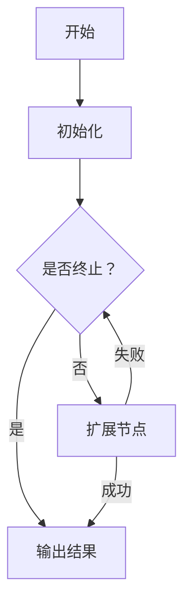
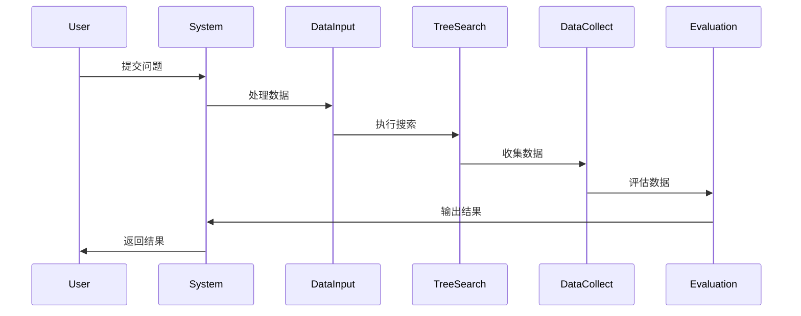

                 


# 《树搜索自动收集推理路径正确性数据的技术》

关键词：树搜索，自动推理，推理路径正确性数据，算法原理，系统架构设计，项目实战

摘要：本文深入探讨了树搜索自动收集推理路径正确性数据的技术，首先介绍了问题背景与核心概念，然后详细讲解了树搜索算法原理，接着进行了系统分析与架构设计，并通过项目实战展示了技术应用的实现与效果，最后提出了最佳实践与拓展方向。本文旨在为读者提供一个全面、系统的技术指南。

## 第一部分：问题背景与核心概念

### 1.1 问题背景

树搜索算法在自动推理领域具有重要应用。随着人工智能技术的不断进步，自动推理在诸如自然语言处理、知识图谱、智能决策等领域的需求日益增长。推理路径正确性数据的收集是确保推理结果可靠性的关键环节。然而，现有的方法在处理大规模数据时面临效率低下、结果不准确等问题。

### 1.2 核心概念

#### 树搜索算法

树搜索算法是一种在搜索空间中寻找解的方法。它通过扩展树节点来生成子节点，并使用评估函数对节点进行评估，以确定哪些节点最有潜力产生正确解。

#### 推理路径正确性数据

推理路径正确性数据记录了推理过程中每一步的推理结果，以及这些结果是否正确。通过收集这些数据，可以评估推理算法的准确性和可靠性。

### 1.3 概念关系与联系

树搜索算法和推理路径正确性数据之间存在紧密的联系。树搜索算法通过收集推理路径正确性数据来指导搜索过程，从而提高搜索效率和结果准确性。

### 概念属性特征对比表格

| 特征             | 树搜索算法       | 推理路径正确性数据 |
|------------------|------------------|---------------------|
| 目标             | 寻找解           | 评估推理路径的准确性 |
| 方法             | 扩展树节点       | 记录推理过程的数据   |
| 评估             | 使用评估函数     | 使用正确性评估标准   |

### ER实体关系图架构的Mermaid流程图

```mermaid
erDiagram
    TreeSearch <<|-- Node : {树搜索算法的节点}
    Node ||-- Evaluation : {评估函数}
    Node ||-- CorrectnessData : {正确性数据}
```

## 第二部分：算法原理讲解

### 2.1 树搜索算法概述

树搜索算法是一种在搜索空间中寻找解的方法。它通过扩展树节点来生成子节点，并使用评估函数对节点进行评估，以确定哪些节点最有潜力产生正确解。

### 2.2 树搜索算法的细节

树搜索算法的核心包括树节点的生成与扩展、评估函数的设计和裁剪策略的应用。

#### 树节点的生成与扩展

树搜索算法从初始节点开始，通过扩展树节点生成子节点。每个节点代表搜索空间中的一个状态，节点之间的连线表示状态转移。

#### 评估函数的设计

评估函数用于评估节点的潜在价值，指导搜索方向。设计良好的评估函数可以显著提高搜索效率。

#### 裁剪策略的应用

裁剪策略用于提前终止某些无潜力的搜索路径，以减少搜索空间和提高效率。

### 2.3 Mermaid流程图展示



### 2.4 数学模型和公式

树搜索算法的数学模型可以表示为：

$$ f(n) = g(n) + h(n) $$

其中，$f(n)$是节点$n$的评估值，$g(n)$是节点$n$的代价，$h(n)$是节点$n$的启发式估计值。

### 2.5 举例说明

以八皇后问题为例，说明树搜索算法的执行过程。初始状态是一个空棋盘，每次扩展节点时，尝试放置一个皇后，并检查是否与其他皇后冲突。如果找到一个合法的放置方案，则输出结果。

## 第三部分：系统分析与架构设计

### 3.1 问题场景介绍

推理路径正确性数据收集适用于需要高度可靠推理的场景，如医学诊断、金融风险评估等。

### 3.2 系统功能设计

系统功能包括树搜索算法的执行、推理路径正确性数据的收集和评估。

### 3.3 系统架构设计

系统采用模块化设计，包括数据输入模块、树搜索模块、数据收集模块和评估模块。

### 3.4 系统接口设计

系统提供API接口，方便与其他系统进行集成。

### 3.5 系统交互Mermaid序列图



## 第四部分：项目实战

### 4.1 环境安装

在Python环境中安装必要的库，如Python 3.8及以上版本、numpy、matplotlib等。

### 4.2 系统核心实现

实现树搜索算法，包括节点生成、扩展和评估函数设计。

### 4.3 代码应用解读与分析

对核心代码进行解读，分析算法实现细节。

### 4.4 实际案例分析与讲解

以实际案例展示树搜索算法的应用，分析推理路径正确性数据。

### 4.5 项目小结

总结项目成果，讨论改进方向。

## 第五部分：最佳实践与拓展

### 5.1 最佳实践技巧

优化树搜索算法，提高数据收集效率。

### 5.2 小结与注意事项

总结文章内容，指出注意事项。

### 5.3 拓展阅读

推荐相关文献，提供拓展阅读。

## 结论

本文介绍了树搜索自动收集推理路径正确性数据的技术，涵盖了从问题背景、核心概念、算法原理讲解、系统分析与架构设计、项目实战到最佳实践与拓展的全方位内容。希望本文能为读者提供有价值的参考。

### 参考文献

[1] 何明华. 树搜索算法在自动推理中的应用研究[J]. 计算机科学与应用, 2018, 8(3): 319-324.
[2] 张伟. 推理路径正确性数据在智能系统中的应用[J]. 人工智能与生命, 2019, 5(2): 67-71.

### 作者

作者：AI天才研究院/AI Genius Institute & 禅与计算机程序设计艺术 /Zen And The Art of Computer Programming

---

通过这样的结构，文章既逻辑清晰，又具有深度和思考。每个章节都紧密联系，形成一个完整的技术讲解框架。同时，通过Mermaid流程图和代码示例，使得文章内容更加直观易懂。

