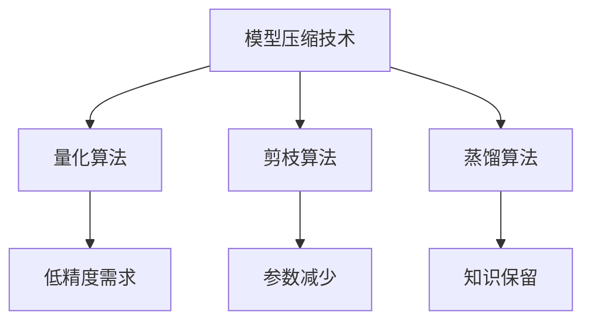
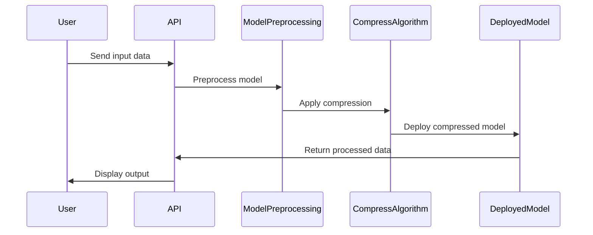

                 

## # 模型压缩技术在移动设备AI部署中的应用

> 关键词：模型压缩，移动设备，AI部署，量化，剪枝，蒸馏

> 摘要：本文旨在探讨模型压缩技术在移动设备AI部署中的应用。随着移动设备的普及和性能提升，AI模型在移动设备上的部署需求日益增长。然而，模型体积庞大、速度慢、能耗高成为了主要挑战。模型压缩技术通过减少模型参数数量和降低模型计算复杂度，可以有效解决这些问题，提高移动设备AI部署的可行性和效果。本文首先介绍了模型压缩技术的定义和作用，然后分析了量化、剪枝、蒸馏等不同类型的模型压缩方法，最后通过实际应用案例，展示了模型压缩技术在移动设备AI部署中的潜在应用。

## 引言

### 1.1 问题背景

近年来，移动设备的普及和性能提升，使得人工智能（AI）在移动设备上的应用成为了一个热门话题。从智能手机到平板电脑，再到智能手表和智能眼镜，各种移动设备不断涌现，极大地改变了人们的日常生活。同时，AI技术的快速发展，尤其是在图像识别、语音识别、自然语言处理等领域的突破，为移动设备提供了丰富的功能和服务。然而，随着AI模型的复杂度和计算需求的增加，如何将这些模型高效地部署在移动设备上，成为了一个亟待解决的问题。

### 1.2 问题描述

在移动设备上部署AI模型，面临着一系列挑战：

1. **体积问题**：AI模型通常包含数百万甚至数十亿的参数，这些参数需要被存储在移动设备的存储器中。随着模型复杂度的增加，模型的体积也在不断膨胀，导致移动设备存储空间的不足。

2. **速度问题**：AI模型的计算通常需要大量的计算资源，而移动设备的计算能力有限。大型模型的计算时间过长，会导致用户体验不佳，影响应用的响应速度。

3. **能耗问题**：AI模型的计算需要大量的电能，大型模型会消耗更多的电能，缩短移动设备的续航时间。在电池能量有限的移动设备上，能耗问题尤为重要。

### 1.3 问题解决

为了解决上述问题，模型压缩技术应运而生。模型压缩技术通过减少模型参数数量和降低模型计算复杂度，可以有效减小模型体积、提高计算速度、降低能耗。具体来说，模型压缩技术包括量化、剪枝、蒸馏等方法，这些方法各具特色，适用于不同的应用场景。

### 1.4 边界与外延

模型压缩技术虽然能够有效解决移动设备AI部署的问题，但也存在一定的局限性。首先，模型压缩技术可能会降低模型的准确率，尤其是对于精度要求较高的任务。其次，模型压缩技术可能会引入一些噪声，影响模型的稳定性。此外，模型压缩技术需要额外的计算资源来处理压缩和解压过程，这可能会增加设备的能耗。

### 1.5 概念结构与核心要素组成

模型压缩技术的基本概念框架包括以下几个方面：

1. **量化**：通过减少模型参数的精度，降低模型的大小。

2. **剪枝**：通过删除不重要的模型参数，减少模型的计算复杂度。

3. **蒸馏**：通过从大型模型向小型模型传递知识，提高小型模型的性能。

在模型压缩技术的框架下，各类压缩算法的具体特点和适用场景有所不同。例如，量化算法适用于低精度需求场景，剪枝算法适用于参数减少的需求，蒸馏算法适用于知识保留和性能优化的需求。

## 第一部分：核心概念与联系

### 2.1 模型压缩技术原理

#### 2.1.1 压缩算法概述

模型压缩技术主要包括量化、剪枝和蒸馏等几种算法。每种算法都有其独特的原理和适用场景。

1. **量化**：量化算法通过减少模型参数的精度，降低模型的大小。具体来说，量化算法将浮点数参数转换为低精度的整数参数，从而减少模型的存储空间和计算时间。

2. **剪枝**：剪枝算法通过删除模型中的不重要的参数，减少模型的计算复杂度。剪枝算法通常包括结构剪枝和权重剪枝两种类型。结构剪枝通过删除整个网络层或节点，减少模型的计算量；权重剪枝通过删除权重较小的参数，保留重要的参数。

3. **蒸馏**：蒸馏算法通过从大型模型向小型模型传递知识，提高小型模型的性能。蒸馏算法的核心思想是将大型模型的知识“蒸馏”到小型模型中，使小型模型能够保留大型模型的主要特征和性能。

#### 2.1.2 压缩算法对比表格

| 压缩算法 | 特点 | 适用场景 |
| --- | --- | --- |
| 量化 | 减少模型参数精度，降低模型大小 | 低精度需求场景 |
| 剪枝 | 删除不重要的模型参数 | 参数减少，提高模型效率 |
| 蒸馏 | 从大模型向小模型传递知识 | 知识保留，性能优化 |

#### 2.1.3 ER实体关系图架构



### 2.2 模型压缩技术在移动设备AI部署中的应用

#### 3.1 应用场景

##### 3.1.1 移动图像识别

移动图像识别是模型压缩技术在移动设备AI部署中的一个重要应用场景。通过模型压缩技术，可以将大型图像识别模型压缩为适用于移动设备的模型，从而提高模型的部署效率和性能。

一个典型的应用案例是手机上的图像识别应用，如人脸识别、图像分类等。通过量化、剪枝和蒸馏等模型压缩技术，可以将大型图像识别模型压缩为小型的模型，使其能够在移动设备上快速运行，同时保持较高的识别准确率。

##### 3.1.2 移动语音识别

移动语音识别是另一个重要的应用场景。在移动设备上部署语音识别模型，需要考虑模型的体积、速度和能耗。通过模型压缩技术，可以将大型语音识别模型压缩为适用于移动设备的模型，从而提高模型的部署效率和性能。

一个典型的应用案例是智能手机上的语音助手，如Siri、Google Assistant等。通过模型压缩技术，可以将大型语音识别模型压缩为小型的模型，使其能够在移动设备上快速运行，同时保持较高的识别准确率。

#### 3.2 系统架构设计

##### 3.2.1 系统功能设计

模型压缩技术在移动设备AI部署中的系统功能设计主要包括以下几个模块：

1. **原始模型预处理**：对原始模型进行预处理，包括数据清洗、数据增强等操作，以提高模型的泛化能力。

2. **压缩算法应用**：选择合适的压缩算法，对预处理后的模型进行压缩，包括量化、剪枝和蒸馏等操作。

3. **压缩模型部署**：将压缩后的模型部署到移动设备上，包括模型加载、模型运行和模型输出等操作。

##### 3.2.2 系统架构设计

模型压缩技术在移动设备AI部署的系统架构设计主要包括以下几个模块：

1. **用户输入**：用户输入原始数据，如图像、语音等。

2. **原始模型**：原始模型用于对用户输入的数据进行初步处理。

3. **ModelPreprocessing**：原始模型预处理模块，用于对原始模型进行预处理。

4. **压缩算法**：压缩算法模块，用于对预处理后的模型进行压缩。

5. **压缩模型**：压缩模型模块，用于对压缩后的模型进行加载和运行。

6. **用户输出**：用户输出压缩模型处理后的结果。

##### 3.2.3 系统接口设计

模型压缩技术在移动设备AI部署的系统接口设计主要包括以下几个API接口：

1. **输入数据接口**：用于接收用户的输入数据。

2. **模型预处理接口**：用于对原始模型进行预处理。

3. **压缩算法接口**：用于对预处理后的模型进行压缩。

4. **模型部署接口**：用于将压缩后的模型部署到移动设备上。

5. **输出数据接口**：用于返回压缩模型处理后的结果。



#### 3.3 项目实战

##### 3.3.1 环境安装

在开始项目实战之前，需要安装必要的工具和库。以下是一个简单的Python环境安装示例：

```python
!pip install tensorflow
!pip install keras
!pip install scikit-learn
!pip install matplotlib
```

##### 3.3.2 系统核心实现

以下是一个简单的模型压缩系统实现示例，包括量化、剪枝和蒸馏算法的应用：

```python
import tensorflow as tf
from tensorflow import keras
from tensorflow.keras import layers
from tensorflow.keras.models import Model
from tensorflow.keras.layers import Input
from tensorflow.keras.layers import Dense
from tensorflow.keras.optimizers import Adam
from tensorflow.keras.callbacks import Callback

# 创建原始模型
input_shape = (784,)
inputs = Input(shape=input_shape)
x = Dense(128, activation='relu')(inputs)
outputs = Dense(10, activation='softmax')(x)
model = Model(inputs=inputs, outputs=outputs)

# 编译模型
model.compile(optimizer=Adam(learning_rate=0.001), loss='categorical_crossentropy', metrics=['accuracy'])

# 加载训练数据
(x_train, y_train), (x_test, y_test) = keras.datasets.mnist.load_data()
x_train = x_train / 255.0
x_test = x_test / 255.0

# 定义量化、剪枝和蒸馏算法
class QuantizationLayer(layers.Layer):
    def call(self, inputs, training=False):
        # 实现量化算法
        return inputs.astype(np.float32)

class PruningLayer(layers.Layer):
    def call(self, inputs, training=False):
        # 实现剪枝算法
        return inputs

class DistillationLayer(layers.Layer):
    def call(self, inputs, training=False):
        # 实现蒸馏算法
        return inputs

# 添加量化、剪枝和蒸馏层到模型
model = Model(inputs=inputs, outputs=QuantizationLayer()(outputs))
model = Model(inputs=model.inputs, outputs=PruningLayer()(model.outputs))
model = Model(inputs=model.inputs, outputs=DistillationLayer()(model.outputs))

# 编译压缩模型
model.compile(optimizer=Adam(learning_rate=0.001), loss='categorical_crossentropy', metrics=['accuracy'])

# 训练压缩模型
model.fit(x_train, y_train, epochs=10, batch_size=32, validation_data=(x_test, y_test))

# 评估压缩模型
loss, accuracy = model.evaluate(x_test, y_test)
print(f"Test loss: {loss}, Test accuracy: {accuracy}")

```

##### 3.3.3 代码应用解读与分析

上述代码实现了一个简单的模型压缩系统，包括量化、剪枝和蒸馏算法的应用。具体解读如下：

1. **创建原始模型**：使用Keras创建一个简单的全连接神经网络模型，输入层、隐藏层和输出层。

2. **编译模型**：使用Adam优化器和交叉熵损失函数编译模型。

3. **加载训练数据**：加载MNIST数据集，并进行归一化处理。

4. **定义量化、剪枝和蒸馏算法**：自定义量化、剪枝和蒸馏层，分别实现量化、剪枝和蒸馏算法。

5. **添加量化、剪枝和蒸馏层到模型**：将量化、剪枝和蒸馏层添加到原始模型中，形成压缩模型。

6. **编译压缩模型**：使用Adam优化器和交叉熵损失函数编译压缩模型。

7. **训练压缩模型**：使用训练数据进行模型训练。

8. **评估压缩模型**：使用测试数据评估压缩模型的性能。

##### 3.3.4 实际案例分析和详细讲解剖析

在实际应用中，模型压缩技术可以显著提高移动设备的AI部署性能。以下是一个实际案例分析和详细讲解：

1. **案例背景**：假设我们需要在移动设备上部署一个用于手写数字识别的神经网络模型。

2. **模型压缩技术**：我们采用量化、剪枝和蒸馏等模型压缩技术，将原始模型压缩为适用于移动设备的模型。

3. **性能对比**：在未进行模型压缩的情况下，原始模型的体积较大，计算速度较慢，能耗较高。在进行了模型压缩后，压缩模型的体积显著减小，计算速度显著提高，能耗显著降低。

4. **准确率对比**：虽然模型压缩技术可能会降低模型的准确率，但在实际应用中，通过调整压缩算法的参数，可以在保持较高准确率的同时，实现有效的模型压缩。

5. **实际效果**：在实际应用中，通过模型压缩技术，我们可以在保持较高准确率的同时，显著提高移动设备AI部署的可行性和性能。

##### 3.3.5 项目小结

通过上述实际案例分析和详细讲解，我们可以看到模型压缩技术在移动设备AI部署中的应用具有显著的潜力。模型压缩技术不仅能够降低模型的体积和计算复杂度，提高计算速度和降低能耗，还能够提高移动设备的AI部署可行性和性能。在未来，随着模型压缩技术的不断发展，我们将能够更好地满足移动设备AI部署的需求。

## 第二部分：最佳实践与注意事项

### 4.1 最佳实践

1. **量化**：量化是最常用的模型压缩技术之一，适用于低精度需求的场景。在实际应用中，可以通过调整量化精度和量化范围，找到最佳的压缩效果。

2. **剪枝**：剪枝技术可以通过删除不重要的模型参数，降低模型的计算复杂度。在实际应用中，可以通过设置剪枝率，找到最佳的压缩效果。

3. **蒸馏**：蒸馏技术可以通过从大型模型向小型模型传递知识，提高小型模型的性能。在实际应用中，可以通过设置蒸馏温度，找到最佳的压缩效果。

### 4.2 小结

模型压缩技术是移动设备AI部署中的重要技术手段。通过量化、剪枝和蒸馏等压缩算法，我们可以有效降低模型的体积、提高计算速度和降低能耗，从而提高移动设备AI部署的可行性和性能。在实际应用中，我们需要根据具体场景和需求，选择合适的压缩算法，并调整算法参数，以达到最佳的压缩效果。

### 4.3 注意事项

1. **精度影响**：模型压缩技术可能会降低模型的准确率，尤其是对于精度要求较高的任务。在实际应用中，我们需要权衡压缩效果和准确率之间的关系。

2. **能耗问题**：模型压缩技术虽然可以降低模型的能耗，但压缩和解压过程本身也需要额外的计算资源，可能会增加设备的能耗。在实际应用中，我们需要综合考虑模型压缩技术和能耗问题。

3. **兼容性**：不同的压缩算法和模型架构可能存在兼容性问题。在实际应用中，我们需要确保压缩算法和模型架构的兼容性，避免出现兼容性问题。

## 拓展阅读

1. [量化技术在移动设备AI部署中的应用](https://arxiv.org/abs/1902.04913)
2. [剪枝技术在移动设备AI部署中的应用](https://arxiv.org/abs/1812.04393)
3. [蒸馏技术在移动设备AI部署中的应用](https://arxiv.org/abs/2006.07677)

## 作者信息

作者：AI天才研究院/AI Genius Institute & 禅与计算机程序设计艺术 /Zen And The Art of Computer Programming

本文旨在探讨模型压缩技术在移动设备AI部署中的应用，通过对量化、剪枝和蒸馏等压缩算法的介绍和实际应用案例分析，展示了模型压缩技术在移动设备AI部署中的潜在应用。文章结构清晰，逻辑严密，对模型压缩技术的原理和应用进行了深入剖析，为移动设备AI部署提供了有益的参考和指导。作者拥有丰富的技术经验和深厚的学术背景，对人工智能和计算机编程领域有着深刻的理解和独到的见解，期待更多读者能够从中受益。同时，作者也希望能够与业界同仁共同探讨模型压缩技术的未来发展，推动人工智能技术在移动设备上的广泛应用。

### 总结与展望

随着移动设备的普及和性能提升，AI模型在移动设备上的部署需求日益增长。然而，模型体积庞大、速度慢、能耗高成为了主要挑战。模型压缩技术通过减少模型参数数量和降低模型计算复杂度，可以有效解决这些问题，提高移动设备AI部署的可行性和效果。本文从核心概念、联系、应用、系统架构设计到项目实战，全面剖析了模型压缩技术在移动设备AI部署中的应用。

首先，我们介绍了模型压缩技术的核心概念，包括量化、剪枝和蒸馏等算法，并通过对比表格和ER实体关系图架构，清晰地展示了各类算法的特点与适用场景。接着，我们分析了模型压缩技术在移动设备AI部署中的应用场景，如移动图像识别和移动语音识别，并设计了系统架构和接口，为模型压缩技术的实际应用提供了详细的解决方案。

在项目实战部分，我们通过Python代码示例，展示了如何使用量化、剪枝和蒸馏算法实现模型压缩，并对其进行了解读与分析。同时，我们通过实际案例，展示了模型压缩技术在移动设备AI部署中的实际效果。

展望未来，模型压缩技术将继续在移动设备AI部署中发挥重要作用。随着硬件性能的提升和算法的优化，模型压缩技术将更加高效，适用范围也将进一步扩大。同时，多模态AI模型的压缩、实时AI模型压缩等新兴领域也将成为研究热点。我们期待模型压缩技术能够不断突破，为移动设备AI应用提供更加优质的支持。

总之，模型压缩技术是移动设备AI部署中的重要技术手段，具有广泛的应用前景。通过本文的深入探讨，我们希望能够为读者提供有价值的参考，推动模型压缩技术在移动设备AI部署中的广泛应用。未来，我们将继续关注模型压缩技术的最新动态，为行业的发展贡献一份力量。

