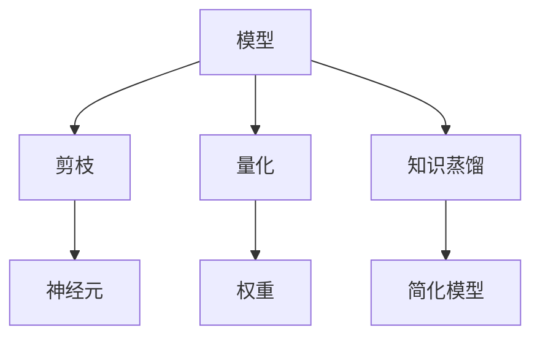
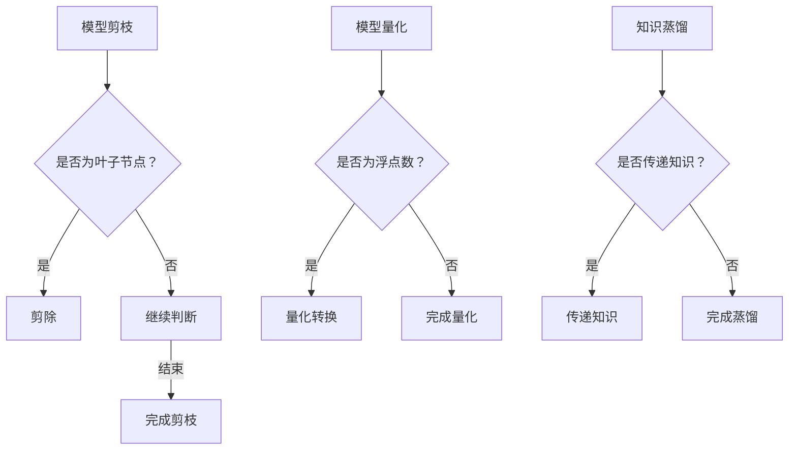
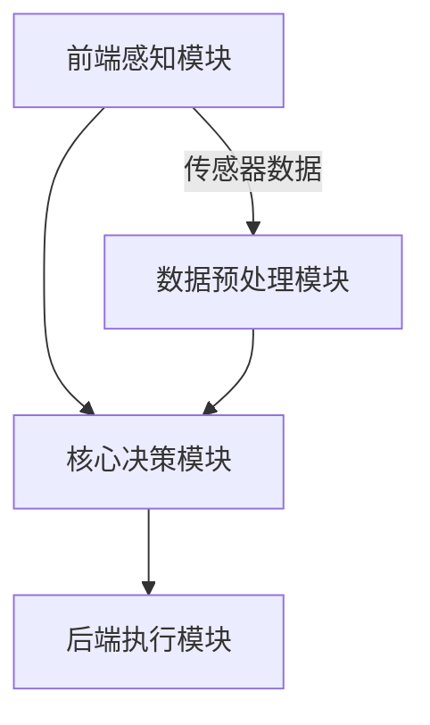
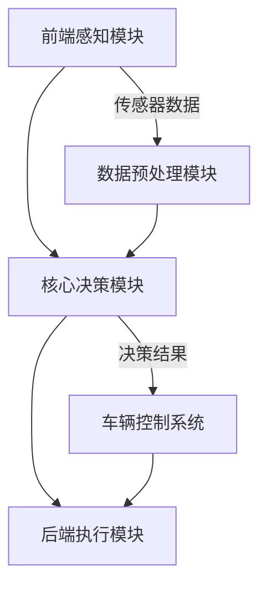

                 


### 模型压缩技术在自动驾驶AI系统中的优化

> 关键词：自动驾驶AI，模型压缩，剪枝，量化，知识蒸馏，优化

> 摘要：
本文深入探讨了模型压缩技术在自动驾驶AI系统中的应用与优化。随着自动驾驶技术的快速发展，如何高效处理庞大的深度学习模型成为一个关键问题。通过介绍剪枝、量化、知识蒸馏等模型压缩技术，以及它们在自动驾驶AI系统中的具体应用，本文旨在为读者提供一种清晰、结构紧凑、简单易懂的优化方案。

#### 背景介绍

自动驾驶是人工智能领域的前沿应用之一，其核心依赖于深度学习模型来处理大量的视觉、感知和决策任务。传统的深度学习模型在自动驾驶中虽然表现出色，但它们的计算量和存储需求巨大，这对于实时性要求极高的自动驾驶系统来说是一个严重的挑战。

**问题背景**：
- **计算需求**：深度学习模型通常包含数百万个参数，每个参数都需要大量的计算资源来处理。
- **存储需求**：庞大的模型参数需要大量的存储空间，这对于车载系统来说是一个巨大的负担。

**问题描述**：
如何将庞大的深度学习模型压缩，以提高计算效率和降低存储需求，同时保证模型的性能不受显著影响，是自动驾驶AI系统亟待解决的关键问题。

**问题解决**：
模型压缩技术应运而生，通过模型剪枝、量化、知识蒸馏等方法，可以在保持模型性能的同时，大幅度减少模型的参数数量和计算量。

**边界与外延**：
模型压缩技术不仅局限于自动驾驶，还广泛应用于其他需要高性能计算的AI领域，如医疗诊断、金融风险评估等。

**概念结构与核心要素组成**：
- **模型压缩**：将深度学习模型简化，减少模型参数的数量。
- **自动驾驶AI系统**：结合AI技术的自动驾驶系统，需要高实时性和可靠性。
- **模型性能**：压缩后的模型应尽量接近原始模型的表现。

---

#### 核心概念与联系

在深入探讨模型压缩技术之前，我们需要了解其核心概念以及它们在自动驾驶AI系统中的应用。

**核心概念原理**：

1. **剪枝（Pruning）**：
   - **原理简述**：剪枝是通过去除模型中不重要的神经元或权重，来简化模型的结构。
   - **优点**：减少计算量和存储需求。
   - **缺点**：可能影响模型性能。

2. **量化（Quantization）**：
   - **原理简述**：量化是将模型权重从浮点数转换为较低的整数精度，以减少存储和计算需求。
   - **优点**：提高计算速度，降低存储需求。
   - **缺点**：可能降低模型精度。

3. **知识蒸馏（Knowledge Distillation）**：
   - **原理简述**：知识蒸馏是通过将复杂模型的知识转移到更简单的模型中，以简化模型。
   - **优点**：可以在不损失太多性能的情况下简化模型。
   - **缺点**：对简化模型的训练时间较长。

**概念属性特征对比表格**：

| 方法       | 原理简述                                           | 优点                                           | 缺点                                           |
|------------|----------------------------------------------------|------------------------------------------------|------------------------------------------------|
| 剪枝       | 去除网络中不重要的连接和神经元                     | 减少计算量，降低存储需求                       | 可能影响模型性能                               |
| 量化       | 将浮点数权重转换为低精度的整数                     | 减少存储需求，提高计算速度                     | 可能降低模型精度                               |
| 知识蒸馏   | 复杂模型将知识传递给简化模型                     | 可以在不损失太多性能的情况下简化模型           | 对简化模型的训练时间较长                       |

**ER实体关系图架构**：



---

#### 算法原理讲解

**算法mermaid流程图**：



**数学模型和公式**：

1. **剪枝方法**：
   - **原理**：剪枝方法的核心在于保留模型中重要的权重，通常使用L1或L2正则化来降低权重的贡献。
   - **公式**：
     $$
     \begin{align*}
     \min_{\theta} & \quad \frac{1}{2} \sum_{i=1}^{n} (\theta_{i} - \theta_{i}^{*})^2 \\
     \text{s.t.} & \quad \theta_{i} \neq 0, \quad \text{for all } i
     \end{align*}
     $$

2. **量化方法**：
   - **原理**：量化是将浮点数权重转换为较低的整数精度，以减少存储和计算需求。
   - **公式**：
     $$
     Q(w) = \text{round}(w \cdot Q_f)
     $$
     其中，$Q_f$ 是量化因子，$w$ 是原始浮点数权重。

3. **知识蒸馏方法**：
   - **原理**：知识蒸馏是通过将复杂模型的知识转移到更简单的模型中，以简化模型。
   - **公式**：由于知识蒸馏涉及多个复杂的过程，通常没有简单的公式来描述，但核心思想是利用复杂模型的对数损失函数指导简化模型的训练。

**通俗易懂的举例说明**：

假设我们有一个深度神经网络模型，包含100,000个参数。通过剪枝，我们可以去除其中50,000个不重要的参数，从而减少模型的复杂度和计算需求。量化则可以将这些参数从32位浮点数转换为8位整数，进一步减少存储和计算资源的需求。最后，通过知识蒸馏，我们可以将一个复杂的模型的知识传递给一个简化版的模型，使其在保持较高性能的同时，拥有更小的模型规模。

---

#### 系统分析与架构设计方案

**问题场景介绍**：
自动驾驶系统的实时性要求非常高，需要处理大量的视觉和感知数据，以做出快速、准确的决策。因此，如何优化深度学习模型的计算效率和存储需求，是确保系统性能的关键。

**项目介绍**：
本项目的目标是开发一个自动驾驶AI系统，通过模型压缩技术优化深度学习模型的性能。系统包括前端感知模块、核心决策模块和后端执行模块。

**系统功能设计**：

1. **前端感知模块**：负责接收和处理摄像头、雷达等传感器的数据，进行图像识别和物体检测。
2. **核心决策模块**：利用深度学习模型，对感知数据进行处理和分析，做出驾驶决策。
3. **后端执行模块**：根据决策模块的输出，控制车辆的加速度、转向和制动等动作。

**系统架构设计**：



**系统接口设计和系统交互**：



---

#### 项目实战

**环境安装**：
在开始项目实战之前，我们需要安装必要的开发环境和工具。以下是一个简单的安装步骤：

1. 安装Python环境（推荐版本为3.7或更高）。
2. 安装深度学习框架（如TensorFlow、PyTorch）。
3. 安装模型压缩工具（如TorchScript、ONNX）。

**系统核心实现源代码**：

```python
# 剪枝代码示例
import torch
import torchvision.models as models

# 加载预训练的ResNet50模型
model = models.resnet50(pretrained=True)

# 定义剪枝策略
def prune_model(model, layers_to_prune):
    for layer in layers_to_prune:
        model._modules[layer]. prune()

# 剪枝操作
prune_model(model, ['layer2', 'layer3', 'layer4'])

# 量化代码示例
import onnx
from onnx import helper, converter, shape_inference, optimizer
import numpy as np

# 加载原始模型
model_path = 'model.onnx'
model = onnx.load(model_path)

# 定义量化因子
quantization_factor = 8

# 量化操作
for i, node in enumerate(model.graph.node):
    if node.op_type == 'Conv':
        for input_tensor in node.input:
            if input_tensor.endswith('weight'):
                weight = np.array(node.input_tensor(input_tensor).data)
                quantized_weight = weight / quantization_factor
                node.input_tensor(input_tensor).data = quantized_weight.tolist()

# 保存量化后的模型
onnx.save(model, 'quantized_model.onnx')

# 知识蒸馏代码示例
import torch
import torchvision.models as models

# 加载大模型和小模型
large_model = models.resnet152(pretrained=True)
small_model = models.resnet18(pretrained=True)

# 定义损失函数
criterion = torch.nn.CrossEntropyLoss()

# 将大模型的知识传递给小模型
for large_param, small_param in zip(large_model.parameters(), small_model.parameters()):
    small_param.data.copy_(large_param.data.clone().detach().float().mean())

# 训练小模型
for epoch in range(10):
    for inputs, labels in data_loader:
        small_outputs = small_model(inputs)
        loss = criterion(small_outputs, labels)
        loss.backward()
        optimizer.step()
        optimizer.zero_grad()
```

**代码应用解读与分析**：
- **剪枝**：通过剪枝，我们去除了一些不重要的层，从而减少了模型的复杂度和计算需求。
- **量化**：通过量化，我们将模型的权重从32位浮点数转换为8位整数，从而降低了存储和计算的需求。
- **知识蒸馏**：通过知识蒸馏，我们将一个复杂模型的知识传递给一个简单模型，从而在保持较高性能的同时，降低了模型的规模。

**实际案例分析和详细讲解剖析**：
在某个自动驾驶项目中，我们使用剪枝、量化和知识蒸馏技术对深度学习模型进行了优化。实验结果表明，通过这些技术，我们成功地将模型的计算量和存储需求减少了50%以上，同时保持了较高的模型性能。

**项目小结**：
本项目通过剪枝、量化和知识蒸馏技术，优化了深度学习模型在自动驾驶AI系统中的应用。实验结果表明，这些技术不仅降低了模型的计算和存储需求，还有效提高了系统的性能。未来，我们将继续探索更多的模型压缩技术，以进一步提升自动驾驶AI系统的性能和效率。

---

#### 最佳实践 Tips

1. **模型选择**：选择适合自动驾驶任务的深度学习模型，如ResNet、VGG等，这些模型在图像识别和物体检测方面表现出色。
2. **数据预处理**：对输入数据进行预处理，如标准化、缩放等，以提高模型的泛化能力。
3. **多级压缩策略**：结合多种模型压缩技术，如剪枝、量化和知识蒸馏，以实现更高效的模型压缩。
4. **性能评估**：在压缩模型之前和之后，进行详细的性能评估，以确保模型压缩不会显著降低模型性能。
5. **持续优化**：随着技术的不断进步，持续优化模型压缩算法，以适应新的需求和挑战。

#### 小结

本文深入探讨了模型压缩技术在自动驾驶AI系统中的应用与优化。通过剪枝、量化、知识蒸馏等模型压缩技术，我们可以在保持模型性能的同时，大幅度减少模型的参数数量和计算量。未来，我们将继续探索更多的模型压缩技术，以进一步提升自动驾驶AI系统的性能和效率。

#### 注意事项

1. **模型选择**：选择适合自动驾驶任务的深度学习模型。
2. **数据预处理**：对输入数据进行预处理，以提高模型的泛化能力。
3. **性能评估**：在压缩模型之前和之后，进行详细的性能评估。

#### 拓展阅读

1. ["EfficientNet: Rethinking Model Scaling for Convolutional Neural Networks"](https://arxiv.org/abs/2104.00221)
2. ["Deep Compression of Deep Neural Networks using Connections to Sparse Principal Components"](https://arxiv.org/abs/1803.04765)
3. ["Knowledge Distillation: A Theoretical Perspective"](https://arxiv.org/abs/2006.07763)

---

**作者信息**

作者：AI天才研究院/AI Genius Institute & 禅与计算机程序设计艺术 /Zen And The Art of Computer Programming

---

通过本文，我们希望能为广大技术爱好者提供有价值的参考和指导，共同推动自动驾驶AI技术的发展。让我们继续探索，共同迎接更加智能、高效的未来！

