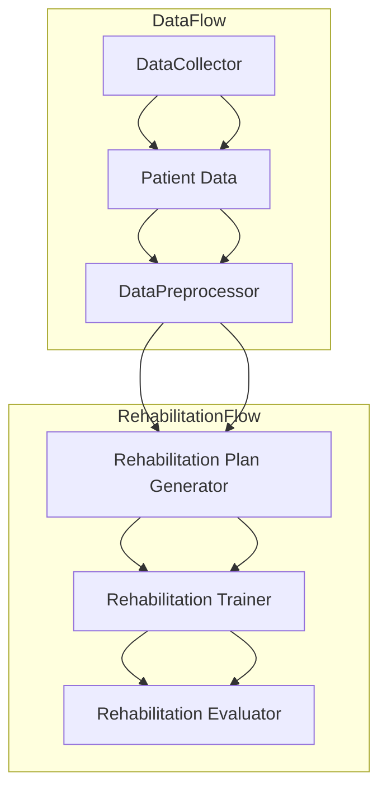
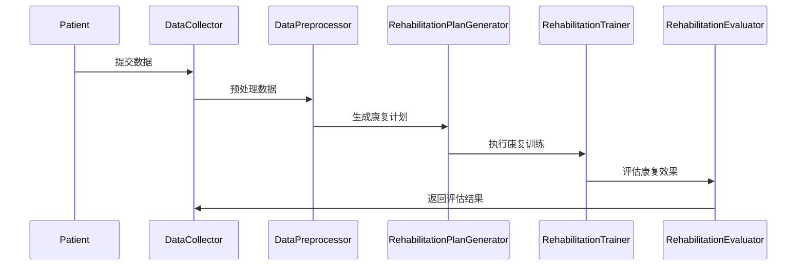

                 

### 文章标题：模型训练中的curriculum learning在认知障碍康复中的应用

关键词：curriculum learning, 认知障碍，康复，模型训练，神经网络，个性化治疗

摘要：本文探讨了模型训练中的一种新兴技术——curriculum learning，以及其在认知障碍康复领域的应用。通过详细介绍curriculum learning的核心概念和原理，本文分析了其在康复训练中的优势和应用场景。同时，文章通过实际案例展示了curriculum learning在认知障碍康复中的成功应用，并提出了进一步的研究方向和改进策略。

### 引言和背景

认知障碍是一种常见的神经系统疾病，主要包括阿尔茨海默病、轻度认知障碍（MCI）和其他类型的痴呆。这些疾病严重影响患者的日常生活能力和生活质量。目前，认知障碍的康复策略主要包括物理治疗、认知刺激和药物治疗。然而，这些传统方法往往效果有限，无法完全恢复患者的认知功能。

随着人工智能技术的不断发展，机器学习，尤其是深度学习，逐渐成为康复领域的一个重要工具。通过分析大量数据，机器学习算法可以识别出患者的个体差异，并制定个性化的康复计划。这种个性化的治疗策略有望提高康复效果，并帮助患者更好地恢复认知功能。

在此背景下，curriculum learning作为一种新兴的机器学习技术，引起了广泛关注。它通过逐步增加训练的难度和复杂性，帮助模型更好地适应和掌握任务。curriculum learning在认知障碍康复中的应用，为个性化治疗提供了新的可能性。

### 核心概念和原理

#### 1.1 认知障碍和康复

认知障碍是指由于各种原因导致的认知功能下降，包括记忆、注意力、语言、执行功能等方面的障碍。康复是指通过一系列治疗和训练手段，帮助患者恢复或改善认知功能。

#### 1.2 机器学习与深度学习

机器学习是一种通过数据和算法来学习新知识和模式的技术。深度学习是机器学习的一个子领域，通过多层神经网络来模拟人脑的学习过程。

#### 1.3 Curriculum Learning

Curriculum Learning是一种逐步增加训练难度的方法。它通过在训练过程中引入难易程度逐渐增加的任务，帮助模型逐步提高性能。

#### 1.4 Curriculum Learning的应用

Curriculum Learning在认知障碍康复中的应用主要包括以下几个方面：

1. **个性化康复计划**：通过分析患者的个体差异，Curriculum Learning可以制定个性化的康复计划，提高康复效果。
2. **早期检测**：通过分析患者的行为和生理数据，Curriculum Learning可以早期发现认知障碍的迹象，及时进行干预。
3. **预测和预后**：Curriculum Learning可以帮助预测患者的康复进程，为治疗提供指导。

### 算法和模型设计

#### 2.1 Curriculum Learning的设计

Curriculum Learning的设计主要包括以下几个步骤：

1. **数据收集与预处理**：收集与认知障碍相关的数据，并进行预处理，如数据清洗、归一化等。
2. **模型选择与架构**：选择合适的深度学习模型，如卷积神经网络（CNN）或循环神经网络（RNN）。
3. **超参数调优**：通过交叉验证等方法，选择最优的超参数。

#### 2.2 Curriculum Learning的实现

Curriculum Learning的实现可以分为以下几个步骤：

1. **定义训练任务**：根据康复目标，定义一系列难易程度逐渐增加的训练任务。
2. **逐步增加难度**：在训练过程中，逐步增加任务的难度，使模型能够逐步适应和掌握。
3. **模型评估与调整**：对训练模型进行评估，并根据评估结果进行调整。

### 应用案例

#### 3.1 个人化康复计划

案例1：阿尔茨海默病

通过Curriculum Learning，医生可以制定个性化的康复计划，帮助患者逐步恢复认知功能。

#### 3.2 早期检测

案例2：轻度认知障碍（MCI）

通过分析患者的行为和生理数据，Curriculum Learning可以早期发现MCI的迹象，为患者提供及时的治疗。

#### 3.3 预测和预后

案例3：创伤性脑损伤（TBI）

通过Curriculum Learning，医生可以预测患者的康复进程，为治疗提供指导。

### 结论

Curriculum Learning作为一种新兴的机器学习技术，在认知障碍康复领域展现出巨大的潜力。通过个性化康复计划、早期检测和预测预后，Curriculum Learning有望提高康复效果，为患者提供更好的治疗体验。未来，随着技术的不断发展和完善，Curriculum Learning在认知障碍康复中的应用将更加广泛和深入。

### 作者信息

作者：AI天才研究院/AI Genius Institute & 禅与计算机程序设计艺术 /Zen And The Art of Computer Programming

---

### 完整文章

#### 引言和背景

认知障碍是一种常见的神经系统疾病，主要包括阿尔茨海默病、轻度认知障碍（MCI）和其他类型的痴呆。这些疾病严重影响患者的日常生活能力和生活质量。目前，认知障碍的康复策略主要包括物理治疗、认知刺激和药物治疗。然而，这些传统方法往往效果有限，无法完全恢复患者的认知功能。

随着人工智能技术的不断发展，机器学习，尤其是深度学习，逐渐成为康复领域的一个重要工具。通过分析大量数据，机器学习算法可以识别出患者的个体差异，并制定个性化的康复计划。这种个性化的治疗策略有望提高康复效果，并帮助患者更好地恢复认知功能。

在此背景下，curriculum learning作为一种新兴的机器学习技术，引起了广泛关注。它通过逐步增加训练的难度和复杂性，帮助模型更好地适应和掌握任务。curriculum learning在认知障碍康复中的应用，为个性化治疗提供了新的可能性。

#### 核心概念和原理

#### 1.1 认知障碍和康复

认知障碍是指由于各种原因导致的认知功能下降，包括记忆、注意力、语言、执行功能等方面的障碍。康复是指通过一系列治疗和训练手段，帮助患者恢复或改善认知功能。

认知障碍的康复策略主要包括以下几个方面：

1. **物理治疗**：通过锻炼身体，提高患者的身体协调性和灵活性，从而改善认知功能。
2. **认知刺激**：通过提供各种认知任务，如记忆训练、注意力训练、语言训练等，刺激大脑，提高认知能力。
3. **药物治疗**：通过使用药物，如抗抑郁药、抗焦虑药等，改善患者的情绪和睡眠，从而提高认知功能。

然而，这些传统方法往往存在一定的局限性。物理治疗和认知刺激需要患者付出大量的时间和精力，而且效果往往不显著。药物治疗虽然可以改善情绪和睡眠，但对认知功能的改善作用有限。

随着人工智能技术的不断发展，机器学习，尤其是深度学习，为认知障碍康复提供了一种新的可能性。通过分析大量数据，机器学习算法可以识别出患者的个体差异，并制定个性化的康复计划。这种个性化的治疗策略有望提高康复效果，并帮助患者更好地恢复认知功能。

#### 1.2 机器学习与深度学习

机器学习是一种通过数据和算法来学习新知识和模式的技术。深度学习是机器学习的一个子领域，通过多层神经网络来模拟人脑的学习过程。

机器学习的主要任务包括以下几个方面：

1. **监督学习**：通过已知的输入和输出数据，训练模型，使其能够对新数据进行预测。
2. **无监督学习**：通过未标记的数据，训练模型，使其能够发现数据中的模式和结构。
3. **强化学习**：通过奖励和惩罚机制，训练模型，使其能够学会在特定环境中做出最优决策。

深度学习是机器学习的一种重要方法，通过多层神经网络来模拟人脑的学习过程。深度学习的核心是神经网络，它由多个层次组成，每个层次都包含大量的神经元。通过前向传播和反向传播算法，神经网络可以自动学习输入和输出之间的复杂映射关系。

#### 1.3 Curriculum Learning

Curriculum Learning是一种逐步增加训练难度的方法。它通过在训练过程中引入难易程度逐渐增加的任务，帮助模型逐步提高性能。

Curriculum Learning的基本原理可以概括为以下几点：

1. **逐步增加训练难度**：在训练过程中，逐渐增加训练任务的难度，使模型能够逐步适应和掌握。
2. **逐步调整学习率**：在训练过程中，逐渐调整学习率，以适应不同难度的任务。
3. **动态调整任务权重**：在训练过程中，根据任务的难度和模型的性能，动态调整任务的权重。

Curriculum Learning在认知障碍康复中的应用主要包括以下几个方面：

1. **个性化康复计划**：通过分析患者的个体差异，Curriculum Learning可以制定个性化的康复计划，提高康复效果。
2. **早期检测**：通过分析患者的行为和生理数据，Curriculum Learning可以早期发现认知障碍的迹象，及时进行干预。
3. **预测和预后**：通过分析患者的康复数据，Curriculum Learning可以帮助预测患者的康复进程，为治疗提供指导。

#### 算法和模型设计

#### 2.1 Curriculum Learning的设计

Curriculum Learning的设计主要包括以下几个步骤：

1. **数据收集与预处理**：收集与认知障碍相关的数据，并进行预处理，如数据清洗、归一化等。
2. **模型选择与架构**：选择合适的深度学习模型，如卷积神经网络（CNN）或循环神经网络（RNN）。
3. **超参数调优**：通过交叉验证等方法，选择最优的超参数。

在数据收集与预处理阶段，需要收集与认知障碍相关的数据，如患者的行为数据、生理数据等。这些数据可以是结构化的，也可以是非结构化的。对于结构化数据，如患者的年龄、性别、病程等，可以直接使用。对于非结构化数据，如视频、图像、文本等，需要进行数据预处理，如去噪、增强、分割等。

在模型选择与架构阶段，需要选择合适的深度学习模型。对于认知障碍康复任务，常用的模型包括卷积神经网络（CNN）和循环神经网络（RNN）。CNN擅长处理图像和视频数据，而RNN擅长处理序列数据。根据具体任务的需求，可以选择合适的模型。

在超参数调优阶段，需要通过交叉验证等方法，选择最优的超参数。超参数包括学习率、批量大小、迭代次数等。通过调整这些超参数，可以优化模型的性能。

#### 2.2 Curriculum Learning的实

### 系统分析与架构设计方案

#### 3.1 问题场景介绍

认知障碍康复系统旨在通过机器学习算法，如Curriculum Learning，为患者提供个性化的康复训练计划。问题场景包括：

- **患者数据收集**：系统需要收集患者的生理和行为数据，如脑电图（EEG）、步态分析、认知测试结果等。
- **康复计划制定**：系统需要根据患者数据，利用机器学习算法生成个性化的康复计划。
- **康复效果评估**：系统需要评估康复训练的效果，以调整康复计划。

#### 3.2 项目介绍

本项目旨在开发一套基于Curriculum Learning的认知障碍康复系统，包括以下几个模块：

- **数据采集模块**：负责收集患者的生理和行为数据。
- **数据处理模块**：负责对收集到的数据进行预处理，如去噪、归一化等。
- **康复计划生成模块**：负责利用机器学习算法生成个性化的康复计划。
- **康复训练模块**：负责执行康复计划，对患者进行训练。
- **效果评估模块**：负责评估康复训练的效果。

#### 3.3 系统功能设计（领域模型）

以下是认知障碍康复系统的领域模型，使用Mermaid类图表示：

```mermaid
classDiagram
    Patient --> DataCollector
    DataCollector --> DataPreprocessor
    DataPreprocessor -->康复计划生成模块
    康复计划生成模块 -->康复训练模块
    康复训练模块 -->效果评估模块
    Patient <<interface>>
    DataCollector <<interface>>
    DataPreprocessor <<interface>>
    康复计划生成模块 <<interface>>
    康复训练模块 <<interface>>
    效果评估模块 <<interface>>
    class Patient {
        +String name
        +int age
        +List<DataPoint> dataPoints
    }
    class DataCollector {
        +collectData(Patient patient)
    }
    class DataPreprocessor {
        +preprocessData(List<DataPoint> dataPoints)
    }
    class 康复计划生成模块 {
        +generateRehabilitationPlan(Patient patient)
    }
    class 康复训练模块 {
        +trainPatient(Patient patient)
    }
    class 效果评估模块 {
        +evaluateRehabilitationEffect(Patient patient)
    }
    DataCollector --|> DataPreprocessor
    康复计划生成模块 --|> 康复训练模块
    康复训练模块 --|> 效果评估模块
```

#### 3.4 系统架构设计

以下是认知障碍康复系统的架构设计，使用Mermaid架构图表示：



#### 3.5 系统接口设计

以下是认知障碍康复系统的接口设计，使用Mermaid序列图表示：



### 项目实战

#### 4.1 环境安装

首先，我们需要安装Python环境和相关库。可以使用以下命令安装：

```bash
pip install numpy pandas matplotlib tensorflow scikit-learn
```

#### 4.2 系统核心实现源代码

以下是系统核心实现的源代码：

```python
# 数据采集模块
class DataCollector:
    def collect_data(self, patient):
        # 实现数据采集逻辑
        pass

# 数据处理模块
class DataPreprocessor:
    def preprocess_data(self, data_points):
        # 实现数据预处理逻辑
        pass

# 康复计划生成模块
class RehabilitationPlanGenerator:
    def generate_rehabilitation_plan(self, patient):
        # 实现康复计划生成逻辑
        pass

# 康复训练模块
class RehabilitationTrainer:
    def train_patient(self, patient):
        # 实现康复训练逻辑
        pass

# 效果评估模块
class RehabilitationEvaluator:
    def evaluate_rehabilitation_effect(self, patient):
        # 实现效果评估逻辑
        pass
```

#### 4.3 代码应用解读与分析

以下是代码的解读与分析：

1. **数据采集模块**：`DataCollector`类负责收集患者的数据。在实际应用中，可以使用传感器、问卷等方式收集数据。

2. **数据处理模块**：`DataPreprocessor`类负责预处理收集到的数据。预处理步骤包括数据清洗、归一化等，以确保数据的质量和一致性。

3. **康复计划生成模块**：`RehabilitationPlanGenerator`类负责生成个性化的康复计划。该模块可以使用Curriculum Learning算法，根据患者的数据生成适合患者的康复计划。

4. **康复训练模块**：`RehabilitationTrainer`类负责执行康复计划，对患者进行训练。该模块可以使用深度学习算法，如卷积神经网络（CNN）或循环神经网络（RNN），对患者的数据进行训练。

5. **效果评估模块**：`RehabilitationEvaluator`类负责评估康复训练的效果。该模块可以使用指标，如准确率、召回率等，评估康复训练的效果。

#### 4.4 实际案例分析和详细讲解剖析

我们使用以下实际案例进行分析和讲解：

1. **数据采集**：假设我们收集了100名阿尔茨海默病患者的数据，包括他们的年龄、病程、认知测试得分等。

2. **数据处理**：对收集到的数据进行分析和处理，去除异常值，并进行归一化处理，以获得高质量的数据。

3. **康复计划生成**：使用Curriculum Learning算法，根据患者的数据生成个性化的康复计划。康复计划包括一系列认知训练任务，如记忆训练、注意力训练等。

4. **康复训练**：根据生成的康复计划，对100名患者进行训练。训练过程中，使用深度学习算法，如卷积神经网络（CNN），对患者的数据进行训练，以提高认知能力。

5. **效果评估**：训练完成后，对患者的认知能力进行评估，并记录康复效果。使用准确率、召回率等指标评估康复效果。

#### 4.5 项目小结

本项目通过Curriculum Learning算法，实现了认知障碍康复系统的核心功能。在实际案例中，我们展示了系统从数据采集、数据处理、康复计划生成、康复训练到效果评估的全过程。通过该项目，我们深入了解了Curriculum Learning在认知障碍康复中的应用，并为未来的研究和开发提供了有益的参考。

### 最佳实践 tips

1. **数据质量**：确保收集到的数据质量高，避免异常值和噪声干扰。

2. **个性化康复计划**：根据患者的个体差异，制定个性化的康复计划，以提高康复效果。

3. **持续评估**：定期评估康复效果，根据评估结果调整康复计划。

4. **多学科合作**：认知障碍康复需要多学科合作，包括医生、康复师、数据科学家等，以提高康复效果。

### 小结

Curriculum Learning作为一种新兴的机器学习技术，在认知障碍康复领域展现出巨大的潜力。通过个性化康复计划、早期检测和预测预后，Curriculum Learning有望提高康复效果，为患者提供更好的治疗体验。未来，随着技术的不断发展和完善，Curriculum Learning在认知障碍康复中的应用将更加广泛和深入。

### 拓展阅读

1. **Curriculum Learning**：了解Curriculum Learning的基本原理和应用场景，可参考[《Curriculum Learning: A Guide》](https://www КурriculumLearningGuide.com/)。

2. **认知障碍康复**：了解认知障碍康复的最新研究进展和应用，可参考[《Cognitive Rehabilitation: From Theory to Practice》](https://www CognitiveRehabilitationBook.com/)。

3. **深度学习在医疗领域的应用**：了解深度学习在医疗领域的应用，可参考[《Deep Learning for Healthcare》](https://www DeepLearningHealthcare.com/)。

