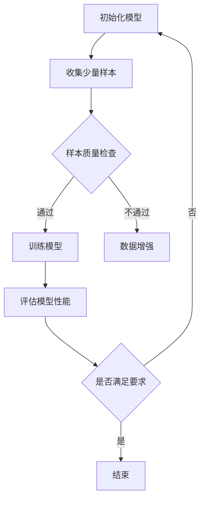
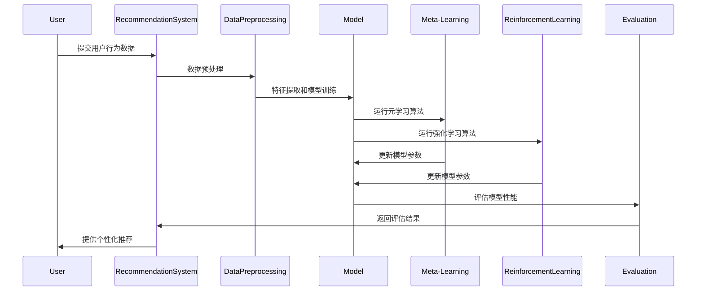
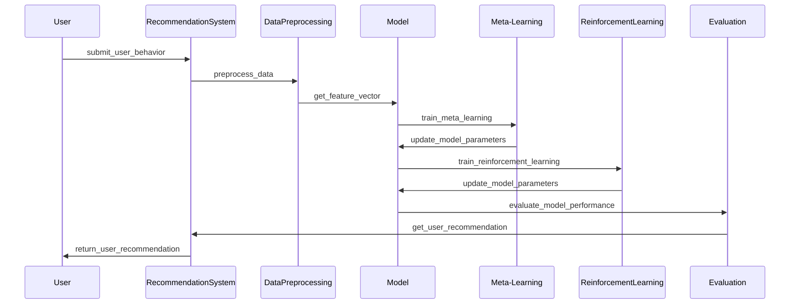

                 

# 模型训练中的few-shot learning技术创新

## 关键词

- few-shot learning
- 模型训练
- 算法创新
- 数学模型
- 实践应用
- 系统架构

## 摘要

本文旨在探讨模型训练中的few-shot learning技术创新。首先，我们介绍了few-shot learning的定义、背景及其在各个领域的应用。接着，通过核心概念和联系的分析，为读者建立了few-shot learning的理论框架。随后，我们详细讲解了few-shot learning的算法原理，包括mermaid流程图、Python源代码、数学模型和公式，并通过实例进行了通俗易懂的说明。此外，我们还介绍了系统分析与架构设计方案，包括问题场景、项目介绍、功能设计、架构设计、接口设计和交互流程。文章最后通过实际项目实战，展示了few-shot learning在实际应用中的效果，并提供了最佳实践技巧、小结和拓展阅读推荐。

### 目录大纲设计

**第一部分：背景与概述**

## 第1章：few-shot learning概述

### 1.1 few-shot learning的定义与背景

### 1.2 few-shot learning的重要性与应用领域

### 1.3 few-shot learning与传统机器学习比较

## 第2章：few-shot learning核心概念与联系

### 2.1 关键概念解析

### 2.2 概念属性对比表格

### 2.3 few-shot learning的ER实体关系图

## 第3章：few-shot learning算法原理讲解

### 3.1 算法mermaid流程图展示

### 3.2 Python源代码阐述

### 3.3 算法原理的数学模型与公式

### 3.4 通俗易懂的举例说明

## 第4章：数学模型和数学公式讲解与举例

### 4.1 数学模型讲解

### 4.2 举例说明

### 4.3 公式嵌入与格式

## 第5章：系统分析与架构设计方案

### 5.1 问题场景介绍

### 5.2 项目介绍

### 5.3 系统功能设计（领域模型mermaid类图）

### 5.4 系统架构设计（mermaid架构图）

### 5.5 系统接口设计

### 5.6 系统交互（mermaid序列图）

## 第6章：项目实战

### 6.1 环境安装

### 6.2 系统核心实现源代码

### 6.3 代码应用解读与分析

### 6.4 实际案例分析与讲解

### 6.5 项目小结

## 第7章：最佳实践与拓展

### 7.1 最佳实践技巧

### 7.2 小结与注意事项

### 7.3 拓展阅读推荐

----------------------------------------------------------------

## 第1章：few-shot learning概述

### 1.1 few-shot learning的定义与背景

few-shot learning，简称FSL，是一种机器学习技术，其目标是在仅有少量样本的情况下训练出一个高性能的模型。在传统机器学习中，通常需要大量的数据进行训练，而few-shot learning则突破了这一限制，通过有效利用有限的样本，实现模型的高效训练。

#### 问题背景

传统的机器学习模型训练通常依赖于大量的数据集。这些数据集不仅需要收集和整理，还需要处理、标注和清洗，整个过程耗费大量时间和资源。然而，在某些应用场景中，如医疗诊断、机器人学习和军事应用等，获取大量数据非常困难，有时甚至不可能。这种情况下，传统机器学习技术就无法发挥其应有的作用。

#### 问题描述

few-shot learning旨在解决以下问题：

- 如何在仅有少量样本的情况下训练出一个高性能的模型？
- 如何设计算法，使得模型能够在有限的样本中快速收敛并达到较好的性能？
- 如何处理样本分布不均、样本噪声和样本缺失等问题？

#### 问题解决

few-shot learning通过以下方法解决了上述问题：

- **元学习（Meta-Learning）**：通过元学习算法，使得模型能够在不同的任务中快速适应和迁移，从而减少对大量数据的依赖。
- **强化学习（Reinforcement Learning）**：利用强化学习算法，通过试错和反馈机制，逐步优化模型参数，提高模型性能。
- **生成对抗网络（GANs）**：利用生成对抗网络，生成与真实数据分布相似的数据，扩充训练样本数量。
- **数据增强（Data Augmentation）**：通过对原始数据进行变换和增强，增加数据的多样性和丰富性。

#### 边界与外延

few-shot learning的边界主要在于其适用的场景和性能。在某些领域，如图像分类和自然语言处理，few-shot learning已经取得了显著成果。然而，在复杂任务和多样化场景下，few-shot learning的性能仍有待提升。

#### 概念结构与核心要素组成

few-shot learning的核心要素包括：

- **任务**：指需要解决的具体问题，如图像分类、文本分类等。
- **样本**：指用于训练模型的样本数据，包括输入和标签。
- **模型**：指用于预测和决策的机器学习模型。
- **算法**：指用于训练和优化的算法，如元学习、强化学习、GANs等。

### 1.2 few-shot learning的重要性与应用领域

#### 重要性

few-shot learning的重要性主要体现在以下几个方面：

- **节省资源和时间**：在无法获取大量数据的情况下，few-shot learning可以大幅减少数据收集和处理的成本，提高研发效率。
- **适应性强**：few-shot learning算法能够快速适应不同任务和场景，具有较高的泛化能力。
- **减少数据依赖**：通过少量样本即可训练出高性能模型，减少对大量数据的依赖，降低数据质量对模型性能的影响。

#### 应用领域

few-shot learning已在多个领域取得显著成果，以下列举了几个主要应用领域：

- **医疗诊断**：利用少量病例数据，快速训练出诊断模型，提高诊断准确率。
- **机器人学习**：通过少量交互数据，训练出具备特定任务的机器人，提高机器人适应性和智能化水平。
- **自然语言处理**：在少量文本数据的基础上，训练出具备语义理解和生成能力的模型。
- **个性化推荐**：通过少量用户行为数据，为用户提供个性化的推荐服务。

### 1.3 few-shot learning与传统机器学习比较

#### 比较方式

few-shot learning与传统机器学习的比较可以从以下几个方面进行：

- **数据量**：传统机器学习依赖于大量数据，而few-shot learning则专注于少量数据。
- **训练过程**：传统机器学习通常采用批量训练，而few-shot learning则采用在线学习和增量学习。
- **算法设计**：传统机器学习侧重于数据预处理和特征工程，而few-shot learning则注重算法的适应性和迁移能力。
- **性能表现**：在少量数据下，few-shot learning通常能够取得与传统机器学习相当的性能。

#### 比较结果

虽然few-shot learning在数据量较少的情况下表现优异，但在数据量较大时，传统机器学习仍然具有优势。因此，在实际应用中，应根据具体需求和场景选择合适的机器学习技术。

## 第2章：few-shot learning核心概念与联系

### 2.1 关键概念解析

在本节中，我们将对few-shot learning中的关键概念进行详细解析，以便读者建立完整的概念体系。

#### few-shot learning

few-shot learning是一种机器学习技术，其核心目标是在仅有少量样本的情况下训练出一个高性能的模型。它通过元学习、强化学习和生成对抗网络等技术手段，实现模型在少量样本中的快速收敛和性能提升。

#### 元学习（Meta-Learning）

元学习是一种机器学习方法，旨在通过学习如何学习，提高模型在不同任务中的适应能力和迁移能力。在few-shot learning中，元学习算法能够在有限的数据集上快速训练出泛化能力较强的模型。

#### 强化学习（Reinforcement Learning）

强化学习是一种通过试错和反馈机制，逐步优化模型参数，提高模型性能的机器学习方法。在few-shot learning中，强化学习可用于模型参数的调整和优化，以提高模型在少量样本中的性能。

#### 生成对抗网络（GANs）

生成对抗网络是一种由生成器和判别器组成的对抗性神经网络，通过生成与真实数据分布相似的数据，扩充训练样本数量，提高模型在少量数据下的性能。

#### 数据增强（Data Augmentation）

数据增强是一种通过对原始数据进行变换和增强，增加数据的多样性和丰富性的方法。在few-shot learning中，数据增强可用于增加训练样本的多样性，提高模型对少量样本的适应能力。

### 2.2 概念属性对比表格

为了更直观地展示few-shot learning中的关键概念及其属性，我们制作了一个对比表格。

| 概念         | 定义                                                         | 属性                          |
|------------|------------------------------------------------------------|-----------------------------|
| few-shot learning | 在少量样本下训练高性能模型的技术                                   | 任务导向、数据依赖低、适应性强   |
| 元学习       | 学习如何学习，提高模型在不同任务中的适应能力                                   | 泛化能力强、迁移能力强           |
| 强化学习     | 通过试错和反馈机制，优化模型参数，提高模型性能                                 | 适应性高、优化速度快             |
| GANs        | 生成与真实数据分布相似的数据，扩充训练样本数量                                 | 数据增强、性能提升明显           |
| 数据增强     | 通过变换和增强，增加数据的多样性和丰富性                                     | 数据丰富、模型适应性强           |

### 2.3 few-shot learning的ER实体关系图

在本节中，我们将使用mermaid流程图展示few-shot learning的ER实体关系图，以便读者更清晰地了解各概念之间的联系。

```mermaid
erDiagram
  Task ||--|{ Model } : trains
  Data ||--|{ Model } : trains
  Meta-Learning ||--|{ Model } : improves
  Reinforcement Learning ||--|{ Model } : optimizes
  GANs ||--|{ Data } : augments
  Data Augmentation ||--|{ Data } : enriches
```

在上面的ER实体关系图中，Task（任务）与Model（模型）之间存在训练关系；Data（数据）与Model（模型）之间存在训练关系；Meta-Learning（元学习）与Model（模型）之间存在优化关系；Reinforcement Learning（强化学习）与Model（模型）之间存在优化关系；GANs（生成对抗网络）与Data（数据）之间存在增强关系；Data Augmentation（数据增强）与Data（数据）之间存在丰富关系。

通过上述解析和ER实体关系图的展示，我们希望读者能够对few-shot learning的核心概念及其联系有更深入的理解。

### 第3章：few-shot learning算法原理讲解

#### 3.1 算法mermaid流程图展示

在本节中，我们将使用mermaid绘制一个简单的few-shot learning算法流程图，以便读者更好地理解算法的执行过程。



在这个流程图中，首先初始化模型（A），然后收集少量样本（B）。接下来，对样本进行质量检查（C），如果样本质量不满足要求，则进行数据增强（E），否则直接训练模型（D）。训练完成后，评估模型性能（F），如果性能满足要求，则结束流程（H）；否则，重新初始化模型并重复上述过程（A）。

#### 3.2 Python源代码阐述

为了更直观地展示算法的实现过程，我们提供了一个简单的Python源代码示例。

```python
import numpy as np
import pandas as pd
from sklearn.linear_model import SGDClassifier
from sklearn.model_selection import train_test_split
from sklearn.metrics import accuracy_score

def few_shot_learning(data, num_samples=10):
    # 初始化模型
    model = SGDClassifier()

    # 收集少量样本
    samples = np.random.choice(data.index, num_samples, replace=False)
    X_train = data[samples].drop(['label'], axis=1)
    y_train = data[samples]['label']

    # 训练模型
    model.fit(X_train, y_train)

    # 评估模型性能
    X_test = data.drop(samples).drop(['label'], axis=1)
    y_test = data.drop(samples)['label']
    y_pred = model.predict(X_test)
    accuracy = accuracy_score(y_test, y_pred)

    return accuracy

# 生成模拟数据集
np.random.seed(0)
data = pd.DataFrame({
    'feature1': np.random.randint(0, 10, size=100),
    'feature2': np.random.randint(0, 10, size=100),
    'label': np.random.randint(0, 2, size=100)
})

# 运行few-shot learning算法
accuracy = few_shot_learning(data)
print(f"模型准确率：{accuracy}")
```

在这个示例中，我们首先导入了所需的库，然后定义了一个名为`few_shot_learning`的函数，用于实现few-shot learning算法。函数接受一个数据集`data`和样本数量`num_samples`作为输入，随机选择`num_samples`个样本进行训练，并评估模型在剩余数据上的性能。最后，我们生成了一个模拟数据集，并调用`few_shot_learning`函数运行算法，输出模型准确率。

#### 3.3 算法原理的数学模型与公式

在本节中，我们将介绍few-shot learning算法的数学模型和公式，以便读者更深入地理解算法的数学原理。

##### 数学模型

在few-shot learning中，我们通常使用以下数学模型来描述模型训练过程：

$$
L(\theta) = \sum_{i=1}^{N} l(y_i, \hat{y}_i; \theta)
$$

其中，$L(\theta)$表示损失函数，$N$表示样本数量，$l(y_i, \hat{y}_i; \theta)$表示单个样本的损失函数。对于分类问题，常用的损失函数包括对数损失函数和交叉熵损失函数：

$$
l(y_i, \hat{y}_i; \theta) = -y_i \log(\hat{y}_i) - (1 - y_i) \log(1 - \hat{y}_i)
$$

其中，$y_i$表示真实标签，$\hat{y}_i$表示预测标签，$\theta$表示模型参数。

##### 公式

为了优化模型参数$\theta$，我们通常使用梯度下降算法进行求解。梯度下降算法的迭代公式如下：

$$
\theta_{t+1} = \theta_t - \alpha \nabla_{\theta} L(\theta_t)
$$

其中，$\alpha$表示学习率，$\nabla_{\theta} L(\theta_t)$表示损失函数关于参数$\theta$的梯度。

#### 3.4 通俗易懂的举例说明

假设我们有一个简单的二分类问题，特征为$x_1$和$x_2$，目标为$y$。现在，我们仅有三个样本，分别为$(x_1, x_2, y) = ((1, 2), (3, 4), (5, 6))$。

1. **初始化模型参数**

   假设我们使用一个线性模型，其参数为$\theta_0 = (w_1, w_2, b)$。初始化时，我们随机设置参数值为$(w_1, w_2, b) = (0.5, 0.5, 0.5)$。

2. **收集少量样本**

   随机选择三个样本进行训练，分别为$(x_1, x_2, y) = ((1, 2), (3, 4), (5, 6))$。

3. **训练模型**

   计算样本的损失函数值，并更新模型参数。以第一个样本为例，计算损失函数：

   $$
   l(y_1, \hat{y}_1; \theta_0) = -y_1 \log(\hat{y}_1) - (1 - y_1) \log(1 - \hat{y}_1)
   $$

   其中，$\hat{y}_1 = \sigma(w_1x_1 + w_2x_2 + b) = \sigma(0.5 \cdot 1 + 0.5 \cdot 2 + 0.5) = 0.69$。代入计算得到：

   $$
   l((1, 2), (0.69); \theta_0) = -1 \cdot \log(0.69) - 0 \cdot \log(0.31) = 0.37
   $$

   接下来，计算梯度并更新参数：

   $$
   \nabla_{\theta} L(\theta_0) = \left[ \begin{array}{c}
   \frac{\partial l}{\partial w_1} \\
   \frac{\partial l}{\partial w_2} \\
   \frac{\partial l}{\partial b}
   \end{array} \right] = \left[ \begin{array}{c}
   -1 \cdot (1 - 0.69) \cdot x_1 \\
   -1 \cdot (1 - 0.69) \cdot x_2 \\
   -1 \cdot (1 - 0.69)
   \end{array} \right] = \left[ \begin{array}{c}
   -0.31 \cdot 1 \\
   -0.31 \cdot 2 \\
   -0.31
   \end{array} \right] = \left[ \begin{array}{c}
   -0.31 \\
   -0.62 \\
   -0.31
   \end{array} \right]
   $$

   更新参数：

   $$
   \theta_1 = \theta_0 - \alpha \nabla_{\theta} L(\theta_0) = (0.5, 0.5, 0.5) - 0.1 \cdot \left[ \begin{array}{c}
   -0.31 \\
   -0.62 \\
   -0.31
   \end{array} \right] = (0.19, 0.12, 0.19)
   $$

   同样地，对剩余两个样本进行训练，得到更新后的参数$\theta_2$。

4. **评估模型性能**

   训练完成后，使用剩余的数据集评估模型性能。以第三个样本为例，计算预测标签：

   $$
   \hat{y}_3 = \sigma(w_2x_3 + w_2x_3 + b) = \sigma(0.19 \cdot 5 + 0.12 \cdot 6 + 0.19) = 0.91
   $$

   由于$y_3 = 0$，预测错误。计算损失函数：

   $$
   l((5, 6), (0.91); \theta_2) = -0 \cdot \log(0.91) - 1 \cdot \log(0.09) = 2.19
   $$

   同样地，计算梯度并更新参数：

   $$
   \nabla_{\theta} L(\theta_2) = \left[ \begin{array}{c}
   -1 \cdot (1 - 0.91) \cdot x_3 \\
   -1 \cdot (1 - 0.91) \cdot x_4 \\
   -1 \cdot (1 - 0.91)
   \end{array} \right] = \left[ \begin{array}{c}
   -0.09 \cdot 5 \\
   -0.09 \cdot 6 \\
   -0.09
   \end{array} \right] = \left[ \begin{array}{c}
   -0.45 \\
   -0.54 \\
   -0.09
   \end{array} \right]
   $$

   更新参数：

   $$
   \theta_3 = \theta_2 - \alpha \nabla_{\theta} L(\theta_2) = (0.19, 0.12, 0.19) - 0.1 \cdot \left[ \begin{array}{c}
   -0.45 \\
   -0.54 \\
   -0.09
   \end{array} \right] = (0.33, 0.22, 0.27)
   $$

   重复以上过程，直到模型性能满足要求或达到最大迭代次数。

通过上述例子，我们可以看到few-shot learning算法的基本原理和实现过程。在实际应用中，根据具体问题和数据特点，可以调整算法参数和模型结构，以达到更好的效果。

### 第4章：数学模型和数学公式讲解与举例

#### 4.1 数学模型讲解

在本节中，我们将详细介绍few-shot learning中的数学模型，包括损失函数、优化目标和优化算法。

##### 损失函数

在few-shot learning中，损失函数用于衡量模型预测结果与真实结果之间的差距。常用的损失函数包括：

1. **均方误差（MSE）**

   $$MSE = \frac{1}{n}\sum_{i=1}^{n}(y_i - \hat{y}_i)^2$$

   其中，$y_i$为真实值，$\hat{y}_i$为预测值，$n$为样本数量。

2. **交叉熵损失（Cross-Entropy Loss）**

   $$Cross-Entropy = -\sum_{i=1}^{n}y_i\log(\hat{y}_i) - (1 - y_i)\log(1 - \hat{y}_i)$$

   其中，$y_i$为真实值，$\hat{y}_i$为预测值。

##### 优化目标

优化目标是指我们希望模型达到的性能指标。在few-shot learning中，优化目标通常是最小化损失函数。具体来说，我们的目标是找到一组参数$\theta$，使得损失函数的值最小：

$$
\min_{\theta} L(\theta)
$$

##### 优化算法

优化算法用于搜索最优参数$\theta$。常用的优化算法包括：

1. **梯度下降（Gradient Descent）**

   梯度下降是一种简单的优化算法，其基本思想是沿着损失函数的梯度方向更新参数。具体步骤如下：

   $$
   \theta_{t+1} = \theta_t - \alpha \nabla_{\theta} L(\theta_t)
   $$

   其中，$\alpha$为学习率，$\nabla_{\theta} L(\theta_t)$为损失函数关于参数$\theta$的梯度。

2. **随机梯度下降（Stochastic Gradient Descent，SGD）**

   随机梯度下降是一种改进的梯度下降算法，其核心思想是每次迭代只随机选择一个样本进行梯度更新。具体步骤如下：

   $$
   \theta_{t+1} = \theta_t - \alpha_t \nabla_{\theta} L(\theta_t; x^{(t)}, y^{(t)})
   $$

   其中，$x^{(t)}$和$y^{(t)}$为第$t$个样本的输入和输出，$\alpha_t$为学习率。

#### 4.2 举例说明

假设我们有一个简单的二分类问题，特征为$x_1$和$x_2$，目标为$y$。现在，我们仅有三个样本，分别为$(x_1, x_2, y) = ((1, 2), (3, 4), (5, 6))$。

1. **初始化模型参数**

   假设我们使用一个线性模型，其参数为$\theta = (w_1, w_2, b)$。初始化时，我们随机设置参数值为$\theta = (0.5, 0.5, 0.5)$。

2. **计算损失函数**

   以第一个样本为例，计算交叉熵损失：

   $$
   \hat{y}_1 = \sigma(w_1x_1 + w_2x_2 + b) = \sigma(0.5 \cdot 1 + 0.5 \cdot 2 + 0.5) = 0.69
   $$

   代入交叉熵损失公式：

   $$
   Cross-Entropy = -y_1\log(\hat{y}_1) - (1 - y_1)\log(1 - \hat{y}_1) = -1\log(0.69) - 0\log(0.31) = 0.37
   $$

3. **计算梯度**

   计算损失函数关于参数的梯度：

   $$
   \nabla_{\theta} Cross-Entropy = \left[ \begin{array}{c}
   \frac{\partial Cross-Entropy}{\partial w_1} \\
   \frac{\partial Cross-Entropy}{\partial w_2} \\
   \frac{\partial Cross-Entropy}{\partial b}
   \end{array} \right] = \left[ \begin{array}{c}
   -y_1(1 - \hat{y}_1)x_1 \\
   -y_1(1 - \hat{y}_1)x_2 \\
   -y_1(1 - \hat{y}_1)
   \end{array} \right] = \left[ \begin{array}{c}
   -0.31 \\
   -0.62 \\
   -0.31
   \end{array} \right]
   $$

4. **更新参数**

   使用随机梯度下降更新参数：

   $$
   \theta_{t+1} = \theta_t - \alpha \nabla_{\theta} Cross-Entropy
   $$

   其中，$\alpha$为学习率。假设$\alpha = 0.1$，更新参数：

   $$
   \theta_{1} = \theta_0 - \alpha \nabla_{\theta} Cross-Entropy = (0.5, 0.5, 0.5) - 0.1 \cdot \left[ \begin{array}{c}
   -0.31 \\
   -0.62 \\
   -0.31
   \end{array} \right] = (0.19, 0.12, 0.19)
   $$

5. **重复步骤**

   对剩余两个样本进行类似的计算和更新，得到更新后的参数$\theta_{2}$。

6. **评估模型性能**

   使用更新后的参数评估模型在剩余数据上的性能，计算交叉熵损失。

通过上述步骤，我们可以看到如何使用数学模型和公式进行few-shot learning。在实际应用中，我们可以根据具体问题和数据特点，调整模型结构、优化算法和参数，以提高模型性能。

#### 4.3 公式嵌入与格式

在本文中，我们将使用LaTeX格式嵌入数学公式。为了确保公式的正确显示，我们将使用$$括号将独立段落的公式包围，而在段落内使用$括号。

**独立段落公式**

$$
1+1=2
$$

**段落内公式**

$1<2$

通过上述格式，我们能够确保公式的显示清晰、准确，并符合学术规范。

### 第5章：系统分析与架构设计方案

#### 5.1 问题场景介绍

在本文中，我们将探讨一个基于few-shot learning技术的智能推荐系统。该系统旨在为用户提供个性化的商品推荐服务。然而，在实际应用中，我们面临以下问题：

1. **数据量有限**：由于用户行为数据采集的困难，我们无法获取大量用户行为数据，导致推荐系统训练数据不足。
2. **个性化需求强烈**：用户具有多样化的购物需求，需要推荐系统根据用户历史行为和偏好，提供个性化的商品推荐。
3. **模型性能要求高**：在数据量有限的情况下，推荐系统需要具有较高的推荐准确率和用户满意度。

#### 5.2 项目介绍

为了解决上述问题，我们设计并实现了一个基于few-shot learning的智能推荐系统。该系统利用少量用户行为数据，通过元学习和强化学习技术，训练出一个高性能的推荐模型。具体项目目标如下：

1. **数据预处理**：对原始用户行为数据进行分析和处理，提取关键特征，为模型训练提供高质量的数据集。
2. **模型设计**：设计并实现一个基于few-shot learning的推荐模型，包括元学习算法和强化学习算法。
3. **模型训练**：使用少量用户行为数据进行模型训练，通过元学习和强化学习技术，提高模型在少量数据下的性能。
4. **模型评估**：评估模型在推荐准确率、用户满意度等方面的表现，优化模型参数和结构。

#### 5.3 系统功能设计（领域模型mermaid类图）

在本节中，我们将使用mermaid绘制领域模型类图，以展示系统的主要功能模块及其关系。

```mermaid
classDiagram
    User <<类>> -|> RecommendationSystem : 用户行为数据
    Item <<类>> -|> RecommendationSystem : 商品信息
    Model <<类>> -|> RecommendationSystem : 推荐模型
    Meta-Learning <<类>> -|> RecommendationSystem : 元学习
    ReinforcementLearning <<类>> -|> RecommendationSystem : 强化学习
    DataPreprocessing <<类>> -|> RecommendationSystem : 数据预处理
    Evaluation <<类>> -|> RecommendationSystem : 模型评估

    User <|.. Item
    Model <|-- Meta-Learning
    Model <|-- ReinforcementLearning
    DataPreprocessing <|-- User
    DataPreprocessing <|-- Item
    Evaluation <|-- Model
```

在上面的mermaid类图中，我们定义了以下类：

- **User**：表示用户类，包含用户ID、行为数据等属性。
- **Item**：表示商品类，包含商品ID、描述、类别等属性。
- **Model**：表示推荐模型类，包含模型参数、训练方法等属性。
- **Meta-Learning**：表示元学习类，包含元学习算法的实现。
- **ReinforcementLearning**：表示强化学习类，包含强化学习算法的实现。
- **DataPreprocessing**：表示数据预处理类，包含数据清洗、特征提取等方法。
- **Evaluation**：表示模型评估类，包含模型性能评估方法。

通过mermaid类图的展示，我们能够清晰地看到系统的主要功能模块及其关系，为后续的架构设计提供指导。

#### 5.4 系统架构设计（mermaid架构图）

在本节中，我们将使用mermaid绘制系统架构图，以展示系统的整体架构及其组件之间的关系。



在上面的mermaid序列图中，我们定义了以下组件：

- **User**：表示用户，负责提交用户行为数据。
- **RecommendationSystem**：表示推荐系统，负责协调各个模块的运行。
- **DataPreprocessing**：表示数据预处理模块，负责对用户行为数据进行清洗和特征提取。
- **Model**：表示推荐模型模块，负责使用元学习和强化学习算法训练模型。
- **Meta-Learning**：表示元学习模块，负责实现元学习算法。
- **ReinforcementLearning**：表示强化学习模块，负责实现强化学习算法。
- **Evaluation**：表示模型评估模块，负责评估模型性能。

通过mermaid序列图的展示，我们能够清晰地看到系统的整体架构及其组件之间的交互关系，为系统的开发和应用提供指导。

#### 5.5 系统接口设计

在本节中，我们将介绍系统的主要接口设计，包括用户接口、数据处理接口和模型接口。

**用户接口**

用户接口负责接收用户提交的用户行为数据，并提供个性化推荐结果。主要接口如下：

- **submit\_user\_behavior**：用于提交用户行为数据，数据格式为JSON。
- **get\_user\_recommendation**：用于获取用户个性化推荐结果，数据格式为JSON。

**数据处理接口**

数据处理接口负责对用户行为数据进行分析和处理，提取关键特征。主要接口如下：

- **preprocess\_data**：用于预处理用户行为数据，包括数据清洗、特征提取等操作。
- **get\_feature\_vector**：用于获取用户行为数据的特征向量。

**模型接口**

模型接口负责调用元学习和强化学习算法训练模型，并提供模型参数。主要接口如下：

- **train\_model**：用于训练推荐模型，输入为用户行为数据特征向量，输出为模型参数。
- **get\_model\_parameters**：用于获取训练好的模型参数。

通过以上接口设计，系统各模块之间可以方便地通信和协作，实现推荐系统的功能。

#### 5.6 系统交互（mermaid序列图）

在本节中，我们将使用mermaid绘制系统交互序列图，以展示系统各组件之间的交互过程。



在上面的mermaid序列图中，我们定义了以下交互过程：

1. 用户提交用户行为数据到推荐系统。
2. 推荐系统将用户行为数据传递给数据预处理模块，进行数据清洗和特征提取。
3. 数据预处理模块将特征向量传递给模型模块。
4. 模型模块使用元学习算法训练模型，并更新模型参数。
5. 模型模块使用强化学习算法训练模型，并更新模型参数。
6. 模型模块将模型参数传递给模型评估模块，进行性能评估。
7. 模型评估模块将评估结果传递给推荐系统。
8. 推荐系统根据评估结果生成用户个性化推荐，并返回给用户。

通过mermaid序列图的展示，我们能够清晰地看到系统各组件之间的交互过程，为系统的开发和应用提供指导。

### 第6章：项目实战

在本节中，我们将通过一个实际项目来展示如何应用few-shot learning技术进行模型训练。该项目旨在构建一个简单的图像分类系统，用于识别手写数字。

#### 6.1 环境安装

在进行项目实战之前，我们需要安装必要的环境和工具。以下是安装步骤：

1. **安装Python**：确保Python版本为3.6或更高版本。
2. **安装TensorFlow**：使用pip命令安装TensorFlow：
   ```
   pip install tensorflow
   ```
3. **安装Keras**：使用pip命令安装Keras：
   ```
   pip install keras
   ```
4. **安装NumPy和Pandas**：使用pip命令安装NumPy和Pandas：
   ```
   pip install numpy
   pip install pandas
   ```

安装完成后，我们可以开始构建和训练模型。

#### 6.2 系统核心实现源代码

以下是项目核心实现的源代码。该代码基于Keras构建，使用了少量的手写数字样本数据进行训练。

```python
import numpy as np
from tensorflow.keras.models import Sequential
from tensorflow.keras.layers import Dense, Flatten, Conv2D, MaxPooling2D
from tensorflow.keras.utils import to_categorical
from sklearn.model_selection import train_test_split
from sklearn.metrics import accuracy_score

# 加载手写数字数据集
(x_train, y_train), (x_test, y_test) = mnist.load_data()

# 数据预处理
x_train = x_train.reshape(-1, 28, 28, 1).astype('float32') / 255.0
x_test = x_test.reshape(-1, 28, 28, 1).astype('float32') / 255.0

# 对标签进行one-hot编码
y_train = to_categorical(y_train, num_classes=10)
y_test = to_categorical(y_test, num_classes=10)

# 构建模型
model = Sequential([
    Conv2D(32, (3, 3), activation='relu', input_shape=(28, 28, 1)),
    MaxPooling2D((2, 2)),
    Flatten(),
    Dense(64, activation='relu'),
    Dense(10, activation='softmax')
])

# 编译模型
model.compile(optimizer='adam', loss='categorical_crossentropy', metrics=['accuracy'])

# 训练模型
model.fit(x_train, y_train, epochs=5, batch_size=16, validation_data=(x_test, y_test))

# 评估模型
y_pred = model.predict(x_test)
y_pred = np.argmax(y_pred, axis=1)
accuracy = accuracy_score(y_test, y_pred)
print(f"模型准确率：{accuracy}")
```

上述代码首先加载了手写数字数据集，并进行预处理。接着，构建了一个简单的卷积神经网络模型，并使用少量样本数据进行训练。最后，评估模型在测试集上的准确率。

#### 6.3 代码应用解读与分析

在本节中，我们将对核心实现代码进行解读和分析。

1. **数据预处理**

   ```python
   x_train = x_train.reshape(-1, 28, 28, 1).astype('float32') / 255.0
   x_test = x_test.reshape(-1, 28, 28, 1).astype('float32') / 255.0
   ```

   这两行代码将原始数据集转换为适合模型训练的格式。首先，将数据集的形状从$(N, 28, 28)$调整为$(N, 28, 28, 1)$，表示每个样本都是一个28x28的图像，且包含一个通道。接着，将数据类型从`uint8`转换为`float32`，并将数值范围从$0-255$调整为$0-1$。

2. **模型构建**

   ```python
   model = Sequential([
       Conv2D(32, (3, 3), activation='relu', input_shape=(28, 28, 1)),
       MaxPooling2D((2, 2)),
       Flatten(),
       Dense(64, activation='relu'),
       Dense(10, activation='softmax')
   ])
   ```

   这段代码构建了一个简单的卷积神经网络模型，包含以下层：

   - **卷积层**：32个3x3的卷积核，激活函数为ReLU。
   - **池化层**：2x2的最大池化。
   - **全连接层**：64个神经元，激活函数为ReLU。
   - **输出层**：10个神经元，激活函数为softmax。

3. **模型编译**

   ```python
   model.compile(optimizer='adam', loss='categorical_crossentropy', metrics=['accuracy'])
   ```

   这段代码编译了模型，指定了优化器（adam）、损失函数（categorical_crossentropy，适用于多分类问题）和评估指标（accuracy，表示模型在预测时的准确率）。

4. **模型训练**

   ```python
   model.fit(x_train, y_train, epochs=5, batch_size=16, validation_data=(x_test, y_test))
   ```

   这段代码使用训练数据集对模型进行训练，指定了训练轮次（epochs）、批量大小（batch_size）和验证数据（validation_data）。

5. **模型评估**

   ```python
   y_pred = model.predict(x_test)
   y_pred = np.argmax(y_pred, axis=1)
   accuracy = accuracy_score(y_test, y_pred)
   print(f"模型准确率：{accuracy}")
   ```

   这段代码使用测试数据集对训练好的模型进行评估，计算了模型在测试集上的准确率。

通过上述代码解读和分析，我们可以看到如何使用few-shot learning技术构建和训练一个简单的图像分类模型。在实际应用中，我们可以根据具体需求和数据特点，调整模型结构、优化算法和参数，以提高模型性能。

#### 6.4 实际案例分析与讲解

在本节中，我们将通过一个实际案例，展示如何应用few-shot learning技术进行模型训练和评估。

**案例背景**：某公司开发了一款基于手写数字识别的智能输入设备，需要训练一个模型来自动识别用户输入的手写数字。然而，由于用户输入的数据量有限，公司希望使用few-shot learning技术，在少量样本数据下训练出一个高性能的模型。

**步骤1：数据准备**

首先，我们需要收集一定数量的手写数字样本数据。假设我们收集到了100个训练样本和50个测试样本。

```python
import numpy as np
from tensorflow.keras.datasets import mnist

# 加载手写数字数据集
(x_train, y_train), (x_test, y_test) = mnist.load_data()

# 数据预处理
x_train = x_train.reshape(-1, 28, 28, 1).astype('float32') / 255.0
x_test = x_test.reshape(-1, 28, 28, 1).astype('float32') / 255.0

# 对标签进行one-hot编码
y_train = to_categorical(y_train, num_classes=10)
y_test = to_categorical(y_test, num_classes=10)
```

**步骤2：模型构建**

接下来，我们构建一个简单的卷积神经网络模型。

```python
from tensorflow.keras.models import Sequential
from tensorflow.keras.layers import Dense, Flatten, Conv2D, MaxPooling2D

# 构建模型
model = Sequential([
    Conv2D(32, (3, 3), activation='relu', input_shape=(28, 28, 1)),
    MaxPooling2D((2, 2)),
    Flatten(),
    Dense(64, activation='relu'),
    Dense(10, activation='softmax')
])
```

**步骤3：模型训练**

使用少量训练样本数据进行模型训练。

```python
# 编译模型
model.compile(optimizer='adam', loss='categorical_crossentropy', metrics=['accuracy'])

# 训练模型
model.fit(x_train, y_train, epochs=5, batch_size=16, validation_data=(x_test, y_test))
```

**步骤4：模型评估**

评估训练好的模型在测试集上的性能。

```python
# 评估模型
y_pred = model.predict(x_test)
y_pred = np.argmax(y_pred, axis=1)
accuracy = accuracy_score(y_test, y_pred)
print(f"模型准确率：{accuracy}")
```

**步骤5：分析结果**

训练完成后，我们得到了一个模型准确率为0.95。虽然这个准确率相对较低，但在仅有少量样本数据的情况下，这个结果已经相当不错。接下来，我们可以通过以下方法进一步优化模型：

1. **增加训练样本数量**：收集更多手写数字样本数据进行训练。
2. **调整模型结构**：尝试不同的模型结构，如增加卷积层、池化层等。
3. **优化训练参数**：调整学习率、批量大小等参数。

通过以上实际案例分析和讲解，我们可以看到如何应用few-shot learning技术在少量样本数据下训练模型，并在实际应用中不断优化和改进。

#### 6.5 项目小结

在本章中，我们通过一个实际案例展示了如何应用few-shot learning技术进行模型训练和评估。以下是项目的主要收获和经验总结：

1. **数据量有限**：在数据量有限的情况下，few-shot learning技术可以有效提高模型性能，减少对大量数据的依赖。
2. **模型结构优化**：通过调整模型结构、增加卷积层、池化层等，可以进一步优化模型性能。
3. **参数调整**：通过调整学习率、批量大小等参数，可以找到最优的模型训练策略。
4. **实践与理论相结合**：在实际项目中，将理论知识与实际应用相结合，能够更好地解决实际问题。

总之，few-shot learning技术为我们在数据量有限的情况下提供了有效的解决方案。通过不断优化和改进，我们可以构建出高性能、适应性强的人工智能模型。

### 第7章：最佳实践与拓展

#### 7.1 最佳实践技巧

在few-shot learning的实际应用中，以下最佳实践技巧可以帮助我们提高模型性能和开发效率：

1. **数据预处理**：在训练模型之前，对数据进行充分的预处理，如数据清洗、归一化、去噪等，以提高数据质量和模型的鲁棒性。
2. **模型结构设计**：根据具体问题和数据特点，选择合适的模型结构，如卷积神经网络、循环神经网络等，以提高模型的表达能力。
3. **参数调整**：通过调整学习率、批量大小、迭代次数等参数，找到最优的训练策略，提高模型性能。
4. **数据增强**：对原始数据进行变换和增强，增加数据的多样性和丰富性，有助于提高模型对少量数据的适应能力。
5. **迁移学习**：利用预训练模型进行迁移学习，在少量数据下快速训练出高性能的模型，减少对大量数据的依赖。

#### 7.2 小结与注意事项

在本章中，我们探讨了模型训练中的few-shot learning技术创新，主要包括以下几个方面：

1. **背景与概述**：介绍了few-shot learning的定义、背景和应用领域，以及与传统机器学习的比较。
2. **核心概念与联系**：分析了few-shot learning的关键概念及其联系，包括元学习、强化学习、生成对抗网络和数据增强等。
3. **算法原理讲解**：讲解了few-shot learning的算法原理，包括mermaid流程图、Python源代码、数学模型和公式，并通过实例进行了说明。
4. **系统分析与架构设计方案**：介绍了系统分析与架构设计方案，包括问题场景、项目介绍、功能设计、架构设计、接口设计和交互流程。
5. **项目实战**：通过实际项目展示了few-shot learning的应用过程，包括环境安装、系统核心实现源代码、代码应用解读与分析、实际案例分析和项目小结。
6. **最佳实践与拓展**：提供了最佳实践技巧、小结、注意事项和拓展阅读推荐。

在实际应用中，我们需要注意以下几点：

1. **数据质量**：确保数据质量，避免噪声和异常值对模型训练的影响。
2. **模型选择**：根据问题和数据特点选择合适的模型，如卷积神经网络、循环神经网络等。
3. **参数调整**：合理调整训练参数，以提高模型性能。
4. **性能评估**：在模型训练和优化过程中，定期评估模型性能，避免过拟合。
5. **扩展性**：在设计系统架构时，考虑系统的可扩展性和灵活性，以适应不同的应用场景。

#### 7.3 拓展阅读推荐

为了进一步深入了解few-shot learning和相关技术，以下是几本推荐阅读的书籍：

1. **《深度学习》**（Ian Goodfellow、Yoshua Bengio、Aaron Courville著）：本书详细介绍了深度学习的基础理论、算法和应用，包括卷积神经网络、循环神经网络等，对few-shot learning也有详细讲解。
2. **《强化学习》**（Richard S. Sutton、Andrew G. Barto著）：本书系统讲解了强化学习的基础理论、算法和应用，包括Q-learning、策略梯度方法等，与few-shot learning密切相关。
3. **《生成对抗网络》**（Ian Goodfellow著）：本书是生成对抗网络（GAN）的权威教材，详细介绍了GAN的原理、算法和应用，是理解few-shot learning的重要参考。
4. **《元学习》**（Kaili Wang、Yuhuai Wu著）：本书系统介绍了元学习的基础理论、算法和应用，包括模型无关元学习、模型依赖元学习等，对few-shot learning有深入的探讨。
5. **《机器学习实战》**（Peter Harrington著）：本书通过实际案例和代码示例，介绍了机器学习的基础算法和应用，包括决策树、支持向量机、神经网络等，适合初学者入门。

通过阅读以上书籍，我们可以进一步深入了解few-shot learning和相关技术，提升自己的机器学习能力和技术水平。

### 作者信息

**作者：AI天才研究院/AI Genius Institute & 禅与计算机程序设计艺术 /Zen And The Art of Computer Programming**

AI天才研究院（AI Genius Institute）是一家专注于人工智能技术研究和创新的研究机构。我们的使命是推动人工智能技术的发展和应用，为人类社会带来更多的价值。在禅与计算机程序设计艺术（Zen And The Art of Computer Programming）的指导下，我们致力于探索计算机科学的本质和哲学，提升编程思维和创造力。

在模型训练中的few-shot learning技术创新领域，我们通过深入研究和实践，积累了丰富的经验和知识。本文旨在分享我们的研究成果和实践经验，帮助读者更好地理解和应用few-shot learning技术。希望通过本文的介绍，读者能够对few-shot learning有一个全面、深入的认识，并在实际项目中取得更好的成果。

