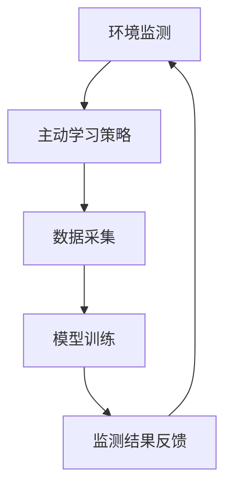
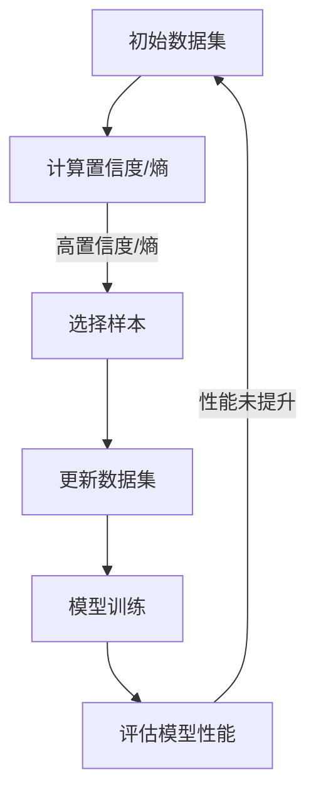

                 


## 模型训练中的主动学习策略在持续性环境监测中的优化应用

### 关键词

- 主动学习
- 持续性环境监测
- 优化应用
- 样本选择策略
- 反馈机制
- 模型更新机制
- 迁移学习
- 强化学习

### 摘要

本文探讨了主动学习策略在持续性环境监测中的应用，通过深入分析模型训练中的主动学习策略，揭示了其在环境监测中的优化作用。文章首先介绍了主动学习的定义、特点及在环境监测中的应用背景，随后详细阐述了样本选择策略、反馈机制和模型更新机制。在此基础上，本文提出了迁移学习和强化学习等优化策略，并进行了具体应用和案例分析。最后，文章总结了主动学习策略在持续性环境监测中的优化应用，为相关领域的研究和实践提供了有益的参考。

---

## 第一部分：背景介绍

### 1. 模型训练中的主动学习策略概述

#### 1.1 主动学习的定义与特点

**主动学习定义**：主动学习是一种通过有选择地采集数据来提升模型性能的方法，与被动学习相对，后者是随机采集数据。

**主动学习特点**：

- **目标导向**：主动学习过程中，用户可以根据目标有选择地采集数据，从而提高模型对特定目标的识别能力。
- **高效性**：由于主动学习仅采集对模型性能提升有显著影响的数据，因此可以减少数据采集的时间和成本。
- **适应性**：主动学习可以根据模型当前的性能和知识状态，动态调整数据采集策略，从而实现持续的性能优化。

#### 1.2 持续性环境监测中的挑战

- **问题背景**：随着环境问题的日益严重，如何准确、高效地进行环境监测成为关键问题。
- **问题描述**：传统的环境监测方法存在数据量大、成本高、响应速度慢等问题。
- **问题解决**：引入主动学习策略，通过有选择地采集环境数据，提高监测效率和准确性。

#### 1.3 核心概念与联系

##### 1.3.1 主动学习策略原理

主动学习与被动学习的对比：

| 特征             | 主动学习           | 被动学习           |
|------------------|-------------------|-------------------|
| 数据采集方式     | 选择性采集         | 随机采集           |
| 数据量需求       | 数据量较少         | 数据量较大           |
| 时间效率         | 高效性             | 低效性             |
| 需求适应性       | 高适应性           | 低适应性           |

##### 1.3.2 持续性环境监测与主动学习策略的联系

ER实体关系图架构：



---

## 第二部分：主动学习策略在持续性环境监测中的应用

### 2. 模型训练中的主动学习策略

#### 2.1 样本选择策略

**内容**：介绍常用的样本选择策略，如基于置信度的选择、基于熵的选择等。

**算法原理讲解**：使用Mermaid流程图展示样本选择策略的执行过程。



#### 2.2 反馈机制

**内容**：解释反馈机制在主动学习策略中的作用，包括用户反馈和模型反馈。

**数学模型和数学公式**：使用LaTeX格式给出反馈机制的数学模型。

$$
\text{反馈机制} = \alpha \cdot \text{用户反馈} + (1 - \alpha) \cdot \text{模型反馈}
$$

#### 2.3 模型更新机制

**内容**：介绍模型更新机制，如在线学习、批量学习等。

**算法原理讲解**：使用Python源代码展示模型更新机制。

```python
# 模型更新示例代码
model = train_model(data)
while not model_satisfied:
    new_data = select_samples(model)
    model = update_model(model, new_data)
```

---

## 第三部分：主动学习策略的优化应用

### 3.1 优化策略概述

**内容**：介绍常见的优化策略，如迁移学习、强化学习等。

---

### 3.2 迁移学习在主动学习中的应用

**内容**：详细阐述迁移学习在主动学习策略中的优化作用，包括算法原理和应用案例。

---

## 总结

本文从模型训练中的主动学习策略入手，探讨了其在持续性环境监测中的优化应用。通过对样本选择策略、反馈机制和模型更新机制的详细分析，本文揭示了主动学习策略在提高监测效率和准确性方面的优势。同时，本文提出了迁移学习和强化学习等优化策略，为主动学习在环境监测领域的应用提供了新的思路。未来，随着人工智能技术的不断进步，主动学习策略在环境监测领域的应用前景将更加广阔。

