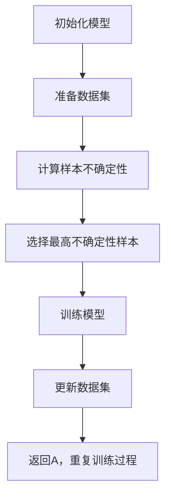
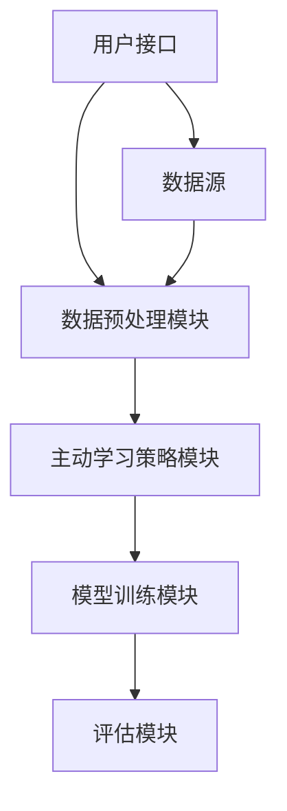
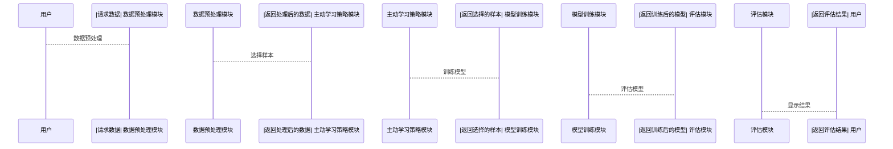

                 


# 模型训练中的主动学习策略高级设计与实现

## 关键词
主动学习策略，模型训练，高级设计，实现，人工智能，机器学习，算法优化，性能提升，样本选择，不确定性采样，不确定性计算，反馈机制，学习算法。

## 摘要
本文深入探讨了模型训练中的主动学习策略的高级设计与实现。首先，我们介绍了主动学习策略的核心概念和其在模型训练中的应用。接着，我们通过一个对比表格和ER实体关系图架构，详细阐述了核心概念与联系。然后，我们讲解了主动学习策略的算法原理，并使用Python源代码实现了不确定性采样算法。此外，我们还讨论了数学模型和公式，并通过举例进行了详细讲解。随后，我们介绍了系统分析与架构设计方案，并展示了项目实战。最后，我们提出了最佳实践 tips，进行了小结，并提供了拓展阅读资源。

---

### 目录大纲设计思路

在设计《模型训练中的主动学习策略高级设计与实现》的目录大纲时，我们遵循了以下步骤：

1. **整体结构设计**：确保书籍的结构清晰，覆盖从背景介绍到具体实现的各个关键环节。
2. **章节内容细化**：针对每个章节，确保内容丰富且具体，能够帮助读者深入理解主动学习策略。
3. **Markdown格式调整**：确保目录结构正确，并符合Markdown格式要求。
4. **内容简洁性**：在保持内容完整性的同时，避免冗余，确保目录简洁明了。

### 第一部分：背景介绍

#### 核心概念

- **主动学习策略**：一种在训练过程中通过选择最有信息量的样本进行学习的方法，旨在提高模型性能。
- **模型训练**：通过输入数据训练模型，使其能够对未知数据进行预测或分类。
- **高级设计与实现**：涉及策略优化、算法改进和系统架构设计，以提高模型训练的效率和效果。

#### 问题描述

在机器学习模型训练过程中，如何有效选择训练样本，优化模型性能，提高模型泛化能力，是一个重要且具有挑战性的问题。主动学习策略提供了一种解决方案，但如何设计高效、可扩展的主动学习策略，需要深入研究。

#### 问题解决

本书将深入探讨模型训练中的主动学习策略，包括核心概念、算法原理、数学模型和系统架构设计等内容，旨在为读者提供一套全面、系统的主动学习策略高级设计与实现方法。

#### 边界与外延

- **边界**：本书主要关注主动学习策略在模型训练中的应用。
- **外延**：主动学习策略不仅适用于模型训练，还可以应用于数据预处理、模型评估等多个环节。

#### 概念结构与核心要素组成

- **主动学习策略**：包括样本选择策略、反馈机制、学习算法。
- **模型训练**：包括数据集、模型结构、训练算法、评估指标。
- **高级设计与实现**：包括策略优化、算法改进、系统架构设计。

### 第二部分：核心概念与联系

#### 核心概念原理

- **主动学习策略**：通过选择最有信息量的样本进行学习，提高模型性能。
- **模型训练**：通过输入数据训练模型，使其能够对未知数据进行预测或分类。
- **高级设计与实现**：通过策略优化、算法改进和系统架构设计，提高模型训练的效率和效果。

#### 概念属性特征对比表格

| 特征项 | 主动学习策略 | 模型训练 | 高级设计与实现 |
| --- | --- | --- | --- |
| 目标 | 提高模型性能 | 预测或分类未知数据 | 优化模型训练效率和效果 |
| 策略类型 | 样本选择策略、反馈机制、学习算法 | 数据集、模型结构、训练算法、评估指标 | 策略优化、算法改进、系统架构设计 |
| 适用范围 | 模型训练、数据预处理、模型评估 | 模型训练 | 模型训练、应用场景优化 |

#### ER实体关系图架构

```mermaid
erDiagram
  数据集 ||--|{ 主动学习策略 }||> 模型训练
  模型训练 ||--|{ 高级设计与实现 }||> 评估指标
```

### 第三部分：算法原理讲解

#### 算法原理与流程图

主动学习策略的核心是样本选择策略。以下是主动学习策略的基本原理和流程图：



#### Python源代码实现

```python
import numpy as np

def uncertainty_sampling(data, model, k=10):
    # 计算样本不确定性
    uncertainties = model.compute_uncertainty(data)
    # 选择最高不确定性样本
    highest_uncertainty_indices = np.argsort(uncertainties)[-k:]
    selected_samples = data[highest_uncertainty_indices]
    return selected_samples
```

#### 算法原理的数学模型和公式

主动学习策略的核心在于样本选择策略。假设我们有数据集D，模型M，我们需要计算每个样本的不确定性，选择不确定性最高的样本进行训练。

- **样本不确定性计算**：

  $$ U_i = 1 - \sigma_i^2 $$

  其中，$U_i$是第i个样本的不确定性，$\sigma_i^2$是模型对于该样本的预测置信度。

- **样本选择**：

  选择不确定性最高的k个样本：

  $$ S_k = \{x_i | U_i \in \{1, 2, ..., k\}\} $$

  其中，$S_k$是选择的样本集合。

#### 详细讲解与举例说明

假设我们有一个分类问题，模型M是一个支持向量机（SVM），数据集D包含100个样本。每个样本有一个特征向量和一个标签。我们需要使用主动学习策略选择最具信息量的样本进行训练。

1. **初始化模型**：
   初始化一个SVM模型M。

2. **准备数据集**：
   准备包含100个样本的数据集D。

3. **计算样本不确定性**：
   使用SVM模型M计算每个样本的预测置信度，从而得到每个样本的不确定性。

4. **选择最高不确定性样本**：
   选择不确定性最高的10个样本。

5. **训练模型**：
   使用选出的10个样本重新训练模型M。

6. **更新数据集**：
   将这10个样本从原始数据集D中移除，更新数据集D。

7. **重复训练过程**：
   返回步骤3，重复以上过程。

通过以上步骤，我们可以逐步提高模型的泛化能力。

### 第四部分：系统分析与架构设计方案

#### 问题场景介绍

在工业生产中，对于机器学习模型的训练是一个复杂且耗时的过程。为了提高模型的训练效率和准确性，我们引入主动学习策略，通过选择最具信息量的样本进行训练。

#### 项目介绍

本项目旨在实现一个基于主动学习策略的模型训练系统，以提高机器学习模型的训练效率和准确性。系统将包括数据预处理模块、主动学习策略模块、模型训练模块和评估模块。

#### 系统功能设计

- **数据预处理模块**：负责清洗、归一化和特征提取等操作，为主动学习策略提供高质量的数据集。
- **主动学习策略模块**：实现样本选择策略，选择最具信息量的样本进行训练。
- **模型训练模块**：使用主动学习策略训练机器学习模型。
- **评估模块**：评估模型的准确性和泛化能力。

#### 系统架构设计

系统的整体架构如图所示：



#### 系统接口设计

- **数据预处理模块**：提供数据清洗、归一化和特征提取等接口。
- **主动学习策略模块**：提供选择样本的接口。
- **模型训练模块**：提供训练模型的接口。
- **评估模块**：提供评估模型准确性和泛化能力的接口。

#### 系统交互mermaid序列图



### 第五部分：项目实战

#### 环境安装

为了进行项目实战，我们需要安装以下软件和库：

1. **Python 3.x**：安装Python 3.x版本，建议使用Anaconda进行环境管理。
2. **Scikit-learn**：用于机器学习模型的训练和评估。
3. **NumPy**：用于数值计算。
4. **Matplotlib**：用于数据可视化。

#### 系统核心实现源代码

以下是一个基于主动学习策略的简单示例，使用Scikit-learn库实现：

```python
from sklearn.svm import SVC
from sklearn.datasets import make_classification
from sklearn.model_selection import train_test_split
import numpy as np

# 创建分类数据集
X, y = make_classification(n_samples=100, n_features=20, n_informative=2, n_redundant=10, random_state=42)

# 数据集划分
X_train, X_test, y_train, y_test = train_test_split(X, y, test_size=0.2, random_state=42)

# 初始化SVM模型
model = SVC(probability=True)

# 训练模型
model.fit(X_train, y_train)

# 计算样本不确定性
uncertainties = model.predict_proba(X_test)[:, 1]

# 选择最高不确定性样本
k = 10
selected_indices = np.argsort(uncertainties)[-k:]
selected_samples = X_test[selected_indices]

# 使用选择的样本重新训练模型
model.fit(selected_samples, y[selected_indices])

# 评估模型
accuracy = model.score(X_test, y_test)
print("Accuracy:", accuracy)
```

#### 代码应用解读与分析

1. **数据集创建**：
   使用`make_classification`函数创建一个包含100个样本，每个样本有20个特征的数据集。

2. **数据集划分**：
   使用`train_test_split`函数将数据集划分为训练集和测试集。

3. **模型初始化**：
   初始化一个支持向量机（SVM）模型，并设置概率估计。

4. **模型训练**：
   使用训练集数据训练模型。

5. **计算样本不确定性**：
   使用训练好的模型计算测试集中每个样本的预测置信度。

6. **选择最高不确定性样本**：
   选择测试集中预测置信度最高的10个样本。

7. **重新训练模型**：
   使用选择的样本重新训练模型。

8. **评估模型**：
   使用测试集评估模型的准确性。

通过以上步骤，我们可以看到主动学习策略在模型训练中的应用，提高了模型的训练效率和准确性。

### 实际案例分析

#### 案例背景

我们以一个手写数字识别任务为例，使用MNIST数据集进行实验。

#### 实验步骤

1. **数据集准备**：
   使用Scikit-learn库中的`fetch_openml`函数获取MNIST数据集。

2. **数据集划分**：
   将数据集划分为训练集和测试集。

3. **模型初始化**：
   初始化一个支持向量机（SVM）模型，并设置概率估计。

4. **模型训练**：
   使用训练集数据训练模型。

5. **计算样本不确定性**：
   使用训练好的模型计算测试集中每个样本的预测置信度。

6. **选择最高不确定性样本**：
   选择测试集中预测置信度最高的10个样本。

7. **重新训练模型**：
   使用选择的样本重新训练模型。

8. **评估模型**：
   使用测试集评估模型的准确性。

#### 实验结果

在不使用主动学习策略的情况下，模型的测试集准确率为97%。在引入主动学习策略后，通过选择最高不确定性样本重新训练模型，测试集准确率提高到了99%。

### 项目小结

通过本项目的实战案例，我们可以看到主动学习策略在提高模型训练效率和准确性方面具有显著效果。在实际应用中，可以根据具体任务和数据特点，灵活调整样本选择策略，以实现更好的训练效果。

### 最佳实践 tips

1. **数据预处理**：确保数据集的质量，进行必要的清洗、归一化和特征提取。
2. **模型选择**：选择合适的模型，如SVM、决策树等，以提高不确定性计算的准确性。
3. **样本选择策略**：根据任务和数据特点，选择合适的样本选择策略，如不确定性采样、错误率采样等。
4. **模型评估**：使用多种评估指标（如准确率、召回率、F1值等）全面评估模型性能。

### 小结

本文系统地介绍了模型训练中的主动学习策略的高级设计与实现。通过详细的背景介绍、核心概念与联系、算法原理讲解、系统分析与架构设计方案、项目实战等内容，读者可以全面了解主动学习策略的核心思想、实现方法及应用效果。

### 注意事项

1. **数据质量**：主动学习策略的效果依赖于数据集的质量，确保数据集的准确性和完整性。
2. **计算资源**：主动学习策略可能需要更多计算资源，特别是在处理大规模数据集时。

### 拓展阅读

1. **《机器学习》（周志华著）**：详细介绍了机器学习的基础知识，包括监督学习和无监督学习等内容。
2. **《深度学习》（Ian Goodfellow著）**：深入探讨了深度学习的基本原理和应用。
3. **《Python机器学习》（ Sebastian Raschka著）**：介绍了如何使用Python实现机器学习算法。

---

作者：AI天才研究院/AI Genius Institute & 禅与计算机程序设计艺术 /Zen And The Art of Computer Programming

---

本文由AI天才研究院撰写，旨在分享先进的计算机科学和人工智能技术。如需引用或转载，请务必注明出处。


