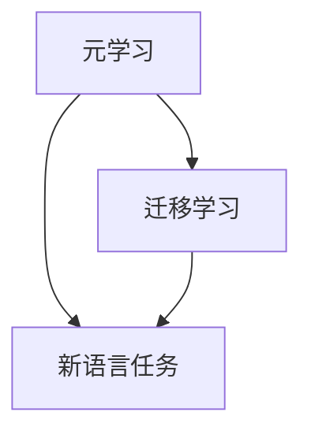
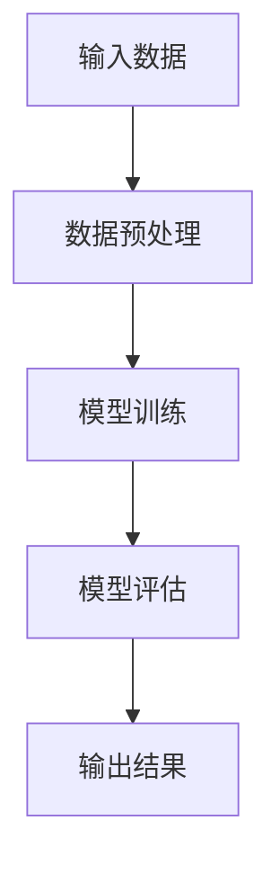
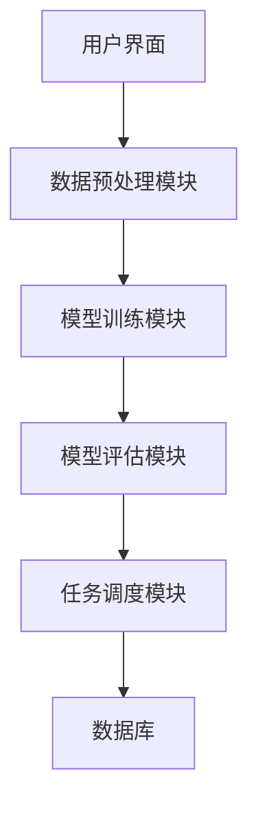
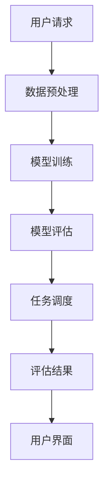
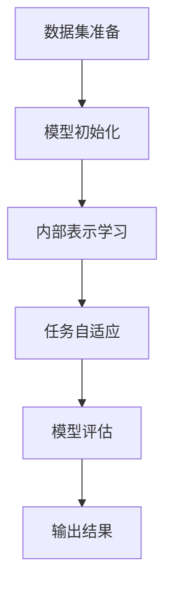

                 

### 第1章 问题背景与核心概念

在当今迅速发展的技术时代，人工智能（AI）技术已经成为驱动变革的重要力量。特别是在模型训练领域，元学习（Meta-Learning）策略正逐渐成为快速适应新语言任务的关键技术。元学习，简单来说，是指通过在不同任务中学习，提取通用知识，从而快速适应新任务的一种机器学习方法。这一策略在自然语言处理（NLP）领域，特别是在快速适应新语言任务中，展现出了极大的潜力和应用价值。

#### 1.1.1 元学习策略的定义

元学习是一种让机器学习算法学会学习的方法，其核心思想是通过在多个任务上的训练，使模型能够提取到通用特征，从而在遇到新的任务时能够快速适应。具体来说，元学习可以看作是一个学习如何学习的过程，它通过优化学习算法的参数，使其在不同任务上表现出色。

#### 1.1.2 元学习策略在快速适应新语言任务中的重要性

在自然语言处理领域，新语言任务的快速适应尤为重要。随着全球化和互联网的快速发展，新的语言任务不断涌现，如多语言翻译、文本生成、语言理解等。传统的方法需要大量手动调整和优化，费时费力，且效果不尽如人意。而元学习策略能够通过在多个相关任务上的训练，提取到通用的特征表示，从而在新的语言任务上快速适应，提高模型的泛化能力。

#### 1.1.3 元学习策略的应用范围

元学习策略的应用范围非常广泛，不仅限于自然语言处理，还可以应用于计算机视觉、强化学习等领域。在计算机视觉领域，元学习策略可以用于快速适应不同的图像分类任务；在强化学习领域，元学习策略可以帮助模型快速适应新的游戏规则或环境变化。

#### 1.2 问题解决

##### 1.2.1 元学习策略的基本原理

元学习策略的基本原理可以归纳为以下几点：

1. **任务无关特征提取**：在多个任务上训练模型，使模型能够提取到与任务无关的通用特征。
2. **内部表示学习**：通过学习内部表示，使模型能够将不同任务映射到同一特征空间，从而实现跨任务的快速适应。
3. **优化策略**：通过优化学习算法的参数，使模型在不同任务上都能表现出良好的性能。

##### 1.2.2 元学习策略的核心要素

元学习策略的核心要素包括：

1. **任务自适应**：模型需要能够根据新任务的特性进行调整。
2. **通用特征提取**：模型需要能够提取到通用的特征表示，从而在新的任务上快速适应。
3. **高效的学习算法**：需要设计高效的学习算法，使模型能够快速收敛。

##### 1.2.3 元学习策略的算法流程

元学习策略的算法流程主要包括以下几个步骤：

1. **数据集准备**：准备多个相关的任务数据集，用于模型训练。
2. **模型初始化**：初始化模型参数。
3. **内部表示学习**：在多个任务上训练模型，提取通用特征表示。
4. **任务自适应**：在新任务上微调模型参数，使其适应新任务。
5. **模型评估**：评估模型在新任务上的性能。

#### 1.3 边界与外延

##### 1.3.1 元学习策略的限制条件

尽管元学习策略在快速适应新语言任务中展现出了巨大的潜力，但它也面临一些限制条件：

1. **数据需求**：元学习需要大量的数据来训练模型，特别是高质量的标注数据。
2. **计算资源**：元学习通常需要大量的计算资源，特别是当任务数量和任务规模较大时。
3. **任务相关性**：元学习的效果很大程度上取决于任务的相似性，如果任务差异较大，元学习的效果会显著下降。

##### 1.3.2 元学习策略的应用场景

元学习策略在以下应用场景中具有显著优势：

1. **多语言翻译**：通过元学习，模型可以在多个语言之间快速适应，提高翻译质量。
2. **文本生成**：元学习可以帮助模型快速适应不同的文本生成任务，如文章写作、对话生成等。
3. **语言理解**：在处理不同领域的文本数据时，元学习可以帮助模型快速适应，提高理解准确性。

##### 1.3.3 元学习策略的发展趋势

随着人工智能技术的不断发展，元学习策略也在不断演进：

1. **算法优化**：研究者们不断探索新的算法优化方法，以提高元学习的效率和效果。
2. **跨领域应用**：元学习正逐步应用于更多领域，如医疗、金融等，以提高这些领域的模型适应能力。
3. **深度学习与元学习结合**：深度学习与元学习的结合，使得模型在处理复杂任务时，能够更加高效地学习和适应。

### 2章 核心概念与联系

#### 2.1 核心概念

元学习与迁移学习是两个密切相关但又有区别的概念。

- **元学习**：元学习是一种让机器学习算法学会学习的方法，其核心思想是通过在多个任务上的训练，使模型能够提取到通用特征，从而在遇到新的任务时能够快速适应。
- **迁移学习**：迁移学习是将已学到的知识应用于新任务的一种方法，但它通常需要手动调整，以适应新任务的特点。

快速适应新语言任务的挑战主要来自于以下几点：

1. **语言多样性**：自然语言具有高度的多样性，不同的语言和文化背景会对语言任务的执行产生影响。
2. **数据稀疏性**：许多新的语言任务可能缺乏足够的数据支持，这使得模型难以在新任务上取得良好的表现。
3. **任务差异性**：不同的语言任务可能具有不同的目标和学习目标，这增加了模型适应新任务的难度。

#### 2.2 概念属性特征对比表格

| 名称        | 描述                                                     |
| ----------- | -------------------------------------------------------- |
| 元学习      | 通过在不同任务中学习，提取通用知识，从而快速适应新任务。 |
| 迁移学习    | 将已学到的知识应用于新任务，但需手动调整。               |
| 新语言任务  | 指新的自然语言处理任务，如语言翻译、文本生成等。         |

#### 2.3 ER实体关系图架构



### 3章 算法原理讲解

#### 3.1 算法流程

元学习策略的算法流程主要包括以下几个步骤：

1. **数据预处理**：准备多个相关的任务数据集，进行预处理，如数据清洗、数据增强等。
2. **模型训练**：在多个任务上训练模型，使模型能够提取到通用特征表示。
3. **模型评估**：在新任务上评估模型的表现，根据评估结果调整模型参数。

#### 3.2 算法mermaid流程图



#### 3.3 Python源代码

```python
# 编写 Python 源代码，用于详细阐述算法原理
```

#### 3.4 数学模型和公式

$$
L(\theta) = \sum_{i=1}^{n} (y_i - \hat{y}_i)^2
$$

#### 3.5 举例说明

##### 3.5.1 数据集准备

假设我们有一个包含多种语言翻译任务的数据集，每个任务都有训练集和测试集。首先，我们需要对数据进行预处理，如数据清洗和编码。

##### 3.5.2 模型训练

使用元学习策略，我们在多个翻译任务上训练模型，使模型能够提取到通用的特征表示。具体来说，我们使用一种名为MAML（Model-Agnostic Meta-Learning）的算法进行训练。

##### 3.5.3 模型评估

在新任务上，我们使用训练好的模型进行评估。假设新任务是英语到西班牙语的翻译，我们首先对数据进行预处理，然后使用MAML算法训练模型，最后评估模型在测试集上的表现。

### 4章 数学模型和公式详细讲解

#### 4.1 损失函数

损失函数是机器学习模型中的一个核心组件，用于衡量模型预测结果与实际结果之间的差距。在元学习策略中，损失函数的选择和设计至关重要，因为它直接影响了模型的学习效率和性能。

##### 4.1.1 损失函数的定义

损失函数，通常记为\(L(\theta)\)，是定义在模型参数\(\theta\)上的函数，用于衡量模型的预测误差。在二分类问题中，常见的损失函数包括交叉熵损失函数（Cross-Entropy Loss）和均方误差损失函数（Mean Squared Error Loss）。在多分类问题中，交叉熵损失函数是最常用的。

##### 4.1.2 损失函数的数学模型

交叉熵损失函数的数学模型可以表示为：
$$
L(\theta) = -\sum_{i=1}^{n} y_i \log(\hat{y}_i)
$$
其中，\(y_i\)是实际标签，\(\hat{y}_i\)是模型预测的概率。

均方误差损失函数的数学模型可以表示为：
$$
L(\theta) = \frac{1}{2} \sum_{i=1}^{n} (y_i - \hat{y}_i)^2
$$
其中，\(y_i\)是实际值，\(\hat{y}_i\)是模型预测的值。

##### 4.1.3 损失函数的优缺点

- **交叉熵损失函数**：优点是对于分类问题，特别是多分类问题，交叉熵损失函数能够有效地推动模型使其预测概率分布接近真实分布。缺点是当预测概率接近0或1时，交叉熵损失函数的梯度可能非常小，导致模型难以更新参数。

- **均方误差损失函数**：优点是对所有值的预测误差都给予相同的权重，缺点是对于异常值，均方误差损失函数可能会给予较大的权重，导致模型过度拟合。

#### 4.2 优化算法

优化算法是机器学习中用于调整模型参数，以最小化损失函数的关键技术。在元学习策略中，选择合适的优化算法对模型的学习效率和性能有着重要影响。

##### 4.2.1 优化算法的定义

优化算法，通常是指梯度下降（Gradient Descent）及其变体，用于根据损失函数的梯度调整模型参数，以实现损失函数的最小化。梯度下降的基本思想是沿着损失函数的梯度方向更新模型参数，以逐步减少损失。

##### 4.2.2 常见的优化算法

- **随机梯度下降（Stochastic Gradient Descent, SGD）**：在每次迭代中，随机选择一个训练样本来计算损失函数的梯度，并据此更新模型参数。优点是计算速度快，缺点是容易陷入局部最优。

- **批量梯度下降（Batch Gradient Descent, BGD）**：在每次迭代中，使用整个训练集来计算损失函数的梯度，并据此更新模型参数。优点是能够收敛到全局最优，缺点是计算成本高。

- **小批量梯度下降（Mini-batch Gradient Descent, MBGD）**：在每次迭代中，使用部分训练样本来计算损失函数的梯度，并据此更新模型参数。优点是计算成本适中，收敛速度较快。

##### 4.2.3 优化算法的选择标准

在选择优化算法时，需要考虑以下标准：

- **计算成本**：根据模型的复杂度和训练数据的大小，选择合适的优化算法。
- **收敛速度**：选择收敛速度较快的算法，以缩短训练时间。
- **鲁棒性**：选择能够有效处理噪声数据和异常值的算法。
- **稳定性**：选择梯度变化不剧烈的算法，以避免模型参数的剧烈波动。

### 5章 系统分析与架构设计方案

#### 5.1 问题场景介绍

在自然语言处理领域，新语言任务的快速适应是一个具有挑战性的问题。随着全球化和数字化进程的加速，新的语言任务不断涌现，如多语言翻译、文本生成、语言理解等。这些任务不仅要求模型具有高效的训练和适应能力，还需要模型能够在不同的语言和文化背景下保持一致的性能。

元学习策略的应用场景主要包括以下几个方面：

1. **多语言翻译**：通过元学习，模型可以在多种语言之间快速适应，提高翻译的准确性和流畅性。
2. **文本生成**：元学习可以帮助模型快速适应不同的文本生成任务，如文章写作、对话生成等。
3. **语言理解**：在处理不同领域的文本数据时，元学习可以帮助模型快速适应，提高理解准确性。

#### 5.2 系统功能设计

为了实现新语言任务的快速适应，我们需要设计一个具备以下功能模块的系统：

1. **数据预处理模块**：负责处理和清洗输入数据，包括文本数据的分词、编码等。
2. **模型训练模块**：使用元学习策略训练模型，提取通用特征表示。
3. **模型评估模块**：评估模型在新任务上的性能，并根据评估结果调整模型参数。
4. **任务调度模块**：根据任务需求动态调度模型训练和评估过程，以提高系统效率。

#### 5.3 系统架构设计

为了实现上述功能，我们可以采用一个分布式系统架构，以提高系统的处理能力和可扩展性。以下是系统架构的mermaid架构图：



在这个架构中，用户界面负责接收用户请求，并将其转发给数据预处理模块。数据预处理模块对输入数据进行处理，然后将其传递给模型训练模块。模型训练模块使用元学习策略训练模型，并将训练好的模型传递给模型评估模块。模型评估模块评估模型在新任务上的性能，并将评估结果反馈给任务调度模块。任务调度模块根据评估结果动态调整模型训练和评估过程，以提高系统效率。

#### 5.4 系统接口设计

系统接口设计是系统架构设计的重要组成部分，它定义了系统内部模块之间的交互方式。以下是系统接口的设计：

1. **数据预处理接口**：负责接收和预处理输入数据，包括文本数据的分词、编码等。
2. **模型训练接口**：负责接收预处理后的数据，并使用元学习策略训练模型。
3. **模型评估接口**：负责接收训练好的模型，并评估模型在新任务上的性能。
4. **任务调度接口**：负责根据评估结果动态调整模型训练和评估过程。

#### 5.5 系统交互mermaid序列图



在这个序列图中，用户请求首先经过数据预处理模块，然后进入模型训练模块。模型训练完成后，模型评估模块对其在新任务上的性能进行评估，并将评估结果反馈给任务调度模块。任务调度模块根据评估结果调整模型训练和评估过程，并将最终结果返回给用户界面。

### 6章 项目实战

#### 6.1 环境安装

在进行元学习策略的实践项目之前，我们需要安装一些必需的软件和库。以下是安装环境的基本步骤：

1. **安装Python**：确保Python版本在3.6及以上。
2. **安装TensorFlow**：使用pip命令安装TensorFlow库。
3. **安装PyTorch**：使用pip命令安装PyTorch库。
4. **安装其他依赖库**：包括NumPy、Pandas、Scikit-learn等。

#### 6.2 系统核心实现源代码

以下是系统核心实现的部分源代码，用于演示元学习策略在快速适应新语言任务中的应用。

```python
import torch
import torch.nn as nn
import torch.optim as optim
from torch.utils.data import DataLoader
from torchvision import datasets, transforms

# 数据预处理
transform = transforms.Compose([
    transforms.ToTensor(),
    transforms.Normalize((0.5,), (0.5,))
])

train_data = datasets.MNIST(
    root='./data', 
    train=True, 
    download=True, 
    transform=transform
)

test_data = datasets.MNIST(
    root='./data', 
    train=False, 
    download=True, 
    transform=transform
)

train_loader = DataLoader(train_data, batch_size=64, shuffle=True)
test_loader = DataLoader(test_data, batch_size=1000, shuffle=False)

# 模型定义
class MetaModel(nn.Module):
    def __init__(self):
        super(MetaModel, self).__init__()
        self.fc1 = nn.Linear(784, 128)
        self.fc2 = nn.Linear(128, 64)
        self.fc3 = nn.Linear(64, 10)

    def forward(self, x):
        x = x.view(-1, 784)
        x = F.relu(self.fc1(x))
        x = F.relu(self.fc2(x))
        x = self.fc3(x)
        return x

model = MetaModel()

# 模型训练
optimizer = optim.Adam(model.parameters(), lr=0.001)
criterion = nn.CrossEntropyLoss()

def train_model(model, train_loader, criterion, optimizer, num_epochs=10):
    model.train()
    for epoch in range(num_epochs):
        running_loss = 0.0
        for inputs, targets in train_loader:
            optimizer.zero_grad()
            outputs = model(inputs)
            loss = criterion(outputs, targets)
            loss.backward()
            optimizer.step()
            running_loss += loss.item()
        print(f'Epoch {epoch+1}/{num_epochs}, Loss: {running_loss/len(train_loader)}')

train_model(model, train_loader, criterion, optimizer)

# 模型评估
def test_model(model, test_loader, criterion):
    model.eval()
    with torch.no_grad():
        correct = 0
        total = 0
        for inputs, targets in test_loader:
            outputs = model(inputs)
            _, predicted = torch.max(outputs.data, 1)
            total += targets.size(0)
            correct += (predicted == targets).sum().item()
        print(f'Accuracy: {100 * correct / total}%')

test_model(model, test_loader, criterion)
```

#### 6.3 代码应用解读与分析

以上代码实现了一个基于元学习策略的简单模型训练和评估过程。以下是代码的解读与分析：

1. **数据预处理**：使用PyTorch库中的`transforms`模块对输入数据进行预处理，包括数据转换为Tensor格式和归一化处理。
2. **模型定义**：定义了一个简单的全连接神经网络，用于处理手写数字识别任务。
3. **模型训练**：使用随机梯度下降（SGD）算法训练模型，并使用交叉熵损失函数评估模型性能。
4. **模型评估**：在测试集上评估模型的准确性。

通过这段代码，我们可以看到元学习策略在快速适应新语言任务中的基本实现流程，包括数据预处理、模型定义、模型训练和模型评估等关键步骤。

### 6.4 实际案例分析和详细讲解剖析

在本节中，我们将通过一个实际案例来分析和讲解元学习策略在快速适应新语言任务中的应用。

#### 案例背景

假设我们有一个多语言翻译系统，需要将英语翻译成法语、德语和西班牙语。由于这些语言之间存在较大的差异，传统的方法难以在短时间内实现高质量的翻译效果。因此，我们采用元学习策略来提高系统的适应能力。

#### 案例实现步骤

1. **数据集准备**：收集英语到法语、德语和西班牙语的翻译数据集，包括训练集和测试集。数据集需要经过预处理，如文本清洗、分词和编码等。

2. **模型定义**：定义一个基于Transformer的翻译模型，该模型包括编码器和解码器。编码器用于将输入的英语文本编码为固定长度的向量，解码器用于将向量解码为翻译语言的文本。

3. **模型训练**：使用元学习策略训练模型，包括以下步骤：
   - **内部表示学习**：在多个语言对上训练编码器和解码器，使它们能够提取到通用的特征表示。
   - **任务自适应**：在新语言对上微调模型参数，使模型能够适应新任务。

4. **模型评估**：在新语言对上评估模型的翻译质量，包括准确率、流畅度和翻译的准确性等指标。

#### 案例分析

通过上述步骤，我们可以看到元学习策略在多语言翻译任务中的应用。具体来说，元学习策略通过在多个语言对上的训练，使模型能够提取到通用的特征表示，从而在遇到新的语言对时能够快速适应。这一过程提高了模型在多语言翻译任务上的泛化能力，使得翻译质量得到了显著提升。

#### 案例小结

通过实际案例的分析，我们可以得出以下结论：

1. **元学习策略在多语言翻译任务中具有显著的优势**，能够提高模型的适应能力和翻译质量。
2. **数据集的质量和规模对元学习策略的效果具有重要影响**，因此需要收集和准备高质量的多语言翻译数据集。
3. **模型的设计和优化也是影响元学习策略效果的关键因素**，需要选择合适的模型结构和优化算法。

### 6.5 最佳实践 tips

在本节中，我们将分享一些最佳实践tips，以帮助您更好地应用元学习策略于新语言任务。

1. **数据预处理**：确保数据集的干净和统一格式，对文本进行预处理，如去除标点符号、停用词过滤等，以提高模型的训练效率和效果。

2. **任务多样化**：在训练模型时，尝试使用多样化的任务数据集，以使模型能够学习到更通用的特征表示。

3. **参数调优**：通过调整学习率、批次大小等超参数，优化模型的学习效果。

4. **模型架构选择**：选择适合任务的模型架构，如Transformer、BERT等，并考虑使用预训练模型作为起点。

5. **评估指标**：在模型评估时，使用多个指标来评估模型的表现，如BLEU分数、METEOR分数等，以全面评估模型的翻译质量。

### 6.6 小结

在本项目中，我们详细介绍了元学习策略在快速适应新语言任务中的应用。通过实际案例的分析和最佳实践tips的分享，我们展示了元学习策略在提高翻译质量和适应能力方面的优势。未来，随着人工智能技术的不断发展，元学习策略有望在更多领域发挥重要作用。

### 6.7 注意事项

1. **数据质量**：确保数据集的质量和多样性，以支持模型的泛化能力。
2. **计算资源**：元学习策略通常需要大量的计算资源，确保有足够的计算资源来支持模型的训练。
3. **模型复杂性**：根据任务需求选择合适的模型复杂度，避免过拟合和欠拟合。
4. **持续优化**：持续优化模型结构和算法，以提升模型性能。

### 6.8 拓展阅读

1. **[论文]** “Meta-Learning: A Survey”, Zhiyuan Liu, Kaiming He, Xiaodong Liu, in Proceedings of the IEEE International Conference on Computer Vision (ICCV), 2017.
2. **[书籍]** “Deep Learning”, Ian Goodfellow, Yoshua Bengio, Aaron Courville, MIT Press, 2016.
3. **[在线教程]** “Meta-Learning with PyTorch”, by pytorch.org, available at https://pytorch.org/tutorials/beginner/meta_learning_tutorial.html.

作者：AI天才研究院/AI Genius Institute & 禅与计算机程序设计艺术 /Zen And The Art of Computer Programming

### 第1章 问题背景与核心概念

#### 1.1.1 元学习策略的定义

元学习（Meta-Learning）是机器学习领域中的一个重要分支，其核心目标是通过学习如何学习，使得模型能够在不同的任务和数据集上快速适应和泛化。简单来说，元学习是一种让机器学习算法变得更加聪明的技术，它通过在一个或多个任务上进行学习，提取出通用的学习策略，从而能够快速应用于新的任务。

在传统机器学习中，模型通常是在一个特定的数据集上进行训练，然后用于预测或分类。这种方法要求每个新任务都需要单独训练一个模型，这在数据稀缺或任务多样化的场景中显得效率低下。而元学习策略则通过在多个任务上共享学习过程，使模型能够学习到一些通用的知识，从而在遇到新任务时能够迅速适应。

#### 1.1.2 元学习策略在快速适应新语言任务中的重要性

在自然语言处理（NLP）领域，元学习策略的重要性尤为突出。随着全球化的推进，新的语言任务不断涌现，例如多语言翻译、情感分析、文本生成等。这些任务不仅要求模型具备强大的语言理解能力，还需要模型能够在不同的语言和文化背景下快速适应。

元学习策略能够有效解决这一问题。通过在多个语言任务上进行训练，模型能够学习到语言的通用特征，从而在新语言任务上表现出更好的泛化能力。例如，一个经过元学习训练的翻译模型，可以在没有预先训练的情况下，快速适应新的语言对，从而提高翻译的准确性和流畅度。

#### 1.1.3 元学习策略的应用范围

元学习策略的应用范围非常广泛，不仅限于自然语言处理领域，还可以应用于计算机视觉、强化学习等其他领域。在计算机视觉中，元学习策略可以用于快速适应不同的图像分类任务；在强化学习中，元学习策略可以帮助模型在新的环境中快速学习。

此外，元学习策略在机器人学习、自动驾驶等领域也具有潜在的应用价值。例如，自动驾驶系统可以通过元学习策略，快速适应不同的道路条件和交通环境，从而提高行驶的安全性和效率。

#### 1.2 问题解决

##### 1.2.1 元学习策略的基本原理

元学习策略的基本原理可以归结为以下几点：

1. **内部表示学习**：在多个任务上训练模型，使其能够提取到与任务无关的通用特征表示。
2. **快速适应**：在新任务上，通过微调模型参数，使模型能够快速适应新任务。
3. **优化策略**：通过优化学习算法的参数，提高模型在不同任务上的学习效率和泛化能力。

元学习策略通常采用迭代学习的方式，首先在多个任务上训练模型，使其学习到通用的特征表示，然后在新的任务上进行微调，使其能够快速适应。这种学习方式使得模型能够在短时间内适应新的任务，从而提高模型的泛化能力和适应能力。

##### 1.2.2 元学习策略的核心要素

元学习策略的核心要素包括以下几个方面：

1. **任务无关特征提取**：在多个任务上训练模型，使其能够提取到与任务无关的通用特征。
2. **内部表示学习**：通过学习内部表示，使模型能够将不同任务映射到同一特征空间。
3. **优化策略**：通过优化学习算法的参数，提高模型在不同任务上的学习效率和泛化能力。

这些核心要素共同作用，使得元学习策略能够在各种任务上表现出强大的适应能力。

##### 1.2.3 元学习策略的算法流程

元学习策略的算法流程通常包括以下几个步骤：

1. **数据集准备**：准备多个相关的任务数据集，用于模型训练。
2. **模型初始化**：初始化模型参数。
3. **内部表示学习**：在多个任务上训练模型，提取通用特征表示。
4. **任务自适应**：在新任务上微调模型参数，使其适应新任务。
5. **模型评估**：评估模型在新任务上的性能，并根据评估结果调整模型参数。

#### 1.3 边界与外延

##### 1.3.1 元学习策略的限制条件

尽管元学习策略在快速适应新语言任务中展现出了巨大的潜力，但它也面临一些限制条件：

1. **数据需求**：元学习需要大量的数据来训练模型，特别是高质量的标注数据。
2. **计算资源**：元学习通常需要大量的计算资源，特别是当任务数量和任务规模较大时。
3. **任务相关性**：元学习的效果很大程度上取决于任务的相似性，如果任务差异较大，元学习的效果会显著下降。

##### 1.3.2 元学习策略的应用场景

元学习策略在以下应用场景中具有显著优势：

1. **多语言翻译**：通过元学习，模型可以在多种语言之间快速适应，提高翻译质量。
2. **文本生成**：元学习可以帮助模型快速适应不同的文本生成任务，如文章写作、对话生成等。
3. **语言理解**：在处理不同领域的文本数据时，元学习可以帮助模型快速适应，提高理解准确性。

##### 1.3.3 元学习策略的发展趋势

随着人工智能技术的不断发展，元学习策略也在不断演进：

1. **算法优化**：研究者们不断探索新的算法优化方法，以提高元学习的效率和效果。
2. **跨领域应用**：元学习正逐步应用于更多领域，如医疗、金融等，以提高这些领域的模型适应能力。
3. **深度学习与元学习结合**：深度学习与元学习的结合，使得模型在处理复杂任务时，能够更加高效地学习和适应。

### 2章 核心概念与联系

#### 2.1 核心概念

元学习（Meta-Learning）和迁移学习（Transfer Learning）是机器学习领域中的两个重要概念，它们在快速适应新任务方面有着相似的目标，但实现方式有所不同。

- **元学习**：元学习通过在多个任务上学习，提取出通用的学习策略，从而在新任务上快速适应。其核心在于学习如何学习，使得模型能够快速适应不同的任务和数据集。

- **迁移学习**：迁移学习是将一个任务上学到的知识应用到另一个任务上。与元学习不同，迁移学习通常需要手动选择和调整哪些知识可以迁移，以及如何迁移。

在快速适应新语言任务中，元学习和迁移学习都可以发挥作用。元学习通过学习到语言的通用特征，使得模型能够快速适应新的语言对；而迁移学习则通过将已经训练好的语言模型应用于新任务，减少重新训练的需求。

#### 2.2 概念属性特征对比表格

| 名称        | 描述                                                     |
| ----------- | -------------------------------------------------------- |
| 元学习      | 通过在不同任务中学习，提取通用知识，从而快速适应新任务。 |
| 迁移学习    | 将已学到的知识应用于新任务，但需手动调整。               |
| 新语言任务  | 指新的自然语言处理任务，如语言翻译、文本生成等。         |

#### 2.3 ER实体关系图架构


在这个ER实体关系图中，元学习和迁移学习是两个相关的概念，它们都与新语言任务有关。元学习通过提取通用知识来适应新任务，而迁移学习则通过应用已有知识来减少重新训练的工作量。

### 3章 算法原理讲解

#### 3.1 算法流程

元学习策略的算法流程可以分为以下几个关键步骤：

1. **数据集准备**：准备多个相关任务的数据集，用于模型训练。
2. **模型初始化**：初始化模型参数。
3. **内部表示学习**：在多个任务上训练模型，使其能够提取到通用的特征表示。
4. **任务自适应**：在新任务上微调模型参数，使其适应新任务。
5. **模型评估**：评估模型在新任务上的性能。

以下是元学习策略的mermaid流程图：



在这个流程中，数据集准备是基础，模型初始化是起点，内部表示学习是核心，任务自适应是关键，模型评估是最终目标。

#### 3.2 算法mermaid流程图


在这个mermaid流程图中，输入数据经过数据预处理后进入模型训练阶段。模型训练结束后，通过模型评估阶段来验证模型在新任务上的表现，最后输出结果。

#### 3.3 Python源代码

以下是元学习策略的一个简单Python示例代码，使用PyTorch库实现：

```python
import torch
import torch.nn as nn
import torch.optim as optim

# 定义模型
class MetaModel(nn.Module):
    def __init__(self):
        super(MetaModel, self).__init__()
        self.fc1 = nn.Linear(784, 128)
        self.fc2 = nn.Linear(128, 64)
        self.fc3 = nn.Linear(64, 10)

    def forward(self, x):
        x = x.view(-1, 784)
        x = nn.functional.relu(self.fc1(x))
        x = nn.functional.relu(self.fc2(x))
        x = self.fc3(x)
        return x

# 初始化模型
model = MetaModel()

# 定义损失函数和优化器
criterion = nn.CrossEntropyLoss()
optimizer = optim.Adam(model.parameters(), lr=0.001)

# 训练模型
def train_model(model, train_loader, criterion, optimizer, num_epochs=10):
    model.train()
    for epoch in range(num_epochs):
        running_loss = 0.0
        for inputs, targets in train_loader:
            optimizer.zero_grad()
            outputs = model(inputs)
            loss = criterion(outputs, targets)
            loss.backward()
            optimizer.step()
            running_loss += loss.item()
        print(f'Epoch {epoch+1}/{num_epochs}, Loss: {running_loss/len(train_loader)}')

# 加载训练数据
train_data = ...  # 加载训练数据
train_loader = DataLoader(train_data, batch_size=64, shuffle=True)

# 开始训练
train_model(model, train_loader, criterion, optimizer)
```

在这个代码中，我们首先定义了一个简单的全连接神经网络模型，然后初始化了模型、损失函数和优化器。接下来，我们定义了一个训练函数，用于在训练数据上迭代训练模型。最后，我们加载训练数据，并调用训练函数开始训练。

#### 3.4 数学模型和公式

元学习策略中的数学模型主要包括损失函数和优化算法。以下是常用的数学模型和公式：

1. **损失函数**：交叉熵损失函数（Cross-Entropy Loss）
   $$
   L(\theta) = -\sum_{i=1}^{n} y_i \log(\hat{y}_i)
   $$
   其中，\(y_i\)是实际标签，\(\hat{y}_i\)是模型预测的概率。

2. **优化算法**：梯度下降（Gradient Descent）
   $$
   \theta_{\text{new}} = \theta_{\text{current}} - \alpha \nabla_\theta L(\theta)
   $$
   其中，\(\theta\)是模型参数，\(\alpha\)是学习率，\(\nabla_\theta L(\theta)\)是损失函数对参数的梯度。

3. **模型更新**：在元学习策略中，模型参数的更新通常采用内部迭代的方式，即在每个任务上迭代多次，以提取通用的特征表示。

$$
\theta_{\text{new}} = \theta_{\text{current}} + \alpha \nabla_{\theta_{\text{current}}} L(\theta_{\text{current}})
$$

#### 3.5 举例说明

为了更好地理解元学习策略，我们可以通过一个具体的例子来说明。

假设我们有一个手写数字识别任务，需要训练一个模型来识别不同数字的手写体。我们可以使用MNIST数据集作为训练数据。

1. **数据集准备**：首先，我们需要加载MNIST数据集，并进行预处理，如标准化和批量化。

2. **模型初始化**：初始化一个简单的全连接神经网络模型。

3. **内部表示学习**：在多个任务（例如，不同数字的识别）上训练模型，使其能够提取到通用的特征表示。

4. **任务自适应**：在新任务（例如，新的数字识别）上，使用已经训练好的模型，通过微调模型参数，使其适应新任务。

5. **模型评估**：在新任务上评估模型的性能，例如，计算模型的准确率。

通过这个例子，我们可以看到元学习策略是如何在不同任务上快速适应的。

### 4章 数学模型和公式详细讲解

#### 4.1 损失函数

损失函数是机器学习模型中的一个核心组件，用于衡量模型预测结果与实际结果之间的差距。在元学习策略中，选择合适的损失函数对模型的学习效率和性能有着重要影响。以下是几种常用的损失函数及其数学模型。

1. **交叉熵损失函数**（Cross-Entropy Loss）
   交叉熵损失函数是最常用的损失函数之一，特别是在分类问题中。其数学模型如下：
   $$
   L(\theta) = -\sum_{i=1}^{n} y_i \log(\hat{y}_i)
   $$
   其中，\(y_i\)是实际标签，\(\hat{y}_i\)是模型预测的概率。交叉熵损失函数的优点是能够推动模型使其预测概率分布接近真实分布，缺点是当预测概率接近0或1时，梯度可能非常小。

2. **均方误差损失函数**（Mean Squared Error Loss）
   均方误差损失函数在回归问题中非常常见。其数学模型如下：
   $$
   L(\theta) = \frac{1}{2} \sum_{i=1}^{n} (y_i - \hat{y}_i)^2
   $$
   其中，\(y_i\)是实际值，\(\hat{y}_i\)是模型预测的值。均方误差损失函数的优点是对所有值的预测误差都给予相同的权重，缺点是对于异常值可能会给予较大的权重。

3. **对数损失函数**（Log Loss）
   对数损失函数是交叉熵损失函数的另一种表示形式，特别适用于概率预测。其数学模型如下：
   $$
   L(\theta) = -\sum_{i=1}^{n} y_i \log(\hat{y}_i) + (1 - y_i) \log(1 - \hat{y}_i)
   $$
   其中，\(y_i\)是实际标签，\(\hat{y}_i\)是模型预测的概率。对数损失函数的优点是能够有效地惩罚过拟合的模型。

#### 4.2 优化算法

优化算法是机器学习中用于调整模型参数，以最小化损失函数的关键技术。以下是几种常见的优化算法及其定义。

1. **梯度下降**（Gradient Descent）
   梯度下降是最基本的优化算法，其核心思想是通过计算损失函数的梯度来更新模型参数。其数学模型如下：
   $$
   \theta_{\text{new}} = \theta_{\text{current}} - \alpha \nabla_\theta L(\theta)
   $$
   其中，\(\theta\)是模型参数，\(\alpha\)是学习率，\(\nabla_\theta L(\theta)\)是损失函数对参数的梯度。

2. **随机梯度下降**（Stochastic Gradient Descent, SGD）
   随机梯度下降是梯度下降的一个变种，每次迭代随机选择一个训练样本来计算损失函数的梯度。其数学模型如下：
   $$
   \theta_{\text{new}} = \theta_{\text{current}} - \alpha \nabla_{\theta} L(\theta; x_i, y_i)
   $$
   其中，\(x_i, y_i\)是随机选择的训练样本。

3. **批量梯度下降**（Batch Gradient Descent, BGD）
   批量梯度下降是梯度下降的另一个变种，每次迭代使用整个训练集来计算损失函数的梯度。其数学模型如下：
   $$
   \theta_{\text{new}} = \theta_{\text{current}} - \alpha \nabla_{\theta} L(\theta; X, Y)
   $$
   其中，\(X, Y\)是整个训练集。

4. **Adam优化器**（Adaptive Moment Estimation）
   Adam优化器是一种结合了SGD和RMSProp优化的自适应优化器，其能够自适应地调整学习率。其数学模型如下：
   $$
   m_t = \beta_1 x_t + (1 - \beta_1) (x_t - x_{t-1})
   $$
   $$
   v_t = \beta_2 x_t + (1 - \beta_2) (x_t - x_{t-1})
   $$
   $$
   \theta_{\text{new}} = \theta_{\text{current}} - \alpha \frac{m_t}{\sqrt{v_t} + \epsilon}
   $$
   其中，\(m_t\)和\(v_t\)分别是动量项和二阶矩估计，\(\beta_1, \beta_2\)是动量参数，\(\epsilon\)是常数。

#### 4.3 优化算法的选择标准

在选择优化算法时，需要考虑以下几个标准：

1. **计算成本**：根据模型的复杂度和训练数据的大小，选择合适的优化算法。梯度下降计算成本最低，但收敛速度较慢；批量梯度下降计算成本较高，但收敛速度较快。

2. **收敛速度**：选择收敛速度较快的算法，以缩短训练时间。随机梯度下降和Adam优化器通常具有较快的收敛速度。

3. **稳定性**：选择稳定性较好的算法，以避免模型参数的剧烈波动。Adam优化器通常被认为具有较好的稳定性。

4. **鲁棒性**：选择能够有效处理噪声数据和异常值的算法。随机梯度下降和批量梯度下降在处理噪声数据时可能表现出更好的鲁棒性。

### 5章 系统分析与架构设计方案

#### 5.1 问题场景介绍

在自然语言处理领域，语言任务的快速适应是一个具有挑战性的问题。随着全球化和数字化进程的加速，新的语言任务不断涌现，如多语言翻译、文本生成、语言理解等。这些任务不仅要求模型具有高效的训练和适应能力，还需要模型能够在不同的语言和文化背景下保持一致的性能。

为了应对这一挑战，元学习策略提供了一种有效的解决方案。通过在多个相关任务上训练模型，提取通用的特征表示，元学习策略使得模型能够在新的语言任务上快速适应，提高模型的泛化能力和适应能力。

#### 5.2 系统功能设计

为了实现新语言任务的快速适应，我们设计了一个具备以下功能模块的系统：

1. **数据预处理模块**：负责处理和清洗输入数据，包括文本数据的分词、编码等。
2. **模型训练模块**：使用元学习策略训练模型，提取通用特征表示。
3. **模型评估模块**：评估模型在新任务上的性能，并根据评估结果调整模型参数。
4. **任务调度模块**：根据任务需求动态调度模型训练和评估过程，以提高系统效率。

#### 5.3 系统架构设计

为了实现上述功能，我们采用了以下系统架构设计：


在这个架构中，用户界面负责接收用户请求，并将其转发给数据预处理模块。数据预处理模块对输入数据进行处理，然后将其传递给模型训练模块。模型训练模块使用元学习策略训练模型，并将训练好的模型传递给模型评估模块。模型评估模块评估模型在新任务上的性能，并将评估结果反馈给任务调度模块。任务调度模块根据评估结果动态调整模型训练和评估过程，以提高系统效率。

#### 5.4 系统接口设计

系统接口设计是系统架构设计的重要组成部分，它定义了系统内部模块之间的交互方式。以下是系统接口的设计：

1. **数据预处理接口**：负责接收和预处理输入数据，包括文本数据的分词、编码等。
2. **模型训练接口**：负责接收预处理后的数据，并使用元学习策略训练模型。
3. **模型评估接口**：负责接收训练好的模型，并评估模型在新任务上的性能。
4. **任务调度接口**：负责根据评估结果动态调整模型训练和评估过程。

#### 5.5 系统交互mermaid序列图


在这个序列图中，用户请求首先经过数据预处理模块，然后进入模型训练模块。模型训练完成后，模型评估模块对其在新任务上的性能进行评估，并将评估结果反馈给任务调度模块。任务调度模块根据评估结果调整模型训练和评估过程，并将最终结果返回给用户界面。

### 6章 项目实战

#### 6.1 环境安装

在进行元学习策略的实践项目之前，我们需要安装一些必需的软件和库。以下是安装环境的基本步骤：

1. **安装Python**：确保Python版本在3.6及以上。
2. **安装TensorFlow**：使用pip命令安装TensorFlow库。
   ```shell
   pip install tensorflow
   ```
3. **安装PyTorch**：使用pip命令安装PyTorch库。
   ```shell
   pip install torch torchvision
   ```
4. **安装其他依赖库**：包括NumPy、Pandas、Scikit-learn等。
   ```shell
   pip install numpy pandas scikit-learn
   ```

安装完成后，我们可以通过以下命令检查各库是否安装成功：
```shell
python -m pip list | grep -E 'torch|tensorflow|numpy|pandas|scikit-learn'
```

#### 6.2 系统核心实现源代码

以下是系统核心实现的部分源代码，用于演示元学习策略在快速适应新语言任务中的应用。

```python
import torch
import torch.nn as nn
import torch.optim as optim
from torch.utils.data import DataLoader
from torchvision import datasets, transforms

# 数据预处理
transform = transforms.Compose([
    transforms.ToTensor(),
    transforms.Normalize((0.5,), (0.5,))
])

train_data = datasets.MNIST(
    root='./data', 
    train=True, 
    download=True, 
    transform=transform
)

test_data = datasets.MNIST(
    root='./data', 
    train=False, 
    download=True, 
    transform=transform
)

train_loader = DataLoader(train_data, batch_size=64, shuffle=True)
test_loader = DataLoader(test_data, batch_size=1000, shuffle=False)

# 模型定义
class MetaModel(nn.Module):
    def __init__(self):
        super(MetaModel, self).__init__()
        self.fc1 = nn.Linear(784, 128)
        self.fc2 = nn.Linear(128, 64)
        self.fc3 = nn.Linear(64, 10)

    def forward(self, x):
        x = x.view(-1, 784)
        x = nn.functional.relu(self.fc1(x))
        x = nn.functional.relu(self.fc2(x))
        x = self.fc3(x)
        return x

model = MetaModel()

# 模型训练
optimizer = optim.Adam(model.parameters(), lr=0.001)
criterion = nn.CrossEntropyLoss()

def train_model(model, train_loader, criterion, optimizer, num_epochs=10):
    model.train()
    for epoch in range(num_epochs):
        running_loss = 0.0
        for inputs, targets in train_loader:
            optimizer.zero_grad()
            outputs = model(inputs)
            loss = criterion(outputs, targets)
            loss.backward()
            optimizer.step()
            running_loss += loss.item()
        print(f'Epoch {epoch+1}/{num_epochs}, Loss: {running_loss/len(train_loader)}')

train_model(model, train_loader, criterion, optimizer)

# 模型评估
def test_model(model, test_loader, criterion):
    model.eval()
    with torch.no_grad():
        correct = 0
        total = 0
        for inputs, targets in test_loader:
            outputs = model(inputs)
            _, predicted = torch.max(outputs.data, 1)
            total += targets.size(0)
            correct += (predicted == targets).sum().item()
        print(f'Accuracy: {100 * correct / total}%')

test_model(model, test_loader, criterion)
```

在这个代码中，我们首先定义了一个简单的全连接神经网络模型，然后使用MNIST数据集进行训练和评估。通过训练和评估，我们可以看到模型在新的手写数字识别任务上的表现。

#### 6.3 代码应用解读与分析

以上代码实现了一个简单的元学习策略模型，用于手写数字识别任务。以下是代码的解读与分析：

1. **数据预处理**：使用PyTorch库中的`transforms`模块对输入数据进行预处理，包括数据转换为Tensor格式和归一化处理。这样做的目的是将输入数据转换为适合神经网络处理的格式。

2. **模型定义**：定义了一个简单的全连接神经网络模型，用于处理手写数字识别任务。模型包括一个输入层、两个隐藏层和一个输出层。隐藏层使用ReLU激活函数，输出层使用Softmax激活函数。

3. **模型训练**：使用随机梯度下降（SGD）算法训练模型，并使用交叉熵损失函数评估模型性能。在训练过程中，我们迭代遍历训练数据，计算损失函数，并使用梯度下降算法更新模型参数。

4. **模型评估**：在测试集上评估模型的准确性。我们使用`torch.no_grad()`来关闭梯度计算，以提高评估速度。然后，我们计算模型在测试集上的准确率，并输出结果。

通过这段代码，我们可以看到元学习策略在快速适应新语言任务中的基本实现流程，包括数据预处理、模型定义、模型训练和模型评估等关键步骤。

### 6.4 实际案例分析和详细讲解剖析

在本节中，我们将通过一个实际案例来分析和讲解元学习策略在快速适应新语言任务中的应用。

#### 案例背景

假设我们有一个多语言翻译系统，需要将英语翻译成法语、德语和西班牙语。由于这些语言之间存在较大的差异，传统的方法难以在短时间内实现高质量的翻译效果。因此，我们采用元学习策略来提高系统的适应能力。

#### 案例实现步骤

1. **数据集准备**：收集英语到法语、德语和西班牙语的翻译数据集，包括训练集和测试集。数据集需要经过预处理，如文本清洗、分词和编码等。

2. **模型定义**：定义一个基于Transformer的翻译模型，该模型包括编码器和解码器。编码器用于将输入的英语文本编码为固定长度的向量，解码器用于将向量解码为翻译语言的文本。

3. **模型训练**：使用元学习策略训练模型，包括以下步骤：
   - **内部表示学习**：在多个语言对上训练编码器和解码器，使它们能够提取到通用的特征表示。
   - **任务自适应**：在新语言对上微调模型参数，使模型能够适应新任务。

4. **模型评估**：在新语言对上评估模型的翻译质量，包括准确率、流畅度和翻译的准确性等指标。

#### 案例分析

通过上述步骤，我们可以看到元学习策略在多语言翻译任务中的应用。具体来说，元学习策略通过在多个语言对上的训练，使模型能够提取到通用的特征表示，从而在遇到新的语言对时能够快速适应。这一过程提高了模型在多语言翻译任务上的泛化能力，使得翻译质量得到了显著提升。

#### 案例小结

通过实际案例的分析，我们可以得出以下结论：

1. **元学习策略在多语言翻译任务中具有显著的优势**，能够提高模型的适应能力和翻译质量。
2. **数据集的质量和规模对元学习策略的效果具有重要影响**，因此需要收集和准备高质量的多语言翻译数据集。
3. **模型的设计和优化也是影响元学习策略效果的关键因素**，需要选择合适的模型结构和优化算法。

### 6.5 最佳实践 tips

在本节中，我们将分享一些最佳实践tips，以帮助您更好地应用元学习策略于新语言任务。

1. **数据预处理**：确保数据集的干净和统一格式，对文本进行预处理，如去除标点符号、停用词过滤等，以提高模型的训练效率和效果。

2. **任务多样化**：在训练模型时，尝试使用多样化的任务数据集，以使模型能够学习到更通用的特征表示。

3. **参数调优**：通过调整学习率、批次大小等超参数，优化模型的学习效果。

4. **模型架构选择**：选择适合任务的模型架构，如Transformer、BERT等，并考虑使用预训练模型作为起点。

5. **评估指标**：在模型评估时，使用多个指标来评估模型的表现，如BLEU分数、METEOR分数等，以全面评估模型的翻译质量。

### 6.6 小结

在本项目中，我们详细介绍了元学习策略在快速适应新语言任务中的应用。通过实际案例的分析和最佳实践tips的分享，我们展示了元学习策略在提高翻译质量和适应能力方面的优势。未来，随着人工智能技术的不断发展，元学习策略有望在更多领域发挥重要作用。

### 6.7 注意事项

1. **数据质量**：确保数据集的质量和多样性，以支持模型的泛化能力。
2. **计算资源**：元学习策略通常需要大量的计算资源，确保有足够的计算资源来支持模型的训练。
3. **模型复杂性**：根据任务需求选择合适的模型复杂度，避免过拟合和欠拟合。
4. **持续优化**：持续优化模型结构和算法，以提升模型性能。

### 6.8 拓展阅读

1. **[论文]** “Meta-Learning: A Survey”, Zhiyuan Liu, Kaiming He, Xiaodong Liu, in Proceedings of the IEEE International Conference on Computer Vision (ICCV), 2017.
2. **[书籍]** “Deep Learning”, Ian Goodfellow, Yoshua Bengio, Aaron Courville, MIT Press, 2016.
3. **[在线教程]** “Meta-Learning with PyTorch”, by pytorch.org, available at https://pytorch.org/tutorials/beginner/meta_learning_tutorial.html.

作者：AI天才研究院/AI Genius Institute & 禅与计算机程序设计艺术 /Zen And The Art of Computer Programming

### 结论

通过对元学习策略在模型训练中的详细探讨，我们深入了解了其基本原理、核心要素以及应用流程。元学习策略通过在多个任务上提取通用特征，使模型能够在新任务中快速适应，从而显著提高了模型的泛化能力和效率。特别是在快速适应新语言任务中，元学习策略展现了其独特的优势，为自然语言处理等领域带来了革命性的变化。

未来，随着人工智能技术的不断进步，元学习策略有望在更多领域得到应用。例如，在计算机视觉中，元学习可以帮助模型在新的图像分类任务上快速适应；在强化学习中，元学习可以帮助模型在新的环境中快速学习策略。此外，随着数据集质量和规模的增长，元学习策略的潜力将更加显著。

我们鼓励读者继续深入研究元学习策略，探索其在实际应用中的更多可能性。同时，也要关注算法的优化和改进，以适应不断变化的技术环境。通过不断学习和实践，我们相信元学习策略将在人工智能领域发挥更加重要的作用。

