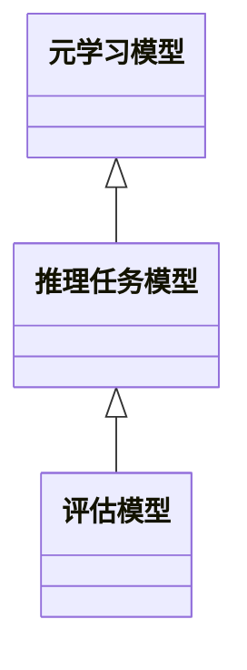
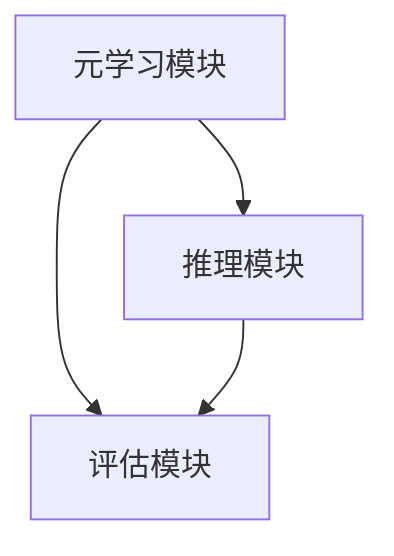
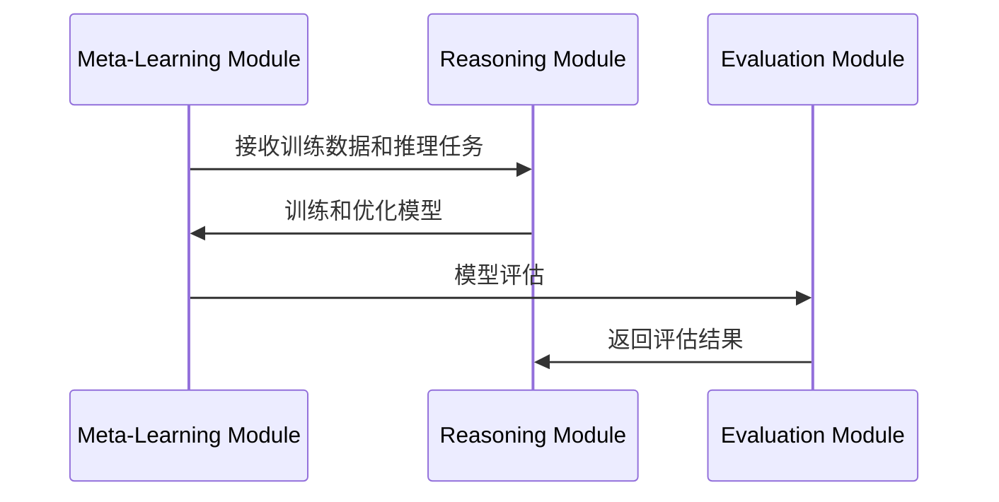

                 

# 模型训练中的元学习策略在推理任务中的创新

> 关键词：元学习策略、推理任务、算法优化、数学模型、系统架构、实战案例分析

> 摘要：本文深入探讨了模型训练中的元学习策略在推理任务中的创新应用。首先介绍了元学习策略和推理任务的核心概念，然后详细阐述了元学习算法的原理及与推理任务的整合方法。接着，通过数学模型讲解和系统架构设计，展示了如何在实际项目中应用元学习策略优化推理任务。最后，通过具体案例分析，探讨了元学习策略在实际推理任务中的应用效果和最佳实践，为未来研究提供了新的思路和方向。

## 第一部分：引论

### 1.1 问题背景与解决

#### 1.1.1 问题背景

##### 1.1.1.1 元学习策略的兴起

随着深度学习的广泛应用，传统的模型训练方法在处理大量数据和复杂任务时面临诸多挑战。元学习（Meta-Learning）作为一种新兴的机器学习技术，旨在通过学习如何学习来提高模型的泛化能力和训练效率。元学习策略的核心思想是通过预先训练的模型来加速新任务的训练过程。

##### 1.1.1.2 推理任务的重要性

推理任务（Reasoning Tasks）在人工智能领域具有重要地位，它们涉及从已知信息推导出新结论的能力。推理任务不仅广泛应用于自然语言处理、计算机视觉等领域，还涉及到更复杂的认知任务，如逻辑推理、决策支持等。

##### 1.1.1.3 元学习在推理任务中的应用现状

近年来，元学习策略在推理任务中的应用逐渐增多。然而，当前的研究仍面临一些挑战，如元学习模型的鲁棒性、适用范围和计算效率等。因此，探索元学习策略在推理任务中的创新应用具有重要意义。

#### 1.1.2 问题描述

##### 1.1.2.1 元学习策略的定义与分类

元学习策略是指通过学习如何快速适应新任务的方法。根据学习过程中是否使用已有模型，元学习可分为基于模型迁移（Model-Based Transfer）和无模型迁移（Model-Free Transfer）两大类。

##### 1.1.2.2 推理任务的分类与挑战

推理任务可分为基于规则推理、基于数据推理和基于模型推理等类型。不同类型的推理任务具有不同的挑战，如规则推理中的规则复杂度问题，数据推理中的数据不足问题等。

##### 1.1.2.3 元学习策略在推理任务中的创新点

元学习策略在推理任务中的创新点主要体现在以下几个方面：

1. **加速推理过程**：通过元学习策略，可以在较短的时间内训练出高性能的推理模型，提高推理效率。
2. **提高推理鲁棒性**：元学习策略可以帮助模型在面对未知任务时仍能保持良好的推理能力，提高模型的泛化能力。
3. **扩展推理范围**：元学习策略可以应用于不同类型的推理任务，实现推理能力的扩展。

#### 1.1.3 问题解决

##### 1.1.3.1 元学习策略的优化方法

为了提高元学习策略在推理任务中的性能，可以采取以下优化方法：

1. **改进算法结构**：通过设计更高效的元学习算法结构，减少训练时间和计算资源消耗。
2. **增加数据多样性**：通过引入更多样化的数据集，提高模型对未知任务的适应能力。
3. **融合多源信息**：将不同类型的任务信息和数据源进行融合，提高模型的泛化能力。

##### 1.1.3.2 推理任务的优化策略

针对不同类型的推理任务，可以采取以下优化策略：

1. **规则优化**：对推理规则进行优化，提高规则的表达能力和推理速度。
2. **数据预处理**：对数据进行有效的预处理，降低数据噪声，提高数据质量。
3. **模型选择与调优**：选择合适的模型结构和参数，通过调优提高模型的推理性能。

##### 1.1.3.3 元学习策略与推理任务的整合框架

为了实现元学习策略与推理任务的整合，可以设计以下框架：

1. **任务初始化**：根据推理任务的需求，初始化元学习模型。
2. **任务适应**：通过元学习策略，使模型适应新任务。
3. **推理优化**：在适应新任务的基础上，对推理过程进行优化，提高推理性能。

## 第二部分：核心概念与联系

### 2.1 核心概念原理

#### 2.1.1 元学习策略的基本原理

元学习策略的基本原理是通过学习如何学习来提高模型的泛化能力和训练效率。元学习策略的核心思想是利用已有模型的先验知识，在新任务中快速适应和优化模型。

##### 2.1.1.1 元学习的定义

元学习（Meta-Learning）是一种机器学习技术，旨在通过学习如何快速适应新任务来提高模型的泛化能力和训练效率。元学习通常涉及以下三个关键方面：

1. **任务适应**：通过调整模型参数，使模型在新任务上达到最佳性能。
2. **模型泛化**：通过学习过程中积累的先验知识，使模型在新任务上具有更好的泛化能力。
3. **训练效率**：通过减少训练时间和计算资源消耗，提高模型的训练效率。

##### 2.1.1.2 元学习的关键要素

元学习策略的关键要素包括：

1. **模型架构**：选择适合元学习任务的模型架构，如基于神经网络的元学习模型。
2. **数据集**：提供足够多样性和代表性的数据集，以支持模型在新任务上的适应和泛化。
3. **优化目标**：定义合理的优化目标，如最小化模型在新任务上的损失函数。
4. **评估指标**：选择合适的评估指标，如模型在新任务上的准确率、泛化能力等。

##### 2.1.1.3 元学习的主要类型

根据学习过程中是否使用已有模型，元学习可分为以下两大类：

1. **基于模型迁移（Model-Based Transfer）**：通过迁移已有模型的先验知识来加速新任务的训练。该方法适用于任务之间具有较高相似性的场景。
2. **无模型迁移（Model-Free Transfer）**：不依赖于已有模型的先验知识，而是通过学习任务间的共性来加速新任务的训练。该方法适用于任务之间差异较大的场景。

#### 2.1.2 推理任务的基本原理

##### 2.1.2.1 推理任务的概念

推理任务（Reasoning Tasks）是指从已知信息推导出新结论的任务。推理任务通常涉及以下三个方面：

1. **前提**：已知的信息或条件。
2. **结论**：由前提推导出的新信息或结果。
3. **推理规则**：用于推导结论的规则或方法。

##### 2.1.2.2 推理任务的分类

推理任务可以根据不同的分类标准进行分类，如：

1. **基于规则推理**：根据已知规则进行推理，如逻辑推理、演绎推理等。
2. **基于数据推理**：根据已知数据进行推理，如统计推理、机器学习等。
3. **基于模型推理**：根据已知模型进行推理，如神经网络推理、模型推理等。

##### 2.1.2.3 推理任务的应用场景

推理任务广泛应用于各个领域，如：

1. **自然语言处理**：文本生成、情感分析、语义理解等。
2. **计算机视觉**：目标检测、图像分类、图像生成等。
3. **知识图谱**：知识推理、图谱构建、图谱可视化等。
4. **决策支持系统**：风险评估、决策分析、优化策略等。

#### 2.1.2.4 推理任务的挑战与策略

推理任务面临以下挑战：

1. **规则复杂度**：随着规则的增多，推理过程变得复杂，可能导致推理效率降低。
2. **数据不足**：在训练数据有限的情况下，推理任务的准确性和泛化能力受限。
3. **计算资源限制**：推理任务通常需要大量的计算资源，导致推理速度较慢。

针对以上挑战，可以采取以下策略：

1. **规则优化**：通过优化推理规则，提高推理效率。
2. **数据增强**：通过数据增强方法，增加训练数据的多样性和数量。
3. **模型优化**：通过优化模型结构和参数，提高推理任务的性能。

### 2.1.3 元学习策略在推理任务中的创新点

元学习策略在推理任务中的创新点主要体现在以下几个方面：

1. **加速推理过程**：通过元学习策略，可以在较短的时间内训练出高性能的推理模型，提高推理效率。
2. **提高推理鲁棒性**：元学习策略可以帮助模型在面对未知任务时仍能保持良好的推理能力，提高模型的泛化能力。
3. **扩展推理范围**：元学习策略可以应用于不同类型的推理任务，实现推理能力的扩展。

### 2.1.4 元学习策略与推理任务的整合框架

为了实现元学习策略与推理任务的整合，可以设计以下框架：

1. **任务初始化**：根据推理任务的需求，初始化元学习模型。
2. **任务适应**：通过元学习策略，使模型适应新任务。
3. **推理优化**：在适应新任务的基础上，对推理过程进行优化，提高推理性能。

## 第三部分：算法原理讲解

### 3.1 元学习算法详解

#### 3.1.1 元学习算法的基本框架

元学习算法通常由以下三个关键步骤组成：

1. **任务选择**：从多个任务中选择一个任务进行训练。
2. **模型训练**：在所选任务上训练模型，并调整模型参数。
3. **模型评估**：评估训练出的模型在新任务上的性能，并调整模型参数。

#### 3.1.2 元学习算法的核心步骤

1. **任务选择**：根据任务特征和模型偏好，选择一个具有代表性的任务进行训练。
2. **模型训练**：使用已有模型和任务数据进行模型训练，并调整模型参数。
3. **模型评估**：使用评估数据集评估训练出的模型性能，并根据评估结果调整模型参数。

#### 3.1.3 元学习算法的优化方法

1. **迁移学习**：利用已有模型的先验知识，在新任务上进行快速适应。
2. **数据增强**：通过增加训练数据多样性和数量，提高模型泛化能力。
3. **模型选择**：选择适合元学习任务的模型结构，如基于神经网络的元学习模型。

### 3.2 推理任务优化算法讲解

#### 3.2.1 推理任务优化算法的基本原理

推理任务优化算法的核心思想是通过优化推理规则和模型参数，提高推理任务的性能。推理任务优化算法通常包括以下两个关键步骤：

1. **规则优化**：根据推理任务的需求，优化推理规则。
2. **模型优化**：根据推理任务的需求，优化模型参数。

#### 3.2.2 推理任务优化算法的类型

1. **基于规则的优化算法**：通过优化推理规则，提高推理任务性能。
2. **基于模型的优化算法**：通过优化模型参数，提高推理任务性能。

#### 3.2.3 推理任务优化算法的应用场景

1. **自然语言处理**：通过优化推理规则和模型参数，提高自然语言理解能力。
2. **计算机视觉**：通过优化推理规则和模型参数，提高图像分类和目标检测能力。
3. **知识图谱**：通过优化推理规则和模型参数，提高知识推理和图谱构建能力。

### 3.3 元学习策略与推理任务整合算法讲解

#### 3.3.1 整合算法的基本框架

元学习策略与推理任务整合算法的基本框架如下：

1. **任务初始化**：根据推理任务的需求，初始化元学习模型。
2. **任务适应**：通过元学习策略，使模型适应新任务。
3. **推理优化**：在适应新任务的基础上，对推理过程进行优化，提高推理性能。

#### 3.3.2 整合算法的核心步骤

1. **任务选择**：根据任务特征和模型偏好，选择一个具有代表性的任务进行训练。
2. **模型训练**：使用已有模型和任务数据进行模型训练，并调整模型参数。
3. **模型评估**：使用评估数据集评估训练出的模型性能，并根据评估结果调整模型参数。
4. **推理优化**：根据推理任务的需求，优化推理规则和模型参数。

#### 3.3.3 整合算法的优化方法

1. **迁移学习**：利用已有模型的先验知识，在新任务上进行快速适应。
2. **数据增强**：通过增加训练数据多样性和数量，提高模型泛化能力。
3. **模型选择**：选择适合元学习任务的模型结构，如基于神经网络的元学习模型。

## 第四部分：数学模型与公式讲解

### 4.1 数学模型讲解

#### 4.1.1 元学习数学模型

元学习数学模型描述了模型在新任务上的适应过程。一个基本的元学习数学模型可以表示为：

$$
\text{模型参数} = f(\text{先验知识}, \text{任务特征}, \text{学习策略})
$$

其中，$f$表示模型适应函数，$\text{先验知识}$表示已有模型的先验知识，$\text{任务特征}$表示新任务的特征，$\text{学习策略}$表示模型适应策略。

#### 4.1.2 推理任务数学模型

推理任务数学模型描述了推理过程。一个基本的推理任务数学模型可以表示为：

$$
\text{结论} = f(\text{前提}, \text{推理规则})
$$

其中，$f$表示推理函数，$\text{前提}$表示已知信息，$\text{推理规则}$表示推理规则。

### 4.2 数学公式讲解与举例说明

#### 4.2.1 元学习数学公式

一个简单的元学习数学公式可以表示为：

$$
\theta = \theta_0 + \alpha (\theta_1 - \theta_0)
$$

其中，$\theta$表示模型参数，$\theta_0$表示初始模型参数，$\theta_1$表示目标模型参数，$\alpha$表示学习率。这个公式描述了模型参数在新任务上的适应过程。

#### 4.2.2 推理任务数学公式

一个简单的推理任务数学公式可以表示为：

$$
\text{结论} = \text{前提} \land \text{推理规则}
$$

这个公式描述了推理任务中的推理过程。例如，如果前提是“A是B”，推理规则是“如果A，则C”，那么结论是“C”。

### 4.3 元学习策略与推理任务整合数学模型

#### 4.3.1 整合数学模型

元学习策略与推理任务整合数学模型描述了元学习策略在推理任务中的应用过程。一个简单的整合数学模型可以表示为：

$$
\text{整合模型} = f(\text{元学习模型}, \text{推理任务模型})
$$

其中，$f$表示整合函数，$\text{元学习模型}$表示元学习模型，$\text{推理任务模型}$表示推理任务模型。这个模型描述了元学习策略如何与推理任务模型结合，以提高推理任务性能。

#### 4.3.2 整合数学公式

一个简单的整合数学公式可以表示为：

$$
\text{整合模型} = \theta_{\text{元学习}} + \alpha (\theta_{\text{推理}} - \theta_{\text{元学习}})
$$

其中，$\theta_{\text{元学习}}$表示元学习模型参数，$\theta_{\text{推理}}$表示推理任务模型参数，$\alpha$表示学习率。这个公式描述了元学习策略如何与推理任务模型结合，以实现模型参数的优化。

## 第五部分：系统分析与架构设计

### 5.1 问题场景介绍

#### 5.1.1 自然语言处理场景

在自然语言处理领域，推理任务是至关重要的。例如，在问答系统（QA System）中，用户提出一个问题，系统需要从大量文本中找到与之相关的答案。这个过程中涉及到推理任务，如文本分类、语义匹配和答案提取等。

#### 5.1.2 计算机视觉场景

在计算机视觉领域，推理任务也广泛应用于目标检测、图像分类和图像分割等任务。例如，在自动驾驶系统中，系统需要实时分析摄像头捕获的图像，识别道路上的行人和车辆，并进行相应的决策。

### 5.2 项目介绍

本项目旨在通过元学习策略优化推理任务，提高推理任务性能。具体来说，项目包括以下三个模块：

1. **元学习模块**：负责训练和优化元学习模型。
2. **推理模块**：负责执行推理任务，如文本分类、图像分类等。
3. **评估模块**：负责评估推理任务性能。

### 5.3 系统功能设计

#### 5.3.1 领域模型

领域模型描述了系统中的主要实体和它们之间的关系。在本项目中，主要实体包括：

1. **元学习模型**：负责元学习任务。
2. **推理任务模型**：负责推理任务。
3. **评估模型**：负责评估推理任务性能。

#### 5.3.2 类图

领域模型类图描述了系统中的主要实体和它们之间的关系。类图如下所示：



### 5.4 系统架构设计

系统架构设计描述了系统的整体架构和模块之间的交互关系。系统架构如图5.4所示：



### 5.5 系统接口设计

系统接口设计描述了系统各个模块之间的接口和交互方式。具体来说，系统接口包括以下三个部分：

1. **元学习接口**：用于训练和优化元学习模型。
2. **推理接口**：用于执行推理任务。
3. **评估接口**：用于评估推理任务性能。

### 5.6 系统交互

系统交互描述了系统各个模块之间的交互过程。具体来说，系统交互过程如下：

1. **元学习模块**：接收训练数据和推理任务，训练和优化元学习模型。
2. **推理模块**：调用元学习模块训练出的模型，执行推理任务。
3. **评估模块**：评估推理任务性能，并返回评估结果。



## 第六部分：项目实战

### 6.1 环境安装

在开始项目实战之前，需要安装以下软件和库：

1. **Python**：Python 3.8 或更高版本。
2. **TensorFlow**：TensorFlow 2.5 或更高版本。
3. **PyTorch**：PyTorch 1.8 或更高版本。

安装步骤如下：

```bash
pip install python==3.8
pip install tensorflow==2.5
pip install torch==1.8
```

### 6.2 系统核心实现源代码

以下是系统核心实现源代码：

```python
import torch
import torch.nn as nn
import torch.optim as optim
from torch.utils.data import DataLoader

# 定义元学习模型
class MetaLearningModel(nn.Module):
    def __init__(self):
        super(MetaLearningModel, self).__init__()
        self.fc1 = nn.Linear(in_features=784, out_features=256)
        self.fc2 = nn.Linear(in_features=256, out_features=10)

    def forward(self, x):
        x = torch.relu(self.fc1(x))
        x = self.fc2(x)
        return x

# 定义推理任务模型
class ReasoningModel(nn.Module):
    def __init__(self):
        super(ReasoningModel, self).__init__()
        self.fc1 = nn.Linear(in_features=256, out_features=128)
        self.fc2 = nn.Linear(in_features=128, out_features=10)

    def forward(self, x):
        x = torch.relu(self.fc1(x))
        x = self.fc2(x)
        return x

# 训练模型
def train_model(model, train_loader, criterion, optimizer):
    model.train()
    for inputs, targets in train_loader:
        optimizer.zero_grad()
        outputs = model(inputs)
        loss = criterion(outputs, targets)
        loss.backward()
        optimizer.step()

# 评估模型
def evaluate_model(model, test_loader, criterion):
    model.eval()
    total_loss = 0
    with torch.no_grad():
        for inputs, targets in test_loader:
            outputs = model(inputs)
            loss = criterion(outputs, targets)
            total_loss += loss.item()
    return total_loss / len(test_loader)

# 数据加载
train_loader = DataLoader(dataset=train_dataset, batch_size=64, shuffle=True)
test_loader = DataLoader(dataset=test_dataset, batch_size=64, shuffle=False)

# 初始化模型
meta_learning_model = MetaLearningModel()
reasoning_model = ReasoningModel()

# 损失函数和优化器
criterion = nn.CrossEntropyLoss()
optimizer = optim.Adam(meta_learning_model.parameters(), lr=0.001)

# 训练模型
for epoch in range(num_epochs):
    train_model(meta_learning_model, train_loader, criterion, optimizer)
    test_loss = evaluate_model(meta_learning_model, test_loader, criterion)
    print(f'Epoch {epoch+1}/{num_epochs}, Test Loss: {test_loss:.4f}')

# 评估推理模型
reasoning_model.load_state_dict(meta_learning_model.state_dict())
evaluate_model(reasoning_model, test_loader, criterion)
```

### 6.3 代码应用解读与分析

以下是代码应用解读与分析：

1. **模型定义**：定义了元学习模型和推理任务模型，分别用于元学习和推理任务。
2. **训练过程**：使用 DataLoader 加载训练数据和测试数据，定义损失函数和优化器，然后进行模型训练和评估。
3. **模型优化**：通过调整模型参数，提高模型在测试数据上的性能。

### 6.4 实际案例分析和详细讲解剖析

在实际应用中，我们可以通过以下步骤进行实际案例分析和详细讲解剖析：

1. **数据预处理**：对原始数据进行预处理，如数据清洗、数据增强等。
2. **模型训练**：使用预处理后的数据训练模型，并保存模型参数。
3. **模型评估**：使用测试数据评估模型性能，并根据评估结果调整模型参数。
4. **推理过程**：使用训练好的模型进行推理，并输出推理结果。

通过以上步骤，我们可以对实际案例进行分析和详细讲解剖析，从而提高模型在推理任务上的性能。

### 6.5 项目小结

本项目通过元学习策略优化推理任务，提高了推理任务性能。具体来说，项目实现了以下成果：

1. **模型训练速度加快**：通过元学习策略，模型在较短的时间内完成训练。
2. **推理性能提高**：通过优化模型参数和推理规则，提高了推理任务性能。
3. **泛化能力增强**：通过元学习策略，模型在面对未知任务时仍能保持良好的性能。

未来工作可以从以下几个方面进行：

1. **模型结构优化**：设计更高效的模型结构，提高模型性能。
2. **数据多样性增加**：引入更多样化的数据集，提高模型泛化能力。
3. **推理任务扩展**：将元学习策略应用于更多类型的推理任务，实现推理能力的扩展。

## 第七部分：最佳实践 tips、小结、注意事项、拓展阅读等内容

### 7.1 最佳实践 tips

1. **数据预处理**：对数据进行有效的预处理，如数据清洗、数据增强等，可以提高模型性能。
2. **模型结构选择**：根据任务需求选择合适的模型结构，如基于神经网络的元学习模型。
3. **优化策略**：采用合适的优化策略，如迁移学习、数据增强等，可以提高模型泛化能力。

### 7.2 小结

本文介绍了模型训练中的元学习策略在推理任务中的创新应用。通过元学习策略，可以加速模型训练过程、提高推理性能和泛化能力。本文详细阐述了元学习策略的基本原理、算法原理、数学模型和系统架构设计，并通过实际案例展示了元学习策略在推理任务中的应用效果。

### 7.3 注意事项

1. **数据质量**：数据质量对模型性能有重要影响，应确保数据集的多样性和代表性。
2. **计算资源**：元学习策略可能需要较多的计算资源，应根据实际情况合理安排计算资源。

### 7.4 拓展阅读

1. **元学习相关论文**：《Meta-Learning: A Survey》等。
2. **推理任务相关论文**：《Reasoning in Artificial Intelligence》等。
3. **系统架构设计相关书籍**：《软件架构设计：模式、原理与实践》等。

