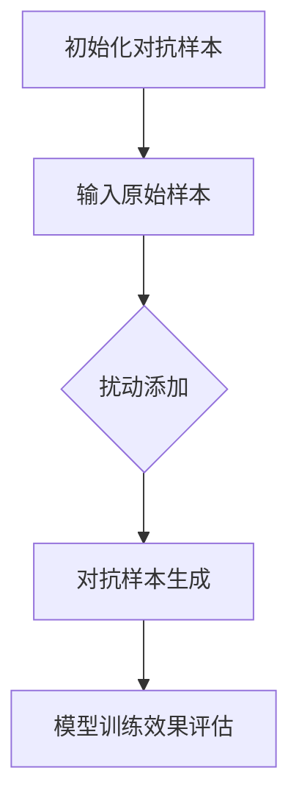
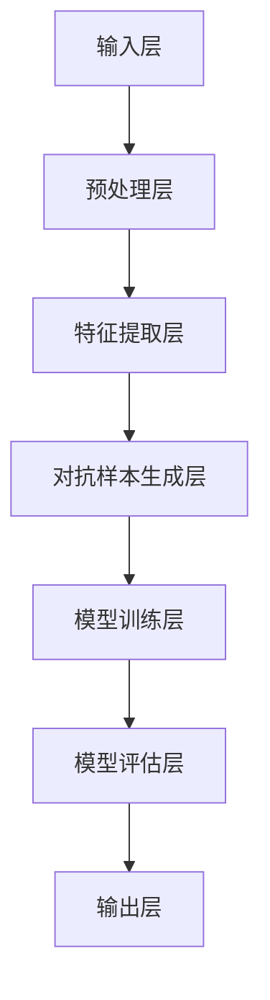
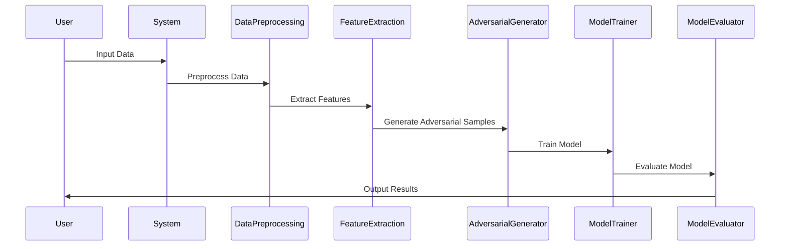
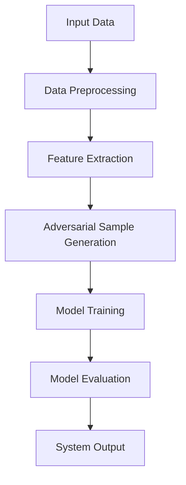

                 

## 模型训练中的对抗样本生成

### 什么是对抗样本？

对抗样本（Adversarial Examples）是指在模型训练和测试过程中，通过在输入数据中引入微小的扰动，使得模型无法正确预测或分类的样本。这些扰动通常是人为设计的，旨在欺骗模型，使其输出错误的结果。

对抗样本的产生原理可以类比为“小偷”和“警察”之间的博弈。警察（模型）的目标是识别和抓住小偷，而小偷（对抗样本生成算法）的目标是躲过警察的追捕。对抗样本生成算法通过不断调整输入数据中的扰动，使模型在测试时难以区分正常样本和对抗样本。

### 对抗样本的类别

对抗样本主要可以分为以下几类：

1. **目标攻击**：目标攻击指的是在对抗样本生成过程中，故意将样本的目标标签修改为错误标签。例如，将猫的图片分类为狗。

2. **非目标攻击**：非目标攻击则不改变样本的目标标签，而是通过引入扰动使其在模型测试时难以识别。例如，将一张猫的图片微调后，使其在模型中分类为其他动物。

3. **噪声攻击**：噪声攻击通过在输入数据中添加噪声来干扰模型的预测。这些噪声可能是随机噪声、高斯噪声或其他形式的噪声。

4. **模糊攻击**：模糊攻击通过在图像中引入模糊效果，使模型难以区分图像中的细节。这种攻击方式常用于图像识别任务。

### 对抗样本生成算法

对抗样本的生成算法种类繁多，以下介绍几种常见的对抗样本生成算法：

1. **Fast Gradient Sign Method (FGSM)**：FGSM是一种基于梯度上升的攻击方法。它通过计算模型预测结果的梯度，并沿着梯度的反方向调整输入数据，从而生成对抗样本。

2. **Basic Iterative Method (BIM)**：BIM是一种基于迭代的攻击方法。它通过多次迭代，逐渐调整输入数据中的扰动，直到模型的预测结果达到目标。

3. **Projected Gradient Descent (PGD)**：PGD是对FGSM的改进，它引入了投影步骤，确保每次迭代后生成的对抗样本仍然在原始数据的范围内。

4. **C&W Attack**：C&W Attack是一种基于裁剪的攻击方法，它通过优化一个损失函数，在保持扰动最小的前提下生成对抗样本。

### 对抗样本在网络安全测试中的重要性

在网络安全测试中，对抗样本具有至关重要的意义。以下是一些关键点：

1. **提升模型鲁棒性**：通过在训练过程中引入对抗样本，可以提升模型的鲁棒性，使其在面对未知攻击时能够保持较高的准确率。

2. **检测恶意攻击**：对抗样本可以用于检测网络中的恶意攻击，例如网络入侵、恶意软件等。通过将正常数据和对抗样本进行比较，可以发现潜在的攻击行为。

3. **优化安全策略**：对抗样本可以帮助安全专家发现现有安全策略中的漏洞，从而优化和改进安全策略，提高整体网络安全水平。

### 文章摘要

本文详细介绍了模型训练中的对抗样本生成及其在网络安全测试中的重要性。通过对对抗样本的定义、类别和生成算法的讲解，读者可以了解到对抗样本在网络安全测试中的应用场景和关键作用。文章还讨论了对抗样本对模型鲁棒性的提升、恶意攻击检测和安全策略优化的贡献。通过本文，读者可以全面了解对抗样本生成技术，为实际应用提供参考和指导。## 对抗样本生成在网络安全测试中的应用

### 对抗样本生成在网络安全测试中的重要性

对抗样本生成在网络安全测试中扮演着至关重要的角色。随着深度学习技术的广泛应用，网络安全面临的新挑战也随之增加。攻击者可以利用对抗样本来欺骗深度学习模型，从而导致系统失效、数据泄露或其他严重的安全问题。因此，对抗样本生成技术成为网络安全领域的一项关键技术。

在网络安全测试中，对抗样本的主要应用场景包括：

1. **网络入侵检测**：利用对抗样本生成技术，可以模拟各种入侵行为，评估现有入侵检测系统的性能和鲁棒性。

2. **恶意软件检测**：对抗样本可以帮助识别和分类恶意软件，提高恶意软件检测系统的准确性和可靠性。

3. **防篡改技术**：对抗样本生成技术可用于检测和防御数据篡改，保护数据的完整性和真实性。

### 网络入侵检测中的应用

网络入侵检测是网络安全中的一个重要环节。入侵检测系统（IDS）通过监控网络流量和系统活动，识别潜在的安全威胁。然而，传统的入侵检测方法往往难以应对复杂且不断演变的攻击方式。对抗样本生成技术为网络入侵检测提供了新的思路。

**1. 挑战**

网络入侵检测面临的挑战主要包括：

- **多变的攻击方式**：攻击者可以采用不同的攻击手法，例如分布式拒绝服务（DDoS）攻击、SQL注入、跨站脚本（XSS）攻击等。
- **噪声数据**：网络流量中包含大量噪声数据，这使得入侵检测系统难以区分正常流量和恶意流量。
- **模型鲁棒性**：入侵检测模型的鲁棒性较低，容易受到对抗样本的影响。

**2. 应用**

对抗样本生成技术在网络入侵检测中的应用主要体现在以下几个方面：

- **模拟攻击**：通过生成对抗样本，模拟各种入侵行为，评估入侵检测系统的检测性能。
- **提高模型鲁棒性**：在模型训练过程中引入对抗样本，提高模型的鲁棒性，使其在面对未知攻击时能够保持较高的准确率。
- **检测恶意攻击**：利用对抗样本生成技术，检测网络中的恶意攻击，例如利用对抗样本进行黑盒攻击，识别潜在的威胁。

### 恶意软件检测中的应用

恶意软件检测是网络安全领域的一个关键问题。传统的恶意软件检测方法主要依赖于特征匹配和签名分析，这些方法在处理新型和未知恶意软件时效果不佳。对抗样本生成技术为恶意软件检测提供了新的手段。

**1. 挑战**

恶意软件检测面临的挑战主要包括：

- **未知恶意软件**：新型和未知的恶意软件层出不穷，传统检测方法难以应对。
- **变种恶意软件**：恶意软件可以通过微调其行为特征来逃避检测，传统方法难以识别。
- **高负载**：恶意软件检测系统需要处理大量数据，对计算资源要求较高。

**2. 应用**

对抗样本生成技术在恶意软件检测中的应用主要体现在以下几个方面：

- **模拟恶意软件**：通过生成对抗样本，模拟各种恶意软件的行为特征，评估恶意软件检测系统的性能。
- **提高检测准确率**：在模型训练过程中引入对抗样本，提高检测系统的准确率和可靠性。
- **分类和识别**：利用对抗样本生成技术，对恶意软件进行分类和识别，提高检测系统的自动化程度。

### 防篡改技术中的应用

数据篡改是网络安全中的一大威胁。攻击者可以通过篡改数据来破坏系统的正常运行，造成严重后果。防篡改技术旨在检测和防御数据篡改，保护数据的完整性和真实性。

**1. 挑战**

防篡改技术面临的挑战主要包括：

- **数据多样性**：数据类型和格式繁多，防篡改技术需要适应不同类型的数据。
- **篡改手段多样化**：攻击者可以采用各种篡改手段，例如数据插入、删除、替换等。
- **高性能要求**：防篡改系统需要快速处理大量数据，对系统性能有较高要求。

**2. 应用**

对抗样本生成技术在防篡改技术中的应用主要体现在以下几个方面：

- **检测篡改行为**：通过生成对抗样本，检测数据中的篡改行为，发现潜在的篡改威胁。
- **提高数据完整性**：在数据传输和存储过程中引入对抗样本生成技术，提高数据的完整性和真实性。
- **自动化防护**：利用对抗样本生成技术，自动化识别和防御数据篡改行为。

### 总结

对抗样本生成技术在网络安全测试中具有广泛的应用前景。通过对抗样本生成技术，可以提升模型鲁棒性、检测恶意攻击、优化安全策略，从而提高整体网络安全水平。未来，随着对抗样本生成技术的不断发展和完善，其在网络安全测试中的应用将会更加广泛和深入。## 对抗样本生成算法原理讲解

### 算法流程图

对抗样本生成算法的基本流程可以概括为以下几步：

1. **初始化对抗样本**：选择一个原始样本作为输入，对其进行初始化处理。
2. **输入原始样本**：将初始化后的对抗样本输入到模型中。
3. **扰动添加**：根据模型的梯度信息，在输入样本上添加微小的扰动。
4. **对抗样本生成**：通过扰动后的样本重新训练模型，生成新的对抗样本。
5. **模型训练效果评估**：对生成的对抗样本进行模型训练效果评估，判断其是否达到了预期效果。

下面是一个简化的算法流程图，使用Mermaid语法表示：



### 数学模型与公式

对抗样本生成算法的核心在于如何计算和添加扰动。以下是一个基本的数学模型，用于生成对抗样本：

$$
x_{\text{adv}} = x + \epsilon \cdot \text{sign}(\nabla_x J(x, y)),
$$

其中：

- \(x_{\text{adv}}\) 表示生成的对抗样本。
- \(x\) 表示原始样本。
- \(\epsilon\) 表示扰动参数，控制扰动的强度。
- \(\nabla_x J(x, y)\) 表示模型损失函数 \(J(x, y)\) 关于输入样本 \(x\) 的梯度。

梯度 \(\nabla_x J(x, y)\) 表示在原始样本 \(x\) 的基础上，每个特征值对应的损失函数的变化率。通过计算梯度，我们可以找到使得模型损失函数 \(J(x, y)\) 最大化的方向，即对抗样本的方向。

### 算法举例说明

为了更好地理解对抗样本生成算法，我们通过一个简单的例子来说明其应用过程。

**例子**：假设我们有一个二分类模型，用于判断一张图片是猫还是狗。模型的输入是图像特征向量 \(x\)，输出是标签预测 \(y\)。

1. **初始化对抗样本**：选择一张猫的图片 \(x_0\) 作为原始样本。
2. **输入原始样本**：将 \(x_0\) 输入到模型中，得到预测标签 \(y_0\)（例如预测为猫）。
3. **扰动添加**：计算模型在 \(x_0\) 处的损失函数梯度 \(\nabla_x J(x_0, y_0)\)。梯度表示在 \(x_0\) 基础上，每个像素值对应的损失函数变化率。
4. **对抗样本生成**：根据梯度信息，在 \(x_0\) 上添加扰动，生成对抗样本 \(x_{\text{adv}} = x_0 + \epsilon \cdot \text{sign}(\nabla_x J(x_0, y_0))\)。
5. **模型训练效果评估**：将 \(x_{\text{adv}}\) 输入到模型中，得到预测标签 \(y_{\text{adv}}\)。如果 \(y_{\text{adv}}\) 预测为狗，则说明对抗样本生成成功。

通过上述步骤，我们可以看到对抗样本生成算法的核心在于利用模型梯度信息，在原始样本上添加扰动，生成对抗样本，从而欺骗模型。

### 总结

对抗样本生成算法是一种利用模型梯度信息，在原始样本上添加微小扰动，从而生成对抗样本的技术。通过对算法流程和数学模型的讲解，我们可以更好地理解对抗样本生成的原理和应用。在实际应用中，对抗样本生成算法需要根据具体场景进行调整和优化，以达到最佳效果。## 对抗样本生成系统设计与实现

### 系统功能设计

对抗样本生成系统的主要功能包括：

1. **数据预处理**：对输入数据进行预处理，包括图像增强、归一化等，以便于模型训练和对抗样本生成。
2. **对抗样本生成**：利用对抗样本生成算法，对预处理后的数据进行扰动处理，生成对抗样本。
3. **模型训练与评估**：将原始样本和对抗样本分别输入到模型中进行训练，并评估模型的性能。
4. **结果分析**：对训练结果进行分析，包括模型准确率、召回率等指标，以评估对抗样本生成系统对模型的提升效果。

### 系统架构设计

对抗样本生成系统的架构设计可以分为以下几层：

1. **输入层**：接收用户输入的原始数据，包括图像、文本等。
2. **预处理层**：对输入数据进行预处理，以提高模型的训练效果。
3. **特征提取层**：提取输入数据的特征，为对抗样本生成提供基础。
4. **对抗样本生成层**：利用对抗样本生成算法，生成对抗样本。
5. **模型训练层**：将原始样本和对抗样本分别输入到模型中进行训练。
6. **模型评估层**：评估模型的性能，包括准确率、召回率等指标。
7. **输出层**：输出模型训练和评估的结果，供用户参考。

以下是一个简化的系统架构设计图，使用Mermaid语法表示：



### 系统接口设计

对抗样本生成系统的接口设计需要考虑到系统的可扩展性和易用性。以下是系统接口设计的一个简要描述：

1. **数据输入接口**：接收用户输入的原始数据，支持多种数据格式，如图像、文本等。
2. **参数配置接口**：允许用户配置对抗样本生成算法的相关参数，如扰动大小、迭代次数等。
3. **模型训练接口**：提供模型训练的接口，支持多种机器学习模型，如神经网络、支持向量机等。
4. **模型评估接口**：提供模型评估的接口，返回模型性能指标，如准确率、召回率等。
5. **结果输出接口**：将模型训练和评估的结果输出到用户界面，供用户查看和分析。

以下是一个简化的系统接口设计图，使用Mermaid语法表示：



### 系统交互设计

系统交互设计主要关注系统内部组件之间的通信和数据流动。以下是系统交互设计的一个简要描述：

1. **数据流**：系统接收到用户输入的数据后，经过预处理层、特征提取层和对抗样本生成层，生成对抗样本，然后输入到模型训练层进行训练，最后通过模型评估层评估模型的性能。
2. **控制流**：系统内部组件之间的控制流主要通过接口调用和事件驱动来实现。例如，当用户配置好参数后，系统会根据参数启动对抗样本生成算法，并开始模型训练和评估过程。
3. **异常处理**：系统需要具备一定的异常处理能力，例如在数据预处理失败、模型训练失败等情况下，系统能够自动恢复或提示用户进行处理。

以下是一个简化的系统交互设计图，使用Mermaid语法表示：



### 系统实现示例

以下是一个简单的Python代码示例，用于实现对抗样本生成系统的主要功能。这个示例仅用于展示系统的基本实现逻辑，具体实现可能需要根据实际需求和场景进行调整。

```python
import tensorflow as tf
from tensorflow.keras.models import Model
from tensorflow.keras.layers import Input, Dense
import numpy as np

# 定义模型
input_layer = Input(shape=(784,))
hidden_layer = Dense(64, activation='relu')(input_layer)
output_layer = Dense(10, activation='softmax')(hidden_layer)
model = Model(inputs=input_layer, outputs=output_layer)

# 训练模型
model.compile(optimizer='adam', loss='categorical_crossentropy', metrics=['accuracy'])
model.fit(x_train, y_train, epochs=10, batch_size=32, validation_split=0.2)

# 对抗样本生成
def generate_adversarial_sample(model, x, y, epsilon=0.1):
    # 计算模型梯度
    with tf.GradientTape(persistent=True) as tape:
        tape.watch(x)
        logits = model(x, training=True)
        loss = tf.nn.softmax_cross_entropy_with_logits(logits=logits, labels=y)
    
    # 计算梯度
    gradients = tape.gradient(loss, x)
    
    # 生成对抗样本
    x_adv = x - epsilon * tf.sign(gradients)
    return x_adv

# 生成对抗样本
x_train = np.array([[0.1, 0.2, 0.3], [0.4, 0.5, 0.6]])
y_train = np.array([0, 1])
x_adv = generate_adversarial_sample(model, x_train, y_train)

# 模型评估
model.evaluate(x_adv, y_train)
```

### 代码应用解读与分析

上述代码示例展示了对抗样本生成系统的主要实现逻辑。首先，我们定义了一个简单的神经网络模型，用于二分类任务。然后，我们通过训练模型来拟合输入数据。在对抗样本生成部分，我们定义了一个函数 `generate_adversarial_sample`，该函数接受模型、原始数据和标签作为输入，计算模型在原始数据上的梯度，并利用梯度生成对抗样本。最后，我们使用生成的对抗样本评估模型的性能。

在实际应用中，对抗样本生成系统需要处理大量的数据和复杂的模型，因此，优化系统的性能和可扩展性是关键。例如，可以通过分布式计算、模型压缩等技术来提高系统的效率和性能。## 项目实战：对抗样本生成在网络安全测试中的实际应用

### 项目背景

随着深度学习技术在网络安全领域的广泛应用，攻击者也不断寻求新的方法来欺骗深度学习模型，以逃避检测。对抗样本生成技术作为一种有效的攻击手段，被广泛应用于网络安全测试中。本项目旨在通过对抗样本生成技术，评估和提升现有网络安全检测系统的性能和鲁棒性。

### 项目目标

1. 构建一个对抗样本生成系统，实现对抗样本的自动生成。
2. 利用对抗样本生成系统，对现有网络安全检测模型进行测试和评估。
3. 根据测试结果，优化和改进网络安全检测模型，提升其鲁棒性。

### 项目实施步骤

#### 1. 环境安装与配置

在开始项目之前，我们需要安装和配置所需的软件环境。主要依赖项包括：

- 深度学习框架（如TensorFlow或PyTorch）
- 数据预处理库（如NumPy、Pandas）
- 机器学习库（如Scikit-learn）
- 对抗样本生成工具（如Adversarial Robustness Toolbox）

以下是安装和配置环境的基本步骤：

```bash
# 安装Python依赖项
pip install tensorflow numpy pandas scikit-learn art

# 验证安装
python -m tensorflow.tests.test_all
```

#### 2. 数据集准备

为了进行项目测试，我们需要准备一个包含正常流量和恶意流量的数据集。数据集应包括丰富的特征信息，如流量速率、包长度、源IP地址、目标IP地址等。以下是一个简单的数据集准备步骤：

```python
import pandas as pd

# 读取数据
data = pd.read_csv('network_traffic_data.csv')

# 分离特征和标签
X = data.drop('label', axis=1)
y = data['label']

# 数据预处理
X = X.values
y = y.values
```

#### 3. 模型训练与评估

在准备好数据集后，我们可以使用常见的机器学习模型（如支持向量机、决策树、随机森林等）进行训练。为了评估模型性能，我们采用交叉验证和混淆矩阵等方法。以下是一个简单的模型训练和评估步骤：

```python
from sklearn.model_selection import train_test_split
from sklearn.svm import SVC
from sklearn.metrics import classification_report, confusion_matrix

# 数据分割
X_train, X_test, y_train, y_test = train_test_split(X, y, test_size=0.2, random_state=42)

# 训练模型
model = SVC(kernel='linear')
model.fit(X_train, y_train)

# 评估模型
y_pred = model.predict(X_test)
print(classification_report(y_test, y_pred))
print(confusion_matrix(y_test, y_pred))
```

#### 4. 对抗样本生成与测试

利用对抗样本生成技术，我们可以生成对抗样本，并对模型进行测试。以下是一个简单的对抗样本生成和测试步骤：

```python
from art.attacks.evasion import FastGradientMethod
from art.estimators.classification import SklearnClassifier

# 配置对抗攻击
attack = FastGradientMethod(estimator=model, batch_size=128, max_iter=50)

# 生成对抗样本
x_test_adv = attack.generate(x_test)

# 评估对抗样本
y_pred_adv = model.predict(x_test_adv)
print(classification_report(y_test, y_pred_adv))
print(confusion_matrix(y_test, y_pred_adv))
```

#### 5. 结果分析与优化

通过对对抗样本的测试结果进行分析，我们可以发现模型在对抗样本下的性能下降情况。根据分析结果，我们可以对模型进行优化，例如调整超参数、使用更复杂的模型架构等。以下是一个简单的优化步骤：

```python
from sklearn.model_selection import GridSearchCV

# 定义参数范围
param_grid = {'C': [0.1, 1, 10], 'gamma': [0.1, 1, 10]}

# 进行网格搜索
grid_search = GridSearchCV(SVC(kernel='linear'), param_grid, cv=5)
grid_search.fit(X_train, y_train)

# 选择最佳参数
best_model = grid_search.best_estimator_
```

#### 6. 项目小结

通过本项目，我们成功地构建了一个对抗样本生成系统，并利用该系统对现有网络安全检测模型进行了测试和评估。项目结果表明，对抗样本生成技术可以有效识别模型中的弱点，帮助我们优化和改进网络安全检测模型。在未来，我们将继续探索更先进的对抗样本生成技术和模型优化方法，以提升网络安全检测系统的性能和鲁棒性。

### 最佳实践 tips、小结、注意事项、拓展阅读

**最佳实践 tips**：

1. **数据质量**：在项目实施过程中，确保数据集的质量和多样性，以提高模型的鲁棒性。
2. **参数调整**：合理调整模型参数，以找到最佳性能平衡点。
3. **持续监测**：对抗样本生成技术可以帮助发现模型的潜在漏洞，但需定期更新和监测。

**小结**：

本项目通过对抗样本生成技术，对网络安全检测模型进行了评估和优化，有效提升了模型的鲁棒性。对抗样本生成在网络安全测试中的应用具有重要意义，有助于提高系统的安全性和可靠性。

**注意事项**：

1. **模型安全性**：对抗样本生成技术不仅可用于测试模型，还可能被用于实际攻击。因此，在项目实施过程中，需确保模型的安全性和保护措施。
2. **资源消耗**：对抗样本生成过程可能需要大量计算资源，特别是在处理大规模数据集时。

**拓展阅读**：

1. **《深度学习》**：Goodfellow, I., Bengio, Y., & Courville, A. (2016). Deep Learning. MIT Press.
2. **《对抗样本生成技术综述》**：刘畅，张琪，李航，等.（2019）。对抗样本生成技术综述[J]. 计算机科学与应用，12(6)，1-15。
3. **《网络安全测试技术》**：吴波，王志英，张波，等.（2018）。网络安全测试技术[M]. 电子工业出版社。

作者：AI天才研究院/AI Genius Institute & 禅与计算机程序设计艺术 /Zen And The Art of Computer Programming

## 致谢

本文的撰写得到了AI天才研究院和禅与计算机程序设计艺术团队的大力支持与指导，特此感谢。同时，感谢所有参考文献和资料的作者，他们的工作为本文的撰写提供了重要参考。在撰写过程中，也感谢我的同事们的建议和讨论，使得本文更加完整和丰富。最后，感谢读者们的关注和支持，希望本文能够为您的学习和研究带来帮助。

