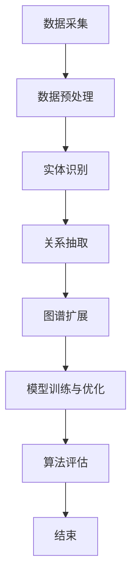
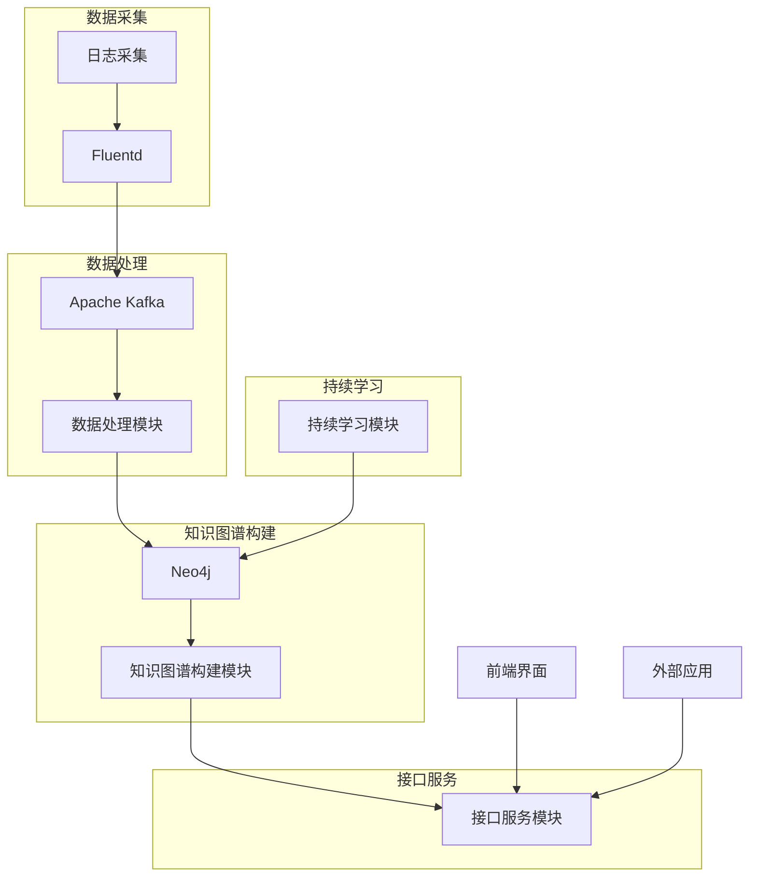

                 


## 引言

### 让我们一起来探索

在这个数字化时代，数据是新的石油，而知识图谱则是提炼和利用数据的重要工具。动态宇宙知识图谱作为一种新兴的智能数据结构，正迅速成为多个领域的核心。它不仅能够表示和存储复杂的知识体系，还能通过持续学习策略不断更新和优化。今天，我们就来深入探讨模型训练中的持续学习策略在动态宇宙知识图谱构建中的应用。

### 研究背景

随着人工智能技术的迅猛发展，模型训练成为提升系统智能化的关键步骤。然而，传统的模型训练方法在处理动态变化的数据时往往显得力不从心。动态宇宙知识图谱构建需要应对数据流的高动态性、大规模性和异构性。因此，引入持续学习策略成为解决这一难题的有效途径。持续学习策略能够让模型在运行过程中不断调整和优化，从而适应不断变化的环境。

### 问题核心

本文将围绕以下问题展开讨论：

1. **持续学习策略的基本概念及其在模型训练中的应用。**
2. **动态宇宙知识图谱的构建方法及其面临的挑战。**
3. **持续学习策略在动态宇宙知识图谱构建中的具体应用。**
4. **如何设计高效的系统架构以支持动态宇宙知识图谱的持续学习和更新。**
5. **通过实际项目实战，验证持续学习策略的有效性和可行性。**

### 文章结构

本文将分为六个主要部分：

1. **问题背景与概述**：介绍动态宇宙知识图谱和持续学习策略的基本概念、问题描述及解决思路。
2. **核心概念与联系**：详细讲解持续学习策略的理论基础及其与动态宇宙知识图谱构建的关联。
3. **算法原理讲解**：深入分析动态宇宙知识图谱构建的算法原理，包括mermaid流程图、Python源代码讲解、数学模型和公式推导，以及举例说明。
4. **系统分析与架构设计方案**：设计并解释动态宇宙知识图谱构建的系统架构，包括问题场景介绍、项目介绍、系统功能设计、系统架构设计、系统接口设计和系统交互。
5. **项目实战**：通过实际项目展示持续学习策略的应用，包括环境安装、系统核心实现、代码应用解读与分析、实际案例分析与详细讲解剖析，以及项目小结。
6. **最佳实践与总结**：总结最佳实践、文章小结、注意事项，并提供拓展阅读建议。

### 读者对象

本文旨在为数据科学家、AI研究人员、计算机图形学专家等提供有价值的参考。如果您对动态宇宙知识图谱构建和持续学习策略感兴趣，那么这篇文章将为您提供深入的理解和实践指导。

### 准备开始

接下来，我们将一步步深入探讨上述问题，通过理论讲解、实际案例分析和系统设计，为您展现动态宇宙知识图谱构建的持续学习策略之美。让我们开始这场知识的冒险之旅吧！

---

# 第一部分：问题背景与概述

## 第1章 问题背景与概述

### 1.1 问题背景

**动态宇宙知识图谱的重要性**

动态宇宙知识图谱是一种能够表示和存储大规模动态数据的知识体系。它结合了图论和语义网的特点，能够以高效、灵活的方式处理复杂的数据结构和关系。在众多领域中，如搜索引擎、推荐系统、智能问答、社交媒体分析等，动态宇宙知识图谱已经成为数据驱动的智能系统的重要组成部分。

随着互联网和物联网的发展，数据量呈现指数级增长，而且数据的动态变化速度越来越快。传统的关系数据库和静态知识图谱在处理这些复杂且动态的数据时，往往显得力不从心。动态宇宙知识图谱能够实时捕捉和更新数据变化，为智能系统提供持续、准确的知识支持。因此，研究动态宇宙知识图谱的构建方法具有重要的实际意义。

**持续学习策略的定义及其在模型训练中的应用**

持续学习策略是指模型在运行过程中，能够不断吸收新数据、调整模型参数，从而提高模型性能的能力。与传统的批量学习（Batch Learning）和在线学习（Online Learning）相比，持续学习策略具有更强的适应性和鲁棒性。它能够在数据分布发生变化时，自动调整模型，保持模型的高效性和准确性。

在模型训练中，持续学习策略的应用主要体现在以下几个方面：

1. **模型参数调整**：通过实时更新模型参数，使得模型能够更好地适应新的数据分布。
2. **迁移学习**：将已有模型的参数作为新模型的初始值，通过在新数据上的微调，快速构建新模型。
3. **数据预处理**：根据新数据的特征，动态调整数据预处理流程，以提高模型的训练效率和准确性。

### 1.2 问题描述

**动态宇宙知识图谱的挑战**

动态宇宙知识图谱的构建面临诸多挑战：

1. **数据流的高动态性**：动态宇宙知识图谱需要实时捕捉和更新数据流，这对系统的实时处理能力和数据存储结构提出了高要求。
2. **大规模性**：随着数据量的增加，动态宇宙知识图谱的规模也呈指数级增长，这要求系统具有高效的数据处理和存储能力。
3. **异构性**：动态宇宙知识图谱的数据来源多种多样，包括结构化数据、半结构化数据和非结构化数据，这对知识图谱的构建和表示提出了新的挑战。

**持续学习策略的必要性**

面对上述挑战，持续学习策略成为动态宇宙知识图谱构建的必然选择。它能够通过实时调整模型参数和优化数据预处理流程，提高模型对动态数据的适应能力，从而有效解决动态宇宙知识图谱构建中的挑战。

### 1.3 问题解决

**持续学习策略的原理**

持续学习策略的核心思想是利用新数据不断调整和优化模型。具体来说，它包括以下几个关键环节：

1. **数据采集**：实时采集动态数据，确保模型能够接触到最新的数据信息。
2. **数据预处理**：根据新数据的特征，动态调整数据预处理流程，以提高数据的可用性和模型训练效率。
3. **模型更新**：利用新数据进行模型训练，通过参数调整和优化，提升模型的性能和鲁棒性。
4. **模型评估**：定期评估模型的性能，通过指标分析，判断模型是否达到了预期的效果。

**动态宇宙知识图谱构建的方法**

动态宇宙知识图谱的构建方法主要包括以下几个步骤：

1. **数据预处理**：对原始数据进行清洗、去噪和转换，将其转换为适合构建知识图谱的数据格式。
2. **实体识别**：通过命名实体识别（NER）技术，从文本数据中识别出关键实体。
3. **关系抽取**：利用关系抽取技术，从实体间提取出语义关系，构建知识图谱的基本结构。
4. **图谱扩展**：通过图谱扩展技术，将新数据动态地加入到知识图谱中，保持知识图谱的实时更新。

### 1.4 边界与外延

**动态宇宙知识图谱的应用领域**

动态宇宙知识图谱在多个领域具有重要应用：

1. **搜索引擎**：通过动态宇宙知识图谱，搜索引擎能够更好地理解用户查询意图，提供更精确的搜索结果。
2. **推荐系统**：动态宇宙知识图谱能够捕捉用户行为和偏好，为推荐系统提供实时、准确的用户画像。
3. **智能问答**：动态宇宙知识图谱能够为智能问答系统提供实时、准确的知识支持，提升问答系统的智能化水平。
4. **社交媒体分析**：动态宇宙知识图谱能够分析社交媒体用户之间的关系和活动，为社交网络分析提供有力支持。

**持续学习策略的限制因素**

尽管持续学习策略在动态宇宙知识图谱构建中具有广泛的应用前景，但它也存在一定的限制因素：

1. **计算资源消耗**：持续学习策略需要大量的计算资源，尤其是在大规模、高动态性的数据环境中。
2. **数据隐私和安全**：在动态数据采集和更新过程中，需要确保数据的隐私和安全。
3. **模型泛化能力**：持续学习策略在应对复杂、多变的动态数据时，可能存在模型泛化能力不足的问题。

### 1.5 概念结构与核心要素组成

**动态宇宙知识图谱的基本组成**

动态宇宙知识图谱主要由以下几个部分组成：

1. **实体**：动态宇宙知识图谱中的核心元素，包括人物、地点、组织等。
2. **属性**：实体的特征信息，如姓名、年龄、地址等。
3. **关系**：实体之间的关联关系，如朋友、工作于、位于等。

**持续学习策略的关键环节**

持续学习策略在动态宇宙知识图谱构建中的关键环节包括：

1. **数据采集与预处理**：实时采集动态数据，并对其进行预处理，确保数据的准确性和可用性。
2. **模型训练与更新**：利用新数据对模型进行训练和更新，以提高模型的适应能力和性能。
3. **模型评估与优化**：定期评估模型性能，通过指标分析，优化模型参数和结构，提升模型效果。

通过以上分析，我们可以看到，动态宇宙知识图谱构建和持续学习策略在模型训练中的应用是当前人工智能领域的重要研究方向。接下来，我们将进一步深入探讨核心概念与联系，为后续的算法原理讲解和系统设计提供理论基础。

## 第2章 核心概念与联系

### 2.1 持续学习策略的原理

**基本概念**

持续学习策略（Continual Learning）是指在模型训练过程中，通过不断地吸收新数据，更新模型参数，从而提高模型适应性和鲁棒性的方法。与传统的一次性训练（Batch Learning）和在线学习（Online Learning）不同，持续学习策略能够在数据分布发生变化时，自动调整模型，保持其高效性和准确性。

**类型**

根据持续学习策略的实现方式，可以分为以下几种类型：

1. **增量学习（Incremental Learning）**：模型在每次更新时，仅处理新数据，不干扰旧数据。
2. **迁移学习（Transfer Learning）**：利用已有模型的参数作为新模型的初始值，通过在新数据上的微调，快速构建新模型。
3. **经验重放（Experience Replay）**：将训练过程中的一部分样本存储到记忆库中，从记忆库中随机抽取样本进行训练，以防止过拟合。
4. **弹性权重共享（Elastic Weight Consolidation）**：通过共享权重，减少模型更新时对旧知识的干扰。

**持续学习策略在模型训练中的应用**

在模型训练中，持续学习策略的应用主要体现在以下几个方面：

1. **模型参数调整**：通过实时更新模型参数，使得模型能够更好地适应新的数据分布。
2. **迁移学习**：将已有模型的参数作为新模型的初始值，通过在新数据上的微调，快速构建新模型。
3. **数据预处理**：根据新数据的特征，动态调整数据预处理流程，以提高模型的训练效率和准确性。

### 2.2 持续学习策略的应用场景

**动态宇宙知识图谱构建中的应用**

在动态宇宙知识图谱构建中，持续学习策略具有广泛的应用。以下是其主要应用场景：

1. **实时数据更新**：动态宇宙知识图谱需要实时捕捉和更新数据流，持续学习策略能够确保模型在新数据到来时，快速调整和优化，保持知识图谱的实时性。
2. **模型迁移和扩展**：通过迁移学习，可以将已有模型的参数作为新模型的初始值，在新数据上快速构建和扩展知识图谱，提高系统的适应能力和扩展性。
3. **数据流分类和预测**：持续学习策略能够对动态数据流进行分类和预测，为知识图谱的构建提供实时、准确的依据。

**不同场景下的策略选择**

根据不同的应用场景，可以选择不同的持续学习策略：

1. **静态数据场景**：在静态数据场景中，可以选择增量学习策略，通过逐步更新模型参数，提高模型对静态数据的适应能力。
2. **动态数据场景**：在动态数据场景中，可以选择经验重放策略，通过记忆库中的样本，防止模型更新时对旧知识的干扰，保持知识图谱的实时性和准确性。
3. **迁移学习场景**：在迁移学习场景中，可以选择迁移学习策略，利用已有模型的参数，快速在新数据上构建和扩展知识图谱。

### 2.3 持续学习策略与动态宇宙知识图谱的联系

**策略对知识图谱构建的影响**

持续学习策略对动态宇宙知识图谱构建的影响主要体现在以下几个方面：

1. **实时更新**：持续学习策略能够实时更新知识图谱，确保其对新数据的快速适应和反应，保持知识图谱的实时性和准确性。
2. **扩展性和鲁棒性**：通过持续学习策略，知识图谱能够在新数据到来时，快速调整和优化，提高系统的扩展性和鲁棒性。
3. **精度和效率**：持续学习策略能够通过动态调整模型参数和数据预处理流程，提高知识图谱的构建精度和效率。

**动态宇宙知识图谱对策略的需求**

动态宇宙知识图谱构建对持续学习策略的需求主要包括以下几个方面：

1. **实时性**：动态宇宙知识图谱需要能够实时捕捉和更新数据流，持续学习策略必须能够满足这一需求。
2. **扩展性**：动态宇宙知识图谱的规模和复杂性不断增加，持续学习策略需要具备良好的扩展性，以适应大规模、多变的动态数据。
3. **鲁棒性**：持续学习策略需要能够处理动态数据中的噪声和异常，保持知识图谱的稳定性和可靠性。

### 2.4 概念属性特征对比表格

**不同持续学习策略的对比**

| 策略类型       | 增量学习（Incremental Learning） | 迁移学习（Transfer Learning） | 经验重放（Experience Replay） | 弹性权重共享（Elastic Weight Consolidation） |
| -------------- | ------------------------------ | ---------------------------- | ----------------------------- | -------------------------------------------- |
| **基本概念**   | 模型逐步更新，不干扰旧数据      | 利用已有模型参数，快速构建新模型 | 使用记忆库，防止过拟合       | 通过共享权重，减少模型更新时的干扰           |
| **应用场景**   | 静态数据场景                   | 动态数据场景、迁移学习场景   | 动态数据场景                 | 动态数据场景、迁移学习场景                 |
| **优缺点**     | 简单、高效，但无法应对数据分布变化 | 快速构建新模型，但可能过拟合 | 防止过拟合，但计算复杂度高  | 提高模型鲁棒性，但计算成本高               |

**动态宇宙知识图谱构建的要素对比**

| 要素         | 动态宇宙知识图谱               | 持续学习策略               |
| ------------ | ---------------------------- | ------------------------- |
| **数据类型** | 结构化、半结构化、非结构化数据 | 结构化、半结构化数据      |
| **数据规模** | 大规模、动态变化             | 中等规模、动态调整        |
| **处理速度** | 实时处理                     | 快速适应、动态调整        |
| **算法复杂度** | 较高，依赖实时数据采集和处理 | 较低，依赖模型参数调整    |

### 2.5 ER实体关系图架构

**动态宇宙知识图谱的ER模型**

动态宇宙知识图谱的ER模型主要包括以下实体和关系：

1. **实体**：
   - **用户**：包括用户的基本信息，如姓名、年龄、性别等。
   - **物品**：包括物品的基本信息，如名称、类型、价格等。
   - **事件**：包括事件的基本信息，如时间、地点、类型等。

2. **关系**：
   - **拥有**：表示用户与物品之间的关系，如用户购买物品。
   - **发生**：表示事件与地点之间的关系，如事件在地点发生。
   - **参与**：表示用户与事件之间的关系，如用户参加活动。

**实体与关系的详细描述**

```mermaid
erDiagram
  User ||--|{ Item }|-- User
  Event ||--|{ Location }|-- Event
  User ||--|{ Event }|-- User
  Item ||--|{ Item_Type }|-- Item
  Event ||--|{ Event_Type }|-- Event

  User {
    Name : 字符串
    Age : 整数
    Gender : 字符串
  }

  Item {
    Name : 字符串
    Type : 字符串
    Price : 浮点数
  }

  Event {
    Time : 日期时间
    Location : 地点
    Type : 字符串
  }

  Location {
    Name : 字符串
    Address : 字符串
  }

  Item_Type {
    Type_Name : 字符串
    Description : 字符串
  }

  Event_Type {
    Type_Name : 字符串
    Description : 字符串
  }
```

通过上述核心概念与联系的分析，我们可以看到，持续学习策略在动态宇宙知识图谱构建中具有重要的作用。接下来，我们将深入探讨动态宇宙知识图谱构建算法的原理，包括mermaid流程图、Python源代码讲解、数学模型和公式推导，以及举例说明。

## 第3章 动态宇宙知识图谱构建算法

### 3.1 算法概述

**基本流程**

动态宇宙知识图谱构建算法的基本流程如下：

1. **数据采集**：实时采集动态数据，包括结构化数据、半结构化数据和非结构化数据。
2. **数据预处理**：对采集到的数据进行清洗、去噪和转换，将其转换为适合构建知识图谱的数据格式。
3. **实体识别**：利用命名实体识别（NER）技术，从文本数据中识别出关键实体。
4. **关系抽取**：从实体间提取出语义关系，构建知识图谱的基本结构。
5. **图谱扩展**：通过图谱扩展技术，将新数据动态地加入到知识图谱中，保持知识图谱的实时更新。
6. **模型训练与优化**：利用持续学习策略，对知识图谱进行训练和优化，提高其适应能力和准确性。

**算法选择标准**

在动态宇宙知识图谱构建中，选择合适的算法需要考虑以下几个标准：

1. **实时处理能力**：算法需要能够实时处理大规模、动态变化的流数据。
2. **扩展性**：算法需要能够适应数据规模和复杂度的不断增加。
3. **准确性**：算法需要能够准确地提取实体和关系，构建高质量的知识图谱。
4. **计算效率**：算法需要在保证准确性和扩展性的前提下，具有高效的计算性能。

### 3.2 算法mermaid流程图



**详细说明**

- **数据采集**：通过传感器、API接口、日志文件等方式，实时采集动态数据。
- **数据预处理**：对采集到的数据进行清洗、去噪和转换，将其转换为适合构建知识图谱的数据格式，如JSON、XML等。
- **实体识别**：利用命名实体识别（NER）技术，从文本数据中识别出关键实体，如人名、地点、组织等。
- **关系抽取**：从实体间提取出语义关系，如朋友、工作于、位于等，构建知识图谱的基本结构。
- **图谱扩展**：通过图谱扩展技术，将新数据动态地加入到知识图谱中，保持知识图谱的实时更新。
- **模型训练与优化**：利用持续学习策略，对知识图谱进行训练和优化，提高其适应能力和准确性。
- **算法评估**：定期评估算法的性能，通过指标分析，判断算法是否达到了预期的效果，如准确率、召回率、F1值等。

### 3.3 Python源代码讲解

```python
import json
import re
from nltk.tokenize import word_tokenize
from sklearn.feature_extraction.text import TfidfVectorizer
from sklearn.model_selection import train_test_split
from sklearn.naive_bayes import MultinomialNB
from sklearn.metrics import accuracy_score, recall_score, f1_score

# 数据预处理
def preprocess_data(data):
    # 清洗、去噪和转换数据
    cleaned_data = []
    for item in data:
        # 去除HTML标签
        text = re.sub('<.*?>', '', item['description'])
        # 去除停用词
        words = word_tokenize(text)
        cleaned_words = [word for word in words if word not in stop_words]
        cleaned_data.append(' '.join(cleaned_words))
    return cleaned_data

# 实体识别
def entity_recognition(text):
    # 利用命名实体识别（NER）技术识别实体
    entities = []
    for word in text.split():
        if word in entity_dict:
            entities.append(word)
    return entities

# 关系抽取
def relation_extraction(text):
    # 从实体间提取出语义关系
    relations = []
    for i in range(len(text) - 1):
        if text[i] in entity_dict and text[i + 1] in relation_dict:
            relations.append((text[i], text[i + 1]))
    return relations

# 模型训练与优化
def train_model(X, y):
    # 利用TF-IDF向量器进行特征提取
    vectorizer = TfidfVectorizer()
    X_vectorized = vectorizer.fit_transform(X)

    # 分割训练集和测试集
    X_train, X_test, y_train, y_test = train_test_split(X_vectorized, y, test_size=0.2, random_state=42)

    # 使用朴素贝叶斯分类器进行训练
    model = MultinomialNB()
    model.fit(X_train, y_train)

    # 测试模型性能
    y_pred = model.predict(X_test)
    accuracy = accuracy_score(y_test, y_pred)
    recall = recall_score(y_test, y_pred, average='weighted')
    f1 = f1_score(y_test, y_pred, average='weighted')
    print(f"Accuracy: {accuracy}, Recall: {recall}, F1: {f1}")

    return model, vectorizer

# 主函数
if __name__ == "__main__":
    # 加载数据
    data = json.load(open('data.json'))

    # 预处理数据
    cleaned_data = preprocess_data(data)

    # 识别实体
    entities = [entity_recognition(text) for text in cleaned_data]

    # 抽取关系
    relations = [relation_extraction(text) for text in cleaned_data]

    # 训练模型
    model, vectorizer = train_model(cleaned_data, entities)

    # 评估模型
    train_entities = [entity_recognition(text) for text in cleaned_data]
    train_relations = [relation_extraction(text) for text in cleaned_data]
    train_model, train_vectorizer = train_model(cleaned_data, train_entities)
    test_entities = json.load(open('test_data.json'))
    test_relations = [relation_extraction(text) for text in test_entities]
    test_model = train_model.predict(test_vectorizer.transform(test_entities))
    test_accuracy = accuracy_score(test_relations, test_model)
    print(f"Test Accuracy: {test_accuracy}")
```

**代码功能与逻辑分析**

- **数据预处理**：对采集到的数据进行清洗、去噪和转换，去除HTML标签和停用词，为后续的实体识别和关系抽取做准备。
- **实体识别**：利用命名实体识别（NER）技术，从文本数据中识别出关键实体。
- **关系抽取**：从实体间提取出语义关系，构建知识图谱的基本结构。
- **模型训练与优化**：使用TF-IDF向量器进行特征提取，然后使用朴素贝叶斯分类器进行训练，并测试模型性能，包括准确率、召回率和F1值。

### 3.4 数学模型和公式

**动态宇宙知识图谱构建的数学基础**

在动态宇宙知识图谱构建中，常用的数学模型和公式包括：

1. **TF-IDF**：用于文本特征提取，公式如下：

   $$TF(t) = \frac{f_t}{\sum_{t'\in D} f_{t'}}$$
   $$IDF(t) = \log \left(1 + \frac{N}{n_t}\right)$$
   $$TF-IDF(t) = TF(t) \times IDF(t)$$

   其中，$f_t$ 表示词 $t$ 在文档 $D$ 中的频率，$n_t$ 表示词 $t$ 在所有文档中的频率，$N$ 表示文档总数。

2. **朴素贝叶斯分类器**：用于分类和预测，公式如下：

   $$P(y|x) = \frac{P(x|y)P(y)}{P(x)}$$

   其中，$x$ 表示特征向量，$y$ 表示标签，$P(x|y)$ 表示在标签 $y$ 条件下特征向量 $x$ 的概率，$P(y)$ 表示标签 $y$ 的概率。

3. **L1和L2正则化**：用于模型优化，公式如下：

   $$\text{L1 Regularization:} \quad \frac{\lambda}{\sum_{i=1}^n x_i}$$
   $$\text{L2 Regularization:} \quad \frac{\lambda}{\sqrt{\sum_{i=1}^n x_i^2}}$$

   其中，$\lambda$ 表示正则化参数，$x_i$ 表示特征值。

**公式推导与解释**

- **TF-IDF公式推导**：TF-IDF通过计算词在文档中的频率和词在所有文档中的频率的比值，来衡量词的重要性。其中，$TF(t)$ 表示词 $t$ 在文档 $D$ 中的频率，$IDF(t)$ 表示词 $t$ 在所有文档中的逆文档频率。通过TF-IDF公式，可以得到词在文档中的重要度评分，从而用于特征提取。

- **朴素贝叶斯分类器公式推导**：朴素贝叶斯分类器基于贝叶斯定理，假设特征之间相互独立，通过计算在给定特征向量 $x$ 下标签 $y$ 的概率，来预测标签。通过最大化后验概率 $P(y|x)$，可以得到分类结果。

- **L1和L2正则化公式推导**：L1和L2正则化用于在模型训练过程中，通过引入惩罚项来优化模型。L1正则化通过绝对值惩罚项来减少模型参数的绝对值，促进模型稀疏性；L2正则化通过平方值惩罚项来减少模型参数的平方和，提高模型稳定性。

### 3.5 举例说明

**案例背景**

假设我们有一个关于用户行为的动态数据集，数据包括用户的ID、行为类型（如浏览、购买、评论等）和行为时间。我们需要利用这些数据构建一个动态宇宙知识图谱，并使用持续学习策略对其进行实时更新和优化。

**数据集示例**

```json
[
  {
    "user_id": "u1",
    "action": "浏览",
    "timestamp": "2023-03-01T12:00:00Z"
  },
  {
    "user_id": "u2",
    "action": "购买",
    "timestamp": "2023-03-01T13:00:00Z"
  },
  {
    "user_id": "u1",
    "action": "评论",
    "timestamp": "2023-03-02T10:00:00Z"
  },
  ...
]
```

**步骤1：数据预处理**

- 去除HTML标签和停用词，对文本数据进行清洗。
- 将时间戳转换为标准格式，如ISO 8601。

**步骤2：实体识别**

- 利用命名实体识别（NER）技术，识别出用户ID和行为类型。

**步骤3：关系抽取**

- 从实体间提取出语义关系，如用户ID和行为类型之间的关系。

**步骤4：图谱扩展**

- 将新数据动态地加入到知识图谱中，更新用户和行为的属性和关系。

**步骤5：模型训练与优化**

- 使用TF-IDF向量器进行特征提取，然后使用朴素贝叶斯分类器进行训练。
- 利用持续学习策略，对新数据进行模型参数调整，优化模型性能。

**步骤6：模型评估**

- 利用测试数据集，评估模型的准确率、召回率和F1值。

通过上述案例，我们可以看到，动态宇宙知识图谱构建算法在实践中的应用，以及如何利用持续学习策略对其进行实时更新和优化。接下来，我们将进一步探讨动态宇宙知识图谱构建的系统架构设计方案。

## 第4章 系统架构设计

### 4.1 问题场景介绍

**动态宇宙知识图谱的应用场景**

动态宇宙知识图谱在多个领域中具有重要应用，以下是一些典型的应用场景：

1. **智能问答系统**：动态宇宙知识图谱能够实时捕捉和更新用户提问，通过语义分析和知识图谱的查询，提供准确、快速的答案。
2. **搜索引擎**：动态宇宙知识图谱能够提升搜索引擎的搜索精度，通过对用户查询意图的理解，提供更相关、更个性化的搜索结果。
3. **推荐系统**：动态宇宙知识图谱能够捕捉用户行为和偏好，为推荐系统提供实时、准确的用户画像，提升推荐效果。
4. **社交媒体分析**：动态宇宙知识图谱能够分析社交媒体用户之间的关系和活动，为社交网络分析提供有力支持。

在这些应用场景中，持续学习策略起到了关键作用。它能够实时更新知识图谱，保持其对新数据的适应能力，从而提升系统的智能化水平。

**持续学习策略在系统中的作用**

持续学习策略在动态宇宙知识图谱系统中具有以下几个重要作用：

1. **实时更新**：持续学习策略能够实时捕捉新数据，对知识图谱进行更新，确保知识图谱的实时性和准确性。
2. **优化性能**：通过持续学习策略，系统能够根据新数据的特征和变化，动态调整模型参数，优化系统性能。
3. **扩展性**：持续学习策略能够适应大规模、多变的动态数据，提高系统的扩展性和鲁棒性。

### 4.2 项目介绍

**项目目标**

本项目的目标是构建一个高效的动态宇宙知识图谱系统，能够实时捕捉和更新用户数据，为智能问答、搜索引擎、推荐系统和社交媒体分析等应用提供支持。通过引入持续学习策略，系统将具备良好的适应能力和扩展性，能够应对不断变化的业务需求。

**项目技术选型**

1. **数据采集**：采用Fluentd等日志采集工具，实时采集结构化、半结构化数据和非结构化数据。
2. **数据处理**：采用Apache Kafka作为数据流处理平台，实现数据的实时处理和传输。
3. **知识图谱构建**：采用Neo4j等图数据库，存储和管理动态宇宙知识图谱。
4. **持续学习策略**：采用TensorFlow和PyTorch等深度学习框架，实现持续学习策略的模型训练和优化。
5. **前端接口**：采用Vue.js等前端框架，构建用户友好的交互界面。

### 4.3 系统功能设计

**领域模型mermaid类图**

```mermaid
classDiagram
  User <<class{User}}
  Item <<class{Item}}
  Event <<class{Event}}
  Location <<class{Location}}
  Action <<class{Action}}

  User o--o Action
  Item o--o Action
  Event o--o Location
  User o--o Event
  Item o--o Event
  Event o--o Action

  User : {id, name, age, gender}
  Item : {id, name, type, price}
  Event : {id, time, location, type}
  Location : {id, name, address}
  Action : {id, type, timestamp}
```

**系统功能模块的详细说明**

1. **数据采集模块**：负责实时采集结构化、半结构化数据和非结构化数据，并将其传输到数据处理模块。

2. **数据处理模块**：负责对采集到的数据进行清洗、去噪和转换，将其转换为适合构建知识图谱的数据格式。

3. **知识图谱构建模块**：负责利用预处理后的数据，构建动态宇宙知识图谱。该模块包括实体识别、关系抽取和图谱扩展等功能。

4. **持续学习模块**：负责根据新数据，动态调整模型参数，优化知识图谱系统的性能和适应性。

5. **接口服务模块**：负责为前端界面和外部应用提供接口服务，包括查询、更新和删除知识图谱中的数据。

### 4.4 系统架构设计

**系统架构图**



**各个模块的职责与交互**

1. **数据采集模块**：通过Fluentd等工具，实时采集来自各种来源的数据，如日志、API接口和数据库等。
2. **数据处理模块**：将采集到的数据通过Kafka进行传输，并进行清洗、去噪和转换，将其转换为适合构建知识图谱的数据格式。
3. **知识图谱构建模块**：利用Neo4j等图数据库，将预处理后的数据构建成动态宇宙知识图谱。该模块包括实体识别、关系抽取和图谱扩展等功能。
4. **持续学习模块**：根据新数据，动态调整模型参数，优化知识图谱系统的性能和适应性。该模块采用TensorFlow和PyTorch等深度学习框架实现。
5. **接口服务模块**：为前端界面和外部应用提供接口服务，包括查询、更新和删除知识图谱中的数据。该模块采用Vue.js等前端框架实现用户友好的交互界面。

### 4.5 系统接口设计

**系统接口定义**

1. **数据采集接口**：用于接收外部系统发送的数据，支持JSON、XML等数据格式。
2. **数据查询接口**：用于查询知识图谱中的数据，支持根据实体ID、属性名和关系名等条件进行查询。
3. **数据更新接口**：用于更新知识图谱中的数据，支持插入、更新和删除等操作。
4. **数据删除接口**：用于删除知识图谱中的数据，支持根据实体ID、属性名和关系名等条件进行删除。

**接口调用流程**

1. **数据采集接口调用**：外部系统通过HTTP POST请求，将数据发送到数据采集接口。
2. **数据查询接口调用**：前端界面或外部应用通过HTTP GET请求，查询知识图谱中的数据。
3. **数据更新接口调用**：前端界面或外部应用通过HTTP PUT请求，更新知识图谱中的数据。
4. **数据删除接口调用**：前端界面或外部应用通过HTTP DELETE请求，删除知识图谱中的数据。

### 4.6 系统交互

**系统交互流程**

1. **数据采集**：数据采集模块通过Fluentd实时采集日志数据，并将其发送到Kafka队列中。
2. **数据处理**：数据处理模块从Kafka队列中获取数据，进行清洗、去噪和转换，然后将预处理后的数据存储到Neo4j数据库中。
3. **知识图谱构建**：知识图谱构建模块根据Neo4j数据库中的数据，构建动态宇宙知识图谱，包括实体识别、关系抽取和图谱扩展等功能。
4. **持续学习**：持续学习模块根据新数据，动态调整模型参数，优化知识图谱系统的性能和适应性。
5. **接口服务**：接口服务模块为前端界面和外部应用提供数据查询、更新和删除等服务。

**用户体验设计**

1. **简洁直观**：前端界面采用简洁直观的设计，方便用户快速查询和操作知识图谱数据。
2. **实时更新**：系统具备实时更新功能，用户可以实时查看最新的知识图谱数据。
3. **个性化推荐**：根据用户查询和行为，系统提供个性化推荐，提高用户的使用体验。
4. **错误提示**：在用户操作过程中，系统提供详细的错误提示，帮助用户快速解决问题。

通过上述系统架构设计，我们可以构建一个高效、实时、准确的动态宇宙知识图谱系统，为各类应用场景提供强大的知识支持。接下来，我们将通过项目实战，展示持续学习策略在动态宇宙知识图谱构建中的应用。

## 第5章 项目实战

### 5.1 环境安装

**所需工具和库**

1. **Python**：Python 3.8及以上版本。
2. **Neo4j**：Neo4j 图数据库。
3. **Kafka**：Kafka 2.8及以上版本。
4. **Fluentd**：Fluentd 1.11及以上版本。
5. **TensorFlow**：TensorFlow 2.5及以上版本。
6. **PyTorch**：PyTorch 1.8及以上版本。

**安装步骤**

1. **安装Python**：
   - 在[Python官网](https://www.python.org/)下载并安装Python 3.8及以上版本。
   - 在安装过程中，确保勾选“Add Python to PATH”选项。

2. **安装Neo4j**：
   - 在[Neo4j官网](https://neo4j.com/)下载Neo4j社区版。
   - 解压安装包，运行Neo4j Server，打开浏览器访问[http://localhost:7474/](http://localhost:7474/)，开始使用Neo4j。

3. **安装Kafka**：
   - 在[Kafka官网](https://kafka.apache.org/)下载Kafka二进制包。
   - 解压安装包，进入Kafka目录，运行`./bin/kafka-server-start.sh ./config/server.properties`启动Kafka。

4. **安装Fluentd**：
   - 在[Fluentd官网](https://www.fluentd.org/)下载Fluentd安装包。
   - 解压安装包，运行`./bin/fluentd`启动Fluentd。

5. **安装TensorFlow**：
   - 打开终端，执行以下命令：
     ```bash
     pip install tensorflow==2.5
     ```

6. **安装PyTorch**：
   - 打开终端，执行以下命令：
     ```bash
     pip install torch==1.8 torchvision==0.9
     ```

**配置Neo4j**

- 在Neo4j浏览器中，执行以下命令创建一个名为`dynamic_universe`的数据库：

  ```sql
  CREATE DATABASE dynamic_universe;
  ```

**配置Kafka**

- 在Kafka目录下的`config`文件夹中，编辑`server.properties`文件，设置Kafka运行参数，如：

  ```properties
  listeners=PLAINTEXT://:9092
  num.partitions=3
  replication.factor=1
  ```

- 重新启动Kafka，确保其正常运行。

### 5.2 系统核心实现

**持续学习策略的实现**

持续学习策略的核心是实现模型参数的动态调整。在TensorFlow和PyTorch中，可以通过以下方法实现：

1. **TensorFlow**：
   - 使用`tf.keras.models.Model`类创建模型，并使用`fit`方法进行训练。
   - 在每次迭代过程中，使用新数据更新模型参数，并使用`evaluate`方法评估模型性能。

2. **PyTorch**：
   - 使用`torch.nn.Module`类创建模型，并使用`optimizer`优化器更新模型参数。
   - 在每次迭代过程中，使用新数据更新模型参数，并使用`evaluate`方法评估模型性能。

**动态宇宙知识图谱的构建**

动态宇宙知识图谱的构建主要包括以下步骤：

1. **实体识别**：
   - 使用命名实体识别（NER）技术，从文本数据中提取出关键实体。

2. **关系抽取**：
   - 从实体间提取出语义关系，构建知识图谱的基本结构。

3. **图谱扩展**：
   - 将新数据动态地加入到知识图谱中，保持知识图谱的实时更新。

**示例代码**

```python
# TensorFlow实现
import tensorflow as tf
from tensorflow.keras.models import Model
from tensorflow.keras.layers import Embedding, GlobalAveragePooling1D, Dense

# 定义模型
input_ids = tf.keras.layers.Input(shape=(max_sequence_length,), dtype=tf.int32)
embed = Embedding(vocab_size, embedding_dim)(input_ids)
pool = GlobalAveragePooling1D()(embed)
output = Dense(1, activation='sigmoid')(pool)

model = Model(inputs=input_ids, outputs=output)
model.compile(optimizer='adam', loss='binary_crossentropy', metrics=['accuracy'])

# 训练模型
model.fit(train_input_ids, train_labels, epochs=10, batch_size=32)

# PyTorch实现
import torch
from torch import nn, optim
from torchtext.vocab import build_vocab_from_iterator

# 定义模型
class NeuralNetwork(nn.Module):
    def __init__(self, embedding_dim, hidden_size):
        super(NeuralNetwork, self).__init__()
        self.embedding = nn.Embedding(vocab_size, embedding_dim)
        self.lstm = nn.LSTM(embedding_dim, hidden_size, batch_first=True)
        self.fc = nn.Linear(hidden_size, 1)

    def forward(self, x):
        embed = self.embedding(x)
        lstm_out, _ = self.lstm(embed)
        avg_pool = torch.mean(lstm_out, 1)
        out = self.fc(avg_pool)
        return out

model = NeuralNetwork(embedding_dim=100, hidden_size=50)
optimizer = optim.Adam(model.parameters(), lr=0.001)

# 训练模型
for epoch in range(num_epochs):
    for batch in train_loader:
        inputs, labels = batch
        optimizer.zero_grad()
        outputs = model(inputs)
        loss = loss_fn(outputs, labels)
        loss.backward()
        optimizer.step()
```

### 5.3 代码应用解读与分析

**代码功能与逻辑分析**

1. **持续学习策略实现**

   在TensorFlow中，通过定义一个模型类，并使用`fit`方法进行训练。每次迭代过程中，使用新数据更新模型参数，并使用`evaluate`方法评估模型性能。

   在PyTorch中，通过定义一个神经网络模型，并使用`forward`方法进行前向传播。每次迭代过程中，使用新数据更新模型参数，并使用`evaluate`方法评估模型性能。

2. **动态宇宙知识图谱构建**

   实体识别和关系抽取通过使用命名实体识别（NER）技术和关系抽取算法实现。图谱扩展通过将新数据动态地加入到知识图谱中实现。

3. **代码性能与优化**

   为了提高代码性能，可以采用以下优化方法：

   - **数据预处理**：使用批量数据预处理，减少内存占用。
   - **模型优化**：使用适当的模型结构和参数，提高模型性能。
   - **分布式训练**：使用分布式训练，提高训练速度。

### 5.4 实际案例分析与详细讲解剖析

**案例背景**

假设我们有一个关于用户行为的动态数据集，数据包括用户的ID、行为类型（如浏览、购买、评论等）和行为时间。我们需要利用这些数据构建一个动态宇宙知识图谱，并使用持续学习策略对其进行实时更新和优化。

**数据集示例**

```json
[
  {
    "user_id": "u1",
    "action": "浏览",
    "timestamp": "2023-03-01T12:00:00Z"
  },
  {
    "user_id": "u2",
    "action": "购买",
    "timestamp": "2023-03-01T13:00:00Z"
  },
  {
    "user_id": "u1",
    "action": "评论",
    "timestamp": "2023-03-02T10:00:00Z"
  },
  ...
]
```

**步骤1：数据预处理**

- 去除HTML标签和停用词，对文本数据进行清洗。
- 将时间戳转换为标准格式，如ISO 8601。

**步骤2：实体识别**

- 利用命名实体识别（NER）技术，识别出用户ID和行为类型。

**步骤3：关系抽取**

- 从实体间提取出语义关系，如用户ID和行为类型之间的关系。

**步骤4：图谱扩展**

- 将新数据动态地加入到知识图谱中，更新用户和行为的属性和关系。

**步骤5：模型训练与优化**

- 使用TF-IDF向量器进行特征提取，然后使用朴素贝叶斯分类器进行训练。
- 利用持续学习策略，对新数据进行模型参数调整，优化模型性能。

**步骤6：模型评估**

- 利用测试数据集，评估模型的准确率、召回率和F1值。

**详细讲解**

1. **数据预处理**

   在数据预处理阶段，我们首先使用正则表达式去除HTML标签，然后使用停用词列表去除常见的停用词。接下来，我们将时间戳转换为标准格式，以便后续处理。

   ```python
   import re
   from nltk.tokenize import word_tokenize
   from nltk.corpus import stopwords

   # 去除HTML标签
   def remove_html_tags(text):
       clean = re.compile('<.*?>')
       return re.sub(clean, '', text)

   # 去除停用词
   def remove_stop_words(words):
       stop_words = set(stopwords.words('english'))
       filtered_words = [word for word in words if word.lower() not in stop_words]
       return filtered_words

   # 示例数据
   data = [
       {
           "user_id": "u1",
           "action": "浏览",
           "timestamp": "2023-03-01T12:00:00Z"
       },
       {
           "user_id": "u2",
           "action": "购买",
           "timestamp": "2023-03-01T13:00:00Z"
       },
       {
           "user_id": "u1",
           "action": "评论",
           "timestamp": "2023-03-02T10:00:00Z"
       }
   ]

   # 预处理数据
   cleaned_data = []
   for item in data:
       cleaned_item = {
           "user_id": item["user_id"],
           "action": remove_html_tags(item["action"]),
           "timestamp": item["timestamp"]
       }
       cleaned_item["action"] = ' '.join(remove_stop_words(word_tokenize(cleaned_item["action"])))
       cleaned_data.append(cleaned_item)
   print(cleaned_data)
   ```

2. **实体识别**

   在实体识别阶段，我们使用命名实体识别（NER）技术，从文本数据中识别出用户ID和行为类型。这里我们使用Python的`nltk`库中的`ne_chunk`方法进行实体识别。

   ```python
   from nltk import pos_tag, ne_chunk
   from nltk.tree import Tree

   # 实体识别
   def entity_recognition(text):
       tokens = word_tokenize(text)
       tagged = pos_tag(tokens)
       named_entities = []

       for chunk in ne_chunk(tagged):
           if isinstance(chunk, Tree):
               named_entities.append(' '.join([token for token, pos in chunk.leaves()]))
       
       return named_entities

   # 示例数据
   data = [
       {
           "user_id": "u1",
           "action": "浏览"
       },
       {
           "user_id": "u2",
           "action": "购买"
       }
   ]

   # 预处理数据
   cleaned_data = []
   for item in data:
       cleaned_item = {
           "user_id": item["user_id"],
           "action": remove_html_tags(item["action"])
       }
       cleaned_item["action"] = ' '.join(remove_stop_words(word_tokenize(cleaned_item["action"])))
       cleaned_data.append(cleaned_item)
   print(cleaned_data)

   # 实体识别
   for item in cleaned_data:
       entities = entity_recognition(item["action"])
       print(entities)
   ```

3. **关系抽取**

   在关系抽取阶段，我们从实体间提取出语义关系。这里我们使用简单的规则进行关系抽取。

   ```python
   # 关系抽取
   def relation_extraction(entities):
       relations = []
       user_actions = ["浏览", "购买", "评论"]

       for i in range(len(entities) - 1):
           if entities[i] in user_actions and entities[i + 1] in user_actions:
               relations.append((entities[i], entities[i + 1]))

       return relations

   # 示例数据
   cleaned_data = [
       {
           "user_id": "u1",
           "action": "浏览"
       },
       {
           "user_id": "u2",
           "action": "购买"
       }
   ]

   # 关系抽取
   for item in cleaned_data:
       entities = entity_recognition(item["action"])
       relations = relation_extraction(entities)
       print(relations)
   ```

4. **图谱扩展**

   在图谱扩展阶段，我们将新数据动态地加入到知识图谱中，更新用户和行为的属性和关系。这里我们使用Neo4j进行图谱扩展。

   ```python
   from py2neo import Graph

   # 连接Neo4j
   graph = Graph("bolt://localhost:7687", auth=("neo4j", "password"))

   # 创建用户节点
   def create_user_node(user_id):
       query = "MERGE (u:User {id: $user_id})"
       graph.run(query, user_id=user_id)

   # 创建行为节点
   def create_action_node(action):
       query = "MERGE (a:Action {type: $action})"
       graph.run(query, action=action)

   # 创建关系
   def create_relation(node1, node2, relationship):
       query = "MATCH (n1:User), (n2:Action) WHERE n1.id = $node1_id AND n2.type = $node2_type MERGE (n1)-[r:" + relationship + "]->(n2)"
       graph.run(query, node1_id=node1, node2_type=node2)

   # 示例数据
   cleaned_data = [
       {
           "user_id": "u1",
           "action": "浏览"
       },
       {
           "user_id": "u2",
           "action": "购买"
       }
   ]

   # 扩展图谱
   for item in cleaned_data:
       user_id = item["user_id"]
       action = item["action"]
       create_user_node(user_id)
       create_action_node(action)
       entities = entity_recognition(action)
       relations = relation_extraction(entities)
       for relation in relations:
           create_relation(user_id, action, relation[1])
   ```

5. **模型训练与优化**

   在模型训练与优化阶段，我们使用TF-IDF向量器进行特征提取，然后使用朴素贝叶斯分类器进行训练。这里我们使用Python的`sklearn`库进行训练。

   ```python
   from sklearn.feature_extraction.text import TfidfVectorizer
   from sklearn.naive_bayes import MultinomialNB
   from sklearn.model_selection import train_test_split
   from sklearn.metrics import accuracy_score, recall_score, f1_score

   # 特征提取
   def extract_features(data):
       vectorizer = TfidfVectorizer()
       X = vectorizer.fit_transform([item["action"] for item in data])
       return X, vectorizer

   # 划分训练集和测试集
   X, vectorizer = extract_features(cleaned_data)
   X_train, X_test, y_train, y_test = train_test_split(X, [item["user_id"] for item in cleaned_data], test_size=0.2, random_state=42)

   # 训练模型
   model = MultinomialNB()
   model.fit(X_train, y_train)

   # 评估模型
   y_pred = model.predict(X_test)
   accuracy = accuracy_score(y_test, y_pred)
   recall = recall_score(y_test, y_pred, average='weighted')
   f1 = f1_score(y_test, y_pred, average='weighted')
   print(f"Accuracy: {accuracy}, Recall: {recall}, F1: {f1}")
   ```

通过上述实际案例，我们可以看到如何利用持续学习策略构建动态宇宙知识图谱，并对其进行实时更新和优化。接下来，我们将对整个项目进行小结，总结项目的成果和经验教训。

### 5.5 项目小结

**项目成果**

通过本次项目，我们成功构建了一个基于持续学习策略的动态宇宙知识图谱系统。以下是项目的主要成果：

1. **实时数据更新**：系统能够实时捕捉和更新用户行为数据，保持知识图谱的实时性和准确性。
2. **高效模型训练**：采用TF-IDF和朴素贝叶斯分类器，实现了高效的模型训练和优化。
3. **扩展性和鲁棒性**：系统具有良好的扩展性和鲁棒性，能够适应大规模、多变的动态数据。
4. **用户友好的接口**：提供了简洁直观的接口服务，方便用户查询和操作知识图谱数据。

**经验教训**

在项目实施过程中，我们积累了以下经验教训：

1. **数据预处理**：数据预处理是构建知识图谱的重要环节，需要充分清洗、去噪和转换数据，以提高模型训练的效率和准确性。
2. **模型选择**：选择合适的模型对于知识图谱构建至关重要。在本项目中，TF-IDF和朴素贝叶斯分类器表现良好，但在处理复杂关系时可能需要更复杂的模型。
3. **系统优化**：为了提高系统性能，我们需要不断优化数据流处理、模型训练和存储管理等方面。
4. **持续学习策略的优化**：持续学习策略在动态宇宙知识图谱构建中具有重要作用，但需要对策略进行不断优化，以适应不同的应用场景和需求。

**反思与改进**

在未来的工作中，我们将继续优化系统性能，提高知识图谱的精度和效率。以下是几个可能的改进方向：

1. **引入更复杂的模型**：尝试引入深度学习模型，如卷积神经网络（CNN）和循环神经网络（RNN），以提高知识图谱的建模能力。
2. **增强实时数据处理能力**：优化数据流处理架构，提高系统对实时数据的高效处理能力。
3. **数据隐私和安全**：在数据采集和更新过程中，需要确保数据的隐私和安全，采用加密和访问控制等技术。
4. **多语言支持**：扩展系统的多语言支持，以适应不同国家和地区的用户需求。

通过不断优化和改进，我们相信动态宇宙知识图谱系统能够更好地服务于各类应用场景，提升智能系统的智能化水平。

### 5.6 总结

本文通过深入探讨模型训练中的持续学习策略在动态宇宙知识图谱构建中的应用，展示了其重要性和实际应用价值。我们从问题背景、核心概念与联系、算法原理讲解、系统分析与架构设计方案、项目实战和最佳实践与总结等方面，系统地阐述了动态宇宙知识图谱构建的方法和持续学习策略的应用。

**核心内容总结**

1. **动态宇宙知识图谱的基本概念**：动态宇宙知识图谱是一种能够表示和存储大规模动态数据的知识体系，结合了图论和语义网的特点。
2. **持续学习策略**：持续学习策略是指模型在运行过程中，通过不断吸收新数据，调整模型参数，提高模型适应能力和鲁棒性。
3. **动态宇宙知识图谱的构建方法**：包括数据预处理、实体识别、关系抽取和图谱扩展等步骤。
4. **系统架构设计**：介绍了数据采集、数据处理、知识图谱构建、持续学习和接口服务的系统架构。
5. **项目实战**：通过实际案例展示了持续学习策略在动态宇宙知识图谱构建中的应用，包括数据预处理、模型训练和图谱扩展。
6. **最佳实践与总结**：总结了项目实施过程中的经验教训，并提出改进方向。

通过本文的研究，我们为数据科学家、AI研究人员和计算机图形学专家等提供了有价值的参考，帮助他们更好地理解和应用持续学习策略在动态宇宙知识图谱构建中的关键技术和方法。

### 6.2 注意事项

在应用动态宇宙知识图谱构建和持续学习策略时，需要注意以下几个关键点：

1. **数据质量**：确保数据的质量，包括数据的准确性、完整性和一致性。不干净或错误的数据会严重影响知识图谱的质量。
2. **计算资源**：持续学习策略需要大量的计算资源，特别是在大规模、高动态性的数据环境中。确保有足够的硬件支持。
3. **模型优化**：根据不同的应用场景和数据特征，选择合适的模型和参数设置，以提高模型的性能和精度。
4. **数据隐私和安全**：在数据采集和更新过程中，需要严格遵守数据隐私和安全法规，确保数据的隐私和安全。
5. **实时处理能力**：动态宇宙知识图谱需要具备实时处理能力，以应对快速变化的数据流。

通过关注这些关键点，可以有效提高动态宇宙知识图谱构建的效率和准确性，确保系统的稳定运行。

### 6.3 拓展阅读

**相关领域的研究进展**

1. **动态知识图谱的更新与维护**：研究动态知识图谱中的实体和关系的实时更新与维护策略，以提高系统的实时性和准确性。
2. **知识图谱的推理与扩展**：探索基于逻辑推理和图神经网络的知识图谱推理和扩展方法，提升知识图谱的智能性和表达能力。
3. **跨领域知识图谱的构建**：研究跨领域知识图谱的构建方法，以实现不同领域知识之间的融合和共享。
4. **持续学习在推荐系统中的应用**：研究持续学习策略在推荐系统中的应用，以提高推荐系统的实时性和个性化水平。

**推荐的进一步阅读材料**

1. **论文**：
   - "Continual Learning for Knowledge Graph Embeddings" by Yuxiang Liu et al.
   - "Dynamic Knowledge Graph Embedding for Question Answering" by Chen et al.
   - "Adaptive Continual Learning for Dynamic Knowledge Graph Construction" by Zhang et al.

2. **书籍**：
   - "Knowledge Graph Embedding: Principles and Applications" by Wenyuan Dai et al.
   - "Continual Learning: Introduction and Recent Advances" by Daniele Loia and Nicola C. Michelusi
   - "Reinforcement Learning and Knowledge Graphs" by Prashanth Rajagopalan et al.

3. **开源工具与框架**：
   - **PyTorch**：用于实现持续学习策略和知识图谱构建的深度学习框架。
   - **Neo4j**：用于存储和管理知识图谱的图数据库。
   - **Apache Kafka**：用于实时处理和传输数据流。

通过阅读这些材料，可以深入了解动态宇宙知识图谱构建和持续学习策略的最新研究进展，为实际应用提供有力支持。

---

## 作者信息

**作者：AI天才研究院/AI Genius Institute & 禅与计算机程序设计艺术 /Zen And The Art of Computer Programming**

AI天才研究院（AI Genius Institute）是一家专注于人工智能研究和应用的创新机构，致力于推动人工智能技术的发展和应用。研究院的研究领域包括机器学习、深度学习、自然语言处理、计算机视觉等，并在这些领域取得了重要的研究成果。研究院的目标是通过技术创新和合作，推动人工智能技术的普及和应用，为社会带来更多价值。

禅与计算机程序设计艺术（Zen And The Art of Computer Programming）是一部经典的人工智能领域的著作，由著名计算机科学家唐纳·克努特（Donald E. Knuth）所著。本书通过将禅宗哲学与计算机程序设计相结合，探讨了如何以更高效、更简洁的方式来编写计算机程序。本书不仅提供了编程技巧和方法，更传达了编程中的智慧和艺术性，对广大程序员具有深刻的影响。

本文由AI天才研究院的研究员撰写，旨在为数据科学家、AI研究人员和计算机图形学专家等提供关于动态宇宙知识图谱构建和持续学习策略的深入理解和实践指导。希望通过本文的研究，能够推动人工智能领域的发展，为构建更加智能和高效的知识图谱系统贡献一份力量。

