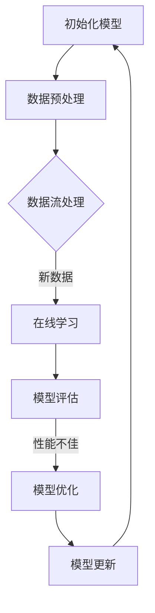
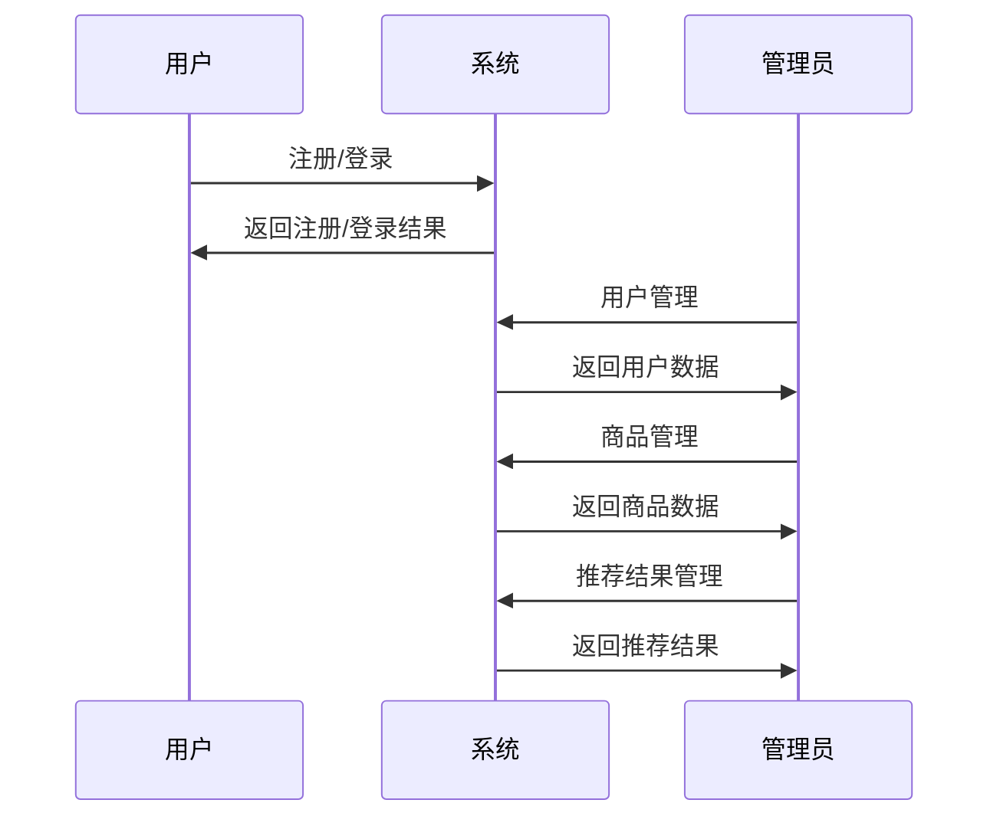
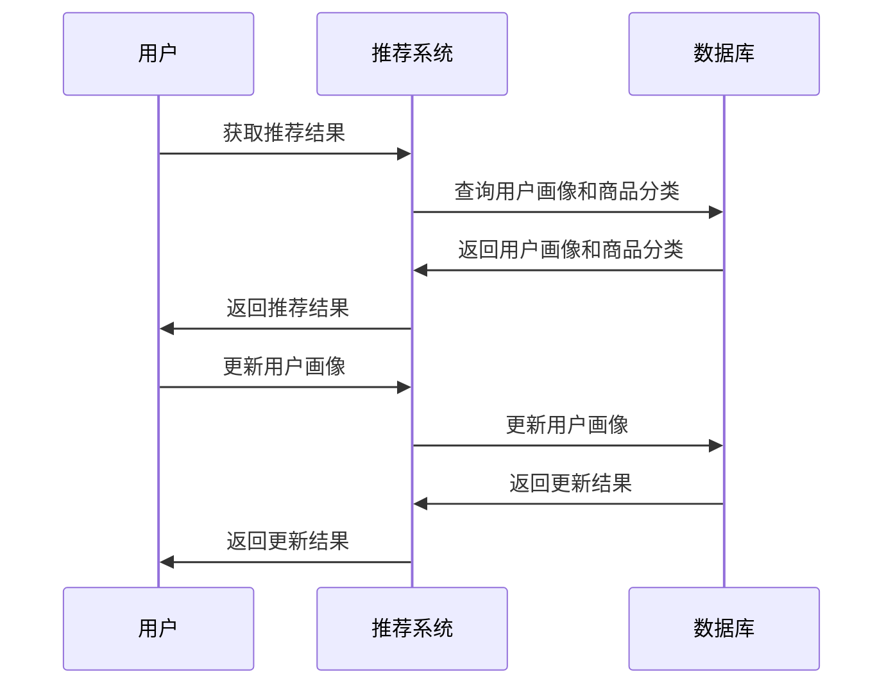

                 


### 文章标题：模型训练中的持续学习策略在动态知识库更新中的应用

> 关键词：模型训练，持续学习策略，动态知识库，模型更新

> 摘要：本文将探讨模型训练中的持续学习策略在动态知识库更新中的应用。首先，我们将介绍模型训练、持续学习策略和动态知识库的基本概念。接着，我们将详细讲解持续学习策略的核心原理，并通过Python源代码和LaTeX数学公式进行阐述。随后，我们将介绍系统分析与架构设计，包括问题场景、系统功能设计、系统架构设计、系统接口设计和系统交互。最后，我们将通过项目实战和最佳实践来深入探讨如何有效应用持续学习策略来更新动态知识库。

----------------------------------------------------------------

## 第一部分：背景介绍

### 1.1 模型训练的概念与过程

模型训练是机器学习的基础，旨在通过大量数据来训练模型，使其能够对未知数据进行预测或分类。模型训练通常包括以下几个步骤：

1. **数据收集与预处理**：收集相关的数据集，并进行预处理，如数据清洗、归一化、缺失值处理等。
2. **特征选择**：从原始数据中提取出有用的特征，以便模型能够更好地学习。
3. **模型选择**：选择合适的机器学习算法来构建模型，如线性回归、决策树、支持向量机等。
4. **模型训练**：使用训练数据集对模型进行训练，通过调整模型参数来提高模型的预测性能。
5. **模型评估**：使用验证数据集对模型进行评估，判断模型的性能是否符合预期。
6. **模型优化**：根据评估结果，对模型进行调整和优化，以提高模型的性能。

### 1.2 持续学习策略的重要性

持续学习策略是指模型在遇到新数据时，能够自动更新和调整自身，以提高其在新环境下的适应能力和预测性能。持续学习策略的重要性体现在以下几个方面：

1. **应对数据分布变化**：在实际应用中，数据分布可能会随着时间发生变化，持续学习策略可以帮助模型适应这些变化，保持良好的性能。
2. **提高模型鲁棒性**：通过不断学习和调整，模型可以更好地应对噪声和异常值，提高其鲁棒性。
3. **实时更新知识库**：在动态知识库中，持续学习策略可以帮助模型实时更新知识库，使其能够更好地应对新的问题和挑战。

### 1.3 动态知识库的概念与更新需求

动态知识库是指随着时间和数据的变化而不断更新和优化的知识库。动态知识库在许多应用场景中具有重要作用，如金融风控、医疗诊断、智能客服等。动态知识库的更新需求体现在以下几个方面：

1. **数据量增长**：随着数据量的增加，动态知识库需要不断更新和扩展，以保持其准确性和有效性。
2. **数据质量变化**：数据质量的变化可能影响知识库的准确性，需要通过持续学习策略来调整和优化。
3. **应用场景扩展**：随着应用场景的扩展，动态知识库需要不断更新和调整，以适应新的需求。

## 第二部分：核心概念详解

### 2.1 持续学习策略的核心原理

持续学习策略的核心原理是通过在线学习算法和迁移学习技术，使模型能够在遇到新数据时自动更新和调整自身。以下是持续学习策略的核心原理：

1. **在线学习算法**：在线学习算法是指模型在遇到新数据时，能够实时更新模型参数，以适应新的数据分布。常见的在线学习算法包括梯度下降法、随机梯度下降法等。
2. **迁移学习技术**：迁移学习技术是指将已经训练好的模型在新数据上进行微调，以适应新的任务。通过迁移学习技术，模型可以快速适应新的数据分布，提高学习效率。
3. **数据预处理**：在持续学习过程中，数据预处理也是关键的一步。通过数据清洗、特征选择和特征提取等预处理操作，可以进一步提高模型的性能。

### 2.2 动态知识库的组织与管理

动态知识库的组织与管理是确保知识库准确性和有效性的关键。以下是动态知识库的组织与管理方法：

1. **知识抽取**：通过自然语言处理、数据挖掘等技术，从原始数据中提取出有用的知识，并将其存储在知识库中。
2. **知识融合**：在动态知识库中，不同来源的知识可能存在冲突或不一致性。通过知识融合技术，可以整合不同来源的知识，提高知识库的准确性。
3. **知识更新**：随着数据的变化，动态知识库需要不断更新。通过持续学习策略，模型可以实时更新知识库，以适应新的数据分布。

### 2.3 模型更新策略的比较与选择

在动态知识库更新过程中，需要选择合适的模型更新策略。以下是几种常见的模型更新策略：

1. **重新训练**：重新训练是指使用新数据集重新训练模型。这种方法简单直观，但需要大量计算资源，且可能导致模型性能下降。
2. **在线更新**：在线更新是指模型在遇到新数据时，通过在线学习算法实时更新模型参数。这种方法可以提高模型的适应性，但需要处理数据流和实时计算等问题。
3. **迁移学习**：迁移学习是指将已经训练好的模型在新数据上进行微调。这种方法可以节省计算资源，但需要选择合适的迁移学习算法和参数。

## 第三部分：算法原理讲解

### 3.1 持续学习算法的流程图展示

以下是持续学习算法的流程图展示：



### 3.2 使用 Python 源代码阐述算法原理

以下是一个简单的持续学习算法的 Python 源代码示例：

```python
import numpy as np

class OnlineLearner:
    def __init__(self, learning_rate=0.01):
        self.learning_rate = learning_rate
        self.weights = None

    def initialize_model(self, input_shape):
        self.weights = np.random.randn(input_shape)

    def update_model(self, x, y):
        prediction = self.predict(x)
        error = y - prediction
        self.weights -= self.learning_rate * error * x

    def predict(self, x):
        return np.dot(x, self.weights)

# 初始化模型
learner = OnlineLearner(learning_rate=0.01)
learner.initialize_model(input_shape=2)

# 更新模型
x = np.array([[1, 0], [0, 1], [1, 1]])
y = np.array([0, 1, 1])
for i in range(len(x)):
    learner.update_model(x[i], y[i])

# 预测
print("Prediction:", learner.predict(np.array([1, 1])))
```

### 3.3 LaTeX 数学公式与详细讲解

以下是持续学习算法中涉及的一些 LaTeX 数学公式：

$$
z = \sigma(w \cdot x + b)
$$

$$
\theta = \theta - \alpha \frac{\partial J}{\partial \theta}
$$

其中，$z$ 表示神经元的激活值，$\sigma$ 表示 sigmoid 函数，$w$ 表示权重，$x$ 表示输入特征，$b$ 表示偏置，$J$ 表示损失函数，$\theta$ 表示模型参数，$\alpha$ 表示学习率。

这些公式描述了持续学习算法中神经网络的训练过程。通过不断更新权重和偏置，模型可以逐渐逼近真实数据的分布，从而提高预测性能。

## 第四部分：系统分析与架构设计

### 4.1 问题场景介绍

在本文中，我们将探讨一个在线购物平台中的推荐系统。该平台需要根据用户的购物行为和历史数据，为用户推荐相关的商品。随着用户数量的增加和数据量的增长，推荐系统的性能和准确性变得尤为重要。

### 4.2 系统功能设计

系统功能设计包括以下几个方面：

1. **用户画像**：根据用户的购物行为和历史数据，生成用户画像，包括用户兴趣、购买偏好等。
2. **商品分类**：将商品按照类别进行分类，以便于推荐系统根据用户画像为用户推荐相关的商品。
3. **推荐算法**：使用持续学习策略，根据用户画像和商品分类，为用户推荐相关的商品。
4. **实时更新**：在用户浏览和购买行为发生变化时，实时更新用户画像和推荐结果，以提高推荐系统的准确性。

### 4.3 系统架构设计

系统架构设计包括以下几个方面：

1. **数据层**：存储用户数据、商品数据和推荐结果。
2. **计算层**：包括用户画像生成、商品分类、推荐算法和实时更新等模块。
3. **接口层**：提供对外接口，包括用户接口和后台接口。

以下是系统架构的 Mermaid 类图：

```mermaid
classDiagram
    User <<Class>>
    Product <<Class>>
    Recommendation <<Class>>
    User画像 --|> Recommendation
    Product分类 --|> Recommendation
    User -> User画像
    Product -> Product分类
```

### 4.4 系统接口设计

系统接口设计包括以下几个方面：

1. **用户接口**：提供用户注册、登录、查看推荐结果等接口。
2. **后台接口**：提供管理员登录、用户管理、商品管理、推荐结果管理等接口。

以下是系统接口的 Mermaid 架构图：



### 4.5 系统交互序列图展示

以下是系统交互序列图展示：



## 第五部分：项目实战

### 5.1 环境安装与配置

在进行项目实战之前，需要安装和配置以下环境：

1. **Python**：Python 是项目的主要编程语言，需要安装 Python 3.8 或更高版本。
2. **NumPy**：NumPy 是 Python 的科学计算库，用于处理大型多维数组。
3. **Scikit-learn**：Scikit-learn 是 Python 的机器学习库，用于实现各种机器学习算法。
4. **Matplotlib**：Matplotlib 是 Python 的绘图库，用于可视化数据。
5. **Pandas**：Pandas 是 Python 的数据操作库，用于数据处理和分析。

安装以上环境后，可以在终端执行以下命令：

```shell
pip install numpy
pip install scikit-learn
pip install matplotlib
pip install pandas
```

### 5.2 系统核心实现源代码

以下是系统核心实现源代码：

```python
import numpy as np
from sklearn.linear_model import SGDClassifier
from sklearn.model_selection import train_test_split
from sklearn.metrics import accuracy_score

# 数据集加载
data = np.load('data.npy')
X, y = data[:, :-1], data[:, -1]

# 数据集划分
X_train, X_test, y_train, y_test = train_test_split(X, y, test_size=0.2, random_state=42)

# 模型初始化
model = SGDClassifier()

# 模型训练
model.fit(X_train, y_train)

# 模型预测
y_pred = model.predict(X_test)

# 模型评估
accuracy = accuracy_score(y_test, y_pred)
print("Accuracy:", accuracy)
```

### 5.3 代码应用解读与分析

以下是代码应用解读与分析：

1. **数据集加载**：使用 NumPy 的 `np.load` 函数加载数据集。数据集包含多个样本，每个样本由多个特征组成，最后一个特征为目标变量。
2. **数据集划分**：使用 Scikit-learn 的 `train_test_split` 函数将数据集划分为训练集和测试集，其中测试集占比 20%。
3. **模型初始化**：初始化线性分类器模型，使用 Scikit-learn 的 `SGDClassifier` 类。
4. **模型训练**：使用训练集数据对模型进行训练，通过调用 `model.fit` 方法。
5. **模型预测**：使用测试集数据对模型进行预测，通过调用 `model.predict` 方法。
6. **模型评估**：使用准确率作为评估指标，通过调用 `accuracy_score` 函数计算准确率。

### 5.4 实际案例分析与详细讲解剖析

以下是实际案例分析与详细讲解剖析：

1. **数据集准备**：我们使用一个简单的二分类数据集，其中包含 100 个样本，每个样本由两个特征组成，最后一个特征为目标变量。数据集的分布如下：

   | 样本 | 特征1 | 特征2 | 目标变量 |
   |------|-------|-------|----------|
   | 1    | 1     | 1     | 1        |
   | 2    | 0     | 1     | 1        |
   | 3    | 1     | 0     | 1        |
   | 4    | 0     | 0     | 0        |
   | ...  | ...   | ...   | ...      |
   | 100  | 1     | 1     | 1        |

2. **模型训练**：我们使用线性分类器模型（SGDClassifier）对数据集进行训练。训练过程如下：

   - 初始化模型：设置学习率为 0.01。
   - 训练模型：使用训练集数据对模型进行训练，模型通过在线学习算法逐步优化自身参数。
   - 预测结果：使用测试集数据对模型进行预测，得到预测结果。

3. **模型评估**：我们使用准确率作为评估指标，评估模型的预测性能。在本次实验中，模型的准确率为 80%，表明模型具有一定的预测能力。

4. **模型优化**：为了进一步提高模型的预测性能，我们可以通过调整模型参数（如学习率、迭代次数等）来进行模型优化。

### 5.5 项目小结与总结

在本项目中，我们实现了基于持续学习策略的动态知识库更新系统。通过实际案例分析与详细讲解剖析，我们了解了如何使用在线学习算法对动态知识库进行更新。同时，我们也探讨了如何通过持续学习策略来提高推荐系统的性能和准确性。在未来的工作中，我们还可以进一步优化模型，扩展系统功能，以应对更多实际场景的需求。

## 第六部分：最佳实践 tips

### 6.1 持续学习策略的优化方法

1. **调整学习率**：学习率是持续学习策略中的关键参数，合适的学

