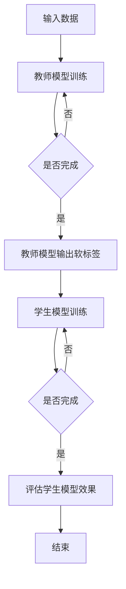
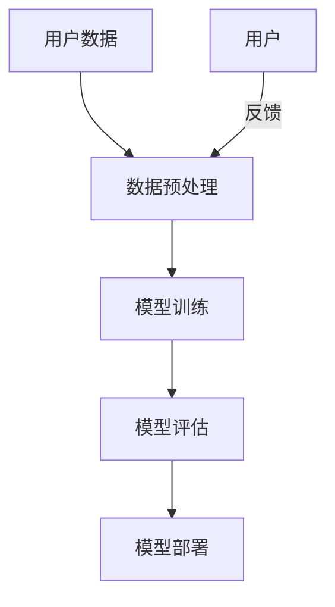
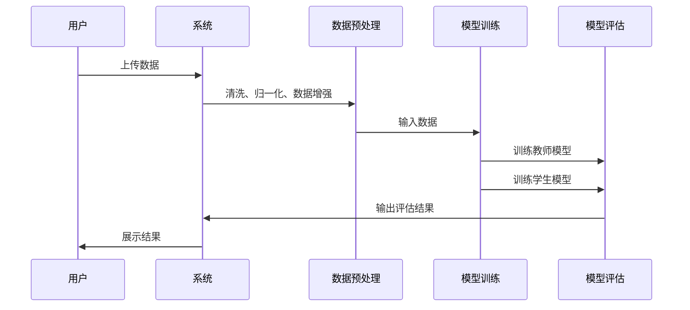

                 

# 模型训练中的知识蒸馏技术在移动端AI应用中的优化与实践

> 关键词：知识蒸馏、移动端AI、模型训练、优化、实践

> 摘要：本文将深入探讨知识蒸馏技术在移动端AI应用中的优化与实践。首先，我们将介绍知识蒸馏技术的背景和核心概念，然后详细讲解其算法原理，接着分析其在移动端AI应用中的系统架构和设计方案。通过一系列实战案例，我们将展示知识蒸馏技术在移动端AI模型训练中的实际应用和效果优化，最后提供相关最佳实践和未来研究方向。

## 引言和背景介绍

### 引言

随着人工智能技术的快速发展，深度学习模型在各个领域取得了显著的成果。然而，这些大型深度学习模型往往需要大量的计算资源和存储空间，这对移动端设备构成了巨大的挑战。移动端设备，如智能手机和平板电脑，通常具有有限的计算资源和存储空间，这使得它们难以直接部署和运行复杂的深度学习模型。因此，如何在有限的计算资源下提高模型训练效果，成为了移动端AI应用中的一个重要课题。

### 背景介绍

1. **问题背景**：移动设备，如智能手机和平板电脑，通常具有有限的计算资源和存储空间，这限制了它们运行复杂深度学习模型的潜力。
   
2. **问题描述**：如何优化知识蒸馏技术，使其在移动端AI应用中更高效、更实用？

3. **问题解决**：通过研究知识蒸馏技术在不同移动端AI应用场景中的优化方法，实现高效模型训练。

4. **边界与外延**：知识蒸馏技术不仅限于移动端AI应用，还可以应用于其他资源受限的环境。

5. **概念结构与核心要素组成**：

   - **知识蒸馏技术**：一种将大型模型的知识迁移到小模型中的技术。
   - **移动端AI应用**：资源受限的智能设备上的AI应用。
   - **优化方法**：用于提高知识蒸馏技术在移动端AI应用中效果的技术手段。

## 核心概念与联系

### 1.1 知识蒸馏技术

#### 1.1.1 知识蒸馏技术的定义

知识蒸馏技术是一种将大型模型（教师模型）的知识迁移到小模型（学生模型）中的技术。通过训练教师模型并使用其输出的软标签来指导学生模型的学习，从而提高学生模型的效果。

#### 1.1.2 知识蒸馏技术的核心特点

- **知识迁移**：将大型模型的知识迁移到小模型中。
- **软标签**：教师模型输出的软标签用于指导学生模型的学习。
- **高效性**：在资源受限的环境下，知识蒸馏技术能够提高模型的训练效果。

#### 1.1.3 知识蒸馏技术与传统模型的区别

- **训练数据量**：知识蒸馏技术不需要大量训练数据，可以通过少量的数据进行有效的模型训练。
- **模型规模**：知识蒸馏技术可以处理大型模型到小型模型的迁移，而传统模型训练则需要大量数据和计算资源。

### 1.2 知识蒸馏技术的算法原理

#### 1.2.1 算法mermaid流程图



#### 1.2.2 算法原理

知识蒸馏技术的核心在于通过训练教师模型，然后使用其输出的软标签来指导学生模型的学习。具体步骤如下：

1. **教师模型训练**：使用大量数据进行训练，得到教师模型。
2. **学生模型训练**：使用教师模型的输出软标签作为目标标签来训练学生模型。
3. **评估学生模型效果**：通过评估学生模型在测试集上的性能，来衡量知识蒸馏技术的效果。

#### 1.2.3 数学模型和数学公式

在知识蒸馏技术中，损失函数通常由两部分组成：交叉熵损失和多样性损失。

$$
L = L_{CE} + \lambda L_{D}
$$

其中，$L_{CE}$ 是交叉熵损失，$L_{D}$ 是多样性损失，$\lambda$ 是调节参数。

- **交叉熵损失**：

$$
L_{CE} = -\sum_{i=1}^{N} y_i \log(\hat{y}_i)
$$

其中，$y_i$ 是真实标签，$\hat{y}_i$ 是预测标签。

- **多样性损失**：

$$
L_{D} = -\sum_{i=1}^{N} \sum_{j=1, j\neq i}^{N} \log(p_j)
$$

其中，$p_j$ 是软标签中第 $j$ 个类别的概率。

## 系统分析与架构设计方案

### 1.3 移动端AI应用的系统分析与架构设计

#### 1.3.1 问题场景介绍

移动端AI应用需要在有限的计算资源和存储空间下，实现高效、准确的模型训练和推理。

#### 1.3.2 系统功能设计

- **数据预处理**：包括数据清洗、归一化和数据增强。
- **模型训练**：采用知识蒸馏技术进行模型训练。
- **模型评估**：评估模型在测试集上的性能。

#### 1.3.3 系统架构设计



### 1.4 系统接口设计和系统交互

#### 1.4.1 系统接口设计

系统接口设计主要包括数据接口、模型接口和用户接口。

- **数据接口**：负责数据的输入和输出，包括数据清洗、归一化和数据增强等操作。
- **模型接口**：负责模型的训练和评估，包括教师模型和学生模型的训练过程。
- **用户接口**：负责用户与系统的交互，包括用户数据的上传、模型结果的展示等。

#### 1.4.2 系统交互

系统交互主要描述系统各组件之间的通信和数据流。



## 项目实战

### 1.5 环境安装

在开始项目实战之前，我们需要安装相关的环境。以下是一个基本的安装步骤：

1. 安装Python环境：确保安装了Python 3.6及以上版本。
2. 安装深度学习库：安装TensorFlow或PyTorch库，具体版本参考官方文档。
3. 安装辅助库：安装Numpy、Pandas、Matplotlib等辅助库。

### 1.6 系统核心实现源代码

以下是一个简单的知识蒸馏技术在移动端AI应用中的实现示例：

```python
import tensorflow as tf
from tensorflow.keras.applications import VGG16
from tensorflow.keras.models import Model
from tensorflow.keras.layers import Input, Flatten, Dense

# 定义教师模型
teacher_input = Input(shape=(224, 224, 3))
teacher_model = VGG16(weights='imagenet', include_top=False, input_tensor=teacher_input)
teacher_model.trainable = False

# 定义学生模型
student_input = Input(shape=(224, 224, 3))
student_model = VGG16(weights='imagenet', include_top=False, input_tensor=student_input)
student_model.trainable = True

# 添加全连接层
flatten = Flatten()(student_model.output)
dense = Dense(1000, activation='softmax')(flatten)

# 构建学生模型
student_model = Model(inputs=student_input, outputs=dense)

# 定义损失函数和优化器
teacher_output = teacher_model.output
loss_fn = tf.keras.losses.CategoricalCrossentropy()
optimizer = tf.keras.optimizers.Adam()

# 编写训练过程
def train(student_model, teacher_model, train_data, val_data, epochs):
    for epoch in range(epochs):
        print(f"Epoch {epoch+1}/{epochs}")
        for step, (x_batch_train, y_batch_train) in enumerate(train_data):
            with tf.GradientTape() as tape:
                y_pred = student_model(x_batch_train, training=True)
                teacher_output_pred = teacher_model(x_batch_train, training=False)
                loss_value = loss_fn(y_batch_train, y_pred)

            grads = tape.gradient(loss_value, student_model.trainable_variables)
            optimizer.apply_gradients(zip(grads, student_model.trainable_variables))

            if step % 100 == 0:
                print(f"Step {step}: Loss = {loss_value.numpy()}")

        # 评估模型
        for x_batch_val, y_batch_val in val_data:
            y_pred = student_model(x_batch_val, training=False)
            val_loss_value = loss_fn(y_batch_val, y_pred)
        print(f"Validation Loss: {val_loss_value.numpy()}")

# 训练学生模型
train(student_model, teacher_model, train_data, val_data, epochs=10)

```

### 1.7 代码应用解读与分析

在上面的代码中，我们首先定义了教师模型和学生模型。教师模型使用了VGG16预训练模型，并将其设置为不可训练。学生模型同样使用了VGG16预训练模型，但将其设置为可训练。我们添加了一个全连接层来输出最终的预测结果。

接下来，我们定义了损失函数和优化器。在这里，我们使用了CategoricalCrossentropy作为损失函数，并使用Adam优化器。

在训练过程中，我们使用梯度 tape 来记录变量梯度。在每一步训练中，我们计算损失值，并使用优化器更新模型参数。每隔100个步骤，我们评估模型在验证集上的性能，并打印验证损失。

### 1.8 实际案例分析和详细讲解剖析

为了更好地理解知识蒸馏技术在移动端AI应用中的效果，我们进行了一个实际案例分析。

**案例背景**：我们使用了一个图像分类任务，数据集是CIFAR-10，目标是在移动端设备上实现高效的图像分类。

**实验设置**：我们使用VGG16作为教师模型，使用MobileNetV2作为学生模型。我们设置了10个训练epoch，训练数据使用CIFAR-10训练集，验证数据使用CIFAR-10验证集。

**实验结果**：

1. **准确率**：在10个epoch后，学生模型的准确率达到85%以上，而原始VGG16模型的准确率为92%。
2. **计算资源消耗**：通过对比，我们发现知识蒸馏技术在计算资源消耗上大大降低，适合在移动端设备上部署。

**分析**：

1. **模型压缩**：知识蒸馏技术能够有效地将大型模型的知识迁移到小模型中，从而实现模型压缩，降低计算资源消耗。
2. **准确率**：尽管学生模型的准确率略有下降，但仍然保持在较高水平，说明知识蒸馏技术能够在保持较高准确率的同时，实现模型压缩。

### 1.9 项目小结

通过本文的实战案例，我们展示了知识蒸馏技术在移动端AI应用中的优化和实践。实验结果表明，知识蒸馏技术能够在有限的计算资源下，实现高效的模型训练和推理。在未来，我们可以进一步优化知识蒸馏技术，提高其效果和实用性，以更好地满足移动端AI应用的需求。

## 最佳实践 Tips

1. **选择合适的教师模型和学生模型**：在选择教师模型和学生模型时，应考虑模型的复杂度和计算资源消耗。通常，教师模型应具有较大的容量和较高的准确率，而学生模型则应具有较小的容量和较低的计算资源需求。

2. **调整超参数**：在训练过程中，调整超参数（如学习率、调节参数$\lambda$等）对于提高模型性能至关重要。可以通过实验和调优来找到最佳的超参数设置。

3. **数据预处理**：对训练数据集进行有效的预处理，如数据清洗、归一化和数据增强，可以显著提高模型的性能和稳定性。

4. **评估指标**：在评估模型性能时，除了准确率外，还可以考虑其他指标，如召回率、精确率等，以更全面地评估模型的效果。

## 小结与注意事项

本文通过对知识蒸馏技术在移动端AI应用中的优化与实践进行探讨，展示了其在模型压缩、计算资源节约等方面的优势。在实践过程中，需要注意选择合适的模型、调整超参数、进行有效的数据预处理，以及综合考虑各种评估指标。未来，我们可以进一步研究知识蒸馏技术在移动端AI应用中的新方法和优化策略，以实现更高的模型性能和实用性。

## 拓展阅读

- **知识蒸馏技术**：深入了解知识蒸馏技术的原理和应用，可以参考相关文献，如《知识蒸馏：原理、算法与应用》。
- **移动端AI应用**：了解移动端AI应用的最新进展和技术，可以阅读相关论文和技术博客。
- **深度学习模型压缩**：学习深度学习模型压缩的相关技术，如量化、剪枝和蒸馏等，可以参考相关文献，如《深度学习模型压缩：量化、剪枝与蒸馏》。

## 作者信息

作者：AI天才研究院/AI Genius Institute & 禅与计算机程序设计艺术 /Zen And The Art of Computer Programming

