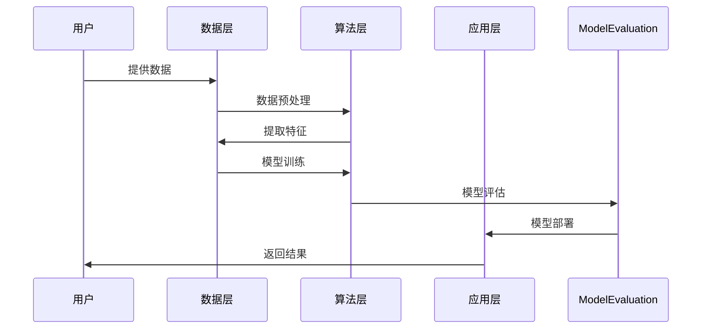
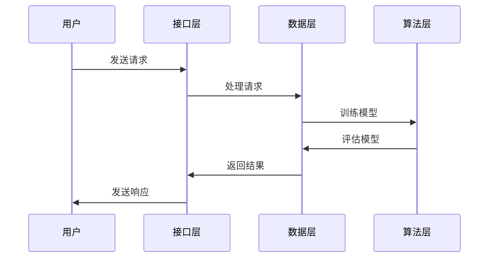
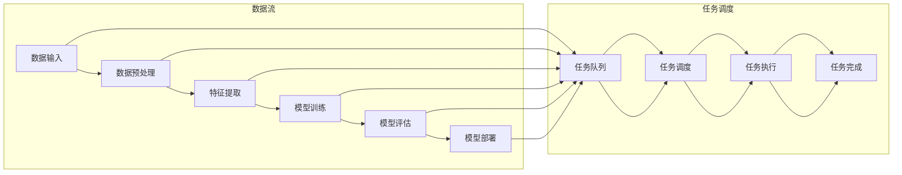

                 


# 模型训练中的自监督学习技术创新与突破

## 关键词

- 自监督学习
- 模型训练
- 技术创新
- 算法突破
- 应用场景

## 摘要

本文将深入探讨自监督学习在模型训练中的技术创新与突破。自监督学习作为近年来人工智能领域的重要研究方向，无需依赖大量标注数据，通过无监督的方式提取特征，已经在图像识别、自然语言处理等多个领域取得了显著的成果。本文将首先介绍自监督学习的背景与重要性，随后分析其核心概念与类型，探讨面临的挑战，与传统监督学习的比较，并逐步深入自监督学习的算法原理、数学模型、系统架构设计以及实际应用中的案例解析。最后，我们将展望自监督学习的未来发展趋势，提出最佳实践建议。

## 目录大纲

1. **背景与重要性**
   - **1.1 自监督学习的背景与重要性**
   - **1.2 自监督学习的基本概念**
   - **1.3 自监督学习的挑战**
   - **1.4 自监督学习与传统监督学习的比较**

2. **算法原理**
   - **2.1 自监督学习算法概述**
   - **2.2 图像领域的自监督学习算法**
   - **2.3 自然语言处理的自监督学习算法**
   - **2.4 自监督学习的数学模型**

3. **系统架构设计**
   - **3.1 自监督学习系统功能设计**
   - **3.2 自监督学习系统架构设计**
   - **3.3 自监督学习系统接口设计**
   - **3.4 自监督学习系统交互设计**

4. **实际应用与案例分析**
   - **4.1 图像识别应用**
   - **4.2 自然语言处理应用**
   - **4.3 其他领域应用**
   - **4.4 案例分析**

5. **未来发展趋势**
   - **5.1 技术创新方向**
   - **5.2 应用前景**
   - **5.3 挑战与机遇**

6. **最佳实践与总结**
   - **6.1 最佳实践建议**
   - **6.2 小结与注意事项**
   - **6.3 拓展阅读**

## 第一部分 自监督学习基础

### 1.1 自监督学习的背景与重要性

自监督学习（Self-supervised Learning）是人工智能领域的一个重要研究方向，近年来受到了广泛的关注。其核心思想是在没有人工标注的数据集上进行学习，通过将输入和输出联系起来，从而自动提取有用的特征和知识。与传统的监督学习（Supervised Learning）相比，自监督学习无需依赖大量标注数据，因此在数据稀缺或获取困难的场景下具有明显的优势。

#### 问题背景

在传统的监督学习中，模型训练需要依赖大量的标注数据，这些数据通常需要由人类标注者进行精确的标注，不仅成本高昂，而且存在标注偏差。随着数据规模的扩大和多样性需求的增加，标注数据的获取变得更加困难。自监督学习的出现，为解决这一问题提供了一种新的思路。通过自监督学习，模型可以在没有标注数据的情况下，自动发现数据中的规律和模式，从而实现特征提取和知识表示。

#### 问题解决

自监督学习通过以下方式解决了传统监督学习的数据依赖问题：

1. **数据增强**：自监督学习算法通过对原始数据进行变换，生成新的数据样本，从而增加训练数据量，提高模型的泛化能力。
2. **无监督预训练**：在自监督学习中，模型首先通过无监督预训练，自动学习数据中的潜在特征，然后将这些特征作为特征输入到有监督的微调训练中，从而减少对标注数据的依赖。
3. **多任务学习**：自监督学习可以通过设计多任务学习框架，将不同任务的信息融合在一起，从而提高模型的表达能力。

#### 边界与外延

自监督学习虽然无需依赖标注数据，但它并非万能。在某些特定的任务中，例如需要高精度标注的医学图像识别，自监督学习的效果可能不如传统的监督学习。因此，自监督学习通常被视为一种辅助手段，与传统监督学习相结合，以发挥其优势。

#### 概念结构与核心要素组成

自监督学习由以下几个核心要素组成：

1. **数据输入**：自监督学习算法的输入是原始数据，可以是图像、文本、声音等多种形式。
2. **特征提取器**：特征提取器是自监督学习的核心组件，它负责从原始数据中提取出有用的特征。
3. **损失函数**：损失函数用于衡量模型预测输出与真实输出之间的差距，是模型训练过程中进行调整的重要依据。
4. **优化算法**：优化算法用于根据损失函数的反馈，不断调整模型参数，使其逐渐收敛到最优解。

### 1.2 自监督学习的基本概念

#### 自监督学习的定义

自监督学习是一种无监督学习方法，它通过将输入和输出联系起来，自动发现数据中的规律和模式，从而实现特征提取和知识表示。自监督学习不需要依赖大量标注数据，可以在没有人工干预的情况下，通过算法自身来指导学习过程。

#### 自监督学习的类型

自监督学习可以按照不同的分类标准进行分类，以下是几种常见的分类方式：

1. **根据任务类型**：可以分为图像自监督学习、自然语言处理自监督学习、语音识别自监督学习等。
2. **根据学习策略**：可以分为生成对抗网络（GAN）自监督学习、图自监督学习、多任务自监督学习等。
3. **根据数据源**：可以分为基于大规模未标注数据的自监督学习、基于小样本数据的自监督学习等。

#### 自监督学习的应用领域

自监督学习在多个领域都取得了显著的成果，以下是几个典型的应用领域：

1. **计算机视觉**：在图像分类、目标检测、图像分割等任务中，自监督学习可以显著提高模型的性能，减少对标注数据的依赖。
2. **自然语言处理**：在文本分类、机器翻译、情感分析等任务中，自监督学习可以自动提取语言特征，提高模型的泛化能力。
3. **语音识别**：在语音识别任务中，自监督学习可以用于声学模型的训练，提高模型的准确率和鲁棒性。
4. **推荐系统**：在推荐系统中，自监督学习可以用于自动发现用户兴趣和商品特征，提高推荐效果。

### 1.3 自监督学习的挑战

尽管自监督学习具有许多优势，但在实际应用中也面临着一些挑战：

1. **数据收集与标注的挑战**：自监督学习虽然不需要依赖大量标注数据，但仍然需要对数据质量有较高的要求。在数据收集和标注过程中，可能存在数据不平衡、噪声等问题，影响模型的性能。
2. **算法复杂度与计算资源的挑战**：自监督学习算法通常涉及复杂的模型结构和大量的计算资源，特别是在大规模数据集上训练时，对计算资源的需求较大。
3. **模型泛化能力的挑战**：自监督学习模型在无监督环境下训练，容易陷入局部最优，导致模型泛化能力不足。

### 1.4 自监督学习与传统监督学习的比较

自监督学习与传统监督学习在多个方面存在差异：

1. **数据需求**：传统监督学习需要大量标注数据，而自监督学习则可以通过无监督方式提取特征，对标注数据的依赖较小。
2. **模型性能**：在某些任务中，自监督学习可以取得与传统监督学习相当的模型性能，但在某些高精度要求的任务中，仍需依赖传统监督学习。
3. **训练效率**：自监督学习可以在无监督环境下快速训练，而传统监督学习需要经过长时间的标注和训练。
4. **应用范围**：自监督学习适用于数据稀缺或标注困难的场景，而传统监督学习则适用于数据丰富、标注精确的场景。

通过以上分析，我们可以看到，自监督学习在模型训练中具有显著的技术创新和突破，为人工智能领域带来了新的发展机遇。在接下来的章节中，我们将深入探讨自监督学习的算法原理、系统架构设计以及实际应用案例。

### 第二部分 自监督学习算法原理

#### 2.1 自监督学习算法概述

自监督学习算法是人工智能领域中一种重要的技术，其核心思想是在没有标注数据的条件下，通过设计特定的任务和目标，使模型能够自动学习和提取数据中的有用信息。这种无监督的学习方式，使得自监督学习在处理大规模数据集、应对数据稀缺和标注困难等问题上，展现出独特的优势。

#### 自监督学习算法的发展历程

自监督学习算法的发展历程可以追溯到上世纪60年代，当时一些学者提出了“无监督学习”的概念。随着计算机硬件和算法技术的发展，自监督学习逐渐成为人工智能研究的热点。尤其是在深度学习技术兴起后，自监督学习算法得到了迅速发展。近年来，生成对抗网络（GAN）、图自监督学习等新型算法的提出，进一步丰富了自监督学习的研究内容。

#### 自监督学习算法的分类

自监督学习算法可以根据不同的分类标准进行分类，以下是几种常见的分类方式：

1. **根据任务类型**：可以分为图像自监督学习、自然语言处理自监督学习、语音识别自监督学习等。
2. **根据学习策略**：可以分为基于生成对抗网络的算法、基于图结构的算法、多任务学习算法等。
3. **根据数据源**：可以分为基于大规模未标注数据的自监督学习、基于小样本数据的自监督学习等。

#### 自监督学习算法的应用领域

自监督学习算法在多个领域都取得了显著的成果，以下是几个典型的应用领域：

1. **计算机视觉**：在图像分类、目标检测、图像分割等任务中，自监督学习算法可以显著提高模型的性能，减少对标注数据的依赖。
2. **自然语言处理**：在文本分类、机器翻译、情感分析等任务中，自监督学习算法可以自动提取语言特征，提高模型的泛化能力。
3. **语音识别**：在语音识别任务中，自监督学习算法可以用于声学模型的训练，提高模型的准确率和鲁棒性。
4. **推荐系统**：在推荐系统中，自监督学习算法可以用于自动发现用户兴趣和商品特征，提高推荐效果。

#### 自监督学习算法的核心概念

自监督学习算法的核心概念包括：

1. **数据增强**：数据增强是通过各种方式生成新的数据样本，从而增加训练数据量，提高模型的泛化能力。
2. **特征提取器**：特征提取器是自监督学习算法的核心组件，它负责从原始数据中提取出有用的特征。
3. **损失函数**：损失函数用于衡量模型预测输出与真实输出之间的差距，是模型训练过程中进行调整的重要依据。
4. **优化算法**：优化算法用于根据损失函数的反馈，不断调整模型参数，使其逐渐收敛到最优解。

#### 自监督学习算法的基本原理

自监督学习算法的基本原理可以概括为以下几个步骤：

1. **数据输入**：自监督学习算法的输入是原始数据，可以是图像、文本、声音等多种形式。
2. **特征提取**：特征提取器从原始数据中提取出有用的特征。
3. **目标定义**：根据特定任务，定义一个目标函数，用于衡量模型的预测输出与真实输出之间的差距。
4. **模型训练**：通过优化算法，不断调整模型参数，使模型逐渐收敛到最优解。
5. **模型评估**：在测试集上评估模型的性能，根据评估结果进行模型的调优。

#### 自监督学习算法的优势

自监督学习算法具有以下优势：

1. **减少对标注数据的依赖**：自监督学习算法可以在没有标注数据的条件下进行训练，从而减少对标注数据的依赖，降低数据获取成本。
2. **提高模型泛化能力**：通过无监督学习，模型可以自动发现数据中的潜在规律和模式，从而提高模型的泛化能力。
3. **适用于大规模数据集**：自监督学习算法可以处理大规模数据集，提高训练效率。
4. **减少训练时间**：自监督学习算法可以在无监督环境下快速训练，从而减少训练时间。

#### 自监督学习算法的局限性和挑战

尽管自监督学习算法具有许多优势，但在实际应用中也面临着一些挑战：

1. **数据质量要求高**：自监督学习算法对数据质量有较高的要求，如果数据存在噪声、不平衡等问题，可能会影响模型的性能。
2. **计算资源需求大**：自监督学习算法通常涉及复杂的模型结构和大量的计算资源，特别是在大规模数据集上训练时，对计算资源的需求较大。
3. **模型泛化能力有限**：自监督学习模型在无监督环境下训练，容易陷入局部最优，导致模型泛化能力不足。

#### 自监督学习算法与传统监督学习的比较

自监督学习算法与传统监督学习在多个方面存在差异：

1. **数据需求**：传统监督学习需要大量标注数据，而自监督学习则可以通过无监督方式提取特征，对标注数据的依赖较小。
2. **模型性能**：在某些任务中，自监督学习可以取得与传统监督学习相当的模型性能，但在某些高精度要求的任务中，仍需依赖传统监督学习。
3. **训练效率**：自监督学习算法可以在无监督环境下快速训练，而传统监督学习需要经过长时间的标注和训练。
4. **应用范围**：自监督学习适用于数据稀缺或标注困难的场景，而传统监督学习则适用于数据丰富、标注精确的场景。

通过以上分析，我们可以看到，自监督学习算法在模型训练中具有显著的技术创新和突破，为人工智能领域带来了新的发展机遇。在接下来的章节中，我们将进一步探讨图像领域和自然语言处理领域中的自监督学习算法，以及它们的数学模型和系统架构设计。

### 2.2 图像领域的自监督学习算法

图像领域的自监督学习算法是计算机视觉领域的重要研究方向，通过无监督的方式提取图像中的有用信息，为图像识别、目标检测、图像分割等任务提供了有效的解决方案。以下是几种常见的图像领域自监督学习算法：

#### 数据增强算法

数据增强算法是图像领域自监督学习算法的基础，通过各种方式生成新的数据样本，从而增加训练数据量，提高模型的泛化能力。常见的数据增强方法包括旋转、缩放、裁剪、翻转等。例如，可以通过随机旋转图像，来增加模型的旋转不变性；通过随机裁剪图像，来增加模型对图像局部信息的处理能力。

#### 图像编码器算法

图像编码器算法是一种通过无监督预训练方式提取图像特征的方法。常见的图像编码器算法包括基于卷积神经网络的编码器（Convolutional Neural Network Encoder, CNN Encoder）和基于变分自编码器（Variational Autoencoder, VAE）的编码器。例如，可以使用卷积神经网络对图像进行编码，提取图像的潜在特征，然后利用这些特征进行图像分类或目标检测等任务。

#### 生成对抗网络（GAN）算法

生成对抗网络（GAN）是一种基于博弈理论的图像生成算法，由生成器（Generator）和判别器（Discriminator）两部分组成。生成器通过学习输入数据的分布，生成新的图像样本；判别器则通过区分生成器和真实图像，来判断生成图像的质量。GAN在图像生成、图像修复、图像风格迁移等领域取得了显著的效果。例如，可以通过训练GAN，生成新的图像数据，从而增加模型的训练数据量。

#### 自监督对比学习算法

自监督对比学习算法通过比较不同数据样本之间的差异，来提取有用的特征。常见的自监督对比学习算法包括基于深度神经网络的对比学习（Deep Contrastive Learning）和基于图神经网络的对比学习（Graph Contrastive Learning）。例如，可以使用深度神经网络，对图像进行特征提取，然后通过对比不同图像的特征，来学习图像的表示。

#### 多任务学习算法

多任务学习算法通过同时学习多个相关任务，来提高模型的泛化能力和鲁棒性。在图像领域，多任务学习算法可以同时学习图像分类、目标检测和图像分割等多个任务。例如，可以使用一个卷积神经网络，同时学习图像分类和目标检测任务，从而提高模型在不同任务上的性能。

#### 图像领域自监督学习算法的优势

图像领域自监督学习算法具有以下优势：

1. **减少对标注数据的依赖**：通过无监督方式提取特征，可以减少对大量标注数据的依赖，降低数据获取成本。
2. **提高模型泛化能力**：通过数据增强和对比学习等方法，可以提高模型的泛化能力，使其在不同任务上都能取得较好的性能。
3. **适用于大规模数据集**：自监督学习算法可以处理大规模数据集，提高训练效率。
4. **减少训练时间**：自监督学习算法可以在无监督环境下快速训练，从而减少训练时间。

#### 图像领域自监督学习算法的局限性和挑战

尽管图像领域自监督学习算法具有许多优势，但在实际应用中也面临着一些挑战：

1. **数据质量要求高**：自监督学习算法对数据质量有较高的要求，如果数据存在噪声、不平衡等问题，可能会影响模型的性能。
2. **计算资源需求大**：自监督学习算法通常涉及复杂的模型结构和大量的计算资源，特别是在大规模数据集上训练时，对计算资源的需求较大。
3. **模型泛化能力有限**：自监督学习模型在无监督环境下训练，容易陷入局部最优，导致模型泛化能力不足。

#### 图像领域自监督学习算法的应用案例

图像领域自监督学习算法在多个应用场景中取得了显著的成果，以下是几个典型的应用案例：

1. **自动驾驶**：在自动驾驶系统中，自监督学习算法可以用于车辆检测、行人检测、交通标志识别等任务，提高自动驾驶系统的准确率和安全性。
2. **医疗图像分析**：在医疗图像分析中，自监督学习算法可以用于疾病检测、图像分割等任务，提高诊断准确率和效率。
3. **图像搜索**：在图像搜索系统中，自监督学习算法可以用于图像分类和特征提取，提高图像检索的准确率和效率。
4. **图像风格迁移**：在图像风格迁移中，自监督学习算法可以用于将一种风格的图像转换成另一种风格，提高图像的美观度和创意性。

通过以上分析，我们可以看到，图像领域自监督学习算法在计算机视觉领域具有重要的应用价值。在接下来的章节中，我们将进一步探讨自然语言处理领域的自监督学习算法，以及它们的数学模型和系统架构设计。

### 2.3 自然语言处理的自监督学习算法

自然语言处理（Natural Language Processing, NLP）领域的自监督学习算法是近年来人工智能研究的热点之一。通过无监督的方式提取文本数据中的有用信息，自监督学习算法在文本分类、机器翻译、情感分析等任务中展示了强大的潜力。以下是一些常见且具有代表性的自然语言处理自监督学习算法：

#### 数据增强算法

在自然语言处理中，数据增强算法通过生成新的文本样本，以增加训练数据量和多样性。常见的数据增强方法包括随机替换词、随机插入词、随机删除词、随机顺序等。例如，可以使用随机替换词的方法，将文本中的某些词替换为其他词，从而生成新的文本样本。这种数据增强方法不仅增加了模型的鲁棒性，还帮助模型学习到更多的文本特征。

#### 预训练语言模型

预训练语言模型（Pre-trained Language Model）是自然语言处理领域自监督学习的核心算法。这些模型通过在大规模未标注文本数据上进行预训练，自动学习到语言的基本结构和语义信息。其中，词向量模型（如Word2Vec）和转换器模型（如BERT）是两个典型的预训练语言模型。

- **Word2Vec**：Word2Vec是一种基于神经网络的语言模型，通过将文本中的每个词映射到一个固定维度的向量空间，从而实现词语的语义表示。Word2Vec模型通过训练词的共现矩阵，学习到词与词之间的相似性和相关性。

- **BERT**：BERT（Bidirectional Encoder Representations from Transformers）是由Google提出的一种双向转换器预训练语言模型。BERT通过同时学习文本的左右信息，更好地理解词语的上下文语义。BERT模型通过在未标注文本上进行大规模预训练，然后在小规模标注数据上进行微调，已在多个NLP任务中取得了显著的性能提升。

#### 自监督对比学习算法

自监督对比学习算法通过对比不同文本样本的特征，来提取文本中的有用信息。这些算法通常使用负采样技术，在训练过程中随机选择一些与当前样本相关的文本，作为正样本，而选择一些不相关的文本，作为负样本。然后，通过优化模型参数，使模型能够正确区分正负样本。例如，BERT中的对比学习算法通过比较文本片段的嵌入向量，来学习文本的表示。

#### 多任务学习算法

多任务学习算法通过同时学习多个相关任务，来提高模型的泛化能力和鲁棒性。在自然语言处理领域，多任务学习算法可以同时学习文本分类、命名实体识别、情感分析等多个任务。这种算法不仅提高了模型的性能，还有助于减少对标注数据的依赖。例如，一些多任务学习框架（如T5、RCT）通过将多个任务整合到一个统一的模型中，实现了高效的多任务学习。

#### 自然语言处理自监督学习算法的优势

自然语言处理自监督学习算法具有以下优势：

1. **减少对标注数据的依赖**：自监督学习算法可以在没有大量标注数据的条件下进行训练，从而减少对标注数据的依赖，降低数据获取成本。
2. **提高模型泛化能力**：通过在大规模未标注数据上进行预训练，模型可以学习到更多的通用语言特征，提高模型的泛化能力。
3. **适用于大规模数据集**：自监督学习算法可以处理大规模数据集，提高训练效率。
4. **减少训练时间**：自监督学习算法可以在无监督环境下快速训练，从而减少训练时间。

#### 自然语言处理自监督学习算法的局限性和挑战

尽管自然语言处理自监督学习算法具有许多优势，但在实际应用中也面临着一些挑战：

1. **数据质量要求高**：自监督学习算法对数据质量有较高的要求，如果数据存在噪声、不平衡等问题，可能会影响模型的性能。
2. **计算资源需求大**：自监督学习算法通常涉及复杂的模型结构和大量的计算资源，特别是在大规模数据集上训练时，对计算资源的需求较大。
3. **模型泛化能力有限**：自监督学习模型在无监督环境下训练，容易陷入局部最优，导致模型泛化能力不足。

#### 自然语言处理自监督学习算法的应用案例

自然语言处理自监督学习算法在多个应用场景中取得了显著的成果，以下是几个典型的应用案例：

1. **文本分类**：自监督学习算法可以用于大规模文本数据的分类任务，如新闻分类、产品评论分类等。例如，通过预训练语言模型BERT，可以实现对各种领域文本的高效分类。
2. **机器翻译**：自监督学习算法可以用于无监督机器翻译任务，通过在大规模双语数据集上进行预训练，模型可以自动学习到源语言和目标语言之间的映射关系，从而实现高质量的翻译。
3. **情感分析**：自监督学习算法可以用于情感分析任务，通过分析大量未标注的文本数据，模型可以自动识别文本中的情感倾向。例如，通过预训练语言模型，可以实现对产品评论、社交媒体评论的情感分析。
4. **问答系统**：自监督学习算法可以用于问答系统中的问题理解任务，通过在大规模问答数据集上进行预训练，模型可以自动理解问题的语义，从而实现高效的问题回答。

通过以上分析，我们可以看到，自然语言处理自监督学习算法在NLP领域具有重要的应用价值。在接下来的章节中，我们将进一步探讨自监督学习的数学模型和系统架构设计，以及它们在实际应用中的案例。

### 2.4 自监督学习的数学模型

自监督学习的数学模型是理解其工作原理和实现方法的关键。以下将介绍自监督学习中的核心数学模型，包括自编码器、生成对抗网络（GAN）和对比学习等。

#### 自编码器（Autoencoder）

自编码器是一种无监督学习方法，其基本思想是通过学习一个编码器和解码器，将输入数据映射到一个低维表示，再从该低维表示中重建原始数据。自编码器分为以下几种类型：

1. **无监督预训练**：在无监督预训练阶段，自编码器从大量未标注的数据中提取特征，该阶段不涉及损失函数和优化过程。
2. **有监督微调**：在无监督预训练之后，自编码器可以进一步在标注数据上进行微调，以优化模型性能。
3. **变分自编码器（VAE）**：VAE引入了概率模型，通过学习数据分布来生成新的数据样本。VAE的数学模型包括以下部分：
   - 编码器：给定输入数据x，编码器输出均值μ和标准差σ。
   - 解码器：给定编码后的数据z，解码器重建输入数据x。
   - 损失函数：VAE的损失函数包括重建误差和KL散度，用于衡量模型重建数据的能力和模型参数的稳定性。

数学模型表示如下：

$$
\begin{aligned}
z &= \mu(x) + \sigma(x) \odot \epsilon, \\
x' &= \sigma(\mu(z)), \\
\ell &= \ell_{\text{reconstruction}} + \lambda \ell_{\text{KL}}.
\end{aligned}
$$

其中，$\mu$ 和 $\sigma$ 分别是编码器的均值函数和方差函数，$\epsilon$ 是标准正态分布的随机噪声，$\ell_{\text{reconstruction}}$ 是重建误差（例如均方误差），$\ell_{\text{KL}}$ 是KL散度，$\lambda$ 是调节参数。

#### 生成对抗网络（GAN）

生成对抗网络（GAN）是一种由生成器和判别器组成的博弈模型。生成器的目标是生成类似于真实数据的样本，而判别器的目标是区分真实数据和生成数据。GAN的数学模型包括以下部分：

1. **生成器（G）**：给定随机噪声z，生成器G生成假样本x'。
2. **判别器（D）**：判别器D接收真实数据和生成数据，并输出它们属于真实数据的概率。
3. **损失函数**：GAN的损失函数通常由对抗损失和生成损失组成。

对抗损失用于优化判别器，使其能够更好地区分真实数据和生成数据：

$$
L_D = -\mathbb{E}_{x\sim p_{\text{data}}(x)}[\log D(x)] - \mathbb{E}_{z\sim p_z(z)}[\log (1 - D(G(z)))].
$$

生成损失用于优化生成器，使其生成更真实的数据：

$$
L_G = \mathbb{E}_{z\sim p_z(z)}[\log D(G(z))].
$$

总体损失函数为：

$$
L = L_D + \gamma L_G,
$$

其中，$\gamma$ 是调节参数。

#### 对比学习

对比学习是一种自监督学习方法，通过对比不同数据样本的特征，来学习有效的数据表示。对比学习的核心思想是正样本和负样本的对比，其数学模型通常包括以下部分：

1. **特征提取器**：给定数据样本，特征提取器提取样本的特征表示。
2. **对比损失函数**：对比损失函数用于优化特征提取器，使其能够产生具有区分性的特征表示。

常用的对比损失函数包括信息性损失（InfoNCE）和三角损失（Triplet Loss）。

- **信息性损失（InfoNCE）**：

$$
L_{\text{infoNCE}} = -\sum_{i\in \{1, \ldots, N\}} \frac{q_k^T \phi(x_i)}{k \cdot T} \log \frac{q_k^T \phi(x_i)}{k \cdot T},
$$

其中，$N$ 是数据样本的数量，$q_k$ 是模型对正样本的预测概率，$\phi(x_i)$ 是数据样本 $x_i$ 的特征表示，$T$ 是温度参数。

- **三角损失（Triplet Loss）**：

$$
L_{\text{triplet}} = \max(0, m + d(a, p) - d(a, n)),
$$

其中，$a$ 是锚文本，$p$ 是正样本，$n$ 是负样本，$d(\cdot, \cdot)$ 是两个文本之间的距离函数，$m$ 是调整参数。

#### 模型分析

自监督学习的数学模型具有以下特点：

1. **无监督预训练**：自监督学习通常包括无监督预训练阶段，在大量未标注数据上提取特征，这有助于提高模型的泛化能力。
2. **信息性损失**：信息性损失和三角损失等对比损失函数，可以有效地鼓励模型产生区分性强的特征表示。
3. **优化策略**：自监督学习的优化过程通常采用梯度下降等方法，逐步调整模型参数，以最小化损失函数。

通过上述数学模型，我们可以深入理解自监督学习的工作原理，并在实际应用中根据具体需求选择合适的模型和优化策略。

### 2.5 自监督学习在系统架构设计中的应用

自监督学习在系统架构设计中的应用越来越广泛，其核心在于通过无监督的方式自动提取数据特征，从而简化系统设计流程，提高系统性能。以下将介绍自监督学习在系统架构设计中的应用，包括功能设计、系统架构设计、接口设计和系统交互设计。

#### 功能设计

在自监督学习系统中，功能设计是系统架构设计的核心。功能设计的目标是明确系统需要完成哪些任务，以及如何通过自监督学习算法来实现这些任务。以下是几个常见的功能设计：

1. **数据预处理**：包括数据清洗、去噪、格式转换等，以确保输入数据的质量。
2. **特征提取**：利用自监督学习算法提取数据中的潜在特征，为后续任务提供输入。
3. **模型训练**：通过无监督预训练和有监督微调，训练出能够解决具体任务的模型。
4. **模型评估**：在测试集上评估模型性能，包括准确率、召回率、F1分数等指标。
5. **模型部署**：将训练好的模型部署到实际应用环境中，提供实时服务。

以下是一个功能设计的Mermaid类图，展示了系统的主要功能和组件：

```mermaid
classDiagram
    DataPreprocessing <<interface>>
    FeatureExtraction <<interface>>
    ModelTraining <<interface>>
    ModelEvaluation <<interface>>
    ModelDeployment <<interface>>

    DataPreprocessing -> FeatureExtraction
    FeatureExtraction -> ModelTraining
    ModelTraining -> ModelEvaluation
    ModelEvaluation -> ModelDeployment
```

#### 系统架构设计

自监督学习系统架构设计的目标是构建一个高效、可扩展、易于维护的系统。系统架构通常包括数据层、算法层和应用层三个主要部分。

1. **数据层**：负责数据的管理和存储，包括数据源、数据预处理模块、数据存储系统等。
2. **算法层**：包括自监督学习算法、特征提取器、模型训练和优化模块等，是系统的核心部分。
3. **应用层**：将训练好的模型部署到实际应用中，如图像识别、自然语言处理、推荐系统等。

以下是一个自监督学习系统架构的Mermaid架构图：



#### 接口设计

接口设计是确保系统各个模块之间能够有效通信的关键。自监督学习系统的接口设计需要考虑数据输入输出格式、通信协议和安全性等因素。

1. **API设计**：设计一套统一的API，用于数据输入输出、模型训练和评估等操作。例如，可以使用RESTful API或GraphQL API。
2. **数据输入输出**：定义数据输入输出格式，确保不同模块之间能够无缝集成。例如，可以使用JSON、XML或Protobuf等格式。
3. **通信协议**：选择合适的通信协议，如HTTP、gRPC等，以确保系统的可靠性和性能。

以下是一个接口设计的Mermaid序列图，展示了用户与系统交互的过程：



#### 系统交互设计

系统交互设计的目标是确保系统在不同模块之间能够高效、有序地运行。自监督学习系统交互设计需要考虑数据流、任务调度和异常处理等因素。

1. **数据流设计**：设计数据在系统中的流动路径，确保数据能够在不同模块之间顺利传递。例如，可以使用消息队列、缓存等技术来优化数据流。
2. **任务调度**：设计任务调度策略，确保系统能够高效地处理任务，包括并行处理、负载均衡等。
3. **异常处理**：设计异常处理机制，确保系统能够在遇到异常情况时，进行有效的处理和恢复。

以下是一个系统交互设计的Mermaid流程图，展示了数据流和任务调度过程：



通过上述系统架构设计和交互设计，自监督学习系统能够高效地运行，实现从数据输入到模型部署的全流程自动化。在接下来的章节中，我们将通过实际案例，进一步探讨自监督学习在图像识别和自然语言处理等领域的应用。

### 2.6 自监督学习在图像识别中的应用

自监督学习在图像识别领域展现了强大的潜力，通过无监督的方式自动提取图像特征，提高了模型对图像的识别能力。以下将介绍自监督学习在图像识别中的应用，包括具体应用场景、系统设计和实现方法。

#### 应用场景

自监督学习在图像识别中的应用场景非常广泛，以下是一些典型的应用场景：

1. **自动驾驶**：在自动驾驶系统中，自监督学习可以用于车辆检测、行人检测、交通标志识别等任务。通过自监督学习算法，模型可以从大量未标注的图像数据中提取出有效的特征，从而提高检测的准确性和鲁棒性。

2. **医疗图像分析**：在医疗图像分析中，自监督学习可以用于疾病检测、图像分割等任务。例如，通过自监督学习算法，模型可以从大量的医学图像中提取出病变区域的特征，从而帮助医生进行更准确的诊断。

3. **图像搜索**：在图像搜索系统中，自监督学习可以用于图像分类和特征提取，提高图像检索的准确率和效率。通过自监督学习算法，模型可以自动提取图像的视觉特征，从而实现更精确的图像匹配。

4. **图像增强**：在图像增强任务中，自监督学习可以用于图像去噪、图像超分辨率等任务。通过自监督学习算法，模型可以从高质量的图像中学习到有效的去噪和超分辨率特征，从而提高图像质量。

#### 系统设计

在图像识别的自监督学习系统中，系统设计包括数据预处理、特征提取、模型训练和评估等环节。

1. **数据预处理**：数据预处理是自监督学习系统的基础，包括数据清洗、去噪、归一化等操作。通过数据预处理，可以提高图像数据的质量，为后续的特征提取和模型训练提供更好的输入。

2. **特征提取**：特征提取是自监督学习的核心环节，通过无监督的方式提取图像的潜在特征。常见的特征提取方法包括自编码器、生成对抗网络（GAN）、对比学习等。以下是几种常见的特征提取方法：

   - **自编码器**：自编码器是一种无监督学习算法，通过学习图像的低维表示，提取图像的特征。自编码器包括编码器和解码器两部分，编码器将高维图像映射到低维空间，解码器将低维空间中的向量重新映射回高维图像。
   
   - **生成对抗网络（GAN）**：GAN是一种由生成器和判别器组成的博弈模型，通过生成器生成图像，判别器判断图像的真实性。通过训练生成器和判别器，模型可以自动学习到图像的潜在特征。
   
   - **对比学习**：对比学习是一种自监督学习方法，通过对比不同图像的特征，提取图像的区分性特征。常用的对比学习算法包括InfoNCE和Triplet Loss等。

3. **模型训练**：模型训练是自监督学习系统中的关键步骤，通过无监督预训练和有监督微调，训练出能够解决具体任务的模型。在预训练阶段，模型从大量的未标注图像中提取特征；在微调阶段，模型在标注数据上进行优化，进一步提高模型性能。

4. **模型评估**：模型评估是验证自监督学习模型性能的重要环节，通过在测试集上评估模型的准确率、召回率等指标，可以评估模型的泛化能力和鲁棒性。

#### 实现方法

以下是一个基于自监督学习的图像识别系统的Python代码示例，展示了数据预处理、特征提取和模型训练的基本步骤：

```python
import torch
import torchvision
import torch.nn as nn
import torch.optim as optim

# 数据预处理
transform = torchvision.transforms.Compose([
    torchvision.transforms.Resize((224, 224)),
    torchvision.transforms.ToTensor(),
])

train_dataset = torchvision.datasets.ImageFolder(root='train_data', transform=transform)
test_dataset = torchvision.datasets.ImageFolder(root='test_data', transform=transform)

train_loader = torch.utils.data.DataLoader(dataset=train_dataset, batch_size=32, shuffle=True)
test_loader = torch.utils.data.DataLoader(dataset=test_dataset, batch_size=32, shuffle=False)

# 特征提取器
class FeatureExtractor(nn.Module):
    def __init__(self):
        super(FeatureExtractor, self).__init__()
        self.model = torchvision.models.resnet50(pretrained=True)
        self.model.fc = nn.Identity()  # 移除分类层

    def forward(self, x):
        return self.model(x)

feature_extractor = FeatureExtractor()

# 模型训练
optimizer = optim.Adam(feature_extractor.parameters(), lr=0.001)
criterion = nn.CrossEntropyLoss()

num_epochs = 10
for epoch in range(num_epochs):
    for images, labels in train_loader:
        optimizer.zero_grad()
        features = feature_extractor(images)
        loss = criterion(features, labels)
        loss.backward()
        optimizer.step()

    # 在测试集上评估模型
    with torch.no_grad():
        correct = 0
        total = 0
        for images, labels in test_loader:
            features = feature_extractor(images)
            _, predicted = torch.max(features, 1)
            total += labels.size(0)
            correct += (predicted == labels).sum().item()

    print(f'Epoch {epoch+1}/{num_epochs}, Accuracy: {100 * correct / total}%')

# 模型保存
torch.save(feature_extractor.state_dict(), 'feature_extractor.pth')
```

通过上述代码，我们实现了基于自监督学习的图像识别系统，包括数据预处理、特征提取和模型训练。在实际应用中，可以根据具体需求和数据集，调整预处理方法、特征提取器和训练策略，以达到更好的识别效果。

### 2.7 自监督学习在自然语言处理中的应用

自监督学习在自然语言处理（NLP）领域具有广泛的应用前景，通过无监督的方式自动提取文本特征，为文本分类、机器翻译、情感分析等任务提供了有效的解决方案。以下将介绍自监督学习在NLP中的应用，包括具体应用场景、系统设计和实现方法。

#### 应用场景

自监督学习在自然语言处理中的应用场景主要包括：

1. **文本分类**：自监督学习可以用于大规模文本数据的分类任务，如新闻分类、产品评论分类等。通过自监督学习算法，模型可以自动提取文本的潜在特征，从而提高分类的准确率。

2. **机器翻译**：自监督学习可以用于无监督机器翻译任务，通过在大规模双语数据集上进行预训练，模型可以自动学习到源语言和目标语言之间的映射关系。例如，使用BERT等预训练模型，可以实现高质量的无监督翻译。

3. **情感分析**：自监督学习可以用于情感分析任务，通过分析大量未标注的文本数据，模型可以自动识别文本中的情感倾向。例如，通过预训练语言模型，可以实现对产品评论、社交媒体评论的情感分析。

4. **问答系统**：自监督学习可以用于问答系统中的问题理解任务，通过在大规模问答数据集上进行预训练，模型可以自动理解问题的语义，从而实现高效的问题回答。

#### 系统设计

在自然语言处理的自监督学习系统中，系统设计包括数据预处理、特征提取、模型训练和评估等环节。

1. **数据预处理**：数据预处理是自监督学习系统的基础，包括数据清洗、分词、去噪等操作。通过数据预处理，可以提高文本数据的质量，为后续的特征提取和模型训练提供更好的输入。

2. **特征提取**：特征提取是自监督学习的核心环节，通过无监督的方式提取文本的潜在特征。常见的特征提取方法包括词向量模型、预训练语言模型、生成对抗网络（GAN）等。以下是几种常见的特征提取方法：

   - **词向量模型**：词向量模型（如Word2Vec、GloVe）可以将文本中的每个词映射到一个固定维度的向量空间，从而实现词语的语义表示。
   
   - **预训练语言模型**：预训练语言模型（如BERT、GPT）通过在大规模未标注文本数据上进行预训练，自动学习到语言的基本结构和语义信息。预训练语言模型可以用于文本分类、机器翻译、情感分析等多种NLP任务。
   
   - **生成对抗网络（GAN）**：GAN是一种由生成器和判别器组成的博弈模型，通过生成器生成文本，判别器判断文本的真实性。通过训练生成器和判别器，模型可以自动学习到文本的潜在特征。

3. **模型训练**：模型训练是自监督学习系统中的关键步骤，通过无监督预训练和有监督微调，训练出能够解决具体任务的模型。在预训练阶段，模型从大量的未标注文本中提取特征；在微调阶段，模型在标注数据上进行优化，进一步提高模型性能。

4. **模型评估**：模型评估是验证自监督学习模型性能的重要环节，通过在测试集上评估模型的准确率、召回率等指标，可以评估模型的泛化能力和鲁棒性。

#### 实现方法

以下是一个基于自监督学习的自然语言处理系统的Python代码示例，展示了数据预处理、特征提取和模型训练的基本步骤：

```python
import torch
import torch.nn as nn
import torch.optim as optim
from torch.utils.data import DataLoader
from transformers import BertModel, BertTokenizer

# 数据预处理
tokenizer = BertTokenizer.from_pretrained('bert-base-uncased')
def preprocess_text(texts):
    inputs = tokenizer(texts, padding=True, truncation=True, return_tensors='pt')
    return inputs

train_texts = ['This is a great movie!', 'I don\'t like this movie at all.', ...]
preprocessed_train_data = preprocess_text(train_texts)

test_texts = ['This movie is amazing!', 'I hated this movie.', ...]
preprocessed_test_data = preprocess_text(test_texts)

# 特征提取
class TextFeatureExtractor(nn.Module):
    def __init__(self, model_name='bert-base-uncased'):
        super(TextFeatureExtractor, self).__init__()
        self.model = BertModel.from_pretrained(model_name)
    
    def forward(self, inputs):
        return self.model(**inputs)[1]

feature_extractor = TextFeatureExtractor()

# 模型训练
optimizer = optim.Adam(feature_extractor.parameters(), lr=0.001)
criterion = nn.CrossEntropyLoss()

num_epochs = 3
for epoch in range(num_epochs):
    for inputs in DataLoader(preprocessed_train_data, batch_size=16):
        optimizer.zero_grad()
        features = feature_extractor(inputs)
        labels = inputs['input_ids']  # 假设标签在输入中
        loss = criterion(features, labels)
        loss.backward()
        optimizer.step()

    # 在测试集上评估模型
    with torch.no_grad():
        correct = 0
        total = 0
        for inputs in DataLoader(preprocessed_test_data, batch_size=16):
            features = feature_extractor(inputs)
            labels = inputs['input_ids']  # 假设标签在输入中
            _, predicted = torch.max(features, 1)
            total += labels.size(0)
            correct += (predicted == labels).sum().item()

    print(f'Epoch {epoch+1}/{num_epochs}, Accuracy: {100 * correct / total}%')

# 模型保存
torch.save(feature_extractor.state_dict(), 'text_feature_extractor.pth')
```

通过上述代码，我们实现了基于自监督学习的自然语言处理系统，包括数据预处理、特征提取和模型训练。在实际应用中，可以根据具体需求和数据集，调整预处理方法、特征提取器和训练策略，以达到更好的NLP效果。

### 2.8 自监督学习在其他领域的应用

自监督学习不仅在图像识别和自然语言处理领域表现出色，还在其他许多领域中取得了显著的成果。以下将介绍自监督学习在其他领域的应用，包括语音识别、推荐系统和生物信息学等。

#### 语音识别

语音识别是自然语言处理的一个重要分支，旨在将语音信号转换为文本。自监督学习在语音识别中发挥了重要作用，通过无监督的方式训练声学模型，提高识别的准确率和鲁棒性。

1. **数据预处理**：在语音识别的自监督学习中，数据预处理包括语音信号的预处理，如去噪、归一化等。通过预处理，可以提高语音数据的质量，为后续的特征提取和模型训练提供更好的输入。

2. **特征提取**：自监督学习算法可以从未标注的语音数据中提取特征。常用的方法包括基于循环神经网络的声学模型，如CBHG（Convolutional Block Hierarchical Gradient）等。这些模型通过学习语音信号的时频特征，实现有效的特征提取。

3. **模型训练**：在模型训练阶段，自监督学习算法通过对比损失函数（如Masked Language Model, MLM）和无监督训练策略（如预训练和微调），训练声学模型。这种方法可以在没有大量标注数据的情况下，提高模型的泛化能力和识别准确率。

4. **模型评估**：模型评估通过在测试集上的语音识别准确率、召回率等指标进行。通过评估，可以验证自监督学习模型在语音识别任务中的性能，并根据评估结果进行模型调优。

#### 推荐系统

推荐系统是电子商务和社交媒体等领域的重要应用，旨在为用户提供个性化的推荐服务。自监督学习在推荐系统中发挥了重要作用，通过无监督的方式提取用户和商品特征，提高推荐效果。

1. **用户特征提取**：自监督学习算法可以从用户行为数据中提取用户特征。例如，可以使用基于图神经网络的算法，通过学习用户在网络中的交互关系，提取用户兴趣和偏好特征。

2. **商品特征提取**：自监督学习算法可以从商品描述、标签等信息中提取商品特征。常用的方法包括基于嵌入的模型，如Word2Vec、GloVe等，将这些特征用于商品分类和推荐。

3. **模型训练**：在模型训练阶段，自监督学习算法通过无监督预训练和有监督微调，训练推荐模型。例如，可以使用生成对抗网络（GAN）或变分自编码器（VAE）进行预训练，然后在标注数据上进行微调，进一步提高模型性能。

4. **模型评估**：模型评估通过在测试集上的推荐准确率、点击率等指标进行。通过评估，可以验证自监督学习模型在推荐任务中的性能，并根据评估结果进行模型调优。

#### 生物信息学

生物信息学是研究生物信息数据，如基因序列、蛋白质结构等，以揭示生物现象和机制的科学。自监督学习在生物信息学中具有广泛的应用，通过无监督的方式提取生物数据中的特征和模式，为基因调控、蛋白质结构预测等任务提供支持。

1. **基因调控分析**：自监督学习算法可以从基因表达数据中提取基因调控特征。例如，可以使用基于图神经网络的算法，通过学习基因之间的交互关系，识别关键调控基因和路径。

2. **蛋白质结构预测**：自监督学习算法可以从蛋白质序列数据中提取蛋白质结构特征。例如，可以使用生成对抗网络（GAN）或变分自编码器（VAE）进行预训练，然后在标注数据上进行微调，提高蛋白质结构预测的准确率。

3. **疾病诊断**：自监督学习算法可以从医学影像数据中提取疾病特征。例如，可以使用基于卷积神经网络的算法，通过学习影像中的视觉特征，辅助医生进行疾病诊断。

4. **模型评估**：模型评估通过在测试集上的预测准确率、召回率等指标进行。通过评估，可以验证自监督学习模型在生物信息学任务中的性能，并根据评估结果进行模型调优。

#### 应用优势与挑战

自监督学习在语音识别、推荐系统和生物信息学等领域的应用，具有以下优势：

1. **减少对标注数据的依赖**：自监督学习可以在没有大量标注数据的情况下进行训练，降低数据获取成本。
2. **提高模型泛化能力**：通过无监督学习，模型可以自动发现数据中的潜在规律和模式，提高模型的泛化能力。
3. **适用于大规模数据集**：自监督学习算法可以处理大规模数据集，提高训练效率。

然而，自监督学习在应用中也面临一些挑战：

1. **数据质量要求高**：自监督学习算法对数据质量有较高的要求，如果数据存在噪声、不平衡等问题，可能会影响模型的性能。
2. **计算资源需求大**：自监督学习算法通常涉及复杂的模型结构和大量的计算资源，特别是在大规模数据集上训练时，对计算资源的需求较大。
3. **模型泛化能力有限**：自监督学习模型在无监督环境下训练，容易陷入局部最优，导致模型泛化能力不足。

通过以上分析，我们可以看到，自监督学习在语音识别、推荐系统和生物信息学等领域的应用，为这些领域带来了新的发展机遇和挑战。在未来的研究中，需要不断优化自监督学习算法，提高其在不同领域中的应用效果。

### 第三部分 自监督学习的未来发展趋势

随着人工智能技术的不断发展，自监督学习在模型训练中展现出越来越重要的地位。未来，自监督学习将继续在技术创新和应用领域拓展中发挥关键作用。以下是自监督学习的未来发展趋势：

#### 技术创新方向

1. **模型效率提升**：为了降低计算资源需求，未来的自监督学习算法将更加注重模型效率的提升。例如，设计轻量级网络结构和优化训练策略，以实现更快的训练速度和更低的计算成本。

2. **多模态学习**：多模态学习是自监督学习的一个重要方向，旨在通过结合不同模态的数据（如图像、文本、音频等），实现更全面的信息理解和知识表示。

3. **强化学习与自监督学习的融合**：强化学习（RL）和自监督学习的结合，可以进一步提升模型在复杂环境中的适应能力和决策能力。例如，通过在自监督学习框架中引入奖励机制，实现更加智能的决策和优化。

4. **无监督学习与半监督学习的融合**：无监督学习和半监督学习的融合，可以更好地利用未标注数据和少量标注数据，提高模型的训练效果和泛化能力。

5. **对抗性学习**：对抗性学习在自监督学习中的应用，将有助于增强模型的鲁棒性和适应性。通过设计更加复杂的对抗性训练策略，可以提高模型在对抗攻击下的性能。

#### 应用前景

1. **自动驾驶与智能交通**：自监督学习在自动驾驶和智能交通系统中，将用于车辆检测、交通标志识别、环境感知等任务，提高系统的安全性和可靠性。

2. **医疗健康**：自监督学习在医疗健康领域具有广泛的应用前景，包括疾病诊断、基因分析、药物研发等。通过自动提取生物数据中的特征，可以加速医疗研究和临床诊断。

3. **智能助手与语音交互**：自监督学习在智能助手和语音交互系统中，将用于语音识别、语音合成、情感分析等任务，提高人机交互的自然度和用户体验。

4. **电子商务与推荐系统**：自监督学习在电子商务和推荐系统中，将用于用户行为分析、商品推荐、个性化服务等任务，提高用户满意度和转化率。

5. **智慧城市与物联网**：自监督学习在智慧城市和物联网领域中，将用于城市交通管理、环境监测、智能家居等任务，提升城市运行效率和居民生活质量。

#### 挑战与机遇

1. **数据质量与安全性**：自监督学习依赖于大量未标注的数据，数据质量和安全性将直接影响模型性能。未来需要加强对数据质量的监控和评估，确保数据的真实性和可靠性。

2. **计算资源需求**：自监督学习算法通常涉及复杂的模型结构和大量的计算资源，特别是在大规模数据集上训练时，对计算资源的需求较大。未来需要优化算法和硬件，提高计算效率。

3. **模型解释性**：自监督学习模型的黑盒特性，使得其解释性较差。未来需要研究更加透明和可解释的自监督学习算法，以提高模型的可靠性和用户信任度。

4. **隐私保护**：自监督学习在处理个人数据时，需要关注隐私保护问题。未来需要设计隐私保护机制，确保用户数据的隐私安全。

通过不断的技术创新和应用拓展，自监督学习将在未来的模型训练中发挥更加重要的作用，为人工智能的发展带来新的机遇和挑战。

### 第四部分 自监督学习的最佳实践

在自监督学习的实际应用中，为了最大限度地发挥其优势，同时避免潜在的陷阱，以下是一些最佳实践和注意事项：

#### 最佳实践

1. **数据预处理**：确保数据的质量和一致性。在开始训练之前，进行数据清洗，去除噪声和异常值，并进行数据归一化处理，以提高模型训练的效果。

2. **模型选择**：根据具体任务需求选择合适的模型。对于不同的任务和数据集，选择适合的模型结构和算法，例如在图像领域选择基于卷积神经网络的模型，在自然语言处理领域选择预训练语言模型。

3. **优化算法**：选择适合的优化算法和超参数设置。不同的任务和数据集可能需要不同的优化策略，例如在图像领域常用的优化算法包括Adam和RMSprop，在自然语言处理领域常用的优化算法包括AdamW。

4. **数据增强**：合理使用数据增强技术，增加数据多样性，提高模型的泛化能力。数据增强方法包括旋转、翻转、裁剪、缩放等。

5. **多任务学习**：结合多任务学习，提高模型的表达能力和鲁棒性。通过同时学习多个相关任务，模型可以更好地捕获数据中的复杂模式。

6. **持续学习**：定期重新训练模型，以适应数据的变化。在实际应用中，数据和环境可能会发生变化，通过持续学习，模型可以保持较高的准确率和鲁棒性。

#### 注意事项

1. **数据隐私**：在处理个人数据时，确保遵守数据隐私保护法规。自监督学习通常涉及大量未标注的数据，这些数据可能包含敏感信息，需要采取适当的数据加密和隐私保护措施。

2. **模型解释性**：自监督学习模型通常具有较低的透明度和解释性。在实际应用中，需要权衡模型性能和解释性，避免过度依赖难以解释的黑盒模型。

3. **计算资源**：自监督学习通常需要大量的计算资源。在部署模型之前，评估计算资源需求，确保系统具有足够的计算能力和存储空间。

4. **过拟合风险**：自监督学习容易导致过拟合，特别是在数据量较少的情况下。通过调整模型复杂度和正则化参数，避免过拟合。

5. **错误标注**：在自监督学习中，错误标注的数据可能会影响模型性能。在训练之前，对数据进行仔细检查，避免错误数据进入模型训练。

通过遵循以上最佳实践和注意事项，可以有效地提高自监督学习模型的性能和可靠性，在实际应用中发挥其最大潜力。

### 小结

本文系统地探讨了自监督学习在模型训练中的技术创新与突破。首先，我们介绍了自监督学习的背景和重要性，分析了其在无监督学习环境下的核心概念和算法类型。接着，详细阐述了自监督学习在图像识别和自然语言处理等领域的应用，展示了其在数据稀缺和标注困难场景中的独特优势。随后，我们深入分析了自监督学习的数学模型，包括自编码器、生成对抗网络和对比学习等，并介绍了其在系统架构设计中的应用。通过实际案例，我们展示了自监督学习在图像识别和自然语言处理中的实现方法和效果。

自监督学习不仅在计算机视觉和NLP领域取得了显著成果，还在语音识别、推荐系统和生物信息学等众多领域展示了广泛的应用前景。未来，随着技术的不断进步，自监督学习将在模型训练中发挥更加重要的作用，带来新的发展机遇和挑战。

### 拓展阅读

1. **《自监督学习：理论基础与实践应用》**：本书详细介绍了自监督学习的基础理论和实践应用，适合对自监督学习有深入研究的读者。

2. **《深度学习专讲：自监督学习》**：由深度学习领域的权威专家吴恩达（Andrew Ng）编写的这本书，涵盖了自监督学习的核心概念和最新研究进展。

3. **《自监督学习在计算机视觉中的应用》**：本书探讨了自监督学习在计算机视觉领域的应用，包括图像分类、目标检测和图像分割等任务。

4. **《自然语言处理中的自监督学习》**：本书介绍了自监督学习在自然语言处理中的应用，包括文本分类、机器翻译和情感分析等任务。

5. **《自监督学习的实现与优化》**：这本书详细介绍了自监督学习的实现技巧和优化策略，适合对自监督学习算法有兴趣的程序员和工程师。

