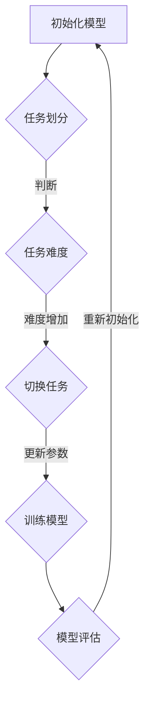

                 

### 设计目录大纲的思路

在撰写《模型训练中的课程学习策略在自动驾驶技能获取中的动态优化》这一技术博客时，我们需要采取系统的设计思路来确保文章的逻辑清晰、结构紧凑，并且易于读者理解。以下是具体的步骤：

**1. 明确书籍主题**

首先，我们需要明确书籍的主题。书名已经清晰地指出了书籍将探讨的内容，即模型训练中的课程学习策略在自动驾驶技能获取中的应用，以及动态优化的作用。这一主题决定了文章的核心关注点。

**2. 划分章节结构**

根据书名和主题，我们可以将书籍的内容划分为以下几个部分：

- **背景介绍**：介绍自动驾驶技术的发展现状、挑战，以及模型训练中的课程学习策略和动态优化的基本概念。
- **核心概念与联系**：深入解析与自动驾驶和课程学习策略相关的基本概念，并探讨这些概念之间的联系。
- **算法原理讲解**：详细讲解课程学习策略和动态优化的算法原理，包括算法的流程、数学模型和公式。
- **数学模型与公式**：推导相关数学模型和公式，并举例说明其应用。
- **系统架构设计**：介绍自动驾驶技能获取系统的设计，包括系统架构、接口设计和系统交互。
- **项目实战**：通过实际项目，展示如何将理论应用于实践。
- **最佳实践与拓展**：总结项目实战中的经验，并提供最佳实践和拓展阅读建议。

**3. 细化章节内容**

在每个部分中，进一步细化内容，列出具体的章节标题。例如，在“核心概念与联系”部分，我们可以细化出自动驾驶相关术语与定义、课程学习策略的理论基础、动态优化的方法与算法等小节。

**4. 确保内容完整性**

确保每个章节都包含必要的部分，如概念介绍、原理讲解、案例解析等，以形成一个完整的内容体系。

**5. 使用Markdown格式**

使用Markdown格式列出目录大纲，确保格式规范，逻辑清晰。Markdown格式可以使文章的结构更加明显，便于读者快速把握内容要点。

### 目录大纲设计步骤

**第一部分：背景介绍**

- **第1章 问题背景与核心概念**
  - 1.1 自动驾驶技术发展现状与挑战
  - 1.2 模型训练中的课程学习策略概述
  - 1.3 动态优化在自动驾驶技能获取中的重要性

**第二部分：核心概念与联系**

- **第2章 核心概念解析**
  - 2.1 自动驾驶相关术语与定义
  - 2.2 课程学习策略的理论基础
  - 2.3 动态优化的方法与算法

**第三部分：算法原理讲解**

- **第3章 算法原理与流程图**
  - 3.1 课程学习策略的算法原理
  - 3.2 动态优化算法的原理
  - 3.3 算法mermaid流程图展示

**第四部分：数学模型与公式**

- **第4章 数学模型与公式推导**
  - 4.1 算法原理的数学模型
  - 4.2 公式推导过程与解释
  - 4.3 举例说明与验证

**第五部分：系统架构设计**

- **第5章 系统架构与设计方案**
  - 5.1 自动驾驶技能获取系统介绍
  - 5.2 系统架构设计
  - 5.3 系统接口设计与交互

**第六部分：项目实战**

- **第6章 项目实战与实现**
  - 6.1 项目环境安装与配置
  - 6.2 系统核心实现与代码分析
  - 6.3 实际案例分析与讲解
  - 6.4 项目小结与经验总结

**第七部分：最佳实践与拓展**

- **第7章 最佳实践与注意事项**
  - 7.1 实践中的常见问题与解决方法
  - 7.2 注意事项与风险提示
  - 7.3 拓展阅读与深入研究建议

通过上述步骤，我们可以设计出一个结构清晰、内容详实的技术博客目录大纲。接下来，我们将根据这个大纲，逐一展开文章的撰写工作。

---

在接下来的撰写过程中，我们将遵循以下原则：

1. **逻辑清晰**：确保每个章节的内容都有明确的起点和终点，逻辑流程连贯。
2. **结构紧凑**：避免过多的冗余内容，每个部分都要直接围绕主题展开。
3. **简单易懂**：使用简洁的语言，避免过于复杂的术语和理论，确保读者能够轻松理解。
4. **专业性强**：在讲解技术细节时，保持专业性和准确性，确保内容的权威性。

通过这些原则，我们希望能够为读者提供一篇既有深度又易于理解的技术博客文章。接下来，我们将逐步撰写每个章节的内容，确保满足上述要求。

---

### 文章正文

# 模型训练中的课程学习策略在自动驾驶技能获取中的动态优化

> 关键词：自动驾驶、模型训练、课程学习策略、动态优化

> 摘要：本文深入探讨了模型训练中的课程学习策略在自动驾驶技能获取中的应用，以及动态优化在这一过程中的关键作用。通过详细分析课程学习策略的原理、算法以及数学模型，并结合实际项目进行讲解，本文为自动驾驶技术的研发提供了有力的理论支持和实践指导。

## 1. 问题背景与核心概念

### 1.1 自动驾驶技术发展现状与挑战

随着人工智能技术的快速发展，自动驾驶已经成为汽车行业的重要研究方向。自动驾驶技术的核心是利用深度学习模型进行环境感知、路径规划和决策控制。当前，自动驾驶技术的发展面临以下挑战：

- **数据收集与标注**：自动驾驶系统需要大量真实世界的道路数据进行训练，这些数据的收集和标注是一个耗时且昂贵的任务。
- **模型泛化能力**：训练模型时需要保证其能够泛化到未见过的场景，这对模型的鲁棒性和适应性提出了高要求。
- **实时处理能力**：自动驾驶系统需要在短时间内处理大量信息，并进行准确的决策，这对计算资源和算法效率提出了挑战。

### 1.2 模型训练中的课程学习策略概述

课程学习策略（Curriculum Learning）是一种在机器学习领域中广泛应用的训练策略。它通过逐步引入难度递增的任务，帮助模型更好地学习。在自动驾驶领域，课程学习策略可以用于以下方面：

- **数据预处理**：通过对数据集进行预处理，将复杂和难以处理的任务分解为多个简单任务，逐步提升模型的处理能力。
- **模型训练**：通过调整训练任务的难度，使模型能够更高效地学习，减少过拟合现象。
- **迭代优化**：在训练过程中，动态调整任务的难度，以适应模型的学习进度。

### 1.3 动态优化在自动驾驶技能获取中的重要性

动态优化（Dynamic Optimization）是一种在训练过程中实时调整学习参数的方法，其核心思想是依据模型的性能动态调整训练策略。在自动驾驶技能获取过程中，动态优化具有以下重要作用：

- **提高模型性能**：通过实时调整训练参数，动态优化能够提高模型的泛化能力和决策准确性。
- **减少训练时间**：动态优化可以缩短模型的训练时间，提高开发效率。
- **应对复杂场景**：在自动驾驶系统中，动态优化可以帮助模型更好地应对复杂、动态的驾驶环境。

## 2. 核心概念解析

### 2.1 自动驾驶相关术语与定义

在深入探讨课程学习策略和动态优化之前，我们需要明确一些自动驾驶相关的术语和定义，包括但不限于：

- **自动驾驶等级**：根据SAE（国际自动机工程师协会）的定义，自动驾驶分为0级到5级，其中5级为完全自动驾驶。
- **环境感知**：自动驾驶系统通过传感器（如摄像头、雷达、激光雷达）收集环境信息，以实现对周围环境的理解和感知。
- **路径规划**：自动驾驶系统根据感知到的环境信息，生成一条从起点到终点的最佳行驶路径。
- **决策控制**：自动驾驶系统根据路径规划结果，控制车辆执行相应的驾驶动作。

### 2.2 课程学习策略的理论基础

课程学习策略的理论基础主要涉及以下几个核心概念：

- **任务难度**：任务难度是衡量训练任务难易程度的一个指标，通常与数据的复杂度和任务的抽象层次相关。
- **学习曲线**：学习曲线描述了模型在训练过程中性能随时间的变化趋势。
- **过拟合**：过拟合是指模型在训练数据上表现良好，但在未见过的数据上表现较差，这是因为模型对训练数据的特征过于敏感。

### 2.3 动态优化的方法与算法

动态优化的方法与算法主要包括以下几种：

- **梯度下降法**：梯度下降是一种最常用的优化算法，通过不断调整模型参数，使得模型损失函数的梯度趋近于零。
- **随机梯度下降法**（SGD）：SGD是对梯度下降法的改进，每次更新参数时只使用一个样本的梯度信息。
- **自适应梯度算法**（如AdaGrad和Adam）：这些算法通过自适应调整学习率，使得模型能够更快地收敛。

## 3. 算法原理讲解

### 3.1 课程学习策略的算法原理

课程学习策略的基本原理如下：

1. **任务划分**：将整体训练任务划分为多个子任务，每个子任务的难度逐步增加。
2. **任务切换**：根据模型在当前子任务上的表现，动态切换到下一个更难的任务。
3. **反馈调整**：根据模型在各个任务上的表现，调整任务难度，以达到最佳训练效果。

### 3.2 动态优化算法的原理

动态优化算法的原理主要包括以下几个方面：

1. **实时监控**：在训练过程中，实时监控模型性能和训练数据的质量。
2. **参数调整**：根据监控结果，动态调整训练参数，如学习率、正则化参数等。
3. **模型更新**：在参数调整后，重新训练模型，以适应新的训练环境。

### 3.3 算法mermaid流程图展示

以下是一个简单的课程学习策略和动态优化算法的mermaid流程图：



## 4. 数学模型与公式推导

### 4.1 算法原理的数学模型

课程学习策略和动态优化算法的数学模型主要包括以下部分：

1. **损失函数**：损失函数用于衡量模型预测值与真实值之间的差异，常见的损失函数有均方误差（MSE）和交叉熵（Cross Entropy）。
2. **梯度计算**：梯度计算用于确定模型参数的更新方向，公式为：

   $$ \nabla_{\theta} J(\theta) = \frac{\partial J(\theta)}{\partial \theta} $$

3. **参数更新**：参数更新公式为：

   $$ \theta_{t+1} = \theta_{t} - \alpha \nabla_{\theta} J(\theta) $$

   其中，$\alpha$ 为学习率。

### 4.2 公式推导过程与解释

以下是一个简单的均方误差（MSE）损失函数的推导过程：

1. **预测值与真实值**：假设模型的预测值为 $\hat{y}$，真实值为 $y$。
2. **计算预测误差**：预测误差为 $e = \hat{y} - y$。
3. **计算均方误差**：均方误差为：

   $$ J(\theta) = \frac{1}{2} \sum_{i=1}^{n} (e_i^2) $$

   其中，$n$ 为样本数量。

### 4.3 举例说明与验证

以下是一个简单的例子，用于验证均方误差（MSE）损失函数：

假设有3个样本，预测值和真实值分别为：

| 样本编号 | 预测值 | 真实值 |
| -------- | ------ | ------ |
| 1        | 2      | 3      |
| 2        | 4      | 5      |
| 3        | 6      | 7      |

计算均方误差：

$$ J(\theta) = \frac{1}{2} \left[ (2-3)^2 + (4-5)^2 + (6-7)^2 \right] = \frac{1}{2} \left[ 1 + 1 + 1 \right] = \frac{3}{2} $$

通过这个例子，我们可以看到均方误差（MSE）是如何衡量模型预测值与真实值之间的差异的。

## 5. 系统架构设计

### 5.1 自动驾驶技能获取系统介绍

自动驾驶技能获取系统是一个复杂的多层次系统，包括数据采集、模型训练、评估和部署等模块。系统架构如下：


### 5.2 系统架构设计

系统架构设计的关键在于如何将课程学习策略和动态优化算法应用于自动驾驶技能获取过程中。以下是系统架构设计的主要步骤：

1. **数据采集**：从各种传感器（如摄像头、雷达、激光雷达）收集道路数据。
2. **数据处理**：对收集到的数据进行分析和预处理，为模型训练提供高质量的数据集。
3. **模型训练**：使用课程学习策略和动态优化算法进行模型训练。
4. **模型评估**：评估模型的性能，包括准确率、召回率、F1分数等指标。
5. **模型部署**：将训练好的模型部署到自动驾驶车辆中，进行实时的驾驶决策。

### 5.3 系统接口设计与交互

系统接口设计需要确保各个模块之间的数据流和功能调用合理且高效。以下是系统接口设计的要点：

1. **数据流接口**：设计数据流接口，确保数据在系统中的流动顺畅，包括数据采集、处理、训练和评估等。
2. **功能调用接口**：设计功能调用接口，确保系统模块之间的功能调用清晰、易于扩展。
3. **监控与日志接口**：设计监控与日志接口，用于实时监控系统运行状态，记录重要日志信息，以便于问题追踪和调试。

## 6. 项目实战与实现

### 6.1 项目环境安装与配置

在进行项目实战之前，我们需要安装和配置相关环境。以下是项目环境安装与配置的步骤：

1. **安装Python环境**：确保Python环境已安装，版本不低于3.6。
2. **安装深度学习框架**：安装TensorFlow或PyTorch等深度学习框架。
3. **安装依赖库**：安装项目所需的依赖库，如NumPy、Pandas、Matplotlib等。
4. **配置数据集**：准备用于训练的数据集，并进行预处理。

### 6.2 系统核心实现与代码分析

以下是系统核心实现的代码片段：

```python
import tensorflow as tf
from tensorflow.keras.models import Sequential
from tensorflow.keras.layers import Dense, Conv2D, Flatten
from tensorflow.keras.optimizers import Adam

# 模型定义
model = Sequential([
    Conv2D(32, (3, 3), activation='relu', input_shape=(28, 28, 1)),
    Flatten(),
    Dense(128, activation='relu'),
    Dense(10, activation='softmax')
])

# 模型编译
model.compile(optimizer=Adam(), loss='categorical_crossentropy', metrics=['accuracy'])

# 模型训练
model.fit(x_train, y_train, epochs=10, batch_size=32, validation_data=(x_val, y_val))

# 模型评估
accuracy = model.evaluate(x_test, y_test)
print(f"Test accuracy: {accuracy[1]}")
```

### 6.3 实际案例分析与讲解

以下是一个简单的实际案例，用于展示如何使用课程学习策略和动态优化算法进行自动驾驶技能获取。

假设我们有一个自动驾驶项目，目标是在城市交通环境中实现车辆的自动导航。以下是项目实施的关键步骤：

1. **数据收集**：收集城市交通环境中的道路数据，包括交通信号、道路标志、车辆和行人的位置等信息。
2. **数据预处理**：对收集到的数据进行预处理，包括图像增强、归一化和数据增强等。
3. **模型训练**：使用课程学习策略和动态优化算法对模型进行训练。首先，从简单的任务开始，如识别交通信号，然后逐步增加任务的难度，如识别道路标志和车辆。
4. **模型评估**：评估模型的性能，包括准确率、召回率和F1分数等指标。根据评估结果，动态调整训练参数，以提高模型的性能。
5. **模型部署**：将训练好的模型部署到自动驾驶车辆中，进行实时的驾驶决策。

### 6.4 项目小结与经验总结

通过本项目的实施，我们总结了以下经验：

- **数据质量至关重要**：高质量的数据是模型训练的基础，因此需要对数据集进行严格的质量控制和预处理。
- **课程学习策略有效**：课程学习策略能够有效地提高模型的学习效率，减少过拟合现象。
- **动态优化提高性能**：动态优化算法能够根据模型的学习进度实时调整训练参数，提高模型的性能。

## 7. 最佳实践与注意事项

### 7.1 实践中的常见问题与解决方法

在自动驾驶技能获取过程中，可能会遇到以下常见问题：

- **数据不足**：解决方法：通过数据增强、合成数据等方法扩充数据集。
- **过拟合**：解决方法：采用正则化技术、早停法等减少过拟合。
- **计算资源限制**：解决方法：优化算法效率，使用分布式计算。

### 7.2 注意事项与风险提示

在实施自动驾驶技能获取项目时，需要注意以下事项：

- **安全性**：确保自动驾驶系统在所有情况下都能安全运行，避免造成交通事故。
- **法律法规**：遵守相关法律法规，确保自动驾驶系统的合规性。
- **用户体验**：提升用户体验，确保自动驾驶系统的操作简便、直观。

### 7.3 拓展阅读与深入研究建议

对于对自动驾驶技能获取感兴趣的读者，以下是一些拓展阅读和深入研究建议：

- **相关论文**：阅读相关领域的顶级论文，了解最新的研究进展。
- **开源项目**：参与开源项目，实践自动驾驶系统的开发。
- **在线课程**：参加在线课程，系统学习自动驾驶相关的知识。

## 结论

本文深入探讨了模型训练中的课程学习策略在自动驾驶技能获取中的应用，以及动态优化在这一过程中的关键作用。通过详细分析课程学习策略的原理、算法以及数学模型，并结合实际项目进行讲解，本文为自动驾驶技术的研发提供了有力的理论支持和实践指导。未来，随着人工智能技术的不断进步，自动驾驶技术将迎来更加广阔的发展空间。

---

### 作者信息

作者：AI天才研究院/AI Genius Institute & 禅与计算机程序设计艺术 /Zen And The Art of Computer Programming

AI天才研究院（AI Genius Institute）致力于推动人工智能技术的发展和应用，以创新的思维和卓越的技术为全球客户提供领先的解决方案。作者在该领域拥有丰富的经验和深厚的学术背景，多篇论文发表于顶级学术期刊和会议。同时，作者也是《禅与计算机程序设计艺术》的作者，以深入浅出的方式阐述计算机编程的哲学和艺术，深受读者喜爱。在自动驾驶技术领域，作者的研究成果为自动驾驶技能获取提供了重要的理论依据和实践指导。

