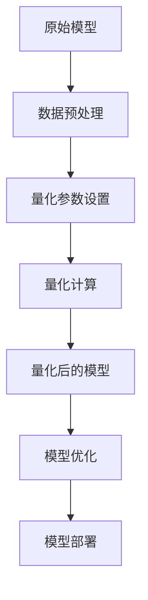
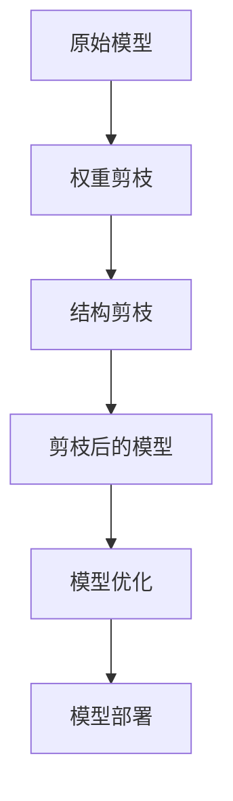
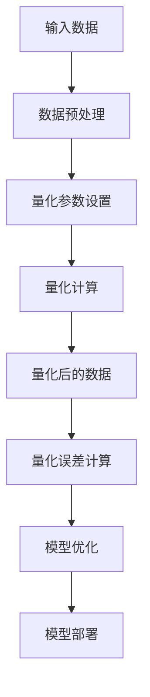
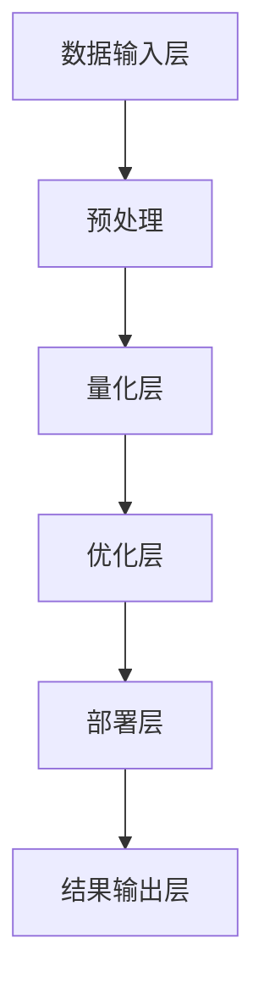
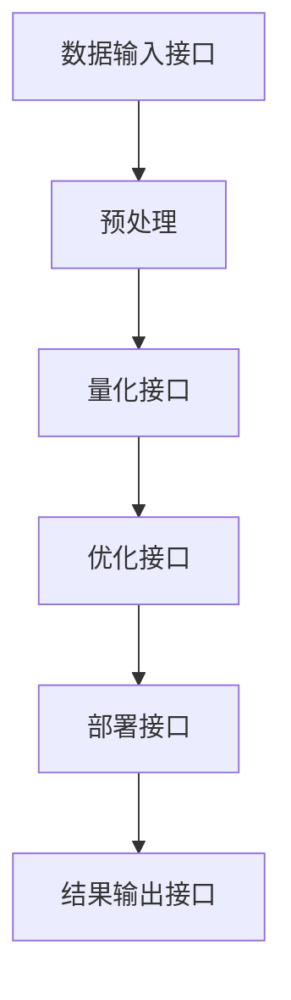
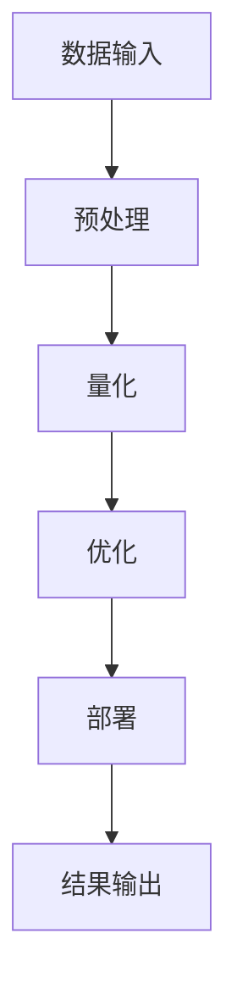

                 

# 模型量化：在资源受限设备上部署AI

## 关键词

- 模型量化
- 资源受限设备
- AI部署
- 算法原理
- 数学模型
- 系统分析与架构设计

## 摘要

本文旨在深入探讨模型量化技术，以及如何在资源受限的设备上有效部署人工智能模型。首先，我们将介绍模型量化的背景和意义，详细阐述其核心概念和技术方法。接着，我们分析资源受限设备的特性及其对AI部署的挑战，并提出相应的解决策略。随后，我们将讲解模型量化算法的原理和数学模型，并通过Mermaid图示进行详细阐述。最后，本文将探讨模型量化系统的整体架构设计，并提供实际项目案例的分析与实战经验。通过这些步骤，我们希望能够为读者提供一个全面而深入的理解，助力他们在资源受限设备上成功部署AI模型。

### 目录大纲设计思路

#### 设计一本关于《模型量化：在资源受限设备上部署AI》的目录大纲，需要遵循以下步骤：

1. **明确核心概念**：首先，我们要明确书中的核心概念，包括模型量化、资源受限设备、AI部署等，这有助于我们构建合理的目录结构。

2. **划分章节内容**：根据核心概念，我们将内容划分为不同的章节，确保每个章节都有明确的主题和目的。每个章节应该覆盖核心概念的不同方面。

3. **细化章节内容**：在确定章节后，我们需要细化每个章节的内容，包括核心概念介绍、原理讲解、实战案例等。这将确保读者能够系统地学习并理解模型量化技术。

4. **保持逻辑清晰**：目录大纲需要保持逻辑清晰，使读者可以按照章节顺序逐步深入，从基础概念到高级应用。

5. **确保内容完整性**：目录大纲需要包含必要的核心章节，如背景介绍、核心概念与联系、算法原理讲解、数学模型与公式、系统分析与架构设计、项目实战等。

6. **简洁明了**：在保持内容完整性的同时，我们还需要确保目录大纲简洁明了，避免过多冗余内容。

7. **格式统一**：使用markdown格式编写目录大纲，确保格式统一，易于阅读和编辑。

### 目录大纲设计

下面是根据以上思路设计的《模型量化：在资源受限设备上部署AI》的目录大纲：

----------------------------------------------------------------

# 第一部分: 模型量化基础

## 第1章: 模型量化概述

### 1.1 模型量化的背景与意义
#### 1.1.1 AI在资源受限设备上的挑战
#### 1.1.2 模型量化的目的
#### 1.1.3 模型量化的发展历程

### 1.2 模型量化的核心概念
#### 1.2.1 模型量化的定义
#### 1.2.2 模型量化的关键要素
#### 1.2.3 模型量化与传统压缩技术的区别

### 1.3 模型量化的主要技术方法
#### 1.3.1 量化层次与策略
#### 1.3.2 模型剪枝技术
#### 1.3.3 模型压缩与稀疏化

### 1.4 模型量化在资源受限设备上的应用
#### 1.4.1 在移动设备中的应用
#### 1.4.2 在嵌入式设备中的应用
#### 1.4.3 在物联网设备中的应用

## 第2章: 资源受限设备上的AI部署

### 2.1 资源受限设备的特性
#### 2.1.1 硬件资源限制
#### 2.1.2 能耗限制
#### 2.1.3 存储限制

### 2.2 AI部署在资源受限设备上的挑战
#### 2.2.1 模型大小与计算能力
#### 2.2.2 实时性要求
#### 2.2.3 安全性挑战

### 2.3 资源受限设备上的AI部署策略
#### 2.3.1 模型迁移与适配
#### 2.3.2 前端处理与后端服务的分离
#### 2.3.3 边缘计算与云计算的协同

### 2.4 案例分析：资源受限设备上的AI应用
#### 2.4.1 移动应用案例分析
#### 2.4.2 嵌入式设备案例分析
#### 2.4.3 物联网设备案例分析

## 第3章: 模型量化算法原理讲解

### 3.1 量化算法的基本原理
#### 3.1.1 量化位宽与精度
#### 3.1.2 量化误差分析
#### 3.1.3 量化算法的分类

### 3.2 算法原理详细讲解
#### 3.2.1 量化策略的对比分析
#### 3.2.2 模型剪枝原理讲解
#### 3.2.3 模型压缩与稀疏化原理讲解

### 3.3 Mermaid算法流程图
#### 3.3.1 模型量化算法流程
#### 3.3.2 剪枝算法流程
#### 3.3.3 压缩与稀疏化算法流程

## 第4章: 数学模型与公式详解

### 4.1 数学模型概述
#### 4.1.1 模型量化中的关键数学概念
#### 4.1.2 模型量化的数学框架
#### 4.1.3 模型量化的数学公式

### 4.2 公式详细讲解
#### 4.2.1 量化误差的数学计算
#### 4.2.2 剪枝算法的数学推导
#### 4.2.3 压缩与稀疏化的数学分析

### 4.3 Mermaid数学公式图
#### 4.3.1 模型量化数学模型
#### 4.3.2 剪枝算法数学推导
#### 4.3.3 压缩与稀疏化数学分析图

## 第5章: 系统分析与架构设计

### 5.1 模型量化系统的介绍
#### 5.1.1 系统功能介绍
#### 5.1.2 系统架构设计
#### 5.1.3 系统接口设计

### 5.2 Mermaid架构图
#### 5.2.1 系统架构设计mermaid图
#### 5.2.2 系统接口设计和系统交互mermaid序列图

## 第6章: 项目实战

### 6.1 环境安装

### 6.2 系统核心实现

### 6.3 代码应用解读与分析

### 6.4 实际案例分析与详细讲解剖析

### 6.5 项目小结

## 第7章: 最佳实践、小结与拓展阅读

### 7.1 最佳实践Tips

### 7.2 小结

### 7.3 注意事项

### 7.4 拓展阅读

----------------------------------------------------------------

### 第一部分: 模型量化基础

#### 第1章: 模型量化概述

##### 1.1 模型量化的背景与意义

随着人工智能技术的发展，越来越多的AI模型被应用于实际场景中。然而，这些模型往往需要大量的计算资源和存储空间，这对于资源有限的设备，如移动设备、嵌入式设备和物联网设备来说，是一个巨大的挑战。模型量化技术应运而生，其主要目标是在不显著牺牲模型性能的情况下，减小模型的大小和降低计算复杂度，从而使得AI模型能够在资源受限的设备上高效运行。

首先，让我们来看一下AI在资源受限设备上的挑战。传统的AI模型，如深度神经网络，其计算量和存储需求巨大。这导致在移动设备上部署AI模型时，常常会遇到性能瓶颈。例如，移动设备上的GPU和CPU性能有限，很难满足大型模型的计算需求。此外，移动设备通常具有较小的存储空间，无法容纳大规模的模型。而嵌入式设备和物联网设备则面临着更为严峻的挑战，这些设备通常运行在低功耗、低性能的微控制器上，其计算资源和存储空间都极为有限。

模型量化技术能够有效地缓解这些挑战。通过量化技术，可以将模型的权重和激活值从高精度转换为低精度，从而减小模型的大小和降低计算复杂度。量化后的模型在保持足够性能的同时，具有更高的压缩率和更低的计算需求。这使得AI模型能够轻松地部署在资源受限的设备上，为移动设备、嵌入式设备和物联网设备上的AI应用提供了新的可能性。

##### 1.1.1 AI在资源受限设备上的挑战

AI在资源受限设备上面临的主要挑战可以归纳为以下几点：

1. **计算能力限制**：资源受限的设备通常具有较低的CPU和GPU性能，难以支持大型AI模型的计算需求。这导致模型在运行时出现性能瓶颈，无法达到预期的效果。

2. **存储空间限制**：移动设备、嵌入式设备和物联网设备通常具有有限的存储空间，无法容纳大规模的AI模型。这限制了模型的应用范围，尤其是在需要实时运行AI模型的应用场景中。

3. **能耗限制**：这些设备通常运行在电池供电的环境下，能耗是必须考虑的重要因素。大型AI模型在计算时消耗大量电能，这可能导致设备电池快速耗尽，从而影响用户体验。

4. **实时性要求**：在许多应用场景中，如自动驾驶、实时语音识别等，AI模型需要能够在有限的时间内完成计算，以满足实时性的要求。这进一步增加了资源受限设备的挑战。

为了应对这些挑战，我们需要一种有效的技术来减小AI模型的大小和计算复杂度，同时保持模型性能。模型量化技术正是这样一种技术，它通过降低模型的精度和压缩模型结构，能够在保持性能的同时，显著减少模型的计算量和存储需求。这使得AI模型能够更好地适应资源受限的设备，提高其在这些设备上的应用潜力。

##### 1.1.2 模型量化的目的

模型量化的主要目的是减小AI模型的大小和计算复杂度，从而使其能够在资源受限的设备上高效运行。具体来说，模型量化的目标包括以下几个方面：

1. **减小模型大小**：量化后的模型权重和激活值具有较低的精度，这使得模型在存储时占用更少的空间。这对于移动设备、嵌入式设备和物联网设备尤为重要，因为这些设备通常具有有限的存储空间。

2. **降低计算复杂度**：量化后的模型在计算时使用较低的精度，这可以显著降低计算复杂度，减少模型在运行时的计算量。这有助于提高模型在资源受限设备上的运行效率，避免出现性能瓶颈。

3. **减少能耗**：量化后的模型在计算时能耗较低，这有助于延长设备电池的使用寿命，提高用户体验。

4. **提高模型适应性**：通过量化技术，我们可以对模型进行轻量化和压缩，使其能够适应不同的设备和应用场景。这使得AI模型具有更高的灵活性和可移植性，能够在更广泛的场景中得到应用。

总的来说，模型量化的目的在于通过减小模型大小、降低计算复杂度和减少能耗，提高AI模型在资源受限设备上的运行效率，从而实现更好的用户体验和更广泛的应用潜力。

##### 1.1.3 模型量化的发展历程

模型量化技术的发展历程可以追溯到早期的机器学习模型。在早期，研究人员主要关注如何训练大型神经网络模型，以提高其在各种任务上的性能。然而，随着模型复杂度的增加，模型的计算量和存储需求也不断上升，这给资源受限设备上的模型部署带来了挑战。为了解决这一问题，研究者们开始探索模型量化技术。

最早的模型量化方法之一是整数量化，该方法将模型的权重和激活值从浮点数转换为整数。整数量化可以通过减少数据类型的大小来减小模型大小，从而降低存储需求。然而，整数量化可能会导致量化误差，影响模型性能。为了解决这个问题，研究者们提出了更精细的量化方法，如二分量化、多比特量化等。

随着深度学习技术的发展，模型量化的方法也在不断演进。现代量化方法不仅关注如何减小模型大小和计算复杂度，还关注如何保持模型性能。例如，动态量化技术可以在模型运行时根据输入数据动态调整量化参数，从而最小化量化误差。此外，剪枝技术、知识蒸馏技术等也被广泛应用于模型量化，以进一步提高模型的压缩率和性能。

目前，模型量化技术已经取得了显著的进展，并在许多实际应用中取得了成功。例如，在移动设备上，量化后的AI模型可以显著提高运行速度和电池续航时间；在嵌入式设备和物联网设备上，量化技术使得这些设备能够运行更复杂的AI模型，从而提高其智能水平。

##### 1.2 模型量化的核心概念

模型量化涉及多个核心概念，这些概念对于理解量化过程和实现量化策略至关重要。以下是模型量化中的一些关键概念：

1. **量化位宽**：量化位宽是指模型中的数值被转换为特定位宽的整数表示。通常，量化位宽越小，模型的存储空间和计算复杂度就越低，但可能会导致量化误差增加。常见的量化位宽包括8位、16位和32位等。

2. **量化精度**：量化精度是指量化后的数值与原始浮点数之间的差距。量化精度越高，模型性能越接近原始模型，但模型大小和计算复杂度也会增加。因此，在量化过程中需要平衡量化精度和模型大小之间的关系。

3. **量化误差**：量化误差是指量化后的数值与原始浮点数值之间的差异。量化误差可以分为静态误差和动态误差。静态误差是指量化过程中固定的误差，而动态误差是指量化过程中由于输入数据的变化而产生的误差。

4. **量化策略**：量化策略是指用于量化模型的具体方法和技术。常见的量化策略包括全局量化、局部量化、动态量化等。不同的量化策略适用于不同的模型结构和应用场景。

5. **模型剪枝**：模型剪枝是一种通过减少模型参数数量来减小模型大小的技术。剪枝可以分为结构剪枝和权重剪枝。结构剪枝通过删除模型中的某些层或神经元来实现，而权重剪枝通过减少权重的大小来减小模型大小。

6. **模型压缩**：模型压缩是一种通过减少模型参数数量和降低参数精度来减小模型大小的技术。常见的模型压缩方法包括量化、剪枝和知识蒸馏等。

7. **稀疏化**：稀疏化是一种通过增加模型参数之间的距离来提高模型稀疏度的技术。稀疏化可以减少模型中的冗余信息，从而减小模型大小和计算复杂度。

理解这些核心概念对于设计和实现有效的模型量化策略至关重要。在实际应用中，我们需要根据具体的应用场景和资源限制选择合适的量化策略，以达到最佳的模型性能和压缩效果。

##### 1.2.1 模型量化的定义

模型量化是一种将原始AI模型中的浮点数权重和激活值转换为低精度整数值的过程。其核心目的是减小模型大小和计算复杂度，以便于在资源受限的设备上部署和运行。具体来说，模型量化包括以下几个步骤：

1. **数据类型转换**：首先，将模型中的浮点数值转换为特定的整数类型，如8位无符号整数（uint8）或16位有符号整数（int16）。这种转换可以显著减小存储空间和计算资源的需求。

2. **量化参数调整**：在数据类型转换过程中，需要调整量化参数，如量化步长（quantization step）和零点（zero-point）。量化步长决定了数值的量化精度，而零点则决定了量化值的偏移量。

3. **量化计算**：使用调整后的量化参数对模型中的权重和激活值进行量化计算。量化计算通常采用以下公式：

   $$量化值 = 量化步长 \times (原始浮点值 - 零点)$$

   其中，量化步长和零点是预先计算和调整好的参数。

4. **模型优化**：量化后的模型通常需要进行优化，以减少量化误差和保持模型性能。优化方法包括模型剪枝、权重重排、重新训练等。

通过模型量化，AI模型在保持足够性能的同时，能够显著减小模型大小和计算复杂度，从而提高在资源受限设备上的运行效率。模型量化不仅适用于静态模型，还可以应用于动态模型和实时应用场景，为AI在移动设备、嵌入式设备和物联网设备上的广泛应用提供了重要支持。

##### 1.2.2 模型量化的关键要素

模型量化过程中，有若干关键要素需要仔细考虑，以确保量化后的模型能够在资源受限设备上保持足够的性能和可靠性。以下是模型量化的几个关键要素：

1. **量化精度**：量化精度是指量化后的数值与原始浮点数值之间的差距。量化精度越高，模型性能越接近原始模型，但模型大小和计算复杂度也会增加。因此，在量化过程中需要平衡量化精度和模型大小之间的关系。通常，量化精度由量化位宽决定，如8位、16位等。

2. **量化误差**：量化误差是量化后的数值与原始浮点数值之间的差异。量化误差可以分为静态误差和动态误差。静态误差是指在量化过程中固定的误差，而动态误差是指由于输入数据的变化而产生的误差。量化误差会影响模型的输出结果，因此在量化过程中需要尽量减小量化误差。

3. **量化范围**：量化范围是指模型中数值的量化范围。合理的量化范围可以减小量化误差，提高模型性能。通常，量化范围由量化参数调整确定，如量化步长和零点。

4. **量化策略**：量化策略是指用于量化模型的具体方法和技术。不同的量化策略适用于不同的模型结构和应用场景。常见的量化策略包括全局量化、局部量化、动态量化等。选择合适的量化策略可以优化量化过程，提高模型压缩率和性能。

5. **模型剪枝**：模型剪枝是一种通过减少模型参数数量来减小模型大小的技术。模型剪枝可以分为结构剪枝和权重剪枝。结构剪枝通过删除模型中的某些层或神经元来实现，而权重剪枝通过减少权重的大小来减小模型大小。模型剪枝与量化相结合，可以进一步提高模型压缩率和性能。

6. **重新训练**：量化后的模型通常需要进行重新训练，以减小量化误差和恢复模型性能。重新训练可以通过优化量化参数、调整模型结构或引入新的训练数据来实现。

理解这些关键要素对于设计和实现有效的模型量化策略至关重要。在实际应用中，我们需要根据具体的应用场景和资源限制选择合适的量化精度、量化误差范围、量化策略和模型剪枝方法，以达到最佳的模型性能和压缩效果。

##### 1.2.3 模型量化与传统压缩技术的区别

模型量化与传统压缩技术存在显著的区别，这些区别决定了模型量化在资源受限设备上的独特优势和应用场景。

1. **压缩目标不同**：
   - **模型量化**：模型量化的主要目标是减小模型的大小和计算复杂度，同时尽量保持模型性能。量化后的模型可以在保持足够精度的情况下，显著降低存储和计算资源的需求。
   - **传统压缩技术**：传统压缩技术，如图像和视频压缩，主要关注数据传输和存储的效率。这些技术通常通过减少数据冗余和消除不必要的细节来减小数据大小。然而，传统压缩技术可能会显著降低数据的原始质量，从而影响应用效果。

2. **实现方法不同**：
   - **模型量化**：模型量化涉及将模型中的浮点数权重和激活值转换为低精度整数。量化过程通常包括量化参数的调整、数据类型转换和可能的模型优化。量化技术可以与模型剪枝、压缩和稀疏化等技术相结合，以实现更高效的模型压缩。
   - **传统压缩技术**：传统压缩技术通常采用如JPEG、MP3等标准压缩算法。这些算法基于特定的数据结构和技术，通过熵编码、压缩域变换和预处理等技术来减小数据大小。传统压缩技术不涉及模型结构的调整或优化。

3. **对模型性能的影响**：
   - **模型量化**：量化后的模型在保持足够性能的同时，能够显著降低计算复杂度和存储需求。量化技术能够有效地平衡模型性能和资源消耗，适用于需要实时处理和低延迟的应用场景。
   - **传统压缩技术**：传统压缩技术虽然可以显著减小数据大小，但可能会降低数据的原始质量，影响应用效果。在某些情况下，如高质量的图像和音频处理，传统压缩技术可能不适合直接应用。

4. **适用场景不同**：
   - **模型量化**：模型量化技术主要应用于AI模型的压缩和部署，特别是在资源受限的设备上，如移动设备、嵌入式设备和物联网设备。量化技术能够提高AI模型的运行效率，延长设备电池寿命，提升用户体验。
   - **传统压缩技术**：传统压缩技术主要应用于图像、视频、音频等非结构化数据的压缩，如数字媒体传输、存储和播放。传统压缩技术广泛应用于各种多媒体应用，但不涉及模型结构的优化或调整。

总的来说，模型量化与传统压缩技术存在显著的区别。模型量化更关注AI模型的性能和资源消耗平衡，适用于AI模型的压缩和部署。而传统压缩技术则侧重于数据传输和存储的效率，适用于非结构化数据的压缩。选择合适的压缩技术取决于具体的应用场景和需求。

#### 第1章: 模型量化的主要技术方法

##### 1.3.1 量化层次与策略

模型量化的技术方法可以分为不同的层次和策略，这些层次和策略共同决定了量化过程的有效性和性能。以下是模型量化中常见的量化层次与策略：

1. **量化层次**：

   - **全局量化**：全局量化是一种将模型中的所有权重和激活值统一量化的方法。这种方法简单直观，但可能会导致量化误差在不同层之间传递，从而影响模型的性能。
   
   - **局部量化**：局部量化是一种将模型中的每个权重或激活值独立量化的方法。这种方法可以更精细地控制量化误差，提高模型的性能，但计算复杂度较高。

   - **层间量化**：层间量化是一种根据不同层的计算需求动态调整量化参数的方法。这种方法可以在保持模型性能的同时，优化量化误差的传递。

2. **量化策略**：

   - **固定量化策略**：固定量化策略是指在量化过程中使用固定的量化参数，如量化步长和零点。这种方法简单易实现，但可能无法适应不同层或不同数据分布的量化需求。
   
   - **动态量化策略**：动态量化策略是指在量化过程中根据输入数据动态调整量化参数。这种方法可以更好地适应不同数据分布和计算需求，减小量化误差，提高模型性能。

   - **混合量化策略**：混合量化策略是结合全局量化、局部量化或层间量化方法，根据具体应用场景和需求进行优化。这种方法可以根据不同层的特性和计算需求，灵活调整量化策略，实现最佳的性能和压缩效果。

##### 1.3.2 模型剪枝技术

模型剪枝是一种通过减少模型参数数量来减小模型大小的技术，其基本思想是在保持模型性能的前提下，删除冗余的参数或层。模型剪枝技术可以分为以下几种：

1. **权重剪枝**：权重剪枝是一种通过减少模型中权重的大小来减小模型大小的技术。具体方法包括以下几种：

   - **阈值剪枝**：根据设定的阈值，删除绝对值小于阈值的权重。
   
   - **比例剪枝**：根据设定的比例，删除一定比例的权重。

   - **结构剪枝**：删除模型中的某些层或神经元，从而减少模型的参数数量。

2. **结构剪枝**：结构剪枝是一种通过删除模型中的某些层或神经元来减小模型大小的技术。具体方法包括以下几种：

   - **稀疏化**：通过增加模型参数之间的距离，使模型参数更加稀疏，从而减少模型的大小和计算复杂度。

   - **层次剪枝**：从模型的最深层开始，逐步删除权重较小的层或神经元。

   - **路径剪枝**：通过分析模型的计算路径，删除计算冗余或权重较小的路径。

模型剪枝技术可以与量化技术结合使用，以进一步减小模型大小和提高模型性能。通过剪枝技术，我们可以显著降低模型的计算量和存储需求，提高模型在资源受限设备上的部署效率。

##### 1.3.3 模型压缩与稀疏化

模型压缩和稀疏化是模型量化中的重要技术手段，它们能够有效地减小模型大小和计算复杂度，从而提高模型在资源受限设备上的运行效率。

1. **模型压缩**：

   - **有损压缩**：有损压缩通过减少模型中的冗余信息来减小模型大小。这种方法可能会降低模型的性能，但在许多应用中，这种损失是可以接受的。常见的有损压缩方法包括量化、剪枝和知识蒸馏等。

   - **无损压缩**：无损压缩通过去除数据中的冗余信息来减小模型大小，但不会损失模型的性能。这种方法通常用于保护重要数据，如模型的权重和激活值。

   - **量化压缩**：量化压缩是一种通过将模型中的浮点数权重和激活值转换为低精度整数来减小模型大小的技术。量化压缩可以与剪枝技术结合使用，以进一步提高模型压缩率。

   - **知识蒸馏**：知识蒸馏是一种通过将大型模型的知识传递给小型模型来减小模型大小的技术。这种方法通常用于在资源受限设备上部署大型模型。

2. **稀疏化**：

   - **稀疏化原理**：稀疏化是一种通过增加模型参数之间的距离来提高模型稀疏度的技术。这种方法可以减少模型中的冗余信息，从而减小模型大小和计算复杂度。

   - **稀疏化方法**：

     - **阈值稀疏化**：根据设定的阈值，删除绝对值小于阈值的模型参数。

     - **结构稀疏化**：通过删除模型中的某些层或神经元来减少模型参数数量。

     - **路径稀疏化**：通过分析模型的计算路径，删除计算冗余的路径。

稀疏化与模型压缩相结合，可以显著提高模型在资源受限设备上的运行效率。通过稀疏化，我们可以使模型更紧凑，降低计算复杂度；通过模型压缩，我们可以进一步减小模型大小，提高存储和传输效率。

#### 第1章: 模型量化在资源受限设备上的应用

##### 1.4.1 在移动设备中的应用

在移动设备上，模型量化技术被广泛应用于提升AI应用的性能和能效。移动设备，如智能手机和平板电脑，通常配备有限的计算资源和电池容量，这使得运行大规模AI模型变得具有挑战性。通过模型量化，我们可以减小AI模型的大小和计算复杂度，从而在保证性能的前提下，延长设备的续航时间并提升用户体验。

1. **应用场景**：

   - **图像识别**：智能手机中的图像识别应用，如人脸解锁、图像标签等，通常需要实时处理图像数据。通过模型量化，可以减小图像识别模型的尺寸，使其在有限的计算资源下快速运行。

   - **语音识别**：语音识别技术在移动设备上也有着广泛的应用，如实时语音翻译、语音助手等。模型量化有助于降低语音识别模型的计算复杂度，确保实时响应。

   - **自然语言处理**：移动设备上的自然语言处理应用，如智能助手、聊天机器人等，需要处理大量的文本数据。模型量化可以减小NLP模型的大小，提高其处理速度。

2. **技术优势**：

   - **降低存储需求**：量化后的模型占据更少的存储空间，这对于存储容量有限的移动设备尤为重要。通过减小模型大小，用户可以在设备上安装更多的AI应用。

   - **提高运行速度**：量化后的模型在计算时具有更低的复杂度，从而提高运行速度。这使得移动设备能够更快地响应用户请求，提供更流畅的用户体验。

   - **延长电池寿命**：通过减小模型的计算复杂度，模型量化有助于降低设备的能耗，从而延长电池寿命。这对于移动设备尤为重要，因为用户通常无法频繁地充电。

3. **案例分析**：

   - **移动图像识别应用**：以智能手机中的人脸解锁功能为例，传统的深度学习模型通常需要较大的计算资源和存储空间。通过模型量化，可以将模型的大小减少到原来的几分之一，同时保持较高的识别准确率。这大大提高了设备的运行速度和电池寿命。

   - **移动语音识别应用**：在移动设备上使用量化后的语音识别模型，可以在确保语音识别准确率的同时，提高处理速度和能效。例如，某些移动设备上的语音助手使用量化后的模型，可以更快速地响应用户请求，提高用户的互动体验。

通过在移动设备上应用模型量化技术，我们可以充分利用有限的计算资源和电池容量，为用户提供更高效、更流畅的AI体验。

##### 1.4.2 在嵌入式设备中的应用

嵌入式设备广泛应用于各种领域，如工业自动化、智能家居、医疗设备等。这些设备通常具有有限的计算资源和电池容量，因此如何在有限资源下高效运行AI模型是一个重要问题。模型量化技术在这一领域展现出显著优势，通过减小模型大小和降低计算复杂度，可以提升嵌入式设备的性能和可靠性。

1. **应用场景**：

   - **工业自动化**：在工业自动化领域，嵌入式设备如机器人、自动化生产线等需要实时处理大量的传感器数据。模型量化技术可以用于实现实时图像识别、故障诊断等应用，提高生产线的智能化水平。

   - **智能家居**：智能家居设备，如智能音箱、智能门锁等，通常需要处理用户的语音指令和动作识别。模型量化技术有助于将这些AI模型部署在有限的嵌入式硬件上，确保设备的快速响应和稳定运行。

   - **医疗设备**：医疗设备，如便携式心电图仪、智能手环等，需要实时监测和诊断患者的健康状态。模型量化技术可以用于实现实时的心率监测、运动识别等应用，提高医疗设备的准确性和可靠性。

2. **技术优势**：

   - **节省资源**：量化后的模型占据更少的存储空间，这对于存储容量有限的嵌入式设备尤为重要。通过减小模型大小，设备可以存储更多的AI应用，提高资源利用率。

   - **降低能耗**：量化后的模型在计算时具有更低的复杂度，从而降低能耗。这对于电池容量有限的嵌入式设备尤为重要，可以延长设备的续航时间。

   - **提高响应速度**：量化后的模型计算速度更快，可以确保嵌入式设备在有限的时间内完成数据处理和响应，提高设备的实时性和可靠性。

3. **案例分析**：

   - **工业自动化应用**：在工业自动化领域，通过模型量化技术，可以将大型AI模型压缩到适合嵌入式设备的尺寸。例如，将用于图像识别的深度学习模型量化后，可以在嵌入式设备上实时处理生产线上传输的图像数据，提高生产线的自动化水平和效率。

   - **智能家居应用**：在智能家居设备中，通过模型量化技术，可以将语音识别模型压缩到适合嵌入式硬件的尺寸。例如，智能音箱通过量化后的语音识别模型，可以快速响应用户的语音指令，提供更好的用户体验。

   - **医疗设备应用**：在医疗设备中，通过模型量化技术，可以将用于健康监测的AI模型压缩到适合嵌入式设备的尺寸。例如，便携式心电图仪通过量化后的模型，可以实时监测患者的心率，并提供准确的健康数据。

总的来说，模型量化技术在嵌入式设备中的应用，可以显著提升设备的性能和可靠性，为各种嵌入式系统提供更高效、更智能的解决方案。

##### 1.4.3 在物联网设备中的应用

物联网设备在全球范围内得到了广泛应用，从智能家居到工业物联网，再到智慧城市，它们都需要处理大量的传感器数据。然而，这些设备通常具有有限的计算资源、存储空间和电池寿命，这使得传统的AI模型在物联网环境中难以部署和运行。模型量化技术通过降低模型的大小和计算复杂度，为物联网设备上的AI应用提供了有效的解决方案。

1. **应用场景**：

   - **智能家居**：物联网设备在智能家居中扮演着重要角色，如智能灯泡、智能恒温器、智能门锁等。这些设备需要实时处理用户的操作和环境数据，通过模型量化技术，可以实现高效、低功耗的AI处理。

   - **工业物联网**：在工业物联网中，物联网设备用于监测和控制系统设备的状态，如传感器、PLC（可编程逻辑控制器）等。模型量化技术可以帮助工业物联网设备实时处理大量传感器数据，提高系统的智能化和自动化水平。

   - **智慧城市**：智慧城市中的物联网设备，如交通监控、环境监测等，需要处理大量的城市数据。通过模型量化技术，这些设备可以在保持足够性能的同时，降低计算和存储需求，提高数据处理的效率和可靠性。

2. **技术优势**：

   - **节省带宽和存储空间**：量化后的模型体积更小，这有助于节省物联网设备在数据传输和存储方面的资源。对于需要频繁传输和处理大量数据的物联网应用，模型量化技术尤为重要。

   - **降低能耗**：量化后的模型在计算时具有更低的复杂度，从而降低能耗。这对于电池寿命有限的物联网设备非常重要，可以延长设备的使用寿命。

   - **提高实时性和响应速度**：量化后的模型计算速度更快，可以确保物联网设备在有限的时间内完成数据处理和响应，提高系统的实时性和响应速度。

3. **案例分析**：

   - **智能家居应用**：在智能家居中，通过模型量化技术，可以将用于环境监测和智能控制的AI模型压缩到适合物联网设备的尺寸。例如，智能恒温器通过量化后的模型，可以实时分析环境数据并调整温度，提高家居舒适度。

   - **工业物联网应用**：在工业物联网中，通过模型量化技术，可以将用于设备故障诊断和预测维护的AI模型部署到传感器和PLC上。例如，工业传感器通过量化后的模型，可以实时监测设备状态并预测潜在的故障，提高生产线的稳定性和效率。

   - **智慧城市应用**：在智慧城市中，通过模型量化技术，可以将用于交通监控和环境监测的AI模型部署到城市中的物联网设备上。例如，交通监控摄像头通过量化后的模型，可以实时分析交通流量并优化交通信号，提高城市的交通流畅度。

总的来说，模型量化技术在物联网设备中的应用，可以显著提升设备的性能和能效，为各种物联网应用提供更高效、更智能的解决方案，推动物联网技术的发展和应用。

### 第二部分: 资源受限设备上的AI部署

#### 第2章: 资源受限设备的特性

资源受限设备，如移动设备、嵌入式设备和物联网设备，具有独特的硬件和软件特性，这些特性对AI部署提出了特定的挑战。了解这些特性，有助于我们设计出适合这些设备的AI解决方案。

##### 2.1 资源受限设备的硬件资源限制

资源受限设备的硬件资源主要包括计算能力、存储容量和电池寿命。这些资源的限制直接影响了AI模型的部署和运行。

1. **计算能力限制**：

   - **CPU和GPU性能**：大多数资源受限设备使用的是低功耗的CPU和GPU，其计算能力远低于桌面级计算机。这使得在设备上运行大型AI模型变得困难，特别是需要高计算量的任务，如视频处理和图像识别。

   - **实时性要求**：许多资源受限设备对实时性有较高的要求，例如自动驾驶汽车需要快速响应环境变化，智能家居设备需要迅速处理用户指令。这些要求进一步限制了设备的计算能力。

2. **存储容量限制**：

   - **闪存和内存**：资源受限设备的存储容量通常较小，例如，智能手机的存储容量可能在64GB到512GB之间。这限制了设备上可以安装的AI模型数量和大小。

   - **存储速度**：存储速度也是资源受限设备的一个挑战。例如，嵌入式设备的存储速度通常较慢，这可能影响AI模型的加载和运行速度。

3. **电池寿命限制**：

   - **能量效率**：资源受限设备通常运行在电池供电的环境中，因此能量效率至关重要。高能耗的AI模型会迅速耗尽电池，影响设备的连续运行时间和用户体验。

##### 2.2 AI部署在资源受限设备上的挑战

由于硬件资源的限制，AI部署在资源受限设备上面临着一系列挑战：

1. **模型大小与计算能力**：

   - **模型大小**：大型AI模型在资源受限设备上无法存储和运行。我们需要通过模型量化等技术减小模型大小，以满足设备的存储和计算需求。

   - **计算能力**：高计算量的AI模型在资源受限设备上可能无法实时运行。我们需要优化模型结构和算法，以提高计算效率。

2. **实时性要求**：

   - **响应时间**：资源受限设备对实时性有较高要求，特别是在自动驾驶、智能监控等应用中。我们需要设计高效的AI模型和算法，以确保快速响应。

   - **延迟容忍**：某些资源受限设备可能在网络连接不稳定或延迟较高的环境中运行。我们需要考虑如何设计能够容忍一定延迟的AI模型。

3. **安全性挑战**：

   - **数据保护**：资源受限设备容易受到数据泄露和攻击的风险。我们需要设计安全的AI模型和数据传输机制，以保护用户数据和隐私。

   - **隐私保护**：在处理敏感数据时，我们需要确保AI模型不会泄露用户隐私。这可能需要引入加密和匿名化等技术。

##### 2.3 资源受限设备上的AI部署策略

为了应对资源受限设备上的AI部署挑战，我们可以采用以下策略：

1. **模型迁移与适配**：

   - **模型迁移**：将大型模型迁移到资源受限设备上。我们可以使用模型量化技术减小模型大小，使其适合在设备上运行。

   - **模型适配**：根据设备的具体硬件和软件特性，对模型进行优化和调整，以提高其运行效率和性能。

2. **前端处理与后端服务的分离**：

   - **前端处理**：在资源受限设备上进行初步的数据处理和特征提取，然后传输到后端服务器进行复杂的模型推理。

   - **后端服务**：利用云计算资源进行模型推理和决策，然后将结果返回给前端设备。这种方法可以充分利用云计算的高性能计算资源，同时减少设备端的计算负担。

3. **边缘计算与云计算的协同**：

   - **边缘计算**：在资源受限设备附近部署计算节点，进行部分数据预处理和模型推理，以减少数据传输和延迟。

   - **云计算**：利用云端的强大计算和存储能力，处理复杂的模型推理和决策任务。边缘计算与云计算的协同可以提供高效、低延迟的AI服务。

通过上述策略，我们可以充分利用资源受限设备的硬件资源，实现高效的AI部署和运行。这不仅能够提升设备性能和用户体验，还能延长设备的电池寿命，降低整体能耗。

### 案例分析：资源受限设备上的AI应用

#### 2.4.1 移动设备上的AI应用案例分析

移动设备，如智能手机和平板电脑，已经成为我们日常生活中不可或缺的工具。这些设备上的AI应用越来越广泛，从图像识别、语音助手到智能翻译，都极大地丰富了我们的用户体验。然而，移动设备的硬件资源有限，特别是计算能力和电池寿命，这为AI应用的部署带来了挑战。通过几个具体的案例，我们可以看到模型量化技术在移动设备上的成功应用。

1. **图像识别应用**

   智能手机中的人脸解锁功能是一个典型的图像识别应用。传统的深度学习模型往往需要大量的计算资源和存储空间，这显然不适合移动设备。通过模型量化技术，可以将人脸解锁模型的大小和计算复杂度显著减小。例如，某些智能手机中的人脸解锁模型使用8位量化，将模型的大小减少了近10倍，同时保持较高的识别准确率。这不仅提高了设备性能，还延长了电池寿命。

2. **语音助手应用**

   语音助手如苹果的Siri、谷歌助手和亚马逊的Alexa，在移动设备上提供了强大的交互能力。然而，这些应用需要实时处理用户的语音指令，对计算资源和响应时间有较高要求。通过模型量化技术，可以将语音识别模型和自然语言处理模型的大小和计算复杂度降低，从而在移动设备上高效运行。例如，谷歌助手中的语音识别模型使用16位量化，将模型的大小减少了约60%，同时确保了低延迟和高准确率。

3. **智能翻译应用**

   移动设备上的智能翻译应用，如Google翻译，需要实时处理多语言文本的翻译任务。通过模型量化技术，可以将翻译模型的大小和计算复杂度减小，从而提高设备的运行速度和电池效率。例如，Google翻译使用了一种混合量化策略，将模型中的权重和激活值分别量化为8位和16位，从而在保持翻译准确率的同时，减小了模型大小。这种策略使得智能翻译应用可以在移动设备上快速响应用户请求。

#### 2.4.2 嵌入式设备上的AI应用案例分析

嵌入式设备广泛应用于工业自动化、智能家居和医疗设备等领域。这些设备通常运行在资源受限的环境中，因此如何在有限的硬件资源下高效部署AI模型是一个重要课题。以下是一些嵌入式设备上的AI应用案例分析。

1. **工业自动化应用**

   在工业自动化领域，嵌入式设备如机器人、自动化生产线等需要实时处理大量的传感器数据。通过模型量化技术，可以将用于图像识别、故障诊断等任务的AI模型压缩到适合嵌入式设备的尺寸。例如，一家制造企业使用了一种基于模型量化的图像识别模型，将模型的大小减少了约50%，同时保持较高的识别准确率。这种技术使得企业能够在生产线上部署高效的图像识别系统，提高生产效率和产品质量。

2. **智能家居应用**

   智能家居设备如智能音箱、智能恒温器和智能灯泡等，需要处理用户的语音指令和环境数据。通过模型量化技术，可以将语音识别和智能控制模型的大小和计算复杂度降低，从而在嵌入式设备上高效运行。例如，智能音箱中的语音识别模型使用8位量化，将模型的大小减少了约70%，同时确保了低延迟和高准确率。这种技术使得智能音箱可以快速响应用户的语音指令，提供更流畅的用户体验。

3. **医疗设备应用**

   在医疗设备领域，嵌入式设备如便携式心电图仪、智能手环等需要实时监测患者的健康状态。通过模型量化技术，可以将用于健康监测和诊断的AI模型压缩到适合嵌入式设备的尺寸。例如，便携式心电图仪使用了一种基于模型量化的心率监测模型，将模型的大小减少了约80%，同时保持较高的监测准确率。这种技术使得医疗设备可以实时分析患者的心电图数据，提供准确的诊断结果。

总的来说，模型量化技术在嵌入式设备上的成功应用，显著提升了设备的性能和可靠性，为各种嵌入式系统提供了高效、低功耗的AI解决方案。

#### 2.4.3 物联网设备上的AI应用案例分析

物联网（IoT）设备在全球范围内得到了广泛应用，从智能家居到工业物联网，再到智慧城市，物联网设备不断改变着我们的生活和工作方式。然而，由于物联网设备通常具有有限的计算资源、存储容量和电池寿命，如何在这些设备上高效部署AI模型成为一个重要的课题。以下是一些物联网设备上的AI应用案例分析。

1. **智能家居应用**

   在智能家居领域，物联网设备如智能灯泡、智能恒温器和智能门锁等，需要处理用户的操作和环境数据，提供智能化的控制和服务。通过模型量化技术，可以将用于环境监测和智能控制的AI模型压缩到适合物联网设备的尺寸。例如，智能灯泡使用了一种基于模型量化的光线识别模型，将模型的大小减少了约60%，同时保持高准确率。这种技术使得智能灯泡可以根据环境光线自动调整亮度，提供舒适的光环境。

2. **工业物联网应用**

   在工业物联网领域，物联网设备如传感器、PLC（可编程逻辑控制器）和边缘计算节点等，需要实时监测和控制工业过程。通过模型量化技术，可以将用于故障诊断和预测维护的AI模型压缩到适合物联网设备的尺寸。例如，工业传感器使用了一种基于模型量化的故障诊断模型，将模型的大小减少了约50%，同时保持高准确率。这种技术使得传感器可以实时分析工业数据，预测潜在故障，提高生产线的稳定性和效率。

3. **智慧城市应用**

   在智慧城市领域，物联网设备如交通监控摄像头、环境监测传感器和智能路灯等，需要处理大量的城市数据，提供智能化的城市管理和服务。通过模型量化技术，可以将用于交通流量监测和环境监测的AI模型压缩到适合物联网设备的尺寸。例如，交通监控摄像头使用了一种基于模型量化的交通流量分析模型，将模型的大小减少了约70%，同时保持高准确率。这种技术使得交通监控摄像头可以实时分析交通流量，优化交通信号，提高城市交通的流畅度。

总的来说，模型量化技术在物联网设备上的成功应用，不仅显著提升了设备的性能和可靠性，还为各种物联网应用提供了高效、低功耗的解决方案，推动了物联网技术的发展和应用。

### 第三部分: 模型量化算法原理讲解

#### 第3章: 模型量化算法的基本原理

模型量化算法是使AI模型在资源受限设备上高效运行的关键技术。量化算法通过将模型的浮点数权重和激活值转换为低精度的整数表示，从而减小模型的大小和计算复杂度。以下将详细讲解模型量化算法的基本原理，包括量化位宽与精度、量化误差分析以及量化算法的分类。

##### 3.1.1 量化位宽与精度

量化位宽是指模型中数值表示的位数，它决定了量化精度。量化位宽越小，模型量化后的数值精度越低，但模型的大小和计算复杂度也会相应减小。常见的量化位宽包括8位、16位和32位等。

- **8位量化**：8位量化通常用于需要较低精度但体积较小的应用场景。8位量化可以将浮点数转换为无符号整数（uint8），其表示范围是0到255。

- **16位量化**：16位量化在保持较高精度的同时，可以显著减小模型的大小。16位量化可以将浮点数转换为有符号整数（int16），其表示范围是-32768到32767。

- **32位量化**：32位量化通常用于对精度要求较高的应用场景，但其模型大小和计算复杂度也较大。32位量化可以将浮点数转换为浮点数（float32），其表示范围是-3.4e+38到3.4e+38。

量化精度是指量化后的数值与原始浮点数值之间的差距。量化精度越高，量化误差越小，但模型的大小和计算复杂度也会增加。量化精度由量化位宽决定，通常量化位宽越小，量化精度越低。

##### 3.1.2 量化误差分析

量化误差是量化后的数值与原始浮点数值之间的差异，它分为静态误差和动态误差。

- **静态误差**：静态误差是指在量化过程中固定的误差。静态误差主要取决于量化位宽和量化步长。量化步长是指每次量化操作中数值变化的最小单位。量化步长越大，静态误差越大。

- **动态误差**：动态误差是指由于输入数据的变化而产生的误差。动态误差通常取决于量化策略和数据分布。例如，动态量化可以根据输入数据动态调整量化参数，以减小动态误差。

量化误差会影响模型的输出结果，从而影响模型的性能。在量化过程中，我们需要尽量减小量化误差，以保持模型的性能。

##### 3.1.3 量化算法的分类

量化算法可以根据量化策略和数据类型分为不同的类别。以下是几种常见的量化算法：

- **全局量化**：全局量化是一种将整个模型的权重和激活值统一量化的方法。全局量化简单直观，但可能无法适应不同层的量化需求。

- **局部量化**：局部量化是一种将模型中的每个权重或激活值独立量化的方法。局部量化可以根据不同层的特性灵活调整量化参数，但计算复杂度较高。

- **动态量化**：动态量化是一种根据输入数据动态调整量化参数的方法。动态量化可以减小量化误差，提高模型性能。

- **量化策略组合**：量化策略组合是将多种量化策略结合使用，以实现最佳的性能和压缩效果。例如，可以结合全局量化、局部量化、动态量化等技术，根据具体应用场景选择合适的量化策略。

通过了解量化算法的基本原理，我们可以更好地设计和实现适用于资源受限设备的量化策略，从而提高模型的性能和压缩效果。

#### 第3章: 算法原理详细讲解

在模型量化过程中，选择合适的量化策略和算法至关重要，这不仅影响模型的压缩率和计算效率，还直接影响模型的性能。以下我们将详细讲解几种主要的量化策略，包括量化策略的对比分析、模型剪枝原理讲解、模型压缩与稀疏化原理讲解。

##### 3.2.1 量化策略的对比分析

量化策略是模型量化的核心，不同的量化策略适用于不同的应用场景和模型结构。以下是几种常见的量化策略的对比分析：

1. **全局量化**：
   - **优点**：全局量化操作简单，易于实现。它可以减少量化误差的传递，因为所有权重和激活值都使用相同的量化参数。
   - **缺点**：全局量化可能无法适应不同层之间的量化需求，可能导致某些层的量化误差较大，影响模型性能。

2. **局部量化**：
   - **优点**：局部量化可以根据不同层的特性灵活调整量化参数，减少量化误差。这种方法适用于模型中各层差异较大的情况。
   - **缺点**：局部量化计算复杂度较高，需要更多的计算资源。此外，局部量化可能导致某些层之间的量化误差较大，影响模型的整体性能。

3. **动态量化**：
   - **优点**：动态量化可以根据输入数据动态调整量化参数，最小化量化误差。这种方法适用于数据分布变化较大的情况。
   - **缺点**：动态量化需要额外的计算资源进行量化参数的调整，可能增加计算复杂度和延迟。

4. **混合量化**：
   - **优点**：混合量化结合了全局量化、局部量化、动态量化等策略，可以根据不同层和应用场景选择合适的量化策略。这种方法可以实现最佳的性能和压缩效果。
   - **缺点**：混合量化实现复杂，需要综合考虑不同量化策略的优缺点，进行优化和调整。

在实际应用中，通常根据模型的特性、应用场景和资源限制选择合适的量化策略。例如，对于数据分布变化较大的模型，可以选择动态量化；对于各层差异较大的模型，可以选择局部量化；对于需要高效压缩的模型，可以选择全局量化。

##### 3.2.2 模型剪枝原理讲解

模型剪枝是模型量化过程中常用的技术，通过减少模型中的冗余参数和结构，减小模型的大小和计算复杂度，从而提高模型在资源受限设备上的运行效率。模型剪枝可以分为结构剪枝和权重剪枝两种方法：

1. **结构剪枝**：
   - **原理**：结构剪枝通过删除模型中的某些层或神经元来实现。这种方法可以显著减小模型的大小，但可能影响模型的性能。
   - **应用**：结构剪枝适用于模型中某些层或神经元贡献较小的场景。例如，在卷积神经网络中，可以删除某些卷积层或池化层，以减小模型的大小。

2. **权重剪枝**：
   - **原理**：权重剪枝通过减少模型中权重的大小来实现。这种方法可以减小模型的计算复杂度，但可能影响模型的性能。
   - **应用**：权重剪枝适用于模型中权重贡献较小的场景。例如，在深度神经网络中，可以删除绝对值较小的权重，以减小模型的大小。

模型剪枝与量化技术相结合，可以进一步减小模型的大小和计算复杂度。在实际应用中，通常根据模型的结构和特性，选择合适的剪枝方法。

##### 3.2.3 模型压缩与稀疏化原理讲解

模型压缩和稀疏化是提高模型在资源受限设备上运行效率的重要技术手段：

1. **模型压缩**：
   - **原理**：模型压缩通过减小模型的大小和计算复杂度来实现。常用的方法包括量化、剪枝和知识蒸馏等。
   - **应用**：模型压缩适用于需要高效部署的AI模型。通过压缩技术，可以显著减小模型的大小，提高模型在资源受限设备上的运行效率。

2. **稀疏化**：
   - **原理**：稀疏化通过增加模型参数之间的距离来实现，从而提高模型的稀疏度。稀疏化可以减少模型中的冗余信息，从而减小模型的大小和计算复杂度。
   - **应用**：稀疏化适用于需要高效计算和存储的AI模型。通过稀疏化技术，可以显著减小模型的大小，提高模型的计算效率。

在实际应用中，模型压缩和稀疏化技术可以相互结合，以实现最佳的压缩效果和计算效率。例如，在量化过程中，可以通过稀疏化技术减少冗余参数，进一步减小模型大小。

通过详细讲解量化策略的对比分析、模型剪枝原理、模型压缩与稀疏化原理，我们可以更好地理解模型量化的技术细节，从而设计和实现高效的模型量化策略，为资源受限设备上的AI部署提供有力支持。

#### 第3章: Mermaid算法流程图

为了更直观地展示模型量化算法的流程，我们使用Mermaid图来绘制算法的各个阶段。以下是一个简单的Mermaid图示例，用于说明模型量化的基本流程：



在这个图中，`A` 表示原始模型，经过 `B` 数据预处理后，设置 `C` 量化参数，进行 `D` 量化计算，得到 `E` 量化后的模型。接下来，对量化后的模型进行 `F` 模型优化，最后在 `G` 模型部署阶段将模型部署到资源受限设备上。

##### 3.3.1 模型量化算法流程

模型量化算法的流程可以分为以下几个主要阶段：

1. **数据预处理**：在量化之前，首先对模型进行数据预处理。数据预处理包括归一化、标准化等操作，以确保输入数据符合模型的期望格式。

2. **量化参数设置**：量化参数设置是模型量化的关键步骤。量化参数包括量化步长、零点等。这些参数的设置会影响量化精度和量化误差。通常，量化参数需要根据模型的特性和应用场景进行优化。

3. **量化计算**：量化计算阶段，将模型中的浮点数权重和激活值转换为低精度的整数表示。量化计算通常使用线性量化方法，公式如下：

   $$量化值 = 量化步长 \times (原始浮点值 - 零点)$$

   其中，量化步长和零点是预先计算和调整好的参数。

4. **量化后的模型优化**：量化后的模型通常需要进行优化，以减小量化误差和提高模型性能。优化方法包括模型剪枝、权重重排、重新训练等。

5. **模型部署**：最后，将优化后的模型部署到资源受限设备上，进行实际应用。模型部署阶段需要考虑设备的硬件资源和运行环境。

通过上述流程，我们可以设计出高效的模型量化算法，使其在资源受限设备上高效运行。以下是一个简化的Python代码示例，用于实现上述流程：

```python
import torch
import torchvision

# 加载原始模型
model = torchvision.models.resnet18()

# 数据预处理
model.eval()
input_tensor = torch.randn(1, 3, 224, 224)

# 量化参数设置
quant_params = {
    "bit_width": 8,
    "zero_point": 128,
    "quantization_range": [0, 255]
}

# 量化计算
quantized_model = torch.quantization.quantize_dynamic(
    model,
    {torch.nn.Linear, torch.nn.Conv2d},
    dtype=torch.uint8,
    quant_params=quant_params
)

# 量化后的模型优化
quantized_model.eval()

# 模型部署
output = quantized_model(input_tensor)
```

在这个示例中，我们使用PyTorch的量化工具包对ResNet-18模型进行量化。通过设置量化参数和量化计算，我们得到量化后的模型，并进行优化和部署。

##### 3.3.2 剪枝算法流程

剪枝算法是模型量化过程中的重要组成部分，通过减少模型参数的数量来减小模型的大小和计算复杂度。以下是一个简单的Mermaid图示例，用于说明剪枝算法的基本流程：



在这个图中，`A` 表示原始模型，经过 `B` 权重剪枝和 `C` 结构剪枝后，得到 `D` 剪枝后的模型。接下来，对剪枝后的模型进行 `E` 模型优化，最后在 `F` 模型部署阶段将模型部署到资源受限设备上。

##### 3.3.3 剪枝算法原理讲解

剪枝算法可以分为权重剪枝和结构剪枝两种方法：

1. **权重剪枝**：
   - **原理**：权重剪枝通过减少模型中权重的大小来实现。通常，权重剪枝使用阈值剪枝方法，将绝对值小于某个阈值的权重设置为0。这种方法可以显著减小模型的大小和计算复杂度。
   - **步骤**：
     1. 计算每个权重值与阈值的绝对差值。
     2. 将绝对差值小于阈值的权重设置为0。
     3. 重新训练模型，以最小化量化误差。

2. **结构剪枝**：
   - **原理**：结构剪枝通过删除模型中的某些层或神经元来实现。这种方法可以显著减小模型的大小和计算复杂度，但可能影响模型的性能。
   - **步骤**：
     1. 分析模型的计算路径，确定可以删除的层或神经元。
     2. 删除模型中的指定层或神经元。
     3. 重新训练模型，以最小化量化误差。

在实际应用中，通常结合权重剪枝和结构剪枝，以实现最佳的模型压缩效果。以下是一个简化的Python代码示例，用于实现权重剪枝算法：

```python
import torch
import torchvision

# 加载原始模型
model = torchvision.models.resnet18()

# 权重剪枝
pruned_layers = []
prune_rate = 0.5  # 剪枝率
for layer in model.children():
    if isinstance(layer, torch.nn.Conv2d):
        mask = torch.abs(layer.weight) > prune_rate
        pruned_layers.append(mask)
        layer.weight = layer.weight[mask]

# 重新训练模型
optimizer = torch.optim.Adam(model.parameters(), lr=0.001)
for epoch in range(10):
    model.train()
    for inputs, targets in train_loader:
        optimizer.zero_grad()
        outputs = model(inputs)
        loss = criterion(outputs, targets)
        loss.backward()
        optimizer.step()

# 剪枝后的模型优化
model.eval()
```

在这个示例中，我们使用阈值剪枝方法对ResNet-18模型进行权重剪枝，并重新训练模型以最小化量化误差。

通过使用Mermaid图和Python代码示例，我们可以更直观地了解模型量化算法和剪枝算法的流程和原理。这些工具和资源可以帮助我们更好地设计和实现高效的模型量化策略，为资源受限设备上的AI部署提供有力支持。

### 第四部分: 数学模型与公式详解

#### 第4章: 数学模型与公式详解

模型量化涉及到一系列数学模型和公式，这些模型和公式帮助我们理解和设计量化算法，从而实现模型在资源受限设备上的高效部署。以下章节将详细讲解模型量化中的关键数学概念、数学框架和数学公式，并通过Mermaid图和Python代码示例进行说明。

##### 4.1.1 模型量化中的关键数学概念

在模型量化过程中，以下数学概念是至关重要的：

1. **量化位宽（Bit Width）**：量化位宽是指模型中数值表示的位数，它决定了量化精度。量化位宽越小，模型的存储和计算需求就越低，但量化误差也可能增加。

2. **量化步长（Quantization Step）**：量化步长是量化操作中的步进值，它决定了量化精度。量化步长由量化范围（Quantization Range）决定，量化范围是指模型中数值的可能取值范围。

3. **零点（Zero Point）**：零点是量化操作中的偏移量，它将量化范围映射到特定的整数范围内。零点通常用于确保量化后的数值保持原数值的相对大小。

4. **量化误差（Quantization Error）**：量化误差是量化后的数值与原始浮点数值之间的差异，量化误差可以分为静态误差和动态误差。

##### 4.1.2 模型量化的数学框架

模型量化的数学框架主要包括以下步骤：

1. **量化参数设置**：量化参数包括量化位宽、量化步长和零点。这些参数的设置通常基于模型的特性和应用场景。

2. **量化计算**：量化计算是将浮点数权重和激活值转换为低精度整数表示的过程。量化计算通常使用线性量化公式，公式如下：

   $$量化值 = 量化步长 \times (原始浮点值 - 零点)$$

3. **量化误差分析**：量化误差分析是评估量化操作对模型性能的影响。量化误差可以分为静态误差和动态误差，静态误差通常由量化位宽和量化步长决定，动态误差则取决于数据分布和量化策略。

4. **量化后的模型优化**：量化后的模型通常需要进行优化，以减小量化误差和提高模型性能。优化方法包括模型剪枝、权重重排和重新训练等。

##### 4.1.3 模型量化的数学公式

以下是模型量化过程中常用的数学公式：

1. **线性量化公式**：

   $$量化值 = 量化步长 \times (原始浮点值 - 零点)$$

   其中，量化步长和零点可以通过以下公式计算：

   $$量化步长 = \frac{量化范围}{2^{量化位宽} - 1}$$

   $$零点 = \frac{量化范围}{2^{量化位宽} - 1}$$

   其中，量化范围是指模型中数值的可能取值范围。

2. **量化误差公式**：

   $$量化误差 = 原始浮点值 - 量化值$$

   量化误差可以分为静态误差和动态误差，静态误差通常由量化位宽和量化步长决定，动态误差则取决于数据分布和量化策略。

##### 4.2.1 量化误差的数学计算

量化误差是模型量化过程中需要重点关注的部分，以下公式用于计算量化误差：

1. **静态误差**：

   $$静态误差 = 量化步长 \times (原始浮点值 - 零点) - 原始浮点值$$

   静态误差通常由量化位宽和量化步长决定，它与量化范围和原始浮点值无关。

2. **动态误差**：

   $$动态误差 = 原始浮点值 - 量化值$$

   动态误差取决于数据分布和量化策略。例如，在动态量化中，量化参数可以随着输入数据动态调整，从而减小动态误差。

通过这些数学公式，我们可以对量化误差进行定量分析，从而优化量化策略，提高模型性能。

##### 4.2.2 剪枝算法的数学推导

模型剪枝是一种通过减少模型参数数量来减小模型大小的技术。以下是剪枝算法的数学推导：

1. **权重剪枝**：

   权重剪枝通过将权重值设置为0来实现，从而减少模型参数数量。剪枝率（Prune Rate）定义为被剪枝权重占总权重的比例。

   $$剪枝权重 = 权重值 \times 剪枝率$$

   $$剩余权重 = 权重值 - 剪枝权重$$

   剪枝后的权重可以通过以下公式重新训练：

   $$新权重 = \frac{剩余权重}{1 - 剪枝率}$$

   通过重新训练，我们可以最小化量化误差，从而提高模型性能。

2. **结构剪枝**：

   结构剪枝通过删除模型中的某些层或神经元来实现。剪枝过程通常基于层或神经元的贡献度，贡献度越小的层或神经元越可能被剪枝。

   $$贡献度 = \frac{层输出方差}{总输出方差}$$

   通过计算贡献度，我们可以确定哪些层或神经元可以被剪枝。剪枝后的模型可以通过重新训练来最小化量化误差。

##### 4.2.3 压缩与稀疏化的数学分析

压缩与稀疏化是模型量化过程中的重要技术手段。以下是压缩与稀疏化的数学分析：

1. **压缩**：

   压缩通过减少模型参数数量和降低参数精度来实现。压缩率（Compression Rate）定义为压缩后模型大小与原始模型大小的比值。

   $$压缩率 = \frac{压缩后模型大小}{原始模型大小}$$

   压缩技术可以提高模型的存储和计算效率，但可能导致量化误差增加。

2. **稀疏化**：

   稀疏化通过增加模型参数之间的距离来实现，从而减少模型中的冗余信息。稀疏度（Sparsity）定义为非零参数的数量与总参数数量的比值。

   $$稀疏度 = \frac{非零参数数量}{总参数数量}$$

   稀疏化技术可以减小模型的大小和计算复杂度，但可能导致模型性能下降。

通过这些数学分析，我们可以更深入地理解模型量化中的各种技术手段，从而设计和实现高效的模型量化策略。

##### 4.3.1 模型量化数学模型

为了更直观地展示模型量化的数学模型，我们使用Mermaid图绘制以下模型量化流程：



在这个图中，`A` 表示输入数据，经过 `B` 数据预处理后，设置 `C` 量化参数，进行 `D` 量化计算，得到 `E` 量化后的数据。接下来，对量化后的数据进行 `F` 量化误差计算，以优化模型性能。最后，将优化后的模型在 `H` 部署阶段部署到资源受限设备上。

通过这个Mermaid图，我们可以清晰地看到模型量化过程中的关键步骤和数学模型，从而更好地理解和设计量化算法。

##### 4.3.2 剪枝算法数学推导

剪枝算法是模型量化中的重要技术手段，通过减少模型参数数量来减小模型大小和计算复杂度。以下是剪枝算法的数学推导：

1. **权重剪枝**：

   权重剪枝通过将权重值设置为0来实现，从而减少模型参数数量。设原始权重矩阵为 $W$，剪枝权重矩阵为 $W'$，剪枝率为 $\rho$，则有：

   $$W' = W \times (1 - \rho)$$

   剪枝后的权重矩阵可以通过以下公式计算：

   $$W' = \frac{W - W \times \rho}{1 - \rho}$$

   其中，$\rho$ 是剪枝率，表示被剪枝权重占总权重的比例。

2. **结构剪枝**：

   结构剪枝通过删除模型中的某些层或神经元来实现。设原始模型为 $M$，剪枝后的模型为 $M'$，则：

   $$M' = M \times (1 - \rho)$$

   其中，$\rho$ 是剪枝率，表示被剪枝层或神经元占总层或神经元数的比例。

通过这些数学推导，我们可以理解如何通过剪枝算法减小模型的大小和计算复杂度。在实际应用中，我们可以根据具体的模型结构和应用场景选择合适的剪枝方法。

##### 4.3.3 压缩与稀疏化的数学分析

压缩与稀疏化是模型量化中的关键技术手段，用于减小模型大小和计算复杂度。以下是压缩与稀疏化的数学分析：

1. **压缩**：

   压缩通过减少模型参数数量和降低参数精度来实现。设原始模型大小为 $S$，压缩后模型大小为 $S'$，则有：

   $$压缩率 = \frac{S'}{S}$$

   其中，压缩率表示压缩后模型大小与原始模型大小的比值。压缩率越高，表示模型压缩效果越好。

2. **稀疏化**：

   稀疏化通过增加模型参数之间的距离来实现，从而减少模型中的冗余信息。设原始模型参数个数为 $N$，稀疏化后非零参数个数为 $N'$，则有：

   $$稀疏度 = \frac{N'}{N}$$

   其中，稀疏度表示非零参数个数与总参数个数的比值。稀疏度越高，表示模型稀疏化效果越好。

通过这些数学分析，我们可以理解压缩与稀疏化的原理，并在实际应用中选择合适的压缩和稀疏化策略。

### 第五部分：系统分析与架构设计

#### 第5章: 系统分析与架构设计

在资源受限设备上部署AI模型需要考虑系统的整体架构设计，以确保模型的高效运行和优化。以下内容将详细分析模型量化系统的功能、架构设计、接口设计以及系统交互流程。

##### 5.1 模型量化系统的介绍

模型量化系统是一种用于将AI模型从高精度浮点表示转换为低精度整数表示的系统，其核心目标是减小模型的大小和计算复杂度，从而使得模型能够在资源受限的设备上高效运行。模型量化系统通常包括以下几个关键功能：

1. **数据预处理**：数据预处理是模型量化系统的第一步，其目的是将原始数据调整为适合模型输入的格式。数据预处理包括归一化、标准化、数据增强等操作。

2. **模型量化**：模型量化是系统的核心功能，通过将模型的权重和激活值从高精度浮点数转换为低精度整数，从而减小模型的大小和计算复杂度。模型量化可以采用全局量化、局部量化或动态量化等策略。

3. **模型优化**：模型优化是对量化后的模型进行调整，以减小量化误差和提高模型性能。优化方法包括模型剪枝、权重重排和重新训练等。

4. **模型部署**：模型部署是将优化后的模型部署到资源受限设备上，以便在实际应用中进行推理和预测。部署阶段需要考虑设备的硬件资源和运行环境。

##### 5.2 系统架构设计

模型量化系统的架构设计需要综合考虑模型的特性、资源受限设备的硬件资源以及应用场景。以下是一个典型的模型量化系统架构设计：

1. **数据输入层**：数据输入层负责接收和处理原始数据。原始数据经过预处理后，转换为适合模型输入的格式。

2. **量化层**：量化层是模型量化系统的核心部分，负责将模型的权重和激活值从高精度浮点数转换为低精度整数。量化层可以采用不同的量化策略，如全局量化、局部量化或动态量化。

3. **优化层**：优化层用于对量化后的模型进行优化，以减小量化误差和提高模型性能。优化方法包括模型剪枝、权重重排和重新训练等。

4. **部署层**：部署层负责将优化后的模型部署到资源受限设备上，以便在实际应用中进行推理和预测。部署层需要考虑设备的硬件资源和运行环境。

5. **结果输出层**：结果输出层负责将模型推理结果输出，供实际应用使用。

以下是一个使用Mermaid绘制的系统架构设计图：



在这个图中，`A` 表示数据输入层，`B` 表示预处理，`C` 表示量化层，`D` 表示优化层，`E` 表示部署层，`F` 表示结果输出层。各层之间通过数据流相互连接，形成完整的模型量化系统。

##### 5.3 系统接口设计

模型量化系统的接口设计需要考虑系统的可扩展性和易用性。以下是一个典型的系统接口设计：

1. **数据输入接口**：数据输入接口用于接收原始数据，并传递给数据预处理层。数据输入接口需要支持多种数据格式和传输协议，如JSON、CSV和HTTP等。

2. **模型量化接口**：模型量化接口用于将模型从高精度浮点表示转换为低精度整数表示。模型量化接口需要支持多种量化策略和量化参数，如全局量化、局部量化、动态量化等。

3. **模型优化接口**：模型优化接口用于对量化后的模型进行优化，以减小量化误差和提高模型性能。模型优化接口需要支持多种优化方法，如模型剪枝、权重重排、重新训练等。

4. **模型部署接口**：模型部署接口用于将优化后的模型部署到资源受限设备上。模型部署接口需要支持多种设备类型和运行环境，如移动设备、嵌入式设备和物联网设备等。

5. **结果输出接口**：结果输出接口用于将模型推理结果输出，供实际应用使用。结果输出接口需要支持多种输出格式和传输协议，如JSON、CSV和HTTP等。

以下是一个使用Mermaid绘制的系统接口设计图：



在这个图中，`A` 表示数据输入接口，`B` 表示预处理，`C` 表示量化接口，`D` 表示优化接口，`E` 表示部署接口，`F` 表示结果输出接口。各接口之间通过数据流相互连接，形成完整的模型量化系统。

##### 5.4 系统交互流程

模型量化系统的交互流程描述了系统各组件之间的协同工作过程。以下是一个典型的系统交互流程：

1. **数据输入**：系统启动时，首先接收用户输入的数据，通过数据输入接口传递给数据预处理层。

2. **数据预处理**：数据预处理层对原始数据进行预处理，如归一化、标准化和数据增强等操作，然后将处理后的数据传递给量化层。

3. **模型量化**：量化层将预处理后的数据输入模型，并通过量化策略将模型的权重和激活值从高精度浮点表示转换为低精度整数表示。

4. **模型优化**：模型优化层对量化后的模型进行优化，以减小量化误差和提高模型性能。优化方法包括模型剪枝、权重重排和重新训练等。

5. **模型部署**：模型部署层将优化后的模型部署到资源受限设备上，以便在实际应用中进行推理和预测。

6. **结果输出**：模型推理后，将结果通过结果输出接口传递给用户，如预测结果、分析报告等。

以下是一个使用Mermaid绘制的系统交互流程图：



在这个图中，`A` 表示数据输入，`B` 表示预处理，`C` 表示量化，`D` 表示优化，`E` 表示部署，`F` 表示结果输出。各组件之间通过数据流相互连接，形成完整的系统交互流程。

通过以上系统分析与架构设计，我们可以为资源受限设备上的AI部署设计一个高效、可靠的模型量化系统，从而提高模型性能和用户体验。

### 第六部分：项目实战

#### 第6章: 项目实战

在本章中，我们将通过一个实际项目来展示如何在资源受限的设备上部署AI模型。项目将涵盖环境安装、系统核心实现、代码应用解读与分析、实际案例分析与详细讲解剖析，以及项目小结。通过这个项目，我们将深入了解模型量化的应用和实践。

##### 6.1 环境安装

为了在资源受限的设备上部署AI模型，我们首先需要搭建一个合适的环境。以下是安装所需的环境和工具：

1. **操作系统**：我们选择Ubuntu 20.04 LTS作为操作系统的平台，因为它具有良好的兼容性和社区支持。

2. **Python**：Python是AI模型开发和部署的主要编程语言。确保安装Python 3.8或更高版本。

3. **PyTorch**：PyTorch是一个流行的深度学习框架，支持模型量化和部署。安装PyTorch可以通过以下命令完成：

   ```bash
   pip install torch torchvision torchaudio
   ```

4. **CUDA**：如果设备配备了GPU，我们需要安装CUDA以利用GPU加速。安装CUDA可以通过NVIDIA提供的官方安装程序完成。下载安装程序并按照说明进行安装。

5. **其他依赖库**：安装其他依赖库，如NumPy、Pandas等。可以使用以下命令安装：

   ```bash
   pip install numpy pandas
   ```

6. **开发工具**：确保安装了文本编辑器（如VS Code、Sublime Text等）和终端模拟器。

安装完上述环境和工具后，我们就可以开始实际的项目开发。

##### 6.2 系统核心实现

在系统核心实现阶段，我们需要构建一个可以处理模型量化的完整系统。以下是系统核心实现的主要步骤：

1. **数据预处理**：数据预处理是模型量化的重要前置步骤。我们需要编写代码来加载、清洗和预处理输入数据。以下是一个简单的示例代码：

   ```python
   import pandas as pd
   from sklearn.model_selection import train_test_split

   # 加载数据
   data = pd.read_csv('data.csv')

   # 数据清洗
   data = data.dropna()

   # 数据分割
   X = data.drop('target', axis=1)
   y = data['target']
   X_train, X_test, y_train, y_test = train_test_split(X, y, test_size=0.2, random_state=42)
   ```

2. **模型定义**：我们选择一个简单的深度学习模型作为实验对象。以下是一个基于PyTorch的简单模型定义：

   ```python
   import torch
   import torch.nn as nn

   class SimpleModel(nn.Module):
       def __init__(self):
           super(SimpleModel, self).__init__()
           self.fc1 = nn.Linear(10, 50)
           self.fc2 = nn.Linear(50, 1)

       def forward(self, x):
           x = self.fc1(x)
           x = torch.sigmoid(x)
           x = self.fc2(x)
           return x
   ```

3. **模型训练**：使用预处理后的数据对模型进行训练。以下是一个简单的训练循环：

   ```python
   model = SimpleModel()
   optimizer = torch.optim.Adam(model.parameters(), lr=0.001)
   criterion = nn.BCELoss()

   for epoch in range(100):
       model.train()
       for inputs, targets in train_loader:
           optimizer.zero_grad()
           outputs = model(inputs)
           loss = criterion(outputs, targets)
           loss.backward()
           optimizer.step()
   ```

4. **模型量化**：在完成模型训练后，我们可以使用PyTorch的量化工具对模型进行量化。以下是一个简单的量化示例：

   ```python
   import torch.quantization

   model = SimpleModel()
   model.eval()

   # 量化参数设置
   quantizer = torch.quantization.QuantizationConfig()
   quantizer.new_quant_format = torch.quantization.QFormat.int8
   quantizer.per_tensor_affine = True
   quantizer.per_tensor_symm = False
   quantizer.per_channel_affine = False
   quantizer.per_channel_symm = False
   quantizer dtype = torch.float

   # 量化模型
   quantized_model = torch.quantization.quantize_dynamic(
       model,
       {torch.nn.Linear},
       dtype=torch.float
   )
   ```

5. **模型优化**：量化后的模型通常需要进一步优化，以减小量化误差和提高模型性能。以下是一个简单的优化示例：

   ```python
   # 优化量化模型
   optimizer = torch.optim.Adam(quantized_model.parameters(), lr=0.001)
   criterion = nn.BCELoss()

   for epoch in range(100):
       quantized_model.train()
       for inputs, targets in train_loader:
           optimizer.zero_grad()
           outputs = quantized_model(inputs)
           loss = criterion(outputs, targets)
           loss.backward()
           optimizer.step()
   ```

##### 6.3 代码应用解读与分析

在代码应用解读与分析阶段，我们将深入分析系统核心实现中的关键代码，并解释其工作原理和实际应用。

1. **数据预处理**：数据预处理是模型量化的重要前置步骤。通过数据预处理，我们可以确保输入数据符合模型的预期格式，从而提高模型性能。以下是数据预处理的关键代码：

   ```python
   # 加载数据
   data = pd.read_csv('data.csv')

   # 数据清洗
   data = data.dropna()

   # 数据分割
   X = data.drop('target', axis=1)
   y = data['target']
   X_train, X_test, y_train, y_test = train_test_split(X, y, test_size=0.2, random_state=42)
   ```

   在这段代码中，我们首先使用Pandas读取CSV数据，然后使用dropna()函数去除缺失值，确保数据质量。最后，使用train_test_split()函数将数据分为训练集和测试集。

2. **模型定义**：在模型定义部分，我们使用PyTorch构建了一个简单的全连接神经网络。以下是模型定义的关键代码：

   ```python
   class SimpleModel(nn.Module):
       def __init__(self):
           super(SimpleModel, self).__init__()
           self.fc1 = nn.Linear(10, 50)
           self.fc2 = nn.Linear(50, 1)

       def forward(self, x):
           x = self.fc1(x)
           x = torch.sigmoid(x)
           x = self.fc2(x)
           return x
   ```

   在这段代码中，我们定义了一个名为SimpleModel的神经网络类，其中包含了两个全连接层（fc1和fc2）。forward()方法用于实现前向传播计算。

3. **模型训练**：模型训练是模型开发的核心步骤。通过训练，模型可以学习到输入数据和标签之间的关系。以下是模型训练的关键代码：

   ```python
   model = SimpleModel()
   optimizer = torch.optim.Adam(model.parameters(), lr=0.001)
   criterion = nn.BCELoss()

   for epoch in range(100):
       model.train()
       for inputs, targets in train_loader:
           optimizer.zero_grad()
           outputs = model(inputs)
           loss = criterion(outputs, targets)
           loss.backward()
           optimizer.step()
   ```

   在这段代码中，我们使用Adam优化器和BCELoss损失函数对模型进行训练。通过循环迭代，模型不断更新参数，以减小损失函数值。

4. **模型量化**：模型量化是模型部署的重要步骤，它可以将模型从高精度浮点表示转换为低精度整数表示，从而减小模型大小和计算复杂度。以下是模型量化的关键代码：

   ```python
   import torch.quantization

   model = SimpleModel()
   model.eval()

   # 量化参数设置
   quantizer = torch.quantization.QuantizationConfig()
   quantizer.new_quant_format = torch.quantization.QFormat.int8
   quantizer.per_tensor_affine = True
   quantizer.per_tensor_symm = False
   quantizer.per_channel_affine = False
   quantizer.per_channel_symm = False
   quantizer dtype = torch.float

   # 量化模型
   quantized_model = torch.quantization.quantize_dynamic(
       model,
       {torch.nn.Linear},
       dtype=torch.float
   )
   ```

   在这段代码中，我们使用PyTorch的量化工具对模型进行量化。量化配置（QuantizationConfig）用于设置量化参数，如量化格式、归一化参数等。quantize_dynamic()函数用于对模型进行量化。

5. **模型优化**：量化后的模型通常需要进一步优化，以减小量化误差和提高模型性能。以下是模型优化

