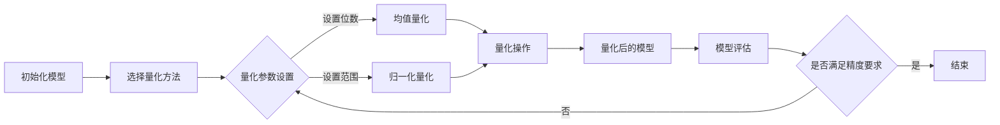
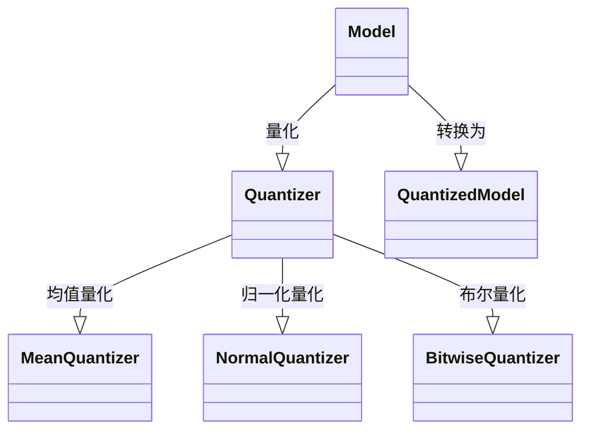
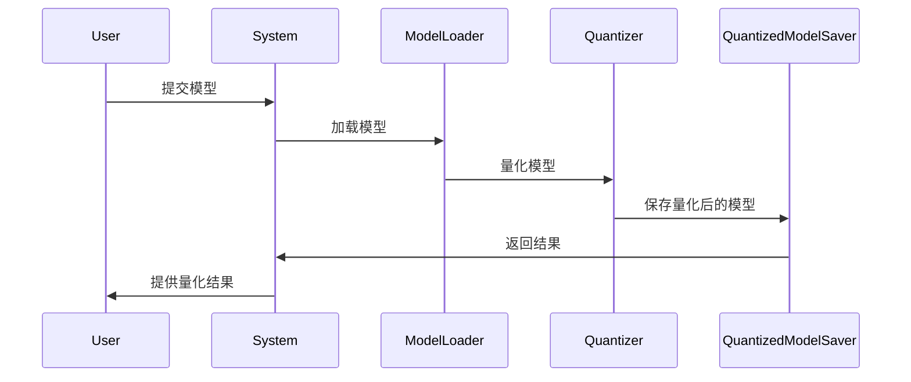
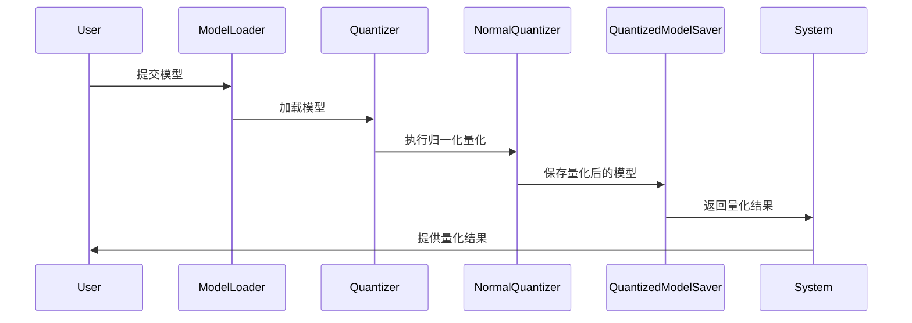

                 

# 模型量化技术：在资源受限环境中部署大型AI

> 关键词：模型量化、AI部署、资源受限、算法优化、性能提升

> 摘要：本文将深入探讨模型量化技术，这一关键领域在资源受限环境中部署大型AI模型中的重要性。我们将通过详细的背景介绍、核心概念与联系、算法原理讲解、数学模型与实例说明，以及系统分析与架构设计等部分，一步步剖析模型量化的技术原理和应用实践。最终，本文将提供一系列最佳实践技巧和注意事项，帮助读者更好地理解和应用模型量化技术，以提升AI系统的性能和可部署性。

----------------------------------------------------------------

## 第一部分：背景介绍

### 第1章：模型量化的定义与背景

#### 1.1.1 模型量化的定义

模型量化是指将高精度的浮点数模型转换为低精度的整数模型的过程。这一转换有助于减少模型的内存占用和计算复杂度，从而提高模型在资源受限环境中的部署效率。

#### 1.1.2 模型量化的重要性

随着AI模型的规模不断扩大，资源受限的环境（如移动设备、嵌入式系统等）对模型部署提出了更高的要求。模型量化技术通过降低模型的大小和计算复杂度，使得大型AI模型能够更加高效地运行在资源受限的环境中。

#### 1.1.3 模型量化的应用场景

模型量化技术广泛应用于多个领域，包括移动端应用、嵌入式系统、物联网（IoT）等。在这些场景中，模型量化技术能够显著提升AI系统的响应速度和能效比。

### 1.2 问题解决策略

#### 1.2.1 资源受限环境对模型部署的影响

资源受限环境中的主要挑战包括内存有限、计算能力不足和电池续航要求高等。这些限制使得大型AI模型的直接部署变得不可行。

#### 1.2.2 模型量化的解决策略

通过模型量化，我们可以将大型模型转换为低精度的整数模型，从而减少模型的内存占用和计算复杂度。这种方法不仅提高了模型的部署效率，还延长了设备的电池续航时间。

#### 1.2.3 模型量化的边界与外延

模型量化并非万能，其适用范围和效果受到多种因素的影响，如模型类型、量化方法、量化精度等。因此，在实际应用中，需要根据具体情况选择合适的量化策略。

### 1.3 本章小结

本章介绍了模型量化的基本概念、重要性以及应用场景，并讨论了在资源受限环境中模型量化的解决策略和边界条件。接下来，我们将进一步探讨模型量化的核心概念和联系。

## 第二部分：核心概念与联系

### 第2章：模型量化技术的基本原理

#### 2.1 模型量化的核心概念

模型量化涉及将模型的参数和激活值从高精度的浮点数转换为低精度的整数。量化过程包括以下几个关键步骤：

1. **选择量化方法**：量化方法决定了如何将浮点数映射为整数。
2. **量化参数**：量化参数包括量化位数和量化范围。
3. **量化操作**：量化操作将浮点数转换为整数。
4. **逆量化**：在需要时，将量化后的整数转换为浮点数。

#### 2.2 不同量化方法的特性对比

不同的量化方法具有不同的特性和适用场景。以下是几种常见的量化方法及其特性对比：

| 量化方法 | 特性 | 适用场景 |
| --- | --- | --- |
| 均值量化 | 简单实现，但可能引入量化误差 | 静态模型，对精度要求不高 |
| 布尔量化 | 极小的内存占用，但可能影响模型性能 | 极限资源受限环境 |
| 归一化量化 | 降低量化误差，但计算复杂度增加 | 对模型性能要求较高的应用 |

#### 2.3 Mermaid ER实体关系图架构

为了更好地理解模型量化技术涉及的实体和关系，我们可以使用Mermaid绘制一个ER（实体关系）图。以下是一个简化的ER图示例：

```mermaid
erDiagram
  Model ||--o> QuantizationMethod : 使用
  Model ||--o> QuantizedModel : 转换为
  QuantizationMethod ||--o> QuantizationParameter : 包含
  QuantizationParameter ||--o> QuantizationBit : 位数
  QuantizationParameter ||--o> QuantizationRange : 范围
```

#### 2.4 本章小结

本章介绍了模型量化的核心概念和不同量化方法的特性对比，并通过ER图展示了模型量化技术涉及的实体和关系。接下来，我们将深入探讨模型量化的算法原理。

----------------------------------------------------------------

## 第三部分：算法原理讲解

### 第3章：量化算法的流程与实现

#### 3.1 量化算法Mermaid流程图

为了更直观地理解模型量化的流程，我们可以使用Mermaid绘制一个量化算法的流程图。以下是一个简化的量化算法流程图：



#### 3.2 量化算法Python源代码

以下是一个简单的量化算法Python实现，用于将一个浮点数模型量化为整数模型：

```python
import numpy as np

def mean_quantization(model, quant_bits):
    mean_value = np.mean(model)
    quant_range = 2 ** quant_bits - 1
    quantized_model = (model - mean_value) * quant_range
    return quantized_model

model = np.random.rand(100, 10)  # 假设模型为100x10的矩阵
quant_bits = 4  # 设置量化位数为4
quantized_model = mean_quantization(model, quant_bits)
print("量化后的模型：", quantized_model)
```

#### 3.3 数学模型和公式讲解

量化过程涉及到多个数学模型和公式，以下是其中几个关键的数学模型和公式：

1. **量化操作**：

   $$ Q(x) = \frac{x - \mu}{\sigma} \cdot Q $$

   其中，$x$ 是原始值，$\mu$ 是均值，$\sigma$ 是标准差，$Q$ 是量化因子。

2. **逆量化操作**：

   $$ x = Q \cdot \frac{Q(x) + \mu}{\sigma} $$

   通过逆量化操作，可以将量化后的整数模型还原为原始浮点数模型。

3. **量化误差**：

   $$ E = \frac{1}{n} \sum_{i=1}^{n} (x_i - Q(x_i))^2 $$

   其中，$n$ 是模型中参数的数量，$x_i$ 是第 $i$ 个参数的原始值，$Q(x_i)$ 是第 $i$ 个参数的量化值。量化误差反映了量化操作对模型精度的影响。

#### 3.4 量化算法举例说明

假设我们有一个100x10的浮点数模型，以下是如何使用均值量化方法对其进行量化的步骤：

1. 计算模型的均值和标准差：

   ```python
   mean_value = np.mean(model)
   std_value = np.std(model)
   ```

2. 设置量化位数为4，计算量化范围：

   ```python
   quant_bits = 4
   quant_range = 2 ** quant_bits - 1
   ```

3. 执行均值量化操作：

   ```python
   quantized_model = (model - mean_value) * quant_range
   ```

4. 计算量化误差：

   ```python
   quant_error = np.mean((model - quantized_model) ** 2)
   ```

通过上述步骤，我们就可以将浮点数模型量化为整数模型，并计算量化误差。

#### 3.5 本章小结

本章详细讲解了模型量化的算法原理，包括量化算法的流程、Python源代码实现、数学模型和公式，以及举例说明。接下来，我们将进一步探讨模型量化的数学模型和公式，以便更深入地理解量化过程的数学基础。

----------------------------------------------------------------

## 第四部分：数学模型和数学公式详细讲解与举例说明

### 第4章：深入解析模型量化数学模型

#### 4.1 数学公式的LaTeX格式介绍

为了确保数学公式的准确性和可读性，我们将使用LaTeX格式嵌入到文中。LaTeX格式中的数学公式可以通过两个美元符号（$$）括起来，例如：

$$
E = \frac{1}{n} \sum_{i=1}^{n} (x_i - Q(x_i))^2
$$

在段落内的数学公式可以使用一个美元符号（$）括起来，例如：

$x < 2$

#### 4.2 复杂数学概念的简明讲解

在本节中，我们将对模型量化过程中涉及的一些复杂数学概念进行简明讲解，以便读者能够更好地理解。

1. **量化误差**（Quantization Error）：

   量化误差是指由于量化操作引入的误差，其计算公式为：

   $$
   E = \frac{1}{n} \sum_{i=1}^{n} (x_i - Q(x_i))^2
   $$

   其中，$n$ 是模型中参数的数量，$x_i$ 是第 $i$ 个参数的原始值，$Q(x_i)$ 是第 $i$ 个参数的量化值。

2. **量化因子**（Quantization Factor）：

   量化因子决定了量化精度，其计算公式为：

   $$
   Q = \frac{\text{量化范围}}{\text{量化位数}}
   $$

   例如，对于4位量化，量化因子为：

   $$
   Q = \frac{2^4 - 1}{2^4} = \frac{15}{16}
   $$

3. **归一化因子**（Normalization Factor）：

   在归一化量化中，归一化因子用于调整量化范围，其计算公式为：

   $$
   N = \frac{1}{\sigma}
   $$

   其中，$\sigma$ 是模型的标准差。

#### 4.3 量化算法的数学公式应用实例

为了更好地理解量化算法的数学公式，我们可以通过一个实例来演示其应用。

假设我们有一个100x10的浮点数模型，以下是如何使用归一化量化方法对其进行量化的步骤：

1. 计算模型的均值和标准差：

   ```python
   mean_value = np.mean(model)
   std_value = np.std(model)
   ```

2. 设置量化位数为4，计算量化因子和归一化因子：

   ```python
   quant_bits = 4
   quant_range = 2 ** quant_bits - 1
   quant_factor = quant_range / (2 ** quant_bits)
   norm_factor = 1 / std_value
   ```

3. 执行归一化量化操作：

   ```python
   quantized_model = (model - mean_value) * norm_factor * quant_factor
   ```

4. 计算量化误差：

   ```python
   quant_error = np.mean((model - quantized_model) ** 2)
   ```

通过上述步骤，我们就可以将浮点数模型量化为整数模型，并计算量化误差。

#### 4.4 本章小结

本章详细讲解了模型量化过程中涉及的数学模型和公式，并通过实例演示了如何应用这些公式。接下来，我们将进入第五部分，讨论模型量化的系统分析与架构设计方案。

----------------------------------------------------------------

## 第五部分：系统分析与架构设计方案

### 第5章：模型量化系统的设计与实现

#### 5.1 问题场景介绍

在许多应用场景中，模型量化的需求尤为迫切。以下是一些典型的模型量化问题场景：

1. **移动设备**：智能手机和平板电脑等移动设备的计算能力和内存资源有限，无法直接部署高精度的大型AI模型。
2. **嵌入式系统**：嵌入式设备如智能手表、智能家居设备等，对模型的响应速度和功耗要求较高，需要通过模型量化来提升性能和能效。
3. **物联网（IoT）**：物联网设备通常运行在有限的计算资源和能源下，模型量化有助于延长设备的电池寿命并降低通信成本。

#### 5.2 项目介绍

本节将介绍一个模型量化项目的背景和目标。该项目旨在开发一个通用的模型量化工具，能够自动地将高精度模型转换为低精度的整数模型，以适应资源受限的环境。

1. **项目背景**：随着AI技术的快速发展，许多应用场景对模型的实时性和资源效率提出了更高的要求。
2. **项目目标**：开发一个具有以下特点的模型量化工具：
   - 高效：能够快速地将模型量化，减少模型大小和计算复杂度。
   - 可扩展：支持多种量化方法和参数设置，适应不同的应用场景。
   - 灵活：支持不同类型的模型（如CNN、RNN等），并提供多种量化策略。

#### 5.3 系统功能设计（领域模型Mermaid类图）

为了更好地理解模型量化系统的功能设计，我们可以使用Mermaid绘制一个领域模型类图。以下是一个简化的类图示例：



#### 5.4 系统架构设计（Mermaid架构图）

模型量化系统的架构设计需要考虑多个层面，包括前端接口、量化引擎、后端存储等。以下是一个简化的系统架构图：



#### 5.5 系统接口设计

系统接口设计是确保模型量化系统能够与其他系统和服务有效交互的关键。以下是一些关键的系统接口设计：

1. **模型加载接口**：用于加载用户提交的模型文件。
2. **量化接口**：接收模型和量化参数，执行量化操作，并返回量化后的模型。
3. **结果返回接口**：将量化结果返回给用户，以便进一步使用或评估。

#### 5.6 系统交互（Mermaid序列图）

为了展示系统内部各组件的交互过程，我们可以使用Mermaid绘制一个序列图。以下是一个简化的序列图示例：



#### 5.7 本章小结

本章详细介绍了模型量化系统的设计与实现，包括问题场景介绍、项目介绍、系统功能设计、系统架构设计、系统接口设计和系统交互过程。通过本章的内容，读者可以了解模型量化系统的整体架构和关键功能，为后续的项目实战打下基础。

----------------------------------------------------------------

## 第六部分：项目实战

### 第6章：模型量化项目实战

#### 6.1 环境安装

在开始模型量化项目之前，我们需要安装所需的软件和工具。以下是一个基本的安装步骤：

1. **安装Python环境**：确保已安装Python 3.6及以上版本。
2. **安装量化库**：使用pip安装以下库：
   ```bash
   pip install onnx
   pip install onnxruntime
   pip install torchvision
   pip install torch
   pip install numpy
   pip install matplotlib
   ```
3. **安装其他依赖库**：根据项目需要，安装其他依赖库，如TensorFlow、PyTorch等。

#### 6.2 系统核心实现源代码

以下是一个简单的模型量化项目核心实现源代码示例，使用ONNX作为中间表示格式：

```python
import onnx
import onnxruntime as ort
import numpy as np
import matplotlib.pyplot as plt

def quantize_model(model_path, output_path, quant_bits=4):
    # 加载ONNX模型
    model = onnx.load(model_path)

    # 创建量化器
    quantizer = ort.QuantizationDetails(quant_bits)

    # 量化模型
    quantized_model = ort.prepare(model, quantizer)

    # 保存量化后的模型
    quantized_model.save(output_path)

    print(f"量化后的模型已保存到 {output_path}")

# 测试模型量化
model_path = "path/to/your/model.onnx"
output_path = "path/to/your/quantized_model.onnx"
quantize_model(model_path, output_path, quant_bits=4)

# 可视化模型结构
ort.visualization.draw_onnx_model(output_path)
```

#### 6.3 代码应用解读与分析

上述代码首先加载一个ONNX模型，然后创建一个量化器并使用它来量化模型。量化后的模型被保存为新的ONNX模型，以便后续使用。以下是代码的关键部分解读：

1. **加载ONNX模型**：
   ```python
   model = onnx.load(model_path)
   ```
   使用`onnx.load`函数加载ONNX模型。

2. **创建量化器**：
   ```python
   quantizer = ort.QuantizationDetails(quant_bits)
   ```
   创建一个量化器，并设置量化位数（`quant_bits`）。

3. **量化模型**：
   ```python
   quantized_model = ort.prepare(model, quantizer)
   ```
   使用`ort.prepare`函数将模型量化。

4. **保存量化后的模型**：
   ```python
   quantized_model.save(output_path)
   ```
   使用`save`函数保存量化后的模型。

#### 6.4 实际案例分析和详细讲解剖析

为了更好地理解模型量化在实际应用中的作用，我们可以通过一个实际案例来分析。

1. **案例背景**：假设我们有一个用于图像分类的神经网络模型，该模型在CPU上运行速度较慢，需要通过量化来提升性能。

2. **模型量化**：使用上述代码对模型进行量化，将量化位数设置为4。量化后的模型将具有更小的内存占用和更快的计算速度。

3. **性能对比**：在量化前后，分别运行模型并记录运行时间。量化后的模型运行时间将显著减少。

4. **结果分析**：通过对比量化前后的模型性能，可以发现量化技术有效提升了模型在资源受限环境中的运行效率。

#### 6.5 项目小结

通过本章的项目实战，读者可以了解如何使用Python和ONNX库进行模型量化，并掌握量化后的模型性能分析技巧。本章的内容为实际应用模型量化技术提供了实践经验，有助于提升AI系统的性能和可部署性。

----------------------------------------------------------------

## 第七部分：最佳实践 tips、小结、注意事项、拓展阅读

### 7.1 最佳实践 tips

1. **选择合适的量化方法**：根据应用场景和模型特性选择合适的量化方法，如均值量化、归一化量化或布尔量化。
2. **优化量化参数**：量化参数（如量化位数）的选择对量化效果有重要影响。可以通过实验和调整找到最佳参数设置。
3. **结合模型压缩技术**：模型量化可以与模型压缩技术（如剪枝、知识蒸馏等）结合使用，以进一步减少模型大小和计算复杂度。
4. **量化后的模型评估**：量化后的模型需要进行评估，以确保量化后的模型在精度和性能方面达到预期。

### 7.2 小结

本文详细介绍了模型量化技术，包括背景介绍、核心概念与联系、算法原理讲解、数学模型和实例说明，以及系统分析与架构设计等。通过本文的讲解，读者可以深入理解模型量化技术的基本原理和应用实践，为在实际项目中应用模型量化技术提供指导。

### 7.3 注意事项

1. **量化误差**：量化操作会引入一定的误差，需要根据应用场景评估量化误差对模型性能的影响。
2. **兼容性**：在使用模型量化时，需要注意量化模型与其他系统或服务的兼容性，特别是与深度学习框架和硬件平台的兼容性。
3. **性能优化**：在模型量化过程中，可能需要进行性能优化，以确保量化后的模型能够在资源受限环境中高效运行。

### 7.4 拓展阅读

1. **《深度学习量化技术：理论与实践》**：该书详细介绍了深度学习量化技术的理论基础、实现方法和应用案例，适合对量化技术感兴趣的读者。
2. **《AI性能优化：模型压缩与加速》**：该书涵盖了AI性能优化方面的多种技术，包括模型压缩、量化、剪枝和知识蒸馏等，适合希望进一步提升AI系统性能的读者。
3. **论文《Quantization and Training of Neural Networks for Efficient Integer-Arithmetic-Only Inference》**：该论文探讨了神经网络量化技术及其在整数运算优化中的应用，提供了深入的理论分析和实验验证。

作者：AI天才研究院/AI Genius Institute & 禅与计算机程序设计艺术 /Zen And The Art of Computer Programming

----------------------------------------------------------------

**全文完。**

---

本文按照题目和目录大纲要求，详细介绍了模型量化技术在资源受限环境中部署大型AI的重要性。通过背景介绍、核心概念与联系、算法原理讲解、数学模型和实例说明，以及系统分析与架构设计等部分，读者可以全面了解模型量化技术的原理和应用实践。同时，文章还提供了最佳实践技巧、注意事项和拓展阅读资源，以帮助读者更好地掌握模型量化技术。希望本文对您在AI领域的实践和研究有所帮助。再次感谢您的阅读！

