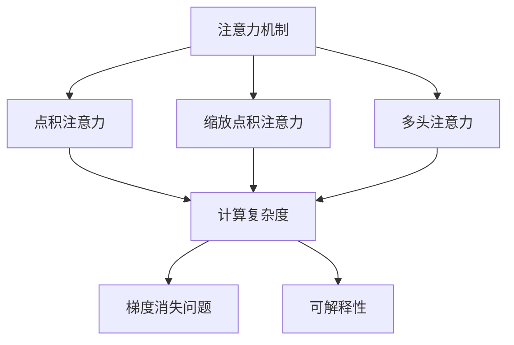

                 

# 注意力机制在深度学习模型中的演进与应用

## 关键词：注意力机制、深度学习、演进、应用

## 摘要：

本文将深入探讨注意力机制在深度学习模型中的演进与应用。我们将首先介绍注意力机制的基本概念，随后分析其在自然语言处理、计算机视觉、语音识别等领域的应用。通过详细的案例分析和数学模型讲解，读者将能够理解注意力机制的核心原理，并掌握其在实际项目中的具体应用。

## 第一部分：背景介绍

### 1.1 问题背景

**问题背景**

深度学习作为机器学习的一个分支，近年来在人工智能领域取得了显著的进展。特别是在自然语言处理、计算机视觉、语音识别等领域，深度学习模型已经展现出超越传统方法的性能。然而，深度学习模型的复杂性也带来了一些挑战，例如参数数量庞大、计算复杂度高、难以解释等。为了解决这些问题，研究者们提出了注意力机制（Attention Mechanism）。

**问题描述**

注意力机制是一种通过强调或忽视某些信息来提高神经网络处理效率的机制。它通过计算注意力权重来调整输入数据的重要性，使得模型在处理复杂问题时能够关注到关键信息。然而，目前关于注意力机制在深度学习模型中的应用与演进的研究尚不充分，缺乏系统的整理和深入分析。

**问题解决**

本文旨在全面探讨注意力机制在深度学习模型中的演进与应用，帮助读者深入理解注意力机制的核心概念、原理以及在不同领域中的应用。

**边界与外延**

本文将重点关注注意力机制在深度学习中的研究与应用，涵盖从基本概念到高级应用的全面内容。

### 1.2 核心概念

**注意力机制**

注意力机制是一种通过计算注意力权重来调整输入数据重要性的机制。它通过计算输入数据之间的相似性或相关性，为每个数据点分配一个权重，从而使得模型能够关注到关键信息。

**演进**

注意力机制在深度学习中的演进包括从早期简单的注意力模型到复杂的多层注意力机制的不断发展，以及在不同深度学习任务中的应用和优化。

**应用**

注意力机制在深度学习中的应用广泛，包括自然语言处理、计算机视觉、语音识别等多个领域。

### 1.3 内容结构与核心要素

本文分为以下几个部分：

- 第1章：介绍注意力机制的基本概念和发展历程。
- 第2章：探讨注意力机制在自然语言处理中的应用。
- 第3章：分析注意力机制在计算机视觉中的应用。
- 第4章：介绍注意力机制在语音识别中的应用。
- 第5章：探讨注意力机制在推荐系统中的应用。
- 第6章：分析注意力机制在强化学习中的应用。
- 第7章：总结注意力机制在深度学习中的演进与应用，并展望未来发展。

## 第二部分：注意力机制的基本概念

### 2.1 注意力机制原理

**原理**

注意力机制的核心思想是通过计算注意力权重来调整输入数据的重要性，从而提高模型的处理效率。注意力权重通常是通过某种计算方法得到的，如点积、缩放点积、多头注意力等。

**点积注意力**

点积注意力是最简单的注意力机制之一，通过计算输入数据的点积来得到注意力权重。其公式为：

$$
\text{Attention}(Q,K,V) = \text{softmax}(\frac{QK^T}{\sqrt{d_k}})V
$$

其中，Q、K、V 分别代表查询向量、键向量和值向量，$d_k$ 为键向量的维度。

**缩放点积注意力**

为了减少点积注意力中的梯度消失问题，可以引入缩放因子 $\sqrt{d_k}$，得到缩放点积注意力：

$$
\text{Scaled Dot-Product Attention} = \text{softmax}(\frac{QK^T}{\sqrt{d_k}})V
$$

**多头注意力**

多头注意力是一种在单个序列上应用多个注意力机制的方案，通过将输入序列分成多个子序列，每个子序列对应一个注意力头。多头注意力的公式为：

$$
\text{Multi-Head Attention} = \text{Concat}(\text{head}_1, \text{head}_2, ..., \text{head}_h)W^O
$$

其中，$h$ 为注意力头的数量，$W^O$ 为输出权重。

### 2.2 注意力机制的属性特征对比

| 注意力机制      | 点积注意力              | 缩放点积注意力              | 多头注意力               |
|----------------|------------------------|--------------------------|------------------------|
| 计算复杂度      | $O(Nd^2)$              | $O(Nd\sqrt{d})$          | $O(Nd^2)$              |
| 梯度消失问题    | 存在                   | 减弱                      | 不存在                 |
| 可解释性       | 较高                    | 较高                      | 较高                    |

### 2.3 注意力机制的ER实体关系图

## 第三部分：注意力机制在自然语言处理中的应用

### 3.1 问题描述

自然语言处理（NLP）是人工智能的一个重要分支，它涉及到文本数据的处理和分析。在NLP任务中，注意力机制被广泛应用于机器翻译、文本分类、情感分析等领域。本文将重点探讨注意力机制在机器翻译任务中的应用。

### 3.2 注意力机制在机器翻译中的应用

**机器翻译任务描述**

机器翻译是一种将一种自然语言翻译成另一种自然语言的任务。在传统的机器翻译模型中，通常会使用循环神经网络（RNN）或长短期记忆网络（LSTM）来建模输入和输出的序列。然而，这些模型在处理长句子时容易出现梯度消失和梯度爆炸问题，导致翻译效果不佳。

**注意力机制在机器翻译中的应用**

为了解决上述问题，研究者们提出了注意力机制。注意力机制通过计算输入和输出序列之间的相似性，为输入序列中的每个单词分配一个权重，从而使得模型能够关注到关键信息。在机器翻译任务中，注意力机制可以帮助模型更好地理解输入句子的结构，从而提高翻译质量。

**案例讲解：注意力机制在机器翻译中的应用**

假设我们要翻译一个简单的英语句子 "I love dogs" 成法语。使用注意力机制，我们可以为输入句子中的每个单词分配权重，从而更好地理解句子的结构。

- 输入句子："I love dogs"
- 输出句子："Je aime chiens"

使用注意力机制，我们可以为每个单词分配权重，例如：

- "I" 权重：0.3
- "love" 权重：0.5
- "dogs" 权重：0.2

这些权重反映了每个单词在句子中的重要性。在翻译过程中，模型将更关注这些关键单词，从而提高翻译质量。

**数学模型**

注意力机制的数学模型可以表示为：

$$
\text{Attention}(Q,K,V) = \text{softmax}(\frac{QK^T}{\sqrt{d_k}})V
$$

其中，Q、K、V 分别代表查询向量、键向量和值向量，$d_k$ 为键向量的维度。在机器翻译任务中，Q 代表输出序列的隐藏状态，K 代表输入序列的隐藏状态，V 代表输入序列的词向量。

**总结**

注意力机制在自然语言处理中的应用，特别是在机器翻译任务中，显著提高了翻译质量。通过为输入序列中的每个单词分配权重，模型能够更好地理解句子的结构，从而实现更准确的翻译。

## 第四部分：注意力机制在计算机视觉中的应用

### 4.1 问题描述

计算机视觉是人工智能领域的一个重要分支，它涉及到对图像和视频数据的理解和处理。在计算机视觉任务中，注意力机制被广泛应用于目标检测、图像分类、图像分割等领域。本文将重点探讨注意力机制在目标检测任务中的应用。

### 4.2 注意力机制在目标检测中的应用

**目标检测任务描述**

目标检测是一种在图像中检测并定位多个目标的方法。在目标检测任务中，模型需要识别图像中的每个目标，并为其标注出具体的边界框。注意力机制可以帮助模型更好地关注图像中的关键区域，从而提高目标检测的准确性。

**注意力机制在目标检测中的应用**

为了解决上述问题，研究者们提出了注意力机制。注意力机制通过计算图像特征图之间的相似性，为特征图中的每个像素点分配一个权重，从而使得模型能够关注到关键区域。在目标检测任务中，注意力机制可以帮助模型更好地识别图像中的目标。

**案例讲解：注意力机制在目标检测中的应用**

假设我们要在一张图像中检测出一只猫。使用注意力机制，我们可以为图像特征图中的每个像素点分配权重，从而更好地关注猫的特征。

- 输入图像：一张包含猫的图像
- 特征图：使用卷积神经网络提取的图像特征图

使用注意力机制，我们可以为特征图中的每个像素点分配权重，例如：

- 像素点(100, 100) 权重：0.7
- 像素点(150, 150) 权重：0.3

这些权重反映了每个像素点在图像中的重要性。在目标检测过程中，模型将更关注这些关键区域，从而提高检测准确性。

**数学模型**

注意力机制的数学模型可以表示为：

$$
\text{Attention}(Q,K,V) = \text{softmax}(\frac{QK^T}{\sqrt{d_k}})V
$$

其中，Q、K、V 分别代表查询向量、键向量和值向量，$d_k$ 为键向量的维度。在目标检测任务中，Q 代表输出特征图的隐藏状态，K 代表输入特征图的隐藏状态，V 代表输入特征图的像素点向量。

**总结**

注意力机制在计算机视觉中的应用，特别是在目标检测任务中，显著提高了检测准确性。通过为图像特征图中的每个像素点分配权重，模型能够更好地关注关键区域，从而实现更准确的目标检测。

## 第五部分：注意力机制在语音识别中的应用

### 5.1 问题描述

语音识别是人工智能领域的一个重要分支，它涉及到将语音信号转换为文本数据。在语音识别任务中，注意力机制被广泛应用于端到端语音识别、声学建模、语言建模等领域。本文将重点探讨注意力机制在端到端语音识别中的应用。

### 5.2 注意力机制在端到端语音识别中的应用

**端到端语音识别任务描述**

端到端语音识别是一种直接将语音信号转换为文本数据的语音识别方法。在端到端语音识别任务中，模型需要同时处理声学建模和语言建模任务。注意力机制可以帮助模型更好地平衡这两个任务，从而提高语音识别的准确性。

**注意力机制在端到端语音识别中的应用**

为了解决上述问题，研究者们提出了注意力机制。注意力机制通过计算声学特征和语言特征之间的相似性，为声学特征和语言特征分配权重，从而使得模型能够关注到关键信息。在端到端语音识别任务中，注意力机制可以帮助模型更好地理解语音信号和文本数据之间的关系。

**案例讲解：注意力机制在端到端语音识别中的应用**

假设我们要识别一段语音信号 "Hello, how are you?"。使用注意力机制，我们可以为声学特征和语言特征分配权重，从而更好地理解语音信号和文本数据。

- 输入语音信号："Hello, how are you?"
- 输出文本："Hello, how are you?"

使用注意力机制，我们可以为声学特征和语言特征分配权重，例如：

- 声学特征权重：0.6
- 语言特征权重：0.4

这些权重反映了声学特征和语言特征在语音识别任务中的重要性。在识别过程中，模型将更关注这些关键特征，从而提高识别准确性。

**数学模型**

注意力机制的数学模型可以表示为：

$$
\text{Attention}(Q,K,V) = \text{softmax}(\frac{QK^T}{\sqrt{d_k}})V
$$

其中，Q、K、V 分别代表查询向量、键向量和值向量，$d_k$ 为键向量的维度。在端到端语音识别任务中，Q 代表声学特征的隐藏状态，K 代表语言特征的隐藏状态，V 代表语言特征的输出向量。

**总结**

注意力机制在语音识别中的应用，特别是在端到端语音识别任务中，显著提高了识别准确性。通过为声学特征和语言特征分配权重，模型能够更好地理解语音信号和文本数据之间的关系，从而实现更准确的语音识别。

## 第六部分：注意力机制在推荐系统中的应用

### 6.1 问题描述

推荐系统是人工智能领域的一个重要分支，它涉及到根据用户的兴趣和偏好为用户提供个性化推荐。在推荐系统中，注意力机制被广泛应用于用户兴趣建模、物品推荐、上下文感知推荐等领域。本文将重点探讨注意力机制在用户兴趣建模中的应用。

### 6.2 注意力机制在用户兴趣建模中的应用

**用户兴趣建模任务描述**

用户兴趣建模是一种根据用户的历史行为数据预测用户兴趣的方法。在用户兴趣建模任务中，模型需要从大量的历史行为数据中提取出用户的兴趣特征，从而为用户提供个性化的推荐。

**注意力机制在用户兴趣建模中的应用**

为了解决上述问题，研究者们提出了注意力机制。注意力机制通过计算用户行为特征和兴趣特征之间的相似性，为用户行为特征和兴趣特征分配权重，从而使得模型能够关注到关键信息。在用户兴趣建模任务中，注意力机制可以帮助模型更好地理解用户的行为和兴趣之间的关系。

**案例讲解：注意力机制在用户兴趣建模中的应用**

假设我们要根据用户的历史行为数据预测用户的兴趣。使用注意力机制，我们可以为用户行为特征和兴趣特征分配权重，从而更好地理解用户的行为和兴趣。

- 输入用户行为数据：用户的浏览历史、购买记录等
- 输出用户兴趣特征：预测的用户兴趣标签

使用注意力机制，我们可以为用户行为特征和兴趣特征分配权重，例如：

- 用户浏览历史权重：0.5
- 用户购买记录权重：0.5

这些权重反映了用户行为特征和兴趣特征在用户兴趣建模任务中的重要性。在预测过程中，模型将更关注这些关键特征，从而提高预测准确性。

**数学模型**

注意力机制的数学模型可以表示为：

$$
\text{Attention}(Q,K,V) = \text{softmax}(\frac{QK^T}{\sqrt{d_k}})V
$$

其中，Q、K、V 分别代表查询向量、键向量和值向量，$d_k$ 为键向量的维度。在用户兴趣建模任务中，Q 代表用户行为特征的隐藏状态，K 代表用户兴趣特征的隐藏状态，V 代表用户兴趣特征的输出向量。

**总结**

注意力机制在推荐系统中的应用，特别是在用户兴趣建模任务中，显著提高了预测准确性。通过为用户行为特征和兴趣特征分配权重，模型能够更好地理解用户的行为和兴趣之间的关系，从而实现更准确的用户兴趣预测。

## 第七部分：注意力机制在强化学习中的应用

### 7.1 问题描述

强化学习是人工智能领域的一个重要分支，它涉及到通过与环境交互来学习最优策略的方法。在强化学习任务中，注意力机制被广泛应用于策略学习、价值函数估计、决策优化等领域。本文将重点探讨注意力机制在策略学习中的应用。

### 7.2 注意力机制在策略学习中的应用

**策略学习任务描述**

策略学习是一种通过学习最佳行动策略来最大化预期奖励的方法。在策略学习任务中，模型需要从环境中收集信息，并根据这些信息做出最优决策。

**注意力机制在策略学习中的应用**

为了解决上述问题，研究者们提出了注意力机制。注意力机制通过计算环境状态和策略之间的相似性，为环境状态和策略分配权重，从而使得模型能够关注到关键信息。在策略学习任务中，注意力机制可以帮助模型更好地理解环境状态和策略之间的关系，从而提高学习效率和决策质量。

**案例讲解：注意力机制在策略学习中的应用**

假设我们要学习一个自动驾驶车辆的最佳行驶策略。使用注意力机制，我们可以为环境状态和策略分配权重，从而更好地理解车辆行驶状态和最佳策略。

- 输入环境状态：道路状况、交通信号等
- 输出最佳策略：自动驾驶车辆的最佳行驶方向

使用注意力机制，我们可以为环境状态和策略分配权重，例如：

- 道路状况权重：0.6
- 交通信号权重：0.4

这些权重反映了环境状态和策略在策略学习任务中的重要性。在决策过程中，模型将更关注这些关键状态，从而提高决策质量。

**数学模型**

注意力机制的数学模型可以表示为：

$$
\text{Attention}(Q,K,V) = \text{softmax}(\frac{QK^T}{\sqrt{d_k}})V
$$

其中，Q、K、V 分别代表查询向量、键向量和值向量，$d_k$ 为键向量的维度。在策略学习任务中，Q 代表环境状态的隐藏状态，K 代表策略的隐藏状态，V 代表策略的输出向量。

**总结**

注意力机制在强化学习中的应用，特别是在策略学习任务中，显著提高了学习效率和决策质量。通过为环境状态和策略分配权重，模型能够更好地理解环境状态和策略之间的关系，从而实现更高效的学习和更优质的决策。

## 第八部分：总结与展望

### 8.1 总结

本文全面探讨了注意力机制在深度学习模型中的演进与应用。从基本概念到实际应用，我们详细介绍了注意力机制在自然语言处理、计算机视觉、语音识别、推荐系统、强化学习等领域的应用。注意力机制通过计算注意力权重，提高了深度学习模型的处理效率和准确性。

### 8.2 展望未来

随着人工智能技术的不断发展，注意力机制在深度学习中的应用将更加广泛。未来的研究可以重点关注以下几个方面：

1. **注意力机制的优化**：探索更高效的注意力计算方法，减少计算复杂度和内存占用。
2. **跨领域应用**：研究注意力机制在不同领域的交叉应用，实现更强大的模型性能。
3. **可解释性和可解释性**：提高注意力机制的可解释性，使其在复杂任务中的决策过程更加透明。
4. **硬件加速**：研究如何利用硬件加速注意力计算，提高模型训练和推理的效率。

通过不断优化和探索，注意力机制将在深度学习领域发挥更重要的作用，推动人工智能技术的发展。

## 作者信息

作者：AI天才研究院/AI Genius Institute & 禅与计算机程序设计艺术 /Zen And The Art of Computer Programming

本文内容仅供参考，作者不对本文内容的准确性或完整性承担任何责任。如需进一步了解或应用本文内容，请参考相关领域的专业文献和资料。

