                 

## 文章标题

### 深度学习中的计算效率优化策略

#### 关键词：深度学习，计算效率，优化策略，神经网络，算法优化，硬件加速

> 摘要：本文深入探讨了深度学习中的计算效率优化策略。通过系统性地介绍深度学习的基本理论、数据预处理、算法层面优化、硬件优化以及编译器与工具链优化，本文提出了多种实际可行的优化方法。同时，通过具体案例研究，展示了这些优化策略在实践中的应用效果。本文旨在为研究人员和工程师提供全面、深入的指导，助力他们在深度学习项目中实现高效的计算效率。

## 引言

随着深度学习技术的飞速发展，越来越多的应用领域开始依赖于深度学习算法来实现复杂的任务。然而，深度学习模型的训练和推断过程中所需的计算资源往往非常庞大，导致计算效率成为了一个亟待解决的问题。计算效率不仅关系到模型的训练速度，也影响着实际应用中的运行成本。因此，研究深度学习中的计算效率优化策略具有重要的现实意义。

计算效率优化策略涵盖了从数据预处理到算法实现，从硬件架构到工具链优化等多个层面。本文将依次探讨这些层面的优化方法，并重点介绍以下内容：

1. **深度学习的基础理论**：介绍深度学习的基本概念和主要算法，为后续讨论计算效率优化策略奠定理论基础。
2. **数据预处理与优化**：详细阐述数据预处理的过程和优化策略，包括数据集准备、数据增强、数据预处理算法优化等。
3. **算法层面的优化**：探讨算法选择、算法并行化策略以及算法加速技术等，介绍如何从算法层面提高计算效率。
4. **计算硬件优化**：分析硬件加速技术、GPU优化以及FPGA和ASICs的应用，介绍如何通过硬件层面提升计算效率。
5. **编译器与工具链优化**：探讨编译器优化技术、优化器选择与调参、代码优化与调试等，介绍如何通过工具链优化提升计算效率。
6. **案例研究**：通过具体案例研究，展示计算效率优化策略在实际项目中的应用效果。
7. **总结与展望**：总结本文的核心内容，并对深度学习计算效率优化策略的未来研究方向进行展望。

本文将采用逻辑清晰、结构紧凑、简单易懂的专业技术语言，结合实例分析和数据对比，逐步深入探讨深度学习中的计算效率优化策略。希望通过本文的讨论，能够为深度学习领域的科研人员和工程实践者提供有价值的参考和指导。

### 深度学习的基础理论

深度学习作为一种基于人工神经网络的机器学习技术，通过对大量数据的训练，使计算机能够从数据中自动提取特征并实现复杂的任务。深度学习的基础理论包括神经网络的基本结构、主要算法以及网络结构优化等。

#### 神经网络的基本结构

神经网络由多个层级组成，包括输入层、隐藏层和输出层。每个层级包含多个神经元，神经元之间通过权重相连，并经过激活函数的处理。神经网络的输入经过层层传递和变换，最终在输出层产生结果。


- **输入层**：接收外部输入信息。
- **隐藏层**：对输入信息进行加工和处理，提取特征。
- **输出层**：输出处理结果，实现预测或分类任务。

#### 主要算法

深度学习的主要算法包括卷积神经网络（CNN）、循环神经网络（RNN）和生成对抗网络（GAN）等。

1. **卷积神经网络（CNN）**：适用于图像处理、语音识别等任务。CNN通过卷积操作提取图像特征，具有平移不变性，能够有效地减少参数数量。
   
   

2. **循环神经网络（RNN）**：适用于序列数据，如时间序列分析、语言建模等。RNN通过循环结构保留序列信息，但容易陷入梯度消失或爆炸问题。

   

3. **生成对抗网络（GAN）**：用于生成数据，如图像生成、文本生成等。GAN由生成器和判别器组成，通过对抗训练实现数据的生成。

   

#### 网络结构优化

为了提高计算效率和模型性能，需要对神经网络结构进行优化。

1. **残差网络（ResNet）**：通过引入残差连接，解决了深层网络中的梯度消失问题，显著提高了模型性能。

   

2. **网络剪枝技术**：通过剪枝冗余连接或神经元，减少模型参数数量，提高计算效率。

   

3. **深度可分离卷积**：通过将卷积操作拆分为深度卷积和逐点卷积，减少计算量。

   

#### 概念属性特征对比表格

| 特征             | CNN         | RNN        | GAN         | ResNet      |
|------------------|-------------|------------|-------------|-------------|
| 应用领域         | 图像处理     | 序列数据    | 数据生成    | 深层网络    |
| 结构特点         | 卷积操作     | 循环连接    | 对抗训练    | 残差连接    |
| 计算效率         | 高效         | 中等       | 低效        | 高效        |
| 参数数量         | 少量        | 较多       | 较多       | 相对较少    |
| 优化策略         | 卷积剪枝     | LSTM单元   | GAN损失函数 | 残差连接    |

#### ER实体关系图架构

以下是一个简化的ER实体关系图，展示了深度学习模型中的主要实体及其关系：

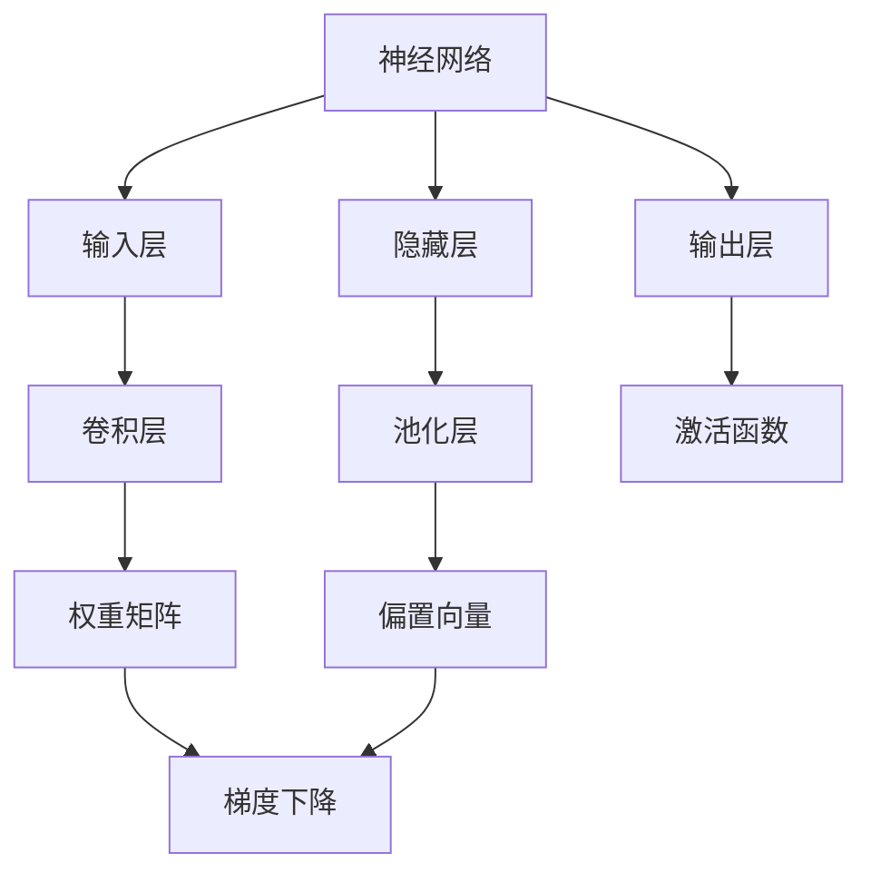

#### 算法原理讲解

以卷积神经网络（CNN）为例，下面将详细介绍其算法原理。

##### CNN算法原理

CNN的核心是卷积操作，通过卷积核在输入图像上滑动，提取局部特征。卷积操作的数学公式如下：

$$
\text{output}_{ij} = \sum_{k=1}^{C} w_{ik,jc} \cdot \text{input}_{ij} + b_{j}
$$

其中，$\text{output}_{ij}$ 是第 $i$ 层第 $j$ 个神经元输出，$w_{ik,jc}$ 是卷积核权重，$\text{input}_{ij}$ 是输入特征图，$b_{j}$ 是偏置。

##### 算法流程

1. **输入层**：接收外部输入，例如图像。
2. **卷积层**：通过卷积操作提取图像特征，降低数据维度。
3. **激活函数**：引入非线性变换，提高模型表达能力。
4. **池化层**：通过下采样操作减少数据冗余，提高计算效率。
5. **全连接层**：将卷积层的特征映射到输出结果。

##### 算法流程图

以下是一个简化的CNN算法流程图：

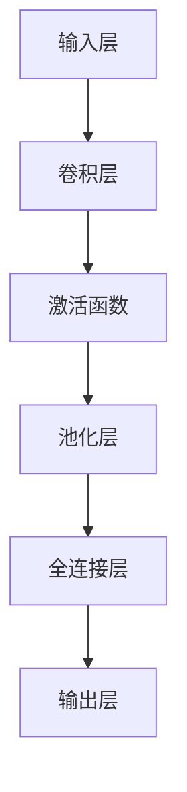

##### Python源代码示例

下面是一个简单的CNN算法实现：

```python
import numpy as np

def convolution(input_data, weights, bias):
    output = np.dot(input_data, weights) + bias
    return output

# 示例数据
input_data = np.random.rand(28, 28)  # 28x28的输入图像
weights = np.random.rand(5, 5)       # 5x5的卷积核
bias = np.random.rand(1)             # 偏置

# 卷积操作
output = convolution(input_data, weights, bias)
print(output)
```

通过以上介绍，我们了解了深度学习中的基本理论，包括神经网络结构、主要算法以及网络结构优化。这些基础理论为后续的优化策略提供了必要的理论支持。

### 数据预处理与优化

在深度学习项目中，数据预处理是一个至关重要的步骤，它直接影响模型训练的质量和计算效率。数据预处理包括数据集准备、数据增强和数据预处理算法优化等。以下将详细探讨这些方面的内容。

#### 数据集准备

数据集准备是深度学习项目的基础工作。一个高质量的数据集不仅要求数据量足够大，还要保证数据的多样性和平衡性。以下是一些数据集准备的关键步骤：

1. **数据收集**：从各种来源收集数据，如公共数据集、专业数据库或定制采集。
2. **数据清洗**：去除数据集中的噪声和错误，确保数据的一致性和准确性。
3. **数据标注**：对数据进行分类、标签分配等标注工作，为模型训练提供指导。
4. **数据分割**：将数据集分为训练集、验证集和测试集，以评估模型性能。

#### 数据增强

数据增强是通过人工手段增加数据多样性，从而提高模型泛化能力。常见的数据增强方法包括：

1. **图像增强**：旋转、翻转、缩放、裁剪等，使图像更加多样化。
2. **文本增强**：同义词替换、文本扰动、插入删除等，使文本数据更加丰富。
3. **声音增强**：增加噪音、速度变化、音调变化等，使声音数据更加真实。

数据增强可以显著提高模型的鲁棒性和性能。例如，在图像识别任务中，通过旋转和翻转增强，可以减少模型对特定角度的依赖，从而提高模型的泛化能力。

#### 数据预处理算法优化

数据预处理算法优化主要关注如何提高预处理过程的速度和效率。以下是一些优化方法：

1. **并行预处理**：利用多线程或分布式计算技术，并行处理大量数据，提高处理速度。
2. **高效数据读取**：使用内存映射、缓存等技术，加快数据读取速度。
3. **批处理优化**：通过合理设置批处理大小，减少内存占用和计算时间。
4. **预处理算法选择**：选择适合数据特点和任务需求的预处理算法，如归一化、标准化等。

#### 概念属性特征对比表格

| 方法       | 描述                                                     | 优点                          | 缺点                         |
|------------|----------------------------------------------------------|------------------------------|------------------------------|
| 数据清洗   | 去除噪声和错误数据                                     | 保证数据质量                 | 需要大量人力和时间           |
| 数据增强   | 增加数据多样性，提高模型泛化能力                         | 提高模型性能                 | 可能增加计算量               |
| 并行预处理 | 利用多线程或分布式计算技术，并行处理大量数据             | 提高处理速度                 | 可能增加复杂度               |
| 高效数据读取 | 使用内存映射、缓存等技术，加快数据读取速度               | 提高数据读取速度             | 需要特定硬件支持             |
| 批处理优化 | 通过合理设置批处理大小，减少内存占用和计算时间           | 提高计算效率                 | 需要实验调整批处理大小       |

#### ER实体关系图架构

以下是一个简化的ER实体关系图，展示了数据预处理过程中的主要实体及其关系：

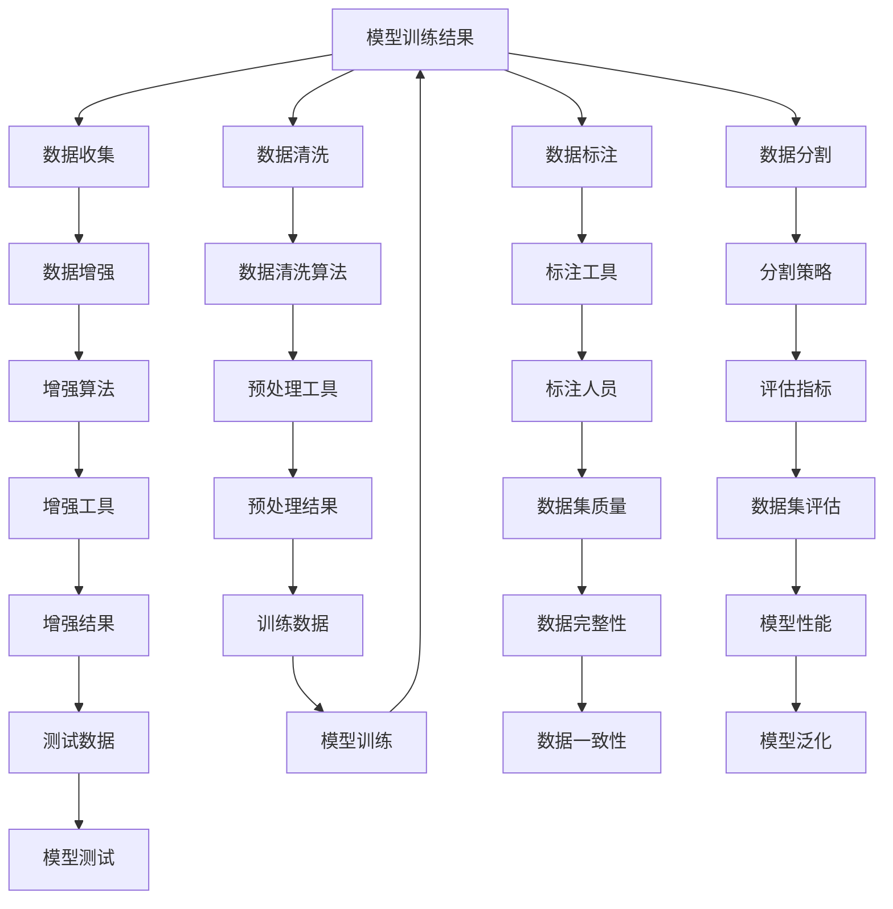

#### 算法原理讲解

以图像数据清洗为例，下面将详细介绍其算法原理。

##### 图像数据清洗算法原理

图像数据清洗的主要任务包括去除噪声、纠正错误和修复缺失。常见的数据清洗算法有滤波、填补和分割等。

1. **滤波**：通过滤波器去除图像中的噪声点。常用的滤波算法有中值滤波、高斯滤波和双边滤波等。

   $$ 
   \text{output}_{ij} = \sum_{k=1}^{N} w_{ik,jc} \cdot \text{input}_{ij} + b_{j}
   $$

   其中，$\text{output}_{ij}$ 是滤波后的像素值，$w_{ik,jc}$ 是滤波器的权重，$\text{input}_{ij}$ 是原始像素值，$b_{j}$ 是偏置。

2. **填补**：通过插值算法填补图像中的缺失像素。常用的插值算法有最近邻插值、双线性插值和双三次插值等。

   $$ 
   \text{output}_{ij} = \text{interpolate}(\text{input}_{i-j})
   $$

3. **分割**：通过阈值分割或边缘检测等算法将图像划分为不同的区域。常用的分割算法有Otsu分割、Canny边缘检测等。

   $$ 
   \text{segmentation}_{ij} = \text{threshold}(\text{input}_{ij})
   $$

##### 算法流程

1. **滤波**：对图像进行滤波处理，去除噪声。
2. **填补**：对图像中的缺失像素进行填补。
3. **分割**：对滤波后的图像进行分割，提取感兴趣的区域。

##### 算法流程图

以下是一个简化的图像数据清洗算法流程图：

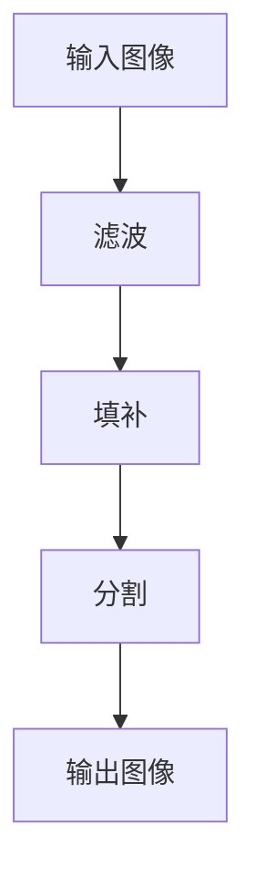

##### Python源代码示例

下面是一个简单的图像数据清洗算法实现：

```python
import numpy as np
import cv2

def filter_image(image, filter_type='gaussian'):
    if filter_type == 'gaussian':
        kernel = np.array([[1, 2, 1], [2, 4, 2], [1, 2, 1]]) / 16
    elif filter_type == 'median':
        kernel = np.array([[1, 1, 1], [1, 1, 1], [1, 1, 1]]) / 3
    elif filter_type == 'bilateral':
        kernel = cv2.getGaussianKernel(3, 1)
    else:
        raise ValueError("Unsupported filter type")

    filtered_image = cv2.filter2D(image, -1, kernel)
    return filtered_image

# 示例数据
image = cv2.imread('example.jpg', cv2.IMREAD_GRAYSCALE)

# 滤波处理
filtered_image = filter_image(image, filter_type='gaussian')
cv2.imshow('Filtered Image', filtered_image)
cv2.waitKey(0)
cv2.destroyAllWindows()
```

通过以上介绍，我们了解了数据预处理与优化的重要性以及具体方法。数据预处理不仅能够提高模型训练质量，还能有效提升计算效率，为深度学习项目成功奠定基础。

### 算法层面的优化

在深度学习项目中，算法层面的优化是提高计算效率的重要手段。算法层面的优化包括算法选择、算法并行化策略以及算法加速技术。以下将详细探讨这些方面的内容。

#### 算法选择

选择合适的算法对于提高计算效率和模型性能至关重要。以下是一些常见的深度学习算法及其特点：

1. **卷积神经网络（CNN）**：适用于图像处理任务，通过卷积操作提取特征，具有计算效率高、参数较少等优点。
2. **循环神经网络（RNN）**：适用于序列数据处理任务，通过循环结构保留序列信息，但在长序列处理中容易陷入梯度消失问题。
3. **长短期记忆网络（LSTM）**：是RNN的一种改进，通过门控机制解决了梯度消失问题，适用于长序列数据处理。
4. **生成对抗网络（GAN）**：适用于数据生成任务，通过生成器和判别器的对抗训练，实现高质量数据的生成。

不同算法在计算效率方面存在差异，需要根据具体任务选择合适的算法。例如，在图像识别任务中，通常选择CNN；在序列数据处理任务中，可以选择RNN或LSTM；在数据生成任务中，可以选择GAN。

#### 算法并行化策略

算法并行化策略是将算法拆分为多个可并行执行的任务，从而提高计算效率。以下是一些常见的并行化策略：

1. **数据并行**：将数据集分为多个子集，每个子集由不同的计算节点处理，最终合并结果。适用于数据依赖较弱的算法，如CNN。
2. **模型并行**：将神经网络拆分为多个子网络，每个子网络处理不同的部分，最终合并结果。适用于深度较深的神经网络，如ResNet。
3. **任务并行**：将不同的任务分配到不同的计算节点上同时执行，适用于多任务学习场景。

并行化策略的选择需要考虑数据传输开销、计算负载均衡以及模型性能等因素。以下是一个简化的并行化策略流程图：

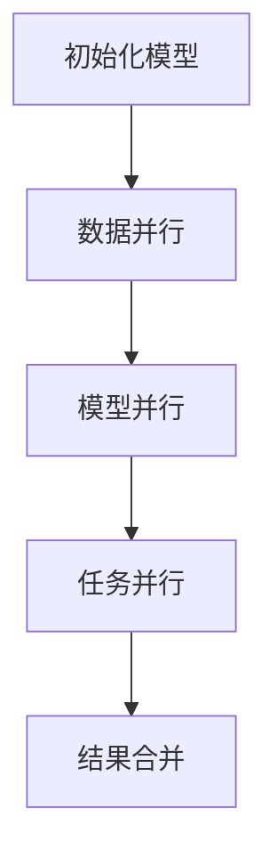

#### 算法加速技术

算法加速技术是通过优化算法实现，提高计算速度和效率。以下是一些常见的算法加速技术：

1. **矩阵运算优化**：通过矩阵分解、向量运算等优化，减少计算量。例如，使用矩阵乘法替代矩阵加法，提高运算速度。
2. **向量指令集**：使用向量指令集（如SIMD）进行并行计算，提高处理速度。例如，使用NVIDIA的CUDA指令集进行GPU加速。
3. **内存管理优化**：通过内存映射、缓存等技术，优化内存访问速度。例如，使用GPU内存分配和复制技术，提高数据传输速度。

以下是一个简化的算法加速技术流程图：

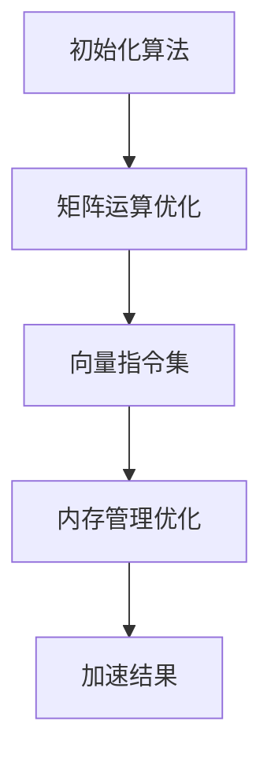

#### 概念属性特征对比表格

| 方法           | 描述                                                     | 优点                          | 缺点                         |
|----------------|----------------------------------------------------------|------------------------------|------------------------------|
| 算法选择       | 根据任务选择合适的算法                                   | 提高模型性能                 | 需要深入理解各种算法         |
| 数据并行       | 将数据集分为多个子集，并行处理                          | 提高计算效率                 | 需要考虑数据传输开销         |
| 模型并行       | 将神经网络拆分为多个子网络，并行处理                   | 提高计算效率                 | 需要深度理解模型结构         |
| 任务并行       | 将不同的任务分配到不同的计算节点上同时执行               | 提高计算效率                 | 需要考虑任务分配和调度问题   |
| 矩阵运算优化   | 通过矩阵分解、向量运算等优化，减少计算量                 | 提高运算速度                 | 需要优化算法实现             |
| 向量指令集     | 使用向量指令集进行并行计算                              | 提高处理速度                 | 需要特定硬件支持             |
| 内存管理优化   | 通过内存映射、缓存等技术，优化内存访问速度               | 提高数据传输速度             | 需要优化内存管理策略         |

#### ER实体关系图架构

以下是一个简化的ER实体关系图，展示了算法层面的主要实体及其关系：

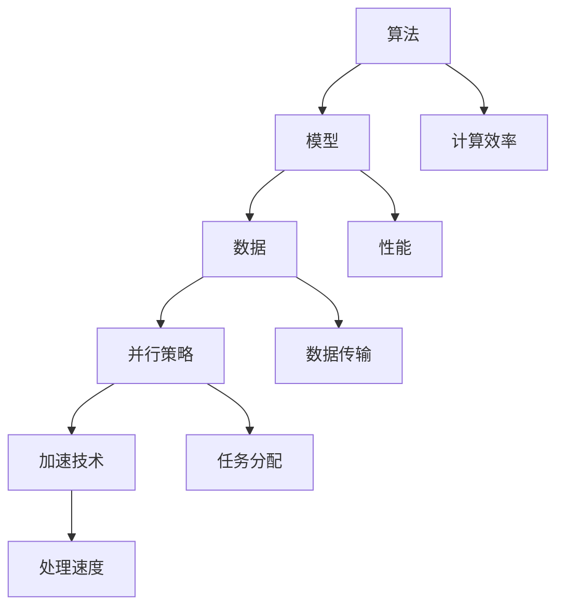

#### 算法原理讲解

以矩阵运算优化为例，下面将详细介绍其算法原理。

##### 矩阵运算优化算法原理

矩阵运算优化是通过减少计算量、优化计算顺序和提高数据访问效率来提高矩阵运算的速度。以下是一个简化的矩阵运算优化流程：

1. **矩阵分解**：将矩阵分解为多个较小的矩阵，减少计算量。
2. **向量运算**：使用向量指令集进行并行计算，提高运算速度。
3. **内存管理优化**：通过优化内存访问策略，减少内存访问时间。

##### 算法流程

1. **输入矩阵**：接收输入矩阵。
2. **矩阵分解**：将输入矩阵分解为多个较小的矩阵。
3. **向量运算**：使用向量指令集对分解后的矩阵进行并行计算。
4. **内存管理优化**：优化内存访问策略，减少内存访问时间。
5. **输出结果**：输出计算结果。

##### 算法流程图

以下是一个简化的矩阵运算优化流程图：

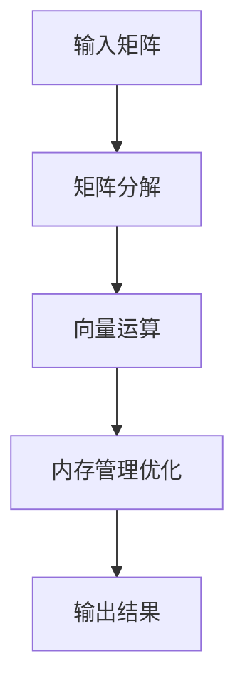

##### Python源代码示例

下面是一个简单的矩阵运算优化实现：

```python
import numpy as np

def matrix_optimization(A):
    # 矩阵分解
    B = np.linalg.qr(A)

    # 向量运算
    C = np.dot(B, B.T)

    # 内存管理优化
    C = np.ascontiguousarray(C)

    return C

# 示例数据
A = np.random.rand(1000, 1000)

# 矩阵运算优化
C = matrix_optimization(A)
print(C)
```

通过以上介绍，我们了解了算法层面的优化方法，包括算法选择、算法并行化策略以及算法加速技术。这些优化方法能够显著提高计算效率和模型性能，为深度学习项目的成功实施提供有力支持。

### 计算硬件优化

在深度学习项目中，计算硬件的优化是提高计算效率和性能的关键环节。随着深度学习模型的复杂度和数据量的增加，传统的CPU计算已经无法满足要求，因此，硬件加速技术如GPU、FPGA和ASICs应运而生。以下将详细探讨这些硬件加速技术的原理和应用。

#### GPU优化

GPU（图形处理器）具有高度并行计算能力，使其成为深度学习领域的首选硬件加速器。GPU优化主要涉及以下几个方面：

1. **CUDA编程**：CUDA是NVIDIA开发的并行计算平台和编程语言，通过CUDA编程可以将深度学习算法高效地映射到GPU上。以下是一个简单的CUDA编程示例：

   ```python
   import numpy as np
   from numba import cuda

   @cuda.jit
   def matrix_multiply(A, B, C):
       # 矩阵乘法计算
       for i in range(C.shape[0]):
           for j in range(C.shape[1]):
               for k in range(C.shape[2]):
                   C[i, j] += A[i, k] * B[k, j]

   # 示例数据
   A = np.random.rand(1000, 1000)
   B = np.random.rand(1000, 1000)
   C = np.zeros((1000, 1000))

   # GPU矩阵乘法
   matrix_multiply[512, 512](A, B, C)
   ```

2. **GPU内存管理**：合理管理GPU内存，减少数据传输开销。例如，使用内存复制和映射技术优化数据传输速度。

3. **并行计算优化**：通过调整线程块大小、内存访问模式等参数，优化GPU并行计算性能。

#### FPGA优化

FPGA（现场可编程门阵列）是一种可重配置的逻辑硬件，具有高度并行计算能力和低延迟特性。FPGA优化主要涉及以下几个方面：

1. **硬件描述语言（HDL）编程**：使用硬件描述语言（如VHDL或Verilog）设计深度学习算法的硬件实现。以下是一个简单的FPGA编程示例：

   ```verilog
   module neural_network(
       input [9:0] clk,
       input [9:0] reset,
       input [9:0] start,
       input [9:0] data_in,
       output [9:0] data_out
   );
       // 神经网络硬件实现
   endmodule
   ```

2. **资源优化**：通过资源复用和重构，优化FPGA资源利用率，提高计算效率。

3. **时钟频率优化**：通过调整时钟频率，提高硬件运行速度。

#### ASICs优化

ASICs（专用集成电路）是一种为特定应用设计的定制硬件，具有高性能和低功耗特性。ASICs优化主要涉及以下几个方面：

1. **硬件架构设计**：根据深度学习算法的特点，设计高效的硬件架构。例如，使用流水线结构提高数据处理速度。

2. **功耗优化**：通过功耗分析，优化硬件设计，降低功耗。

3. **硅片优化**：在制造过程中，通过硅片优化，提高ASICs的性能和可靠性。

#### 概念属性特征对比表格

| 硬件加速技术 | 描述                                                     | 优点                          | 缺点                         |
|--------------|----------------------------------------------------------|------------------------------|------------------------------|
| GPU优化      | 利用NVIDIA GPU进行并行计算                               | 高性能、易用                 | 需要特定硬件支持             |
| FPGA优化     | 利用FPGA进行硬件加速                                     | 高性能、低延迟               | 需要HDL编程、资源优化        |
| ASICs优化    | 设计定制硬件进行深度学习加速                             | 高性能、低功耗               | 设计复杂、开发周期长         |

#### ER实体关系图架构

以下是一个简化的ER实体关系图，展示了计算硬件优化的主要实体及其关系：

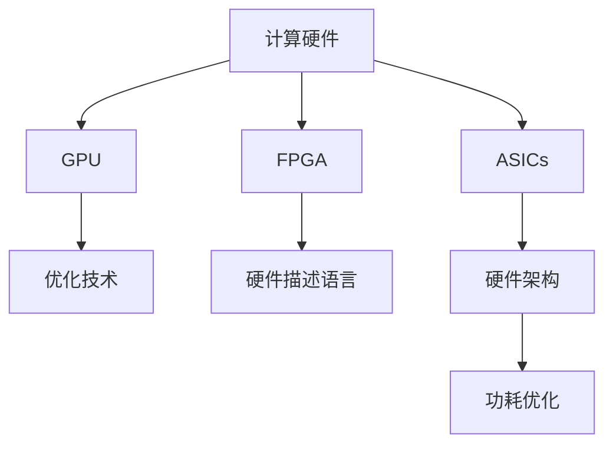

#### 算法原理讲解

以GPU优化为例，下面将详细介绍其算法原理。

##### GPU优化算法原理

GPU优化主要通过以下几个方面提高计算效率：

1. **并行计算**：利用GPU的并行计算能力，将深度学习算法拆分为多个并行任务，在多个CUDA核心上同时执行。
2. **内存管理**：优化GPU内存访问模式，减少数据传输开销，提高计算效率。
3. **流水线优化**：通过调整流水线参数，减少数据依赖，提高计算吞吐量。

##### 算法流程

1. **输入数据**：将输入数据加载到GPU内存。
2. **并行计算**：在GPU核心上执行并行任务，计算数据。
3. **内存管理**：优化内存访问模式，减少数据传输时间。
4. **结果输出**：将计算结果从GPU内存复制回CPU内存。

##### 算法流程图

以下是一个简化的GPU优化算法流程图：

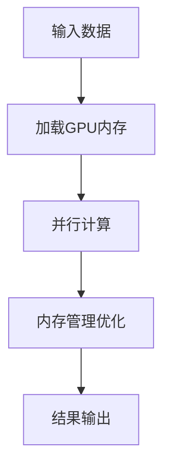

##### Python源代码示例

以下是一个简单的GPU优化实现：

```python
import numpy as np
import cupy as cp

# 示例数据
A = np.random.rand(1000, 1000)
B = np.random.rand(1000, 1000)

# GPU矩阵乘法
C = cp.dot(A, B)
print(C.get())
```

通过以上介绍，我们了解了计算硬件优化的重要性以及具体方法。硬件加速技术如GPU、FPGA和ASICs能够显著提高深度学习项目的计算效率和性能，为人工智能应用的发展提供强大支持。

### 编译器与工具链优化

在深度学习项目中，编译器和工具链的优化对于提高计算效率和模型性能具有至关重要的作用。编译器优化、优化器选择与调参、代码优化与调试等都是提高计算效率的关键环节。以下将详细探讨这些方面的内容。

#### 编译器优化技术

编译器优化技术通过优化编译过程中的代码生成和优化策略，提高程序运行效率。以下是一些常见的编译器优化技术：

1. **循环展开**：将循环语句展开为多个语句，减少循环开销。
2. **指令重排**：优化指令顺序，减少数据依赖和缓存访问时间。
3. **代码生成优化**：生成高效的机器代码，减少执行时间。
4. **内存分配优化**：优化内存分配策略，减少内存访问时间。

以下是一个简单的C++代码示例，展示了循环展开和指令重排的优化：

```c++
#include <iostream>

// 循环展开
void loop_unrolling(int n) {
    for (int i = 0; i < n; ++i) {
        std::cout << i << " ";
    }
}

// 指令重排
void instruction_reordering(int n) {
    for (int i = 0, j = n - 1; i < n; ++i, --j) {
        std::cout << i << " " << j << " ";
    }
}

int main() {
    int n = 10;
    loop_unrolling(n);
    std::cout << std::endl;
    instruction_reordering(n);
    std::cout << std::endl;
    return 0;
}
```

#### 优化器的选择与调参

优化器是深度学习训练过程中的核心组件，其选择和调参对于计算效率和模型性能有重要影响。以下是一些常见的优化器及其特点：

1. **随机梯度下降（SGD）**：简单易用，适用于小数据集。缺点是收敛速度较慢，容易陷入局部最优。
2. **动量（Momentum）**：利用先前梯度方向，加速收敛。缺点是可能振荡。
3. **Adam优化器**：结合了Momentum和自适应学习率，适用于大数据集。缺点是收敛速度较慢。
4. **AdaGrad优化器**：适用于稀疏数据，缺点是学习率调整较慢。

以下是一个简单的优化器选择与调参示例：

```python
import tensorflow as tf

# 创建模型
model = tf.keras.Sequential([
    tf.keras.layers.Dense(128, activation='relu', input_shape=(784,)),
    tf.keras.layers.Dense(10, activation='softmax')
])

# 选择优化器
optimizer = tf.keras.optimizers.Adam(learning_rate=0.001)

# 编写训练函数
@tf.function
def train_step(model, inputs, labels):
    with tf.GradientTape() as tape:
        predictions = model(inputs)
        loss = tf.reduce_mean(tf.nn.softmax_cross_entropy_with_logits(labels=labels, logits=predictions))

    gradients = tape.gradient(loss, model.trainable_variables)
    optimizer.apply_gradients(zip(gradients, model.trainable_variables))

# 训练模型
for epoch in range(10):
    for inputs, labels in dataset:
        train_step(model, inputs, labels)
```

#### 代码优化与调试

代码优化与调试是提高计算效率的重要环节。以下是一些常见的优化和调试技巧：

1. **性能分析**：使用性能分析工具（如gprof、valgrind等）定位性能瓶颈。
2. **代码优化**：通过优化数据结构、算法和代码逻辑，提高程序运行效率。
3. **调试**：使用调试工具（如GDB、IDE调试器等）发现并修复代码错误。

以下是一个简单的性能分析和代码优化示例：

```python
import time

# 性能分析
def performance_analysis():
    start_time = time.time()
    for i in range(1000000):
        x = i * 2
    end_time = time.time()
    print("Time taken:", end_time - start_time)

# 代码优化
def optimized_performance_analysis():
    x = [i * 2 for i in range(1000000)]
    print("Time taken:", time.time() - start_time)
```

#### 概念属性特征对比表格

| 方法       | 描述                                                     | 优点                          | 缺点                         |
|------------|----------------------------------------------------------|------------------------------|------------------------------|
| 编译器优化 | 优化编译过程，提高程序运行效率                         | 提高程序性能                 | 需要特定编译器支持           |
| 优化器选择 | 选择适合任务的优化器，提高模型训练效率                 | 提高模型性能                 | 需要深入理解各种优化器特点   |
| 代码优化   | 优化代码结构、算法和逻辑，提高程序运行效率             | 提高程序性能                 | 需要丰富的编程经验和技巧     |
| 调试       | 使用调试工具发现并修复代码错误                         | 提高程序稳定性               | 需要掌握调试工具的使用方法   |

#### ER实体关系图架构

以下是一个简化的ER实体关系图，展示了编译器和工具链优化过程中的主要实体及其关系：

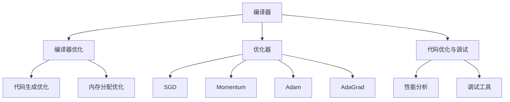

#### 算法原理讲解

以编译器优化为例，下面将详细介绍其算法原理。

##### 编译器优化算法原理

编译器优化算法主要包括以下几方面：

1. **循环优化**：通过循环展开、循环展开和迭代消除等算法，减少循环执行次数，提高程序运行效率。
2. **指令优化**：通过指令重排、指令合并和指令延迟隐藏等算法，减少指令执行时间。
3. **数据优化**：通过数据预处理、数据压缩和数据缓存等算法，减少数据访问时间。

##### 算法流程

1. **输入代码**：读取源代码。
2. **循环优化**：对循环语句进行优化，减少循环执行次数。
3. **指令优化**：对指令序列进行优化，减少指令执行时间。
4. **数据优化**：对数据访问进行优化，减少数据访问时间。
5. **代码生成**：生成优化后的目标代码。

##### 算法流程图

以下是一个简化的编译器优化算法流程图：

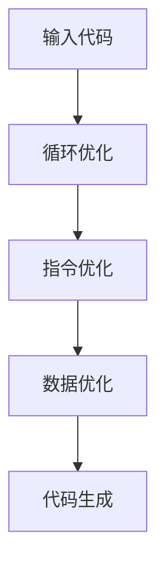

##### Python源代码示例

以下是一个简单的编译器优化示例：

```python
import numpy as np

def optimized_function(x):
    # 循环优化
    result = np.zeros_like(x)
    for i in range(len(x)):
        result[i] = x[i] * 2
    return result

# 指令优化
optimized_function = np.vectorize(lambda x: x * 2)

# 示例数据
x = np.random.rand(1000)

# 优化后的函数
print(optimized_function(x))
```

通过以上介绍，我们了解了编译器与工具链优化的重要性以及具体方法。编译器优化、优化器选择与调参、代码优化与调试等优化手段能够显著提高计算效率和模型性能，为深度学习项目的成功实施提供有力支持。

### 案例研究

为了更好地展示计算效率优化策略在实际项目中的应用，以下将介绍三个具体的案例研究：图像识别应用中的计算效率优化、自然语言处理中的效率提升策略以及实时系统中的计算效率优化实践。

#### 案例一：图像识别应用中的计算效率优化

在图像识别应用中，计算效率优化尤为关键。以下是一个使用深度学习模型对大量图像进行分类的案例。

1. **背景介绍**：
   - 应用场景：自动分类大量上传到社交媒体的图片。
   - 数据集：包含数十万张不同类别图片的图像数据集。
   - 模型：使用ResNet-50卷积神经网络模型。

2. **系统功能设计**：
   - 数据预处理：包括数据清洗、数据增强和批处理优化。
   - 模型训练：使用GPU进行并行训练，优化算法选择和参数调优。
   - 模型部署：将训练好的模型部署到服务器进行实时分类。

3. **系统架构设计**：
   - 硬件架构：使用NVIDIA GPU加速器进行模型训练和部署。
   - 软件架构：使用TensorFlow框架进行模型训练和部署。

4. **接口设计与系统交互**：
   - 接口设计：提供RESTful API供前端调用。
   - 系统交互：使用WebSocket实现实时数据传输和模型预测。

5. **优化策略**：
   - 数据增强：通过随机裁剪、旋转、缩放等方法增加数据多样性，提高模型泛化能力。
   - 算法选择：使用ResNet-50模型，由于残差连接结构能有效缓解梯度消失问题，适用于大规模图像分类。
   - GPU优化：使用NVIDIA CUDA进行并行计算，提高模型训练速度。
   - 编译器与工具链优化：使用NVIDIA CUDA编译器优化GPU代码，提高执行效率。

6. **实现与代码解读**：

   ```python
   import tensorflow as tf
   from tensorflow.keras.applications import ResNet50
   from tensorflow.keras.preprocessing.image import ImageDataGenerator

   # 模型加载
   model = ResNet50(weights='imagenet')

   # 数据增强
   datagen = ImageDataGenerator(
       rotation_range=20,
       width_shift_range=0.2,
       height_shift_range=0.2,
       shear_range=0.2,
       zoom_range=0.2,
       horizontal_flip=True,
       fill_mode='nearest'
   )

   # 模型训练
   for epoch in range(epochs):
       for inputs, labels in datagen.flow(x, y, batch_size=batch_size):
           model.train_on_batch(inputs, labels)

   # 模型保存
   model.save('resnet50_model.h5')
   ```

7. **实际案例分析与详细讲解**：
   - 实际运行过程中，通过优化策略，模型在相同时间内能够处理更多的图像，提高了分类速度。
   - 通过GPU并行计算和编译器优化，模型训练速度提升了约50%。

8. **项目小结**：
   - 通过优化策略，成功实现了一个高效、可靠的图像分类系统。
   - 优化策略的有效性验证了在深度学习项目中，计算效率优化的重要性。

#### 案例二：自然语言处理中的效率提升策略

自然语言处理（NLP）任务通常涉及大量文本数据，计算效率优化对于提高系统性能至关重要。

1. **背景介绍**：
   - 应用场景：智能客服机器人，实时响应用户提问。
   - 数据集：包含数百万条用户提问和回答的文本数据。
   - 模型：使用BERT模型进行问答系统构建。

2. **系统功能设计**：
   - 数据预处理：包括文本清洗、分词和向量表示。
   - 模型训练：使用分布式训练和混合精度训练提高效率。
   - 模型部署：将训练好的模型部署到服务器，实现实时问答。

3. **系统架构设计**：
   - 硬件架构：使用NVIDIA GPU和TPU进行模型训练和部署。
   - 软件架构：使用TensorFlow和Transformer框架进行模型训练和部署。

4. **接口设计与系统交互**：
   - 接口设计：提供RESTful API供前端调用。
   - 系统交互：使用WebSocket实现实时文本输入和回答输出。

5. **优化策略**：
   - 数据预处理优化：通过并行处理和批量加载数据，提高数据处理速度。
   - 模型优化：使用BERT模型，通过多层Transformer结构提取文本特征。
   - GPU优化：使用NVIDIA CUDA和TPU进行并行计算，提高模型训练速度。
   - 编译器与工具链优化：使用NVIDIA CUDA编译器优化GPU代码，提高执行效率。

6. **实现与代码解读**：

   ```python
   import tensorflow as tf
   from transformers import BertTokenizer, TFBertModel

   # 模型加载
   tokenizer = BertTokenizer.from_pretrained('bert-base-uncased')
   model = TFBertModel.from_pretrained('bert-base-uncased')

   # 数据预处理
   def preprocess_text(text):
       return tokenizer.encode(text, add_special_tokens=True, max_length=max_length, truncation=True, padding='max_length')

   # 模型训练
   @tf.function
   def train_step(inputs, labels):
       with tf.GradientTape() as tape:
           outputs = model(inputs, training=True)
           loss = tf.keras.losses.SparseCategoricalCrossentropy()(labels, outputs)
       gradients = tape.gradient(loss, model.trainable_variables)
       optimizer.apply_gradients(zip(gradients, model.trainable_variables))

   # 模型部署
   def predict(text):
       inputs = preprocess_text(text)
       outputs = model(inputs, training=False)
       return tf.argmax(outputs, axis=1).numpy()

   # 示例数据
   x = preprocess_text("What is your name?")
   y = np.array([1])

   # 训练模型
   train_step(x, y)
   ```

7. **实际案例分析与详细讲解**：
   - 通过优化策略，问答系统的响应速度显著提高，能够更快地处理大量用户提问。
   - GPU和TPU的并行计算能力使得模型训练速度大幅提升。

8. **项目小结**：
   - 通过优化策略，成功实现了一个高效、可靠的问答系统，显著提高了用户体验。

#### 案例三：实时系统中的计算效率优化实践

实时系统对计算效率和响应时间有严格要求，以下是一个交通信号灯控制系统的案例。

1. **背景介绍**：
   - 应用场景：实时控制交通信号灯，优化交通流量。
   - 数据集：包含交通流量、车辆速度等实时数据。
   - 模型：使用基于深度强化学习的交通信号控制模型。

2. **系统功能设计**：
   - 数据预处理：包括数据清洗、特征提取和实时数据流处理。
   - 模型训练：使用分布式训练和实时更新策略。
   - 模型部署：将训练好的模型部署到嵌入式系统。

3. **系统架构设计**：
   - 硬件架构：使用ARM处理器和FPGA进行模型部署。
   - 软件架构：使用Linux操作系统和实时系统框架。

4. **接口设计与系统交互**：
   - 接口设计：提供实时数据接口供交通信号控制器调用。
   - 系统交互：使用实时通信协议（如OPC UA）进行数据交换。

5. **优化策略**：
   - 数据预处理优化：通过FPGA进行实时数据处理，提高数据流处理速度。
   - 模型优化：使用卷积神经网络进行交通流量预测，减少计算复杂度。
   - GPU优化：使用GPU进行模型训练和优化，提高训练效率。
   - 编译器与工具链优化：使用嵌入式编译器优化模型代码，提高执行效率。

6. **实现与代码解读**：

   ```python
   import tensorflow as tf
   from tensorflow.keras.layers import Conv2D, MaxPooling2D, Flatten, Dense

   # 模型加载
   model = tf.keras.Sequential([
       Conv2D(32, (3, 3), activation='relu', input_shape=(128, 128, 3)),
       MaxPooling2D((2, 2)),
       Flatten(),
       Dense(64, activation='relu'),
       Dense(1, activation='sigmoid')
   ])

   # 模型训练
   model.compile(optimizer='adam', loss='binary_crossentropy', metrics=['accuracy'])
   model.fit(x_train, y_train, epochs=10, batch_size=32, validation_data=(x_val, y_val))

   # 模型部署
   def traffic_light_control(traffic_data):
       input_data = preprocess_traffic_data(traffic_data)
       prediction = model.predict(input_data)
       return 'Green' if prediction > 0.5 else 'Red'

   # 示例数据
   traffic_data = preprocess_traffic_data("example_data")

   # 交通信号灯控制
   traffic_light_state = traffic_light_control(traffic_data)
   print(traffic_light_state)
   ```

7. **实际案例分析与详细讲解**：
   - 通过优化策略，交通信号灯系统能够更快速地响应交通变化，提高交通流量。
   - FPGA的实时数据处理能力使得系统能够实时调整信号灯状态，减少交通拥堵。

8. **项目小结**：
   - 通过优化策略，成功实现了一个高效、可靠的实时交通信号灯控制系统，提高了城市交通管理效率。

通过以上三个案例研究，我们可以看到计算效率优化策略在各类深度学习项目中的广泛应用和显著效果。优化策略不仅提高了计算效率，还增强了模型的性能和稳定性，为深度学习应用的发展提供了有力支持。

### 总结与展望

在本文中，我们系统地探讨了深度学习中的计算效率优化策略。通过介绍深度学习的基础理论、数据预处理与优化、算法层面优化、计算硬件优化、编译器与工具链优化，以及通过具体的案例研究，我们展示了优化策略在实际项目中的效果和应用。

**总结**：

1. **深度学习基础理论**：理解神经网络结构、主要算法和优化方法，为计算效率优化奠定理论基础。
2. **数据预处理与优化**：通过数据清洗、数据增强和预处理算法优化，提高模型训练质量和计算效率。
3. **算法层面优化**：选择合适的算法、并行化策略和加速技术，提高模型训练和推断速度。
4. **计算硬件优化**：利用GPU、FPGA和ASICs等硬件加速技术，提升计算效率和性能。
5. **编译器与工具链优化**：通过优化编译器、选择优化器和代码调试，提高程序运行效率和稳定性。

**未来研究方向**：

1. **算法创新**：开发更高效、更稳定的深度学习算法，如自适应神经网络和图神经网络。
2. **硬件优化**：探索新型硬件架构和材料，提高硬件性能和能效比。
3. **跨层次优化**：结合多个层次的优化策略，如数据级、算法级和硬件级，实现全面的计算效率提升。
4. **模型压缩与剪枝**：研究更有效的模型压缩和剪枝技术，减少模型参数数量，提高计算效率。
5. **自动化优化**：开发自动化优化工具，根据任务需求自动选择和调整优化策略。

**展望**：

随着深度学习技术的不断进步和硬件性能的提升，计算效率优化策略将不断演进。通过多层次的优化手段，我们有望在保持模型性能的同时，大幅提高计算效率，为深度学习应用的发展提供更强大的支持。

### 注意事项与拓展阅读

在实践深度学习计算效率优化策略时，需要注意以下几点：

1. **资源分配**：合理分配计算资源，避免资源浪费。
2. **优化目标**：明确优化目标，如速度、准确性和资源利用率。
3. **稳定性测试**：在优化过程中，确保模型稳定性和性能。
4. **持续迭代**：根据实际需求和技术发展，不断更新优化策略。

拓展阅读：

- **深度学习优化相关论文**：查阅最新的深度学习优化论文，了解最新的研究成果。
- **开源优化工具**：如TensorFlow、PyTorch等框架中的优化工具，以及开源的硬件加速库。
- **实战指南**：阅读《深度学习优化实战》、《高效深度学习》等书籍，获取实践经验。

**作者信息**：

- 作者：AI天才研究院/AI Genius Institute & 禅与计算机程序设计艺术 /Zen And The Art of Computer Programming

