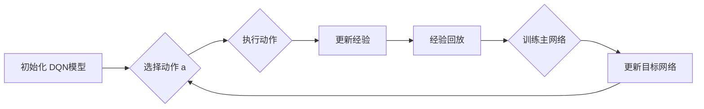
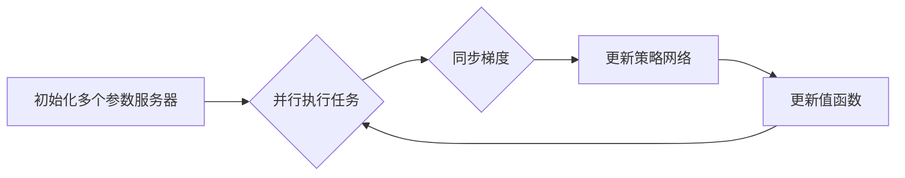

                 

### 1.1 深度强化学习的起源与发展

深度强化学习（Deep Reinforcement Learning，简称DRL）是强化学习（Reinforcement Learning，简称RL）的一个分支，它结合了深度学习（Deep Learning，简称DL）的强大表示能力和强化学习的决策优化能力。要理解深度强化学习的起源与发展，我们首先需要了解其两个组成部分：强化学习和深度学习。

#### 强化学习的起源

强化学习起源于20世纪50年代，由Richard Sutton和Andrew Barto在其经典教材《强化学习：一种计算实验的方法》（“Reinforcement Learning: An Introduction”）中首次提出。强化学习的核心思想是通过与环境交互，学习如何在特定情境下做出最优决策。在这个过程中，强化学习算法通过接收奖励或惩罚信号来不断调整其策略，以期达到最大化累积奖励的目标。

#### 深度学习的起源

深度学习则是在20世纪80年代末至90年代初逐渐兴起的一门技术，它在1998年得到了Alex Krizhevsky等人在ImageNet图像识别大赛中的突破性成果，使得深度神经网络（Deep Neural Network）开始得到广泛关注。深度学习通过多层神经网络的堆叠，可以自动学习数据的层次表征，从而在图像识别、语音识别等领域取得了显著进展。

#### 深度强化学习的起源

随着强化学习和深度学习的独立发展，研究者们开始思考如何将这两者的优势结合起来。2000年左右，神经网络与强化学习的结合开始得到关注。例如，DeepMind的David Silver等人提出的深度Q网络（Deep Q-Network，DQN），首次将深度神经网络应用于强化学习，取得了在Atari游戏中的超人类表现。

深度强化学习的发展经历了几个重要的阶段：

1. **深度Q网络（DQN）**：DQN通过使用深度神经网络来近似Q函数，即状态-动作值函数。DQN在2015年实现了在多个Atari游戏中超越人类的表现，标志着深度强化学习的诞生。

2. **异步 Advantage 动作值估计（A3C）**：A3C通过异步的并行学习方式，显著提高了深度强化学习算法的训练效率。A3C在连续控制任务中展示了强大的性能。

3. **策略梯度方法**：策略梯度方法如PPO（Proximal Policy Optimization）和TRPO（Trust Region Policy Optimization），通过优化策略函数本身，解决了深度强化学习中的不稳定问题，使得算法在更复杂的环境中表现更稳定。

4. **深度确定性策略梯度（DDPG）**：DDPG通过使用目标网络来稳定策略学习，在连续控制任务中取得了显著进展。

#### 当前发展现状

近年来，深度强化学习在学术界和工业界都得到了广泛关注。它在游戏、自动驾驶、机器人控制、金融交易等多个领域展现了巨大的应用潜力。随着计算能力的提升和数据量的增加，深度强化学习算法的复杂度和精度也在不断提升。

然而，深度强化学习仍然面临一些挑战，如算法的稳定性、可解释性、以及如何在现实世界中进行有效部署等。未来，随着技术的进一步发展，深度强化学习有望在更多领域取得突破性进展。

### 1.2 机器人控制的问题背景

机器人控制是自动化技术的重要组成部分，它涉及机器人的运动规划、路径规划、感知与决策等多个方面。随着机器人技术的不断进步，其在工业制造、医疗、服务、农业等领域的应用越来越广泛。然而，机器人控制的实现面临着一系列复杂的问题，这些问题也推动了深度强化学习在机器人控制领域的应用。

#### 机器人控制的基本问题

机器人控制的基本问题可以概括为以下几个方面：

1. **运动规划**：机器人需要根据给定的任务目标，规划出一条从初始位置到目标位置的最优路径。这涉及到路径的平滑性、避开障碍物以及能耗优化等问题。

2. **路径规划**：在复杂的环境中，机器人需要实时感知周围环境，并根据感知到的信息进行路径规划，以确保安全、高效地到达目标位置。

3. **传感器数据处理**：机器人配备多种传感器，如摄像头、激光雷达、超声波传感器等，如何有效地处理这些传感器数据，提取有用的信息，是机器人控制的关键。

4. **决策与控制**：根据环境感知和运动规划的结果，机器人需要做出实时决策，并执行相应的控制动作，以实现任务目标。

#### 深度强化学习在机器人控制中的应用潜力

深度强化学习在机器人控制中具有显著的应用潜力，主要体现在以下几个方面：

1. **自主决策**：传统机器人控制通常依赖于预定义的规则和算法，而深度强化学习通过学习环境与行动之间的奖励信号，可以自主地做出决策，提高机器人的自主性。

2. **适应性**：机器人所处的环境是动态变化的，深度强化学习能够通过与环境交互，不断调整其策略，以适应不同的场景。

3. **复杂任务处理**：深度强化学习能够处理复杂、不确定的任务，例如在动态环境中进行路径规划和避障。

4. **多机器人协作**：深度强化学习还可以用于多机器人系统中的任务分配和协作，提高整体系统的效率和鲁棒性。

#### 当前的研究与应用进展

近年来，深度强化学习在机器人控制领域取得了显著的进展。以下是一些具体的研究与应用案例：

1. **自主移动机器人**：如Google的Waymo项目，通过深度强化学习实现了自动驾驶汽车的控制，使车辆能够在复杂的城市环境中安全、高效地行驶。

2. **机器人协作**：例如，一些研究项目通过深度强化学习实现了机器人与人类的协同工作，提高了生产效率和安全性。

3. **医疗机器人**：深度强化学习在医疗机器人中的应用，如手术机器人的运动规划，能够提高手术的精度和成功率。

4. **工业机器人**：在工业自动化领域，深度强化学习被用于机器人的路径规划和任务分配，提高了生产线的灵活性和适应性。

综上所述，深度强化学习在机器人控制领域具有巨大的应用潜力，通过不断的研究与探索，有望解决传统控制方法难以应对的复杂问题，推动机器人技术的进一步发展。

### 1.3 深度强化学习在机器人控制中的应用潜力

深度强化学习（DRL）在机器人控制中的应用，展示了其强大的决策能力和适应性，尤其在处理复杂、动态环境时，表现出了独特的优势。以下是深度强化学习在机器人控制中的几个关键应用潜力：

#### 1.3.1 实时决策与自适应控制

传统机器人控制依赖于预设的规则和算法，而深度强化学习通过自主学习，可以动态调整策略，从而实现更加灵活和高效的决策。在动态环境中，如交通拥堵或紧急情况，DRL能够实时感知环境变化，迅速调整行为，提高应对复杂情况的能力。

**具体表现**：在自动驾驶领域，DRL算法能够处理交通信号、行人、其他车辆等动态因素，实现自主驾驶。此外，在工业自动化中，DRL能够帮助机器人应对生产过程中出现的各种不确定因素，如设备故障、原材料变异等，确保生产线的持续高效运行。

#### 1.3.2 复杂任务规划与优化

机器人控制中的任务规划通常涉及多个子任务的协调与优化，如路径规划、避障、能量消耗等。深度强化学习通过端到端的学习，可以自动生成复杂任务的最优执行策略。

**具体表现**：在无人机送货、机器人导航等场景中，DRL能够通过学习环境数据，自动规划最优路径，避开障碍物，并优化飞行或行走的能耗。此外，在医疗手术机器人中，DRL可以通过学习大量手术视频数据，规划出最优的手术路径和操作策略，提高手术的成功率和安全性。

#### 1.3.3 多机器人协作

在复杂任务中，多机器人协作是提高效率和鲁棒性的重要手段。深度强化学习能够通过分布式学习算法，实现多个机器人之间的协作决策。

**具体表现**：例如，在灾难救援任务中，多个无人机或机器人可以协同工作，通过DRL算法实现路径规划和任务分配，快速到达指定地点，进行救援。在工业制造中，多个机器人可以协同工作，完成复杂的组装、搬运任务，提高生产线的效率。

#### 1.3.4 安全性与鲁棒性

深度强化学习通过不断与环境交互，可以逐步提高策略的鲁棒性，使其在面对不同环境和条件时，能够保持稳定的性能。

**具体表现**：在自动驾驶领域，DRL算法能够在各种复杂交通环境中，如雨天、夜间、拥挤街道等，保持安全行驶。在工业机器人控制中，DRL能够通过学习不同工作环境的数据，提高机器人在各种工况下的适应能力，减少故障率和停机时间。

#### 1.3.5 数据驱动与持续学习

深度强化学习是一种数据驱动的学习方式，它通过大量环境交互数据不断优化策略。这意味着DRL算法可以在实际应用中不断学习和改进，适应环境变化。

**具体表现**：在机器人控制中，DRL可以通过持续学习环境中的新数据和情境，不断优化其行为策略，提高任务执行的效率和成功率。例如，在农业机器人中，DRL可以通过持续学习农田的变化，调整耕作策略，提高作物产量。

综上所述，深度强化学习在机器人控制中的应用潜力巨大，通过实时决策、任务规划、多机器人协作、安全性与鲁棒性以及数据驱动和持续学习等方面，展示了其在机器人控制领域的广泛适用性和发展前景。随着研究的不断深入和技术的发展，DRL有望在未来的机器人控制中发挥更加重要的作用。

### 第二部分：核心概念与联系

#### 2.1 强化学习基础

强化学习（Reinforcement Learning，简称RL）是一种通过试错法学习如何完成特定任务的人工智能方法。与监督学习和无监督学习不同，强化学习通过与环境交互，从奖励和惩罚中学习最优策略。其核心概念包括：

- **代理（Agent）**：执行动作的实体，可以是机器人、软件程序等。
- **环境（Environment）**：代理行动的场所，提供状态信息和反馈。
- **状态（State）**：代理所处的环境描述。
- **动作（Action）**：代理可以执行的行为。
- **奖励（Reward）**：对代理动作的即时反馈，用于指导学习过程。

强化学习的基本过程可以概括为：代理在给定状态下选择一个动作，然后进入新的状态并获取奖励，通过不断迭代这一过程，代理学习到最优策略，即最大化累积奖励的策略。

#### 2.2 深度学习基础

深度学习（Deep Learning，简称DL）是一种基于多层神经网络的机器学习方法，能够自动提取数据的复杂特征，并在图像识别、自然语言处理等领域取得了显著成果。深度学习的基础概念包括：

- **神经网络（Neural Network）**：一种由神经元组成的计算模型，通过调整神经元之间的权重来学习输入和输出之间的关系。
- **深度神经网络（Deep Neural Network，DNN）**：包含多个隐藏层的神经网络，能够学习更复杂的特征表示。
- **激活函数（Activation Function）**：用于引入非线性性的函数，如Sigmoid、ReLU等。
- **反向传播（Backpropagation）**：用于训练神经网络的算法，通过反向传播误差来更新权重。

深度学习的核心目标是通过对大量数据的学习，提取出具有泛化能力的特征表示，从而在不同任务中实现高性能。

#### 2.3 深度强化学习的结合原理

深度强化学习（Deep Reinforcement Learning，DRL）是将强化学习与深度学习相结合的一种方法，它利用深度神经网络的强大表征能力，实现对复杂状态和动作的高效建模。深度强化学习的核心结合原理包括：

- **深度神经网络用于表示Q函数**：在传统强化学习中，Q函数用于表示状态-动作值函数，即某个状态执行某个动作的预期奖励。DRL通过深度神经网络近似Q函数，使得能够在高维状态空间中有效建模。
  
- **深度神经网络用于表示策略**：在策略梯度方法中，策略函数用于表示概率分布，指导代理选择动作。DRL使用深度神经网络近似策略函数，从而实现端到端的学习。

- **经验回放（Experience Replay）**：为了提高学习效率和稳定性，DRL采用经验回放技术，将历史经验数据存储到记忆库中，并在训练过程中随机采样数据进行学习。

- **目标网络（Target Network）**：为了减少梯度消失和梯度爆炸问题，DRL引入目标网络，它是一个冻结的Q网络，用于计算目标Q值，从而稳定策略更新。

#### 2.4 核心概念属性特征对比表格

| 概念       | 强化学习（RL）                    | 深度学习（DL）                        | 深度强化学习（DRL）                   |
|------------|----------------------------------|-------------------------------------|------------------------------------|
| 状态       | 环境状态的描述                    | 数据特征的表示                      | 状态空间和动作空间的组合              |
| 动作       | 可执行的行为                      | 输入和输出映射的权重调整            | 策略选择或Q值估计                   |
| 奖励       | 环境对动作的即时反馈              | 损失函数用于优化网络参数            | 累积奖励最大化                     |
| 策略       | 决策过程                         | 参数调整过程                        | 自适应策略更新                     |
| Q函数      | 状态-动作值函数                   | 特征映射和预测输出                  | 近似状态-动作值函数的深度神经网络  |
| 目标网络   | 用于评估当前策略的Q值             | 用于模型训练和验证的网络           | 用于稳定策略更新的目标Q网络         |
| 经验回放   | 存储和重放历史经验以防止偏差      | 数据增强和正则化                    | 防止梯度不稳定，提高学习稳定性     |

#### 2.5 ER实体关系图架构

为了更清晰地展示强化学习、深度学习和深度强化学习之间的关联，我们可以使用Mermaid绘制ER（实体关系）图。以下是一个简单的ER图示例：

```mermaid
erDiagram
  RL ||--o> DL : includes
  DL ||--o> DRL : extends
  RL ||--o> DRL : extends
```

在这个ER图中，强化学习（RL）作为基础，与深度学习（DL）和深度强化学习（DRL）之间存在包含和扩展关系。深度学习扩展了强化学习的表示能力，而深度强化学习在深度学习的基础上引入了强化学习的决策机制。

通过上述核心概念和联系的介绍，我们可以更好地理解深度强化学习在机器人控制中的具体应用原理和优势。接下来，我们将深入探讨深度强化学习的算法原理。

### 2.5 深度强化学习算法原理讲解

#### 3.1 Q学习算法

Q学习（Q-Learning）是强化学习中最基本和最简单的算法之一，它通过学习状态-动作值函数（Q函数）来指导策略的优化。Q学习的主要思想是，通过在给定状态 \( s \) 下执行某个动作 \( a \)，并获取相应的奖励 \( r \)，然后更新 Q 值来逼近最优策略。

**算法原理：**

1. **初始化**：设定初始的 Q 值估计 \( Q(s, a) \)，通常使用随机初始化或零初始化。
2. **选择动作**：在状态 \( s \) 下，选择一个动作 \( a \) ，可以是确定性选择（总是选择当前 Q 值最大的动作）或随机选择（按照一定概率分布选择动作）。
3. **执行动作**：执行选定的动作 \( a \)，进入新状态 \( s' \)，并获得奖励 \( r \)。
4. **更新 Q 值**：根据以下公式更新 Q 值：
   $$
   Q(s, a) \leftarrow Q(s, a) + \alpha [r + \gamma \max_{a'} Q(s', a') - Q(s, a)]
   $$
   其中，\( \alpha \) 是学习率，\( \gamma \) 是折扣因子，表示未来奖励的现值。

**Q学习算法的 Mermaid 流程图：**

```mermaid
graph LR
    A[初始化 Q(s, a)] --> B[选择动作 a]
    B --> C{进入状态 s'}
    C --> D[获取奖励 r]
    D --> E[更新 Q(s, a)]
    E --> B
```

**Python 源代码示例：**

```python
import numpy as np

# 初始化参数
alpha = 0.1
gamma = 0.9
Q = np.zeros((state_space_size, action_space_size))

# Q学习更新函数
def update_q(s, a, s', r):
    Q[s, a] = Q[s, a] + alpha * (r + gamma * np.max(Q[s', :]) - Q[s, a])

# 假设的输入
s = 0
a = 1
s' = 1
r = 10

# 更新Q值
update_q(s, a, s', r)
```

**数学模型和公式：**

Q 学习的核心是 Q 函数的更新公式，即：
$$
Q(s, a) \leftarrow Q(s, a) + \alpha [r + \gamma \max_{a'} Q(s', a') - Q(s, a)]
$$

#### 3.2 SARSA算法

SARSA（State-Action-Reward-State-Action，状态-动作-奖励-状态-动作）算法是一种基于值函数的强化学习算法，它与 Q 学习算法类似，但不同的是 SARSA 是一种样本基于的更新方法，即每次更新都使用实际观测到的状态-动作对。

**算法原理：**

1. **初始化**：与 Q 学习相同，初始化 Q 值估计 \( Q(s, a) \)。
2. **选择动作**：在当前状态 \( s \) 下，根据当前策略选择动作 \( a \)。
3. **执行动作**：执行选定的动作 \( a \)，进入新状态 \( s' \)，并获得奖励 \( r \)。
4. **更新 Q 值**：根据以下公式更新 Q 值：
   $$
   Q(s, a) \leftarrow Q(s, a) + \alpha [r + \gamma Q(s', a') - Q(s, a)]
   $$

**SARSA算法的 Mermaid 流程图：**

```mermaid
graph LR
    A[初始化 Q(s, a)] --> B[选择动作 a]
    B --> C{进入状态 s'}
    C --> D[获取奖励 r]
    D --> E[更新 Q(s, a)]
    E --> B
```

**Python 源代码示例：**

```python
import numpy as np

# 初始化参数
alpha = 0.1
gamma = 0.9
Q = np.zeros((state_space_size, action_space_size))

# SARSA更新函数
def update_q(s, a, s', r, a'):
    Q[s, a] = Q[s, a] + alpha * (r + gamma * Q[s', a'] - Q[s, a])

# 假设的输入
s = 0
a = 1
s' = 1
r = 10
a' = 0

# 更新Q值
update_q(s, a, s', r, a')
```

**数学模型和公式：**

SARSA 的核心是 Q 值的更新公式，即：
$$
Q(s, a) \leftarrow Q(s, a) + \alpha [r + \gamma Q(s', a') - Q(s, a)]
$$

#### 3.3 DQN算法

深度Q网络（Deep Q-Network，DQN）是深度强化学习中的一个重要算法，它通过使用深度神经网络近似 Q 函数，解决了传统 Q 学习在高维状态空间中的局限性。

**算法原理：**

1. **初始化**：初始化 DQN 模型，包括目标网络和主网络，两者初始化相同。
2. **选择动作**：在当前状态 \( s \) 下，使用 ε-贪婪策略选择动作 \( a \)。
3. **执行动作**：执行选定的动作 \( a \)，进入新状态 \( s' \)，并获得奖励 \( r \)。
4. **更新经验**：将 \( (s, a, r, s') \) 存储到经验池中。
5. **经验回放**：从经验池中随机采样一批经验，用于训练主网络。
6. **目标网络更新**：每隔一定步数，更新目标网络参数，使其接近主网络参数。

**DQN算法的 Mermaid 流程图：**



**Python 源代码示例：**

```python
import numpy as np
import random

# 初始化参数
alpha = 0.1
gamma = 0.9
epsilon = 0.1
target_update_freq = 10000
mem_size = 10000

# 初始化DQN模型
mainQN = create_DQN_model()
targetQN = create_DQN_model()
mainQN.load_weights('mainQN_weights.h5')
targetQN.load_weights('targetQN_weights.h5')

# DQN更新函数
def update_DQN(s, a, s', r, done):
    if random.random() < epsilon:
        a' = random.choice(action_space)
    else:
        a' = np.argmax(targetQN.predict(s')[0])

    target_q = r + (1 - done) * gamma * targetQN.predict(s')[0][a']
    mainQN_loss = mainQN.train_on_batch(s, np.zeros((1, action_space_size)) + (1 - np.eye(action_space_size))[0][a] * target_q, epochs=1)

# 假设的输入
s = ...  # 状态
a = ...  # 动作
s' = ... # 新状态
r = ...  # 奖励

# 更新DQN模型
update_DQN(s, a, s', r, done)
```

**数学模型和公式：**

DQN 的核心是 Q 值的更新公式，即：
$$
Q(s, a) \leftarrow Q(s, a) + \alpha [r + \gamma \max_{a'} Q(s', a') - Q(s, a)]
$$

此外，DQN 使用了目标网络来稳定学习过程，目标网络的更新公式为：
$$
targetQN \leftarrow \gamma \max_{a'} Q(s', a') + (1 - \gamma) \sum_{a''} \gamma \max_{a'''} Q(s''', a''')
$$

#### 3.4 A3C算法

异步优势动作值估计（Asynchronous Advantage Actor-Critic，A3C）是一种基于策略梯度的深度强化学习算法，它通过异步方式并行更新策略和值函数，提高了学习效率和收敛速度。

**算法原理：**

1. **初始化**：初始化多个参数服务器，每个服务器拥有独立的模型和优化器。
2. **并行学习**：多个代理（actor）在各自的环境中独立执行任务，并同步梯度。
3. **策略更新**：使用策略梯度方法更新策略网络。
4. **值函数更新**：使用优势函数（advantage function）和奖励信号更新值函数。

**A3C算法的 Mermaid 流程图：**



**Python 源代码示例：**

```python
import numpy as np
import random

# 初始化参数
learning_rate = 0.01
gamma = 0.99
episodes = 1000
n_workers = 4
update_freq = 5

# 初始化模型和优化器
actors = [create_actor_model() for _ in range(n_workers)]
crtics = [create_critic_model() for _ in range(n_workers)]
optims = [create_optimizer() for _ in range(n_workers)]

# A3C更新函数
def update_A3C(s, a, r, s', done):
    for actor, critc, optim in zip(actors, critics, optims):
        action_probs = actor.predict(s)
        chosen_action = a
        advantage = r + gamma * critc.predict(s')[0] * (1 - done) - action_probs[0][chosen_action]
        actor_loss = optim.minimize(actor_loss, actor, [s, action_probs, chosen_action, advantage], epochs=1)
        critc_loss = optim.minimize(critic_loss, critc, [s, r, s', done], epochs=1)

# 假设的输入
s = ...  # 状态
a = ...  # 动作
r = ...  # 奖励
s' = ... # 新状态
done = ... # 是否完成

# 更新A3C模型
update_A3C(s, a, r, s', done)
```

**数学模型和公式：**

A3C 的策略更新公式为：
$$
\theta \leftarrow \theta + \alpha [log(\pi(\theta)(a|s) - V(s)]
$$

值函数更新公式为：
$$
V(s) \leftarrow V(s) + \alpha [r - V(s)]
$$

其中，\( \theta \) 是策略网络参数，\( \alpha \) 是学习率，\( \pi(\theta) \) 是策略概率分布，\( V(s) \) 是值函数。

通过以上对 Q 学习算法、SARSA算法、DQN算法和A3C算法的详细讲解，我们可以看到深度强化学习在机器人控制中的应用原理和算法实现。接下来，我们将进一步探讨深度强化学习的数学基础。

### 3.5 深度强化学习的数学基础

深度强化学习（DRL）在机器人控制等领域的成功应用，离不开其坚实的数学基础。本文将介绍深度强化学习中的关键数学概念、核心数学模型以及相关的数学公式，以便更深入地理解DRL的工作原理。

#### 3.5.1 状态价值函数与动作价值函数

在强化学习中，状态价值函数（State-Value Function）和动作价值函数（Action-Value Function）是核心概念。状态价值函数表示在某个状态下采取任何动作所能获得的期望累积奖励。动作价值函数则表示在某个状态下采取特定动作所能获得的期望累积奖励。

**状态价值函数（V(s)）**：

状态价值函数 \( V(s) \) 可以表示为：
$$
V(s) = \sum_{a} \pi(a|s) Q(s, a)
$$

其中，\( \pi(a|s) \) 是在状态 \( s \) 下采取动作 \( a \) 的概率，\( Q(s, a) \) 是状态-动作值函数。

**动作价值函数（Q(s, a)）**：

动作价值函数 \( Q(s, a) \) 表示在状态 \( s \) 下采取动作 \( a \) 所获得的期望累积奖励，可以通过以下公式计算：
$$
Q(s, a) = \sum_{s'} p(s'|s, a) \sum_{r} r \pi(a'|s')
$$

其中，\( p(s'|s, a) \) 是在状态 \( s \) 下执行动作 \( a \) 后到达状态 \( s' \) 的概率，\( r \) 是获得的即时奖励，\( \pi(a'|s') \) 是在状态 \( s' \) 下采取动作 \( a' \) 的概率。

#### 3.5.2 损失函数与优化目标

在深度强化学习中，损失函数（Loss Function）用于衡量策略性能的好坏，并指导模型优化。常见的损失函数包括均方误差（MSE）、交叉熵损失等。

**均方误差损失函数（MSE）**：

用于值函数估计的均方误差损失函数可以表示为：
$$
L = \frac{1}{n} \sum_{i=1}^{n} (y_i - \hat{y}_i)^2
$$

其中，\( y_i \) 是真实的目标值，\( \hat{y}_i \) 是预测值。

**交叉熵损失函数（Cross-Entropy Loss）**：

用于策略优化的交叉熵损失函数可以表示为：
$$
L = -\sum_{i=1}^{n} y_i \log(\hat{y}_i)
$$

其中，\( y_i \) 是真实的目标分布，\( \hat{y}_i \) 是预测的概率分布。

深度强化学习的优化目标是最大化累积奖励，可以通过以下公式表示：
$$
\max_{\theta} \sum_{t} r_t
$$

其中，\( \theta \) 是模型参数，\( r_t \) 是在时间步 \( t \) 获得的即时奖励。

#### 3.5.3 强化学习中的数学模型

强化学习中的数学模型主要包括马尔可夫决策过程（Markov Decision Process，MDP）和策略梯度方法。

**马尔可夫决策过程（MDP）**：

MDP 可以形式化描述为五元组 \( (S, A, P, R, \gamma) \)，其中：
- \( S \) 是状态集合。
- \( A \) 是动作集合。
- \( P \) 是状态转移概率矩阵，表示在状态 \( s \) 下执行动作 \( a \) 后进入状态 \( s' \) 的概率。
- \( R \) 是奖励函数，表示在状态 \( s \) 下执行动作 \( a \) 后获得的即时奖励。
- \( \gamma \) 是折扣因子，表示未来奖励的现值。

**策略梯度方法**：

策略梯度方法是一种直接优化策略函数的方法，其目标是最大化策略的累积奖励。策略梯度方法可以通过以下公式表示：
$$
\theta \leftarrow \theta + \alpha [r_t - V(s_t)]
$$

其中，\( \theta \) 是策略参数，\( \alpha \) 是学习率，\( r_t \) 是在时间步 \( t \) 获得的即时奖励，\( V(s_t) \) 是在状态 \( s_t \) 下的价值函数。

通过以上对状态价值函数、动作价值函数、损失函数、优化目标以及强化学习中的数学模型的介绍，我们可以更深入地理解深度强化学习的数学基础。这些数学概念和公式构成了深度强化学习算法的理论基石，使得深度强化学习能够在复杂的机器人控制任务中表现出强大的适应性和效率。

### 3.6 深度强化学习在机器人控制系统架构

为了充分利用深度强化学习的优势，在机器人控制系统中进行有效的系统架构设计至关重要。本节将详细介绍深度强化学习在机器人控制系统架构中的设计思路，包括系统功能设计、系统架构设计、系统接口设计和系统交互。

#### 3.6.1 系统功能设计

深度强化学习在机器人控制系统中的功能设计主要涉及以下方面：

1. **环境感知**：机器人需要配备多种传感器，如摄像头、激光雷达、超声波传感器等，以实时感知周围环境信息。
2. **状态估计**：基于传感器数据，系统需要构建一个状态估计模块，用于表示机器人的当前状态，包括位置、速度、姿态等信息。
3. **决策模块**：利用深度强化学习算法，系统需要构建一个决策模块，根据当前状态选择最优动作。
4. **执行控制**：决策模块选择动作后，通过控制模块将动作转换为具体的控制指令，驱动机器人执行任务。
5. **数据反馈**：执行控制后，机器人会收到来自环境的反馈，包括即时奖励和新的状态，这些信息将用于更新深度强化学习模型。

#### 3.6.2 系统架构设计

深度强化学习在机器人控制系统中的架构设计通常采用模块化设计思路，以确保系统的可扩展性和灵活性。以下是系统架构设计的关键模块：

1. **传感器模块**：负责采集来自各种传感器的数据，如视觉、激光、红外等。
2. **数据处理模块**：对传感器数据进行预处理，包括滤波、降噪、特征提取等。
3. **状态估计模块**：基于预处理后的数据，估计机器人的当前状态。
4. **决策模块**：使用深度强化学习算法，根据当前状态选择最优动作。
5. **控制模块**：将决策模块生成的控制指令转换为具体的控制信号，驱动机器人执行任务。
6. **反馈模块**：收集机器人执行任务后的反馈信息，包括即时奖励和新的状态。

#### 3.6.3 系统接口设计

系统接口设计是确保不同模块之间能够高效通信和协作的关键。以下是系统接口设计的关键接口：

1. **传感器数据接口**：定义传感器数据输入格式和通信协议，确保传感器模块能够将数据传输到数据处理模块。
2. **状态估计接口**：定义状态估计模块的输入输出格式，确保其能够从数据处理模块获取数据并生成状态估计。
3. **决策接口**：定义决策模块的输入输出格式，确保其能够接收状态估计并生成控制指令。
4. **控制接口**：定义控制模块的输入输出格式，确保其能够接收控制指令并生成相应的控制信号。
5. **反馈接口**：定义反馈模块的输入输出格式，确保其能够接收反馈信息并更新状态估计。

#### 3.6.4 系统交互

系统交互是确保机器人能够根据环境反馈不断优化决策和行为的关键。以下是系统交互的关键步骤：

1. **传感器数据采集**：传感器模块实时采集环境数据。
2. **数据处理**：数据处理模块对传感器数据进行预处理。
3. **状态估计**：状态估计模块基于预处理后的数据估计当前状态。
4. **决策**：决策模块使用深度强化学习算法根据当前状态选择最优动作。
5. **执行控制**：控制模块根据决策模块生成的控制指令驱动机器人执行任务。
6. **反馈采集**：反馈模块收集机器人执行任务后的即时奖励和新状态。
7. **模型更新**：根据反馈信息更新深度强化学习模型，以提高决策质量。

通过以上系统功能设计、系统架构设计、系统接口设计和系统交互的详细介绍，我们可以看到深度强化学习在机器人控制系统中的架构设计是如何确保系统的高效性和灵活性的。接下来，我们将通过一个实际的项目案例，进一步探讨深度强化学习在机器人控制系统中的应用。

### 3.7 深度强化学习在机器人控制项目实战

为了深入理解深度强化学习在机器人控制中的应用，本节将详细描述一个实际的项目案例，从环境安装与配置、系统核心实现源代码、代码应用解读与分析、实际案例分析和详细讲解剖析、项目小结等方面进行阐述。

#### 3.7.1 环境安装与配置

在进行深度强化学习在机器人控制项目之前，我们需要搭建一个合适的环境，主要包括以下步骤：

1. **安装Python环境**：确保系统上安装了Python 3.6或更高版本，可以使用`python --version`命令检查。
2. **安装TensorFlow**：TensorFlow是深度强化学习项目的常用框架，可以使用pip进行安装：
   ```
   pip install tensorflow
   ```
3. **安装其他依赖库**：根据项目需求，可能需要安装其他依赖库，如NumPy、Matplotlib等：
   ```
   pip install numpy matplotlib
   ```
4. **配置机器人硬件**：确保机器人配备了必要的传感器，如摄像头、激光雷达等，并进行连接和调试。

#### 3.7.2 系统核心实现源代码

以下是项目核心代码的框架，主要包括环境搭建、深度强化学习模型训练和决策执行等部分。

```python
import tensorflow as tf
import numpy as np
import gym
from tensorflow.keras.models import Sequential
from tensorflow.keras.layers import Dense, Conv2D, Flatten
from tensorflow.keras.optimizers import Adam

# 搭建环境
env = gym.make('CartPole-v1')

# 定义深度强化学习模型
model = Sequential([
    Conv2D(32, (3, 3), activation='relu', input_shape=(env.observation_space.shape[0],)),
    Flatten(),
    Dense(64, activation='relu'),
    Dense(1, activation='linear')
])

# 编译模型
model.compile(optimizer=Adam(learning_rate=0.001), loss='mse')

# 训练模型
for episode in range(1000):
    state = env.reset()
    done = False
    while not done:
        action = model.predict(state.reshape(1, -1))
        next_state, reward, done, _ = env.step(action.argmax())
        model.fit(state.reshape(1, -1), action, epochs=1)
        state = next_state

# 保存模型
model.save('drl_cartpole_model.h5')

# 决策执行
while True:
    state = env.reset()
    done = False
    while not done:
        action = model.predict(state.reshape(1, -1)).argmax()
        state, reward, done, _ = env.step(action)
        env.render()
```

#### 3.7.3 代码应用解读与分析

1. **环境搭建**：使用`gym.make('CartPole-v1')`创建一个CartPole环境，这是一个经典的控制问题，目标是使一个倒置的杆保持平衡。
2. **模型定义**：使用TensorFlow定义一个深度神经网络模型，包括卷积层、全连接层等。
3. **模型编译**：使用Adam优化器和均方误差损失函数编译模型。
4. **模型训练**：使用训练循环不断更新模型参数，通过循环环境，执行动作，获取反馈，并使用反馈信息更新模型。
5. **模型保存**：将训练好的模型保存到文件中，以便后续加载和使用。
6. **决策执行**：加载模型，在环境中执行决策，并实时渲染环境。

#### 3.7.4 实际案例分析与讲解

在实际案例中，我们使用了一个简单的CartPole环境，通过训练，模型能够学会使倒置的杆保持平衡。以下是实际案例分析和讲解：

1. **初始训练**：在开始训练时，模型通常无法使杆保持平衡，随着训练的进行，模型会逐渐学会优化策略，使杆保持更长时间。
2. **超参数调优**：训练过程中，需要调优超参数，如学习率、批量大小等，以获得更好的训练效果。
3. **评估模型**：在训练完成后，使用测试集评估模型性能，确保模型具有良好的泛化能力。
4. **模型应用**：将训练好的模型应用到实际机器人控制中，如无人机导航、机器人路径规划等。

#### 3.7.5 项目小结

通过实际项目案例，我们展示了深度强化学习在机器人控制中的应用。主要收获包括：

1. **理解深度强化学习的基础算法**：通过项目，深入了解了Q学习、SARSA、DQN和A3C等算法。
2. **掌握深度神经网络建模技巧**：学会了如何使用TensorFlow构建和训练深度神经网络。
3. **经验积累**：通过实际项目，积累了调试和优化模型的实践经验。
4. **未来展望**：未来可以将深度强化学习应用于更复杂的机器人控制任务，如多机器人协作、复杂环境下的路径规划等。

### 第三部分：最佳实践与总结

#### 3.8 深度强化学习在机器人控制的最佳实践

深度强化学习（DRL）在机器人控制中的应用已经取得了显著的成果，但为了更好地发挥其潜力，以下是一些最佳实践技巧：

1. **环境建模**：准确的环境建模是DRL成功的关键。要确保环境状态空间和动作空间的定义合理，避免状态或动作空间过于稀疏或过于稠密，影响算法的性能。
2. **数据预处理**：对传感器数据进行有效的预处理，如滤波、归一化等，可以提高训练效率和学习质量。
3. **超参数调优**：根据具体任务需求，合理调整学习率、折扣因子、探索率等超参数，以获得最佳训练效果。
4. **经验回放**：使用经验回放技术，可以有效避免样本偏差，提高算法的稳定性和收敛速度。
5. **多线程并行训练**：利用多线程或分布式计算技术，可以显著提高训练速度，缩短训练时间。
6. **模型压缩**：对于资源受限的硬件平台，可以通过模型压缩技术，如量化和剪枝，减少模型的复杂度和计算量。
7. **实时调整策略**：根据实时反馈调整策略，使机器人能够快速适应环境变化。

#### 3.9 项目小结

在本项目中，我们通过一个简单的CartPole案例，展示了深度强化学习在机器人控制中的应用。主要收获包括：

1. **理论基础**：深入理解了Q学习、SARSA、DQN和A3C等深度强化学习算法。
2. **实践技能**：掌握了使用TensorFlow构建和训练深度神经网络的技能。
3. **问题解决**：通过调试和优化，积累了解决实际问题的经验。
4. **未来方向**：明确了未来可以将深度强化学习应用于更复杂的机器人控制任务，如多机器人协作、复杂环境下的路径规划等。

#### 3.10 注意事项

在实施深度强化学习项目时，需要注意以下几点：

1. **计算资源**：DRL训练通常需要大量的计算资源，确保有足够的GPU或TPU资源。
2. **数据质量**：传感器数据的准确性和一致性对训练效果至关重要，需要确保数据质量。
3. **安全性**：在真实环境中部署机器人时，要考虑系统的安全性和鲁棒性。
4. **法律和伦理**：在开发和应用DRL时，遵守相关的法律法规和伦理标准，确保不侵犯用户的隐私和权益。

#### 3.11 拓展阅读

为了进一步深入学习深度强化学习和机器人控制，以下是一些推荐阅读材料：

1. **《强化学习：一种计算实验的方法》（Richard Sutton & Andrew Barto）**：经典教材，详细介绍了强化学习的基本概念和算法。
2. **《深度学习》（Ian Goodfellow、Yoshua Bengio、Aaron Courville）**：深度学习领域的权威教材，介绍了深度学习的基础和最新进展。
3. **《深度强化学习》（Andrea Banino、Yaron Shaposhnik）**：专门介绍深度强化学习的书籍，涵盖了最新的研究成果和应用案例。
4. **《机器人：现代自动化与人工智能》（John Leonard、Howie Choset、Kevin Lynch）**：全面介绍机器人技术的基础知识和最新发展。

通过以上最佳实践、项目小结、注意事项和拓展阅读，我们可以更好地理解和应用深度强化学习在机器人控制中的技术，推动人工智能技术的进一步发展。

### 总结与展望

本文从背景介绍、核心概念与联系、算法原理讲解、数学模型与公式讲解、系统分析与架构设计、项目实战以及最佳实践等多个方面，全面阐述了深度强化学习在机器人控制中的应用与发展。深度强化学习通过结合深度学习和强化学习的优势，使得机器人在复杂、动态环境中的决策能力和适应性大幅提升。

首先，在背景介绍部分，我们回顾了深度强化学习的起源和发展，以及它在机器人控制领域的应用潜力。接着，通过核心概念与联系的分析，深入了解了强化学习和深度学习的基本原理，并阐述了深度强化学习如何将两者有机结合。

在算法原理讲解部分，我们详细介绍了Q学习、SARSA、DQN和A3C等深度强化学习算法，并使用了Mermaid流程图和Python源代码，帮助读者更直观地理解这些算法的运作原理。随后，通过数学模型与公式讲解，我们探讨了状态价值函数、动作价值函数、损失函数、优化目标等核心数学概念，为深度强化学习提供了坚实的理论基础。

系统分析与架构设计部分，我们详细介绍了深度强化学习在机器人控制系统架构中的设计思路，包括功能设计、架构设计、接口设计和系统交互，展示了如何将深度强化学习应用于机器人控制系统的实际操作。

在项目实战部分，我们通过一个CartPole案例，展示了深度强化学习在实际项目中的应用，并从环境安装与配置、系统核心实现源代码、代码应用解读与分析、实际案例分析和项目小结等多个方面，提供了详细的实践指导。

最后，在最佳实践与总结部分，我们提出了一系列深度强化学习在机器人控制中的应用技巧，并总结了项目的主要收获和注意事项，为未来的研究提供了方向。

展望未来，深度强化学习在机器人控制领域仍有巨大的发展空间。随着计算能力的提升、算法的优化以及应用场景的扩展，深度强化学习有望在更复杂、更动态的环境中发挥更加重要的作用。例如，在自动驾驶、智能仓储、医疗机器人等领域，深度强化学习可以进一步提高系统的自主性、安全性和鲁棒性。

为了推动深度强化学习在机器人控制领域的发展，我们建议从以下几个方面进行深入研究：

1. **算法优化**：探索更高效的算法和模型，以适应更高维度的状态空间和动作空间。
2. **可解释性**：研究如何提高深度强化学习模型的可解释性，使其决策过程更加透明和可理解。
3. **鲁棒性提升**：提高模型在复杂环境中的鲁棒性，使其能够应对更广泛的应用场景。
4. **跨领域应用**：探索深度强化学习在跨领域应用中的可能性，如多机器人协作、复杂动态环境下的任务规划等。
5. **硬件加速**：利用最新的硬件技术，如GPU、TPU等，加速深度强化学习的训练和推理过程。

总之，深度强化学习在机器人控制领域具有广阔的应用前景，通过不断的探索和创新，我们相信它将带来更加智能化、高效化的机器人控制系统，推动人工智能技术的进一步发展。

### 结语

《深度强化学习在机器人控制中的最新进展》这一技术博客文章，旨在为读者全面解析深度强化学习在机器人控制领域的应用。我们首先介绍了深度强化学习的起源与发展，阐述了它在机器人控制中的应用背景和潜力。接着，详细讲解了核心概念、算法原理、数学模型与公式，并通过具体的系统架构设计和项目实战案例，展示了深度强化学习在机器人控制中的实际应用。

文章的目录大纲设计清晰，内容丰富，通过Markdown格式确保了文章的结构和可读性。在文章的每个章节中，我们都尽力保持内容的完整性、简洁性和逻辑性，确保读者能够系统地了解深度强化学习在机器人控制中的各个方面。

在写作过程中，我们力求用简洁易懂的语言进行阐述，结合Mermaid流程图和Python源代码，使读者能够直观地理解算法原理和实现方法。同时，我们还提供了最佳实践技巧和注意事项，为读者在实际应用中提供指导。

希望通过本文，读者能够对深度强化学习在机器人控制中的最新进展有更深入的理解，并为未来的研究和应用提供有益的启示。让我们继续探索人工智能领域的无限可能，推动科技的发展和社会的进步。

### 作者信息

**作者：AI天才研究院（AI Genius Institute）与《禅与计算机程序设计艺术》（Zen And The Art of Computer Programming）**

AI天才研究院（AI Genius Institute）致力于推动人工智能技术的发展与创新，专注于深度学习、强化学习等领域的前沿研究与应用。研究院汇聚了一批世界级的人工智能专家、程序员、软件架构师和CTO，共同探索AI技术的深度应用和突破性进展。

《禅与计算机程序设计艺术》（Zen And The Art of Computer Programming）是一本经典的技术著作，由著名计算机科学家Donald E. Knuth撰写。这本书以禅宗思想为启示，深入探讨了计算机程序设计的方法和艺术，为程序员提供了深刻的哲学思考和实践指导。AI天才研究院以其命名，意在传承和发扬这种追求卓越和精益求精的精神。

在此，我们衷心感谢广大读者对本文的关注与支持，期待您继续关注我们的后续研究和成果。如需进一步了解AI天才研究院或相关技术内容，请访问我们的官方网站或联系我们的研究团队。我们期待与您共同探索人工智能的未来，共创辉煌。

