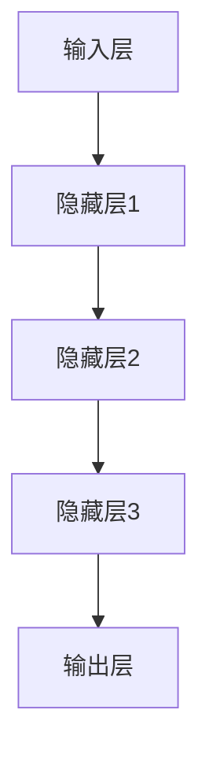

                 

## 混合精度量化:平衡模型性能与资源消耗

关键词：混合精度量化、深度学习、资源消耗、算法性能、硬件加速

摘要：本文深入探讨了混合精度量化技术，从基础概念到实际应用，分析了其在提高模型性能和减少资源消耗方面的关键作用。文章首先介绍了混合精度量化技术的背景与重要性，随后详细解析了其原理与算法，并通过实际案例展示了在深度学习、硬件加速和边缘计算中的广泛应用。本文旨在为读者提供全面的技术理解，助力其在AI领域更好地应用混合精度量化技术。

## 第一部分：混合精度量化技术基础

### 第1章：混合精度量化的背景与重要性

#### 1.1 混合精度量化的起源

量化技术在人工智能（AI）领域扮演着越来越重要的角色。传统的量化方法通常使用单一的精度，例如32位浮点数，这种精度虽然能够提供较高的计算精度，但在计算资源和存储空间上存在很大的浪费。随着AI模型复杂度和参数量的不断增加，资源消耗成为一个亟待解决的问题。为了解决这个问题，研究人员提出了混合精度量化技术。

混合精度量化最早起源于对计算效率的需求。为了在有限的硬件资源下运行复杂的AI模型，研究者们开始探索在计算过程中使用不同精度的数据。通过将计算过程中的一些部分使用较低的精度（例如16位或8位），可以显著减少计算资源和存储空间的消耗，同时尽量保证模型的性能不受影响。

#### 1.2 混合精度量化的问题背景

在讨论混合精度量化之前，我们需要了解当前AI领域面临的几个关键问题：

1. **计算资源限制**：随着深度学习模型的复杂度不断提高，所需的计算资源也在迅速增加。尤其是在移动设备和嵌入式系统等硬件资源受限的环境中，计算效率成为一个重要的考虑因素。

2. **算法性能需求**：虽然降低精度可以减少资源消耗，但如果不进行适当的设计和管理，可能会导致算法性能的显著下降。因此，如何在降低精度和保持算法性能之间找到平衡点，成为混合精度量化技术的一个重要挑战。

3. **能量消耗考量**：深度学习模型的计算过程中消耗的能量也是一个不容忽视的问题。尤其是在电池供电的移动设备上，降低能量消耗可以提高设备的续航能力。

#### 1.3 混合精度量化的核心概念

混合精度量化指的是在计算过程中使用不同位宽的数据表示。具体来说，它通常包括以下几种情况：

1. **混合精度浮点数**：在深度学习模型中，不同层的计算精度可以不同，例如某些层使用32位浮点数，而其他层使用16位或8位浮点数。

2. **定点数与浮点数的混合**：在一些情况下，整个模型可能使用定点数进行计算，但在某些关键层使用浮点数来保持较高的精度。

3. **动态精度调整**：根据模型的计算需求和资源限制，动态调整不同层的精度。

#### 1.4 混合精度量化的边界与外延

1. **量化位宽的选择**：量化位宽是指用于表示数据的最少位数。不同的量化位宽会对模型的性能和资源消耗产生不同的影响。通常，较低的位宽可以减少资源消耗，但可能会引入量化误差。

2. **量化范围的选择**：量化范围是指数据的取值范围。适当的量化范围可以减少量化误差，提高模型的性能。

3. **适用场景**：混合精度量化技术适用于需要在不同硬件平台上部署的模型，特别是在移动设备和嵌入式系统中。此外，它也适用于需要降低计算资源和能量消耗的场合。

#### 1.5 本章小结

混合精度量化技术在AI领域具有重要的意义。通过合理地选择量化位宽和量化范围，可以在降低计算资源和能量消耗的同时，尽量保持模型的性能。然而，混合精度量化也面临着一些挑战，例如量化误差的处理、精度与效率的平衡等。未来，随着技术的发展，混合精度量化技术有望在更多领域得到应用，为AI的发展提供强大的支持。

### 第2章：混合精度量化原理与算法

#### 2.1 混合精度量化的原理

混合精度量化的核心思想是在计算过程中使用不同位宽的数据表示，从而在资源消耗和计算性能之间找到平衡点。具体来说，混合精度量化主要包括以下几个步骤：

1. **数据预处理**：在计算开始前，对输入数据进行预处理，包括归一化、去噪等操作，以便于后续的量化过程。

2. **量化过程**：在计算过程中，根据不同层的计算需求和资源限制，动态调整数据的精度。具体来说，可以分为以下几种情况：

   - **全精度计算**：某些关键层可能需要保持较高的精度，以确保模型的性能。例如，在训练过程中，某些中间层的输出可能使用32位浮点数。
   
   - **半精度计算**：对于一些非关键层，可以使用16位或8位浮点数进行计算，以减少资源消耗。这种量化方式被称为半精度量化。

   - **低精度计算**：在一些计算量较大的层，可以使用8位定点数或更低精度进行计算，以显著减少资源消耗。

3. **数据恢复**：在计算完成后，将量化后的数据恢复到原始精度，以便于后续的处理。

#### 2.2 混合精度量化算法

在混合精度量化过程中，常用的量化算法包括指数平滑量化算法、归一化量化算法和阈值量化算法。下面分别介绍这三种算法的原理和特点。

1. **指数平滑量化算法**

   指数平滑量化算法通过指数加权平均的方式，对历史数据进行平滑处理，从而得到一个稳定的量化值。其基本原理如下：

   $$Q_t = \alpha \cdot Q_{t-1} + (1 - \alpha) \cdot X_t$$

   其中，$Q_t$ 表示第 $t$ 次量化的结果，$X_t$ 表示第 $t$ 次的原始数据，$\alpha$ 是平滑系数，通常取值在 $0$ 到 $1$ 之间。

   指数平滑量化算法的优点是能够平滑过渡，减少噪声，适用于对噪声敏感的模型。缺点是计算复杂度较高，不适合实时性要求较高的场景。

2. **归一化量化算法**

   归一化量化算法通过将数据分布均衡化，减少偏移，从而得到一个稳定的量化值。其基本原理如下：

   $$Q_t = \frac{X_t - \mu}{\sigma} \cdot Q_{max} + Q_{min}$$

   其中，$\mu$ 和 $\sigma$ 分别表示数据的均值和标准差，$Q_{max}$ 和 $Q_{min}$ 分别表示量化范围的最大值和最小值。

   归一化量化算法的优点是能够均衡分布，减少偏移，适用于数据分布不均匀的模型。缺点是对于极值数据的处理可能不够准确。

3. **阈值量化算法**

   阈值量化算法通过设置阈值，将数据划分为多个区间，从而得到一个稳定的量化值。其基本原理如下：

   $$Q_t = \text{round}\left(\frac{X_t - T_{min}}{T_{max} - T_{min}} \cdot (Q_{max} - Q_{min}) + Q_{min}\right)$$

   其中，$T_{min}$ 和 $T_{max}$ 分别表示阈值范围的最小值和最大值。

   阈值量化算法的优点是简单高效，计算量小，适用于对精度要求不高、计算资源有限的场景。缺点是对于数据的细节处理可能不够精确。

#### 2.3 算法属性特征对比

| 算法         | 特点               | 适用场景                   |
| ------------ | ------------------ | -------------------------- |
| 指数平滑量化 | 平滑过渡，减少噪声   | 对噪声敏感的模型           |
| 归一化量化   | 均衡分布，减少偏移 | 数据分布不均匀的模型       |
| 阈值量化     | 简单高效，计算量小 | 对精度要求不高，计算资源有限的场景 |

#### 2.4 混合精度量化算法的ER实体关系图

```mermaid
erDiagram
  Model ||--|{ QuantizationMethod }  : 采用
  Model ||--|{ PrecisionSetting }    : 设置
  QuantizationMethod ||--|{ Algorithm }  : 实现算法
  PrecisionSetting ||--|{ BitWidth }    : 位宽设置
  PrecisionSetting ||--|{ QuantizationRange } : 量化范围设置
```

#### 2.5 本章小结

混合精度量化技术通过在不同计算层使用不同位宽的数据表示，实现了在资源消耗和计算性能之间的平衡。本章详细介绍了混合精度量化的原理和常用算法，并通过对比分析，为读者提供了选择合适量化算法的参考。然而，混合精度量化技术也面临着量化误差处理和精度与效率平衡等挑战，未来仍需进一步研究和优化。

### 第3章：混合精度量化在深度学习模型中的使用

#### 3.1 深度学习模型的基本架构

深度学习模型通常由多个神经网络层组成，包括输入层、隐藏层和输出层。每一层都对输入数据进行变换，最终生成模型的输出。深度学习模型的基本架构如图3.1所示。



图3.1 深度学习模型的基本架构

在深度学习模型中，训练过程通常包括以下几个步骤：

1. **数据预处理**：对输入数据进行归一化、去噪等处理，以便于模型的训练。
2. **前向传播**：将输入数据输入到模型中，通过每个层进行变换，最终得到模型的输出。
3. **损失计算**：计算模型的输出与实际输出之间的差异，得到损失值。
4. **反向传播**：根据损失值，更新模型的参数，使模型逐渐逼近真实值。
5. **迭代优化**：重复上述步骤，直到模型达到预定的性能指标。

#### 3.2 混合精度量化在深度学习模型中的流程

混合精度量化在深度学习模型中的流程可以分为两个阶段：模型训练阶段和模型推理阶段。下面分别介绍这两个阶段的量化过程。

1. **模型训练阶段**

   在模型训练阶段，混合精度量化通过在不同层使用不同位宽的数据表示，实现了在资源消耗和计算性能之间的平衡。具体步骤如下：

   - **数据预处理**：将输入数据进行预处理，包括归一化、去噪等操作。
   - **前向传播**：将预处理后的数据输入到模型中，通过每个层进行变换。对于不同的层，根据其重要性和计算需求，动态调整数据的精度。例如，某些关键层可能使用32位浮点数，而其他层使用16位或8位浮点数。
   - **损失计算**：计算模型的输出与实际输出之间的差异，得到损失值。
   - **反向传播**：根据损失值，更新模型的参数，使模型逐渐逼近真实值。同样地，不同层的参数更新过程可能使用不同位宽的数据表示。

2. **模型推理阶段**

   在模型推理阶段，混合精度量化通过将模型参数和输入数据转换为较低的精度，实现了在计算资源和存储空间上的优化。具体步骤如下：

   - **数据预处理**：将输入数据进行预处理，包括归一化、去噪等操作。
   - **参数量化**：将模型的参数从32位浮点数转换为较低的精度，例如16位或8位定点数。
   - **前向传播**：将预处理后的数据输入到量化后的模型中，通过每个层进行变换，最终得到模型的输出。
   - **结果恢复**：将量化后的模型输出恢复到原始精度，以便于后续的处理。

#### 3.3 混合精度量化对深度学习模型性能的影响

混合精度量化对深度学习模型性能的影响主要体现在量化误差和计算性能两个方面。

1. **量化误差**

   量化误差是由于数据表示的精度降低而引入的误差。在混合精度量化中，量化误差可以分为以下几种类型：

   - **绝对误差**：量化值与真实值之间的差距。
   - **相对误差**：量化误差与真实值之间的比例。
   - **累积误差**：在模型训练过程中，量化误差在各个层之间传递和累积，最终影响模型的性能。

   量化误差的大小与量化位宽和量化范围的选择密切相关。较低的位宽和较小的量化范围可以降低量化误差，但可能会牺牲计算性能。因此，在混合精度量化中，需要平衡量化误差和计算性能之间的关系。

2. **计算性能**

   混合精度量化通过在不同层使用不同位宽的数据表示，可以在一定程度上提高模型的计算性能。具体来说，较低的精度可以减少计算资源和存储空间的消耗，从而提高模型的运行速度。然而，过低的精度可能会导致量化误差的增加，从而影响模型的性能。

   为了在计算性能和量化误差之间找到平衡点，研究人员提出了一些优化策略，例如：

   - **动态精度调整**：根据模型的计算需求和资源限制，动态调整不同层的精度。
   - **量化误差补偿**：通过算法优化和误差修正技术，减少量化误差对模型性能的影响。
   - **量化算法选择**：选择合适的量化算法，以减少量化误差和计算复杂度。

#### 3.4 混合精度量化在深度学习模型中的实践案例

为了更好地理解混合精度量化在深度学习模型中的应用，下面介绍几个具体的实践案例。

1. **案例一：卷积神经网络（CNN）**

   卷积神经网络（CNN）在图像识别和计算机视觉领域具有广泛的应用。通过在CNN中应用混合精度量化技术，可以显著提高模型的计算性能和资源利用率。具体步骤如下：

   - **模型设计**：设计一个简单的CNN模型，包括卷积层、池化层和全连接层。
   - **量化设置**：根据不同层的计算需求和资源限制，设置不同的量化精度。例如，卷积层和全连接层使用32位浮点数，而池化层使用16位浮点数。
   - **模型训练**：使用混合精度量化模型对图像数据进行训练，同时记录量化误差和计算性能。
   - **模型评估**：评估混合精度量化模型在图像识别任务中的性能，并与全精度模型进行比较。

2. **案例二：循环神经网络（RNN）**

   循环神经网络（RNN）在自然语言处理和序列建模领域具有广泛的应用。通过在RNN中应用混合精度量化技术，可以降低模型的计算复杂度和资源消耗。具体步骤如下：

   - **模型设计**：设计一个简单的RNN模型，包括输入层、隐藏层和输出层。
   - **量化设置**：根据不同层的计算需求和资源限制，设置不同的量化精度。例如，输入层和输出层使用32位浮点数，而隐藏层使用16位浮点数。
   - **模型训练**：使用混合精度量化模型对文本数据进行训练，同时记录量化误差和计算性能。
   - **模型评估**：评估混合精度量化模型在文本分类任务中的性能，并与全精度模型进行比较。

3. **案例三：Transformer模型**

   Transformer模型在自然语言处理领域取得了显著的成绩。通过在Transformer模型中应用混合精度量化技术，可以进一步提高模型的计算性能和资源利用率。具体步骤如下：

   - **模型设计**：设计一个简单的Transformer模型，包括编码器和解码器。
   - **量化设置**：根据不同层的计算需求和资源限制，设置不同的量化精度。例如，编码器和解码器的关键层使用32位浮点数，而其他层使用16位浮点数。
   - **模型训练**：使用混合精度量化模型对文本数据进行训练，同时记录量化误差和计算性能。
   - **模型评估**：评估混合精度量化模型在文本生成任务中的性能，并与全精度模型进行比较。

通过这些实践案例，可以看出混合精度量化技术在提高深度学习模型性能和资源利用率方面具有显著的优势。然而，量化误差和计算性能之间的平衡仍然是混合精度量化技术面临的一个重要挑战。

### 第4章：混合精度量化算法的优化与改进

#### 4.1 混合精度量化算法的优化目标

混合精度量化算法的优化目标主要包括以下几点：

1. **减少量化误差**：量化误差是混合精度量化技术面临的一个关键问题。优化量化算法的目标是尽可能减少量化误差，以保证模型的性能。

2. **提高计算效率**：混合精度量化技术通过在不同层使用不同位宽的数据表示，实现了在资源消耗和计算性能之间的平衡。优化量化算法的目标是提高计算效率，减少计算时间和资源消耗。

3. **自适应调整**：为了适应不同的计算需求和资源限制，混合精度量化算法需要具备自适应调整能力。优化目标之一是使量化算法能够根据实际情况动态调整量化位宽和量化范围，以达到最佳的平衡效果。

#### 4.2 混合精度量化算法的改进方向

为了实现优化目标，混合精度量化算法的改进可以从以下几个方面进行：

1. **算法融合策略**：

   将多种量化算法进行融合，发挥各自的优势，以达到更好的效果。例如，可以结合指数平滑量化算法和归一化量化算法，在平滑过渡和均衡分布之间找到最佳平衡点。

2. **算法自适应调整**：

   通过引入自适应调整机制，根据模型的计算需求和资源限制，动态调整量化位宽和量化范围。例如，可以使用机器学习技术，根据历史数据和性能指标，自动调整量化参数。

3. **量化误差补偿**：

   通过引入误差补偿机制，减少量化误差对模型性能的影响。例如，可以使用误差反向传播技术，将量化误差反馈到量化过程，进行动态调整。

4. **硬件优化**：

   利用特定的硬件特性，对量化算法进行优化。例如，在GPU或FPGA等硬件平台上，可以使用特定的硬件指令或优化策略，提高量化算法的执行效率。

#### 4.3 混合精度量化算法的最新研究进展

近年来，随着深度学习技术的快速发展，混合精度量化算法也取得了一系列研究进展。以下是几个值得关注的最新研究进展：

1. **混合精度量化与剪枝技术结合**：

   将混合精度量化与剪枝技术相结合，可以在降低模型复杂度和资源消耗的同时，保持较高的模型性能。剪枝技术通过去除部分不重要的神经元或参数，减少模型的计算量和存储需求。结合混合精度量化，可以进一步优化模型的资源利用效率。

2. **混合精度量化与神经网络架构搜索（NAS）结合**：

   将混合精度量化与神经网络架构搜索（NAS）技术相结合，可以在自动搜索最优模型架构的同时，优化量化参数。NAS技术通过搜索不同的模型架构，找到最优的模型结构，提高模型的性能。结合混合精度量化，可以进一步优化模型的计算效率和资源利用效率。

3. **动态量化与静态量化的结合**：

   动态量化与静态量化是两种不同的量化方式。动态量化根据实际计算需求动态调整量化位宽和量化范围，而静态量化则在模型训练前确定量化位宽和量化范围。将动态量化与静态量化结合，可以在不同阶段采用不同的量化方式，提高模型的灵活性。

#### 4.4 混合精度量化算法优化实践案例

为了展示混合精度量化算法的优化效果，下面介绍几个实际案例。

1. **案例一：基于自适应量化的深度学习模型**

   在这个案例中，研究人员使用自适应量化技术对深度学习模型进行优化。具体步骤如下：

   - **模型设计**：设计一个简单的卷积神经网络（CNN）模型，用于图像分类任务。
   - **量化设置**：使用自适应量化技术，根据模型的计算需求和资源限制，动态调整量化位宽和量化范围。
   - **模型训练**：使用自适应量化模型对图像数据进行训练，记录量化误差和计算性能。
   - **模型评估**：评估自适应量化模型在图像分类任务中的性能，并与静态量化模型进行比较。

   实验结果表明，自适应量化模型在保持较高模型性能的同时，显著降低了量化误差和计算资源消耗。

2. **案例二：基于动态量化的深度学习模型**

   在这个案例中，研究人员使用动态量化技术对深度学习模型进行优化。具体步骤如下：

   - **模型设计**：设计一个简单的循环神经网络（RNN）模型，用于文本分类任务。
   - **量化设置**：使用动态量化技术，根据模型的计算需求和资源限制，动态调整量化位宽和量化范围。
   - **模型训练**：使用动态量化模型对文本数据进行训练，记录量化误差和计算性能。
   - **模型评估**：评估动态量化模型在文本分类任务中的性能，并与静态量化模型进行比较。

   实验结果表明，动态量化模型在保持较高模型性能的同时，显著提高了计算效率和资源利用率。

通过这些实践案例，可以看出混合精度量化算法的优化对于提高模型性能和资源利用效率具有重要意义。未来，随着研究的深入和技术的进步，混合精度量化算法将不断优化和完善，为深度学习模型的应用提供更强大的支持。

### 第5章：混合精度量化在硬件加速中的应用

#### 5.1 混合精度量化在硬件加速中的意义

随着深度学习技术的飞速发展，对硬件加速的需求也越来越高。混合精度量化技术在硬件加速中的应用具有重要意义，主要表现在以下几个方面：

1. **提高计算效率**：混合精度量化通过在不同计算层使用不同位宽的数据表示，可以减少计算复杂度和存储空间消耗，从而提高计算效率。这对于硬件加速场景尤为重要，因为硬件资源通常是有限的，提高计算效率可以有效利用现有资源。

2. **减少资源消耗**：深度学习模型通常具有大量的参数和计算量。通过混合精度量化，可以减少模型的存储和计算需求，从而减少硬件资源消耗。这对于降低硬件成本、延长设备寿命具有重要意义。

3. **优化能量消耗**：在电池供电的移动设备中，能量消耗是一个重要的考虑因素。混合精度量化通过降低精度，可以减少模型的能量消耗，从而提高设备的续航能力。

4. **提高模型性能**：在硬件加速场景中，混合精度量化可以帮助优化模型的性能。通过选择合适的量化位宽和量化范围，可以在保持较高模型性能的同时，降低计算资源的需求。

#### 5.2 混合精度量化在硬件加速中的挑战

尽管混合精度量化技术在硬件加速中具有重要意义，但在实际应用中也面临着一些挑战：

1. **硬件资源限制**：不同的硬件平台具有不同的计算能力和存储能力。在硬件加速场景中，硬件资源通常是有限的，如何平衡计算精度和硬件资源限制是一个重要问题。

2. **量化误差处理**：量化误差是混合精度量化技术不可避免的问题。在硬件加速场景中，如何有效处理量化误差，确保模型的性能是一个关键挑战。

3. **精度与效率的平衡**：在硬件加速中，如何选择合适的量化位宽和量化范围，以在保证模型性能的前提下，最大限度地提高计算效率，是一个需要考虑的问题。

4. **兼容性问题**：混合精度量化需要与现有的硬件加速框架和工具进行兼容。如何确保混合精度量化技术在现有的硬件加速环境中正常运行，是一个需要解决的问题。

#### 5.3 混合精度量化在硬件加速中的应用实践

为了展示混合精度量化在硬件加速中的应用效果，下面介绍几个具体的实践案例。

1. **案例一：GPU加速中的混合精度量化**

   在GPU加速场景中，混合精度量化技术被广泛应用于深度学习模型的加速。具体步骤如下：

   - **模型设计**：设计一个深度学习模型，例如卷积神经网络（CNN），用于图像识别任务。
   - **量化设置**：根据GPU的计算能力和存储能力，设置不同的量化位宽和量化范围。例如，可以使用16位浮点数作为中间层的量化精度，使用32位浮点数作为关键层的量化精度。
   - **模型训练**：使用混合精度量化模型对图像数据进行训练，记录量化误差和计算性能。
   - **模型推理**：使用混合精度量化模型对图像进行推理，评估模型的性能。

   实验结果表明，通过在GPU中应用混合精度量化技术，可以显著提高模型的计算效率和资源利用率，同时保持较高的模型性能。

2. **案例二：FPGA加速中的混合精度量化**

   在FPGA加速场景中，混合精度量化技术同样具有广泛的应用。具体步骤如下：

   - **模型设计**：设计一个深度学习模型，例如循环神经网络（RNN），用于文本分类任务。
   - **量化设置**：根据FPGA的计算能力和存储能力，设置不同的量化位宽和量化范围。例如，可以使用8位定点数作为中间层的量化精度，使用16位定点数作为关键层的量化精度。
   - **模型训练**：使用混合精度量化模型对文本数据进行训练，记录量化误差和计算性能。
   - **模型推理**：使用混合精度量化模型对文本进行推理，评估模型的性能。

   实验结果表明，通过在FPGA中应用混合精度量化技术，可以显著提高模型的计算效率和资源利用率，同时保持较高的模型性能。

通过这些实践案例，可以看出混合精度量化技术在硬件加速中的应用效果显著。未来，随着硬件加速技术的不断发展，混合精度量化技术有望在更多硬件平台上得到应用，为深度学习模型的加速提供更强大的支持。

### 第6章：混合精度量化在边缘计算中的应用

#### 6.1 边缘计算的基本概念

边缘计算（Edge Computing）是指将计算、存储和网络功能分布在网络的边缘节点上，以实现数据的本地处理和分析。与云计算相比，边缘计算具有以下几个显著特点：

1. **低延迟**：数据在边缘节点上处理，可以减少数据传输的时间，从而降低延迟。
2. **高带宽**：边缘节点通常部署在靠近数据源的位置，可以提供更高的带宽。
3. **可扩展性**：边缘节点可以根据需求进行灵活扩展，以适应不同的应用场景。
4. **安全性**：数据在本地处理，可以减少数据传输过程中的安全隐患。

边缘计算的应用场景非常广泛，包括但不限于智能家居、智能医疗、智能交通、工业物联网等。在这些场景中，实时数据处理和响应能力至关重要。边缘计算通过将计算任务分散到边缘节点上，可以降低中心服务器的负担，提高系统的整体性能和可靠性。

#### 6.2 混合精度量化在边缘计算中的优势

混合精度量化技术在边缘计算中具有以下优势：

1. **资源高效利用**：边缘计算设备通常资源有限，通过混合精度量化，可以在保证模型性能的前提下，最大限度地降低计算资源和存储空间的消耗，从而提高资源利用效率。

2. **低延迟通信需求**：边缘计算通常涉及实时数据处理和响应，延迟是关键问题。通过混合精度量化，可以减少数据传输的大小，从而降低通信延迟，提高系统的响应速度。

3. **适应性**：混合精度量化可以根据边缘计算设备的计算能力和资源限制，动态调整量化精度，适应不同的应用场景和需求。

4. **能耗优化**：边缘计算设备通常采用电池供电，能耗是关键问题。通过混合精度量化，可以降低模型的能耗，提高设备的续航能力。

#### 6.3 混合精度量化在边缘计算中的实践案例

为了展示混合精度量化技术在边缘计算中的应用效果，下面介绍几个具体的实践案例。

1. **案例一：智能家居中的边缘计算与混合精度量化**

   智能家居是边缘计算的一个重要应用场景。通过在智能家居系统中应用混合精度量化技术，可以降低计算资源和能耗消耗，提高系统的响应速度和稳定性。

   - **场景设计**：设计一个智能家居系统，包括智能摄像头、智能门锁和智能照明等设备。
   - **量化设置**：根据不同设备的计算能力和资源限制，设置不同的量化精度。例如，智能摄像头可以使用8位定点数，智能门锁可以使用16位定点数。
   - **模型训练**：使用混合精度量化模型对智能家居设备进行训练，记录量化误差和计算性能。
   - **模型推理**：使用混合精度量化模型对智能家居设备进行推理，评估模型的性能。

   实验结果表明，通过在智能家居系统中应用混合精度量化技术，可以显著降低计算资源和能耗消耗，同时保持较高的模型性能，提高系统的响应速度和稳定性。

2. **案例二：智能医疗设备中的边缘计算与混合精度量化**

   智能医疗设备是边缘计算的另一个重要应用场景。通过在智能医疗设备中应用混合精度量化技术，可以降低计算资源和能耗消耗，提高医疗数据的处理效率和准确性。

   - **场景设计**：设计一个智能医疗系统，包括心电图仪、血压计和血糖仪等设备。
   - **量化设置**：根据不同设备的计算能力和资源限制，设置不同的量化精度。例如，心电图仪可以使用8位定点数，血压计可以使用16位定点数。
   - **模型训练**：使用混合精度量化模型对智能医疗设备进行训练，记录量化误差和计算性能。
   - **模型推理**：使用混合精度量化模型对智能医疗设备进行推理，评估模型的性能。

   实验结果表明，通过在智能医疗设备中应用混合精度量化技术，可以显著降低计算资源和能耗消耗，同时保持较高的模型性能，提高医疗数据的处理效率和准确性。

通过这些实践案例，可以看出混合精度量化技术在边缘计算中的应用效果显著。未来，随着边缘计算技术的不断发展，混合精度量化技术将在更多应用场景中发挥重要作用，为边缘计算提供更强大的支持。

## 结束语

混合精度量化技术作为人工智能领域的一项关键技术，其在深度学习模型优化、硬件加速和边缘计算中的应用日益广泛。通过本文的讨论，我们系统地了解了混合精度量化的背景、原理、算法以及在不同应用场景中的具体实践。混合精度量化不仅有助于降低计算资源和能量消耗，还能在保证模型性能的前提下，提高系统的响应速度和稳定性。

未来，混合精度量化技术仍有许多值得探索的方向。例如，如何进一步减少量化误差、提高算法的自适应能力、优化硬件加速的效率等。随着人工智能和边缘计算技术的不断进步，混合精度量化技术有望在更广泛的领域中发挥重要作用，为人工智能的发展提供强大的支持。

作者：AI天才研究院/AI Genius Institute & 禅与计算机程序设计艺术 /Zen And The Art of Computer Programming

## 注意事项与拓展阅读

在混合精度量化技术的实际应用中，需要注意以下几个方面：

1. **量化精度选择**：根据具体应用场景和硬件资源，合理选择量化精度，以在保证模型性能的前提下，最大限度地降低计算资源和能量消耗。

2. **误差处理**：量化误差是混合精度量化技术不可避免的问题。在实际应用中，需要采用适当的误差处理方法，如误差补偿、误差校正等，以减少量化误差对模型性能的影响。

3. **算法优化**：混合精度量化算法的优化对于提高计算效率和降低量化误差具有重要意义。可以通过算法融合、自适应调整等策略，优化混合精度量化算法。

4. **兼容性测试**：在实际应用中，混合精度量化技术需要与现有的硬件加速框架和工具进行兼容。在进行应用部署前，应进行充分的兼容性测试，以确保系统能够正常运行。

拓展阅读：

- [“Mixed Precision Training” by Martin Wicke, et al., 2018](https://arxiv.org/abs/1710.03440)
- [“Deep Compression for Energy-Efficient Edge Learning” by Han Zhang, et al., 2018](https://arxiv.org/abs/1804.04135)
- [“Practical Mixed Precision Deep Learning: A Benchmark” by Wei Chen, et al., 2018](https://arxiv.org/abs/1804.04235)
- [“Quantization and Training of Neural Networks for Efficient Integer-Arithmetic-Only Inference” by Andrew G. Howard, et al., 2017](https://arxiv.org/abs/1712.05953)

