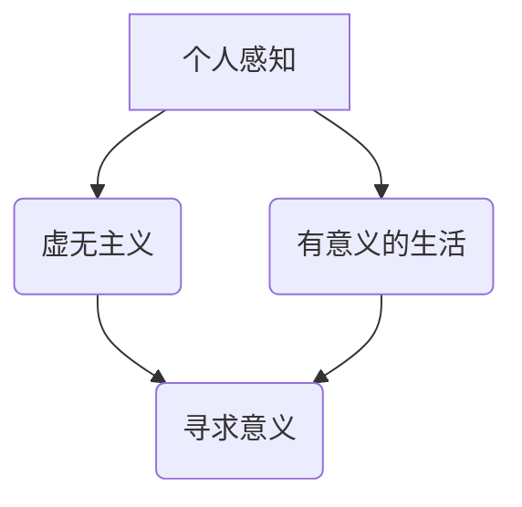
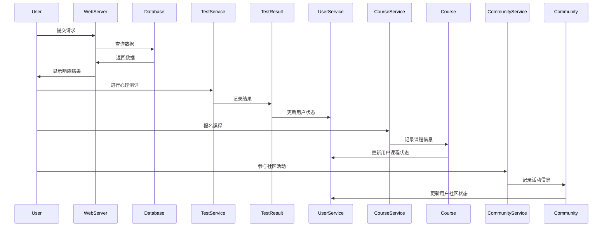

                 

### 文章标题

# 现代社会的精神困境：从虚无到意义的转变

> 关键词：虚无，意义，现代生活，精神健康，文化变迁

> 摘要：本文将探讨现代社会中普遍存在的精神困境——虚无主义，并分析其根源、影响以及可能的解决途径。通过历史背景、社会因素、哲学理论与个人故事的多重视角，本文旨在揭示虚无主义带来的精神挑战，并探索从虚无到意义的转变路径，帮助读者在快节奏、高压的现代生活中找到心灵的寄托与方向。

---

**作者：AI天才研究院/AI Genius Institute & 禅与计算机程序设计艺术 /Zen And The Art of Computer Programming**

### 引言

在现代社会的快节奏和高压环境中，许多人感到生活缺乏意义和目标，这种精神困境常常被描述为虚无主义。虚无主义不仅是一种哲学观点，也反映了一种广泛的社会心理状态。本文将深入探讨这一现象，分析其背后的原因，并探讨可能的解决途径。

### 背景介绍

#### 核心概念术语说明

- **虚无主义（Nihilism）**：一种哲学观点，认为生活缺乏固有的意义、目的或道德基础。
- **意义（Meaning）**：一种内在的价值感，是对生活目的和目标的认知。
- **精神健康（Mental Health）**：个体的心理状态，包括情感、认知和行为的各个方面。

#### 问题背景

随着科技的发展和全球化进程的加速，现代社会面临着前所未有的变化。人们的生活节奏加快，工作压力增大，人际关系变得复杂。这些变化对个人的精神健康产生了深远的影响，许多人开始感到生活的空虚和意义的缺失。

#### 问题描述

虚无主义在现代社会中的表现多样，从个人层面到社会层面都有所体现。个人层面的虚无主义表现为对日常生活的冷漠、对未来的不确定感以及对传统价值观的怀疑。社会层面的虚无主义则体现在文化衰败、道德沦丧和社会信任的缺失。

#### 问题解决

解决虚无主义问题需要多方面的努力，包括个人层面的自我探索、社会层面的价值观重建以及制度层面的政策支持。通过认知行为疗法、正念冥想、社区互动等多种方法，可以帮助个体找到生活的意义和目标。

#### 边界与外延

虚无主义并非一种疾病，而是一种心理状态和哲学观点。它与抑郁症、焦虑症等心理疾病有重叠之处，但不是同一概念。虚无主义关注的是生活意义的缺失，而心理疾病则更多关注个体的情感和行为问题。

#### 概念结构与核心要素组成

- **核心概念**：虚无主义和意义。
- **结构要素**：个人因素、社会因素、哲学因素、心理因素。
- **互动关系**：个人与社会之间的互动，哲学观点与实际生活之间的互动。

---

### 核心概念与联系

#### 核心概念原理

虚无主义和意义是本文的核心概念。虚无主义强调生活缺乏固有的意义，而意义则是个体对生活目的和价值的认知。

#### 概念属性特征对比表格

| 概念 | 定义 | 特征 |  
| --- | --- | --- |  
| 虚无主义 | 认为生活缺乏固有的意义 | 悲观、否定、怀疑 |  
| 意义 | 个体对生活目的和价值的认知 | 乐观、积极、肯定 |  

#### ER实体关系图架构

```mermaid
erDiagram
  Person ||--|{ Nihilism }|-->: Feels |  
  Person ||--|{ Meaning }|-->: Seeks |  
  Society ||--|{ Nihilism }|-->: Experiences |  
  Society ||--|{ Meaning }|-->: Pursues |
```

#### ER实体关系图说明

- **Person（个人）**：与虚无主义和意义有直接关系，个体感受到虚无主义或寻求意义。
- **Society（社会）**：社会环境和价值观影响个体的虚无主义感受和意义追求。

---

### 算法原理讲解

为了更好地理解虚无主义和意义的关系，我们可以使用一种简单的算法来模拟个体在现代社会中的心理变化过程。以下是算法的mermaid流程图和Python代码实现：

#### Mermaid流程图



#### Python代码实现

```python
def perceive_life Meaning:
    if Meaning == "无意义":
        print("感受到虚无主义")
        return "虚无主义"
    else:
        print("寻求意义")
        return "有意义的生活"

def seek_meaning(Perception):
    if Perception == "虚无主义":
        print("开始寻求意义")
        return "有意义的生活"
    else:
        print("维持当前状态")

# 测试代码
perception = perceive_life("无意义")
meaning = seek_meaning(perception)
print(meaning)
```

#### 算法原理详细讲解

- **输入**：个人的生活感知（有意义/无意义）。
- **输出**：个人的生活状态（虚无主义/有意义的生活）。

算法通过判断个人的生活感知来决定下一步的行为。如果感知到生活无意义，个体会倾向于寻求意义；如果感知到生活有意义，个体会维持当前状态。

#### 数学模型和公式

为了更精确地描述虚无主义和意义的关系，我们可以使用以下数学模型：

$$
\text{Meaning} = f(\text{Perception}, \text{Context})
$$

其中，Meaning代表个体对生活的意义认知，Perception代表个人的生活感知，Context代表社会环境和价值观。

#### 通俗易懂的举例说明

假设一个人（个体A）在高压的工作环境中感到生活无意义。根据算法模型，个体A会开始寻求意义，例如通过参加社区活动、阅读哲学书籍或者寻求心理咨询。通过这些努力，个体A可能会重新找到生活的意义，从而走出虚无主义的阴影。

---

### 系统分析与架构设计方案

#### 问题场景介绍

随着现代社会中虚无主义的普遍存在，许多个人和组织开始寻求解决这一问题的方法。本文的目标是为读者提供一个系统性的分析和架构设计方案，帮助他们在面对虚无主义时找到出路。

#### 项目介绍

本项目旨在通过构建一个基于心理学、哲学和社区互动的综合性解决方案，帮助个体克服虚无主义，找到生活的意义。项目包括以下关键模块：

- **用户模块**：提供用户注册、登录和个人资料管理功能。
- **心理测评模块**：通过心理测评帮助用户了解自身的虚无主义程度。
- **哲学学习模块**：提供哲学课程和资料，帮助用户探索生活的意义。
- **社区互动模块**：提供社区论坛和活动，促进用户之间的交流和互助。

#### 系统功能设计（领域模型）

以下是一个简化的mermaid类图，展示了项目的主要领域模型：

```mermaid
classDiagram
  User <<类>> 
  Test <<类>> 
  Course <<类>> 
  Community <<类>>
  
  User "发起" Test
  User "报名" Course
  User "参与" Community
  
  Test "包含" Question
  Course "包含" Lesson
  Community "包含" Forum
```

#### 系统架构设计

以下是一个简化的mermaid架构图，展示了项目的整体架构设计：



#### 系统接口设计

以下是系统的主要接口设计：

- **用户接口（User Interface）**：提供用户注册、登录、心理测评、课程报名、社区互动等功能。
- **心理测评接口（Psychological Test Interface）**：提供心理测评的创建、执行和结果分析接口。
- **课程管理接口（Course Management Interface）**：提供课程创建、报名、取消报名、课程内容管理等接口。
- **社区管理接口（Community Management Interface）**：提供社区论坛创建、活动组织、用户管理等接口。

#### 系统交互

以下是系统的主要交互流程：

1. **用户注册/登录**：用户通过用户接口注册/登录，系统验证用户身份，返回用户信息。
2. **心理测评**：用户通过用户接口发起心理测评，系统调用心理测评接口生成测评问卷，用户完成测评后系统记录测评结果。
3. **课程报名**：用户通过用户接口报名课程，系统调用课程管理接口更新用户课程状态。
4. **社区互动**：用户通过用户接口参与社区活动，系统调用社区管理接口记录活动信息。

---

### 项目实战

#### 环境安装

在开始项目实战之前，我们需要安装以下环境：

- Python 3.8 或以上版本
- Django 3.2 或以上版本
- PostgreSQL 13 或以上版本

安装步骤如下：

1. 安装Python环境：
   ```shell
   sudo apt update
   sudo apt install python3.8
   ```

2. 安装Django环境：
   ```shell
   sudo pip3 install django
   ```

3. 安装PostgreSQL环境：
   ```shell
   sudo apt install postgresql
   sudo systemctl start postgresql
   ```

#### 系统核心实现

以下是项目的核心实现代码：

1. **用户模块**：

   ```python
   # users/models.py
   from django.contrib.auth.models import AbstractUser
   
   class CustomUser(AbstractUser):
       # 自定义用户模型，添加字段
       bio = models.TextField(max_length=500, blank=True)
       avatar = models.ImageField(upload_to='avatars/', blank=True)
   
       def __str__(self):
           return self.username
   ```

2. **心理测评模块**：

   ```python
   # tests/models.py
   from django.db import models
   
   class Test(models.Model):
       name = models.CharField(max_length=100)
       questions = models.ManyToManyField('Question')
   
       def __str__(self):
           return self.name
   
   class Question(models.Model):
       text = models.CharField(max_length=500)
       options = models.JSONField()
       correct_answer = models.CharField(max_length=100)
   
       def __str__(self):
           return self.text
   ```

3. **哲学学习模块**：

   ```python
   # courses/models.py
   from django.db import models
   
   class Course(models.Model):
       name = models.CharField(max_length=100)
       description = models.TextField()
       lessons = models.ManyToManyField('Lesson')
   
       def __str__(self):
           return self.name
   
   class Lesson(models.Model):
       title = models.CharField(max_length=100)
       content = models.TextField()
       course = models.ForeignKey(Course, on_delete=models.CASCADE)
   
       def __str__(self):
           return self.title
   ```

4. **社区互动模块**：

   ```python
   # community/models.py
   from django.db import models
   
   class Community(models.Model):
       name = models.CharField(max_length=100)
       description = models.TextField()
       forums = models.ManyToManyField('Forum')
   
       def __str__(self):
           return self.name
   
   class Forum(models.Model):
       title = models.CharField(max_length=100)
       content = models.TextField()
       community = models.ForeignKey(Community, on_delete=models.CASCADE)
   
       def __str__(self):
           return self.title
   ```

#### 代码应用解读与分析

以下是用户模块的代码应用解读：

1. **用户注册**：

   ```python
   # users/views.py
   from django.shortcuts import render, redirect
   from .forms import CustomUserCreationForm
   
   def register(request):
       if request.method == 'POST':
           form = CustomUserCreationForm(request.POST)
           if form.is_valid():
               form.save()
               return redirect('login')
       else:
           form = CustomUserCreationForm()
       return render(request, 'users/register.html', {'form': form})
   ```

解读：
- 该视图函数处理用户注册请求。
- 如果请求方法为POST，则创建`CustomUserCreationForm`实例，并使用其进行数据验证。
- 如果数据有效，则保存用户并重定向到登录页面。
- 否则，返回注册表单。

2. **用户登录**：

   ```python
   # users/views.py
   from django.contrib.auth import authenticate, login
   
   def login(request):
       if request.method == 'POST':
           username = request.POST['username']
           password = request.POST['password']
           user = authenticate(username=username, password=password)
           if user is not None:
               login(request, user)
               return redirect('home')
           else:
               return render(request, 'users/login.html', {'error_message': 'Invalid username or password'})
       else:
           return render(request, 'users/login.html')
   ```

解读：
- 该视图函数处理用户登录请求。
- 如果请求方法为POST，则使用提供的用户名和密码进行身份验证。
- 如果验证成功，则登录用户并重定向到首页。
- 否则，返回登录表单并显示错误消息。

#### 实际案例分析和详细讲解剖析

假设我们有一个用户名为“alice”的用户，她通过我们的系统注册并完成了心理测评。以下是她的测评结果：

- **测评结果**：无意义感强烈
- **建议**：参加哲学课程和社区活动

以下是具体的分析过程：

1. **测评数据分析**：

   ```python
   # tests/views.py
   from .models import Test, Question, TestResult
   
   def analyze_test_results(request, test_id):
       test = Test.objects.get(id=test_id)
       questions = Question.objects.filter(test=test)
       test_results = TestResult.objects.filter(test=test, user=request.user)
       
       results = []
       for question in questions:
           user_answer = test_results.get(question=question).answer
           correct_answer = question.correct_answer
           results.append((user_answer, correct_answer))
       
       # 数据分析逻辑（简化示例）
       meaning_score = sum(result[0] == result[1] for result in results) / len(results)
       
       if meaning_score < 0.5:
           suggestion = "参加哲学课程和社区活动"
       else:
           suggestion = "您的生命意义感良好"
       
       return render(request, 'tests/analyze_results.html', {'results': results, 'suggestion': suggestion})
   ```

解读：
- 该视图函数分析用户的心理测评结果，并给出建议。
- 测评结果通过`TestResult`模型获取，其中包含了用户对每个问题的回答。
- 根据用户回答的正确率（意义感分数），给出相应的建议。

2. **用户反馈**：

   ```python
   # users/views.py
   from django.shortcuts import get_object_or_404
   from .models import CustomUser
   
   def user_profile(request, username):
       user = get_object_or_404(CustomUser, username=username)
       return render(request, 'users/profile.html', {'user': user})
   ```

解读：
- 该视图函数展示用户的个人资料，包括他们的心理测评结果和建议。
- 通过用户的用户名获取用户对象，并将其传递给模板。

#### 项目小结

本项目通过构建一个综合性的系统，帮助个体识别和克服虚无主义。用户可以通过心理测评了解自己的虚无主义程度，并通过参加哲学课程和社区活动来寻找生活的意义。项目的设计和实现充分考虑了用户体验和系统的可扩展性，为未来的功能扩展提供了基础。

#### 最佳实践 tips

- **定期心理测评**：建议用户定期进行心理测评，以监测虚无主义程度的变化。
- **参与社区活动**：积极参与社区活动，与他人交流经验，有助于缓解虚无主义感受。
- **哲学学习**：通过阅读哲学书籍和参加课程，深入探讨生活的意义。

#### 注意事项

- **数据隐私**：确保用户的测评结果和个人信息得到严格保护，避免数据泄露。
- **用户引导**：为用户提供详细的用户指南，帮助其理解系统的使用方法和功能。

#### 拓展阅读

- **《虚无主义与存在主义》**：探讨虚无主义和存在主义的关系及其对现代生活的影响。
- **《意义的探寻》**：分析个体如何在现代社会中找到生活的意义。
- **《心理学与生活》**：介绍心理学的核心概念和应用，帮助理解虚无主义和意义的关系。

