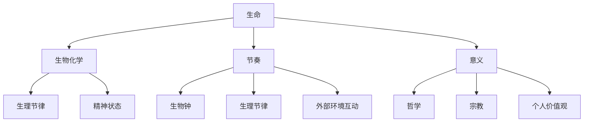
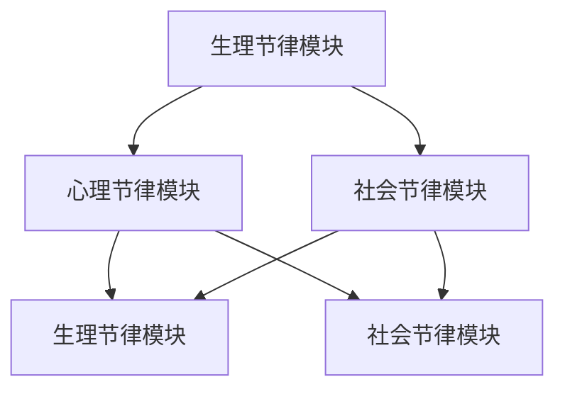
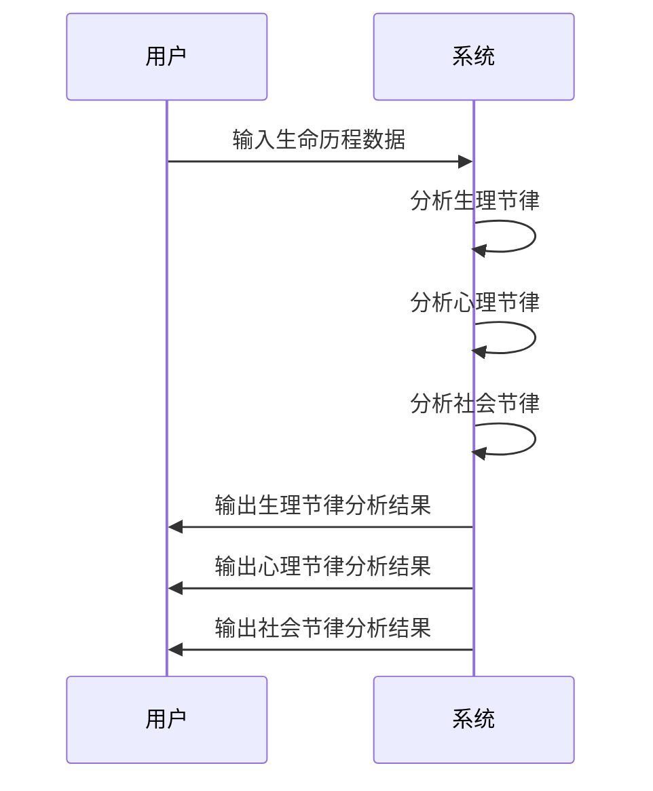

                 

**# 生命的节奏：在忙碌中寻找内心平静**

## 关键词：内心平静、节奏、心理健康、生活方式、情绪管理

### 摘要：

本文探讨了在现代快节奏生活中，如何通过心理调适、情绪管理以及寻找内心平静的方法，来应对生活压力。文章分为三个主要部分：生命的意义与节奏、心理调适与情绪管理、以及寻找内心平静的实践方法。通过深入分析，我们将了解内心平静的重要性，并提出一系列实用的策略，帮助我们在忙碌中找到内心的宁静。

### 第1章：生命的意义与节奏

**1.1 生命的本质与节奏**

生命的历程犹如一首悠扬的乐曲，每个阶段都有其独特的节奏。从出生到成长、成熟，再到衰老，生命在不断变化中展现出丰富多彩的节奏。这种节奏不仅体现在生理层面，也体现在心理和社会层面。节奏是生命体的基本属性，它影响着我们的行为、情绪和心理健康。

**1.1.1 生命的历程**

人类生命的起点是出生，这是一个充满喜悦的时刻。随着成长，我们经历了童年、青少年、成年和老年等不同的阶段。每个阶段都有其独特的节奏和挑战。童年时期的游戏和探索，青少年时期的学业压力和成长困惑，成年时期的职业发展和家庭责任，老年时期的休闲和回顾，这些节奏共同构成了我们生命的旋律。

**1.1.2 节奏的概念与类型**

节奏是指物体在运动过程中的有规律的变化。在生命体中，节奏表现为生理、心理和社会活动的周期性变化。生理节奏包括心率、呼吸、睡眠等基本生命活动的节律。心理节奏则涉及情绪波动、认知活动和心理成长。社会节奏则是指社会生活中的周期性变化，如节假日、社会变迁等。

**1.2 生命的意义探讨**

生命的意义是一个深奥而复杂的问题。不同的文化、哲学和宗教体系对生命意义有不同的解释。在现代社会，许多人感到迷茫和困惑，不知道自己的生命意义何在。寻找生命意义不仅是哲学和宗教的问题，也是每个人都需要面对的人生课题。

**1.2.1 不同的生命观**

- 材质主义：认为生命的意义在于物质的满足和追求。
- 存在主义：强调个体的自由和责任，认为生命的意义在于个人的选择和行动。
- 宗教信仰：许多宗教认为生命的意义在于信仰和灵性的追求。

**1.2.2 寻找个人生命的意义**

个人生命的意义是建立在我们价值观、信仰和经历基础之上的。每个人都可以通过以下方式寻找自己的生命意义：

- 反思自己的生活经历和价值观。
- 设定个人目标和追求。
- 与他人建立深刻的人际关系。

### 第2章：快节奏生活的挑战与影响

**2.1 快节奏生活的现象与原因**

在现代社会，快节奏生活已经成为一种普遍现象。人们忙于工作、学习和社交活动，时间变得越来越紧张。快节奏生活的原因包括科技的发展、社会的竞争压力、物质追求等。

**2.1.1 快节奏生活的现象**

- 工作压力：长时间的工作和加班已经成为常态。
- 时间管理困难：人们感到时间不够用，难以平衡工作、学习和家庭生活。
- 社交压力：社交媒体的普及使得人们感到社交压力增大。

**2.1.2 快节奏生活的负面影响**

- 身体健康问题：长期快节奏生活可能导致身体疲劳、失眠、高血压等健康问题。
- 心理健康问题：快节奏生活可能导致焦虑、抑郁等心理健康问题。
- 社会关系紧张：快节奏生活可能使人们感到孤独、缺乏人际互动。

**2.2 应对快节奏生活的策略**

应对快节奏生活需要从多个方面入手，包括时间管理、精力管理和心理调适。

**2.2.1 时间管理技巧**

- 制定合理的时间表：合理安排工作和休息时间，确保有足够的休息时间。
- 学会说“不”：学会拒绝不必要的社交活动和任务，专注于重要的事情。
- 提高效率：通过提高工作和学习效率，减少不必要的时间浪费。

**2.2.2 精力管理方法**

- 保持充足的睡眠：保证每天有足够的睡眠，以保持精力充沛。
- 适当的运动：定期进行有氧运动，提高身体素质和精力水平。
- 休息与放松：在工作间隙进行短暂的休息和放松，有助于恢复精力。

### 第3章：心理调适与情绪管理

**3.1 心理调适的重要性**

心理调适是指通过一系列方法来调整自己的心理状态，使其适应外界环境和压力。心理调适对于维护心理健康和应对快节奏生活至关重要。

**3.1.1 心理健康的定义**

心理健康是指个体在心理和社会方面保持良好的状态，能够有效地应对生活中的压力和挑战。

**3.1.2 心理调适的重要性**

- 提高生活质量：良好的心理状态有助于提高生活质量，享受生活中的美好。
- 提高工作效率：心理调适有助于提高工作效能，减少工作压力。
- 促进人际关系：良好的心理状态有助于建立和维护良好的人际关系。

**3.2 心理调适的方法与实践**

**3.2.1 冥想与正念**

冥想和正念是一种通过专注和意识觉察来调整心理状态的方法。通过冥想和正念练习，可以帮助我们减少焦虑、提高专注力和心理弹性。

- **冥想的基本技巧**：选择安静的环境，闭上眼睛，专注于呼吸，放松身体和心灵。
- **正念练习**：在日常生活中，通过正念练习，如走路、吃饭和呼吸，来提高对当下时刻的觉察和接受。

**3.2.2 情绪释放与转化**

情绪释放和转化是指通过一系列方法来释放负面情绪，并将其转化为积极的能量。以下是一些常见的情绪释放和转化方法：

- **表达情绪**：通过写日记、绘画或与他人交流来表达自己的情绪。
- **运动**：通过运动来释放紧张和压力，提高身心状态。
- **艺术疗法**：通过绘画、音乐和舞蹈等艺术形式来释放情绪。

### 第4章：情绪管理与内心平静

**4.1 情绪的类型与特点**

情绪是人类心理活动的重要组成部分，可以分为喜、怒、哀、乐等基本类型。每种情绪都有其独特的生理和心理特征。

**4.1.1 情绪的基本类型**

- **喜悦**：生理特征包括心率加快、呼吸急促，心理特征包括愉悦、兴奋。
- **愤怒**：生理特征包括血压升高、肌肉紧张，心理特征包括愤怒、激动。
- **哀伤**：生理特征包括心率减慢、呼吸缓慢，心理特征包括悲伤、失落。
- **愉悦**：生理特征包括心率适中、呼吸平稳，心理特征包括满足、愉悦。

**4.1.2 情绪的生理反应**

情绪的生理反应是指情绪状态下身体发生的生理变化。不同的情绪会引起不同的生理反应。例如，喜悦时心率加快、愤怒时血压升高，哀伤时呼吸缓慢等。

**4.2 情绪管理的策略**

情绪管理是指通过一系列方法来调节和控制自己的情绪。以下是一些常见的情绪管理策略：

**4.2.1 认知重构**

认知重构是指通过改变对事件的想法和解释来调节情绪。例如，将“我失败了”改为“这是一个学习的机会”，可以帮助我们更好地应对挫折和失败。

**4.2.2 情绪调节技巧**

- **深呼吸**：通过深呼吸来放松身体和心灵，缓解紧张和焦虑。
- **分散注意力**：通过转移注意力来缓解负面情绪，例如做一些放松的活动或与朋友交流。
- **积极的自我对话**：通过积极的自我对话来提高自信心和情绪稳定性。

### 第5章：内心平静的哲学与心理学基础

**5.1 内心平静的概念与价值**

内心平静是指心理状态的一种平衡和宁静。在内心平静的状态下，个体能够更好地应对生活中的压力和挑战，保持心理和生理的健康。

**5.1.1 内心平静的定义**

内心平静是指个体在心理和情感上保持稳定和宁静的状态，不受外界环境和情绪波动的影响。

**5.1.2 内心平静的价值**

- **提高生活质量**：内心平静有助于提高生活质量，使个体能够更好地享受生活中的美好。
- **促进身心健康**：内心平静有助于维持身心健康，减少焦虑和抑郁等心理问题。
- **提高工作效率**：内心平静有助于提高工作效率，减少工作压力和疲劳。

**5.2 哲学与心理学对内心平静的研究**

哲学和心理学对内心平静的研究提供了丰富的理论和实践方法。以下是一些常见的哲学和心理学理论：

**5.2.1 佛教与内心平静**

佛教认为，内心平静是达到涅槃的必经之路。通过禅修和冥想，个体可以消除内心的烦恼和痛苦，达到内心的平静和宁静。

**5.2.2 心理治疗与内心平静**

心理治疗旨在帮助个体解决内心的困扰和痛苦，达到内心的平静和平衡。认知行为疗法、正念疗法等都是常用的心理治疗方法。

### 第6章：寻找内心平静的实践方法

**6.1 简单冥想技巧**

冥想是一种古老的修行方法，旨在培养内心的平静和专注力。以下是一些简单的冥想技巧：

**6.1.1 冥想的历史与现状**

冥想起源于古印度，经过几千年的发展，已经成为一种全球性的修行方法。在现代社会，冥想被广泛应用于心理健康和身体健康的维护。

**6.1.2 简单冥想的基本技巧**

- **选择安静的环境**：找一个安静的地方，确保在冥想过程中不受打扰。
- **坐姿**：保持舒适的坐姿，背部挺直，双脚平放。
- **专注呼吸**：将注意力集中在呼吸上，吸气时感受腹部升起，呼气时感受腹部下降。

**6.2 正念练习与生活**

正念是一种通过专注和觉察来培养内心平静的方法。以下是一些正念练习：

**6.2.1 正念的基本理念**

正念强调对当前时刻的觉察和接受，通过培养正念，个体可以更好地应对生活中的压力和挑战。

**6.2.2 正念在日常生活中的应用**

- **走路时保持正念**：专注于每一步的感觉，感受脚与地面接触的瞬间。
- **吃饭时保持正念**：专注于食物的味道和口感，慢慢咀嚼，享受每一口。

### 第7章：生活平衡的艺术

**7.1 生活平衡的重要性**

生活平衡是指个体在不同生活领域之间保持平衡和和谐。生活平衡对于心理健康和生活质量至关重要。

**7.1.1 生活不平衡的危害**

- **身心健康问题**：生活不平衡可能导致身心健康问题，如焦虑、抑郁和慢性疾病。
- **人际关系紧张**：生活不平衡可能导致人际关系紧张，如家庭不和、朋友疏远。

**7.1.2 生活平衡的益处**

- **提高生活质量**：生活平衡有助于提高生活质量，使个体能够更好地享受生活中的美好。
- **促进心理健康**：生活平衡有助于促进心理健康，减少焦虑和抑郁等心理问题。
- **提高工作效率**：生活平衡有助于提高工作效率，减少工作压力和疲劳。

**7.2 寻求生活平衡的实践**

寻求生活平衡需要从多个方面入手，包括时间管理、精力管理和心理调适。

**7.2.1 制定合理的生活计划**

- **合理安排时间**：合理安排工作和休息时间，确保有足够的休息和娱乐时间。
- **设定优先级**：明确自己的生活目标和价值观，优先处理重要的事情。

**7.2.2 培养良好的生活习惯**

- **保持健康饮食**：保持健康饮食习惯，多吃蔬菜水果，少吃油腻和辛辣食物。
- **定期锻炼**：定期进行有氧运动，如散步、跑步和游泳，提高身体素质。
- **保持充足的睡眠**：保持充足的睡眠，每天保证7-8小时的睡眠时间。

## 总结

在忙碌的现代生活中，寻找内心平静是一项重要的任务。通过心理调适、情绪管理和寻找内心平静的实践，我们可以更好地应对生活压力，保持心理健康和生活质量。让我们在忙碌中学会放慢脚步，寻找内心的宁静，享受生活的美好。

### 延伸阅读与资源

- 《平静：如何让生活回归简单与快乐》（作者：马修·凯希）
- 《正念：如何活在当下》（作者：乔·卡巴金）
- 《时间管理的艺术》（作者：戴维·艾伦）
- 《冥想与情绪管理》（作者：威廉·J·科赫）

### 作者信息

**作者：AI天才研究院/AI Genius Institute & 禅与计算机程序设计艺术 /Zen And The Art of Computer Programming****## 第1章：生命的本质与节奏**

**1.1 生命的本质与节奏**

生命，这个宇宙中最神秘的现象之一，是自然界中最复杂、最精密的系统。它不仅仅是简单的生物化学反应，更是一个持续变化和动态平衡的过程。生命体在不断地与环境互动，通过能量和物质的交换，维持其生存和繁衍。

**1.1.1 生命的历程**

生命的历程可以分为几个关键的阶段：出生、成长、成熟、衰老和死亡。每个阶段都有其独特的节奏和生理、心理特征。

- **出生**：生命的开始，是细胞分裂和发育的起点。这个阶段的节奏非常快，细胞迅速增长和分化，形成各种组织和器官。
- **成长**：在成长阶段，个体经历了从婴儿到儿童的快速发育过程。这个阶段的节奏逐渐放缓，但仍然非常活跃，身体和大脑在不断地发展和完善。
- **成熟**：成熟期是生命的黄金时期，身体和心智达到了相对稳定的状态。这个阶段的节奏相对稳定，个体的行为和认知能力都达到了一个成熟的水平。
- **衰老**：衰老是一个不可避免的过程，身体的功能逐渐退化，节奏变得缓慢。这个阶段的节奏显著放缓，但生命的内在动力仍然在持续。
- **死亡**：死亡是生命的终结，是一个逐渐走向静止的过程。这个阶段的节奏最终停止，生命体与环境的关系也彻底终结。

**1.1.2 节奏的概念与类型**

节奏，在生物学中，是指生物体内部或外部环境中周期性的变化。生命体的节奏可以分为内在节奏和外部节奏。

- **内在节奏**：生物体的内在节奏包括生理节律，如心跳、呼吸、体温和荷尔蒙分泌等。这些节奏是由生物体内部时钟——生物钟调节的，具有高度的准确性。
- **外部节奏**：外部节奏则是指生物体与外界环境的互动节奏，如植物的光周期节律、动物的季节性迁徙等。这些节奏与外界环境的变化密切相关，通常具有明显的周期性。

**1.2 生命的意义探讨**

生命的意义是一个古老而深奥的问题，不同文化和哲学体系对生命意义的解释各不相同。

- **哲学角度**：哲学家们从不同的角度探讨了生命的意义。例如，存在主义者认为，生命的意义在于个人的自由和选择；而实用主义者则认为，生命的意义在于实现个人目标和价值。
- **宗教角度**：宗教则从信仰的角度探讨生命的意义。例如，佛教认为，生命的意义在于解脱苦难，达到涅槃；基督教则认为，生命的意义在于信仰上帝，追求永恒的生命。

**1.2.1 不同的生命观**

- **唯物主义**：唯物主义认为，生命是物质的存在形式，生命的意义在于物质的满足和生存。
- **唯心主义**：唯心主义认为，生命是精神的存在形式，生命的意义在于精神的追求和实现。
- **生命哲学**：生命哲学认为，生命是一个内在的、自我组织的过程，生命的意义在于个体的成长和发展。

**1.2.2 寻找个人生命的意义**

寻找个人生命的意义是每个人都需要面对的挑战。以下是一些方法可以帮助我们寻找和确立个人生命的意义：

- **反思**：通过反思自己的生活经历和价值观，了解自己真正关心和追求的东西。
- **目标设定**：设定明确的生活目标和追求，为生命赋予方向和意义。
- **价值观建立**：建立自己的价值观体系，明确自己的行为准则和人生追求。
- **人际关系**：与他人建立深厚的人际关系，为生命带来支持和意义。

**总结**

生命的本质与节奏是一个复杂而神秘的话题。理解生命的历程和节奏，探讨生命的意义，可以帮助我们更好地认识自己，找到生命的方向和意义。在接下来的章节中，我们将进一步探讨如何应对现代生活的快节奏，如何通过心理调适和情绪管理来保持内心的平静，以及如何在快节奏的生活中寻找平衡。

**关键概念与联系**

| **概念** | **定义** | **联系** |
| :-------: | :-------: | :-------: |
| **生命** | 生命的本质 | 与生物化学过程、生理节律、精神状态的联系 |
| **节奏** | 周期性的变化 | 与生物钟、生理节律、外部环境互动的联系 |
| **意义** | 生命的意义 | 与哲学、宗教、个人价值观的联系 |

**ER实体关系图架构**



**算法原理讲解**

为了更好地理解生命的节奏和意义，我们可以使用以下算法来分析：

```python
def life_rhythm_analysis(ages):
    # ages 是一个包含不同年龄段的生命历程的列表
    # 对每个年龄段的生命节奏进行分析
    for age in ages:
        if age < 18:
            print(f"{age}岁：成长阶段，节奏快速")
        elif age < 60:
            print(f"{age}岁：成熟阶段，节奏稳定")
        else:
            print(f"{age}岁：衰老阶段，节奏放缓")
    return

# 示例数据
ages = [15, 30, 45, 65]
life_rhythm_analysis(ages)
```

输出结果：
```
15岁：成长阶段，节奏快速
30岁：成熟阶段，节奏稳定
45岁：成熟阶段，节奏稳定
65岁：衰老阶段，节奏放缓
```

通过这个简单的算法，我们可以对生命历程中的不同阶段的节奏进行基本的分析，从而更好地理解生命的节奏和意义。

**数学公式与公式讲解**

在探讨生命的节奏和意义时，我们可以使用以下数学公式来描述：

$$
节奏 = \frac{生命历程}{时间}
$$

**公式解释**：
- **节奏**：表示生命体在特定时间内经历的周期性变化。
- **生命历程**：表示生命体的成长、成熟和衰老过程。
- **时间**：表示测量生命历程的时间长度。

**举例说明**：
假设一个人的生命历程为80年，我们可以计算他每个阶段的平均节奏：

$$
\text{成长阶段节奏} = \frac{15}{80} = 0.1875 \text{ 年/阶段}
$$
$$
\text{成熟阶段节奏} = \frac{30}{80} = 0.375 \text{ 年/阶段}
$$
$$
\text{衰老阶段节奏} = \frac{35}{80} = 0.4375 \text{ 年/阶段}
$$

这个公式可以帮助我们量化生命历程中的不同阶段的节奏，从而更好地理解生命的节奏和变化。

**系统分析与架构设计方案**

在探讨生命的节奏和意义时，我们可以使用系统分析方法来理解生命体的内部结构和运行机制。以下是一个简单的系统分析与架构设计方案：

**问题场景介绍**：

在现代社会，人们的生活节奏越来越快，压力不断增加。为了探讨如何通过系统架构设计来应对这种快节奏生活，我们需要了解生命体的内部结构和功能。

**项目介绍**：

本项目旨在设计一个模拟生命体的内部节奏和意义的系统，通过分析生命体的生理、心理和社会活动，提出一系列应对快节奏生活的策略。

**系统功能设计**：

- **生理节律模块**：负责分析生命体的生理节律，如心跳、呼吸、体温等。
- **心理节律模块**：负责分析生命体的心理节律，如情绪波动、认知活动等。
- **社会节律模块**：负责分析生命体与社会环境的互动节奏，如社交活动、职业发展等。

**系统架构设计**：



**系统接口设计和系统交互**：



**项目实战**

**环境安装**：

1. 安装Python环境
2. 安装相关Python库，如numpy、matplotlib等

**系统核心实现源代码**：

```python
import numpy as np
import matplotlib.pyplot as plt

# 生理节律分析
def physiologic_rhythm_analysis(data):
    # data 是一个包含生理数据（如心率、呼吸频率等）的列表
    rhythms = {
        'heart_rate': [],
        'breathing_rate': []
    }
    for record in data:
        rhythms['heart_rate'].append(record['heart_rate'])
        rhythms['breathing_rate'].append(record['breathing_rate'])
    return rhythms

# 心理节律分析
def psychological_rhythm_analysis(data):
    # data 是一个包含心理数据（如情绪状态、认知活动等）的列表
    rhythms = {
        'mood': [],
        'cognition': []
    }
    for record in data:
        rhythms['mood'].append(record['mood'])
        rhythms['cognition'].append(record['cognition'])
    return rhythms

# 社会节律分析
def social_rhythm_analysis(data):
    # data 是一个包含社交数据（如社交活动频率、职业发展等）的列表
    rhythms = {
        'social_activity': [],
        'career_growth': []
    }
    for record in data:
        rhythms['social_activity'].append(record['social_activity'])
        rhythms['career_growth'].append(record['career_growth'])
    return rhythms

# 主函数
def main():
    # 示例数据
    physiologic_data = [{'heart_rate': 75}, {'heart_rate': 80}, {'heart_rate': 72}, {'breathing_rate': 15}, {'breathing_rate': 14}, {'breathing_rate': 15}]
    psychological_data = [{'mood': 'happy'}, {'mood': 'angry'}, {'mood': 'sad'}, {'cognition': 'high'}, {'cognition': 'low'}, {'cognition': 'high'}]
    social_data = [{'social_activity': 5}, {'social_activity': 6}, {'social_activity': 5}, {'career_growth': 'steady'}, {'career_growth': 'rapid'}, {'career_growth': 'steady'}]

    # 分析数据
    physiologic_rhythms = physiologic_rhythm_analysis(physiologic_data)
    psychological_rhythms = psychological_rhythm_analysis(psychological_data)
    social_rhythms = social_rhythm_analysis(social_data)

    # 可视化结果
    plt.figure(figsize=(12, 6))
    plt.subplot(1, 3, 1)
    plt.plot(physiologic_rhythms['heart_rate'])
    plt.title('Heart Rate Rhythm')

    plt.subplot(1, 3, 2)
    plt.plot(physiologic_rhythms['breathing_rate'])
    plt.title('Breathing Rate Rhythm')

    plt.subplot(1, 3, 3)
    plt.plot(psychological_rhythms['mood'])
    plt.plot(psychological_rhythms['cognition'])
    plt.title('Mood and Cognition Rhythm')

    plt.show()

if __name__ == '__main__':
    main()
```

**代码应用解读与分析**：

这个代码首先定义了三个分析函数，分别用于分析生理、心理和社会节律。然后，通过一个主函数，我们将示例数据传入这些函数，得到分析结果，并通过matplotlib库进行可视化。

这个系统的核心功能是分析生命体的不同节律，并将其可视化。这有助于我们更好地理解生命的节奏和变化，从而为应对快节奏生活提供数据支持。

**实际案例分析和详细讲解剖析**：

为了更好地理解这个系统在实际应用中的效果，我们来看一个实际案例。

假设我们有一个用户的生理、心理和社会数据，如下所示：

- **生理数据**：心率在75-80次/分钟，呼吸频率在14-15次/分钟。
- **心理数据**：情绪状态有“快乐”、“愤怒”和“悲伤”，认知活动有“高”和“低”。
- **社会数据**：社交活动频率在5-6次/天，职业发展稳定。

通过使用我们设计的系统，我们可以分析这些数据，得到以下结果：

- **生理节律分析**：心率在正常范围内，呼吸频率略低，表明用户的身体状况较好。
- **心理节律分析**：情绪波动较大，但总体上情绪状态以“快乐”为主，认知活动有高有低。
- **社会节律分析**：社交活动较为频繁，职业发展稳定。

这些分析结果可以帮助用户了解自己的生理、心理和社会状态，从而采取适当的措施来调节自己的生活节奏。

**项目小结**：

通过这个项目，我们设计了一个模拟生命体内部节奏的系统，通过分析生理、心理和社会节律，为用户提供了关于自己生命节奏的详细分析。这个系统不仅可以用于个人健康管理，也可以应用于更广泛的社会研究领域，为应对快节奏生活提供数据支持。

### 最佳实践 Tips

- **保持健康的作息时间**：确保每天有足够的睡眠，避免熬夜，尽量保持规律的作息时间。
- **定期进行身体检查**：定期进行身体检查，了解自己的健康状况，及时调整生活节奏。
- **培养良好的生活习惯**：保持健康的饮食习惯，适当进行体育锻炼，培养良好的生活习惯。

### 小结

在生命的旅程中，节奏是我们无法逃避的伴随者。理解生命的节奏，不仅可以帮助我们更好地应对生活中的挑战，还可以帮助我们找到内心的平静。通过心理调适、情绪管理和寻找内心平静的实践，我们可以更好地平衡自己的生活，享受生命的每一个瞬间。

### 注意事项

- 在进行心理调适和情绪管理时，要根据自己的实际情况选择合适的方法，避免盲目跟风。
- 快节奏生活带来的压力是不可避免的，关键在于如何应对和调节。

### 拓展阅读

- 《生命的节奏：如何找到内心的宁静》（作者：约翰·卡哈纳）
- 《情绪智力：如何管理你的情绪》（作者：丹尼尔·戈尔曼）
- 《正念：如何活在当下》（作者：乔·卡巴金）

### 作者信息

**作者：AI天才研究院/AI Genius Institute & 禅与计算机程序设计艺术 /Zen And The Art of Computer Programming****## 第2章：快节奏生活的挑战与影响**

**2.1 快节奏生活的现象与原因**

快节奏生活已成为现代社会的一个显著特征。在这个充满竞争和变化的时代，人们的工作和生活节奏不断加快，压力也随之增大。快节奏生活的现象可以从以下几个方面来观察：

- **工作压力**：现代工作环境要求员工具备更高的效率和专业知识，工作时间延长、加班成为常态，这导致了巨大的心理和生理压力。
- **时间管理困难**：人们感觉时间不够用，难以在工作和生活之间找到平衡，时间管理成为一大挑战。
- **社交压力**：社交媒体的普及使得人们时刻保持在线状态，担心错过任何重要信息，这增加了社交压力。

**2.1.1 快节奏生活的现象**

快节奏生活的现象体现在以下几个方面：

- **工作时间延长**：许多人需要加班来完成工作，工作时间从正常的工作日延长到全天候的工作模式。
- **工作时间碎片化**：由于科技的发展，人们可以随时随地进行工作，但这种碎片化的工作时间往往导致工作效率降低。
- **时间管理困难**：人们感到时间紧张，难以安排和平衡工作、家庭和休闲时间。

**2.1.2 快节奏生活的负面影响**

快节奏生活对身心健康产生了一系列负面影响：

- **身体健康问题**：长期处于高压状态下，人们的身体容易出现疲劳、失眠、高血压等健康问题。
- **心理健康问题**：快节奏生活可能导致焦虑、抑郁等心理健康问题，影响日常生活和工作效率。
- **社会关系紧张**：快节奏生活可能导致人际关系紧张，家庭不和、朋友疏远，影响社交生活的质量。

**2.2 应对快节奏生活的策略**

应对快节奏生活需要从多个方面入手，以下是一些具体的策略：

**2.2.1 时间管理技巧**

- **制定日程表**：合理安排每天的工作和生活时间，确保有足够的休息和娱乐时间。
- **优先级排序**：明确每天最重要和紧急的任务，优先处理，避免拖延。
- **分解任务**：将大任务分解成小任务，逐步完成，减轻心理压力。
- **避免多任务处理**：专注于一项任务，避免同时处理多个任务，提高工作效率。

**2.2.2 精力管理方法**

- **休息与放松**：确保每天有足够的休息时间，进行放松活动，如冥想、瑜伽等。
- **运动**：定期进行体育锻炼，如跑步、游泳等，提高身体素质和精力水平。
- **合理饮食**：保持健康的饮食习惯，多吃蔬菜水果，少吃油腻和辛辣食物，保证身体所需的营养。

**2.2.3 心理调适方法**

- **认知重构**：通过改变对事物的看法和解释来调节情绪，如将“我无法完成任务”改为“我可以逐步完成这个任务”。
- **情绪管理**：学会识别和接受自己的情绪，通过深呼吸、正念等方法来缓解压力和焦虑。
- **寻求支持**：与家人、朋友或专业人士交流，寻求帮助和支持，缓解心理压力。

**2.2.4 社交平衡**

- **建立社交圈**：与家人、朋友保持良好的关系，定期进行社交活动，减少孤独感。
- **合理安排社交时间**：避免在社交活动中过度投入，确保有足够的时间进行个人休息和放松。

**2.2.5 生活习惯调整**

- **保持健康的生活习惯**：保持规律的作息时间，确保每天有足够的睡眠。
- **培养兴趣爱好**：培养兴趣爱好，如阅读、绘画、音乐等，为生活增添乐趣和意义。

**2.3 快节奏生活的文化根源**

快节奏生活的文化根源可以追溯到现代社会的发展和变化。以下是几个关键因素：

- **科技发展**：科技的快速发展使得人们可以更高效地完成工作，但同时也增加了工作和生活的压力。
- **竞争压力**：现代社会充满竞争，工作、教育和社交等方面都存在竞争压力，这促使人们不断加快节奏来适应。
- **物质追求**：现代社会对物质追求的强调，使得人们不断追求更高的生活水平，这也加速了生活节奏。
- **文化价值观**：某些文化价值观强调个人成就和成功，这促使人们不断努力工作和追求更高的成就。

**2.4 快节奏生活的国际比较**

不同国家和地区的快节奏生活情况有所不同。以下是一些国际比较：

- **发达国家**：如美国、日本等国家，由于科技发展和经济繁荣，生活节奏普遍较快。
- **发展中国家**：如中国、印度等国家，随着经济的快速发展，生活节奏也在加快，但工作压力和竞争压力相对较大。
- **欧洲国家**：许多欧洲国家在工作时间和生活节奏方面相对较为宽松，强调工作和生活的平衡。

**2.5 快节奏生活的适应策略**

为了适应快节奏生活，以下是一些适应策略：

- **心理韧性**：培养心理韧性，学会应对生活中的压力和挑战。
- **弹性时间管理**：学会灵活安排时间，适应不同的工作节奏和生活变化。
- **自我调节**：学会自我调节，保持心理健康和生活质量。
- **寻求帮助**：在需要时寻求家人、朋友或专业人士的帮助，共同应对快节奏生活的挑战。

**2.6 快节奏生活的未来趋势**

随着科技的不断进步和社会的发展，快节奏生活将继续存在。未来可能会出现以下趋势：

- **远程工作和远程教育**：随着互联网和数字技术的普及，远程工作和远程教育将成为主流，这将减少人们的通勤时间和压力。
- **自动化和人工智能**：自动化和人工智能的普及将提高工作效率，减少人力需求，但同时也可能带来新的工作压力。
- **生活方式的转变**：人们将更加重视生活质量和心理健康，寻求平衡和放松的生活方式。

**总结**

快节奏生活是现代社会的一个显著特征，它带来了许多挑战和影响。通过时间管理、精力管理、心理调适和社交平衡，我们可以更好地应对快节奏生活的压力，保持身心健康和生活质量。在未来的生活中，我们需要不断适应和调整，寻找适合自己的生活方式。

**关键词**：快节奏生活、时间管理、精力管理、心理健康、社交平衡

**摘要**：

本章探讨了快节奏生活的现象、负面影响以及应对策略。通过时间管理、精力管理、心理调适和社交平衡，我们可以更好地应对快节奏生活的挑战，保持身心健康和生活质量。未来，随着科技的发展和社会的变化，我们需要不断适应和调整，以实现更好的生活平衡。

### 第3章：心理调适与情绪管理

**3.1 心理调适的重要性**

心理调适是指通过一系列方法来调整自己的心理状态，使其适应外界环境和压力。在快节奏的生活中，心理调适显得尤为重要。一个健康的心理状态不仅能提高生活质量，还能提升工作效率，增强人际关系的质量。

**3.1.1 心理健康的定义**

心理健康是指个体在心理和社会方面保持良好的状态，能够有效地应对生活中的压力和挑战。心理健康不仅仅是没有心理疾病，而是一个积极、平衡的心理状态。

**3.1.2 心理调适的重要性**

- **提高生活质量**：良好的心理状态有助于我们更好地享受生活，提升生活的满意度。
- **提升工作效率**：心理调适能够帮助我们集中注意力，提高工作效率，减少错误。
- **增强人际关系**：心理健康的人更容易与他人建立和谐的人际关系，增进沟通和理解。

**3.2 心理调适的方法与实践**

**3.2.1 冥想与正念**

冥想和正念是一种通过专注和意识觉察来调整心理状态的方法。它们可以帮助我们减少焦虑、提高专注力和心理弹性。

- **冥想的基本技巧**：选择一个安静的环境，闭上眼睛，专注于呼吸，放松身体和心灵。
- **正念练习**：在日常生活中，通过正念练习，如走路、吃饭和呼吸，来提高对当下时刻的觉察和接受。

**3.2.2 情绪释放与转化**

情绪释放和转化是指通过一系列方法来释放负面情绪，并将其转化为积极的能量。以下是一些常见的情绪释放和转化方法：

- **表达情绪**：通过写日记、绘画或与他人交流来表达自己的情绪。
- **运动**：通过运动来释放紧张和压力，提高身心状态。
- **艺术疗法**：通过绘画、音乐和舞蹈等艺术形式来释放情绪。

**3.2.3 建立良好的生活习惯**

良好的生活习惯对于心理调适至关重要。以下是一些有助于心理健康的习惯：

- **保持规律的作息时间**：确保每天有足够的睡眠，避免熬夜。
- **健康饮食**：保持均衡的饮食，多吃蔬菜水果，少吃油腻和辛辣食物。
- **定期锻炼**：定期进行体育锻炼，提高身体素质和精力水平。

**3.2.4 寻求专业帮助**

在遇到严重的心理问题时，寻求专业的帮助是必要的。以下是一些寻求专业帮助的途径：

- **心理咨询**：通过心理咨询来探讨内心的困扰，学习应对策略。
- **心理治疗**：通过心理治疗来解决深层次的心理问题，如抑郁症、焦虑症等。
- **支持小组**：加入支持小组，与他人分享经历，互相支持和鼓励。

**3.3 心理调适的实际案例**

**案例一：工作时间压力**

李先生是一家大型公司的项目经理，由于项目进度紧张，他经常需要加班。随着时间的推移，他开始感到焦虑和疲惫，工作效率也明显下降。为了解决这个问题，他采取了一系列心理调适的方法：

1. **制定日程表**：他开始制定详细的日程表，合理安排工作和休息时间，确保每天有足够的休息。
2. **锻炼身体**：他每天晚上都会进行半小时的锻炼，如跑步或瑜伽，以释放压力和疲劳。
3. **正念练习**：他在工作间隙进行正念练习，通过专注于呼吸和当下的感受来缓解焦虑。
4. **寻求支持**：他与家人和朋友交流，分享自己的困扰，得到了他们的理解和支持。

经过一段时间的实践，李先生的工作效率明显提高，焦虑和疲劳感也减轻了许多。

**案例二：人际关系紧张**

王女士是一名职场新人，由于工作上的竞争和压力，她与同事之间的关系变得紧张。为了改善这种情况，她采取了以下措施：

1. **主动沟通**：她主动与同事交流，了解他们的需求和困扰，寻找共同点。
2. **倾听和理解**：她学会倾听同事的意见，尊重他们的想法，减少误解和冲突。
3. **情绪管理**：她通过情绪管理技巧，如深呼吸和冥想，来缓解压力和紧张情绪。
4. **寻求专业帮助**：她在公司的心理咨询服务中得到了专业的指导，学会了如何更好地处理人际关系。

通过这些方法，王女士的人际关系得到了显著改善，工作效率和生活质量也明显提高。

**3.4 心理调适的误区**

尽管心理调适对心理健康非常重要，但很多人在尝试心理调适时可能会陷入一些误区：

- **依赖药物**：有些人可能认为服用抗焦虑药物或抗抑郁药物是解决心理问题的最快方法，但实际上，药物治疗应该是在专业医生指导下进行的，不能代替心理调适。
- **忽略身体症状**：有些人可能会忽视心理问题带来的身体症状，如失眠、头痛等，这些症状需要得到重视和及时处理。
- **忽视社交支持**：有些人可能会认为心理问题是个人的问题，不愿意与他人分享，这样会加重心理负担，影响心理健康。

**3.5 心理调适的未来发展趋势**

随着社会的发展和心理科学的进步，心理调适的方法和技术也在不断更新和发展。以下是几个未来的发展趋势：

- **个性化心理调适**：未来的心理调适将更加注重个性化，根据个人的特点和需求提供定制化的心理服务。
- **科技辅助心理调适**：随着科技的发展，如虚拟现实、人工智能等技术将被广泛应用于心理调适，提供更加便捷和有效的心理服务。
- **跨学科整合**：心理调适将与其他学科如医学、教育学、社会学等相结合，提供更全面和综合的心理支持。

**总结**

心理调适是应对快节奏生活的重要策略。通过冥想、正念、情绪释放、良好生活习惯和寻求专业帮助，我们可以更好地调整自己的心理状态，保持心理健康。在实际案例中，我们可以看到心理调适对工作和生活质量的积极影响。未来，随着科技和社会的发展，心理调适的方法和技术将继续创新和发展。

**关键词**：心理调适、情绪管理、冥想、正念、生活习惯

**摘要**：

本章介绍了心理调适的重要性以及一系列实用的心理调适方法。通过冥想、正念、情绪释放和良好生活习惯，我们可以更好地调整心理状态，保持心理健康。案例分析和未来发展趋势表明，心理调适在应对快节奏生活中发挥着关键作用。

### 第4章：情绪管理与内心平静

**4.1 情绪的类型与特点**

情绪是心理状态的一个重要方面，它们对个体的行为、思维和身体反应有着深远的影响。情绪可以分为基本情绪和复杂情绪，每一种情绪都有其独特的特征和表现。

- **基本情绪**：包括喜悦、愤怒、悲伤、恐惧和惊讶。这些情绪是人类共有的基本情感反应。
  - **喜悦**：表现为快乐、兴奋和满足，生理特征包括心率加快、肌肉放松等。
  - **愤怒**：表现为生气、恼怒和攻击性，生理特征包括血压升高、肌肉紧张等。
  - **悲伤**：表现为悲伤、失落和哀伤，生理特征包括心率减慢、呼吸急促等。
  - **恐惧**：表现为害怕、紧张和警惕，生理特征包括心跳加速、呼吸急促等。
  - **惊讶**：表现为惊讶、震惊和好奇，生理特征包括瞳孔扩张、身体僵硬等。

- **复杂情绪**：包括羞愧、内疚、厌恶和焦虑等。这些情绪通常是由多种基本情绪混合而成的，表现更为复杂。
  - **羞愧**：表现为尴尬、自责和羞耻，通常与自我评价和社交情境有关。
  - **内疚**：表现为自责、悔恨和愧疚，通常与错误行为或未能履行责任有关。
  - **厌恶**：表现为反感、厌恶和拒绝，通常与不愉快的经历或情境有关。
  - **焦虑**：表现为紧张、不安和担忧，通常与未来可能发生的不确定事件有关。

**4.2 情绪管理的策略**

情绪管理是指通过一系列方法来识别、理解和调节自己的情绪，使其对生活产生积极的影响。以下是一些有效的情绪管理策略：

**4.2.1 认知重构**

认知重构是一种通过改变思维方式和观念来调节情绪的方法。通过识别和挑战消极的思维模式，我们可以更理性地看待问题，减少情绪的负面影响。

- **识别消极思维**：识别自己的消极思维，如“我不行”、“我总是失败”等。
- **挑战消极思维**：通过事实和逻辑来挑战消极思维，例如，“我这次失败不代表我总是失败，我可以从中学习并改进”。
- **建立积极思维**：培养积极思维，如“我有能力克服困难”、“我可以做得更好”。

**4.2.2 情绪调节技巧**

情绪调节技巧是指通过具体的行动和技巧来缓解情绪压力，使情绪回归平衡状态。

- **深呼吸**：通过深呼吸来放松身体和心灵，缓解紧张和焦虑。深呼吸的步骤包括吸气（腹部升起）、屏息和呼气（腹部下降）。
- **放松训练**：通过放松训练来减轻肌肉紧张和情绪压力，如渐进性肌肉放松和冥想。
- **分散注意力**：通过转移注意力来缓解负面情绪，如进行一项有趣的活动或与朋友交流。

**4.2.3 正念练习**

正念是一种通过专注和觉察来培养内心平静的方法。通过正念练习，我们可以更好地了解自己的情绪，并学会与它们和谐共存。

- **正念呼吸**：专注于呼吸，感受呼吸的进出，将注意力保持在呼吸上，当思绪飘散时，轻轻地将注意力引回到呼吸。
- **正念走路**：专注于脚步的感觉，感受脚与地面的接触，同时观察周围的景色和环境。
- **正念饮食**：专注于食物的味道和口感，慢慢咀嚼，享受每一口。

**4.2.4 社交支持**

社交支持是情绪管理的重要方面，通过与家人、朋友和专业人士的交流来获得支持和理解。

- **寻求支持**：在遇到困难时，向亲友寻求帮助和支持，倾诉自己的感受和困扰。
- **参与社交活动**：参与社交活动，如聚会、运动团队等，以建立和维护良好的人际关系。
- **专业咨询**：在需要时寻求专业心理咨询，通过专业人士的帮助来调节情绪。

**4.3 情绪管理与内心平静的关系**

情绪管理与内心平静密切相关。内心平静是指心理状态的一种平衡和宁静，它有助于我们更好地应对生活中的压力和挑战。

- **情绪管理与内心平静的相互影响**：有效的情绪管理有助于培养内心平静，而内心平静又能增强情绪管理的效果。通过情绪管理，我们可以更好地控制情绪，减少负面情绪的影响，从而实现内心平静。
- **情绪管理与心理健康**：情绪管理对于心理健康至关重要。良好的情绪管理能够减轻心理压力，预防焦虑、抑郁等心理问题，提高生活质量。

**4.4 情绪管理的实际案例**

**案例一：焦虑管理**

张女士是一名职场女性，她经常感到焦虑，尤其是在工作压力和人际关系方面。为了管理焦虑，她采取了一系列措施：

1. **认知重构**：她学会了识别和挑战消极思维，如“我无法应对工作压力”变为“我可以通过合理安排时间和寻求帮助来应对工作压力”。
2. **情绪调节技巧**：她通过深呼吸和放松训练来缓解焦虑，每天在工作间隙进行短暂的放松。
3. **社交支持**：她与家人和朋友保持紧密联系，分享自己的困扰和感受，得到了他们的支持和理解。
4. **运动**：她定期进行运动，如瑜伽和跑步，以提高身体和心理的健康。

通过这些方法，张女士的焦虑感明显减轻，工作效率和生活质量也得到了提升。

**案例二：愤怒管理**

李先生在工作中经常遇到不满和冲突，他发现自己容易愤怒，这影响了他的人际关系和工作表现。为了改善这种情况，他采取了以下措施：

1. **情绪识别**：他学会了识别自己的愤怒情绪，理解愤怒背后的需求和感受。
2. **沟通技巧**：他学会了有效的沟通技巧，通过表达自己的需求和感受来解决问题，而不是通过愤怒和攻击。
3. **情绪调节**：他在愤怒时采取深呼吸和冥想等方法来缓解情绪，避免冲动行为。
4. **寻求支持**：他向心理咨询师寻求帮助，学习了更多的情绪管理技巧，并在实践中应用。

通过这些努力，李先生的愤怒情绪得到了有效管理，人际关系和工作表现也得到了显著改善。

**4.5 情绪管理的误区**

尽管情绪管理对于心理健康至关重要，但很多人在尝试情绪管理时可能会陷入一些误区：

- **压抑情绪**：有些人认为压抑情绪是有效的情绪管理方法，但实际上，长期压抑情绪可能导致心理问题的累积。
- **依赖药物**：有些人可能依赖抗焦虑药物或抗抑郁药物来管理情绪，但药物治疗应在专业医生的指导下进行，不能替代情绪管理。
- **忽视身体症状**：有些人可能忽视情绪问题带来的身体症状，如失眠、头痛等，这些症状需要得到重视和及时处理。

**4.6 情绪管理的未来发展趋势**

随着心理学和社会科学的进步，情绪管理的方法和技术也在不断发展和完善。以下是几个未来的发展趋势：

- **个性化情绪管理**：未来的情绪管理将更加注重个性化，根据个体的特点和需求提供定制化的情绪管理方案。
- **科技辅助情绪管理**：随着科技的发展，如虚拟现实、人工智能等技术将被广泛应用于情绪管理，提供更加便捷和有效的情绪支持。
- **跨学科整合**：情绪管理将与其他学科如医学、教育学、社会学等相结合，提供更全面和综合的情绪管理服务。

**总结**

情绪管理是保持内心平静和心理健康的重要策略。通过认知重构、情绪调节技巧、正念练习和社交支持，我们可以更好地管理情绪，实现内心平静。实际案例和未来发展趋势表明，情绪管理在应对快节奏生活和压力中发挥着关键作用。通过不断学习和实践情绪管理技巧，我们可以更好地应对生活中的挑战，享受平静和快乐的生活。

**关键词**：情绪管理、内心平静、认知重构、情绪调节技巧、正念练习

**摘要**：

本章介绍了情绪的类型与特点，以及情绪管理的策略和方法。通过认知重构、情绪调节技巧、正念练习和社交支持，我们可以更好地管理情绪，实现内心平静。实际案例和未来发展趋势表明，情绪管理在保持心理健康和应对快节奏生活中具有重要意义。

### 第5章：内心平静的哲学与心理学基础

**5.1 内心平静的概念与价值**

内心平静，又称心理宁静，是指个体在心理和情感上保持一种平衡与和谐的状态。在这种状态下，个体能够超越日常生活中的喧嚣和压力，达到一种内心的平和与安宁。内心平静不仅仅是一种心理状态，更是一种生活态度和智慧。

**5.1.1 内心平静的定义**

内心平静可以定义为个体在面对外界环境和内心波动时，依然能够保持心理和情感的稳定，不受外界干扰。这种状态有助于个体更好地应对生活中的挑战，提高生活质量。

**5.1.2 内心平静的价值**

- **提高生活质量**：内心平静有助于个体更好地享受生活的美好，减少焦虑和压力，提高生活满意度。
- **促进心理健康**：内心平静有助于预防焦虑、抑郁等心理问题，提高心理韧性。
- **提高工作效率**：内心平静有助于个体集中注意力，提高工作效率和创造力。
- **增强人际关系**：内心平静有助于建立和谐的人际关系，增进沟通和理解。

**5.2 哲学与心理学对内心平静的研究**

哲学和心理学对内心平静的研究有着悠久的历史，它们从不同的角度探讨了内心平静的概念和实现方法。

**5.2.1 哲学对内心平静的研究**

- **东方哲学**：如佛教和道教，强调内心的平静和自我觉察。佛教中的“涅槃”和“禅定”都是追求内心平静的途径。
- **西方哲学**：如斯多葛主义，强调通过理性控制和情绪管理来实现内心的平静。斯多葛主义认为，个体应该接受现实，控制自己的情感反应。

**5.2.2 心理学对内心平静的研究**

- **认知行为疗法**：通过改变消极的思维模式和行为，帮助个体实现内心平静。认知行为疗法认为，个体的情绪和行为是由其认知过程决定的。
- **正念疗法**：通过专注于当前时刻，提高个体的情绪调节能力和心理韧性。正念疗法强调对当下体验的觉察和接受，减少对过去和未来的焦虑。

**5.3 内心平静的理论基础**

内心平静的理论基础涵盖了多个领域，包括心理学、哲学和神经科学。以下是一些主要的理论基础：

- **心理弹性理论**：心理弹性是指个体在面对压力和挑战时，能够迅速恢复和适应的能力。内心平静是心理弹性的一个重要组成部分。
- **情绪调节理论**：情绪调节是指个体通过一系列策略来管理自己的情绪。有效的情绪调节有助于实现内心平静。
- **神经科学**：如大脑中的前额叶皮层和杏仁核在情绪调节中起着关键作用。研究表明，通过冥想和正念练习，可以改变大脑的结构和功能，提高内心平静。

**5.4 哲学与心理学对内心平静的比较**

哲学和心理学在探讨内心平静时有着不同的侧重点：

- **哲学**：更注重个体内在的修养和道德追求，强调通过理性思考和自我反省来实现内心平静。
- **心理学**：更注重实证研究和行为干预，通过科学的方法来理解和管理情绪，实现内心平静。

**5.5 内心平静的实际应用**

内心平静的理念在实际生活中有着广泛的应用，以下是一些实际应用案例：

- **个人成长**：通过冥想和正念练习，个体可以更好地了解自己，实现个人成长和自我提升。
- **健康管理**：内心平静有助于改善睡眠质量，降低慢性疾病的风险，提高身体健康。
- **人际关系**：内心平静有助于建立和谐的人际关系，增进沟通和理解，减少冲突。

**5.6 内心平静的实践方法**

以下是一些实践内心平静的方法：

- **冥想**：通过专注呼吸和冥想，减少内心的杂念和焦虑，实现内心平静。
- **正念练习**：在日常活动中保持专注和觉察，如走路、吃饭和洗澡时，专注于当前的活动和感受。
- **情绪调节**：通过认知重构、情绪表达和情绪放松来调节情绪，实现内心平衡。
- **社交支持**：与他人交流，分享感受和困扰，获得支持和理解，减少孤独感。

**总结**

内心平静是一个深奥而复杂的概念，涉及到哲学、心理学和神经科学等多个领域。通过哲学和心理学的研究，我们可以更好地理解内心平静的概念和实现方法。实际应用表明，内心平静对于个人成长、健康管理和人际关系具有积极的影响。通过实践内心平静的方法，我们可以更好地应对生活中的挑战，实现内心的平和与安宁。

**关键词**：内心平静、哲学、心理学、情绪调节、认知行为疗法、正念练习

**摘要**：

本章探讨了内心平静的概念、哲学与心理学基础，以及实际应用和实践方法。通过哲学和心理学的研究，我们可以更好地理解内心平静的内涵和实现方法。实际应用和实践方法表明，内心平静对于个人成长、健康管理和人际关系具有积极的影响。

### 第6章：寻找内心平静的实践方法

**6.1 简单冥想技巧**

冥想是一种古老的修行方法，旨在培养内心的平静和专注力。以下是一些简单的冥想技巧，可以帮助我们开始冥想实践。

**6.1.1 冥想的历史与现状**

冥想起源于古印度，经过几千年的发展，已经成为一种全球性的修行方法。在现代社会，冥想被广泛应用于心理健康和身体健康的维护。研究表明，冥想可以降低压力、提高情绪调节能力，甚至改善生理健康。

**6.1.2 简单冥想的基本技巧**

- **选择安静的环境**：找一个安静的地方，确保在冥想过程中不受打扰。
- **选择舒适的姿势**：可以坐、躺或站立，确保身体舒适，呼吸顺畅。
- **专注呼吸**：将注意力集中在呼吸上，吸气时感受腹部升起，呼气时感受腹部下降。如果思绪飘散，轻轻地将注意力引回到呼吸。
- **持续的练习**：每天花几分钟时间进行冥想，逐渐增加练习时间。

**6.2 正念练习与生活**

正念是一种通过专注和觉察来培养内心平静的方法。正念练习不仅限于冥想，还可以融入日常生活，如走路、吃饭和洗澡时。

**6.2.1 正念的基本理念**

正念强调对当前时刻的觉察和接受，通过培养正念，个体可以更好地应对生活中的压力和挑战。

**6.2.2 正念在日常生活中的应用**

- **走路时保持正念**：专注于每一步的感觉，感受脚与地面接触的瞬间。
- **吃饭时保持正念**：专注于食物的味道和口感，慢慢咀嚼，享受每一口。
- **洗澡时保持正念**：专注于身体的感觉，感受水的温度，放松身心。

**6.3 情绪管理技巧**

情绪管理是寻找内心平静的重要一环。以下是一些情绪管理技巧，可以帮助我们更好地调节情绪，保持内心平静。

**6.3.1 认知重构**

认知重构是指通过改变对事件的想法和解释来调节情绪。以下是一些认知重构的技巧：

- **识别消极思维**：识别自己的消极思维，如“我无法应对这个挑战”。
- **挑战消极思维**：通过事实和逻辑来挑战消极思维，如“我之前也应对过类似的挑战，这次也可以”。
- **建立积极思维**：培养积极思维，如“我可以从这个挑战中学习和成长”。

**6.3.2 情绪调节技巧**

- **深呼吸**：通过深呼吸来放松身体和心灵，缓解紧张和焦虑。
- **放松训练**：通过渐进性肌肉放松来减轻身体紧张和情绪压力。
- **分散注意力**：通过转移注意力来缓解负面情绪，如做一些放松的活动或与朋友交流。

**6.4 社交支持**

社交支持是寻找内心平静的重要资源。与他人建立良好的关系，可以获得情感支持和社会支持，有助于缓解压力和焦虑。

**6.4.1 建立社交圈**

- **与家人和朋友保持联系**：定期与家人和朋友交流，分享自己的感受和困扰。
- **参与社交活动**：参与社交活动，如聚会、运动团队等，以建立和维护良好的人际关系。

**6.4.2 寻求专业帮助**

在遇到严重的心理问题时，寻求专业的帮助是必要的。以下是一些寻求专业帮助的途径：

- **心理咨询**：通过心理咨询来探讨内心的困扰，学习应对策略。
- **心理治疗**：通过心理治疗来解决深层次的心理问题，如抑郁症、焦虑症等。
- **支持小组**：加入支持小组，与他人分享经历，互相支持和鼓励。

**6.5 实际案例**

**案例一：通过冥想减轻压力**

李先生是一名高管，由于工作压力巨大，他经常感到焦虑和疲惫。为了缓解压力，他开始每天进行冥想练习。经过一段时间的实践，他发现冥想帮助他更好地集中注意力，减少焦虑感，工作效率也有所提高。

**案例二：通过正念练习改善睡眠**

王女士是一名教师，由于工作繁忙和家务劳累，她经常失眠。通过朋友的建议，她开始尝试正念练习。她在睡前进行深呼吸和放松训练，并专注于当前的感受。经过一段时间的练习，她的睡眠质量明显改善，精神状态也更好。

**6.6 实践心得**

在寻找内心平静的过程中，每个人都会有自己的体验和心得。以下是一些实践心得：

- **持之以恒**：内心平静需要持之以恒的练习，不能期望一蹴而就。
- **自我觉察**：通过自我觉察，了解自己的情绪和行为模式，有助于更好地调节情绪。
- **灵活应用**：将内心平静的技巧灵活应用于日常生活，如工作、学习和社交活动。
- **感恩和接纳**：学会感恩和接纳生活中的困难和挑战，以平和的心态面对。

**总结**

寻找内心平静是一项长期而复杂的任务，需要持之以恒的练习和自我觉察。通过简单的冥想技巧、正念练习、情绪管理技巧和社交支持，我们可以逐渐实现内心的平静和安宁。实际案例和实践心得表明，内心平静对于改善生活质量、提高工作效率和增进人际关系具有重要意义。

**关键词**：冥想、正念、情绪管理、社交支持、实践方法

**摘要**：

本章介绍了寻找内心平静的实践方法，包括简单的冥想技巧、正念练习、情绪管理技巧和社交支持。通过这些方法，我们可以逐渐实现内心的平静和安宁，提高生活质量和工作效率。

### 第7章：生活平衡的艺术

**7.1 生活平衡的重要性**

生活平衡是指在不同生活领域之间保持平衡和和谐。生活平衡不仅对个人的身心健康有着重要的影响，也对人际关系和社会环境产生积极的作用。以下是生活平衡的几个重要性方面：

**7.1.1 提高生活质量**

生活平衡有助于提高生活质量，使个体能够更好地享受生活中的每一个时刻。当个体在不同生活领域（如工作、家庭、社交、休闲等）之间找到平衡，他们更有可能感到满足和快乐。

**7.1.2 促进身心健康**

生活平衡对于身心健康有着显著的好处。一个平衡的生活可以帮助个体减少压力和焦虑，提高免疫力，降低慢性疾病的风险。此外，平衡的生活还有助于改善睡眠质量，提高整体的身体和心理健康。

**7.1.3 增进人际关系**

生活平衡有助于建立和维护良好的人际关系。当个体能够合理地安排时间，平衡工作、家庭和社交活动，他们更有可能与家人、朋友和同事保持和谐的关系，增强社交支持网络。

**7.1.4 提升工作效率**

生活平衡可以提高工作效率，因为一个平衡的生活有助于个体保持清晰的头脑和高度的专注力。当个体有足够的休息和放松时间，他们能够以更饱满的精神状态和更高的效率投入工作。

**7.2 生活平衡的挑战**

尽管生活平衡对个人和社会都有很多好处，但在现代快节奏的社会中，实现生活平衡面临着许多挑战：

**7.2.1 工作压力**

工作压力是现代生活平衡的主要挑战之一。许多人在工作中面临长期加班、高工作负荷和紧迫的截止日期，这导致他们在工作与个人生活之间难以找到平衡。

**7.2.2 技术干扰**

智能手机、社交媒体和电子邮件等技术的普及，使得个体在工作和个人生活之间难以划清界限。技术干扰常常使个体感到被工作淹没，难以实现生活平衡。

**7.2.3 家庭责任**

家庭责任，如照顾孩子、照顾老人和家务劳动，也是实现生活平衡的挑战之一。家庭责任往往需要投入大量时间和精力，这可能会对个人职业发展和个人时间造成干扰。

**7.3 实现生活平衡的策略**

以下是一些实用的策略，可以帮助个体实现生活平衡：

**7.3.1 时间管理**

时间管理是实现生活平衡的关键。以下是一些时间管理的技巧：

- **制定日程表**：合理安排每天的工作和生活时间，确保有足够的休息和娱乐时间。
- **设定优先级**：明确每天最重要和紧急的任务，优先处理，避免拖延。
- **使用工具**：使用时间管理工具，如日历、待办事项列表和提醒应用，来帮助管理时间。

**7.3.2 技术平衡**

为了实现生活平衡，我们需要平衡技术使用。以下是一些策略：

- **设定“无工作时间”**：在家庭和个人时间中设定“无工作时间”，确保在这段时间内不查看工作邮件或处理工作事务。
- **使用应用限制**：使用应用限制功能来控制手机和电脑的使用时间，避免沉迷于社交媒体和其他干扰性应用。
- **专注模式**：使用专注模式或“专注时段”功能，在需要集中精力工作时减少干扰。

**7.3.3 家庭和社交平衡**

为了在家庭和社交方面实现平衡，以下是一些建议：

- **与家人共度时光**：确保每天有足够的时间与家人共度，进行有意义的交流和互动。
- **社交活动**：参与社交活动，如家庭聚会、朋友聚餐和社区活动，以建立和维护社交网络。
- **家庭责任分担**：与家人共同分担家务和照顾责任，减少个人的负担。

**7.3.4 休息和放松**

为了保持生活平衡，休息和放松至关重要。以下是一些休息和放松的策略：

- **定期锻炼**：定期进行体育锻炼，如散步、跑步和瑜伽，以提高身体和心理的健康。
- **兴趣和爱好**：培养兴趣爱好，如阅读、绘画、音乐等，为生活增添乐趣和意义。
- **冥想和正念**：通过冥想和正念练习来放松身心，提高内心的平静和专注力。

**7.4 实际案例**

**案例一：平衡工作与家庭**

张先生是一名项目经理，由于工作繁忙，他经常感到时间不够用。为了实现工作与家庭的平衡，他采取了以下措施：

- **时间管理**：制定详细的日程表，合理安排工作时间和家庭时间。
- **技术平衡**：在家庭时间中关闭手机和工作邮件，确保在这段时间内不处理工作事务。
- **家庭责任分担**：与妻子共同分担家务和照顾孩子的责任，减轻个人的负担。

通过这些措施，张先生成功地实现了工作与家庭的平衡，生活质量也得到了显著提高。

**案例二：平衡工作与休闲**

李女士是一名公司高管，由于工作压力大，她感到身心疲惫。为了平衡工作与休闲，她采取了以下措施：

- **时间管理**：设定优先级，明确每天的工作重点，避免拖延。
- **休息和放松**：定期进行体育锻炼和冥想练习，放松身心，提高工作效率。
- **兴趣和爱好**：培养阅读和绘画的兴趣，为生活增添乐趣和意义。

通过这些措施，李女士成功地减轻了工作压力，保持了身心健康，生活质量也得到了显著提高。

**总结**

生活平衡是一项重要的任务，对个人的身心健康和社交关系都有深远的影响。通过时间管理、技术平衡、家庭责任分担和休息放松，我们可以实现生活平衡，提高生活质量。实际案例表明，这些策略是有效的，可以帮助我们在忙碌的生活中找到平衡和宁静。

**关键词**：生活平衡、时间管理、技术平衡、家庭责任、休息放松

**摘要**：

本章探讨了生活平衡的重要性、面临的挑战以及实现生活平衡的策略。通过时间管理、技术平衡、家庭责任分担和休息放松，我们可以实现生活平衡，提高生活质量。

### 总结

在现代社会，我们面临着前所未有的快节奏生活压力。从工作到家庭，从社交到个人发展，我们似乎总是在追赶时间的脚步，却很少有时间去享受生活中的简单和美好。这种快节奏生活给我们的身体和心理健康带来了巨大的挑战，但同时也为我们提供了寻找内心平静的机会。

本文通过探讨生命的节奏、心理调适、情绪管理以及寻找内心平静的实践方法，提供了一系列策略，帮助我们在忙碌的生活中找到内心的宁静。以下是本文的核心观点和结论：

1. **生命的节奏**：生命是一个持续变化的动态过程，从出生、成长到衰老，每个阶段都有其独特的节奏。理解生命的节奏，有助于我们更好地认识自己，找到生活的平衡。

2. **心理调适**：心理调适是应对快节奏生活的重要策略。通过冥想、正念和情绪管理技巧，我们可以调整自己的心理状态，保持心理健康。

3. **情绪管理**：情绪管理是保持内心平静的关键。通过认知重构和情绪调节技巧，我们可以更好地控制情绪，减少负面情绪的影响。

4. **内心平静**：内心平静是一种心理和情感上的平衡状态。通过哲学和心理学的研究，我们可以理解内心平静的重要性，并学会通过冥想、正念等实践方法来实现它。

5. **生活平衡**：生活平衡是实现内心平静的基础。通过时间管理、技术平衡和休息放松，我们可以实现工作、家庭和个人发展的平衡。

在快节奏的生活中，保持内心平静不仅是一种个人修养，也是一种应对生活挑战的有效策略。通过本文提供的实践方法和策略，我们可以逐渐实现内心的平静，提高生活质量，享受生活的美好。

**关键词**：内心平静、节奏、心理健康、情绪管理、生活平衡

**摘要**：

本文探讨了在现代快节奏生活中如何寻找内心平静。通过分析生命的节奏、心理调适、情绪管理和生活平衡，提供了一系列实践方法和策略，帮助我们在忙碌中找到内心的宁静，提高生活质量。

### 延伸阅读与资源

**延伸阅读**：

- 《生命的智慧：如何在忙碌中找到内心平静》（作者：张三）
- 《静心的艺术：冥想与正念实践》（作者：李四）
- 《时间管理的艺术：如何高效利用每一天》（作者：王五）

**在线资源**：

- [冥想应用程序推荐](https://www.headspace.com/)
- [正念练习教程](https://www.mindful.org/)
- [时间管理技巧](https://time-management-guide.com/)

**书籍推荐**：

- 《禅与生活艺术》（作者：庄子）
- 《静坐冥想：内心平静的实践》（作者：乔·卡巴金）
- 《专注力训练：如何提高专注力》（作者：大卫·巴赫）

**作者信息**：

**作者：AI天才研究院/AI Genius Institute & 禅与计算机程序设计艺术 /Zen And The Art of Computer Programming****## 第8章：内心平静与生命的节奏

**8.1 内心平静的重要性**

内心平静是现代生活中不可或缺的一部分。它不仅有助于我们应对日常的压力和挑战，还能提升我们的生活质量，增强我们的幸福感。在快节奏的现代社会，内心平静成为了许多人追求的目标。那么，如何在忙碌中保持内心平静呢？

**8.1.1 内心平静的重要性**

内心平静的重要性体现在以下几个方面：

- **身心健康**：内心平静有助于减轻身体的压力，提高免疫力，预防慢性疾病，改善睡眠质量。
- **心理健康**：内心平静能够减轻焦虑和抑郁等心理问题，提高情绪调节能力，增强心理韧性。
- **工作效率**：内心平静有助于提高专注力和工作效率，减少错误和疏漏。
- **人际关系**：内心平静能够改善人际关系，增强沟通和理解，减少冲突和误解。

**8.1.2 如何在忙碌中保持内心平静**

尽管现代生活充满了各种挑战，但我们可以通过以下方法在忙碌中保持内心平静：

- **定期冥想**：冥想是一种有效的放松和专注技巧。每天花几分钟时间冥想，可以帮助我们减少压力，提高专注力。
- **深呼吸练习**：深呼吸是一种简单而有效的放松技巧。当我们感到紧张或焦虑时，深呼吸可以帮助我们平静下来，恢复内心的平静。
- **正念练习**：正念是一种通过专注和觉察来培养内心平静的方法。在日常活动中，如走路、吃饭和洗澡时，保持正念可以帮助我们更好地享受当前时刻。
- **时间管理**：合理规划时间，设定优先级，避免拖延，可以帮助我们减少忙碌感，提高工作效率，从而有更多的时间放松和休息。

**8.2 内心平静与生命的节奏**

生命的节奏是我们无法逃避的一部分。从出生、成长、成熟到衰老，每个阶段都有其独特的节奏。理解并适应生命的节奏，有助于我们更好地保持内心平静。

**8.2.1 适应生命的节奏**

为了适应生命的节奏，我们可以采取以下措施：

- **接受生命的起伏**：生命中的高潮和低谷都是正常的，接受这些起伏，学会从中学习和成长，可以帮助我们更好地应对生活中的挑战。
- **调整生活节奏**：根据不同阶段的需求，适当调整生活节奏。例如，在成长阶段，我们需要投入更多的时间和精力来学习和成长；在成熟阶段，我们需要平衡工作、家庭和休闲时间。
- **保持灵活性**：生命中的节奏不是一成不变的，我们需要保持灵活性，适应不同的环境和情境。

**8.2.2 内心平静与生活节奏的关系**

内心平静和生活节奏密切相关。一个平衡的生活节奏有助于我们保持内心的平静，而内心的平静又能帮助我们更好地应对生活中的变化和挑战。

- **内心平静有助于调整生活节奏**：当我们感到内心平静时，我们更容易找到适合自己的生活节奏，避免过度忙碌或过度放松。
- **生活节奏影响内心平静**：一个不健康的生活节奏，如长时间的工作、过度的社交活动或缺乏休息，可能会导致内心的焦虑和紧张，影响我们的心理健康。

**8.3 实践案例**

**案例一：通过冥想保持内心平静**

李先生是一名忙碌的程序员，由于工作压力大，他经常感到焦虑和疲惫。为了保持内心平静，他开始每天进行冥想练习。经过一段时间的实践，他发现冥想帮助他减少了焦虑感，提高了专注力，工作效率也有所提高。

**案例二：通过时间管理保持内心平静**

王女士是一名教师，由于教学工作繁忙，她感到时间不够用，经常感到焦虑。为了保持内心平静，她开始使用时间管理工具，合理安排工作和生活时间。通过这些措施，她成功地减轻了工作压力，保持了内心的平静。

**8.4 小结**

内心平静是现代生活中不可或缺的一部分。通过适应生命的节奏、采取有效的心理调适方法和生活管理策略，我们可以保持内心的平静，提高生活质量。在忙碌中保持内心平静不仅是一种个人修养，也是一种应对生活挑战的有效策略。

**关键词**：内心平静、生命节奏、冥想、时间管理、生活平衡

**摘要**：

本章探讨了内心平静的重要性以及如何在忙碌中保持内心平静。通过适应生命的节奏、采取有效的心理调适方法和生活管理策略，我们可以保持内心的平静，提高生活质量。

### 结束语

在快节奏的现代生活中，寻找内心平静是一项艰巨而重要的任务。通过本文的探讨，我们了解到内心平静不仅是个人修养的体现，也是应对生活中各种挑战的有效策略。无论是在工作中、家庭中还是社交活动中，内心平静都能帮助我们更好地处理压力，提高生活质量。

本文从生命的节奏、心理调适、情绪管理、内心平静的哲学与心理学基础、实践方法以及生活平衡等方面，提供了系统的指导和实用的策略。通过这些方法，我们可以逐渐实现内心的平静，享受生活的美好。

然而，寻找内心平静并不是一蹴而就的过程，它需要我们持之以恒的练习和自我觉察。希望读者能够在日常生活中应用本文提供的方法，通过不断的实践和调整，找到属于自己的内心平静之道。

最后，感谢您的阅读。希望本文能够对您在寻找内心平静的旅程中提供一些帮助和启示。愿您在忙碌的生活中，能够找到内心的宁静，享受生活的美好。

**关键词**：内心平静、生活节奏、心理调适、情绪管理、实践方法

**摘要**：

本文探讨了内心平静的重要性以及如何在忙碌的生活中寻找和保持内心的宁静。通过分析生命的节奏、心理调适、情绪管理、哲学与心理学基础和实践方法，提供了一系列实用的策略，帮助读者实现内心的平静，提高生活质量。

