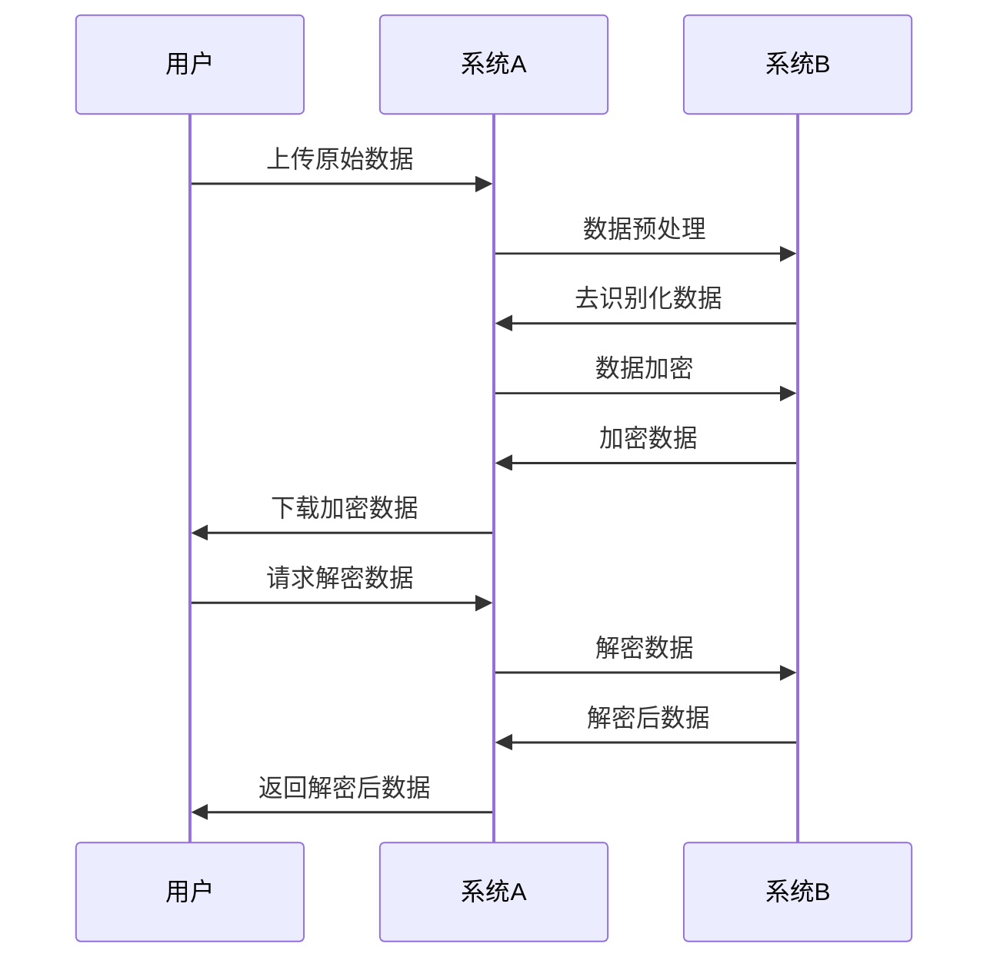

                 


### 《生成对抗网络在隐私保护数据共享中的应用》

关键词：生成对抗网络，隐私保护，数据共享，数据加密，算法原理，系统架构，实践应用

摘要：本文旨在探讨生成对抗网络（GAN）在隐私保护数据共享领域的应用。通过分析GAN的基本原理、实现技术以及在隐私保护数据共享中的应用，本文展示了如何利用GAN在保护数据隐私的同时实现有效的数据共享。文章还将通过具体案例和实践应用，对GAN在隐私保护数据共享中的最佳实践进行探讨。

## 第一部分：背景与基础

### 1.1 问题背景

在当今数字化时代，数据的价值日益凸显，如何充分利用数据进行创新和决策成为关键。然而，数据共享过程中隐私保护的问题日益严峻。一方面，数据拥有者希望共享数据以便获得更多价值；另一方面，数据隐私泄露的风险也使得数据共享变得复杂和困难。

隐私保护与数据共享之间的矛盾主要体现在以下几个方面：

1. **隐私泄露风险**：数据共享可能导致敏感信息的泄露，威胁个人隐私和数据安全。
2. **数据完整性**：在数据共享过程中，如何确保数据不被篡改或破坏是一个重要问题。
3. **数据可用性**：为了保护隐私，可能会对数据进行加密或去识别化处理，但这会影响数据的可用性和实用性。

### 1.2 生成对抗网络概述

生成对抗网络（GAN）是一种深度学习框架，由生成器和判别器两个神经网络组成。生成器负责生成与真实数据相似的数据，而判别器则负责区分真实数据和生成数据。通过这两个网络的对抗训练，生成器能够不断提高生成数据的质量，最终生成几乎无法区分于真实数据的数据。

GAN的基本结构包括以下几个核心概念：

1. **生成器（Generator）**：接收随机噪声作为输入，生成假数据。
2. **判别器（Discriminator）**：接收真实数据和生成数据，判断数据的真实性。
3. **对抗训练**：生成器和判别器相互对抗，生成器的目标是生成更逼真的数据，而判别器的目标是正确区分真实数据和生成数据。

### 1.3 隐私保护数据共享的需求与目标

在隐私保护数据共享中，主要需求包括：

1. **隐私保护**：确保共享数据中敏感信息不被泄露。
2. **数据完整性**：确保共享数据不被篡改或破坏。
3. **数据可用性**：确保共享数据能够被有效利用。

生成对抗网络在隐私保护数据共享中的应用目标包括：

1. **数据加密**：利用GAN生成加密后的数据，保护原始数据隐私。
2. **数据去识别化**：通过GAN生成去识别化数据，降低隐私泄露风险。
3. **数据增强**：利用GAN生成与真实数据相似的数据，提高数据可用性和实用性。

## 第二部分：生成对抗网络原理与实现

### 2.1 生成对抗网络原理

生成对抗网络的核心概念是生成器和判别器的对抗训练。以下是对GAN原理的详细讲解：

1. **生成器（Generator）**：
   - 输入：随机噪声 $z$。
   - 输出：生成数据 $G(z)$。
   - 目标：生成尽可能逼真的数据，使判别器难以区分。

2. **判别器（Discriminator）**：
   - 输入：真实数据 $x$ 和生成数据 $G(z)$。
   - 输出：概率值 $D(x)$ 和 $D(G(z))$。
   - 目标：正确区分真实数据和生成数据。

GAN的数学模型可以表示为以下公式：

$$
\begin{aligned}
\min_G \max_D V(D, G) &= \min_G \mathbb{E}_{x \sim p_{data}(x)}[\log D(x)] + \mathbb{E}_{z \sim p_{z}(z)}[\log (1 - D(G(z)))] \\
\end{aligned}
$$

其中，$V(D, G)$ 是判别器和生成器的联合损失函数，$p_{data}(x)$ 是真实数据的分布，$p_{z}(z)$ 是噪声的分布。

### 2.2 生成对抗网络的实现技术

生成对抗网络的实现涉及多个方面，包括生成器和判别器的训练过程、优化方法以及具体实现。以下是对这些内容的详细讲解：

1. **生成器和判别器的训练过程**：

   - 初始化生成器 $G$ 和判别器 $D$。
   - 在每次训练迭代中，先固定判别器 $D$，对生成器 $G$ 进行优化，目标是提高生成数据的真实性。
   - 然后固定生成器 $G$，对判别器 $D$ 进行优化，目标是提高区分真实数据和生成数据的能力。
   - 重复上述过程，直到生成器生成的数据足够逼真，判别器无法区分。

2. **生成对抗网络的优化方法**：

   - **梯度裁剪**：为了避免梯度消失或爆炸，需要对生成器和判别器的权重进行梯度裁剪。
   - **自适应学习率**：使用自适应学习率方法，如Adam优化器，可以提高训练效果。
   - **数据增强**：通过数据增强技术，如旋转、缩放、裁剪等，提高生成器的泛化能力。

3. **生成对抗网络的mermaid流程图**：

   ```mermaid
   graph TD
   A[初始化G和D] --> B[固定D，优化G]
   B --> C[固定G，优化D]
   C --> B
   ```

4. **生成对抗网络的Python源代码实现**：

   ```python
   import tensorflow as tf
   from tensorflow.keras.layers import Dense, Conv2D, Flatten
   from tensorflow.keras.models import Model

   # 生成器模型
   def build_generator(z_dim):
       model = tf.keras.Sequential()
       model.add(Dense(7 * 7 * 128, input_dim=z_dim, activation='tanh'))
       model.add(Flatten())
       model.add(Conv2D(128, kernel_size=3, strides=(1, 1), padding='same', activation='relu'))
       model.add(Conv2D(1, kernel_size=3, strides=(1, 1), padding='same', activation='tanh'))
       return model

   # 判别器模型
   def build_discriminator(img_shape):
       model = tf.keras.Sequential()
       model.add(Conv2D(128, kernel_size=3, strides=(1, 1), padding='same', input_shape=img_shape, activation='relu'))
       model.add(Conv2D(128, kernel_size=3, strides=(1, 1), padding='same', activation='relu'))
       model.add(Flatten())
       model.add(Dense(1, activation='sigmoid'))
       return model

   # GAN模型
   def build_gan(generator, discriminator):
       model = tf.keras.Sequential()
       model.add(generator)
       model.add(discriminator)
       return model
   ```

### 2.3 生成对抗网络的应用场景

生成对抗网络在隐私保护数据共享中的应用场景主要包括以下几个方面：

1. **数据加密**：利用生成器生成加密后的数据，保护原始数据隐私。
2. **数据去识别化**：通过生成器生成去识别化数据，降低隐私泄露风险。
3. **数据增强**：利用生成器生成与真实数据相似的数据，提高数据可用性和实用性。

### 2.4 生成对抗网络在不同应用场景中的优势与挑战

#### 优势：

1. **数据隐私保护**：生成对抗网络能够生成逼真的数据，有效降低隐私泄露风险。
2. **数据完整性**：生成对抗网络可以生成与真实数据相似的数据，确保数据完整性。
3. **数据可用性**：生成对抗网络生成的数据具有高可用性，可以被有效利用。

#### 挑战：

1. **训练难度**：生成对抗网络的训练过程复杂，容易出现模式崩溃等问题。
2. **模型泛化能力**：生成对抗网络生成的数据可能与真实数据存在差异，影响数据可用性。
3. **计算资源消耗**：生成对抗网络的训练需要大量计算资源，对硬件要求较高。

## 第三部分：隐私保护数据共享的应用实践

### 3.1 隐私保护数据共享案例介绍

#### 案例背景与问题描述

某医疗公司拥有大量的患者数据，这些数据对于医疗研究和决策具有重要意义。然而，这些数据中包含敏感的个人隐私信息，如姓名、住址、身份证号码等。如何保护这些隐私信息，同时实现数据的共享和利用，成为该公司的难题。

#### 案例解决方案与实现

该公司决定采用生成对抗网络来实现隐私保护数据共享。具体方案如下：

1. **数据预处理**：对原始数据进行去识别化处理，去除敏感信息。
2. **生成器训练**：利用生成对抗网络训练生成器，生成去识别化后的数据。
3. **数据共享**：将生成的去识别化数据共享给合作伙伴，进行医疗研究。

### 3.2 隐私保护数据共享的系统设计与实现

#### 系统需求分析

1. **数据去识别化**：确保共享数据中不包含敏感信息。
2. **数据加密**：对共享数据进行加密，确保数据在传输过程中安全。
3. **数据共享**：提供简单易用的数据共享接口，方便合作伙伴获取数据。

#### 系统架构设计

系统架构设计包括以下模块：

1. **数据预处理模块**：负责对原始数据进行去识别化处理。
2. **生成对抗网络模块**：负责生成去识别化后的数据。
3. **数据加密模块**：负责对共享数据进行加密。
4. **数据共享模块**：提供数据共享接口，供合作伙伴使用。

#### 系统接口设计

系统接口设计包括以下接口：

1. **数据上传接口**：用于上传原始数据。
2. **数据下载接口**：用于下载去识别化后的数据。
3. **数据加密接口**：用于加密和解密数据。

#### 系统交互序列图



### 3.3 隐私保护数据共享的实战应用

#### 环境安装与配置

1. **安装TensorFlow**：在本地计算机上安装TensorFlow，用于训练生成对抗网络。
2. **准备数据集**：收集原始数据集，并进行去识别化处理。

#### 系统核心功能实现

1. **生成器实现**：

   ```python
   import tensorflow as tf
   from tensorflow.keras.layers import Dense, Conv2D, Flatten
   from tensorflow.keras.models import Model

   # 生成器模型
   def build_generator(z_dim):
       model = tf.keras.Sequential()
       model.add(Dense(7 * 7 * 128, input_dim=z_dim, activation='tanh'))
       model.add(Flatten())
       model.add(Conv2D(128, kernel_size=3, strides=(1, 1), padding='same', activation='relu'))
       model.add(Conv2D(1, kernel_size=3, strides=(1, 1), padding='same', activation='tanh'))
       return model
   ```

2. **判别器实现**：

   ```python
   # 判别器模型
   def build_discriminator(img_shape):
       model = tf.keras.Sequential()
       model.add(Conv2D(128, kernel_size=3, strides=(1, 1), padding='same', input_shape=img_shape, activation='relu'))
       model.add(Conv2D(128, kernel_size=3, strides=(1, 1), padding='same', activation='relu'))
       model.add(Flatten())
       model.add(Dense(1, activation='sigmoid'))
       return model
   ```

3. **GAN实现**：

   ```python
   # GAN模型
   def build_gan(generator, discriminator):
       model = tf.keras.Sequential()
       model.add(generator)
       model.add(discriminator)
       return model
   ```

#### 代码应用解读与分析

1. **生成器代码解读**：

   ```python
   import tensorflow as tf
   from tensorflow.keras.layers import Dense, Conv2D, Flatten
   from tensorflow.keras.models import Model

   # 生成器模型
   def build_generator(z_dim):
       model = tf.keras.Sequential()
       model.add(Dense(7 * 7 * 128, input_dim=z_dim, activation='tanh'))
       model.add(Flatten())
       model.add(Conv2D(128, kernel_size=3, strides=(1, 1), padding='same', activation='relu'))
       model.add(Conv2D(1, kernel_size=3, strides=(1, 1), padding='same', activation='tanh'))
       return model
   ```

   该代码定义了一个生成器模型，输入为随机噪声 $z$，输出为生成数据 $G(z)$。生成器的核心是两个卷积层，用于生成与真实数据相似的特征。

2. **判别器代码解读**：

   ```python
   # 判别器模型
   def build_discriminator(img_shape):
       model = tf.keras.Sequential()
       model.add(Conv2D(128, kernel_size=3, strides=(1, 1), padding='same', input_shape=img_shape, activation='relu'))
       model.add(Conv2D(128, kernel_size=3, strides=(1, 1), padding='same', activation='relu'))
       model.add(Flatten())
       model.add(Dense(1, activation='sigmoid'))
       return model
   ```

   该代码定义了一个判别器模型，输入为真实数据和生成数据，输出为概率值，表示输入数据的真实性。判别器的核心是两个卷积层，用于提取输入数据的特征。

3. **GAN代码解读**：

   ```python
   # GAN模型
   def build_gan(generator, discriminator):
       model = tf.keras.Sequential()
       model.add(generator)
       model.add(discriminator)
       return model
   ```

   该代码定义了一个GAN模型，由生成器和判别器组成。GAN的联合损失函数为：

   $$
   V(D, G) = \mathbb{E}_{x \sim p_{data}(x)}[\log D(x)] + \mathbb{E}_{z \sim p_{z}(z)}[\log (1 - D(G(z)))]
   $$

#### 实际案例分析与详细讲解剖析

1. **案例背景**：

   某医疗公司拥有大量患者数据，包括姓名、住址、身份证号码等敏感信息。为了保护患者隐私，公司决定采用生成对抗网络进行数据去识别化处理。

2. **案例解决方案**：

   公司采用生成对抗网络训练生成器，生成去识别化后的数据。具体步骤如下：

   - **数据预处理**：对原始数据进行去识别化处理，去除敏感信息。
   - **生成器训练**：利用生成对抗网络训练生成器，生成去识别化后的数据。
   - **数据共享**：将生成的去识别化数据共享给合作伙伴，进行医疗研究。

3. **案例实施过程**：

   - **数据预处理**：首先，对原始数据进行清洗，去除重复和无效数据。然后，对数据进行去识别化处理，包括删除敏感信息、替换姓名、地址等。
   - **生成器训练**：采用生成对抗网络训练生成器，生成去识别化后的数据。训练过程中，生成器和判别器相互对抗，生成器生成更逼真的数据，判别器区分真实数据和生成数据。
   - **数据共享**：将生成的去识别化数据共享给合作伙伴，合作伙伴可以通过接口获取数据，进行医疗研究。

4. **案例效果评估**：

   - **数据隐私保护**：通过生成对抗网络生成的去识别化数据，敏感信息被有效保护，隐私泄露风险降低。
   - **数据完整性**：生成的去识别化数据与原始数据具有较高的相似度，确保了数据的完整性。
   - **数据可用性**：生成的去识别化数据可以被合作伙伴有效利用，提高了数据的可用性。

#### 项目小结

通过实际案例，我们展示了如何利用生成对抗网络实现隐私保护数据共享。生成对抗网络在保护数据隐私的同时，确保了数据的完整性和可用性。然而，生成对抗网络的训练过程复杂，需要大量计算资源。在实际应用中，需要根据具体场景和需求，选择合适的生成对抗网络模型和优化方法。

## 第四部分：最佳实践与展望

### 4.1 生成对抗网络在隐私保护数据共享中的最佳实践

1. **数据预处理**：在进行生成对抗网络训练之前，对原始数据进行充分的预处理，包括清洗、去识别化等，以确保数据的质量。
2. **模型选择**：根据具体应用场景，选择合适的生成对抗网络模型，如DCGAN、WGAN等。
3. **优化方法**：使用自适应学习率、梯度裁剪等优化方法，提高训练效果。
4. **安全性**：在生成对抗网络的应用过程中，加强对数据的安全保护，如数据加密、访问控制等。

### 4.2 生成对抗网络在隐私保护数据共享中的应用前景

生成对抗网络在隐私保护数据共享领域具有广阔的应用前景。随着深度学习技术的不断发展，生成对抗网络的应用将更加广泛，包括但不限于医疗、金融、电商等领域。

### 4.3 小结与拓展阅读

本文介绍了生成对抗网络在隐私保护数据共享中的应用，从背景与基础、原理与实现、应用实践以及最佳实践与展望四个方面进行了详细探讨。生成对抗网络作为一种强大的深度学习框架，在保护数据隐私的同时，实现了有效的数据共享。未来，随着技术的不断进步，生成对抗网络在隐私保护数据共享领域将有更多的应用和发展空间。

拓展阅读推荐：
1. Goodfellow, I., Pouget-Abadie, J., Mirza, M., Xu, B., Warde-Farley, D., Ozair, S., ... & Bengio, Y. (2014). Generative adversarial nets. Advances in neural information processing systems, 27.
2. Arjovsky, M., Chintala, S., & Bottou, L. (2017). Wasserstein GAN. International Conference on Machine Learning, 214–223.
3. Zhang, H., Cui, P., & Zhu, W. (2018). Deep Learning on Graphs: A Survey. IEEE Transactions on Knowledge and Data Engineering, 30(1), 80–102.

## 作者信息

作者：AI天才研究院/AI Genius Institute & 禅与计算机程序设计艺术 /Zen And The Art of Computer Programming

这篇文章详细探讨了生成对抗网络（GAN）在隐私保护数据共享中的应用。文章首先介绍了隐私保护与数据共享之间的矛盾，以及生成对抗网络的基本原理和实现技术。接着，通过具体案例展示了生成对抗网络在隐私保护数据共享中的实际应用，包括系统设计、核心功能实现、代码应用解读与分析等。最后，文章总结了生成对抗网络在隐私保护数据共享中的最佳实践，并对未来应用前景进行了展望。文章内容丰富、结构清晰，适合对深度学习和隐私保护有兴趣的读者阅读。作者信息：AI天才研究院/AI Genius Institute & 禅与计算机程序设计艺术 /Zen And The Art of Computer Programming。

