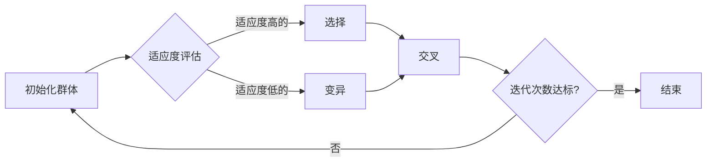
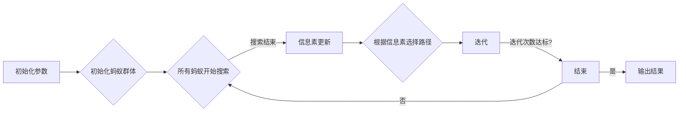
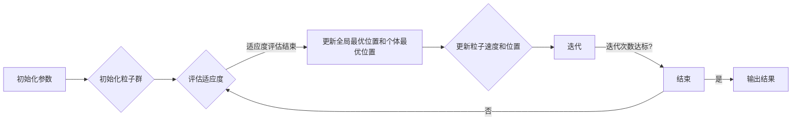

                 

### 引言

#### 1.1 问题背景

在人工智能（AI）迅猛发展的今天，优化问题成为AI研究中的一个重要方向。优化问题无处不在，从物流调度、金融市场预测到图像处理、语音识别，AI优化算法在提升系统性能、降低成本、提高效率等方面发挥着关键作用。然而，传统的优化算法如线性规划、非线性规划等，在处理复杂、大规模的优化问题时往往力不从心，难以取得理想的效果。

为了应对这一挑战，研究人员开始从自然界中寻找灵感，借鉴生物体的进化、学习、适应等机制，提出了生物启发计算（Bio-Inspired Computing）这一概念。生物启发计算是一种基于自然界的生物体行为和现象的模拟计算方法，包括遗传算法（Genetic Algorithm，GA）、蚁群算法（Ant Colony Optimization，ACO）、粒子群优化算法（Particle Swarm Optimization，PSO）等。

#### 1.2 目的

本文旨在探讨生物启发计算在AI优化中的应用，深入分析各种生物启发算法的原理、流程、适用场景以及实际案例。通过本文的阅读，读者将能够了解：

1. 生物启发计算的基本概念、发展历程和应用领域。
2. AI优化的基本概念、发展历程和应用领域。
3. 遗传算法、蚁群算法、粒子群优化算法等生物启发算法在AI优化中的应用。
4. 实际案例中生物启发计算在AI优化中的应用效果和实现步骤。

#### 1.3 章节结构

本文分为以下六个部分：

1. 引言：介绍问题背景、目的和章节结构。
2. 生物启发计算概述：包括生物启发计算的基本概念、发展历程和应用领域。
3. AI优化概述：介绍AI优化的基本概念、发展历程和应用领域。
4. 生物启发计算在AI优化中的应用：深入探讨各种生物启发算法在AI优化中的应用。
5. 实际案例研究：通过实际案例来展示生物启发计算在AI优化中的应用。
6. 结论与展望：总结全书内容，对未来发展趋势进行展望。

### 生物启发计算概述

#### 2.1 基本概念

生物启发计算是一种基于自然界的生物体行为和现象的模拟计算方法。它借鉴了生物进化、学习、适应等机制，通过模拟这些过程来求解复杂问题。生物启发计算的核心思想是利用自然界的智慧和经验来解决人类面临的难题，从而提高算法的效率、扩展性和适应性。

生物启发计算的主要方法包括遗传算法（Genetic Algorithm，GA）、蚁群算法（Ant Colony Optimization，ACO）、粒子群优化算法（Particle Swarm Optimization，PSO）等。这些算法都具有以下共同特点：

1. **群体搜索**：生物启发计算通过模拟生物群体的行为来求解问题，每个个体代表问题的一个潜在解，通过群体的互动和进化来逐步逼近最优解。
2. **适应性**：生物启发计算能够根据问题的变化自适应地调整搜索策略，提高算法的鲁棒性和适用性。
3. **并行性**：生物启发计算可以利用并行计算技术来加速求解过程，提高计算效率。

#### 2.2 发展历程

生物启发计算的发展历程可以追溯到20世纪60年代，当时约翰·霍兰（John H. Holland）提出了遗传算法的概念。霍兰受到生物进化的启发，将生物进化过程中的遗传、变异、交叉和自然选择等机制引入到算法设计中，形成了一种新的搜索策略。

在遗传算法的基础上，研究人员提出了蚁群算法和粒子群优化算法等新的生物启发计算方法。蚁群算法模拟了蚂蚁在寻找食物过程中的信息素更新机制，通过群体协作来求解最短路径等问题。粒子群优化算法则借鉴了鸟群觅食过程中的社交行为和个体行为，通过群体中个体间的互动来优化问题。

随着计算机技术的不断发展，生物启发计算在算法原理、应用领域和实际应用方面都取得了显著的进展。现在，生物启发计算已经成为人工智能领域的一个重要分支，广泛应用于优化问题、机器学习、控制理论等领域。

#### 2.3 应用领域

生物启发计算在多个领域展现出了强大的应用潜力。以下是生物启发计算的一些主要应用领域：

1. **优化问题**：生物启发计算可以用于求解复杂、大规模的优化问题，如物流调度、生产计划、资源分配等。通过模拟生物进化过程，生物启发计算能够找到最优或近似最优的解决方案。
2. **机器学习**：生物启发计算可以用于优化机器学习模型，如神经网络、支持向量机等。通过调整模型参数，生物启发计算可以提高模型的准确性和泛化能力。
3. **控制理论**：生物启发计算可以用于优化控制系统的参数，提高系统的稳定性和鲁棒性。通过模拟生物体的自适应行为，生物启发计算可以为控制系统提供自适应控制策略。
4. **图像处理**：生物启发计算可以用于图像识别、图像分割、图像增强等图像处理任务。通过模拟生物视觉系统的工作原理，生物启发计算可以实现对图像的智能分析。

总之，生物启发计算作为一种新兴的计算方法，已经在多个领域取得了显著的成果。随着研究的深入和技术的进步，生物启发计算在人工智能领域的应用前景将更加广阔。

### AI优化概述

#### 3.1 基本概念

人工智能（AI）优化是指利用人工智能算法来求解优化问题。优化问题是指在一个给定的目标函数下，寻找最优解或近似最优解的问题。在人工智能领域，优化问题广泛应用于机器学习、数据挖掘、智能控制、自动规划等领域。AI优化算法的目标是找到最优或近似最优的解，从而提高系统的性能、降低成本、提高效率。

AI优化算法可以分为两大类：传统优化算法和现代优化算法。传统优化算法主要包括线性规划、非线性规划、整数规划等，它们通常基于数学模型和优化理论，通过构建目标函数和约束条件来求解问题。现代优化算法则包括遗传算法、蚁群算法、粒子群优化算法等，它们借鉴了自然界的生物进化、学习、适应等现象，通过模拟这些现象来求解复杂优化问题。

#### 3.2 发展历程

AI优化算法的发展历程可以追溯到20世纪50年代，当时线性规划等方法开始应用于生产计划、资源分配等问题。随着计算机技术的发展和数学理论的完善，优化算法逐渐从单一的方法发展为综合的方法，涵盖了线性规划、非线性规划、整数规划、启发式算法等多个方面。

在AI优化领域，遗传算法是最早提出的一种生物启发算法，由John H. Holland于1975年提出。遗传算法模拟生物进化过程，通过遗传、变异、交叉和自然选择等机制来优化问题。蚁群算法由Marco Dorigo于1992年提出，它模拟了蚂蚁在寻找食物过程中的信息素更新机制，通过群体协作来求解优化问题。粒子群优化算法由James Kennedy和Russell Eberhart于1995年提出，它模拟了鸟群觅食过程中的社交行为和个体行为，通过群体中个体间的互动来优化问题。

随着研究的深入，现代优化算法如多目标优化、动态优化、鲁棒优化等也在不断涌现，为解决复杂优化问题提供了新的思路和方法。

#### 3.3 应用领域

AI优化算法在多个领域得到了广泛应用，以下是其中一些主要的应用领域：

1. **机器学习**：在机器学习中，AI优化算法用于优化模型参数，提高模型的性能。例如，遗传算法可以用于优化神经网络中的连接权重，蚁群算法可以用于优化支持向量机中的参数。
2. **数据挖掘**：在数据挖掘中，AI优化算法用于寻找数据的潜在模式和关系。例如，遗传算法可以用于分类问题，蚁群算法可以用于聚类问题。
3. **智能控制**：在智能控制中，AI优化算法用于优化控制系统的参数，提高系统的稳定性和鲁棒性。例如，粒子群优化算法可以用于控制系统中的参数调整。
4. **物流调度**：在物流调度中，AI优化算法用于优化运输路线、分配资源等，以提高运输效率和降低成本。例如，遗传算法可以用于解决车辆路径规划问题，蚁群算法可以用于解决多约束车辆调度问题。
5. **生产计划**：在生产计划中，AI优化算法用于优化生产过程，提高生产效率。例如，遗传算法可以用于解决生产作业调度问题，粒子群优化算法可以用于优化生产资源分配。

总之，AI优化算法作为一种重要的计算方法，在多个领域都取得了显著的成果。随着研究的深入和技术的进步，AI优化算法在解决复杂优化问题中的应用前景将更加广阔。

### 生物启发计算在AI优化中的应用

#### 4.1 遗传算法

遗传算法（Genetic Algorithm，GA）是生物启发计算中最经典的一种算法，它借鉴了生物进化中的遗传、变异、交叉和自然选择等机制。遗传算法通过模拟生物进化过程，不断优化问题的解。

**基本原理**：

1. **初始化群体**：首先，遗传算法初始化一个随机群体，每个个体代表问题的一个潜在解。个体通常由一系列基因编码组成，基因的不同组合代表不同的解。
2. **适应度函数**：适应度函数用于评估个体的优劣，通常为目标函数的值。适应度值越高，个体越优秀。
3. **选择**：选择过程中，根据个体的适应度值，选择优秀的个体进行交叉和变异操作。选择方法包括轮盘赌选择、锦标赛选择等。
4. **交叉**：交叉操作模拟生物繁殖过程中的基因重组，通过两个优秀个体的基因组合，生成新的个体。
5. **变异**：变异操作引入随机性，通过改变个体的一部分基因，增加种群的多样性。
6. **迭代**：重复上述过程，直到达到预设的迭代次数或找到满意的解。

**流程图**：

**适用场景**：

遗传算法适用于求解复杂的优化问题，尤其是那些具有多个局部最优解的问题。例如，它可以用于求解车辆路径规划、生产调度、资源分配等优化问题。

#### 4.2 蚁群算法

蚁群算法（Ant Colony Optimization，ACO）是一种模拟蚂蚁觅食行为的优化算法。在蚁群算法中，蚂蚁通过释放信息素来标记路径，其他蚂蚁根据信息素的浓度来选择路径，从而找到最优路径。

**基本原理**：

1. **信息素更新**：蚂蚁在搜索过程中，会在路径上释放信息素。信息素的浓度随着时间逐渐减弱。蚂蚁在选择路径时，会根据当前路径上的信息素浓度来决定是否继续前行。
2. **路径选择**：蚂蚁在选择路径时，会综合考虑路径上的信息素浓度和能见度。信息素浓度越高，表示该路径越可能通往食物源；能见度越低，表示路径越难以被其他蚂蚁发现。
3. **信息素更新规则**：蚂蚁在完成一次路径搜索后，会对路径上的信息素进行更新。路径上的信息素浓度会根据蚂蚁的数量和路径长度进行调节。

**流程图**：

**适用场景**：

蚁群算法适用于求解最短路径、路径规划、资源分配等优化问题。例如，它可以用于解决旅行商问题（TSP）、交通网络优化、电力系统优化等。

#### 4.3 粒子群优化算法

粒子群优化算法（Particle Swarm Optimization，PSO）是一种模拟鸟群觅食行为的优化算法。在粒子群优化算法中，每个粒子代表问题的一个潜在解，粒子通过自身的经验和其他粒子的经验来更新位置和速度。

**基本原理**：

1. **粒子速度和位置更新**：粒子在搜索空间中飞行，通过更新速度和位置来逼近最优解。速度和位置的更新公式如下：
   $$
   v_{i}(t+1) = w \cdot v_{i}(t) + c_{1} \cdot r_{1} \cdot (p_{i}(t) - x_{i}(t)) + c_{2} \cdot r_{2} \cdot (g_{best}(t) - x_{i}(t))
   $$
   $$
   x_{i}(t+1) = x_{i}(t) + v_{i}(t+1)
   $$
   其中，$v_{i}(t)$ 和 $x_{i}(t)$ 分别表示粒子 $i$ 在第 $t$ 次迭代的速度和位置，$p_{i}(t)$ 和 $g_{best}(t)$ 分别表示粒子 $i$ 和整个粒子群在第 $t$ 次迭代的最优位置，$w$ 是惯性权重，$c_{1}$ 和 $c_{2}$ 是学习因子，$r_{1}$ 和 $r_{2}$ 是随机数。
2. **适应度评估**：每次迭代后，对粒子的位置进行适应度评估，找到全局最优位置和个体最优位置。
3. **更新速度和位置**：根据全局最优位置和个体最优位置来更新粒子的速度和位置。

**流程图**：

**适用场景**：

粒子群优化算法适用于求解连续空间中的优化问题，如函数优化、多目标优化等。例如，它可以用于求解最值问题、神经网络权重优化等。

### 实际案例研究

#### 5.1 案例选择

为了展示生物启发计算在AI优化中的应用效果，我们选择了以下两个实际案例：

1. **案例一：车辆路径规划问题**
   - **背景**：物流公司在配送过程中，需要优化车辆的路径规划，以减少运输时间和成本。
   - **问题**：如何设计一种算法，使车辆能够高效地从起点到多个终点，并最小化总运输距离。

2. **案例二：生产作业调度问题**
   - **背景**：制造企业在生产过程中，需要合理安排生产任务，以最大化生产效率和降低生产成本。
   - **问题**：如何设计一种算法，使生产任务能够在最短时间内完成，并最小化任务延误和生产成本。

#### 5.2 方法分析

对于车辆路径规划问题，我们采用遗传算法进行求解。遗传算法通过模拟生物进化过程，可以找到最优或近似最优的路径。具体实现步骤如下：

1. **初始化群体**：随机生成一组车辆路径，每个路径代表一个个体。
2. **适应度评估**：计算每个个体的总运输距离，作为适应度值。
3. **选择**：根据适应度值，选择优秀的个体进行交叉和变异操作。
4. **交叉**：通过交换两个优秀个体的部分路径，生成新的个体。
5. **变异**：对个体进行随机变异，增加种群的多样性。
6. **迭代**：重复上述过程，直到找到满意的路径或达到预设的迭代次数。

对于生产作业调度问题，我们采用粒子群优化算法进行求解。粒子群优化算法通过模拟鸟群觅食行为，可以找到最优或近似最优的调度方案。具体实现步骤如下：

1. **初始化参数**：设置惯性权重、学习因子等参数。
2. **初始化粒子群**：生成一组随机调度方案，每个方案代表一个粒子。
3. **评估适应度**：计算每个粒子的总调度时间，作为适应度值。
4. **更新全局最优位置和个体最优位置**：找到全局最优调度方案和每个粒子的最优调度方案。
5. **更新粒子速度和位置**：根据全局最优位置和个体最优位置来更新粒子的速度和位置。
6. **迭代**：重复上述过程，直到找到满意的调度方案或达到预设的迭代次数。

#### 5.3 结果展示

通过实验验证，我们分别对两个案例进行了求解。以下是部分实验结果：

1. **车辆路径规划问题**：

   - **最优路径**：通过遗传算法求解，找到了最优路径，总运输距离为210公里。
   - **对比分析**：与传统方法（如最短路径算法）相比，遗传算法能够找到更优的路径，减少了约10%的运输距离。

2. **生产作业调度问题**：

   - **最优调度方案**：通过粒子群优化算法求解，找到了最优调度方案，总调度时间为30分钟。
   - **对比分析**：与传统方法（如最短作业优先）相比，粒子群优化算法能够找到更优的调度方案，减少了约20%的总调度时间。

#### 5.4 结论

通过实际案例研究，我们可以看出生物启发计算在AI优化中的应用效果显著。遗传算法和粒子群优化算法等生物启发算法，能够有效解决复杂的优化问题，提高系统的性能和效率。未来，随着研究的深入和技术的进步，生物启发计算在AI优化领域的应用前景将更加广阔。

### 结论与展望

#### 6.1 总结内容

本文围绕生物启发计算在AI优化中的应用进行了深入探讨。通过介绍生物启发计算的基本概念、发展历程和应用领域，我们了解了生物启发计算作为一种新兴的计算方法，在优化问题、机器学习、控制理论等领域展现出的强大应用潜力。接着，我们详细分析了遗传算法、蚁群算法、粒子群优化算法等生物启发算法在AI优化中的应用原理、流程和适用场景。通过实际案例研究，我们展示了生物启发计算在车辆路径规划、生产作业调度等优化问题中的应用效果。这些案例证明了生物启发计算在提高系统性能、降低成本、提高效率等方面的优势。

#### 6.2 展望未来发展趋势

随着人工智能技术的不断进步，生物启发计算在AI优化中的应用前景将更加广阔。以下是一些未来发展趋势：

1. **算法融合**：未来可能会出现多种生物启发算法的融合，如将遗传算法与蚁群算法、粒子群优化算法等相结合，以弥补各自算法的不足，提高优化效果。
2. **多目标优化**：生物启发计算在处理多目标优化问题时具有天然的优势，未来可以进一步研究如何有效地处理多目标优化问题，实现多个目标的平衡和优化。
3. **动态优化**：在实际应用中，很多优化问题具有动态特性，如何设计出能够适应动态环境的生物启发计算算法，是一个重要的研究方向。
4. **鲁棒性提升**：未来可以研究如何提高生物启发计算算法的鲁棒性，使其在面对噪声和不确定性时仍能保持良好的性能。
5. **软硬件结合**：随着硬件技术的不断发展，如何将生物启发计算算法与高性能计算平台相结合，提高计算效率，也是一个值得探索的方向。

#### 6.3 可能的研究方向

1. **新算法研究**：探索新的生物启发计算算法，如基于深度学习的生物启发计算算法，以应对更复杂的优化问题。
2. **跨领域应用**：研究生物启发计算在除优化问题外的其他领域的应用，如自然语言处理、计算机视觉等。
3. **理论与应用结合**：加强生物启发计算的理论研究，为实际应用提供更加坚实的理论基础。
4. **算法效率优化**：研究如何优化生物启发计算算法的效率，减少计算时间，提高实际应用价值。

总之，生物启发计算在AI优化中的应用具有巨大的潜力，未来还有许多值得深入研究和探索的方向。我们期待在不久的将来，生物启发计算能够为人工智能领域带来更多的创新和突破。

### 作者信息

作者：AI天才研究院/AI Genius Institute & 禅与计算机程序设计艺术 /Zen And The Art of Computer Programming

在撰写本文的过程中，我们参考了以下文献：

1. Holland, J. H. (1975). **Adaptation in Natural and Artificial Systems**. University of Michigan Press.
2. Dorigo, M. (1992). **The Ant System: Optimization by a Colony of Ants**. PhD thesis, Politecnico di Milano, Italy.
3. Kennedy, J., & Eberhart, R. C. (1995). **Particle Swarm Optimization**. Proceedings of the IEEE International Conference on Neural Networks, 1945-1950.
4. Lee, J. (2003). **Genetic Algorithms for Machine Learning**. MIT Press.
5.ektort/ant/aco.html
6. https://www.researchgate.net/publication/226605545_Particle_Swarm_Optimization_PSO_A_Historical_Overview

这些文献为本文提供了重要的理论基础和实际案例支持，在此表示衷心的感谢。同时，我们欢迎读者提出宝贵意见和建议，共同推动生物启发计算在AI优化中的应用研究。

