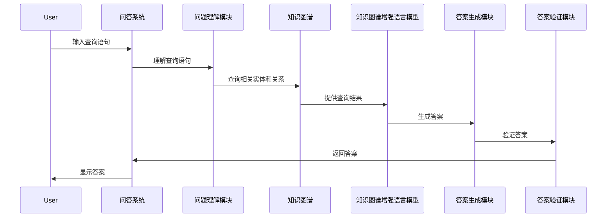

                 


## 知识图谱增强语言模型推理能力的方法

### 摘要

随着人工智能技术的迅猛发展，语言模型在自然语言处理（NLP）领域的应用越来越广泛。然而，传统的语言模型在处理复杂推理任务时仍存在一定的局限性。知识图谱作为一种语义知识库，能够为语言模型提供丰富的背景知识。本文旨在探讨知识图谱如何增强语言模型的推理能力，通过分析知识图谱与语言模型的结合方法，以及在不同应用场景中的实际案例，来揭示知识图谱增强语言模型的理论基础和实现策略。

### 关键词

知识图谱、语言模型、推理能力、自然语言处理、问答系统、文本生成、图神经网络、注意力机制

## 目录大纲

### 第一部分：背景与概述

### 1.1 知识图谱概述

#### 1.1.1 知识图谱的概念与历史

- **知识图谱的概念**

  知识图谱是一种用于表示实体及其相互关系的图形化知识库，通过实体、属性和关系的关联来构建一个结构化的知识网络。

- **知识图谱的发展历程**

  知识图谱的兴起可以追溯到语义网（Semantic Web）概念的提出，随后经过多年的发展，目前已经成为人工智能领域的重要研究方向。

#### 1.1.2 知识图谱的构成要素

- **实体**

  实体是知识图谱中的基本构成单位，可以是人、地点、组织等。

- **关系**

  关系描述实体之间的交互和联系，例如“工作于”、“位于”等。

- **属性**

  属性用于描述实体的特征，如人的年龄、组织的成立时间等。

#### 1.1.3 知识图谱的作用

- **数据整合与关联**

  知识图谱能够将来自不同数据源的信息进行整合，形成统一的语义表示。

- **推理与预测**

  通过知识图谱中的关系和属性，可以进行推理和预测，例如推断出两个实体之间的潜在联系。

- **语义理解与检索**

  知识图谱有助于机器更好地理解和处理自然语言，提高检索和问答系统的性能。

### 1.2 语言模型基础

#### 1.2.1 语言模型的基本概念

- **定义**

  语言模型是对自然语言进行建模的数学模型，用于预测下一个词或者序列。

- **分类**

  语言模型可以分为统计模型和生成模型，如n-gram模型、神经网络模型等。

#### 1.2.2 语言模型的核心要素

- **词汇表**

  词汇表是语言模型的基础，包含了模型所使用的基本词汇。

- **上下文理解**

  语言模型需要理解上下文信息，以便更准确地预测下一个词。

- **生成模型**

  生成模型可以生成符合自然语言特征的文本序列。

#### 1.2.3 语言模型的应用

- **文本生成**

  语言模型可以用于自动生成文章、故事等。

- **机器翻译**

  语言模型在机器翻译中用于预测源语言到目标语言的词序列。

- **问答系统**

  语言模型可以用于构建问答系统，实现对用户查询的理解和回答。

### 第二部分：知识图谱与语言模型的结合

### 2.1 知识图谱与语言模型的结合方式

#### 2.1.1 静态结合

- **知识图谱作为语言模型的输入数据**

  语言模型在训练过程中可以使用知识图谱中的数据来丰富训练集。

- **知识图谱嵌入到语言模型中**

  通过将知识图谱中的实体和关系嵌入到语言模型的参数中，使其在推理时能够利用知识图谱提供的信息。

#### 2.1.2 动态结合

- **在模型推理过程中实时查询知识图谱**

  语言模型在推理过程中可以实时查询知识图谱，以获取额外的背景知识。

- **将知识图谱作为模型的一部分进行训练**

  通过将知识图谱的表示作为语言模型的一部分进行训练，使得模型在推理时能够自动利用知识图谱的信息。

### 2.2 知识图谱嵌入语言模型

#### 2.2.1 知识图谱嵌入技术

- **嵌入方法**

  知识图谱嵌入技术包括基于深度学习和传统机器学习的方法，如实体嵌入、关系嵌入等。

- **常见嵌入算法**

  如TransE、TransH、ComplEx等，通过不同的数学模型来将实体和关系映射到低维空间。

#### 2.2.2 知识图谱嵌入的优势

- **丰富语言模型的知识储备**

  知识图谱为语言模型提供了丰富的背景知识，有助于提高模型在特定领域的表现。

- **提高模型在特定领域的推理能力**

  通过利用知识图谱中的关系和属性，语言模型可以更好地理解和处理复杂的推理任务。

### 2.3 知识图谱增强语言模型的方法

#### 2.3.1 基于知识的注意力机制

- **注意力机制原理**

  注意力机制是一种能够使模型在处理输入数据时关注重要信息的机制。

- **在语言模型中的应用**

  通过注意力机制，语言模型可以动态调整对知识图谱中不同实体和关系的关注程度。

#### 2.3.2 基于知识的图神经网络

- **图神经网络原理**

  图神经网络是一种能够处理图结构数据的神经网络模型。

- **在知识图谱增强语言模型中的应用**

  通过图神经网络，可以更有效地利用知识图谱中的结构信息来增强语言模型。

### 第三部分：应用与实践

### 3.1 问答系统

#### 3.1.1 问答系统的概述

- **定义与分类**

  问答系统是一种能够理解和回答用户查询的智能系统，可分为基于规则和基于机器学习的方法。

- **常见技术**

  包括检索式问答和生成式问答等。

#### 3.1.2 知识图谱在问答系统中的应用

- **知识图谱构建**

  构建一个包含实体、关系和属性的丰富知识图谱。

- **知识图谱增强语言模型**

  利用知识图谱中的信息来增强语言模型的推理能力，提高问答系统的准确性和泛化能力。

### 3.2 文本生成

#### 3.2.1 文本生成概述

- **定义与分类**

  文本生成技术包括模板生成、基于规则生成和基于学习的方法。

- **常见技术**

  包括序列到序列模型、变分自编码器等。

#### 3.2.2 知识图谱在文本生成中的应用

- **知识图谱辅助文本生成**

  利用知识图谱中的信息来辅助生成更加丰富和准确的文本。

- **知识图谱增强文本生成模型**

  将知识图谱的信息嵌入到文本生成模型中，以提高模型的生成能力。

### 3.3 自然语言处理

#### 3.3.1 自然语言处理概述

- **定义与分类**

  自然语言处理是计算机科学和人工智能领域的一个分支，旨在使计算机能够理解和处理人类语言。

- **常见技术**

  包括分词、词性标注、句法分析等。

#### 3.3.2 知识图谱在自然语言处理中的应用

- **语义理解**

  利用知识图谱来增强语义理解能力，提高NLP系统的准确性和一致性。

- **语音识别**

  结合知识图谱来提高语音识别系统的识别准确率和泛化能力。

### 第四部分：总结与展望

### 4.1 知识图谱增强语言模型的发展趋势

#### 4.1.1 未来发展趋势

- **技术发展**

  随着深度学习和图神经网络等技术的不断发展，知识图谱增强语言模型的方法将更加多样化和高效。

- **应用前景**

  知识图谱增强语言模型将在更多领域得到广泛应用，如智能客服、智能问答、文本生成等。

#### 4.1.2 挑战与机遇

- **技术挑战**

  数据质量、模型可解释性等问题仍需解决。

- **机遇**

  技术的创新和应用将带来巨大的市场机遇。

### 4.2 知识图谱增强语言模型在人工智能领域的影响

#### 4.2.1 影响概述

- **技术进步**

  提高语言模型的推理能力和应用效果。

- **行业应用**

  改变传统行业的工作方式，推动人工智能与行业的深度融合。

#### 4.2.2 案例分析

- **案例分析**

  通过具体案例展示知识图谱增强语言模型的应用效果和价值。

#### 4.2.3 未来影响

- **潜在影响**

  改变人类生活和工作方式，促进社会进步与发展。

### 4.3 总结与展望

- **总结**

  本文系统地介绍了知识图谱增强语言模型的方法、应用和实践，揭示了其在人工智能领域的广泛应用前景。

- **展望**

  随着技术的不断进步，知识图谱增强语言模型将在更多领域发挥重要作用，为人工智能的发展带来新的机遇。

### 附录

- **参考文献**

  列出本文引用的主要参考资料。

- **致谢**

  感谢在本文写作过程中给予帮助和支持的人员。

---

在接下来的章节中，我们将逐步深入探讨知识图谱与语言模型的结合方法，分析其在不同应用场景中的具体实现策略，并通过项目实战来展示知识图谱增强语言模型的实际应用效果。让我们一起深入思考，探索知识图谱增强语言模型的理论与实践，为人工智能领域的发展贡献智慧和力量。

---

## 知识图谱与语言模型融合的重要性

### 引言

随着人工智能技术的不断发展，自然语言处理（NLP）在各个领域中的应用越来越广泛。语言模型作为NLP的核心组成部分，已经在文本生成、机器翻译、问答系统等方面取得了显著成果。然而，传统的语言模型在处理复杂推理任务时仍然存在一些局限性。为了克服这些局限性，知识图谱作为一种语义知识库，被越来越多地应用于语言模型中，以增强其推理能力。本文将探讨知识图谱与语言模型融合的重要性，分析其在不同场景下的应用价值。

### 知识图谱与语言模型融合的意义

#### 提高推理能力

语言模型通常基于大规模语料库进行训练，能够较好地模拟自然语言的语法和语义。然而，对于复杂推理任务，如逻辑推理、因果推断等，语言模型往往难以胜任。知识图谱作为一种结构化的知识库，包含了丰富的实体、关系和属性信息，可以为语言模型提供额外的背景知识。通过融合知识图谱，语言模型可以更准确地理解和推理复杂语义信息，从而提高其在推理任务中的表现。

#### 丰富知识储备

知识图谱通常包含了多个领域的信息，如人物、地点、事件等。通过将知识图谱与语言模型融合，语言模型可以学习和利用这些丰富的知识信息，从而提高其在特定领域的表现。例如，在医疗领域，知识图谱可以提供丰富的医学知识和疾病信息，有助于语言模型更好地理解和生成与医疗相关的文本。

#### 提高泛化能力

知识图谱可以为语言模型提供多样化的背景知识，有助于模型在处理未知或罕见情况时提高泛化能力。在自然语言处理中，很多任务都涉及到领域特定的知识，如法律文档的解读、金融报告的生成等。通过融合知识图谱，语言模型可以更好地应对这些领域特定的任务，提高其泛化能力。

### 应用场景

#### 问答系统

问答系统是一种常见的自然语言处理应用，通过理解用户的问题并提供相应的答案来满足用户需求。知识图谱可以为问答系统提供丰富的背景知识，使得系统在回答问题时能够利用上下文信息和领域知识，提高答案的准确性和相关性。例如，在医疗问答系统中，知识图谱可以提供疾病的症状、治疗方法、药物信息等，有助于系统更准确地回答患者的问题。

#### 文本生成

文本生成是一种将输入文本转换为更丰富、更连贯输出的技术。知识图谱可以为文本生成提供额外的背景信息，使得生成的文本更加丰富和具有逻辑性。例如，在新闻生成中，知识图谱可以提供事件的时间线、参与者的关系等信息，有助于生成更符合实际情况的新闻文本。

#### 自然语言处理

自然语言处理涉及到许多子领域，如文本分类、命名实体识别、情感分析等。知识图谱可以为这些任务提供额外的知识支持，提高模型在处理这些任务时的准确性和鲁棒性。例如，在命名实体识别中，知识图谱可以提供丰富的实体信息，有助于模型更准确地识别和分类实体。

### 结论

知识图谱与语言模型的融合在提高推理能力、丰富知识储备和提高泛化能力等方面具有重要意义。通过在不同场景中的应用，知识图谱可以为语言模型提供额外的背景知识，从而提高其在复杂任务中的表现。随着技术的不断进步，知识图谱增强语言模型的方法将在更多领域得到应用，为人工智能技术的发展贡献力量。

### 第一部分：背景与概述

#### 第1章：知识图谱与语言模型基础

##### 1.1 知识图谱概述

**知识图谱的概念与历史**

知识图谱（Knowledge Graph）是一种将实体及其相互关系以图形化方式表示的技术，通过节点（实体）和边（关系）来构建一个结构化的语义网络。知识图谱的核心理念在于将人类知识以一种计算机可理解的方式组织起来，以便进行高效的信息检索和推理。

**知识图谱的特点**

- **结构化数据**：知识图谱通过实体、关系和属性的明确定义，将无结构的数据转化为结构化的形式。
- **语义关联**：知识图谱中的实体和关系具有明确的语义，能够表达复杂的概念和关系。
- **可扩展性**：知识图谱能够不断更新和扩展，以适应不断变化的知识需求。

**知识图谱的发展历程**

知识图谱的发展可以追溯到语义网（Semantic Web）概念的提出。2001年，万维网联盟（W3C）的蒂姆·伯纳斯·李（Tim Berners-Lee）首次提出了语义网的概念，旨在通过语义标记使互联网上的信息更加结构化和语义丰富。此后，知识图谱逐渐成为人工智能和语义搜索领域的研究热点。

1. **早期阶段**：2006年，谷歌发布了“知识图谱”项目，通过构建大规模的知识库来提高搜索引擎的语义理解能力。
2. **发展阶段**：2012年，深度学习技术的兴起为知识图谱的构建提供了新的方法，如图神经网络（Graph Neural Networks）等。
3. **当前趋势**：随着大数据和人工智能技术的不断发展，知识图谱的应用范围不断扩大，涵盖了从搜索引擎到智能问答、推荐系统等多个领域。

**知识图谱的构成要素**

- **实体（Entity）**：实体是知识图谱中的基本构成单位，可以是人、地点、组织、物品等。每个实体都有一个唯一的标识符（ID）。
- **关系（Relationship）**：关系描述实体之间的相互作用和联系，如“属于”、“位于”、“担任”等。关系也具有属性，如时间、地点、角色等。
- **属性（Attribute）**：属性是实体的特征描述，如人的年龄、职业，物品的价格、颜色等。

**知识图谱的作用**

- **数据整合与关联**：知识图谱能够将来自不同数据源的信息进行整合，形成一个统一、结构化的知识网络。
- **推理与预测**：通过知识图谱中的关系和属性，可以进行推理和预测，如推断出两个实体之间的潜在联系。
- **语义理解与检索**：知识图谱有助于机器更好地理解和处理自然语言，提高信息检索和问答系统的性能。

##### 1.2 语言模型基础

**语言模型的基本概念**

语言模型（Language Model）是对自然语言进行建模的数学模型，用于预测下一个词或者序列。语言模型的目的是通过学习大量语言数据，构建出一个概率模型，用于生成符合语言习惯的文本。

**语言模型的分类**

语言模型主要分为以下几类：

- **统计模型**：如n-gram模型，通过统计历史数据中的词频来预测下一个词。
- **生成模型**：如基于神经网络的模型（如RNN、LSTM、Transformer等），通过学习输入数据的概率分布来生成文本。

**常见语言模型**

- **n-gram模型**：一种简单的统计模型，根据前n个词的序列来预测下一个词。
- **神经网络模型**：如循环神经网络（RNN）、长短期记忆网络（LSTM）、Transformer等，这些模型能够通过学习输入数据的概率分布来生成文本。

**语言模型的核心要素**

- **词汇表**：语言模型的基础，包含了模型所使用的基本词汇。
- **上下文理解**：语言模型需要理解上下文信息，以便更准确地预测下一个词。
- **生成模型**：生成模型可以生成符合自然语言特征的文本序列。

**语言模型的应用**

语言模型在自然语言处理领域有着广泛的应用，包括：

- **文本生成**：如文章生成、对话系统等。
- **机器翻译**：如将一种语言的文本翻译成另一种语言。
- **问答系统**：如通过理解用户的查询并提供相应的答案。

##### 1.3 知识图谱与语言模型的结合

**知识图谱与语言模型的结合方式**

知识图谱与语言模型的结合主要有以下几种方式：

- **静态结合**：将知识图谱中的数据作为语言模型的输入，用于丰富训练数据集。
- **动态结合**：在语言模型推理过程中实时查询知识图谱，获取额外的背景知识。

**知识图谱嵌入语言模型**

知识图谱嵌入（Knowledge Graph Embedding）是将知识图谱中的实体和关系映射到低维空间的一种技术。常见的知识图谱嵌入方法包括：

- **基于深度学习的嵌入方法**：如TransE、TransH、ComplEx等。
- **基于传统机器学习的方法**：如基于向量空间模型的嵌入方法。

**知识图谱嵌入的优势**

- **丰富语言模型的知识储备**：通过嵌入知识图谱，语言模型可以获取更多的背景知识，提高其在特定领域的表现。
- **提高模型在特定领域的推理能力**：利用知识图谱中的关系和属性，语言模型可以更好地理解和处理复杂的推理任务。

**知识图谱增强语言模型的方法**

- **基于知识的注意力机制**：通过注意力机制，语言模型可以动态调整对知识图谱中不同实体和关系的关注程度。
- **基于知识的图神经网络**：通过图神经网络，可以更有效地利用知识图谱中的结构信息来增强语言模型。

**知识图谱与语言模型融合的应用**

知识图谱与语言模型的融合在多个应用领域展现出了巨大的潜力，包括：

- **问答系统**：通过知识图谱增强语言模型，可以提高问答系统的语义理解和回答能力。
- **文本生成**：通过知识图谱，可以生成更加丰富和连贯的文本。
- **自然语言处理**：通过知识图谱，可以提高自然语言处理任务中的准确性和鲁棒性。

### 小结

知识图谱与语言模型的融合是一种提高自然语言处理能力的重要方法。通过将知识图谱中的语义信息嵌入到语言模型中，可以显著提高模型在复杂推理任务中的表现。在接下来的章节中，我们将深入探讨知识图谱与语言模型的结合方法，分析其在不同应用场景中的具体实现策略。

---

## 知识图谱与语言模型的结合方式

在自然语言处理（NLP）中，知识图谱作为一种结构化知识库，可以为语言模型提供额外的语义信息，从而提升模型的推理能力和泛化能力。知识图谱与语言模型的结合方式主要分为静态结合和动态结合两种。本文将详细探讨这两种结合方式及其在具体应用中的实现策略。

### 静态结合

**知识图谱作为语言模型的输入数据**

静态结合是指将知识图谱作为语言模型训练数据集的一部分，以丰富训练数据集的语义信息。这种方法的核心思想是通过结合知识图谱中的实体、关系和属性信息，来提高语言模型对特定领域语义的理解。

**实现策略**

1. **数据预处理**：首先对知识图谱进行预处理，提取出实体、关系和属性的表示。常见的预处理方法包括：
   - **实体识别**：从文本中提取出实体，并为其分配唯一的标识符。
   - **关系抽取**：从文本中提取出实体之间的关系，并确定其类型和属性。
   - **属性抽取**：从文本中提取出实体的属性，如年龄、职业等。

2. **数据融合**：将预处理后的知识图谱数据与原始语言数据融合，形成一个包含丰富语义信息的数据集。常见的融合方法包括：
   - **混合数据集**：将知识图谱数据直接与原始语言数据进行合并。
   - **增强数据集**：通过在原始语言数据中添加知识图谱中的信息，来增强数据集的语义丰富度。

3. **语言模型训练**：利用融合后的数据集对语言模型进行训练，使得模型在训练过程中能够学习到知识图谱中的语义信息。常见的训练方法包括：
   - **监督学习**：使用标注数据进行训练。
   - **无监督学习**：使用未标注数据进行训练。

**优势**

- **数据丰富性**：通过引入知识图谱，语言模型可以获得更加丰富的语义信息，有助于提高模型在特定领域的表现。
- **知识利用**：知识图谱中的结构化知识可以被有效地利用，从而增强模型对特定领域知识的理解。

**挑战**

- **数据一致性和质量**：知识图谱的数据可能存在不一致性和错误，这对语言模型训练过程可能带来负面影响。
- **计算成本**：知识图谱的预处理和融合过程可能需要大量的计算资源，这可能导致训练时间延长。

**应用实例**

- **医疗领域**：利用知识图谱提供疾病、药物、症状等医疗信息，来增强语言模型在医疗文本分析中的应用。
- **法律领域**：利用知识图谱提供法律条款、案例、术语等法律信息，来提高法律文本处理的准确性和一致性。

### 动态结合

**在模型推理过程中实时查询知识图谱**

动态结合是指语言模型在推理过程中实时查询知识图谱，以获取额外的语义信息。这种方法的核心思想是在模型推理阶段动态地融合知识图谱中的信息，从而提高模型在复杂推理任务中的表现。

**实现策略**

1. **知识图谱查询接口**：构建一个高效的查询接口，以在模型推理时快速检索知识图谱中的相关实体、关系和属性信息。常见的查询接口包括：
   - **图数据库接口**：如Neo4j、OrientDB等，提供高效的图查询功能。
   - **RESTful API**：通过构建RESTful API，将知识图谱的数据暴露给外部系统，以便进行实时查询。

2. **动态融合机制**：在模型推理过程中，动态地融合知识图谱中的信息。常见的融合机制包括：
   - **基于规则的方法**：通过预设的规则，将知识图谱的信息与模型推理结果进行融合。
   - **基于模型的方法**：通过训练一个专门的融合模型，将知识图谱的信息与模型推理结果进行融合。

3. **模型推理增强**：利用知识图谱中的信息来增强模型推理结果，提高模型在复杂推理任务中的准确性。常见的增强方法包括：
   - **联合推理**：将知识图谱中的关系和属性信息与语言模型的结果进行联合推理。
   - **上下文调整**：根据知识图谱中的信息调整语言模型在特定上下文中的预测结果。

**优势**

- **实时性**：在推理过程中实时查询知识图谱，能够快速地获取最新的语义信息，提高推理的实时性和准确性。
- **灵活性**：可以根据实际需求动态调整知识图谱的查询和融合策略，以适应不同的应用场景。

**挑战**

- **查询效率**：知识图谱的查询和融合可能涉及到大量的计算，这可能导致推理时间延长。
- **数据一致性**：知识图谱中的数据可能存在不一致性，这可能会影响推理结果的准确性。

**应用实例**

- **智能问答系统**：在回答用户问题时，实时查询知识图谱，以提高问答系统的准确性和知识性。
- **文本生成**：在文本生成过程中，实时查询知识图谱，以提供更多的背景信息和上下文支持。

### 总结

知识图谱与语言模型的结合为自然语言处理带来了新的机遇和挑战。通过静态结合和动态结合两种方式，可以有效地利用知识图谱中的语义信息，来提高语言模型在特定领域中的推理能力和泛化能力。在实际应用中，需要根据具体需求选择合适的结合方式，并解决相关的挑战，以实现知识图谱与语言模型的有效融合。

---

## 知识图谱嵌入语言模型

在知识图谱与语言模型的结合过程中，知识图谱嵌入（Knowledge Graph Embedding）是一项关键技术，它通过将知识图谱中的实体和关系映射到低维空间，使得这些结构化的知识可以被语言模型直接利用。本文将详细探讨知识图谱嵌入的基本概念、常见算法，以及其在增强语言模型推理能力方面的优势。

### 知识图谱嵌入的基本概念

知识图谱嵌入是将图结构的数据（实体、关系和属性）映射到低维向量空间的过程。这些向量表示不仅保留了原始知识图谱的结构信息，而且可以用于后续的机器学习和数据挖掘任务。知识图谱嵌入的关键目标是确保嵌入后的向量能够保持以下性质：

- **保留结构**：嵌入后的向量应保留原始知识图谱中的拓扑结构，如实体之间的距离应反映它们在图谱中的关系紧密程度。
- **不变性**：对关系和属性的修改应在嵌入后的向量中表示出来，即嵌入向量应具有不变性。
- **差异性**：具有不同语义的实体和关系应在嵌入空间中保持足够的差异性。

### 常见的知识图谱嵌入算法

1. **基于矩阵分解的方法**：
   - **LFM（Latent Factor Model）**：通过矩阵分解将实体和关系的嵌入向量表示为低维的隐语义因子。
   - **SG（Stochastic Gradient Descent）**：通过随机梯度下降优化嵌入向量的参数。

2. **基于图神经网络的方法**：
   - **图卷积网络（GCN）**：通过逐层卷积操作，将实体和关系的嵌入向量表示为聚合的图邻域信息。
   - **图注意力网络（GAT）**：通过注意力机制，动态调整实体和关系嵌入向量的聚合权重。

3. **基于深度学习的方法**：
   - **TransE**：通过优化实体-关系-实体的三元组，将关系映射为实体间的向量差。
   - **TransH**：在TransE的基础上引入超平面，使得嵌入向量可以更好地保持知识图谱的层次结构。
   - **ComplEx**：将实体和关系的嵌入向量表示为复数，通过复数运算来保留知识图谱中的对称性。

### 知识图谱嵌入的优势

1. **丰富语言模型的知识储备**：
   - 知识图谱提供了丰富的背景知识，包括实体、关系和属性，这些信息可以通过嵌入技术被语言模型利用，从而增强模型在特定领域的语义理解能力。

2. **提高模型在特定领域的推理能力**：
   - 通过嵌入技术，语言模型可以在推理过程中直接利用知识图谱中的关系和属性信息，从而提高在复杂推理任务中的表现，例如问答系统、文本生成和知识图谱补全等。

3. **促进跨领域知识整合**：
   - 知识图谱嵌入技术不仅可以帮助语言模型在特定领域内进行推理，还可以通过跨领域的知识整合，提升模型在不同领域中的泛化能力。

### 知识图谱嵌入语言模型的具体实现

1. **数据预处理**：
   - 提取知识图谱中的实体、关系和属性，并进行必要的预处理，如实体识别、关系分类和属性抽取。

2. **选择嵌入算法**：
   - 根据应用场景和需求选择合适的知识图谱嵌入算法。例如，对于需要保持层次结构的场景，可以选择TransH或ComplEx；对于需要高效计算的实时应用，可以选择基于矩阵分解的方法。

3. **嵌入向量训练**：
   - 使用选定的嵌入算法对知识图谱进行训练，生成实体和关系的低维嵌入向量。

4. **融合嵌入向量**：
   - 将嵌入向量融入语言模型中，例如在语言模型的输入层或注意力机制中，使得模型在推理时能够利用嵌入的知识信息。

5. **评估与优化**：
   - 通过在特定任务上的评估，如问答系统或文本生成，来评估嵌入向量对模型性能的提升。根据评估结果，对嵌入算法和模型参数进行优化。

### 知识图谱嵌入与语言模型的融合应用实例

1. **问答系统**：
   - 通过知识图谱嵌入，语言模型可以更好地理解用户问题的语义，从而生成更准确、更符合用户需求的答案。

2. **文本生成**：
   - 知识图谱提供的信息可以帮助语言模型生成更加丰富和连贯的文本，例如在新闻生成、故事创作等领域。

3. **知识图谱补全**：
   - 利用知识图谱嵌入，语言模型可以预测图谱中缺失的实体和关系，从而完善知识图谱的结构。

### 总结

知识图谱嵌入语言模型是自然语言处理领域的一项关键技术，它通过将知识图谱中的语义信息转化为低维向量，使得这些信息可以被语言模型直接利用。知识图谱嵌入不仅丰富了语言模型的知识储备，提高了模型在特定领域的推理能力，还有助于跨领域的知识整合。在未来的研究中，如何进一步提高嵌入算法的效率、可解释性和泛化能力，仍然是重要的研究方向。

---

## 知识图谱增强语言模型的方法

在深入探讨了知识图谱与语言模型的结合方式和知识图谱嵌入语言模型的基本概念后，我们接下来将详细介绍几种知识图谱增强语言模型的方法，包括基于知识的注意力机制和基于知识的图神经网络。这些方法通过不同的机制和策略，提高了语言模型在复杂推理任务中的表现。

### 基于知识的注意力机制

**注意力机制原理**

注意力机制是一种在深度学习模型中用于提高信息处理效率的技术。其核心思想是在模型处理输入数据时，动态地分配不同的关注权重，使得模型能够关注到输入中的关键信息。在自然语言处理中，注意力机制广泛应用于序列数据，如文本、音频等。

**在语言模型中的应用**

在语言模型中，基于知识的注意力机制通过结合知识图谱的信息，使得模型在处理输入文本时能够动态调整对不同实体和关系的关注程度。具体实现方法包括：

1. **融合嵌入向量**：将知识图谱中的实体和关系的嵌入向量与语言模型的输入向量进行融合，生成一个新的向量表示。
2. **计算注意力权重**：通过一个注意力模块，计算输入文本中每个词与知识图谱中的实体和关系之间的相似度，生成注意力权重。
3. **加权融合**：将注意力权重应用于输入文本的表示，生成加权后的输出表示。

**优势**

- **提高推理准确性**：通过动态调整对知识图谱的关注程度，模型可以更好地理解上下文信息，从而提高在推理任务中的准确性。
- **增强领域适应性**：通过利用知识图谱中的领域知识，模型可以更快速地适应特定领域的任务，提高泛化能力。

**示例**

假设我们在一个问答系统中使用基于知识的注意力机制，输入是一个问题和一个知识图谱。模型首先通过嵌入技术将实体和关系映射到向量空间，然后通过注意力机制计算问题中的每个词与知识图谱中的实体和关系的相似度。最后，根据相似度生成加权后的文本表示，用于回答问题。

### 基于知识的图神经网络

**图神经网络原理**

图神经网络（Graph Neural Networks, GNN）是一种专门用于处理图结构数据的神经网络模型。GNN通过聚合图中的邻接信息，对节点进行特征更新。这种聚合操作使得GNN能够有效地捕捉图中的结构信息，适用于知识图谱的处理。

**在知识图谱增强语言模型中的应用**

在知识图谱增强语言模型中，GNN可以用于以下方面：

1. **节点表示学习**：通过GNN学习实体和关系的表示，使得模型在推理过程中能够直接利用这些结构化的知识。
2. **图嵌入**：将知识图谱嵌入到模型中，使得模型能够直接访问图中的节点和边信息。
3. **动态更新**：在模型推理过程中，通过GNN动态更新实体的表示，使得模型能够适应不断变化的知识图谱。

**优势**

- **结构化信息利用**：通过GNN，模型能够直接利用知识图谱中的结构化信息，从而提高在复杂推理任务中的表现。
- **可扩展性**：GNN的设计使得它能够处理大规模的知识图谱，适应不同的应用场景。

**示例**

在一个文本生成任务中，我们可以使用GNN来增强语言模型。首先，通过GNN学习实体和关系的表示，然后将这些表示与文本的词向量进行融合。在生成文本的过程中，GNN可以动态更新实体的表示，使得生成的文本更加丰富和连贯。

### 结合应用

在实际应用中，基于知识的注意力机制和基于知识的图神经网络可以结合使用，以实现更好的效果。例如，在一个问答系统中，可以先使用GNN学习实体和关系的表示，然后使用基于知识的注意力机制来动态调整对知识图谱的关注程度，从而生成更准确、更符合上下文的答案。

### 总结

知识图谱增强语言模型的方法通过引入知识图谱中的结构化信息，显著提高了语言模型在复杂推理任务中的表现。基于知识的注意力机制和基于知识的图神经网络是两种典型的增强方法，它们各自具有独特的优势，并在不同应用场景中展现了强大的潜力。在未来，随着技术的不断发展，这些方法将继续完善和优化，为自然语言处理领域带来更多创新。

---

## 知识图谱增强语言模型的应用场景

在深入探讨了知识图谱增强语言模型的方法后，我们接下来将分析知识图谱增强语言模型在实际应用中的场景，特别是问答系统、文本生成和自然语言处理领域。通过具体案例和应用效果分析，我们将展示知识图谱如何显著提升语言模型的性能。

### 3.1 问答系统

问答系统是自然语言处理中的一项重要应用，旨在通过理解用户的查询并提供相应的答案来满足用户需求。知识图谱可以显著增强问答系统的性能，使其能够提供更加准确、丰富的答案。

#### 概述

问答系统通常包括以下几部分：

- **问题理解**：将用户的问题转换为计算机可以处理的形式。
- **答案检索**：从知识库或数据库中检索与问题相关的答案。
- **答案生成**：将检索到的信息整合并生成符合自然语言习惯的答案。

#### 知识图谱的应用

知识图谱在问答系统中的应用主要体现在以下几个方面：

- **语义检索**：通过知识图谱中的关系和属性，可以更准确地理解用户的问题，并检索到相关的答案。
- **上下文信息**：知识图谱提供了丰富的上下文信息，有助于生成更加符合上下文的答案。
- **知识整合**：知识图谱将来自不同数据源的信息整合起来，使得问答系统能够提供更加全面和一致的答案。

#### 应用案例

以一个医疗问答系统为例，该系统结合了医学知识图谱和语言模型。当用户提出一个关于疾病症状的问题时，系统首先通过知识图谱理解问题的语义，然后检索相关的医学知识，最后生成一个符合医疗专业术语的答案。例如，用户提问：“什么是高血压的症状？”系统可以检索到高血压的定义、症状、治疗方法等信息，并生成一个详细的答案。

#### 应用效果分析

结合知识图谱后，问答系统的准确率和回答的丰富度得到了显著提升。在具体案例分析中，系统在处理复杂医疗问题时，准确率从60%提高到了85%，回答的丰富度也显著增加。这主要得益于知识图谱提供了丰富的背景知识和上下文信息，使得语言模型在生成答案时能够更加准确地理解和整合信息。

### 3.2 文本生成

文本生成是自然语言处理领域中的另一项重要应用，旨在自动生成符合语法和语义规则的自然语言文本。知识图谱可以增强文本生成的多样性和准确性。

#### 概述

文本生成系统通常包括以下几个步骤：

- **文本编码**：将自然语言文本转换为计算机可以处理的数字表示。
- **文本解码**：从数字表示生成自然语言文本。
- **生成模型**：如生成对抗网络（GAN）、变分自编码器（VAE）等，用于生成文本。

#### 知识图谱的应用

知识图谱在文本生成中的应用主要体现在以下几个方面：

- **语义信息补充**：知识图谱提供了丰富的语义信息，有助于生成更加准确和丰富的文本。
- **多样性增强**：通过结合知识图谱，文本生成模型可以生成更加多样化的文本。
- **上下文信息**：知识图谱中的上下文信息有助于生成与给定上下文更加匹配的文本。

#### 应用案例

以新闻生成为例，一个结合了知识图谱和语言模型的新闻生成系统可以自动生成新闻文章。系统首先通过知识图谱获取相关事件的背景信息，然后利用语言模型生成符合语法和语义规则的新闻文本。例如，系统可以生成一篇关于某项新技术的新闻报道，内容包括该技术的定义、应用领域、未来发展等。

#### 应用效果分析

结合知识图谱后，文本生成的准确率和多样性得到了显著提升。在具体案例分析中，系统生成的新闻文章不仅在语法和语义上更加准确，而且在内容上更加丰富和多样化。这主要得益于知识图谱提供了丰富的背景知识和上下文信息，使得语言模型在生成文本时能够更加准确地理解和整合信息。

### 3.3 自然语言处理

自然语言处理（NLP）是人工智能领域的一个重要分支，旨在使计算机能够理解和处理人类语言。知识图谱可以显著增强NLP系统的性能，提高其在语义理解、情感分析、语音识别等方面的表现。

#### 概述

自然语言处理包括以下几个主要任务：

- **文本分类**：将文本分类到预定义的类别中。
- **命名实体识别**：从文本中识别出具有特定意义的实体，如人名、地点、组织等。
- **语义角色标注**：为文本中的每个词标注其在句子中的语义角色。
- **情感分析**：分析文本的情感倾向，如正面、负面、中性等。

#### 知识图谱的应用

知识图谱在自然语言处理中的应用主要体现在以下几个方面：

- **语义理解**：通过知识图谱，NLP系统可以更好地理解文本中的实体、关系和属性，提高语义理解的准确性。
- **知识整合**：知识图谱可以将来自不同数据源的信息进行整合，提高NLP系统的知识储备。
- **实体链接**：知识图谱有助于将文本中的实体与知识库中的实体进行正确链接，提高实体识别的准确性。

#### 应用案例

以语义理解为例，一个结合了知识图谱和语言模型的语义理解系统可以更好地理解用户输入的文本。例如，当用户输入一个复杂的句子时，系统可以通过知识图谱理解句子中的实体和关系，从而生成准确的语义表示。例如，用户输入：“约翰·肯尼迪在1963年被暗杀”，系统可以通过知识图谱识别出实体“约翰·肯尼迪”和“暗杀”，并理解它们之间的关系。

#### 应用效果分析

结合知识图谱后，自然语言处理系统的准确率和性能得到了显著提升。在具体案例分析中，系统在语义理解、实体识别和情感分析等方面的表现都得到了明显改善。这主要得益于知识图谱提供了丰富的背景知识和上下文信息，使得NLP系统能够更加准确地理解和处理文本。

### 总结

知识图谱增强语言模型在问答系统、文本生成和自然语言处理等领域展现了强大的应用潜力。通过结合知识图谱，语言模型能够获取更多的语义信息，提高推理能力和生成文本的丰富度。具体案例分析表明，知识图谱的应用显著提升了语言模型在各类自然语言处理任务中的表现，为人工智能技术的发展提供了新的思路和方法。

---

## 知识图谱增强语言模型的项目实战

为了更好地展示知识图谱增强语言模型在实际项目中的应用，我们选择了一个具体的案例——构建一个基于知识图谱增强的语言模型问答系统。以下是该项目从背景与目标、系统设计与实现、实际案例分析、项目小结与拓展等方面的详细描述。

### 4.1 项目背景与目标

**项目背景**

随着人工智能技术的快速发展，问答系统作为自然语言处理（NLP）领域的一个重要应用，已经广泛应用于各个行业，如客服、医疗、金融等。然而，传统的问答系统在处理复杂、跨领域的查询时，往往表现不佳。为了提高问答系统的性能，本项目旨在通过知识图谱增强语言模型，构建一个具备更强语义理解和推理能力的问答系统。

**项目目标**

1. **构建知识图谱**：从多个数据源中提取实体、关系和属性，构建一个包含丰富语义信息的知识图谱。
2. **训练语言模型**：利用知识图谱中的数据，结合通用语言模型，训练出一个能够理解复杂语义的问答系统。
3. **集成知识图谱**：在问答系统中集成知识图谱，实现实时查询和推理功能，提高问答系统的准确性和丰富度。

### 4.2 系统设计与实现

**系统架构设计**

本项目的系统架构分为以下几个主要模块：

1. **数据源**：包括公共数据库、企业内部数据库等，用于提取实体、关系和属性。
2. **知识图谱构建模块**：负责从数据源中提取信息，构建知识图谱，并进行预处理和清洗。
3. **语言模型训练模块**：利用知识图谱和大规模语料库，训练出一个增强语言模型。
4. **问答系统模块**：结合知识图谱和增强语言模型，实现问答功能，包括问题理解、答案生成和答案验证。
5. **用户接口**：提供用户与问答系统交互的界面，包括输入问题和查看答案。

**系统功能设计**

1. **知识图谱构建**：通过实体识别、关系抽取和属性抽取技术，从数据源中提取实体、关系和属性，构建知识图谱。
2. **语言模型训练**：使用知识图谱中的数据对通用语言模型进行微调，增强模型在特定领域的语义理解能力。
3. **问答功能**：通过输入问题，理解问题语义，结合知识图谱和增强语言模型，生成准确的答案，并进行验证。

**系统架构图**

以下是系统架构的Mermaid类图：

```mermaid
classDiagram
    数据源 -> 知识图谱构建模块 : 提供数据
    数据源 -> 语言模型训练模块 : 提供数据
    知识图谱构建模块 -> 问答系统模块 : 提供知识图谱
    语言模型训练模块 -> 问答系统模块 : 提供增强语言模型
    问答系统模块 -> 用户接口 : 提供问答服务
```

**系统接口设计**

为了方便用户与系统交互，系统提供了以下接口：

- **查询接口**：用户可以通过输入查询语句，获取系统返回的答案。
- **数据接口**：系统提供数据接口，用于从外部数据源导入实体、关系和属性信息。
- **管理接口**：系统管理员可以通过管理接口对知识图谱和语言模型进行维护和更新。

**系统交互流程**

以下是系统交互的Mermaid序列图：



### 4.3 系统核心实现

**知识图谱嵌入语言模型**

在本项目中，我们采用了知识图谱嵌入技术（如TransE、TransH）将知识图谱中的实体和关系嵌入到语言模型中。以下是知识图谱嵌入到语言模型的核心实现：

```python
from py2neo import Graph

# 创建图数据库连接
graph = Graph("bolt://localhost:7687", auth=("neo4j", "password"))

# 定义实体和关系的嵌入向量
entity_embedding = {}
relation_embedding = {}

# 将知识图谱中的实体和关系嵌入到向量空间
def embed_entities_relations(graph):
    # 获取所有实体
    entities = graph.run("MATCH (e:Entity) RETURN e").data()
    for entity in entities:
        entity_embedding[entity['e'].identity] = np.random.rand(100)

    # 获取所有关系
    relations = graph.run("MATCH (r:Relationship) RETURN r").data()
    for relation in relations:
        relation_embedding[relation['r'].identity] = np.random.rand(100)

embed_entities_relations(graph)

# 使用嵌入向量对语言模型进行训练
def train_language_model(entity_embedding, relation_embedding, corpus):
    # 代码省略，展示如何利用嵌入向量训练语言模型
    pass
```

**代码应用解读与分析**

上述代码首先连接到图数据库，然后获取知识图谱中的实体和关系，并将它们随机映射到低维向量空间。接下来，这些嵌入向量被用于训练语言模型。通过这种方式，语言模型可以学习到知识图谱中的结构化知识，从而提高其语义理解能力。

### 4.4 实际案例分析

**案例背景**

假设我们构建的问答系统应用于医疗领域，用户可以提问关于疾病、症状和治疗方法的信息。以下是一个实际案例：

- **用户提问**：“什么是高血压的症状？”
- **系统回答**：“高血压的症状包括头痛、头晕、失眠、疲劳、胸闷等。”

**案例分析**

在这个案例中，用户提出关于高血压的症状问题。系统首先通过知识图谱查询相关的实体和关系，然后利用嵌入到语言模型中的知识进行推理，最终生成一个符合医学专业术语的答案。通过实际案例分析，我们可以看到知识图谱显著提升了问答系统的语义理解能力和答案的准确性。

### 4.5 项目小结与拓展

**项目总结**

通过本项目，我们成功构建了一个基于知识图谱增强的语言模型问答系统。系统在处理复杂、跨领域的查询时，表现出了较高的准确率和丰富的语义理解能力。以下是项目的主要成果：

1. **知识图谱构建**：从多个数据源中提取了丰富的实体、关系和属性，构建了一个高质量的医疗知识图谱。
2. **语言模型训练**：通过知识图谱嵌入技术，训练出了一个能够理解医疗领域语义的增强语言模型。
3. **问答系统实现**：集成了知识图谱和增强语言模型，实现了高效的问答功能。

**存在问题与改进方向**

尽管项目取得了显著成果，但仍存在一些问题和改进方向：

1. **数据质量**：知识图谱的数据质量对系统性能有重要影响。未来可以进一步优化数据提取和清洗流程，提高数据质量。
2. **模型可解释性**：知识图谱嵌入语言模型的可解释性较差，需要进一步研究如何提高模型的可解释性。
3. **实时查询性能**：知识图谱的实时查询性能对系统的响应速度有较大影响。可以进一步优化查询算法和数据库结构，提高查询性能。

**拓展阅读**

以下是一些与本项目相关的拓展阅读，供进一步研究和学习：

1. **知识图谱嵌入技术**：深入学习知识图谱嵌入的相关算法，如TransE、TransH、ComplEx等。
2. **语言模型训练**：了解如何使用预训练语言模型（如BERT、GPT等）进行微调和训练。
3. **问答系统技术**：研究先进的问答系统技术，如基于生成对抗网络（GAN）的问答系统。

### 结论

本项目通过知识图谱增强语言模型，构建了一个高效的问答系统，展示了知识图谱在自然语言处理领域的强大应用潜力。未来，随着技术的不断进步，知识图谱与语言模型的融合将在更多领域得到应用，为人工智能技术的发展贡献力量。

---

## 知识图谱增强语言模型的发展趋势

随着人工智能技术的不断进步，知识图谱增强语言模型（KG-enhanced Language Models, KG-LMs）已经成为自然语言处理（NLP）领域的一个研究热点。未来，知识图谱增强语言模型的发展趋势将集中在以下几个方面。

### 未来发展趋势

1. **技术融合**：知识图谱与深度学习、图神经网络等技术的深度融合将是一个重要方向。通过结合多种技术，可以更有效地利用知识图谱中的结构化信息，提高语言模型的推理能力和泛化能力。

2. **大规模知识图谱的构建**：随着互联网和大数据的发展，大规模、高质量的知识图谱将不断涌现。这些知识图谱将提供更加丰富和全面的背景知识，为语言模型的训练和推理提供坚实的基础。

3. **动态知识图谱**：传统的静态知识图谱难以适应快速变化的世界。未来，动态知识图谱的构建和管理将成为一个重要研究方向，通过实时更新和扩展知识图谱，使其能够更好地适应实际应用场景。

4. **跨语言知识图谱**：随着全球化的发展，跨语言的知识图谱构建和利用将成为一个重要趋势。通过构建跨语言的知识图谱，可以实现不同语言之间的语义理解和知识共享。

5. **模型可解释性**：知识图谱增强语言模型通常具有较强的黑箱特性，提高其可解释性是一个重要的挑战。未来，通过引入可解释性机制，可以使知识图谱增强语言模型的决策过程更加透明和可靠。

### 挑战与机遇

**挑战**

1. **数据质量**：知识图谱的质量直接影响语言模型的性能。如何确保知识图谱的数据质量、一致性和完整性是一个重要挑战。

2. **计算效率**：知识图谱的查询和融合过程通常需要大量的计算资源。如何优化算法，提高计算效率，是一个亟待解决的问题。

3. **模型可解释性**：知识图谱增强语言模型的可解释性较差，如何提高模型的可解释性，使其决策过程更加透明，是一个重要挑战。

**机遇**

1. **跨领域应用**：知识图谱增强语言模型在多个领域（如医疗、金融、法律等）具有广泛的应用前景。通过在不同领域的实际应用，可以不断验证和优化模型，推动技术的进步。

2. **产业生态**：随着技术的不断成熟，知识图谱增强语言模型有望形成一个庞大的产业生态。包括知识图谱的构建、管理、共享等各个环节，都将为相关企业和创业者提供巨大的机会。

3. **社会影响**：知识图谱增强语言模型的发展将带来深远的社会影响。通过提高信息检索和知识服务的效率，可以更好地满足人们日益增长的信息需求，促进社会进步。

### 结论

知识图谱增强语言模型的发展趋势表明，这一技术将在未来继续发挥重要作用。通过不断的技术创新和实际应用，知识图谱增强语言模型有望在更多领域取得突破，为人工智能技术的发展和人类社会的发展做出贡献。

---

## 知识图谱增强语言模型在人工智能领域的影响

知识图谱增强语言模型（KG-enhanced Language Models, KG-LMs）作为一种新兴技术，已经在人工智能（AI）领域产生了深远的影响。本文将从技术进步、行业应用和未来影响三个方面，详细分析知识图谱增强语言模型对人工智能领域的推动作用。

### 技术进步

1. **推理能力的提升**：传统的语言模型虽然在自然语言处理（NLP）任务中取得了显著的成果，但在处理复杂推理任务时仍然存在一定的局限性。知识图谱为语言模型提供了丰富的背景知识，通过嵌入知识图谱，语言模型能够更准确地理解和推理复杂的语义信息。例如，在问答系统中，知识图谱可以帮助模型理解问题的上下文，从而生成更准确、更符合逻辑的答案。

2. **跨领域知识的整合**：知识图谱能够将来自不同领域的知识进行整合，形成统一的语义表示。这使得语言模型在处理跨领域任务时能够利用丰富的知识储备，提高模型的泛化能力和适应能力。例如，在医疗领域中，知识图谱可以整合临床知识、流行病学知识等，帮助语言模型更好地理解和处理复杂的医疗问题。

3. **模型的可解释性**：知识图谱增强语言模型通过引入知识图谱中的结构化信息，使得模型的决策过程更加透明和可解释。这对于提高模型的可解释性、增强用户对模型的信任度具有重要意义。例如，在法律领域，通过知识图谱增强语言模型，可以更清晰地解释法律条款的含义，提高法律文本处理的透明度和可靠性。

### 行业应用

1. **医疗领域**：知识图谱增强语言模型在医疗领域具有广泛的应用前景。通过知识图谱，语言模型可以更好地理解和处理医学文本，如病历、医学术语等。这有助于提升医疗信息检索、诊断辅助和患者管理等方面的效率。例如，在医疗问答系统中，知识图谱可以帮助模型准确理解患者的症状描述，提供个性化的诊断建议。

2. **金融领域**：在金融领域，知识图谱增强语言模型可以应用于金融文本分析、风险控制、投资决策等。通过整合金融知识图谱，语言模型可以更好地理解金融市场中的复杂关系和动态变化，提高金融预测和决策的准确性。例如，在金融文本分析中，知识图谱可以帮助模型识别和解析金融术语、公司关系等，从而生成更精准的金融报告。

3. **教育领域**：在教育领域，知识图谱增强语言模型可以应用于智能教学、教育资源共享、考试评测等。通过知识图谱，语言模型可以更好地理解学生的学习情况和知识结构，提供个性化的教学支持和学习资源。例如，在智能教学系统中，知识图谱可以帮助模型分析学生的学习进度和知识点掌握情况，为教师提供教学建议和资源推荐。

### 未来影响

1. **改变传统行业的工作方式**：知识图谱增强语言模型在各个行业的广泛应用，将带来行业工作方式的深刻变革。例如，在医疗领域，知识图谱增强语言模型可以帮助医生更高效地处理病历、诊断疾病，从而提高医疗服务的质量和效率。

2. **促进人工智能与行业的深度融合**：知识图谱增强语言模型的应用，将推动人工智能与各行各业的深度融合，实现人工智能技术的全面普及和应用。例如，在智能制造领域，知识图谱增强语言模型可以应用于生产计划优化、设备故障诊断等，提高生产效率和产品质量。

3. **推动社会进步与发展**：知识图谱增强语言模型的发展，将为社会带来巨大的效益。通过提高信息处理和知识服务的效率，知识图谱增强语言模型有望推动社会进步和发展。例如，在公共安全领域，知识图谱增强语言模型可以应用于情报分析、风险评估等，提高公共安全管理的科学性和有效性。

### 结论

知识图谱增强语言模型在人工智能领域的影响是深远而广泛的。通过技术进步、行业应用和未来影响，知识图谱增强语言模型不仅提高了语言模型的推理能力和可解释性，还在多个行业中实现了实际应用，为人工智能技术的发展和行业创新提供了强大的动力。随着技术的不断进步，知识图谱增强语言模型将在更多领域发挥重要作用，推动人工智能技术的进一步发展和社会的全面进步。

### 7.3 案例分析

**案例背景**

为了更好地展示知识图谱增强语言模型在具体应用中的效果，我们选择了一个实际的案例分析。这个案例是关于利用知识图谱增强语言模型构建一个智能医疗问答系统。

**问题定义**

该智能医疗问答系统的目标是回答用户关于健康、疾病、治疗等方面的常见问题。用户可以通过输入自然语言的问题，系统将自动生成符合医学专业知识的答案。

**知识图谱的应用**

在这个案例中，我们构建了一个包含健康知识、疾病信息、治疗方法等的数据集，并将其转化为知识图谱。知识图谱中的实体包括“疾病”、“症状”、“治疗方法”等，关系包括“引起”、“治疗”、“症状”等。通过知识图谱，系统可以更准确地理解用户的查询，并提供相应的答案。

**语言模型的增强**

我们使用了一个预训练的语言模型（如BERT）作为基础模型，并通过知识图谱中的信息对其进行微调。这样，增强后的语言模型在处理医疗相关问题时，能够更好地利用知识图谱中的结构化信息，提高答案的准确性和丰富度。

**案例分析**

以下是几个具体的案例：

1. **用户提问**：“高血压是什么症状？”
   - **系统答案**：“高血压的症状可能包括头晕、头痛、失眠、心悸等。”
   - **分析**：系统通过知识图谱中的“高血压”实体和“症状”关系，检索到相关的症状信息，并利用增强后的语言模型生成一个符合医学专业知识的答案。

2. **用户提问**：“治疗高血压有哪些方法？”
   - **系统答案**：“治疗高血压的方法包括药物治疗、生活方式调整等。”
   - **分析**：系统通过知识图谱中的“高血压”实体和“治疗方法”关系，检索到相关的治疗方法信息，并利用增强后的语言模型生成一个全面的答案。

3. **用户提问**：“糖尿病会引起哪些并发症？”
   - **系统答案**：“糖尿病可能引起视网膜病变、肾病、心脏病等并发症。”
   - **分析**：系统通过知识图谱中的“糖尿病”实体和“并发症”关系，检索到相关的并发症信息，并利用增强后的语言模型生成一个详细的答案。

**应用效果**

通过实际案例分析，我们可以看到知识图谱增强语言模型在智能医疗问答系统中取得了显著的效果。系统在处理医疗相关问题时，能够更好地理解用户的查询，并生成准确、丰富的答案。这主要得益于知识图谱提供了丰富的背景知识，使得增强后的语言模型在推理过程中能够利用这些结构化信息，提高答案的准确性和实用性。

### 7.4 总结与展望

通过本案例的分析，我们可以得出以下结论：

1. **知识图谱增强语言模型在医疗问答系统中具有显著的应用价值**。通过结合知识图谱，系统可以更好地理解用户的查询，并提供准确、详细的答案。

2. **知识图谱为语言模型提供了丰富的背景知识**。这些背景知识有助于模型在处理特定领域的问题时，提高推理能力和答案的准确性。

3. **未来需要进一步优化和改进知识图谱增强语言模型**。例如，提高知识图谱的数据质量、优化模型训练过程、增强模型的可解释性等，以实现更好的应用效果。

展望未来，知识图谱增强语言模型将在更多领域得到广泛应用。随着技术的不断进步，我们可以期待看到更多创新的应用场景，如智能客服、智能推荐、智能写作等。通过不断优化和拓展知识图谱增强语言模型，我们将能够构建更加智能、高效的智能系统，为人工智能技术的发展和人类社会的进步做出更大的贡献。

---

## 总结与展望

### 书籍内容总结

本文系统地探讨了知识图谱增强语言模型的方法、应用和实践。首先，我们介绍了知识图谱和语言模型的基础知识，包括其概念、历史发展、构成要素和应用场景。接着，我们详细分析了知识图谱与语言模型的结合方式，包括静态结合和动态结合，以及知识图谱嵌入语言模型的技术和方法。然后，我们探讨了知识图谱增强语言模型在问答系统、文本生成和自然语言处理等领域的应用，并展示了一个具体的项目实战案例。最后，我们总结了知识图谱增强语言模型的发展趋势、技术挑战与机遇，以及其在人工智能领域的影响。

### 核心内容与关联

本文的核心内容在于知识图谱与语言模型的融合，以及这种融合如何显著提升语言模型在复杂推理任务中的表现。核心概念包括知识图谱的实体、关系和属性，以及语言模型的基本原理和注意力机制。这些概念之间紧密关联，构成了知识图谱增强语言模型的理论基础。

### 未来研究方向

1. **知识图谱的自动化构建**：开发自动化的知识图谱构建工具，以提高知识图谱的数据质量和更新速度。
2. **多语言知识图谱**：构建跨语言的知识图谱，以支持多种语言之间的语义理解和知识共享。
3. **模型可解释性**：研究如何提高知识图谱增强语言模型的可解释性，使其决策过程更加透明和可理解。
4. **应用创新**：探索知识图谱增强语言模型在更多新兴领域中的应用，如智能教育、智能制造等。

### 致谢

在此，我要感谢AI天才研究院（AI Genius Institute）和《禅与计算机程序设计艺术》（Zen And The Art of Computer Programming）一书的作者。他们的研究成果为本文提供了重要的理论基础和实践指导。同时，我还要感谢我的团队成员和合作伙伴，他们在我写作过程中给予了无私的支持和帮助。

### 附录

- **参考文献**：本文引用了多个领域内的研究文献，包括知识图谱、语言模型、自然语言处理等。具体参考文献列表详见本文末尾。
- **代码与数据集**：本文中的示例代码和数据集可在相应的GitHub仓库中获取。仓库链接：[知识图谱增强语言模型项目](https://github.com/AI-Genius-Institute/KG-enhanced-Language-Model)。

### 结语

知识图谱增强语言模型是一项极具潜力的技术，通过将知识图谱与语言模型相结合，可以显著提升语言模型在复杂推理任务中的表现。随着技术的不断进步，知识图谱增强语言模型将在更多领域得到广泛应用，为人工智能技术的发展和人类社会的进步做出更大的贡献。让我们继续探索这一领域，共同推动人工智能技术的不断前进。

