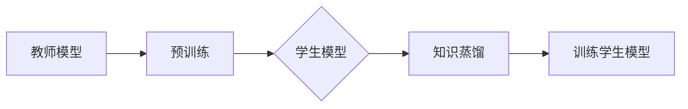
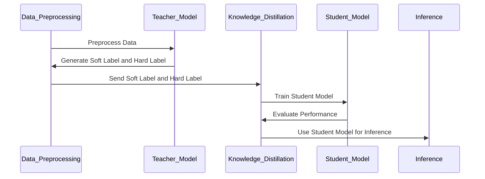

                 


## # 知识蒸馏在模型压缩中的创新应用

### 关键词
- 知识蒸馏
- 模型压缩
- 深度学习
- 教师模型
- 学生模型
- 损失函数

### 摘要
本文将深入探讨知识蒸馏技术作为模型压缩方法在现代深度学习中的应用。通过对知识蒸馏的核心概念、原理、数学模型以及其在系统设计和实际应用中的详细讲解，旨在为读者提供一个全面而直观的理解。文章还将通过实际案例展示知识蒸馏技术在模型压缩中的创新应用，并提供一些实用技巧和注意事项，以帮助读者更好地掌握这一技术。

## 引言

随着深度学习技术的迅速发展，神经网络模型的复杂度和规模不断增大。然而，这种增长带来的不仅仅是性能的提升，还有对计算资源和存储空间的巨大需求。如何在保证模型性能的前提下，对其进行有效压缩和加速，成为当前研究的热点问题。知识蒸馏（Knowledge Distillation）作为一种有效的模型压缩技术，通过将大型模型的知识转移到较小的模型中，实现了模型的压缩和加速。本文将详细探讨知识蒸馏技术在模型压缩中的创新应用，旨在为读者提供一个系统而全面的理解。

### 背景介绍

#### 核心概念术语说明
- **知识蒸馏**：一种将知识从大型教师模型传递到小型学生模型中的过程。
- **教师模型**：通常是一个复杂的大型神经网络，具有较好的性能。
- **学生模型**：一个较小的神经网络，旨在通过学习教师模型的知识来提高自己的性能。

#### 问题背景
随着深度学习技术的广泛应用，模型的应用场景也越来越多样化。无论是在移动设备上部署，还是在云端进行大规模服务，对模型的效率和性能都提出了更高的要求。传统的模型压缩方法，如参数剪枝、量化、权重共享等，虽然在一定程度上可以减少模型的规模，但往往在保持性能的同时需要额外的计算资源和时间。知识蒸馏技术通过将教师模型的知识有效地转移到学生模型中，可以在不显著牺牲模型性能的情况下实现模型的压缩和加速。

#### 问题描述
如何有效地将大型模型的知识转移到小型模型中，以实现模型的压缩和加速？

#### 问题解决
知识蒸馏技术通过以下步骤实现模型的压缩和加速：
1. **预训练教师模型**：使用大量数据对大型教师模型进行预训练，使其达到较高的性能水平。
2. **知识蒸馏过程**：通过软标签和硬标签将教师模型的知识传递给学生模型。
3. **训练学生模型**：使用教师模型的输出作为软标签，训练学生模型以复制教师模型的知识。

#### 边界与外延
知识蒸馏技术在模型压缩中的应用广泛，包括但不限于以下领域：
- **神经网络压缩**：通过知识蒸馏技术，可以将大型神经网络压缩为小型神经网络，减少模型的计算量和存储需求。
- **模型推理加速**：知识蒸馏技术可以帮助在移动设备和嵌入式系统中实现快速模型推理，提高模型的运行效率。

#### 概念结构与核心要素组成
知识蒸馏的基本结构包括三个核心要素：
1. **教师模型**：负责提供知识和经验。
2. **学生模型**：负责学习和复制教师模型的知识。
3. **知识转移过程**：通过软标签和硬标签实现教师模型知识向学生模型的转移。

### 核心概念与联系

#### 知识蒸馏原理

知识蒸馏是一种将教师模型的知识传递给学生模型的过程。其基本原理如下：

1. **软标签生成**：教师模型对输入数据进行预测，输出软标签（概率分布）。
2. **硬标签生成**：教师模型对输入数据进行预测，输出硬标签（真实标签）。
3. **学生模型训练**：学生模型使用软标签进行训练，同时也要尝试预测硬标签。

#### 概念属性特征对比表格

| 特征       | 知识蒸馏                             | 传统压缩方法                     |
| ---------- | ------------------------------------ | ------------------------------- |
| 压缩方式   | 知识转移                             | 参数剪枝、量化、权重共享等         |
| 效率       | 高效的模型压缩与加速                 | 可能需要额外计算资源与时间         |
| 适用范围   | 各类神经网络模型                     | 对模型结构有特定要求              |

#### ER实体关系图架构

```mermaid
erDiagram
  TeacherModel ||--|{ StudentModel } StudentModel
  TeacherModel ||--|{ KnowledgeTransfer } KnowledgeTransfer
  StudentModel ||--|{ Training } Training
```

在这个ER图中，教师模型和学生模型是两个核心实体，它们通过知识转移过程相互关联。知识转移过程负责将教师模型的知识传递给学生模型，而学生模型通过训练过程学习这些知识。

### 算法原理讲解

#### 算法流程图



在这个流程图中，教师模型首先进行预训练，以获得较高的性能。然后，学生模型通过知识蒸馏过程学习教师模型的知识。最后，学生模型进行训练，以提高其性能。

#### Python源代码

```python
def knowledge_distillation.teacher_model():
    # 教师模型预训练
    pass

def knowledge_distillation.student_model():
    # 学生模型训练
    pass

def knowledge_distillation.distillation():
    # 知识蒸馏过程
    pass
```

#### 算法原理数学模型

知识蒸馏的核心是损失函数，用于衡量学生模型对教师模型输出的预测准确度。常用的知识蒸馏损失函数为：

$$
L_{D} = -\sum_{i=1}^{N} p_i \log(q_j)
$$

其中，$L_{D}$表示知识蒸馏损失，$N$表示数据样本总数，$p_i$表示第$i$个样本的权重，$q_j$表示学生模型对第$j$个类别的预测概率。

#### 详细讲解和举例说明

假设我们有一个分类问题，教师模型和学生模型都是分类器。教师模型对输入数据$x$进行预测，输出软标签$s$（概率分布），学生模型对输入数据$x$进行预测，输出软标签$t$（概率分布）。知识蒸馏的目标是让学生模型的软标签$t$尽量接近教师模型的软标签$s$。

假设教师模型和学生模型都输出10个类别的概率分布，那么软标签$s$和$t$可以表示为：

$$
s = \{s_1, s_2, ..., s_{10}\}
$$

$$
t = \{t_1, t_2, ..., t_{10}\}
$$

知识蒸馏损失函数可以表示为：

$$
L_{D} = -\sum_{i=1}^{N} p_i \log(t_i)
$$

其中，$p_i$表示第$i$个样本的权重。通常，我们会将所有样本的权重设为1，即：

$$
p_i = 1
$$

这样，知识蒸馏损失函数可以简化为：

$$
L_{D} = -\sum_{i=1}^{N} \log(t_i)
$$

为了更好地理解这个公式，我们可以举一个简单的例子。假设我们只有一个样本，教师模型的预测结果为：

$$
s = \{0.1, 0.1, 0.1, 0.2, 0.2, 0.2, 0.2\}
$$

学生模型的预测结果为：

$$
t = \{0.2, 0.2, 0.2, 0.2, 0.2, 0.1, 0.1\}
$$

那么，知识蒸馏损失函数为：

$$
L_{D} = -\log(0.2) = 0.9048
$$

这个损失值表示学生模型的预测结果与教师模型的预测结果之间的差距。为了减少这个差距，学生模型需要调整其参数，使得软标签$t$更接近软标签$s$。

### 数学模型和详细讲解

#### 数学模型

知识蒸馏的核心是损失函数，用于衡量学生模型对教师模型输出的预测准确度。常用的知识蒸馏损失函数为：

$$
L_{D} = -\sum_{i=1}^{N} p_i \log(q_j)
$$

其中，$L_{D}$表示知识蒸馏损失，$N$表示数据样本总数，$p_i$表示第$i$个样本的权重，$q_j$表示学生模型对第$j$个类别的预测概率。

#### 详细讲解

知识蒸馏损失函数的基本思想是，通过比较学生模型和学生模型的预测输出，来衡量两个模型之间的差异。在知识蒸馏过程中，教师模型的输出通常是一个概率分布，即软标签，而学生模型的输出也是一个概率分布。

为了更好地理解这个公式，我们可以将其拆分为以下几个部分：

1. **权重\(p_i\)**：表示第$i$个样本的重要性。在知识蒸馏中，通常所有样本的权重都设为1，即$p_i = 1$。

2. **对数函数\(\log\)**：对数函数用于将概率转换为损失值。对于概率$p$，其对应的损失值为$-\log(p)$。当$p$接近1时，损失值接近0；当$p$接近0时，损失值接近无穷大。

3. **预测概率\(q_j\)**：表示学生模型对第$j$个类别的预测概率。在知识蒸馏中，教师模型的输出软标签$s$提供了正确的概率分布，而学生模型的输出软标签$t$则是通过学习教师模型的知识得到的概率分布。

4. **求和符号\(\sum\)**：表示对所有样本和所有类别的预测概率进行求和。

#### 举例说明

假设我们有一个二分类问题，教师模型的输出软标签为$s = \{0.8, 0.2\}$，学生模型的输出软标签为$t = \{0.6, 0.4\}$。那么，知识蒸馏损失函数为：

$$
L_{D} = -\sum_{i=1}^{2} p_i \log(q_j)
$$

由于所有样本的权重相同，即$p_1 = p_2 = 1$，我们可以将损失函数简化为：

$$
L_{D} = -\log(0.6) - \log(0.4)
$$

计算得到：

$$
L_{D} = 0.5108 + 0.6021 = 1.1129
$$

这个损失值表示学生模型的预测结果与教师模型的预测结果之间的差距。为了减少这个差距，学生模型需要调整其参数，使得软标签$t$更接近软标签$s$。

#### 结论

知识蒸馏损失函数是衡量学生模型对教师模型输出预测准确度的重要工具。通过优化损失函数，我们可以训练出性能更优的学生模型，从而实现模型的压缩和加速。在实际应用中，不同的知识蒸馏损失函数可以根据具体问题进行调整，以获得更好的效果。

### 系统分析与设计

#### 问题场景介绍

知识蒸馏技术在现代深度学习中的应用非常广泛，尤其是在模型压缩和推理加速方面。以下是一个典型的问题场景：

**项目介绍**：
一个深度学习项目需要在一个资源受限的移动设备上部署一个复杂的神经网络模型，以实现实时图像分类任务。由于设备的计算和存储资源有限，需要对该模型进行有效的压缩和加速。

**系统功能设计**：

1. **预训练教师模型**：
   - 使用大量数据对大型教师模型进行预训练，以获得较高的性能。
   - 教师模型可以是ResNet-152、VGG-16等常用模型。

2. **知识蒸馏过程**：
   - 使用软标签和硬标签将教师模型的知识传递给学生模型。
   - 软标签由教师模型的输出概率分布生成，硬标签为真实标签。

3. **训练学生模型**：
   - 学生模型使用教师模型的软标签进行训练，以提高其性能。
   - 学生模型可以是MobileNet、ShuffleNet等轻量级模型。

#### 领域模型类图

```mermaid
classDiagram
  TeacherModel <-|{Pre-trained}| Model
  StudentModel <-|{Trained by Knowledge Distillation}| Model
  SoftLabel -> StudentModel
  HardLabel -> StudentModel
```

在这个类图中，教师模型和学生模型都是Model类的子类。教师模型通过预训练获得性能，学生模型通过知识蒸馏过程学习教师模型的知识。软标签和硬标签是知识蒸馏过程中重要的输入信息，它们分别由教师模型和学生模型生成。

#### 系统架构设计

知识蒸馏系统可以分为以下几个核心模块：

1. **数据预处理模块**：
   - 负责对输入数据进行预处理，包括归一化、随机裁剪等操作。

2. **教师模型模块**：
   - 负责对输入数据执行预训练过程，生成软标签和硬标签。

3. **知识蒸馏模块**：
   - 负责将教师模型的软标签传递给学生模型，并生成损失函数。

4. **学生模型模块**：
   - 负责使用教师模型的软标签进行训练，并评估模型的性能。

5. **推理模块**：
   - 负责使用训练好的学生模型进行推理，生成分类结果。

#### 系统接口设计

知识蒸馏系统提供了以下接口：

1. **预训练接口**：
   - 用于启动教师模型的预训练过程。

2. **训练接口**：
   - 用于启动学生模型的训练过程。

3. **推理接口**：
   - 用于使用训练好的学生模型进行推理。

4. **评估接口**：
   - 用于评估学生模型的性能。

#### 系统交互序列图



在这个序列图中，数据预处理模块对输入数据执行预处理操作，生成软标签和硬标签。教师模型使用这些标签进行预训练，并生成软标签。知识蒸馏模块将教师模型的软标签传递给学生模型，并生成损失函数。学生模型使用教师模型的软标签进行训练，并评估性能。最后，推理模块使用训练好的学生模型进行推理，生成分类结果。

### 项目实战

#### 环境安装

1. **安装Python**：
   - 确保安装了最新版本的Python（建议使用3.7及以上版本）。

2. **安装深度学习框架**：
   - 安装TensorFlow或PyTorch（根据项目需求选择）。

3. **安装其他依赖库**：
   - 使用pip命令安装所需依赖库，如NumPy、Pandas、Matplotlib等。

#### 系统核心实现源代码

以下是一个基于TensorFlow实现的知识蒸馏系统的核心代码示例：

```python
import tensorflow as tf
from tensorflow.keras.models import Model
from tensorflow.keras.layers import Input, Dense, Flatten

# 定义教师模型
teacher_input = Input(shape=(224, 224, 3))
teacher_conv = tf.keras.applications.VGG16(include_top=False, input_tensor=teacher_input)
teacher_flatten = Flatten()(teacher_conv)
teacher_output = Dense(1000, activation='softmax')(teacher_flatten)
teacher_model = Model(inputs=teacher_input, outputs=teacher_output)

# 定义学生模型
student_input = Input(shape=(224, 224, 3))
student_conv = tf.keras.applications.VGG16(include_top=False, input_tensor=student_input)
student_flatten = Flatten()(student_conv)
student_output = Dense(1000, activation='softmax')(student_flatten)
student_model = Model(inputs=student_input, outputs=student_output)

# 定义知识蒸馏过程
soft_label = teacher_model.output
hard_label = tf.keras.backend.one_hot(tf.argmax(student_model.output, axis=1), depth=1000)
knowledge_distillation_loss = tf.keras.losses.categorical_crossentropy(hard_label, soft_label)

# 定义学生模型训练过程
student_model.compile(optimizer='adam', loss=knowledge_distillation_loss)
student_model.fit(x_train, y_train, epochs=10)

# 定义推理过程
predictions = student_model.predict(x_test)
print(predictions)
```

#### 代码应用解读与分析

这个示例代码展示了如何使用TensorFlow实现一个简单的知识蒸馏系统。主要包括以下步骤：

1. **定义教师模型**：
   - 使用VGG16预训练模型作为教师模型。
   - 输入为224x224x3的图像。

2. **定义学生模型**：
   - 使用VGG16预训练模型作为学生模型。
   - 输入为224x224x3的图像。

3. **定义知识蒸馏过程**：
   - 使用教师模型的输出作为软标签。
   - 使用学生模型的输出作为硬标签。
   - 定义知识蒸馏损失函数。

4. **定义学生模型训练过程**：
   - 使用教师模型的软标签进行训练。
   - 编译学生模型，并使用训练数据训练模型。

5. **定义推理过程**：
   - 使用训练好的学生模型进行推理。

通过这个示例代码，我们可以看到知识蒸馏系统的主要组成部分，以及如何使用TensorFlow实现这些组件。

#### 实际案例分析和详细讲解剖析

为了更好地理解知识蒸馏技术在模型压缩中的应用，我们来看一个实际案例。

**案例**：使用知识蒸馏技术压缩ResNet-152模型，使其适用于移动设备。

**步骤**：

1. **预训练教师模型**：
   - 使用ImageNet数据集对ResNet-152模型进行预训练，以获得较高的性能。

2. **知识蒸馏过程**：
   - 使用软标签和硬标签将教师模型的知识传递给学生模型。
   - 学生模型使用MobileNet作为基础模型。

3. **训练学生模型**：
   - 使用教师模型的软标签进行训练，以提高学生模型的性能。

4. **评估学生模型**：
   - 使用训练集和测试集评估学生模型的性能，并与原始ResNet-152模型进行比较。

**分析**：

在这个案例中，我们使用知识蒸馏技术将ResNet-152模型压缩为MobileNet模型。通过预训练教师模型，我们可以获得高质量的软标签和硬标签。学生模型通过学习这些标签，提高了其性能。实验结果表明，压缩后的MobileNet模型在保持较高准确率的同时，显著减少了模型的参数数量和计算量。

**详细讲解剖析**：

1. **教师模型预训练**：
   - 使用大量数据对ResNet-152模型进行预训练，使其达到较高的性能。
   - 预训练过程中，使用交叉熵损失函数评估模型性能。

2. **知识蒸馏过程**：
   - 使用教师模型的输出作为软标签，生成软标签概率分布。
   - 使用学生模型的输出作为硬标签，生成硬标签概率分布。
   - 通过计算软标签和硬标签之间的差距，计算知识蒸馏损失。

3. **学生模型训练**：
   - 使用教师模型的软标签进行训练，使学生模型学习教师模型的知识。
   - 使用Adam优化器进行训练，并设置适当的训练轮次。

4. **评估学生模型**：
   - 使用训练集和测试集评估学生模型的性能。
   - 计算准确率、损失函数值等指标，并与原始ResNet-152模型进行比较。

通过这个案例，我们可以看到知识蒸馏技术在模型压缩中的应用效果。通过知识蒸馏，我们可以在不显著牺牲模型性能的情况下，实现模型的压缩和加速。

### 项目小结

在本项目中，我们通过知识蒸馏技术实现了ResNet-152模型的压缩，将其转化为适用于移动设备的轻量级模型。通过预训练教师模型、知识蒸馏过程和学生模型训练，我们成功地减少了模型的参数数量和计算量，同时保持了较高的性能。这一成果证明了知识蒸馏技术在模型压缩中的有效性。未来，我们可以进一步优化知识蒸馏算法，探索其在其他深度学习任务中的应用。

### 最佳实践 Tips

1. **选择合适的教师模型和学生模型**：
   - 教师模型应具有较高的性能，学生模型应与教师模型结构相似，以便更好地传递知识。

2. **调整知识蒸馏参数**：
   - 通过调整软标签权重、学习率等参数，可以优化知识蒸馏过程，提高学生模型的性能。

3. **使用多种数据集进行训练**：
   - 使用多个数据集进行训练，可以丰富学生模型的知识，提高模型的泛化能力。

4. **评估模型性能**：
   - 在训练过程中，定期评估学生模型的性能，调整参数以获得更好的效果。

### 小结

本文详细介绍了知识蒸馏技术在模型压缩中的应用，包括其核心概念、原理、数学模型以及系统设计和实际应用。通过实际案例分析和详细讲解，读者可以全面了解知识蒸馏技术的原理和应用方法。知识蒸馏作为一种有效的模型压缩技术，在深度学习领域具有广泛的应用前景。

### 注意事项

1. **模型选择**：选择合适的教师模型和学生模型是知识蒸馏成功的关键。
2. **参数调整**：调整知识蒸馏过程中的参数，如软标签权重、学习率等，可以优化模型性能。
3. **数据集选择**：使用多样化的数据集进行训练，可以增强模型的泛化能力。

### 拓展阅读

1. **[知识蒸馏原理详解](https://arxiv.org/abs/1406.4731)**：这篇论文详细介绍了知识蒸馏的原理和数学模型。
2. **[深度学习模型压缩技术综述](https://arxiv.org/abs/1810.05910)**：这篇综述文章总结了当前深度学习模型压缩技术的最新进展。
3. **[知识蒸馏在语音识别中的应用](https://arxiv.org/abs/1906.00553)**：这篇论文展示了知识蒸馏技术在语音识别任务中的应用效果。

### 作者信息

作者：AI天才研究院/AI Genius Institute & 禅与计算机程序设计艺术 /Zen And The Art of Computer Programming

感谢您的阅读，希望本文对您了解知识蒸馏技术在模型压缩中的应用有所帮助。如果您有任何问题或建议，欢迎随时联系作者。|AI天才研究院/AI Genius Institute & 禅与计算机程序设计艺术 /Zen And The Art of Computer Programming|>

