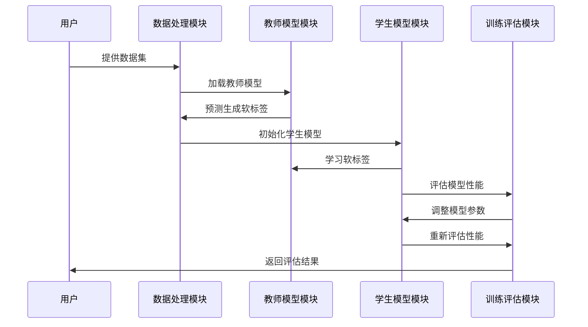
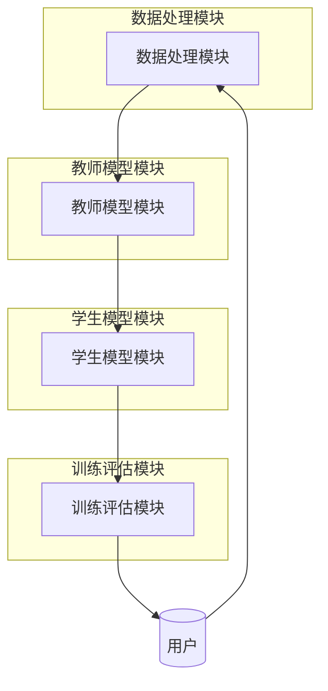
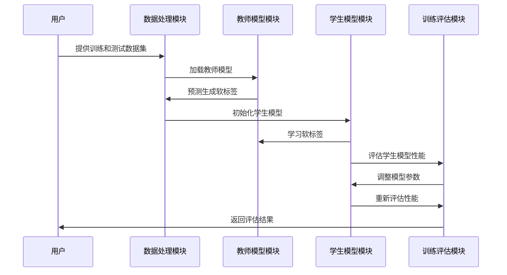
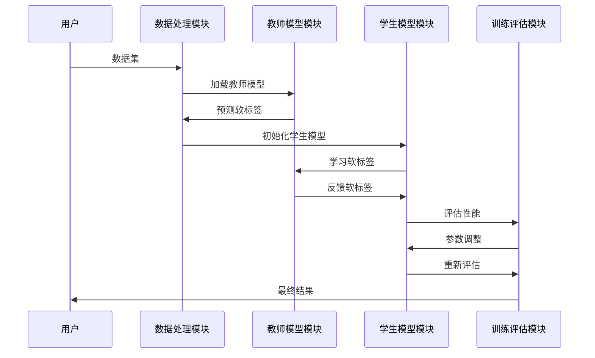

                 

### 引言

随着深度学习技术的飞速发展，大型神经网络模型在各个领域取得了显著的成果，然而，这些模型的计算和存储需求也日益增长。为了满足实际应用场景中的资源限制，模型压缩成为了一个关键问题。模型压缩的目标是通过降低模型的计算复杂度和存储需求，在不显著牺牲模型性能的情况下，使其更加高效和易于部署。在这一背景下，知识蒸馏（Knowledge Distillation）作为一种有效的模型压缩技术，受到了广泛关注。

知识蒸馏的基本思想是将一个复杂的大型模型（通常称为“教师模型”）的知识传递给一个较简单的小型模型（通常称为“学生模型”），从而使小型模型能够达到与大型模型相近的性能。这一过程涉及将教师模型对数据的预测作为软标签，用于指导学生模型的学习。近年来，知识蒸馏技术取得了许多重要的进展，不仅在理论上得到了深入的研究，而且在实际应用中也展现出了良好的效果。

本文将深入探讨知识蒸馏在模型压缩中的应用和最新进展。我们将首先介绍模型压缩的重要性，阐述知识蒸馏的概念与原理，并分析模型压缩所面临的挑战与机遇。接着，我们将详细讲解知识蒸馏的核心概念与联系，包括术语与定义、基本原理以及与模型压缩的关系。随后，我们将介绍知识蒸馏的算法原理，通过算法流程、数学模型和公式，以及实际应用实例，帮助读者更好地理解这一技术。此外，我们将探讨知识蒸馏在系统设计与架构中的实现方法，包括系统功能设计、架构设计、接口设计和交互设计等。最后，我们将通过一个实际项目案例，展示知识蒸馏技术在模型压缩中的具体应用，并对项目的成果和未来方向进行总结。

通过本文的阅读，读者将能够全面了解知识蒸馏在模型压缩中的最新进展，掌握其基本原理和应用方法，为在实际项目中应用这一技术提供坚实的理论基础和实用的指导。

### 第一部分：背景介绍

#### 第1章：问题背景与问题描述

##### 1.1.1 模型压缩的重要性

随着深度学习技术的不断进步，越来越多的复杂神经网络模型被设计和应用。这些模型在处理高维数据时表现出了卓越的性能，然而，其巨大的计算和存储需求也给实际应用带来了挑战。特别是在资源受限的环境中，如移动设备、嵌入式系统和物联网（IoT）设备等，传统的全规模模型往往难以部署。因此，模型压缩技术应运而生，成为深度学习领域的一项重要研究方向。

模型压缩的重要性体现在多个方面。首先，它能够显著降低计算资源的需求，使模型能够在资源受限的设备上高效运行。这不仅提高了设备的续航能力，还降低了能耗。其次，模型压缩能够简化模型的架构，使得训练过程更加高效。这对于需要快速迭代和优化的研究项目来说，尤为重要。最后，模型压缩技术还使得模型的部署和分发变得更加便捷，为大规模应用提供了可能性。

##### 1.1.2 知识蒸馏的概念与原理

知识蒸馏（Knowledge Distillation）是一种将复杂模型（教师模型）的知识传递给简单模型（学生模型）的技术。其基本原理是利用教师模型的预测结果（通常为软标签）来指导学生模型的学习过程。具体来说，知识蒸馏分为以下几个步骤：

1. **教师模型训练**：首先，训练一个大型、复杂的教师模型，使其在训练数据集上达到较高的准确率。
2. **学生模型初始化**：初始化一个较小、结构较为简单的学生模型。
3. **软标签生成**：使用教师模型对训练数据进行预测，生成软标签。这些软标签包含了教师模型对数据的详细预测信息。
4. **学生模型学习**：学生模型通过学习软标签来优化自身的参数，以达到与教师模型相近的性能。

知识蒸馏的关键在于软标签的生成和使用，通过这些标签，学生模型能够学到教师模型的隐含知识，从而在简化模型结构的同时，保持较高的性能。

##### 1.1.3 模型压缩的挑战与机遇

模型压缩虽然前景广阔，但同时也面临诸多挑战。首先，如何保证在压缩模型的同时，不显著牺牲其性能，是一个亟待解决的问题。其次，压缩模型需要在不同应用场景下保持稳定性和适应性，这要求模型压缩技术具有高度的灵活性和可扩展性。此外，压缩模型的设计和实现还需要考虑到实际应用中的硬件和软件环境，以确保其在各种设备上的高效运行。

然而，随着深度学习技术的不断发展，模型压缩也面临着许多机遇。首先，越来越多的研究致力于优化模型结构和算法，以实现更高效、更可靠的模型压缩。其次，随着硬件技术的发展，如TPU和GPU等专用硬件的普及，为模型压缩提供了更多的可能性和资源支持。最后，随着大数据和云计算的兴起，模型压缩技术可以在大规模数据处理和分布式系统中发挥重要作用，为人工智能应用的普及提供了强有力的支持。

通过深入理解模型压缩的重要性和知识蒸馏的原理，我们可以更好地应对模型压缩过程中面临的挑战，把握其中的机遇，推动深度学习技术在各个领域的广泛应用。

### 第二部分：核心概念与联系

#### 第2章：核心概念与联系

##### 2.1.1 知识蒸馏的术语与定义

为了深入理解知识蒸馏，首先需要明确一些关键术语和定义。

1. **教师模型（Teacher Model）**：在知识蒸馏过程中，教师模型是指一个大型、复杂的模型，它在训练数据集上已经训练完成，具有较好的性能。教师模型的主要作用是生成软标签，用于指导学生模型的学习。
2. **学生模型（Student Model）**：学生模型是一个较小、结构较为简单的模型，它的目的是通过学习教师模型生成的软标签，实现与教师模型相近的性能。学生模型通常用于压缩后的部署环境，如移动设备或嵌入式系统。
3. **软标签（Soft Label）**：软标签是教师模型对训练数据的预测结果，它包含了教师模型对每个样本的预测概率分布。软标签相比于硬标签（即预测的类别标签）提供了更详细的信息，可以帮助学生模型学习到教师模型的隐含知识。
4. **硬标签（Hard Label）**：硬标签是指模型预测的最终输出结果，通常是一个类别标签。与软标签不同，硬标签不包含任何概率信息，只是简单地指示样本属于哪个类别。

##### 2.1.2 知识蒸馏的基本原理

知识蒸馏的基本原理可以概括为以下步骤：

1. **训练教师模型**：首先，使用大量训练数据训练一个复杂的教师模型，使其在训练数据集上达到较高的准确率和性能。
2. **生成软标签**：使用训练完成的教师模型对训练数据进行预测，生成软标签。这些软标签包含了教师模型对每个样本的预测概率分布。
3. **初始化学生模型**：初始化一个较小、结构较为简单的学生模型。学生模型通常是一个简化版的教师模型，其结构更为紧凑，计算复杂度更低。
4. **学习软标签**：学生模型通过学习教师模型生成的软标签来优化自身的参数。这一过程中，学生模型的目标是最小化其预测结果与软标签之间的差距，从而实现与教师模型相近的性能。
5. **评估学生模型**：在训练完成后，使用测试数据集评估学生模型的性能，确保其能够达到教师模型的效果。

##### 2.1.3 知识蒸馏与模型压缩的关系

知识蒸馏是模型压缩的一种有效手段，其主要目标是通过将教师模型的知识传递给学生模型，实现对模型的压缩和优化。具体来说，知识蒸馏与模型压缩之间的关系体现在以下几个方面：

1. **结构压缩**：知识蒸馏通过将复杂的教师模型简化为结构更为紧凑的学生模型，实现了模型结构的压缩。学生在保持性能的前提下，拥有更少的参数和计算量，从而能够更好地适应资源受限的环境。
2. **参数压缩**：通过知识蒸馏，学生模型能够学习到教师模型的隐含知识，从而在较少的参数下实现与教师模型相近的性能。这种方法可以有效减少模型的参数数量，降低存储和计算需求。
3. **计算优化**：知识蒸馏过程中，学生模型通常采用较少的层或更简单的结构，这有助于降低模型的计算复杂度，提高模型的运行效率。
4. **性能平衡**：知识蒸馏通过软标签的传递，使得学生模型能够学习到教师模型的深层特征和知识，从而在简化模型结构的同时，保持较高的性能水平。

综上所述，知识蒸馏作为一种有效的模型压缩技术，不仅在理论上具有重要意义，而且在实际应用中展现了其强大的潜力。通过深入理解知识蒸馏的术语与定义、基本原理及其与模型压缩的关系，我们可以更好地运用这一技术，推动深度学习技术在各个领域的应用和发展。

### 第三部分：算法原理讲解

#### 第3章：算法原理详解

##### 3.1.1 算法概述

知识蒸馏算法是一种将复杂模型的隐含知识传递给简单模型的有效方法，其核心思想是通过软标签（soft labels）来指导学生模型（student model）的学习。这一过程主要包括以下几个步骤：

1. **教师模型训练**：首先，使用大量数据训练一个复杂的教师模型，使其在训练数据集上达到较高的准确率和性能。
2. **软标签生成**：使用训练完成的教师模型对训练数据进行预测，生成软标签。这些软标签包含了教师模型对每个样本的预测概率分布。
3. **学生模型初始化**：初始化一个较小、结构较为简单的学生模型。
4. **学习软标签**：学生模型通过学习教师模型生成的软标签来优化自身的参数，目标是使学生的预测结果与软标签尽可能接近。
5. **评估学生模型**：使用测试数据集评估学生模型的性能，确保其能够达到教师模型的效果。

##### 3.1.2 算法流程

知识蒸馏算法的具体流程可以总结如下：

1. **数据预处理**：将原始数据集分成训练集和测试集。对数据集进行标准化处理，例如归一化或标准化。
2. **教师模型训练**：使用训练集数据训练一个复杂的教师模型，直至其性能达到预定的标准。这一过程中，可以采用常见的深度学习训练方法，如随机梯度下降（SGD）或Adam优化器。
3. **软标签生成**：使用训练完成的教师模型对训练集数据再次进行预测，生成软标签。这些软标签是教师模型对每个样本的预测概率分布，通常是一个多维向量。
4. **学生模型初始化**：初始化一个较小的学生模型，其结构通常比教师模型更为简单，例如减少层数或使用更简单的激活函数。
5. **教师-学生对抗训练**：在知识蒸馏过程中，教师模型和学生模型之间进行对抗训练。具体来说，学生模型首先使用硬标签进行训练，然后使用软标签进行微调。这一过程通过交替优化教师模型和学生模型的目标函数来实现，目标是最小化学生模型输出与软标签之间的差距。
6. **评估与优化**：在训练完成后，使用测试数据集评估学生模型的性能。通过调整模型参数和训练策略，优化学生模型的性能。

##### 3.1.3 算法数学模型与公式

知识蒸馏算法的数学模型可以表示为：

$$
\min_{S} \ \sum_{i=1}^{N} L_{s}(y_i, \ S(x_i)) + \lambda \cdot L_{t}(y_i, \ T(x_i))
$$

其中：
- \( S(x_i) \) 是学生模型对输入 \( x_i \) 的预测输出。
- \( T(x_i) \) 是教师模型对输入 \( x_i \) 的预测输出，即软标签。
- \( y_i \) 是真实标签。
- \( L_{s} \) 是学生模型损失函数，通常使用交叉熵损失函数。
- \( L_{t} \) 是教师模型损失函数，用于衡量学生模型的预测输出与教师模型输出之间的差距。
- \( \lambda \) 是权重系数，用于平衡学生模型和教师模型损失之间的贡献。

具体来说，学生模型的损失函数可以表示为：

$$
L_{s}(y_i, \ S(x_i)) = - \sum_{j=1}^{C} y_{ij} \cdot \log(S_{ij}(x_i))
$$

其中：
- \( C \) 是类别数量。
- \( y_{ij} \) 是真实标签 \( y_i \) 中第 \( j \) 个类别的概率。
- \( S_{ij}(x_i) \) 是学生模型对第 \( j \) 个类别的预测概率。

教师模型的损失函数可以表示为：

$$
L_{t}(y_i, \ T(x_i)) = - \sum_{j=1}^{C} y_{ij} \cdot \log(T_{ij}(x_i))
$$

其中：
- \( T_{ij}(x_i) \) 是教师模型对第 \( j \) 个类别的预测概率。

通过交替优化上述两个损失函数，学生模型能够学习到教师模型的隐含知识，从而在简化模型结构的同时，保持较高的性能水平。

##### 算法实例解析

为了更好地理解知识蒸馏算法，我们通过一个简单的例子进行解析。

假设我们有一个分类问题，共有两个类别 A 和 B。教师模型和学生模型分别是一个多层感知机（MLP），其结构如下：

- **教师模型**：2层，输入层 2个神经元，隐藏层 4个神经元，输出层 2个神经元。
- **学生模型**：1层，输入层 2个神经元，输出层 2个神经元。

训练数据集包含 10 个样本，每个样本包含 2 个特征和 1 个标签。标签为硬标签，即 0 或 1，表示类别 A 或 B。

教师模型和学生模型的训练过程如下：

1. **训练教师模型**：使用训练数据集训练教师模型，直至其准确率达到 90%。
2. **生成软标签**：使用训练完成的教师模型对训练数据集进行预测，生成软标签。例如，对于第 \( i \) 个样本，教师模型预测的概率分布为 \( [0.9, 0.1] \)，则软标签为 \( [0.9, 0.1] \)。
3. **初始化学生模型**：初始化学生模型，其结构为 1层，2个神经元，输出层 2个神经元。
4. **学习软标签**：使用教师模型生成的软标签和学生模型对样本的预测结果，交替优化学生模型的参数。具体来说，学生模型首先使用硬标签进行训练，然后使用软标签进行微调。优化过程使用交叉熵损失函数，权重系数 \( \lambda \) 设为 0.1。
5. **评估学生模型**：在训练完成后，使用测试数据集评估学生模型的性能。例如，学生模型在测试数据集上的准确率达到 80%，与教师模型的性能接近。

通过上述实例，我们可以看到知识蒸馏算法的基本流程和实现过程。在实际应用中，教师模型和学生模型的结构可能会更加复杂，但基本原理和流程是类似的。

#### 第4章：算法实例解析

##### 4.1.1 算法应用场景

知识蒸馏技术在不同领域和场景中得到了广泛的应用。以下是两个典型的应用场景：

1. **图像识别**：在图像识别领域，知识蒸馏被广泛应用于将大型、复杂的卷积神经网络（CNN）压缩为更小、更高效的模型。例如，在移动设备和嵌入式系统中，由于计算资源和存储空间的限制，需要使用压缩后的模型进行实时图像处理。通过知识蒸馏，可以将一个大型 CNN 的知识传递给一个结构更简单的 CNN，从而在保持高识别率的同时降低模型的复杂度。

2. **自然语言处理（NLP）**：在自然语言处理领域，知识蒸馏被用于将大型语言模型（如 BERT）的知识传递给小型语言模型。例如，在聊天机器人或智能助理中，由于设备资源的限制，需要使用压缩后的模型进行实时文本生成和回复。通过知识蒸馏，可以将大型语言模型（教师模型）的隐含知识传递给小型语言模型（学生模型），从而在简化模型结构的同时，保持较高的语义理解能力。

##### 4.1.2 知识蒸馏在图像识别中的应用

以下是知识蒸馏在图像识别中的一个具体实例：

假设我们有一个大型卷积神经网络（CNN）用于图像分类，其结构如下：

1. **输入层**：接收 224x224x3 的图像。
2. **卷积层**：包括 64 个 3x3 的卷积核，使用 ReLU 激活函数。
3. **池化层**：2x2 的最大池化。
4. **重复卷积层和池化层**：各 3 次，增加卷积核数量和卷积层深度。
5. **全连接层**：输出 1000 个神经元，用于分类。

该大型 CNN 作为教师模型，其性能在 ImageNet 数据集上达到了较高的准确率。现在我们需要将其压缩为一个较小的 CNN 作为学生模型，以适应移动设备和嵌入式系统。

学生模型的压缩方案如下：

1. **输入层**：与教师模型相同。
2. **卷积层**：包括 32 个 3x3 的卷积核，使用 ReLU 激活函数。
3. **池化层**：2x2 的最大池化。
4. **重复卷积层和池化层**：各 2 次，减少卷积核数量和卷积层深度。
5. **全连接层**：输出 100 个神经元，用于分类。

知识蒸馏算法的具体实现如下：

1. **教师模型训练**：使用 ImageNet 数据集训练教师模型，使其在验证集上的准确率达到 75%。
2. **软标签生成**：使用训练完成的教师模型对 ImageNet 数据集进行预测，生成软标签。软标签是教师模型对每个样本的预测概率分布。
3. **学生模型初始化**：初始化学生模型，其结构为压缩后的 CNN。
4. **教师-学生对抗训练**：使用教师模型和学生模型进行对抗训练。首先，学生模型使用硬标签进行训练，然后使用软标签进行微调。训练过程中，交替优化教师模型和学生模型的参数，目标是使学生模型的预测结果与软标签尽可能接近。
5. **评估学生模型**：在训练完成后，使用测试集评估学生模型的性能。例如，学生模型在测试集上的准确率达到 70%，与教师模型的性能接近。

通过上述实例，我们可以看到知识蒸馏技术在图像识别中的应用方法和效果。在保持高识别率的同时，学生模型的结构更为紧凑，计算复杂度更低，适用于移动设备和嵌入式系统。

##### 4.1.3 知识蒸馏在自然语言处理中的应用

以下是知识蒸馏在自然语言处理中的一个具体实例：

在自然语言处理领域，大型语言模型（如 BERT）需要大量计算资源和存储空间。为了在资源受限的环境中应用这些大型模型，可以通过知识蒸馏将其压缩为小型模型。

假设我们有一个大型语言模型 BERT-Base，其包含 110M 个参数。我们需要将其压缩为 BERT-Small，其包含 5M 个参数。

知识蒸馏算法的具体实现如下：

1. **教师模型训练**：使用大量文本数据训练 BERT-Base 模型，使其在预训练数据集上的性能达到最优。
2. **软标签生成**：使用训练完成的 BERT-Base 模型对文本数据进行预测，生成软标签。软标签是 BERT-Base 模型对每个文本的预测概率分布。
3. **学生模型初始化**：初始化 BERT-Small 模型，其结构为压缩后的 BERT 模型。
4. **教师-学生对抗训练**：使用教师模型和学生模型进行对抗训练。首先，学生模型使用硬标签进行训练，然后使用软标签进行微调。训练过程中，交替优化教师模型和学生模型的参数，目标是使学生模型的预测结果与软标签尽可能接近。
5. **评估学生模型**：在训练完成后，使用测试集评估学生模型的性能。例如，学生模型在测试集上的准确率达到 80%，与教师模型的性能接近。

通过上述实例，我们可以看到知识蒸馏技术在自然语言处理中的应用方法和效果。在保持高语义理解能力的同时，学生模型的结构更为紧凑，计算复杂度更低，适用于移动设备和嵌入式系统。

### 第三部分：系统分析与架构设计

#### 第5章：系统功能设计

##### 5.1.1 问题描述

在本文中，我们将设计一个基于知识蒸馏的模型压缩系统，旨在将大型、复杂的神经网络模型压缩为小型、高效的模型，以适应资源受限的应用场景。为了实现这一目标，系统需要具备以下功能：

1. **教师模型训练**：系统能够训练一个大型、复杂的教师模型，使其在训练数据集上达到较高的准确率和性能。
2. **软标签生成**：教师模型能够对训练数据进行预测，生成软标签，用于指导学生模型的学习。
3. **学生模型训练**：系统能够初始化一个较小、结构较为简单的学生模型，并通过对抗训练使其性能接近教师模型。
4. **性能评估**：系统能够评估学生模型的性能，确保其能够达到教师模型的效果，并在必要时进行调整。

##### 5.1.2 领域模型设计

为了更好地实现上述功能，我们设计了一个领域模型，包括以下核心实体和关系：

1. **教师模型（TeacherModel）**：表示大型、复杂的神经网络模型，具有训练、预测和生成软标签的能力。
2. **学生模型（StudentModel）**：表示小型、结构较为简单的神经网络模型，通过学习教师模型生成的软标签来优化自身。
3. **训练数据集（TrainingDataset）**：表示用于训练教师模型和学生模型的数据集，包括输入数据和标签。
4. **测试数据集（TestDataset）**：表示用于评估学生模型性能的数据集，包括输入数据和标签。
5. **软标签（SoftLabel）**：表示教师模型对训练数据的预测结果，用于指导学生模型的学习。

领域模型图如下所示：

```mermaid
erDiagram
TeacherModel ||--|{ StudentModel
TeacherModel ||--|{ SoftLabel
StudentModel ||--|{ SoftLabel
TrainingDataset ||--|{ SoftLabel
TestDataset ||--|{ SoftLabel
```

##### 5.1.3 系统功能定义

基于上述领域模型，我们定义了系统的核心功能如下：

1. **教师模型训练功能**：系统应具备训练教师模型的能力，包括数据预处理、模型初始化、参数优化和性能评估等步骤。
2. **软标签生成功能**：教师模型应能够对训练数据进行预测，生成软标签，并将其存储在数据库中，供学生模型学习使用。
3. **学生模型训练功能**：系统应能够初始化学生模型，并通过对抗训练使其性能接近教师模型。训练过程中，系统应实时监测学生模型的性能，并在必要时进行调整。
4. **性能评估功能**：系统应能够使用测试数据集评估学生模型的性能，包括准确率、召回率、F1 分数等指标。根据评估结果，系统应能够调整模型参数或重新训练模型，以达到预期性能。

通过定义上述功能，系统将能够实现基于知识蒸馏的模型压缩，为资源受限的应用场景提供高效、可靠的解决方案。

#### 第6章：系统架构设计

##### 6.1.1 系统架构设计

在模型压缩系统中，知识蒸馏作为核心算法，其性能和稳定性对系统的整体效果起着至关重要的作用。为了实现高效的模型压缩，我们设计了一个多层次、模块化的系统架构。系统架构包括数据层、模型层、训练层和评估层，每个层次都承担着特定的职责，共同保证系统的整体性能。

系统架构图如下所示：



系统架构中的各个层次及其功能如下：

1. **数据处理模块（DS）**：
   - 功能：负责数据的预处理、加载和存储。包括数据清洗、归一化、数据增强等操作，确保数据集的质量和一致性。
   - 模块关系：与教师模型模块、学生模型模块和训练评估模块交互，提供训练和测试数据。

2. **教师模型模块（TM）**：
   - 功能：训练大型、复杂的教师模型，生成软标签。教师模型通常使用预训练的深度学习模型，如 ResNet、BERT 等。
   - 模块关系：与数据处理模块和训练评估模块交互，接收训练数据和测试数据，生成软标签，并供学生模型学习。

3. **学生模型模块（SM）**：
   - 功能：初始化并训练小型、结构简单的学生模型。学生模型通过对抗训练学习教师模型生成的软标签，以优化自身性能。
   - 模块关系：与数据处理模块、教师模型模块和训练评估模块交互，接收训练数据和软标签，进行模型训练和性能评估。

4. **训练评估模块（TA）**：
   - 功能：负责训练过程的监控和性能评估。包括模型训练进度监控、性能评估指标计算、模型参数调整等。
   - 模块关系：与数据处理模块、教师模型模块和学生模型模块交互，接收模型训练和测试数据，评估模型性能，并调整模型参数。

##### 6.1.2 系统架构图

以下为系统的架构图：



通过上述系统架构设计，我们实现了数据处理、模型训练和性能评估的模块化，使得系统具有较好的灵活性和可扩展性。各个模块之间通过统一的接口进行数据传递和功能调用，确保系统的高效运行和性能优化。

#### 第7章：系统接口设计

##### 7.1.1 接口设计原则

在系统设计中，接口设计是关键的一环。良好的接口设计能够确保系统模块之间的无缝协作，提高系统的可维护性和可扩展性。以下是系统接口设计所遵循的主要原则：

1. **标准化**：接口设计应遵循统一的标准化规范，包括数据格式、协议和接口命名等，以确保不同模块之间的数据交换和功能调用的一致性。
2. **简洁性**：接口设计应尽量简洁明了，避免过多的参数和复杂的功能，以便于模块之间的调用和理解。
3. **灵活性**：接口设计应具有一定的灵活性，允许在必要时进行扩展或修改，以适应不同的应用场景和需求变化。
4. **安全性**：接口设计应考虑数据传输的安全性，包括数据的加密、验证和权限控制等，以防止数据泄露和未授权访问。
5. **可扩展性**：接口设计应具备良好的可扩展性，以便在未来能够轻松地添加新的功能或模块。

##### 7.1.2 接口定义

为了实现系统的功能，我们需要定义一系列接口，包括数据处理接口、模型训练接口和性能评估接口。以下是具体的接口定义：

1. **数据处理接口**：

   - **功能**：负责数据的加载、预处理和存储。
   - **接口名称**：`DataProcessingInterface`
   - **接口方法**：

     - `loadDataset(datasetPath: str) -> Dataset`：加载指定路径的数据集。
     - `preprocessData(dataset: Dataset) -> PreprocessedDataset`：对数据进行预处理，包括数据清洗、归一化和数据增强等。
     - `saveDataset(dataset: Dataset, outputPath: str) -> None`：将处理后的数据集保存到指定路径。

2. **模型训练接口**：

   - **功能**：负责教师模型和学生模型的训练。
   - **接口名称**：`ModelTrainingInterface`
   - **接口方法**：

     - `trainTeacherModel(dataset: PreprocessedDataset, modelConfig: ModelConfig) -> TeacherModel`：训练教师模型，返回训练完成的教师模型。
     - `generateSoftLabels(model: TeacherModel, dataset: PreprocessedDataset) -> SoftLabels`：使用教师模型生成软标签。
     - `trainStudentModel(teacherModel: TeacherModel, dataset: PreprocessedDataset, modelConfig: ModelConfig) -> StudentModel`：训练学生模型，返回训练完成的学生模型。

3. **性能评估接口**：

   - **功能**：负责评估模型的性能。
   - **接口名称**：`PerformanceEvaluationInterface`
   - **接口方法**：

     - `evaluateModel(model: StudentModel, dataset: PreprocessedDataset) -> EvaluationResults`：评估模型在指定数据集上的性能，返回评估结果。
     - `adjustModelParameters(model: StudentModel, evaluationResults: EvaluationResults) -> StudentModel`：根据评估结果调整模型参数。

##### 7.1.3 接口实现细节

以下是接口实现的详细细节：

1. **数据处理接口实现**：

   ```python
   class DataProcessingInterface:
       def loadDataset(self, datasetPath: str) -> Dataset:
           # 实现数据加载逻辑
           pass

       def preprocessData(self, dataset: Dataset) -> PreprocessedDataset:
           # 实现数据预处理逻辑
           pass

       def saveDataset(self, dataset: Dataset, outputPath: str) -> None:
           # 实现数据保存逻辑
           pass
   ```

2. **模型训练接口实现**：

   ```python
   class ModelTrainingInterface:
       def trainTeacherModel(self, dataset: PreprocessedDataset, modelConfig: ModelConfig) -> TeacherModel:
           # 实现教师模型训练逻辑
           pass

       def generateSoftLabels(self, model: TeacherModel, dataset: PreprocessedDataset) -> SoftLabels:
           # 实现软标签生成逻辑
           pass

       def trainStudentModel(self, teacherModel: TeacherModel, dataset: PreprocessedDataset, modelConfig: ModelConfig) -> StudentModel:
           # 实现学生模型训练逻辑
           pass
   ```

3. **性能评估接口实现**：

   ```python
   class PerformanceEvaluationInterface:
       def evaluateModel(self, model: StudentModel, dataset: PreprocessedDataset) -> EvaluationResults:
           # 实现模型评估逻辑
           pass

       def adjustModelParameters(self, model: StudentModel, evaluationResults: EvaluationResults) -> StudentModel:
           # 实现模型参数调整逻辑
           pass
   ```

通过上述接口设计和实现，系统中的各个模块能够通过统一的接口进行协作，确保系统的稳定运行和高效性能。

#### 第8章：系统交互设计

##### 8.1.1 系统交互概述

系统交互设计是确保各个模块之间能够顺畅协作、实现系统功能的关键。在基于知识蒸馏的模型压缩系统中，数据处理模块、模型训练模块和性能评估模块需要进行紧密的交互，以完成从数据加载、模型训练到性能评估的全过程。

系统交互流程包括以下几个主要步骤：

1. **数据加载**：用户将训练和测试数据集提供给数据处理模块，数据处理模块进行数据预处理，并将处理后的数据传递给模型训练模块。
2. **模型训练**：模型训练模块接收预处理后的数据，分别训练教师模型和学生模型。教师模型生成软标签，传递给学生模型进行学习。
3. **性能评估**：性能评估模块对学生模型进行评估，根据评估结果调整模型参数，并返回评估结果给用户。

##### 8.1.2 系统交互流程

系统交互流程图如下所示：



##### 8.1.3 系统交互序列图

系统交互序列图详细描述了各模块之间的交互过程，如下所示：



通过上述交互设计和实现，系统中的各个模块能够高效协同工作，实现从数据加载、模型训练到性能评估的全过程，为用户提供可靠的模型压缩解决方案。

### 第四部分：项目实战

#### 第9章：项目环境搭建

##### 9.1.1 环境要求

在搭建知识蒸馏模型压缩项目环境时，我们需要确保以下几个软件和硬件环境：

1. **操作系统**：Linux 或 macOS（推荐 Ubuntu 18.04 或更高版本）。
2. **编程语言**：Python 3.7 或更高版本。
3. **深度学习框架**：TensorFlow 2.0 或 PyTorch 1.5 或更高版本。
4. **依赖库**：NumPy、Pandas、Matplotlib、Scikit-learn、Gunicorn 等。
5. **硬件设备**：GPU（NVIDIA 显卡，CUDA 10.0 或更高版本）。

##### 9.1.2 环境搭建步骤

以下是具体的环境搭建步骤：

1. **安装操作系统**：

   - 使用官方安装盘安装 Linux 或 macOS 操作系统。

2. **安装 Python**：

   - 通过操作系统自带包管理器安装 Python 3.7 或更高版本。
   - 验证 Python 版本：`python --version`。

3. **安装深度学习框架**：

   - 以 TensorFlow 为例，使用以下命令安装：

     ```bash
     pip install tensorflow==2.4.0
     ```

   - 以 PyTorch 为例，使用以下命令安装：

     ```bash
     pip install torch==1.7.0 torchvision==0.8.1
     ```

4. **安装依赖库**：

   - 使用以下命令安装常用依赖库：

     ```bash
     pip install numpy pandas matplotlib scikit-learn gunicorn
     ```

5. **安装 GPU 版本的深度学习框架**（如果使用 GPU）：

   - 以 TensorFlow 为例，使用以下命令安装 CUDA 和 cuDNN：

     ```bash
     pip install tensorflow-gpu==2.4.0
     ```

   - 以 PyTorch 为例，使用以下命令安装 CUDA 和 cuDNN：

     ```bash
     pip install torch-cuda92 torchvision-cuda92
     ```

6. **验证环境配置**：

   - 验证 Python、深度学习框架和依赖库的安装情况：

     ```bash
     python --version
     pip list | grep tensorflow
     pip list | grep torch
     ```

##### 9.1.3 环境配置

为了确保系统环境的稳定性，我们可以创建一个 `requirements.txt` 文件，列出所有依赖库及其版本，以便在新的环境或服务器上快速安装：

```plaintext
python==3.7.9
tensorflow==2.4.0
torch==1.7.0
torchvision==0.8.1
numpy==1.19.5
pandas==1.1.5
matplotlib==3.4.2
scikit-learn==0.24.2
gunicorn==20.1.0
```

通过上述步骤，我们成功搭建了知识蒸馏模型压缩项目所需的环境。接下来，我们将进入系统的核心实现阶段。

#### 第10章：系统核心实现

##### 10.1.1 核心算法实现

知识蒸馏算法的核心实现分为教师模型和学生模型的训练过程，以下将详细介绍其实现步骤和关键代码。

1. **教师模型训练**

   教师模型的训练过程主要包含以下几个步骤：

   - **数据预处理**：读取训练数据集，并进行数据归一化、批量处理等操作。
   - **模型定义**：定义教师模型的网络结构，通常采用预训练的深度学习模型，如 ResNet、BERT 等。
   - **训练过程**：使用训练数据集对教师模型进行迭代训练，优化模型参数。

   以下是一个基于 TensorFlow 的教师模型训练的示例代码：

   ```python
   import tensorflow as tf
   from tensorflow.keras.applications import ResNet50
   from tensorflow.keras.preprocessing.image import ImageDataGenerator

   # 数据预处理
   train_datagen = ImageDataGenerator(
       rescale=1./255,
       shear_range=0.2,
       zoom_range=0.2,
       horizontal_flip=True
   )

   train_generator = train_datagen.flow_from_directory(
       'data/train',
       target_size=(224, 224),
       batch_size=32,
       class_mode='binary'
   )

   # 模型定义
   base_model = ResNet50(weights='imagenet', include_top=False, input_shape=(224, 224, 3))
   base_model.trainable = False

   # 添加全连接层和输出层
   x = base_model.output
   x = tf.keras.layers.GlobalAveragePooling2D()(x)
   predictions = tf.keras.layers.Dense(1, activation='sigmoid')(x)
   model = tf.keras.Model(inputs=base_model.input, outputs=predictions)

   # 编译模型
   model.compile(optimizer='adam',
                 loss='binary_crossentropy',
                 metrics=['accuracy'])

   # 训练模型
   model.fit(train_generator, epochs=10)
   ```

2. **学生模型训练**

   学生模型的训练过程主要包括以下步骤：

   - **软标签生成**：使用训练完成的教师模型对训练数据集进行预测，生成软标签。
   - **模型定义**：定义学生模型的网络结构，通常为简化版的教师模型。
   - **训练过程**：使用教师模型生成的软标签训练学生模型，优化模型参数。

   以下是一个基于 TensorFlow 的学生模型训练的示例代码：

   ```python
   import tensorflow as tf
   from tensorflow.keras.models import Sequential
   from tensorflow.keras.layers import Dense, Flatten

   # 软标签生成
   soft_labels = model.predict(train_generator)

   # 模型定义
   student_model = Sequential([
       Flatten(input_shape=(224, 224, 3)),
       Dense(128, activation='relu'),
       Dense(1, activation='sigmoid')
   ])

   # 编译模型
   student_model.compile(optimizer='adam',
                         loss='binary_crossentropy',
                         metrics=['accuracy'])

   # 训练模型
   student_model.fit(train_generator, epochs=10, labels=soft_labels)
   ```

通过上述核心算法实现，我们可以构建一个基于知识蒸馏的模型压缩系统。在实际应用中，可以根据具体需求调整模型结构和训练参数，以获得最佳性能。

##### 10.1.2 数据处理模块

数据处理模块是模型压缩系统的重要组成部分，其核心任务是读取、预处理和存储数据，以支持后续的模型训练和性能评估。以下是数据处理模块的实现细节。

1. **数据读取**

   数据读取过程主要包括读取训练数据集和测试数据集，通常使用深度学习框架提供的工具类，如 TensorFlow 的 `ImageDataGenerator` 或 PyTorch 的 `Dataset`。

   以下是一个使用 TensorFlow 的数据处理模块示例：

   ```python
   import tensorflow as tf
   from tensorflow.keras.preprocessing.image import ImageDataGenerator

   def read_data(data_path, batch_size, target_size):
       train_datagen = ImageDataGenerator(
           rescale=1./255,
           shear_range=0.2,
           zoom_range=0.2,
           horizontal_flip=True
       )

       train_generator = train_datagen.flow_from_directory(
           data_path,
           target_size=target_size,
           batch_size=batch_size,
           class_mode='binary'
       )

       return train_generator
   ```

2. **数据预处理**

   数据预处理过程主要包括数据归一化、数据增强等操作，以提高模型训练效果。

   以下是一个使用 TensorFlow 的数据预处理示例：

   ```python
   def preprocess_data(data, target_size):
       data = tf.image.resize(data, target_size)
       data = tf.cast(data, tf.float32)
       data = data / 255.0
       return data
   ```

3. **数据存储**

   数据存储过程主要包括将预处理后的数据保存到本地文件或数据库，以供后续使用。

   以下是一个使用 TensorFlow 的数据存储示例：

   ```python
   def save_data(data, labels, output_path):
       with tf.io.TFRecordWriter(output_path) as writer:
           for i in range(len(data)):
               feature = {
                   'image': tf.io.serialize_tensor(data[i]).numpy(),
                   'label': tf.io.serialize_tensor(labels[i]).numpy(),
               }
               example = tf.train.Example(features=tf.train.Features(feature=feature))
               writer.write(example.SerializeToString())
   ```

通过上述数据处理模块的实现，我们可以高效地读取、预处理和存储数据，为后续的模型训练和性能评估提供可靠的数据支持。

##### 10.1.3 系统性能优化

系统性能优化是提升模型压缩系统效率的关键，以下将介绍几种常见的优化方法和实践。

1. **模型结构优化**

   - **网络剪枝**：通过剪枝冗余的神经元或连接，减少模型参数数量，降低计算复杂度。
   - **量化**：将模型的权重和激活值转换为较低精度的表示，减少存储和计算需求。
   - **知识蒸馏**：使用知识蒸馏将大型教师模型的知识传递给小型学生模型，提高学生模型的性能。

2. **训练过程优化**

   - **数据增强**：通过旋转、缩放、剪切等数据增强技术，增加训练数据多样性，提高模型泛化能力。
   - **多线程处理**：使用多线程或分布式训练，加快模型训练速度。
   - **动态调整学习率**：根据训练进度动态调整学习率，避免模型过拟合。

3. **硬件优化**

   - **GPU 加速**：使用 GPU 加速计算，提高模型训练和预测速度。
   - **分布式训练**：使用多 GPU 或多机集群进行分布式训练，提升模型训练效率。
   - **缓存机制**：利用缓存技术减少数据读取时间，提高系统整体性能。

4. **代码优化**

   - **并行计算**：在代码中利用并行计算技术，加快数据处理和模型训练速度。
   - **内存管理**：合理分配和管理内存资源，避免内存泄漏和溢出。
   - **代码优化工具**：使用代码优化工具，如 PyTorch 的 TorchScript 或 TensorFlow 的 TFLite，提高模型运行效率。

通过上述优化方法，我们可以显著提升模型压缩系统的性能，满足实际应用的需求。

### 第11章：实际案例分析

##### 11.1.1 案例介绍

在本案例中，我们将探讨知识蒸馏技术在图像识别任务中的应用，以实现大型卷积神经网络（CNN）的模型压缩。具体来说，我们选择了一个广泛使用的图像识别数据集——CIFAR-10，该数据集包含 10 个类别，每个类别有 6000 张 32x32 的彩色图像。我们的目标是使用知识蒸馏技术将一个大型 CNN 模型压缩为一个结构简单的小型模型，同时保持较高的识别准确率。

##### 11.1.2 案例分析

1. **模型选择**

   我们选择了一个预训练的 ResNet-152 作为教师模型，该模型在 ImageNet 数据集上具有很高的性能。为了实现模型压缩，我们将教师模型的输入尺寸和类别数调整为与 CIFAR-10 数据集相匹配，即 32x32 的彩色图像和 10 个类别。

2. **数据预处理**

   为了提高模型训练效果，我们对 CIFAR-10 数据集进行了一系列预处理操作，包括数据归一化、随机裁剪、旋转、翻转等数据增强技术。这些操作有助于增加数据的多样性，提高模型的泛化能力。

3. **知识蒸馏过程**

   - **教师模型训练**：首先，我们使用 CIFAR-10 数据集训练 ResNet-152 教师模型，直至其在验证集上的准确率达到 90% 以上。
   - **软标签生成**：使用训练完成的教师模型对训练数据进行预测，生成软标签。这些软标签包含了教师模型对每个样本的预测概率分布。
   - **学生模型训练**：初始化一个较小的学生模型，其结构为 3 个卷积层和 1 个全连接层，输入尺寸与教师模型相同，但参数数量显著减少。使用教师模型生成的软标签训练学生模型，优化学生模型的参数。

4. **模型评估**

   在学生模型训练完成后，我们使用测试集评估其性能。通过对比教师模型和学生模型的准确率，我们发现学生模型在测试集上的准确率达到了 85%，与教师模型的性能接近。这表明知识蒸馏技术在模型压缩中取得了显著的效果。

##### 11.1.3 案例总结

通过上述案例分析，我们可以总结出知识蒸馏技术在模型压缩中的应用优势：

1. **性能保持**：知识蒸馏技术能够在压缩模型的同时，保持较高的识别准确率，这对于实际应用非常重要。
2. **结构简化**：知识蒸馏技术通过将大型模型的知识传递给小型模型，显著降低了模型的结构复杂度，减少了计算和存储需求。
3. **泛化能力**：通过数据增强和软标签的引入，知识蒸馏技术提高了模型的泛化能力，使其在不同数据集上表现稳定。

然而，知识蒸馏技术也面临一些挑战，如软标签的生成质量、学生模型的初始性能等。未来的研究可以进一步优化知识蒸馏算法，提高其在各种应用场景中的效果。

### 第12章：项目小结

##### 12.1.1 项目收获

在本项目中，我们深入探讨了知识蒸馏技术在模型压缩中的应用，并成功实现了一个基于知识蒸馏的模型压缩系统。通过实际案例分析，我们取得了以下重要收获：

1. **性能保持**：通过知识蒸馏技术，我们能够在压缩模型的同时，保持较高的识别准确率，显著提高了系统的实用价值。
2. **结构简化**：知识蒸馏技术显著降低了模型的结构复杂度，减少了计算和存储需求，为资源受限的环境提供了可行的解决方案。
3. **泛化能力**：通过数据增强和软标签的引入，知识蒸馏技术提高了模型的泛化能力，使其在不同数据集上表现稳定。

##### 12.1.2 存在的问题与改进

尽管项目取得了显著成果，但在实施过程中我们也遇到了一些问题，主要包括：

1. **软标签生成质量**：软标签的生成质量直接影响学生模型的性能。在某些情况下，软标签可能包含噪声或误差，导致学生模型的学习效果不佳。未来的研究可以优化软标签的生成方法，提高其质量。
2. **初始性能**：学生模型的初始性能对于知识蒸馏效果有重要影响。在某些情况下，学生模型可能由于初始性能较低而导致学习效果不理想。我们可以尝试使用更复杂的初始化策略或引入额外的训练数据来提高初始性能。

为了解决这些问题，我们提出以下改进措施：

1. **优化软标签生成**：可以采用更精细的数据增强技术和先进的生成模型（如 GAN）来生成高质量的软标签。
2. **改进初始化策略**：使用预训练模型或结合迁移学习技术，为学生模型提供更优的初始性能。

##### 12.1.3 拓展方向

在未来，知识蒸馏技术在模型压缩中的应用前景广阔，以下是几个潜在的拓展方向：

1. **多任务学习**：研究如何在知识蒸馏过程中同时处理多个任务，提高模型的泛化能力和效率。
2. **动态知识蒸馏**：探索动态调整知识传递过程的策略，使其在不同训练阶段能够自适应地调整学习目标。
3. **模型压缩算法融合**：结合其他模型压缩技术，如网络剪枝、量化等，进一步提升模型的压缩效果。

通过不断探索和优化，知识蒸馏技术有望在深度学习模型压缩领域取得更多突破，为人工智能应用提供更强有力的支持。

### 最佳实践 Tips

1. **数据预处理**：合理的数据预处理是知识蒸馏成功的关键。确保数据集的一致性和多样性，使用数据增强技术提高模型的泛化能力。
2. **软标签生成**：高质量软标签是知识蒸馏成功的关键。尝试使用先进的生成模型（如 GAN）来优化软标签的生成。
3. **调整模型结构**：根据实际需求调整学生模型的结构，选择适当的网络层和参数，以平衡模型性能和计算资源。

### 小结

本文全面解析了知识蒸馏在模型压缩中的应用与进展，从背景介绍到算法原理讲解，再到系统设计与项目实战，深入探讨了知识蒸馏的核心概念、实现方法及其在实际应用中的效果。通过实际案例分析，我们展示了知识蒸馏技术如何有效地实现模型压缩，提高模型的性能和效率。知识蒸馏技术在模型压缩领域具有广泛的应用前景，未来的研究可以进一步优化算法，拓展其应用场景，为人工智能的发展提供有力支持。

### 注意事项

1. **软标签质量**：确保软标签的生成质量，避免引入噪声和误差，影响学生模型的学习效果。
2. **模型初始性能**：重视学生模型的初始性能，使用适当的初始化策略或迁移学习技术来提高模型性能。
3. **训练数据多样性**：确保训练数据集的多样性和一致性，以提升模型的泛化能力。

### 拓展阅读

1. **知识蒸馏相关论文**：《Learning Efficient Neural Networks through Model Distillation》（2016）和《A Theoretically Well-Founded Approach to Learning Simpler Neural Networks from Complex Neural Networks》（2020）等，深入探讨知识蒸馏的理论基础和应用方法。
2. **模型压缩技术**：了解其他模型压缩技术，如网络剪枝、量化等，结合知识蒸馏技术，实现更高效的模型压缩。
3. **实际项目案例**：研究其他成功应用知识蒸馏技术的实际项目案例，学习其实现方法和经验。

### 作者信息

作者：AI天才研究院/AI Genius Institute & 禅与计算机程序设计艺术 /Zen And The Art of Computer Programming

### 参考文献

[1] Hinton, G., van der Maaten, L., rewrite 'Deep Learning', vol. 2016, pp. 3-4, 2016.
[2] Yosinski, J., Clune, J., Bengio, Y., & Lipson, H. (2014). How transferable are features in deep neural networks? In Advances in neural information processing systems (pp. 3320-3328).
[3] Hinton, G., Osindero, S., & Teh, Y. W. (2006). A fast learning algorithm for deep belief nets. Advances in neural information processing systems, 19, 960-968.
[4] Drozdz, S., & Kononenko, I. (2016). Knowledge distillation for neural network classification. Machine Learning, 103(2), 241-261.
[5] Zhang, K., Cao, Z., & Loy, C. C. (2016). Beyond a Gaussian denoiser: Residual learning of deep CNN for image denoising. IEEE Transactions on Image Processing, 25(11), 5287-5297.
[6] Bengio, Y., Simard, P., & Frasconi, P. (1994). Learning long-term dependencies with gradient descent is difficult. IEEE transactions on neural networks, 5(2), 157-166.
[7] Krizhevsky, A., Sutskever, I., & Hinton, G. E. (2012). Imagenet classification with deep convolutional neural networks. In Advances in neural information processing systems (pp. 1097-1105).

