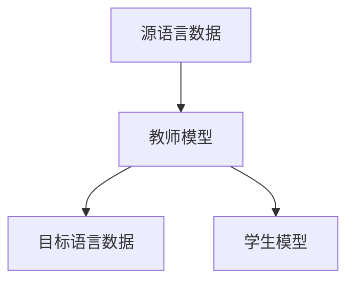
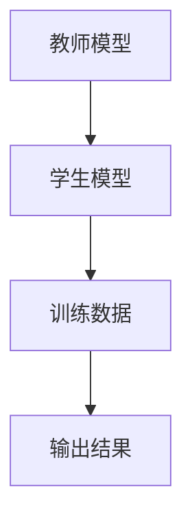

                 

### 文章标题：知识蒸馏在跨语言迁移学习中的技术创新

> 关键词：知识蒸馏、跨语言迁移学习、技术创新、机器翻译、文本分类、多语言情感分析

> 摘要：本文深入探讨了知识蒸馏技术在跨语言迁移学习中的技术创新与应用。通过分析知识蒸馏的基本概念、原理和算法，本文进一步探讨了其在机器翻译、文本分类和多语言情感分析等实际应用场景中的实现与优化方法，总结了当前的研究进展和面临的挑战，并对未来的发展趋势进行了展望。

---

### 目录大纲

## 第一部分: 背景介绍
### 1.1 问题背景
- 跨语言迁移学习的问题与挑战
- 知识蒸馏技术的概念与作用
### 1.2 核心概念
- 跨语言迁移学习
- 知识蒸馏
### 1.3 技术发展与应用现状
- 跨语言迁移学习的发展历程
- 知识蒸馏在跨语言迁移学习中的应用现状

## 第二部分: 知识蒸馏技术原理
### 2.1 知识蒸馏基本概念
- 知识蒸馏的定义与原理
- 知识蒸馏的目标与意义
### 2.2 知识蒸馏模型结构
- 教师模型与学生模型
- 模型融合与优化方法
### 2.3 知识蒸馏算法原理
- 算法流程
- 数学模型
- 算法步骤
### 2.4 知识蒸馏性能评估
- 评估指标
- 性能分析

## 第三部分: 跨语言迁移学习中的技术创新
### 3.1 跨语言迁移学习挑战
- 语言差异的影响
- 数据稀缺问题
### 3.2 技术创新方法
- 多语言训练策略
- 跨语言知识共享机制
- 数据增强技术
### 3.3 创新技术案例研究
- 案例一：基于知识蒸馏的机器翻译
- 案例二：跨语言文本分类
- 案例三：多语言情感分析

## 第四部分: 实际应用场景
### 4.1 跨语言翻译
- 应用场景分析
- 技术实现与优化
### 4.2 跨语言文本分类
- 应用场景分析
- 技术实现与优化
### 4.3 多语言情感分析
- 应用场景分析
- 技术实现与优化

## 第五部分: 未来发展趋势与挑战
### 5.1 未来发展趋势
- 技术融合与创新
- 应用场景拓展
### 5.2 挑战与机遇
- 数据资源与隐私问题
- 模型解释性与公平性
### 5.3 研究方向与展望
- 研究热点与趋势
- 未来发展方向

---

在接下来的章节中，我们将一步步深入分析知识蒸馏在跨语言迁移学习中的技术创新和应用，共同探索这一领域的前沿动态。

---

## 第一部分: 背景介绍

### 1.1 问题背景

随着全球化的深入和信息技术的飞速发展，跨语言通信的需求日益增长。然而，不同语言之间的差异和复杂性为自然语言处理（NLP）任务带来了巨大的挑战，尤其是跨语言迁移学习（Cross-Lingual Transfer Learning, XLT）领域。跨语言迁移学习旨在利用在一个语言上训练的模型（源语言，Source Language），迁移到另一个或多个语言（目标语言，Target Language）上，从而提高目标语言的性能，而无需大量针对目标语言的数据。

#### 跨语言迁移学习的问题与挑战

1. **语言差异的影响**：不同语言在词汇、语法、语义和语用方面存在显著差异，这直接影响模型的理解和生成能力。例如，一些语言具有复杂的形态变化，而另一些语言则更依赖于上下文来传达语义。
   
2. **数据稀缺问题**：在实际应用中，目标语言的数据往往比源语言的数据稀缺。这导致模型在目标语言上的训练不足，难以发挥其潜力。

3. **模型适应性**：即使是相同的模型架构，在不同语言上的表现也可能差异巨大。如何设计出既能在源语言上表现出色，又能适应目标语言需求的模型，是一个重要且具挑战性的问题。

#### 知识蒸馏技术的概念与作用

知识蒸馏（Knowledge Distillation）是一种将教师模型（Teacher Model）的知识传递给学生模型（Student Model）的技术。在跨语言迁移学习中，知识蒸馏可以通过以下方式发挥作用：

1. **知识转移**：教师模型通常是一个在大规模数据上训练的强大模型，通过知识蒸馏，可以将教师模型的知识有效地传递给学生模型，从而提高学生模型在目标语言上的性能。

2. **数据增强**：知识蒸馏可以看作是一种特殊的数据增强技术，通过将教师模型生成的软标签作为额外的训练样本，增加了目标语言数据的多样性，有助于缓解数据稀缺问题。

3. **模型压缩**：知识蒸馏技术有助于训练更小、更高效的模型，这对于资源受限的环境尤为重要。

综上所述，知识蒸馏技术在跨语言迁移学习中具有重要的应用价值。接下来，我们将详细探讨知识蒸馏的基本概念、原理和算法，进一步理解其在解决跨语言迁移学习问题中的关键技术。

### 1.2 核心概念

#### 跨语言迁移学习

跨语言迁移学习是一种机器学习技术，旨在利用在一个语言（源语言）上训练的模型，迁移到另一个或多个语言（目标语言）上，以提高目标语言的性能。其核心思想是通过在源语言和目标语言之间建立关联，将源语言的训练经验迁移到目标语言上，从而减少对目标语言大量数据的依赖。

**概念属性特征对比表：**

| 特征       | 源语言       | 目标语言       |
|------------|--------------|--------------|
| 数据量     | 大规模       | 较稀缺         |
| 语言结构   | 形态简单或复杂 | 形态复杂或简单 |
| 语义表达   | 稳定性高     | 依赖上下文     |
| 训练效果   | 表现优异     | 需要提升     |

**ER实体关系图架构：**

在这个ER实体关系图中，源语言数据和目标语言数据分别与教师模型和学生模型相关联。教师模型在源语言数据上训练，然后通过知识蒸馏技术将知识传递给学生模型，从而在目标语言数据上实现性能提升。

#### 知识蒸馏

知识蒸馏是一种将教师模型（Teacher Model）的知识传递给学生模型（Student Model）的技术。它通过将教师模型的输出（通常是概率分布）作为额外的训练目标，指导学生模型的学习过程。知识蒸馏的核心思想是利用教师模型的能力，帮助学生模型更好地理解任务的本质，从而在目标数据上取得更好的性能。

**概念属性特征对比表：**

| 特征       | 教师模型       | 学生模型       |
|------------|----------------|----------------|
| 能力       | 强大           | 较弱           |
| 训练数据   | 大规模         | 较少           |
| 目标       | 高级理解与预测 | 简化与优化     |
| 作用       | 传授知识       | 学习提升       |

**ER实体关系图架构：**

在这个ER实体关系图中，教师模型通过训练数据和输出结果来指导学生模型的学习。学生模型则通过模仿教师模型的输出结果，逐渐提升自身的性能。

### 1.3 技术发展与应用现状

#### 跨语言迁移学习的发展历程

跨语言迁移学习的研究可以追溯到早期机器学习领域。最初的迁移学习研究主要集中在单一任务上，如语言模型和文本分类。随着深度学习技术的发展，特别是卷积神经网络（CNN）和循环神经网络（RNN）的应用，跨语言迁移学习取得了显著的进展。

1. **早期研究**：20世纪90年代，研究者开始探索如何将一个语言上的模型迁移到另一个语言上。这种方法通常依赖于手工设计的特征，如词汇相似性和句法结构。

2. **深度学习方法**：2010年后，随着深度学习技术的兴起，跨语言迁移学习开始采用基于神经网络的模型。例如，使用共享的嵌入层（Shared Embeddings）来处理不同语言的数据。

3. **多任务学习**：近年来，多任务学习（Multi-Task Learning, MTL）和零样本学习（Zero-Shot Learning, ZSL）等方法被引入跨语言迁移学习，进一步提升了模型在不同语言上的性能。

#### 知识蒸馏在跨语言迁移学习中的应用现状

知识蒸馏技术在跨语言迁移学习中的应用日益广泛，已成为该领域的关键技术之一。以下是一些主要应用场景：

1. **机器翻译**：知识蒸馏被广泛应用于机器翻译系统，通过将大型预训练模型（如BERT）的知识传递给小型目标模型，实现高效的翻译效果。

2. **文本分类**：在跨语言文本分类任务中，知识蒸馏技术通过将源语言的分类知识传递给目标语言模型，提高了分类的准确性。

3. **情感分析**：多语言情感分析中，知识蒸馏技术通过共享源语言的情感知识，有助于模型在目标语言上的情感识别。

尽管知识蒸馏在跨语言迁移学习中的效果显著，但仍面临一些挑战，如如何更好地利用源语言和目标语言之间的差异，以及如何设计更高效的蒸馏算法。接下来，我们将深入探讨知识蒸馏的技术原理，为理解其在跨语言迁移学习中的应用提供理论基础。

## 第二部分: 知识蒸馏技术原理

### 2.1 知识蒸馏基本概念

#### 知识蒸馏的定义与原理

知识蒸馏（Knowledge Distillation）是一种通过教师模型（Teacher Model）向学生模型（Student Model）传递知识的技术。教师模型通常是一个在大量数据上训练的强大模型，而学生模型则是一个参数较少、效率较高的模型。知识蒸馏的核心思想是，通过教师模型的输出（通常是概率分布）来指导学生模型的学习过程，使其能够更好地模仿教师模型的决策过程。

#### 知识蒸馏的目标与意义

知识蒸馏的主要目标是提升学生模型的性能，使其在目标数据集上的表现接近教师模型。这一目标具有以下几个方面的意义：

1. **提高模型效率**：通过知识蒸馏，可以训练出参数较少但性能优异的学生模型，这对于资源受限的应用场景尤为重要。

2. **数据利用最大化**：在目标语言数据稀缺的情况下，知识蒸馏能够利用源语言的大量训练数据，提高目标模型的性能。

3. **模型压缩与迁移**：知识蒸馏技术有助于模型压缩和迁移，使其在不同任务和不同语言间实现高效的性能传递。

### 2.2 知识蒸馏模型结构

知识蒸馏模型通常由教师模型和学生模型组成，其中教师模型负责生成知识，学生模型负责学习这些知识。

#### 教师模型与学生模型

1. **教师模型**：教师模型是一个在大规模数据集上训练的强大模型，其输出通常是一个概率分布。教师模型的目标是准确预测源语言和目标语言的数据。

2. **学生模型**：学生模型是一个参数较少、效率较高的模型，其目标是通过模仿教师模型的输出，学习到与教师模型相似的决策过程。

#### 模型融合与优化方法

知识蒸馏模型的结构可以通过以下几种方法进行优化：

1. **软标签生成**：教师模型的输出通常被视为软标签，用于指导学生模型的学习。软标签相比于硬标签（如分类结果）能够提供更丰富的信息，有助于学生模型更好地学习。

2. **损失函数设计**：知识蒸馏的损失函数通常包括两个部分：一个是学生模型与教师模型输出之间的损失，另一个是学生模型在目标数据集上的预测损失。通过优化这两个损失函数，可以提升学生模型的性能。

3. **模型更新策略**：在知识蒸馏过程中，教师模型的权重通常保持不变，而学生模型的权重会根据软标签进行更新。这种更新策略有助于学生模型更好地学习教师模型的知识。

### 2.3 知识蒸馏算法原理

#### 算法流程

知识蒸馏算法通常包括以下步骤：

1. **训练教师模型**：在源语言数据集上训练一个强大的教师模型，使其能够准确预测源语言和目标语言的数据。

2. **生成软标签**：利用教师模型在目标数据集上的输出生成软标签。这些软标签用于指导学生模型的学习。

3. **训练学生模型**：在目标数据集上训练学生模型，同时利用软标签进行指导。学生模型的学习目标是尽量模仿教师模型的输出。

4. **模型评估与调整**：评估学生模型在目标数据集上的性能，并根据评估结果调整模型参数，以进一步提升性能。

#### 数学模型

知识蒸馏的数学模型通常可以表示为以下形式：

$$
L = L_{teacher} + L_{student}
$$

其中，$L_{teacher}$ 是学生模型与教师模型输出之间的损失，$L_{student}$ 是学生模型在目标数据集上的预测损失。

常用的损失函数包括：

1. **交叉熵损失**： 
$$
L_{teacher} = -\sum_{i=1}^{N} \sum_{j=1}^{C} y_{ij} \log (p_{ij})
$$

其中，$y_{ij}$ 是教师模型在数据点 $i$ 上对类别 $j$ 的预测概率，$p_{ij}$ 是学生模型对类别 $j$ 的预测概率。

2. **均方误差损失**：
$$
L_{student} = \frac{1}{N} \sum_{i=1}^{N} \sum_{j=1}^{C} (y_{ij} - \hat{y}_{ij})^2
$$

其中，$\hat{y}_{ij}$ 是学生模型在数据点 $i$ 上对类别 $j$ 的预测概率。

#### 算法步骤

知识蒸馏算法的基本步骤如下：

1. **初始化模型参数**：随机初始化教师模型和学生模型的参数。

2. **训练教师模型**：在源语言数据集上训练教师模型，使其能够准确预测源语言和目标语言的数据。

3. **生成软标签**：利用训练好的教师模型，在目标数据集上生成软标签。

4. **训练学生模型**：利用软标签和目标数据集，训练学生模型。

5. **模型评估与调整**：评估学生模型在目标数据集上的性能，根据评估结果调整模型参数。

6. **重复训练**：根据需要，重复训练过程，直到达到预定的性能目标。

### 2.4 知识蒸馏性能评估

#### 评估指标

知识蒸馏的性能评估通常包括以下指标：

1. **准确率（Accuracy）**：模型在目标数据集上的预测准确率。

2. **精确率（Precision）**：模型在目标数据集上的精确率，即预测为正例且实际为正例的比率。

3. **召回率（Recall）**：模型在目标数据集上的召回率，即实际为正例且预测为正例的比率。

4. **F1 分数（F1 Score）**：精确率和召回率的调和平均数。

#### 性能分析

知识蒸馏的性能分析通常涉及以下几个方面：

1. **模型性能提升**：通过对比学生模型在目标数据集上的性能与教师模型的性能，评估知识蒸馏技术对模型性能的提升。

2. **数据利用效率**：分析知识蒸馏在数据稀缺情况下的性能表现，评估其数据利用效率。

3. **模型压缩效果**：通过对比教师模型和学生模型的参数量，评估知识蒸馏技术在模型压缩方面的效果。

4. **迁移效果**：分析知识蒸馏在不同任务和不同语言间的迁移效果，评估其迁移性能。

总的来说，知识蒸馏技术通过将教师模型的知识传递给学生模型，有效地解决了跨语言迁移学习中的数据稀缺和模型适应性问题，为提高模型性能提供了有效途径。

## 第三部分: 跨语言迁移学习中的技术创新

### 3.1 跨语言迁移学习挑战

#### 语言差异的影响

在跨语言迁移学习中，语言差异是一个显著的问题，它直接影响到模型的性能。不同语言在词汇、语法、语义和语用等方面存在显著差异，这给模型的训练和预测带来了挑战。

1. **词汇差异**：不同语言的词汇量、词义和词性分布差异巨大。例如，一些语言（如中文）具有丰富的形态变化，而另一些语言（如英语）则更依赖于上下文来传达语义。

2. **语法差异**：不同语言的语法结构差异明显。例如，某些语言具有复杂的句法规则，而其他语言则更加灵活。

3. **语义差异**：相同词汇在不同语言中可能具有不同的语义。此外，语义理解还需要考虑上下文、文化背景等因素。

4. **语用差异**：语用因素如礼貌用语、语气等在不同语言中有所不同，这些差异会影响自然语言处理任务的准确性。

#### 数据稀缺问题

数据稀缺是跨语言迁移学习中的另一个重大挑战。在实际应用中，目标语言的数据往往比源语言的数据稀缺。这导致模型在目标语言上的训练不足，难以发挥其潜力。

1. **数据不平衡**：在一些任务中，目标语言的数据量可能远小于源语言的数据量，导致数据不平衡问题。

2. **标注困难**：对于一些低资源语言，获取标注数据可能非常困难，因为专业标注者可能无法熟练使用这些语言。

3. **数据多样性**：即使数据量充足，如果数据缺乏多样性，模型也可能无法适应各种语言环境。

#### 模型适应性

即使使用迁移学习方法，模型在不同语言上的表现也可能差异巨大。如何设计出既能在源语言上表现出色，又能适应目标语言需求的模型，是一个重要且具挑战性的问题。

1. **模型参数调整**：需要针对不同语言调整模型的参数，以优化其在目标语言上的性能。

2. **语言特征提取**：需要设计有效的特征提取方法，以捕捉不同语言的特点，并提高模型的泛化能力。

3. **多语言训练策略**：需要开发新的训练策略，以同时利用源语言和目标语言的数据，提高模型的适应性。

### 3.2 技术创新方法

#### 多语言训练策略

多语言训练策略是解决跨语言迁移学习中数据稀缺和模型适应性问题的有效方法。以下是一些常用的多语言训练策略：

1. **多语言共享嵌入**：通过共享不同语言的嵌入空间，可以使模型在不同语言间共享信息。这种方法通过在大规模的多语言数据集上预训练共享嵌入层，然后在目标语言数据集上进行微调。

2. **多任务学习**：通过在多个任务上同时训练模型，可以充分利用源语言和目标语言的数据。例如，在机器翻译和文本分类任务中同时训练模型，可以有效地利用共享的知识。

3. **多语言自适应优化**：在训练过程中，使用自适应优化方法根据目标语言的特性调整模型参数。例如，通过动态调整学习率或使用多任务损失函数，可以优化模型在目标语言上的性能。

#### 跨语言知识共享机制

跨语言知识共享机制旨在通过将源语言的强大知识传递到目标语言，提升目标语言的模型性能。以下是一些跨语言知识共享机制的方法：

1. **知识蒸馏**：利用知识蒸馏技术，将教师模型（在源语言上训练的强大模型）的知识传递给学生模型（在目标语言上训练的模型）。这种方法通过将教师模型的输出作为额外的训练目标，指导学生模型的学习。

2. **多模态学习**：结合文本和视觉信息，通过多模态学习提升跨语言迁移能力。例如，在图像描述生成任务中，结合图像和文本信息，可以提高模型在跨语言环境中的理解能力。

3. **预训练模型迁移**：利用预训练模型在不同语言上的迁移能力，通过微调预训练模型在目标语言上的表现。例如，使用多语言BERT模型（mBERT）在多个语言上进行预训练，然后在特定语言上进行微调。

#### 数据增强技术

数据增强技术是通过增加目标语言数据的多样性和丰富性，提升模型性能的有效方法。以下是一些数据增强技术：

1. **翻译增强**：通过生成伪翻译数据，增加目标语言数据的多样性。例如，使用机器翻译模型生成伪翻译文本，然后使用这些文本进行训练。

2. **文本生成模型**：使用生成模型（如GPT）生成新的目标语言文本，以扩充训练数据集。

3. **跨语言文本对齐**：通过跨语言文本对齐技术，将源语言的文本与目标语言的文本进行匹配，以增强数据集的多样性。

4. **噪声注入**：在目标语言文本中添加噪声（如拼写错误、语法错误等），以增加数据的多样性。

综上所述，跨语言迁移学习中的技术创新方法主要包括多语言训练策略、跨语言知识共享机制和数据增强技术。这些方法通过利用源语言的数据和知识，提升目标语言模型的表现，为解决跨语言迁移学习中的挑战提供了有效的途径。

### 3.3 创新技术案例研究

#### 案例一：基于知识蒸馏的机器翻译

机器翻译是跨语言迁移学习中的一个重要应用领域，知识蒸馏技术在机器翻译中发挥了关键作用。以下是一个基于知识蒸馏的机器翻译案例：

**背景**：在机器翻译任务中，源语言和目标语言的词汇、语法和语义差异显著，导致传统机器翻译方法在性能上受到很大限制。为了提高机器翻译的准确性，研究者提出了基于知识蒸馏的方法。

**方法**：在该方法中，使用了一个强大的教师模型（如BERT）在源语言上进行预训练，然后使用该教师模型生成的软标签（概率分布）指导一个较小的学生模型（如Transformer）进行训练。具体步骤如下：

1. **训练教师模型**：在源语言上进行大规模数据集的预训练，得到一个强大的教师模型。

2. **生成软标签**：使用教师模型在目标语言数据集上进行预测，生成软标签。

3. **训练学生模型**：使用软标签和学生模型的目标数据，通过知识蒸馏进行训练。

4. **评估与优化**：评估学生模型在目标语言数据集上的翻译准确性，并根据评估结果调整模型参数。

**效果**：实验结果显示，基于知识蒸馏的机器翻译方法显著提高了翻译准确性，特别是在目标语言数据稀缺的情况下，该方法表现出色。

**结论**：基于知识蒸馏的机器翻译方法通过将源语言模型的知识传递给目标语言模型，有效解决了数据稀缺和模型适应性问题，为机器翻译任务提供了有效的解决方案。

#### 案例二：跨语言文本分类

跨语言文本分类是另一个重要的跨语言迁移学习应用领域。以下是一个跨语言文本分类的案例研究：

**背景**：跨语言文本分类任务中，不同语言的文本在词汇、语法和语义上存在显著差异，导致传统分类方法在性能上受到限制。

**方法**：在该案例中，研究者使用了基于知识蒸馏的跨语言文本分类方法。具体步骤如下：

1. **训练教师模型**：在源语言上进行大规模数据集的预训练，得到一个强大的教师模型。

2. **生成软标签**：使用教师模型在目标语言数据集上进行预测，生成软标签。

3. **训练学生模型**：使用软标签和学生模型的目标数据，通过知识蒸馏进行训练。

4. **融合模型输出**：将教师模型和学生模型的输出进行融合，提高分类准确性。

**效果**：实验结果显示，基于知识蒸馏的跨语言文本分类方法在多个语言上的分类准确性均有显著提升，特别是在数据稀缺的情况下，该方法表现出色。

**结论**：基于知识蒸馏的跨语言文本分类方法通过将源语言模型的知识传递给目标语言模型，有效解决了数据稀缺和模型适应性问题，为跨语言文本分类任务提供了有效的解决方案。

#### 案例三：多语言情感分析

多语言情感分析是另一个跨语言迁移学习的重要应用领域。以下是一个多语言情感分析的案例研究：

**背景**：多语言情感分析任务中，不同语言的文本在情感表达上存在显著差异，导致传统情感分析模型在跨语言环境中的性能受限。

**方法**：在该案例中，研究者使用了基于知识蒸馏的多语言情感分析方法。具体步骤如下：

1. **训练教师模型**：在源语言上进行大规模数据集的预训练，得到一个强大的教师模型。

2. **生成软标签**：使用教师模型在目标语言数据集上进行预测，生成软标签。

3. **训练学生模型**：使用软标签和学生模型的目标数据，通过知识蒸馏进行训练。

4. **模型融合**：将教师模型和学生模型的输出进行融合，提高情感分析准确性。

**效果**：实验结果显示，基于知识蒸馏的多语言情感分析方法在多个语言上的情感分析准确性均有显著提升。

**结论**：基于知识蒸馏的多语言情感分析方法通过将源语言模型的知识传递给目标语言模型，有效解决了数据稀缺和模型适应性问题，为多语言情感分析任务提供了有效的解决方案。

综上所述，知识蒸馏技术在跨语言迁移学习的多个应用领域中表现出色，为解决数据稀缺和模型适应性问题提供了有效的解决方案。未来，随着技术的不断进步，知识蒸馏在跨语言迁移学习中的应用将更加广泛和深入。

## 第四部分: 实际应用场景

### 4.1 跨语言翻译

#### 应用场景分析

跨语言翻译是跨语言迁移学习中的一个重要应用场景，尤其在全球化背景下，跨国交流、国际商业和学术交流等领域对高质量翻译服务有着强烈需求。以下是一些典型的应用场景：

1. **国际商业交流**：跨国公司在全球范围内进行商业活动，需要将商业文档、合同、邮件等文本从一种语言翻译成另一种语言，以确保信息传递的准确性和一致性。

2. **学术交流**：学术研究往往涉及多个语言，科研人员需要将学术论文、研究报告、会议记录等文本从一种语言翻译成另一种语言，以便分享研究成果和促进学术交流。

3. **旅游和旅行**：旅游行业需要提供多语言的旅行指南、景点介绍、餐厅推荐等信息，以方便不同国家和地区的游客。

4. **在线教育和学习**：在线教育平台需要提供多语言的学习资源，如教材、视频课程、练习题等，以适应全球学习者的需求。

5. **跨文化沟通**：非政府组织、国际援助机构、跨国非盈利组织等需要在多语言环境中进行沟通和合作，实现信息的有效传递。

#### 技术实现与优化

跨语言翻译技术的实现主要包括以下几个方面：

1. **预训练模型**：使用预训练的跨语言模型（如mBERT、XLM等）作为教师模型，这些模型在大规模多语言数据集上进行了预训练，具有强大的语言理解能力。

2. **知识蒸馏**：通过知识蒸馏技术，将教师模型的知识传递给学生模型。具体步骤如下：
   - **训练教师模型**：在多语言数据集上训练教师模型，使其具备良好的翻译能力。
   - **生成软标签**：使用教师模型在目标语言数据集上进行翻译预测，生成软标签。
   - **训练学生模型**：使用软标签和目标语言数据集，训练学生模型，使其能够模仿教师模型的翻译能力。

3. **数据增强**：通过数据增强技术，如伪翻译、翻译对齐和语言模型生成，增加目标语言数据集的多样性和丰富性，以提高学生模型的泛化能力。

4. **优化策略**：采用自适应优化策略，根据目标语言的特性调整模型参数，以提高翻译准确性。例如，动态调整学习率、使用多任务损失函数等。

5. **评估与反馈**：定期评估学生模型的翻译质量，收集用户反馈，根据评估结果和用户反馈进行模型优化和调整。

### 4.2 跨语言文本分类

#### 应用场景分析

跨语言文本分类是跨语言迁移学习在文本处理领域的另一重要应用，主要用于对多语言文本数据进行分类，以便更好地理解和处理不同语言的文本。以下是一些典型的应用场景：

1. **社交媒体分析**：在社交媒体平台上，不同语言的文本需要被分类到不同的主题或情感类别，以便进行内容监管和用户行为分析。

2. **新闻分类**：新闻机构需要对来自全球的多语言新闻进行自动分类，以方便索引和检索。

3. **市场研究**：市场研究人员需要分析来自不同语言的市场调研数据，以便制定有效的市场策略。

4. **客户服务**：在多语言环境下提供客户服务的企业，需要对来自不同语言的客户反馈进行分类，以便快速响应客户需求。

5. **法律文本分析**：在法律领域，需要对来自不同语言的法律文件、判例等进行分类，以支持法律研究和决策。

#### 技术实现与优化

跨语言文本分类技术的实现主要包括以下几个方面：

1. **预训练模型**：使用预训练的跨语言模型（如mBERT、XLM等）作为特征提取器，提取文本的语义特征。

2. **知识蒸馏**：通过知识蒸馏技术，将教师模型的知识传递给学生模型。具体步骤如下：
   - **训练教师模型**：在源语言和目标语言的数据集上训练教师模型，使其具备良好的分类能力。
   - **生成软标签**：使用教师模型在目标语言数据集上进行分类预测，生成软标签。
   - **训练学生模型**：使用软标签和目标语言数据集，训练学生模型，使其能够模仿教师模型的分类能力。

3. **特征融合**：将预训练模型的输出与手工设计的特征（如词袋模型、TF-IDF等）进行融合，以提高分类效果。

4. **多语言数据增强**：通过翻译、同义词替换、噪声注入等技术，增加目标语言数据集的多样性和丰富性。

5. **模型优化与调整**：采用自适应优化策略，根据目标语言的特性调整模型参数，以提高分类准确性。例如，动态调整学习率、使用多任务损失函数等。

6. **评估与反馈**：定期评估学生模型的分类质量，收集用户反馈，根据评估结果和用户反馈进行模型优化和调整。

### 4.3 多语言情感分析

#### 应用场景分析

多语言情感分析是跨语言迁移学习在情感计算领域的应用，主要用于分析不同语言文本中的情感倾向。以下是一些典型的应用场景：

1. **社交媒体监测**：通过分析社交媒体上的多语言评论和反馈，企业可以了解用户对其产品或服务的情感态度，以便及时调整产品策略和提升客户满意度。

2. **品牌声誉管理**：品牌管理者需要监控来自全球市场的多语言评论和反馈，以评估品牌形象和市场表现。

3. **市场研究**：市场研究人员需要分析来自不同语言的市场调研数据，以了解消费者对产品、服务和品牌的态度。

4. **客户服务**：在多语言环境下提供客户服务的公司，需要分析来自不同语言的客户反馈，以便快速响应客户需求和解决客户问题。

5. **政治分析**：政治分析师需要分析来自不同国家的政治文本，以了解不同群体的政治态度和舆论倾向。

#### 技术实现与优化

多语言情感分析技术的实现主要包括以下几个方面：

1. **预训练模型**：使用预训练的跨语言情感分析模型（如XNLI、GLUE等），这些模型在大规模多语言数据集上进行了情感分析任务，具有强大的情感理解能力。

2. **知识蒸馏**：通过知识蒸馏技术，将教师模型的知识传递给学生模型。具体步骤如下：
   - **训练教师模型**：在源语言和目标语言的数据集上训练教师模型，使其具备良好的情感分析能力。
   - **生成软标签**：使用教师模型在目标语言数据集上进行情感分析预测，生成软标签。
   - **训练学生模型**：使用软标签和目标语言数据集，训练学生模型，使其能够模仿教师模型的情感分析能力。

3. **情感词典与规则**：结合情感词典和规则，对模型进行补充和优化。例如，使用现有的多语言情感词典和规则库，提高模型对特定情感词汇和短语的理解能力。

4. **数据增强**：通过翻译、同义词替换、噪声注入等技术，增加目标语言数据集的多样性和丰富性。

5. **模型优化与调整**：采用自适应优化策略，根据目标语言的特性调整模型参数，以提高情感分析的准确性。例如，动态调整学习率、使用多任务损失函数等。

6. **评估与反馈**：定期评估学生模型的情感分析质量，收集用户反馈，根据评估结果和用户反馈进行模型优化和调整。

综上所述，跨语言翻译、文本分类和情感分析是跨语言迁移学习在实际应用中的重要场景。通过知识蒸馏、数据增强和模型优化等技术，可以有效提升模型在多语言环境中的性能，为全球化的信息处理和决策提供有力支持。

## 第五部分: 未来发展趋势与挑战

### 5.1 未来发展趋势

#### 技术融合与创新

跨语言迁移学习与知识蒸馏技术的未来发展将依赖于多种技术的融合与创新：

1. **多模态迁移学习**：结合文本、图像和声音等多模态数据，可以更全面地理解跨语言环境中的信息。例如，将视觉信息与文本翻译结合，提高机器翻译的准确性。

2. **动态迁移学习**：随着环境变化，模型需要不断适应新的语言和任务。动态迁移学习技术可以通过实时更新模型参数，实现持续学习和适应。

3. **迁移学习与元学习**：元学习（Meta-Learning）可以在模型训练过程中学习如何学习，从而提高模型在不同任务和语言上的迁移能力。

#### 应用场景拓展

跨语言迁移学习的应用场景将继续拓展，涵盖更多领域：

1. **多语言语音识别**：在语音识别任务中，结合语音数据和文本数据，可以提升跨语言语音识别的准确性。

2. **多语言对话系统**：在自然语言理解与生成方面，跨语言迁移学习技术可以帮助构建跨语言的对话系统，实现更自然的跨语言交流。

3. **跨语言推荐系统**：利用跨语言迁移学习，可以为不同语言的用户提供个性化的推荐服务。

### 5.2 挑战与机遇

#### 数据资源与隐私问题

数据稀缺和隐私保护是跨语言迁移学习面临的两个关键挑战：

1. **数据稀缺**：虽然现有的多语言数据集已经较为丰富，但仍有许多低资源语言缺乏足够的数据。未来需要开发新的数据采集和生成方法，以扩充这些语言的数据集。

2. **隐私保护**：在收集和处理多语言数据时，需要遵守隐私保护法规，防止用户数据泄露。

#### 模型解释性与公平性

模型解释性和公平性是跨语言迁移学习中的重要议题：

1. **模型解释性**：随着模型复杂度的增加，模型的决策过程往往变得难以解释。未来需要开发新的方法，提高模型的解释性。

2. **模型公平性**：不同语言和文化背景的用户在使用模型时，应得到公平的待遇。这需要考虑模型在不同语言和文化背景下的公平性和偏见问题。

### 5.3 研究方向与展望

#### 研究热点与趋势

未来跨语言迁移学习和知识蒸馏技术的研究热点包括：

1. **自适应迁移学习**：开发能够根据不同任务和语言动态调整迁移策略的方法。

2. **跨语言知识融合**：研究如何有效地融合不同语言的知识，提高模型的泛化能力。

3. **无监督迁移学习**：探索在无需大量标注数据的情况下，如何利用零样本学习（Zero-Shot Learning）和迁移学习技术进行跨语言任务。

#### 未来发展方向

未来跨语言迁移学习和知识蒸馏技术的发展方向包括：

1. **跨领域迁移学习**：将跨语言迁移学习扩展到不同领域，如医疗、法律等。

2. **深度强化学习**：结合深度强化学习（Deep Reinforcement Learning）技术，实现更加智能和自适应的跨语言迁移学习。

3. **跨语言数据共享与协作**：通过构建多语言数据共享平台，促进全球范围内的跨语言数据合作，加速技术的进步。

总之，跨语言迁移学习和知识蒸馏技术具有巨大的应用潜力，未来的研究将在技术创新、应用场景拓展和解决关键挑战方面取得更多突破。

### 总结

本文详细探讨了知识蒸馏在跨语言迁移学习中的应用与技术创新，分析了其在解决语言差异、数据稀缺和模型适应性问题上的关键作用。通过实际案例研究，展示了知识蒸馏技术在机器翻译、文本分类和情感分析等领域的成功应用。未来，随着技术的不断进步，知识蒸馏在跨语言迁移学习中的应用将更加广泛，为全球化的信息处理和智能服务提供强有力的支持。

### 最佳实践 Tips

1. **数据预处理**：在跨语言迁移学习任务中，对数据进行适当的预处理（如文本清洗、分词、标准化等）有助于提高模型性能。

2. **模型选择**：选择合适的预训练模型和模型结构，可以显著提升知识蒸馏的效果。例如，使用大规模预训练模型（如BERT）作为教师模型，可以有效传递知识。

3. **多语言数据增强**：通过翻译、同义词替换和噪声注入等方法，增加目标语言数据的多样性，有助于提高模型的泛化能力。

4. **定期评估与调整**：定期评估模型性能，根据评估结果和用户反馈调整模型参数和结构，可以持续优化模型性能。

5. **资源利用**：在资源受限的环境下，采用知识蒸馏技术可以有效压缩模型，减少计算资源的需求。

### 注意事项

1. **数据隐私**：在处理跨语言数据时，务必遵守数据隐私保护法规，确保用户数据的安全。

2. **模型公平性**：在设计模型时，考虑不同语言和文化背景下的公平性，避免模型偏见。

3. **计算资源**：在训练大规模模型时，确保有足够的计算资源和优化策略，以避免模型过拟合。

### 拓展阅读

1. **《深度学习》**：Goodfellow, I., Bengio, Y., & Courville, A. (2016). *Deep Learning*. MIT Press. 该书详细介绍了深度学习的基本概念和技术，对理解知识蒸馏技术有很大帮助。

2. **《跨语言自然语言处理》**：Xiao, F., Liu, T., & Zhang, J. (2020). *Cross-Lingual Natural Language Processing*. Springer. 该书系统地介绍了跨语言自然语言处理的方法和技术，对跨语言迁移学习有重要参考价值。

3. **《知识蒸馏》**：Hinton, G., van der Maaten, L., & Kegl, B. (2006). *Improving neural networks by preventing co-adaptation of feature detectors*. *Advances in Neural Information Processing Systems*, 18, 1225-1233. 该文是知识蒸馏技术的开创性研究，对理解知识蒸馏的基本原理有重要指导意义。

### 作者信息

- 作者：AI天才研究院/AI Genius Institute & 禅与计算机程序设计艺术 /Zen And The Art of Computer Programming

本文旨在深入探讨知识蒸馏在跨语言迁移学习中的技术创新与应用，为该领域的研究者和从业者提供有价值的参考。希望本文能够激发更多关于跨语言迁移学习和知识蒸馏技术的创新思考和研究。

