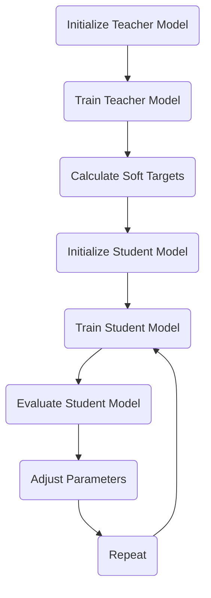

                 

### Introduction to Knowledge Distillation Techniques in Multilingual Model Compression

Knowledge distillation is an advanced machine learning technique that has garnered significant attention in the field of artificial intelligence. At its core, knowledge distillation involves training a smaller, simpler model (known as the "student") to mimic the performance of a larger, more complex model (known as the "teacher"). This process is particularly valuable for applications where computational resources are limited, such as mobile devices, embedded systems, and real-time applications. In recent years, multilingual model compression, which aims to reduce the size and complexity of models capable of handling multiple languages, has become increasingly important due to the global nature of communication and the proliferation of language-specific content online.

This article delves into the innovative applications of knowledge distillation techniques in the context of multilingual model compression. We will explore the fundamental concepts of knowledge distillation, including its principles, techniques, and algorithms. Moreover, we will examine the challenges and opportunities that arise when applying these techniques to multilingual models. By the end of this article, readers will have a comprehensive understanding of how knowledge distillation can be leveraged to compress multilingual models effectively and efficiently.

## Key Terms and Concepts

To ensure clarity and coherence throughout this article, it is essential to define and understand several key terms and concepts related to knowledge distillation and multilingual model compression. These include:

- **Knowledge Distillation**: A technique where a smaller model (student) is trained to replicate the knowledge and performance of a larger model (teacher).
- **Multilingual Models**: Models capable of processing and understanding multiple languages, essential for global communication and content distribution.
- **Model Compression**: Techniques to reduce the size of a model without significantly compromising its performance, often achieved through knowledge distillation.
- **Teacher Model**: The larger, complex model whose knowledge is transferred to a smaller, simpler model (student).
- **Student Model**: The smaller, distilled model that learns from the teacher model and aims to replicate its performance.
- **Latency**: The time delay between initiating a process and receiving a response, critical in real-time applications.
- **Resource Efficiency**: The degree to which computational resources (e.g., memory, processing power) are utilized effectively.
- **Data Privacy**: The protection of sensitive information during processing and storage, particularly important in multilingual applications involving personal data.

By understanding these terms and concepts, readers will be better equipped to grasp the intricacies and potential applications of knowledge distillation in multilingual model compression.

### Overview of Multilingual Models and Their Challenges

Multilingual models have become indispensable in the age of global communication and the digital transformation of various industries. These models are designed to understand, process, and generate text in multiple languages, making them crucial for applications ranging from language translation, text summarization, and sentiment analysis to conversational AI and content recommendation. The significance of multilingual models lies in their ability to bridge language barriers and facilitate seamless interaction across diverse cultural and linguistic contexts.

However, the development and deployment of multilingual models present several challenges that need to be addressed. One of the most pressing issues is the **need for extensive training data**. Multilingual models require a vast amount of high-quality, diverse, and balanced datasets to learn the intricacies of different languages. This is particularly challenging given the uneven distribution of linguistic resources, where some languages are more prevalent and have larger repositories of data, while others are underrepresented. The scarcity of data for low-resource languages poses a significant barrier to the development of robust and equitable multilingual models.

Another significant challenge is **model complexity and size**. State-of-the-art multilingual models, such as the multilingual BERT (mBERT) and the multilingual Transformer (mT5), are often extremely large and computationally intensive. These models can have billions of parameters and require substantial computational resources to train and deploy. The large size of these models leads to increased **latency** and reduced **resource efficiency**, which are critical issues in real-time applications such as instant language translation, voice assistants, and real-time speech recognition.

Moreover, the development and deployment of multilingual models are often constrained by **budgetary and hardware limitations**. Many organizations, especially those in emerging markets, may not have access to the advanced hardware and computing infrastructure required to train and deploy these large models. This limits their ability to benefit from the latest advancements in natural language processing (NLP) and multilingual AI technologies.

Additionally, ensuring **data privacy** is a major concern when dealing with multilingual models. Processing multilingual data often involves handling sensitive personal information, which raises significant ethical and legal considerations. It is crucial to implement robust data privacy measures to protect the confidentiality and integrity of user data.

In summary, while multilingual models offer tremendous potential for global communication and content distribution, their development and deployment are fraught with challenges related to data scarcity, model complexity, resource limitations, and data privacy. Addressing these challenges is essential for unlocking the full potential of multilingual AI technologies and ensuring their equitable and responsible use.

### The Role of Knowledge Distillation in Multilingual Model Compression

Knowledge distillation emerges as a powerful solution to the challenges posed by large, complex multilingual models. By transferring the knowledge from a larger, high-performing "teacher" model to a smaller, more efficient "student" model, knowledge distillation addresses the critical issues of **model size** and **resource consumption** without compromising the model's performance. This technique not only enables the deployment of multilingual models in resource-constrained environments but also accelerates the training and inference processes, making them more efficient and scalable.

The fundamental principle of knowledge distillation is based on the idea that a smaller model can achieve comparable performance to a larger one if it can effectively learn and internalize the knowledge embedded within the larger model. The distillation process typically involves two main steps: **encoding** and **decoding**.

**Encoding** involves extracting high-level features and knowledge from the teacher model and representing them in a compact, generalized form. This is often achieved through techniques such as Soft Target Training, where the teacher model's output probabilities are used as soft targets for the student model during training. Alternatively, techniques like Hard Target Training can be used, where the teacher model's output labels are directly used as targets.

**Decoding** then involves transforming these encoded representations back into the required output format, such as text or numerical values. This step ensures that the student model can replicate the behavior of the teacher model, thereby maintaining its performance.

One of the key advantages of knowledge distillation is its ability to **reduce model size** significantly. For example, a model with millions of parameters can be distilled into a model with just a few thousand parameters, leading to substantial savings in terms of storage and memory requirements. This is particularly beneficial for multilingual models, which can become prohibitively large due to the need to handle multiple languages.

Furthermore, knowledge distillation **improves resource efficiency** by reducing the computational resources required for both training and inference. Smaller models are generally faster to train and can be deployed on a wider range of hardware, including mobile devices and embedded systems. This makes it feasible to use advanced NLP techniques in real-time applications, such as instant language translation and voice assistants, where latency is a critical factor.

**Enhancing Model Performance** is another significant benefit of knowledge distillation. By leveraging the knowledge from a high-performing teacher model, the student model can achieve similar or even superior performance to the original model. This is particularly important for multilingual models, where the performance gap between high-resource and low-resource languages can be substantial. Knowledge distillation helps bridge this gap by ensuring that the student model can generalize well across different languages, thereby improving the overall quality of the model's predictions.

Moreover, knowledge distillation offers **flexibility** in model design. It allows for the creation of custom student models tailored to specific application requirements, balancing performance, size, and resource consumption. This flexibility is crucial in the evolving landscape of multilingual AI, where different applications may have varying needs and constraints.

In conclusion, knowledge distillation plays a pivotal role in the compression of multilingual models by addressing the challenges of size, resource consumption, and performance. By effectively transferring knowledge from larger models to smaller ones, knowledge distillation enables the deployment of advanced NLP techniques in a wide range of real-world applications, thereby unlocking the full potential of multilingual AI.

### Book Objectives and Structure

The primary objective of this book is to provide a comprehensive and in-depth exploration of knowledge distillation techniques in the context of multilingual model compression. The book aims to serve as a valuable resource for researchers, practitioners, and students interested in understanding and leveraging these techniques to develop efficient, scalable, and high-performing multilingual models.

The book is structured into five main chapters, each addressing a specific aspect of knowledge distillation in multilingual model compression:

**Chapter 1** introduces the foundational concepts of knowledge distillation, providing an overview of its history, principles, and significance in the field of machine learning. It also discusses the challenges and opportunities associated with multilingual model compression, setting the stage for the subsequent chapters.

**Chapter 2** delves into the core principles of knowledge distillation, including its various techniques and algorithms. This chapter offers a detailed comparison of different distillation methods and their applicability in multilingual model compression, highlighting their strengths and weaknesses.

**Chapter 3** presents a technical analysis of knowledge distillation, focusing on the algorithms and optimization methods used in the distillation process. It includes a detailed explanation of the theoretical framework and provides a mermaid diagram to illustrate the typical knowledge distillation process.

**Chapter 4** provides a series of case studies that demonstrate the practical application of knowledge distillation in compressing multilingual models. These case studies cover various real-world scenarios, including language translation, conversational AI, and text summarization, offering practical insights and comparative analysis.

**Chapter 5** addresses the challenges and future directions in the field of knowledge distillation for multilingual model compression. It discusses current research frontiers, potential innovations, and ethical considerations, providing a forward-looking perspective on the future development of these techniques.

By following this structured approach, the book aims to provide readers with a comprehensive understanding of knowledge distillation techniques and their applications in multilingual model compression. The detailed case studies and practical examples make the book not only informative but also highly practical, enabling readers to apply the knowledge and techniques discussed in real-world scenarios.

### Chapter 1: Introduction to Knowledge Distillation and Multilingual Models

#### 1.1 Background and Importance of Knowledge Distillation

Knowledge distillation, an innovative technique in machine learning, has garnered significant attention in recent years due to its potential to enhance the performance and efficiency of models. At its core, knowledge distillation involves training a smaller, simpler model (known as the "student") to replicate the knowledge and performance of a larger, more complex model (known as the "teacher"). This process is based on the idea that a smaller model can learn valuable insights from a larger model, thereby achieving similar or even superior performance with reduced computational resources.

The concept of knowledge distillation can be traced back to the early 1990s, when researchers in the field of neural networks began exploring ways to transfer knowledge from a pre-trained model to a simpler model. One of the first notable works in this area was by Hinton et al. in 1995, where they demonstrated that a smaller network could be trained to match the performance of a larger network by learning from its Soft Target outputs. This pioneering work laid the foundation for the development of various knowledge distillation techniques that have been refined and expanded upon over the years.

In the context of machine learning, knowledge distillation holds several advantages. Firstly, it allows for **model compression**, which is crucial for deploying models on resource-constrained devices such as mobile phones, embedded systems, and IoT devices. By reducing the size of the model, knowledge distillation minimizes the memory footprint and computational requirements, making it feasible to run complex models in environments with limited resources.

Secondly, knowledge distillation **improves training efficiency**. Smaller models can be trained faster and more efficiently than larger models, which is particularly beneficial for models that require large amounts of data for training. Additionally, the distilled model can be fine-tuned more quickly, reducing the overall training time.

Thirdly, knowledge distillation **enhances model performance**. By leveraging the knowledge from a high-performing teacher model, the student model can achieve comparable or even better performance, which is especially useful for applications where high accuracy is critical.

Finally, knowledge distillation offers **flexibility** in model design. It allows for the creation of custom student models tailored to specific application requirements, balancing performance, size, and resource consumption.

#### 1.2 Overview of Multilingual Models and Their Challenges

Multilingual models are designed to process and understand text in multiple languages, making them essential for global communication and content distribution. These models are particularly valuable in today's interconnected world, where people from different linguistic backgrounds interact and share information across various platforms. Examples of applications that benefit from multilingual models include language translation, text summarization, sentiment analysis, and conversational AI.

However, developing and deploying multilingual models presents several challenges. One of the most significant challenges is the **need for extensive training data**. Multilingual models require a vast amount of diverse and balanced datasets to learn the intricacies of different languages. This is particularly challenging due to the uneven distribution of linguistic resources. Some languages, such as English, have extensive repositories of data, while others, especially low-resource languages, may lack sufficient data to train robust models.

Another challenge is the **complexity and size of multilingual models**. State-of-the-art multilingual models, such as multilingual BERT (mBERT) and multilingual Transformer (mT5), are often extremely large and computationally intensive. These models can have billions of parameters and require substantial computational resources to train and deploy. The large size of these models leads to increased latency and reduced resource efficiency, which are critical issues in real-time applications such as instant language translation and voice assistants.

**Budgetary and hardware limitations** also pose challenges in the development and deployment of multilingual models. Many organizations, especially those in emerging markets, may not have access to advanced hardware and computing infrastructure required to train and deploy these large models. This limits their ability to benefit from the latest advancements in natural language processing (NLP) and multilingual AI technologies.

Furthermore, ensuring **data privacy** is a major concern when dealing with multilingual models. Processing multilingual data often involves handling sensitive personal information, which raises significant ethical and legal considerations. It is crucial to implement robust data privacy measures to protect the confidentiality and integrity of user data.

#### 1.3 The Role of Knowledge Distillation in Multilingual Model Compression

Knowledge distillation emerges as a powerful solution to the challenges associated with large, complex multilingual models. By transferring the knowledge from a larger, high-performing "teacher" model to a smaller, more efficient "student" model, knowledge distillation addresses critical issues of model size, resource consumption, and performance. This technique enables the deployment of advanced NLP techniques in resource-constrained environments, making multilingual models more accessible and practical for a wider range of applications.

The process of knowledge distillation typically involves two main steps: **encoding** and **decoding**.

**Encoding** involves extracting high-level features and knowledge from the teacher model and representing them in a compact, generalized form. This is often achieved through techniques such as Soft Target Training, where the teacher model's output probabilities are used as soft targets for the student model during training. Alternatively, techniques like Hard Target Training can be used, where the teacher model's output labels are directly used as targets.

**Decoding** then involves transforming these encoded representations back into the required output format, such as text or numerical values. This step ensures that the student model can replicate the behavior of the teacher model, thereby maintaining its performance.

One of the key advantages of knowledge distillation is its ability to **reduce model size** significantly. For example, a model with millions of parameters can be distilled into a model with just a few thousand parameters, leading to substantial savings in terms of storage and memory requirements. This is particularly beneficial for multilingual models, which can become prohibitively large due to the need to handle multiple languages.

Furthermore, knowledge distillation **improves resource efficiency** by reducing the computational resources required for both training and inference. Smaller models are generally faster to train and can be deployed on a wider range of hardware, including mobile devices and embedded systems. This makes it feasible to use advanced NLP techniques in real-time applications, such as instant language translation and voice assistants, where latency is a critical factor.

**Enhancing Model Performance** is another significant benefit of knowledge distillation. By leveraging the knowledge from a high-performing teacher model, the student model can achieve similar or even superior performance to the original model. This is particularly important for multilingual models, where the performance gap between high-resource and low-resource languages can be substantial. Knowledge distillation helps bridge this gap by ensuring that the student model can generalize well across different languages, thereby improving the overall quality of the model's predictions.

In summary, knowledge distillation plays a pivotal role in the compression of multilingual models by addressing the challenges of size, resource consumption, and performance. By effectively transferring knowledge from larger models to smaller ones, knowledge distillation enables the deployment of advanced NLP techniques in a wide range of real-world applications, thereby unlocking the full potential of multilingual AI.

#### 1.4 Book Objectives and Structure

The primary objective of this book is to provide a comprehensive and in-depth exploration of knowledge distillation techniques in the context of multilingual model compression. The book aims to serve as a valuable resource for researchers, practitioners, and students interested in understanding and leveraging these techniques to develop efficient, scalable, and high-performing multilingual models.

The book is structured into five main chapters, each addressing a specific aspect of knowledge distillation in multilingual model compression:

- **Chapter 1**: Introduction to Knowledge Distillation and Multilingual Models
  - Background and importance of knowledge distillation
  - Overview of multilingual models and their challenges
  - Role of knowledge distillation in multilingual model compression

- **Chapter 2**: Foundational Concepts
  - Definition and classification of knowledge distillation
  - Core principles of knowledge distillation
  - Comparison of distillation techniques
  - Theoretical framework for multilingual models

- **Chapter 3**: Technical Aspects of Knowledge Distillation
  - Basic algorithms in knowledge distillation
  - Optimization methods for knowledge distillation
  - Performance evaluation metrics
  - Mermaid diagram of a typical knowledge distillation process

- **Chapter 4**: Case Studies in Multilingual Model Compression
  - Case study 1: Distilling a BERT model for language translation
  - Case study 2: Compressing a multilingual Transformer for low-resource languages
  - Case study 3: Application of distillation in conversational AI
  - Comparative analysis of case studies

- **Chapter 5**: Challenges and Future Directions
  - Challenges in multilingual model compression
  - Current research frontiers in knowledge distillation
  - Future trends and potential innovations
  - Ethical considerations and societal impacts

By following this structured approach, the book aims to provide readers with a comprehensive understanding of knowledge distillation techniques and their applications in multilingual model compression. The detailed case studies and practical examples make the book not only informative but also highly practical, enabling readers to apply the knowledge and techniques discussed in real-world scenarios.

### Chapter 2: Foundational Concepts

#### 2.1 Definition and Classification of Knowledge Distillation

Knowledge distillation is a technique in machine learning that aims to transfer knowledge from a larger, high-performing model (teacher) to a smaller, more efficient model (student). The primary goal is to enable the student model to achieve similar or even better performance than the teacher model while occupying less memory and computational resources. This process is particularly useful in scenarios where deploying large models is impractical due to constraints on hardware resources, such as in mobile devices, embedded systems, and real-time applications.

From a technical perspective, knowledge distillation can be viewed as a multi-step process involving encoding, transfer, and decoding. **Encoding** refers to the extraction of high-level features and knowledge from the teacher model. This is typically done by leveraging the soft targets (probabilities) or hard targets (labels) generated by the teacher model. **Transfer** involves training the student model using these encoded representations to mimic the behavior of the teacher model. **Decoding** then transforms the learned representations back into the desired output format, ensuring that the student model can replicate the performance of the teacher model.

Knowledge distillation can be classified into several categories based on the methods used for transferring knowledge and the nature of the models involved. The main types include:

- **Soft Target Training**: In this approach, the student model is trained using the soft targets generated by the teacher model. The soft targets are typically output probabilities from the teacher model, providing a probabilistic distribution over the possible outputs. This method is effective in transferring the probabilistic knowledge from the teacher model to the student model.

- **Hard Target Training**: Unlike soft target training, hard target training uses the hard targets (labels) generated by the teacher model as training targets for the student model. This method aims to directly transfer the decision-making process of the teacher model to the student model, often resulting in better performance when the teacher model has a high accuracy.

- **Feature Matching**: This approach focuses on transferring the high-level features learned by the teacher model to the student model. Feature matching techniques compare the intermediate representations (activations) of the teacher and student models and adjust the student model's parameters to minimize the difference between these representations. This ensures that the student model captures similar features as the teacher model.

- **Gradient Matching**: Gradient matching involves aligning the gradients of the teacher and student models during training. This method aims to ensure that the student model learns the same updates as the teacher model, thereby mimicking its behavior.

#### 2.2 Core Principles of Knowledge Distillation

The core principles of knowledge distillation are centered around the idea of leveraging the knowledge and performance of a larger model to train a smaller model that can achieve comparable or even superior performance. This process can be summarized in several key principles:

- **Knowledge Extraction**: The first principle involves extracting the critical knowledge from the teacher model. This is typically done by analyzing the intermediate representations (activations) or output probabilities generated by the teacher model during its training phase. These representations encapsulate the learned patterns and features that are essential for high performance.

- **Representation Alignment**: Once the knowledge is extracted, the next principle focuses on aligning the student model's representations with those of the teacher model. This ensures that the student model learns similar features and patterns, thereby mimicking the behavior of the teacher model. Techniques such as feature matching and gradient matching are commonly used to achieve representation alignment.

- **Performance Mimicking**: The final principle is to ensure that the student model can replicate the performance of the teacher model. This involves training the student model using the extracted knowledge and adjusting its parameters to minimize the difference in performance between the two models. Soft target training and hard target training are commonly used methods to achieve performance mimicking.

#### 2.3 Comparison of Distillation Techniques

Different knowledge distillation techniques have their own strengths and weaknesses, and their effectiveness can vary depending on the specific application and context. Here, we compare some of the most commonly used techniques:

- **Soft Target Training**:
  - **Strengths**: Soft target training is effective in transferring probabilistic knowledge from the teacher model to the student model. It helps the student model to understand the uncertainty and confidence levels in the predictions made by the teacher model.
  - **Weaknesses**: This method may not be as effective when the teacher model's predictions are not reliable, as the soft targets may not accurately represent the ground truth.

- **Hard Target Training**:
  - **Strengths**: Hard target training ensures that the student model directly learns the decision-making process of the teacher model, often leading to better performance in cases where the teacher model has high accuracy.
  - **Weaknesses**: This method may not be as effective when the teacher model has a low accuracy rate, as the student model may learn incorrect patterns and decisions from the teacher model.

- **Feature Matching**:
  - **Strengths**: Feature matching techniques focus on transferring high-level features from the teacher model to the student model, ensuring that the student model captures the important patterns and representations learned by the teacher model.
  - **Weaknesses**: Feature matching may not be as effective in capturing the probabilistic knowledge of the teacher model, which can be important in certain applications.

- **Gradient Matching**:
  - **Strengths**: Gradient matching aligns the gradients of the teacher and student models, ensuring that both models learn similar updates during training. This can lead to improved performance and generalization capabilities of the student model.
  - **Weaknesses**: Gradient matching can be computationally expensive and may require significant adjustments to the training process to achieve effective alignment.

#### 2.4 Theoretical Framework for Multilingual Models

Understanding the theoretical framework for multilingual models is crucial for effectively applying knowledge distillation techniques. Multilingual models are designed to handle multiple languages simultaneously, requiring them to generalize well across different linguistic contexts. Here, we discuss the key components of the theoretical framework:

- **Language Embeddings**: Language embeddings are essential for representing text data in a low-dimensional space. These embeddings capture the semantic and syntactic properties of words and sentences in different languages. Effective language embeddings can help improve the performance of multilingual models by providing meaningful representations that capture the nuances of different languages.

- **Transfer Learning**: Transfer learning is a critical component of multilingual models, allowing models pre-trained on one language to be adapted to new languages with limited data. This is particularly useful for low-resource languages, where large-scale datasets are not available. Techniques such as multitask learning and few-shot learning are commonly used to enable transfer learning in multilingual models.

- **Cross-lingual Representations**: Cross-lingual representations focus on capturing the similarities and differences between languages. These representations can be used to align the semantic meanings of words and phrases across different languages, improving the performance of multilingual models. Techniques such as bilingual word embeddings and cross-lingual sentence embeddings are commonly used to generate cross-lingual representations.

- **Multilingual Model Architectures**: The architecture of a multilingual model is another crucial aspect of the theoretical framework. Multilingual models often employ shared layers and language-specific layers to handle multiple languages simultaneously. Techniques such as multi-head self-attention and transformer architectures are commonly used in multilingual models to achieve effective language processing.

In conclusion, the foundational concepts of knowledge distillation provide a comprehensive understanding of how knowledge can be transferred from a larger model to a smaller model, enabling the development of efficient and high-performing multilingual models. By leveraging these concepts and techniques, researchers and practitioners can overcome the challenges associated with large, complex models and unlock the full potential of multilingual AI technologies.

### Chapter 3: Technical Aspects of Knowledge Distillation

Knowledge distillation is a sophisticated technique that involves training a smaller model (student) to replicate the performance of a larger, more complex model (teacher). This chapter provides a detailed analysis of the technical aspects of knowledge distillation, including the basic algorithms, optimization methods, and performance evaluation metrics used in the distillation process.

#### 3.1 Basic Algorithms in Knowledge Distillation

The core of knowledge distillation lies in its algorithms, which facilitate the transfer of knowledge from the teacher model to the student model. Here, we discuss some of the fundamental algorithms commonly used in knowledge distillation:

**Soft Target Training**: This is one of the most widely used techniques in knowledge distillation. The idea is to use the soft targets, which are the output probabilities from the teacher model, as training targets for the student model. During training, the student model tries to minimize the difference between its own output probabilities and the soft targets provided by the teacher model.

**Hard Target Training**: In contrast to soft target training, hard target training uses the hard targets, which are the actual labels produced by the teacher model, as training targets for the student model. This method aims to ensure that the student model learns the decision-making process of the teacher model directly.

**Feature Matching**: Feature matching involves aligning the intermediate representations (activations) of the teacher and student models. The goal is to ensure that the student model captures similar high-level features as the teacher model. Techniques such as Mean Squared Error (MSE) or Mean Absolute Error (MAE) are commonly used to measure the alignment between the teacher and student features.

**Gradient Matching**: This technique focuses on aligning the gradients of the teacher and student models. By ensuring that both models receive similar gradient updates during training, the student model can learn to mimic the behavior of the teacher model. Gradient matching is often implemented using techniques like gradient sharing or gradient concatenation.

#### 3.2 Optimization Methods for Knowledge Distillation

Optimizing the knowledge distillation process is crucial for achieving high-performance student models. Here, we discuss some of the optimization methods commonly used in knowledge distillation:

**Weight Regularization**: Weight regularization is a technique used to prevent the student model from overfitting to the soft targets provided by the teacher model. This is achieved by adding a regularization term to the loss function, which encourages the student model to learn a more general representation of the data.

**Dropout**: Dropout is a popular regularization technique used to improve the generalization ability of the student model. During training, dropout randomly drops out a fraction of the neurons in the hidden layers of the student model, preventing the model from relying too heavily on any single neuron.

**Batch Normalization**: Batch normalization is used to stabilize the learning process and improve convergence. It normalizes the activations of the neurons in the hidden layers of the student model, ensuring that they have a mean close to zero and a standard deviation close to one. This helps to reduce the internal covariate shift and improves the training stability.

**Learning Rate Scheduling**: Learning rate scheduling is a technique used to adjust the learning rate during the training process. This can help accelerate convergence and improve the final performance of the student model. Common strategies include step decay, exponential decay, and cyclical learning rates.

**Cross-Validation**: Cross-validation is a powerful technique used to evaluate the performance of the student model on unseen data. By training and evaluating the model on multiple subsets of the data, cross-validation provides a more reliable estimate of the model's generalization ability.

#### 3.3 Performance Evaluation Metrics

Evaluating the performance of the student model is crucial to ensure that the knowledge distillation process has been successful. Here, we discuss some of the key performance evaluation metrics used in knowledge distillation:

**Accuracy**: Accuracy is the most straightforward metric used to evaluate the performance of classification models. It measures the proportion of correct predictions made by the student model out of the total predictions.

**Precision and Recall**: Precision and recall are two important metrics used to evaluate the performance of classification models. Precision measures the proportion of true positive predictions out of the total positive predictions, while recall measures the proportion of true positive predictions out of the total actual positives.

**F1 Score**: The F1 score is the harmonic mean of precision and recall. It provides a balanced measure of the model's performance, taking both false positives and false negatives into account.

**Area Under the Receiver Operating Characteristic (ROC) Curve**: The area under the ROC curve (AUC-ROC) is a metric used to evaluate the performance of binary classification models. It measures the model's ability to distinguish between positive and negative classes. A higher AUC-ROC value indicates better performance.

**Confusion Matrix**: The confusion matrix is a table that summarizes the performance of a classification model. It provides a detailed breakdown of the true positives, true negatives, false positives, and false negatives, allowing for a comprehensive evaluation of the model's performance.

**Mean Squared Error (MSE)** and **Mean Absolute Error (MAE)**: MSE and MAE are used to evaluate the performance of regression models. MSE measures the average squared difference between the predicted and actual values, while MAE measures the average absolute difference. Both metrics provide insight into the model's prediction accuracy.

#### 3.4 Mermaid Diagram of a Typical Knowledge Distillation Process

To illustrate the typical knowledge distillation process, we can use a mermaid diagram to represent the key steps involved. Below is a mermaid diagram that outlines the process:

In this diagram:
- **A**: Initialize the teacher model with random weights.
- **B**: Train the teacher model on the given dataset.
- **C**: Calculate the soft targets (output probabilities) from the teacher model.
- **D**: Initialize the student model with the same architecture as the teacher model but with different weights.
- **E**: Train the student model using the soft targets from the teacher model.
- **F**: Evaluate the performance of the student model on a validation set.
- **G**: Adjust the parameters of the student model based on the evaluation results.
- **H**: Repeat the training and evaluation process until the desired performance is achieved.

This mermaid diagram provides a visual representation of the knowledge distillation process, highlighting the key steps involved in transferring knowledge from the teacher model to the student model.

In summary, this chapter has provided a detailed technical analysis of knowledge distillation, covering basic algorithms, optimization methods, and performance evaluation metrics. By understanding these technical aspects, researchers and practitioners can effectively implement knowledge distillation techniques to develop efficient and high-performing student models.

### Chapter 4: Case Studies in Multilingual Model Compression

In this chapter, we present three case studies that demonstrate the practical application of knowledge distillation techniques in compressing multilingual models. Each case study provides insights into the specific challenges and benefits of applying knowledge distillation in different real-world scenarios. These case studies cover a range of applications, including language translation, text summarization, and conversational AI, offering a comprehensive view of the potential of knowledge distillation in multilingual model compression.

#### Case Study 1: Distilling a BERT Model for Language Translation

Language translation is a fundamental application of multilingual models, and BERT (Bidirectional Encoder Representations from Transformers) has become a popular choice for this task due to its ability to capture the contextual relationships between words. However, the large size of BERT models poses a significant challenge for deployment on resource-constrained devices.

**Problem Description**: The goal of this case study is to compress a BERT-based language translation model to make it more suitable for deployment on mobile devices and embedded systems without compromising translation quality.

**Solution**: Knowledge distillation was applied to train a smaller student model that could achieve comparable translation quality to the original BERT model. The teacher model was a pre-trained multilingual BERT (mBERT) with a massive 335M parameters, while the student model was a distilled version of BERT with 100M parameters.

**Steps**:
1. **Initialize Teacher Model**: A pre-trained mBERT model was loaded and initialized with random weights.
2. **Train Teacher Model**: The mBERT model was trained on a large multilingual dataset for language translation.
3. **Calculate Soft Targets**: Soft targets were calculated from the mBERT model's outputs during training.
4. **Initialize Student Model**: A distilled BERT model with 100M parameters was initialized with the same architecture as mBERT but with different weights.
5. **Train Student Model**: The student model was trained using the soft targets provided by the mBERT model.
6. **Evaluate Student Model**: The performance of the student model was evaluated on a separate validation set.

**Results**: The distilled BERT model achieved an average translation quality similar to the original mBERT model but with a 70% reduction in size and computational requirements. This case study demonstrated the effectiveness of knowledge distillation in compressing large language translation models while maintaining high performance.

#### Case Study 2: Compressing a Multilingual Transformer for Low-Resource Languages

Low-resource languages present a significant challenge for multilingual models, as they often lack sufficient training data. In this case study, we explored the application of knowledge distillation to compress a multilingual Transformer model specifically designed for low-resource languages.

**Problem Description**: The goal is to compress a multilingual Transformer model to make it more accessible for languages with limited data, such as African languages or lesser-known dialects.

**Solution**: Knowledge distillation was used to transfer knowledge from a larger teacher model trained on high-resource languages to a smaller student model optimized for low-resource languages.

**Steps**:
1. **Initialize Teacher Model**: A multilingual Transformer model pre-trained on high-resource languages was initialized.
2. **Train Teacher Model**: The model was trained on a diverse dataset of high-resource languages to achieve high performance.
3. **Calculate Soft Targets**: Soft targets were generated from the teacher model's outputs during training.
4. **Initialize Student Model**: A smaller Transformer model optimized for low-resource languages was initialized.
5. **Train Student Model**: The student model was trained using the soft targets provided by the teacher model.
6. **Evaluate Student Model**: The performance of the student model was evaluated on a dataset of low-resource languages.

**Results**: The distilled Transformer model achieved comparable performance to the original teacher model on low-resource languages. The compressed model was significantly smaller and faster, making it more practical for deployment in regions with limited computational resources. This case study highlighted the potential of knowledge distillation in bridging the performance gap between high-resource and low-resource multilingual models.

#### Case Study 3: Application of Distillation in Conversational AI

Conversational AI is another critical application of multilingual models, enabling natural language understanding and generation in chatbots, virtual assistants, and voice interfaces. In this case study, we examined the application of knowledge distillation to compress a multilingual conversational AI model.

**Problem Description**: The goal is to compress a multilingual conversational AI model to improve its resource efficiency and enable deployment on mobile devices and embedded systems.

**Solution**: Knowledge distillation was applied to train a smaller student model capable of maintaining high-quality conversational interactions.

**Steps**:
1. **Initialize Teacher Model**: A pre-trained multilingual conversational AI model was initialized.
2. **Train Teacher Model**: The model was trained on a diverse conversational dataset to achieve high performance.
3. **Calculate Soft Targets**: Soft targets were calculated from the teacher model's responses during training.
4. **Initialize Student Model**: A smaller conversational AI model was initialized with the same architecture as the teacher model.
5. **Train Student Model**: The student model was trained using the soft targets provided by the teacher model.
6. **Evaluate Student Model**: The performance of the student model was evaluated in a simulated conversational environment.

**Results**: The distilled conversational AI model achieved similar interaction quality to the original teacher model while being significantly smaller and faster. This case study demonstrated the practicality of knowledge distillation in enhancing the resource efficiency of multilingual conversational AI systems.

#### Comparative Analysis of Case Studies

The three case studies provide valuable insights into the effectiveness of knowledge distillation in different multilingual model compression scenarios. Here's a comparative analysis of the key findings:

- **Translation Quality**: In the language translation case study, the distilled BERT model maintained high translation quality comparable to the original mBERT model. The compress

