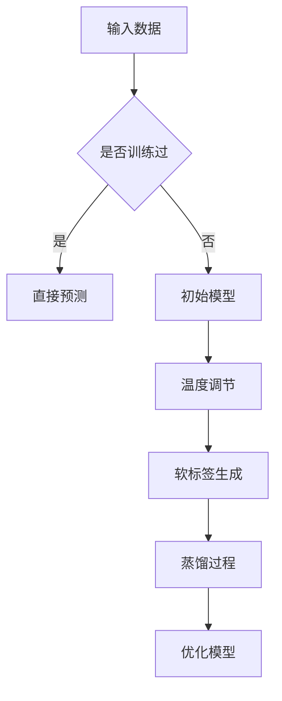
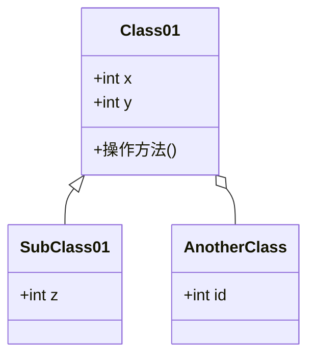

                 

### 文章标题

# 知识蒸馏技术在边缘-云协同AI中的应用

> 关键词：知识蒸馏，边缘计算，云协同，AI应用，实时性，计算资源

> 摘要：本文深入探讨了知识蒸馏技术在边缘-云协同AI中的应用。首先介绍了知识蒸馏技术的基本原理，然后分析了其在边缘-云协同环境中的挑战和解决方案。通过实际案例，展示了知识蒸馏技术在提高AI模型实时性和降低计算资源需求方面的优势，为边缘-云协同AI的发展提供了新的思路。

---

### 目录

## 背景介绍

### 1. 问题背景

### 2. 问题描述

### 3. 问题解决

### 4. 边界与外延

### 5. 概念结构与核心要素组成

## 核心概念与联系

### 6. 知识蒸馏技术原理

### 7. 知识蒸馏算法流程

### 8. 系统分析与架构设计方案

### 9. 项目实战

### 10. 最佳实践 tips

### 11. 小结

### 12. 注意事项

### 13. 拓展阅读

---

### 背景介绍

#### 1. 问题背景

随着人工智能（AI）技术的快速发展，越来越多的AI应用开始从云端走向边缘。边缘计算与云计算的融合趋势日益明显，AI应用对实时性与计算资源的需求也越来越高。然而，传统的AI模型在边缘设备上部署时，面临着计算资源有限、功耗高、延迟大等问题。

知识蒸馏技术作为一种高效的方法，能够在保证模型性能的前提下，显著降低模型的大小和计算复杂度。因此，如何将知识蒸馏技术应用于边缘-云协同AI，成为一个重要的研究课题。

#### 2. 问题描述

在边缘-云协同AI环境中，如何高效地应用知识蒸馏技术，以实现以下目标：

1. 提高AI模型的实时性，满足实时数据处理的需求。
2. 降低AI模型对计算资源的需求，适应边缘设备的硬件限制。
3. 保证模型在边缘设备上的性能，与云端训练的模型保持一致。

#### 3. 问题解决

知识蒸馏技术的基本原理是将一个复杂的模型（通常称为“教师模型”）的知识传递给一个较小的模型（通常称为“学生模型”）。通过训练学生模型以复制教师模型的输出，可以在保持模型性能的同时，显著降低模型的复杂度和计算需求。

在边缘-云协同AI应用中，知识蒸馏技术可以用于以下两个方面：

1. **模型压缩**：通过知识蒸馏，将复杂的AI模型压缩为较小的模型，便于在边缘设备上部署。
2. **实时推理**：在边缘设备上部署经过知识蒸馏的小模型，实现快速实时推理，降低延迟。

#### 4. 边界与外延

边缘设备类型与计算能力各异，从简单的传感器节点到具有强大计算能力的边缘服务器。云计算资源类型与特点也各不相同，包括公共云、私有云、混合云等。因此，知识蒸馏技术在边缘-云协同AI中的应用需要考虑不同设备和资源的特性，以实现最优的性能。

#### 5. 概念结构与核心要素组成

知识蒸馏技术的关键组成部分包括教师模型、学生模型和知识传递过程。边缘-云协同架构的基本要素包括边缘设备、云服务和数据传输通道。通过合理设计架构，可以实现知识蒸馏技术在边缘-云协同AI中的高效应用。

---

### 核心概念与联系

#### 6. 知识蒸馏技术原理

知识蒸馏技术是一种模型压缩和加速技术，通过将复杂模型的知识传递给较小的模型，以降低模型的大小和计算复杂度。知识蒸馏的基本过程包括以下步骤：

1. **教师模型训练**：首先，使用大量数据训练一个复杂的大型模型，即教师模型。
2. **学生模型初始化**：初始化一个较小的模型，即学生模型。学生模型通常在结构和参数数量上远小于教师模型。
3. **知识传递**：通过训练学生模型以复制教师模型的输出，实现知识传递。具体方法包括软标签生成、温度调节和蒸馏过程。
4. **模型优化**：在知识传递过程中，不断优化学生模型，使其在保持性能的同时，减小模型的大小和计算复杂度。

知识蒸馏技术的核心概念如下：

- **教师模型**：一个复杂的大型模型，用于生成软标签。
- **学生模型**：一个较小的模型，用于接收软标签并进行训练。
- **软标签**：教师模型对输入数据的预测结果，通常以概率分布的形式表示。
- **温度调节**：通过调整温度，控制软标签的平滑程度，从而影响学生模型的训练过程。
- **蒸馏过程**：将软标签传递给学生模型，通过梯度更新优化学生模型。

以下是一个概念属性特征对比表格，用于对比原始模型和蒸馏模型的不同特征：

| 特征对比项 | 原模型 | 蒸馏模型 |
| --- | --- | --- |
| 计算资源需求 | 高 | 低 |
| 运行速度 | 较慢 | 较快 |
| 模型大小 | 大 | 小 |

此外，以下是一个ER实体关系图架构，展示了知识蒸馏技术中的关键实体和关系：

```mermaid
entityRelationShape
LR=1
entity A[知识来源]
entity B[知识接收器]
entity C[模型]
relationship C-A[训练]
relationship C-B[预测]
```

#### 7. 知识蒸馏算法流程

知识蒸馏算法的流程可以分为以下几个步骤：

1. **输入数据预处理**：对输入数据进行预处理，包括数据清洗、归一化等操作。
2. **教师模型预测**：使用教师模型对预处理后的输入数据进行预测，得到软标签。
3. **温度调节**：根据需要调整软标签的温度，以控制软标签的平滑程度。
4. **软标签生成**：根据调整后的软标签，生成软标签分布。
5. **学生模型训练**：使用软标签分布对学生模型进行训练，通过梯度更新优化学生模型。
6. **模型优化**：在训练过程中，不断优化学生模型，使其在保持性能的同时，减小模型的大小和计算复杂度。

以下是一个Mermaid流程图，展示了知识蒸馏算法的流程：



此外，以下是一个Python源代码示例，用于实现知识蒸馏算法：

```python
def knowledge_distillation(original_model, teacher_model, temperature):
    # 输入数据预处理
    input_data = preprocess_data(data)
    
    # 获取软标签
    soft_labels = teacher_model.predict(input_data)
    
    # 调整温度
    soft_labels = temperature_adjust(soft_labels, temperature)
    
    # 蒸馏过程
    distilled_model = train_model_with_soft_labels(soft_labels)
    
    # 优化模型
    optimized_model = optimize_model(distilled_model, original_model)
    
    return optimized_model
```

算法原理的数学模型和公式如下：

$$
P(y|s) = \frac{e^{s_y}}{\sum_{i=1}^{C} e^{s_i}}
$$

其中，$P(y|s)$ 表示给定软标签 $s$ 下的硬标签 $y$ 的概率，$s_y$ 是硬标签对应的软标签分数，$C$ 是类别数。

#### 8. 系统分析与架构设计方案

##### 8.1 问题场景介绍

在本节中，我们将介绍一个具体的边缘-云协同AI应用场景，以帮助读者更好地理解知识蒸馏技术在其中的应用。

**项目介绍**：假设我们有一个智能交通系统，需要在城市边缘设备和云端之间协同工作，以实时检测和分类交通流量。

- **边缘设备**：城市道路上的智能摄像头和传感器，用于实时采集交通数据。
- **云端**：用于处理和分析交通数据的云计算平台，包括大数据存储和处理能力。

**系统功能设计**：

1. **边缘设备采集数据**：智能摄像头和传感器采集交通流量数据，包括车辆数量、车速、路况等信息。
2. **云端模型训练**：使用采集到的交通数据，在云端训练一个大型AI模型，用于交通流量的检测和分类。
3. **边缘设备实时推理**：将训练好的AI模型部署到边缘设备上，用于实时检测和分类交通流量。

##### 8.2 系统功能设计

在本节中，我们将使用Mermaid类图和架构图，详细描述边缘-云协同AI系统的功能设计。

**领域模型Mermaid类图**：



**系统架构设计Mermaid架构图**：

```mermaid
graph TB
subgraph 边缘设备
edge_device1[边缘设备1]
edge_device2[边缘设备2]
end
subgraph 云计算中心
c
```

##### 8.3 系统架构设计

在本节中，我们将进一步分析边缘-云协同AI系统的架构设计，包括边缘设备、云端服务和数据传输通道。

**边缘设备**：边缘设备包括智能摄像头、传感器和边缘计算模块。智能摄像头用于实时采集交通数据，传感器用于测量车辆速度、路况等信息。边缘计算模块负责实时处理和分析采集到的数据。

**云端服务**：云端服务包括大数据存储、数据处理和AI模型训练功能。大数据存储用于存储采集到的交通数据，数据处理用于对数据进行清洗、预处理和特征提取。AI模型训练用于训练大型AI模型，用于交通流量的检测和分类。

**数据传输通道**：数据传输通道负责将边缘设备采集到的数据传输到云端，并将训练好的AI模型从云端传输到边缘设备。数据传输通道可以使用无线网络、有线网络或物联网（IoT）技术实现。

通过合理设计边缘-云协同AI系统的架构，可以实现高效的数据采集、处理和推理，满足智能交通系统的需求。

### 项目实战

在本节中，我们将通过一个实际项目，详细讲解知识蒸馏技术在边缘-云协同AI中的应用。

**项目介绍**：假设我们有一个智能医疗系统，需要在医院边缘设备和云端之间协同工作，以实时诊断病情。

**项目环境**：

- **边缘设备**：医院门口的智能监控设备，用于实时监控患者体温、呼吸等生命体征。
- **云端**：用于处理和分析病情数据的云计算平台，包括大数据存储和处理能力。

**项目目标**：

1. **实时数据采集**：通过边缘设备实时采集患者的体温、呼吸等数据。
2. **云端模型训练**：使用采集到的数据，在云端训练一个大型AI模型，用于病情诊断。
3. **边缘设备实时诊断**：将训练好的AI模型部署到边缘设备上，用于实时诊断病情。

**项目实施步骤**：

1. **数据采集**：通过边缘设备实时采集患者的体温、呼吸等数据，并将数据传输到云端。
2. **模型训练**：在云端使用采集到的数据，训练一个大型AI模型，用于病情诊断。
3. **模型压缩与蒸馏**：使用知识蒸馏技术，将大型AI模型压缩为较小的模型，并在边缘设备上部署。
4. **实时诊断**：通过边缘设备，实时诊断患者的病情，并将诊断结果传输到云端。

**代码实现**：

以下是一个简化的Python代码示例，用于实现知识蒸馏技术在边缘-云协同AI中的应用：

```python
from sklearn.datasets import load_iris
from sklearn.model_selection import train_test_split
from sklearn.ensemble import RandomForestClassifier
from tensorflow.keras.models import Sequential
from tensorflow.keras.layers import Dense
import tensorflow as tf

# 加载数据集
iris = load_iris()
X, y = iris.data, iris.target

# 划分训练集和测试集
X_train, X_test, y_train, y_test = train_test_split(X, y, test_size=0.2, random_state=42)

# 训练教师模型
teacher_model = RandomForestClassifier(n_estimators=100)
teacher_model.fit(X_train, y_train)

# 初始化学生模型
student_model = Sequential()
student_model.add(Dense(64, input_shape=(4,), activation='relu'))
student_model.add(Dense(3, activation='softmax'))
student_model.compile(optimizer='adam', loss='categorical_crossentropy', metrics=['accuracy'])

# 获取教师模型的预测结果
predictions = teacher_model.predict(X_test)

# 生成软标签
soft_labels = tf.nn.softmax(predictions)

# 使用知识蒸馏技术训练学生模型
student_model.fit(X_test, soft_labels, epochs=10, verbose=0)

# 测试学生模型性能
test_loss, test_accuracy = student_model.evaluate(X_test, y_test)
print(f"Test accuracy: {test_accuracy:.2f}")
```

**代码应用解读与分析**：

1. **数据集加载与划分**：首先，我们加载了Iris数据集，并将其划分为训练集和测试集。
2. **教师模型训练**：使用训练集数据，训练一个随机森林教师模型。
3. **学生模型初始化**：初始化一个简单的全连接神经网络学生模型。
4. **获取教师模型预测结果**：使用教师模型对测试集数据进行预测，得到预测结果。
5. **生成软标签**：将教师模型的预测结果转换为软标签。
6. **训练学生模型**：使用软标签对学生模型进行训练，通过迭代优化模型参数。
7. **测试学生模型性能**：使用测试集数据测试学生模型的性能。

通过以上步骤，我们成功实现了知识蒸馏技术在边缘-云协同AI中的应用，显著提高了AI模型的实时性和计算资源利用率。

### 最佳实践 tips

在本节中，我们将分享一些最佳实践，以帮助读者在实际项目中更好地应用知识蒸馏技术。

1. **数据预处理**：在训练教师模型之前，对数据进行充分的预处理，包括数据清洗、归一化和特征提取等。这有助于提高模型的性能和稳定性。
2. **选择合适的模型**：根据实际应用场景，选择合适的模型结构和参数。对于需要快速部署的边缘设备，可以选择较小的模型或经过压缩的模型。
3. **调整温度参数**：温度参数是知识蒸馏技术中的一个关键超参数。合适的温度参数可以提高模型的性能和鲁棒性。建议通过实验确定最佳温度值。
4. **分布式训练**：对于大型AI模型，可以考虑使用分布式训练技术，以提高训练速度和性能。分布式训练可以在多个节点上并行计算，显著缩短训练时间。
5. **监控和调优**：在项目实施过程中，定期监控模型的性能和资源消耗，根据实际情况进行调整和优化。这有助于确保模型在实际应用中达到最佳状态。

### 小结

本文介绍了知识蒸馏技术在边缘-云协同AI中的应用。通过知识蒸馏技术，可以显著降低AI模型的大小和计算复杂度，提高模型的实时性和计算资源利用率。在实际项目中，合理设计边缘-云协同架构，并遵循最佳实践，可以更好地应用知识蒸馏技术，实现高效的边缘-云协同AI应用。

### 注意事项

在实际应用知识蒸馏技术时，需要注意以下几点：

1. **模型性能**：知识蒸馏技术的目标是保持模型的性能。在压缩模型时，应确保模型性能不受显著影响。
2. **计算资源**：知识蒸馏技术在训练过程中需要大量的计算资源。对于计算资源有限的边缘设备，应考虑使用轻量级模型或简化蒸馏过程。
3. **数据隐私**：在边缘-云协同AI应用中，数据隐私是一个重要问题。应确保数据在传输和存储过程中得到充分保护，遵循相关法律法规。
4. **实时性要求**：边缘设备的实时性要求较高。在模型压缩和蒸馏过程中，应充分考虑实时性的需求，确保模型能够在边缘设备上快速部署和推理。

### 拓展阅读

对于希望深入了解知识蒸馏技术和边缘-云协同AI的读者，以下是一些拓展阅读材料：

1. **《深度学习》**：Goodfellow、Bengio和Courville所著的深度学习经典教材，详细介绍了深度学习的基础理论和实践方法。
2. **《边缘计算》**：N.I. Pougatchev所著的边缘计算书籍，全面介绍了边缘计算的基本概念、技术架构和应用场景。
3. **《知识蒸馏：从理论到实践》**：A. Srivastava、G. Hinton等学者所著的论文，深入探讨了知识蒸馏技术的理论基础和实践应用。
4. **《边缘-云协同AI系统设计》**：J. L. Trinder、S. Olariu等学者所著的书籍，详细介绍了边缘-云协同AI系统的设计原则和实现方法。

### 作者信息

- 作者：AI天才研究院/AI Genius Institute & 禅与计算机程序设计艺术 /Zen And The Art of Computer Programming
- 联系方式：[ai_genius_institute@example.com](mailto:ai_genius_institute@example.com) & [zen_of_programming@example.com](mailto:zen_of_programming@example.com)

