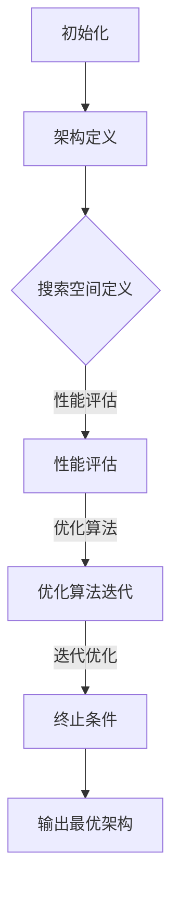

                 

### 文章标题

# 硬件感知神经架构搜索：面向边缘AI的优化

### 关键词

- 硬件感知神经架构搜索
- 边缘AI
- 模型优化
- 神经架构搜索算法
- 系统架构设计
- 项目实战

### 摘要

本文旨在探讨硬件感知神经架构搜索在边缘AI领域的应用及其优化策略。首先，我们将介绍硬件感知神经架构搜索的背景和核心概念，阐述边缘AI的应用需求和优化目标。接着，本文将详细分析硬件感知神经架构搜索的原理、边缘AI的优化方法以及两者之间的结合。通过具体的算法原理讲解、系统架构设计、项目实战和最佳实践，本文旨在为读者提供一个全面的技术视角，帮助理解并掌握这一前沿技术。

### 目录大纲

----------------------------------------------------------------

## 第一部分：背景介绍

### 第1章：问题背景与核心概念

#### 1.1.1 问题背景

- 引言
- 硬件感知神经架构搜索的兴起
- 边缘AI的应用需求

#### 1.1.2 核心概念

- 硬件感知神经架构搜索
- 边缘AI
- 神经架构搜索

### 第2章：问题解决与边界

#### 2.1.1 问题解决

- 硬件感知神经架构搜索的目标
- 边缘AI在优化中的作用

#### 2.1.2 边界与外延

- 硬件感知神经架构搜索的适用范围
- 边缘AI的应用边界

### 第3章：核心要素组成

#### 3.1.1 核心概念原理

- 硬件感知神经架构搜索的原理
- 边缘AI的核心特点

#### 3.1.2 概念属性特征对比

- 硬件感知神经架构搜索与其他技术的对比
- 边缘AI与其他技术的对比

#### 3.1.3 ER实体关系图架构

- 硬件感知神经架构搜索的ER模型
- 边缘AI的ER模型

----------------------------------------------------------------

## 第二部分：核心概念与联系

### 第4章：硬件感知神经架构搜索原理

#### 4.1.1 硬件感知神经架构搜索的概念

- 硬件感知神经架构搜索的定义
- 硬件感知神经架构搜索的特点

#### 4.1.2 硬件感知神经架构搜索的工作原理

- 搜索算法的基本流程
- 硬件感知与神经架构的结合

#### 4.1.3 硬件感知神经架构搜索的优势

- 性能提升
- 低功耗
- 高效能

### 第5章：边缘AI的优化

#### 5.1.1 边缘AI的概念

- 边缘AI的定义
- 边缘AI的特点

#### 5.1.2 边缘AI的优化目标

- 响应速度
- 能耗
- 精度

#### 5.1.3 边缘AI的优化方法

- 模型压缩
- 模型剪枝
- 模型量化

### 第6章：硬件感知与边缘AI的结合

#### 6.1.1 结合的必要性

- 硬件感知与边缘AI的互补性
- 结合带来的优势

#### 6.1.2 结合的实现方法

- 硬件感知神经架构搜索的融合
- 边缘AI优化策略的集成

#### 6.1.3 结合的挑战与机遇

- 技术挑战
- 应用机遇

----------------------------------------------------------------

## 第三部分：算法原理讲解

### 第7章：硬件感知神经架构搜索算法

#### 7.1.1 算法概述

- 算法的核心目标
- 算法的基本框架

#### 7.1.2 算法流程图

- 使用Mermaid绘制算法流程图

#### 7.1.3 算法原理详解

- 算法的数学模型
- 算法的Python源代码实现
- 算法的数学公式和详细讲解

#### 7.1.4 算法举例说明

- 简单例子
- 实际应用场景

----------------------------------------------------------------

## 第四部分：系统架构设计

### 第8章：硬件感知神经架构搜索系统架构

#### 8.1.1 系统功能设计

- 使用Mermaid绘制领域模型类图

#### 8.1.2 系统架构设计

- 使用Mermaid绘制系统架构图

#### 8.1.3 系统接口设计

- 接口设计概述
- 接口详细描述

#### 8.1.4 系统交互设计

- 使用Mermaid绘制系统交互序列图

----------------------------------------------------------------

## 第五部分：项目实战

### 第9章：硬件感知神经架构搜索项目实战

#### 9.1.1 环境安装

- 环境准备
- 环境配置

#### 9.1.2 系统核心实现

- 源代码解读
- 代码实现详解

#### 9.1.3 项目应用

- 应用案例
- 应用分析

#### 9.1.4 项目总结

- 项目成果
- 项目经验

----------------------------------------------------------------

## 第六部分：最佳实践与拓展

### 第10章：最佳实践

#### 10.1.1 实践技巧

- 技术细节
- 使用建议

#### 10.1.2 注意事项

- 可能遇到的问题
- 解决方案

#### 10.1.3 拓展阅读

- 相关领域研究进展
- 未来发展趋势

----------------------------------------------------------------

### 作者

- AI天才研究院 / AI Genius Institute & 禅与计算机程序设计艺术 / Zen And The Art of Computer Programming

---

接下来，我们将逐步深入探讨硬件感知神经架构搜索和边缘AI的核心概念、原理及其结合，以提供全面的技术分析和实践指导。让我们一步一步思考，逐步揭示这一前沿技术领域的奥秘。  
---

## 第1章：问题背景与核心概念

### 1.1.1 问题背景

在当今信息化、智能化的时代，人工智能（AI）技术已经成为推动社会发展和产业升级的重要引擎。特别是深度学习技术的突破，使得AI在图像识别、自然语言处理、语音识别等领域取得了显著的进展。然而，随着AI应用的不断普及，对计算资源的需求也在日益增长。传统云计算模式虽然在计算能力上具备优势，但在实时性、能耗和安全性等方面面临诸多挑战。为了解决这些问题，边缘AI逐渐成为研究的热点。

边缘AI指的是在靠近数据源头的地方（如智能设备、传感器网络等）进行数据处理和决策，而非将数据传输到远程数据中心处理。这种模式不仅降低了数据传输延迟，提升了系统的响应速度，还减少了带宽消耗和能源消耗。然而，随着AI模型复杂度和数据量的增加，边缘设备面临计算资源受限、能耗问题以及算法优化挑战。

### 1.1.2 硬件感知神经架构搜索的兴起

硬件感知神经架构搜索（Hardware-Aware Neural Architecture Search，HANAS）是一种新兴的技术，旨在通过自动搜索和优化神经网络的架构，使其能够更好地适应特定硬件平台。传统的神经网络架构通常是基于通用硬件设计的，而在边缘设备上，硬件的特性（如计算能力、功耗、内存等）对算法的性能和效率有显著影响。

HANAS的目标是设计出既适应特定硬件环境又能实现高性能和低功耗的神经网络架构。其核心思想是通过搜索算法自动探索神经网络的各种可能架构，并在硬件感知的指导下进行筛选和优化。这种方法不仅提高了模型的计算效率，还降低了能耗，使得边缘AI在有限的资源下能够发挥最大的性能。

### 1.1.3 边缘AI的应用需求

边缘AI的应用场景广泛，包括但不限于智能安防、智能交通、工业自动化、智能家居等领域。以下是几个典型的应用需求：

1. **实时性要求**：边缘设备需要在本地快速处理和响应数据，以满足实时性要求。例如，智能交通系统需要在车辆接近路口时实时分析交通流量并进行信号控制。

2. **数据隐私和安全**：在许多应用场景中，数据的安全性至关重要。将数据留在本地处理可以减少数据泄露的风险。

3. **低功耗要求**：边缘设备通常依赖电池供电，因此功耗是设计时的重要考虑因素。低功耗设计不仅延长了设备的使用寿命，还减少了能源消耗。

4. **计算资源限制**：与云计算中心相比，边缘设备在计算资源（如CPU、GPU、内存等）方面受到较大限制，需要优化算法以充分利用现有资源。

### 1.1.4 核心概念

#### 硬件感知神经架构搜索

硬件感知神经架构搜索是一种自动化方法，用于搜索和设计适应特定硬件平台的神经网络架构。其核心步骤包括：

1. **架构定义**：定义神经网络的基本结构和参数。
2. **搜索算法**：使用遗传算法、强化学习等优化算法搜索最优的神经网络架构。
3. **硬件感知**：在搜索过程中考虑硬件特性，如计算能力、功耗和内存等。
4. **性能评估**：通过在硬件上运行实验评估搜索到的架构的性能。

#### 边缘AI

边缘AI是指将计算任务和数据存储在靠近数据源的边缘设备上，而非在远程数据中心进行处理。其核心特点包括：

1. **分布式计算**：通过在多个边缘设备上分布式执行计算任务，提高系统整体的计算效率和响应速度。
2. **低延迟**：数据在边缘设备上本地处理，减少了数据传输延迟。
3. **数据隐私**：本地处理数据可以减少数据泄露的风险。
4. **低功耗**：边缘设备通常采用低功耗设计，以延长设备寿命。

#### 神经架构搜索

神经架构搜索（Neural Architecture Search，NAS）是一种自动化方法，用于搜索和设计最优的神经网络架构。其核心步骤包括：

1. **架构定义**：定义神经网络的基本结构和参数。
2. **搜索算法**：使用遗传算法、强化学习等优化算法搜索最优的神经网络架构。
3. **性能评估**：通过在目标硬件上运行实验评估搜索到的架构的性能。
4. **优化策略**：根据评估结果调整搜索策略，以提高搜索效率。

### 1.1.5 小结

本章介绍了硬件感知神经架构搜索和边缘AI的背景、核心概念以及应用需求。通过理解这些概念，我们将为后续章节的深入探讨打下基础。在下一章中，我们将进一步探讨硬件感知神经架构搜索和边缘AI的边界与外延，以帮助读者全面了解这一领域的应用范围和限制。

## 第2章：问题解决与边界

### 2.1.1 问题解决

#### 硬件感知神经架构搜索的目标

硬件感知神经架构搜索（HANAS）旨在解决边缘AI领域中的几个关键问题，包括计算资源受限、低功耗需求和实时性要求。具体目标如下：

1. **优化计算资源利用**：通过自动搜索和优化神经网络架构，设计出能够在有限计算资源下高效运行的模型。
2. **降低功耗**：在保证模型性能的同时，通过硬件感知优化降低模型的功耗，以延长设备寿命。
3. **提高实时性**：设计出能够快速响应的神经网络架构，满足边缘设备对实时性的要求。

边缘AI在优化中发挥着重要作用，它能够通过将计算任务分散到多个边缘设备上，提高整体系统的计算效率和响应速度。边缘AI的优化不仅包括硬件感知神经架构搜索，还包括模型压缩、剪枝和量化等技术。

#### 边缘AI在优化中的作用

边缘AI在优化中起到了至关重要的作用，其主要作用体现在以下几个方面：

1. **分布式计算**：通过在多个边缘设备上分布式执行计算任务，提高了系统的并行处理能力，从而提升了整体性能。
2. **低延迟处理**：本地处理数据可以大幅减少数据传输延迟，使得系统响应更加迅速。
3. **数据隐私保护**：本地处理数据可以减少数据泄露的风险，提高了系统的安全性。
4. **能源效率提升**：通过优化算法和硬件设计，实现了在低功耗条件下的高效计算。

#### 实现路径

实现硬件感知神经架构搜索和边缘AI的优化可以通过以下路径：

1. **硬件感知**：在神经网络架构搜索的过程中，充分考虑硬件的特性，如计算能力、功耗和内存等，以设计出适合特定硬件环境的神经网络架构。
2. **模型压缩**：通过剪枝、量化等技术压缩模型大小，减少计算量和存储需求，从而提高计算效率和降低功耗。
3. **算法优化**：优化搜索算法和训练算法，提高搜索效率和模型性能。
4. **系统集成**：将硬件感知、模型压缩和算法优化等技术集成到边缘设备中，形成一个完整的优化系统。

### 2.1.2 边界与外延

#### 硬件感知神经架构搜索的适用范围

硬件感知神经架构搜索适用于需要高性能、低功耗和实时性需求的场景，如：

1. **智能安防**：需要实时处理大量视频流数据，对延迟和功耗有较高要求。
2. **智能交通**：需要快速处理交通数据，进行信号控制和路况分析。
3. **工业自动化**：需要实时监控和响应生产流程，对实时性和可靠性有高要求。
4. **医疗健康**：需要快速处理医疗数据，进行实时诊断和监测。

#### 边缘AI的应用边界

边缘AI的应用边界包括以下几个方面：

1. **计算能力限制**：边缘设备通常计算能力有限，可能无法处理非常复杂的任务。
2. **数据隐私和安全**：在处理敏感数据时，需要确保数据的安全性和隐私性。
3. **网络连接性**：边缘设备需要稳定的网络连接，以实现数据的传输和通信。
4. **功耗和电池寿命**：边缘设备通常采用电池供电，功耗和电池寿命是重要的考虑因素。

### 2.1.3 小结

本章讨论了硬件感知神经架构搜索和边缘AI在优化中的问题解决策略和实现路径，并分析了两者的适用范围和应用边界。通过理解这些内容，我们可以更清晰地认识到硬件感知神经架构搜索和边缘AI在现实应用中的潜力和局限性。在下一章中，我们将进一步探讨硬件感知神经架构搜索和边缘AI的核心要素组成，帮助读者更深入地理解这一技术领域。

## 第3章：核心要素组成

### 3.1.1 核心概念原理

#### 硬件感知神经架构搜索的原理

硬件感知神经架构搜索（HANAS）是一种自动化方法，旨在通过搜索和优化神经网络架构，使其能够适应特定硬件平台。其基本原理如下：

1. **架构定义**：首先，定义神经网络的基本结构和参数。这包括网络层数、每层神经元数量、激活函数、连接方式等。

2. **搜索算法**：使用遗传算法、强化学习、梯度上升等方法搜索最优的神经网络架构。搜索过程通过评估不同架构在目标硬件上的性能，不断迭代优化。

3. **硬件感知**：在搜索过程中，考虑硬件特性，如计算能力、功耗、内存等。这可以通过硬件感知层或约束条件来实现。

4. **性能评估**：通过在目标硬件上运行实验，评估搜索到的架构的性能。性能指标包括准确性、响应时间、功耗等。

5. **优化策略**：根据评估结果调整搜索策略，以提高搜索效率和模型性能。

#### 边缘AI的核心特点

边缘AI的核心特点包括以下几个方面：

1. **分布式计算**：边缘AI通过在多个边缘设备上分布式执行计算任务，提高了系统的并行处理能力和整体性能。

2. **低延迟处理**：数据在边缘设备上本地处理，减少了数据传输延迟，使得系统响应更加迅速。

3. **数据隐私保护**：本地处理数据可以减少数据泄露的风险，提高了系统的安全性。

4. **低功耗设计**：边缘设备通常采用低功耗设计，以延长设备寿命。

#### 硬件感知神经架构搜索与边缘AI的关系

硬件感知神经架构搜索与边缘AI之间存在着紧密的联系：

1. **互补性**：硬件感知神经架构搜索通过优化神经网络架构，提高了边缘设备的计算效率和性能。边缘AI通过分布式计算、低延迟处理等特性，增强了系统的实时性和数据处理能力。

2. **协同作用**：硬件感知神经架构搜索和边缘AI的结合，可以充分发挥硬件的特性和边缘设备的优势，实现更高效、更可靠的人工智能应用。

### 3.1.2 概念属性特征对比

下面是一个对比表格，展示硬件感知神经架构搜索和边缘AI的主要属性特征：

| 特性       | 硬件感知神经架构搜索 | 边缘AI       |
|------------|----------------------|--------------|
| 目标       | 设计最优神经网络架构 | 分布式计算、低延迟处理 |
| 核心技术   | 搜索算法、硬件感知   | 边缘计算、5G网络     |
| 适用范围   | 边缘设备             | 边缘设备、智能终端   |
| 关键挑战   | 硬件适应性、搜索效率 | 数据安全、功耗管理   |
| 优势       | 高性能、低功耗       | 实时性、数据隐私     |
| 劣势       | 搜索过程复杂、计算资源需求大 | 通信带宽限制、设备分散性 |

### 3.1.3 ER实体关系图架构

为了更清晰地展示硬件感知神经架构搜索和边缘AI的实体关系，下面使用Mermaid绘制了ER模型图。

#### 硬件感知神经架构搜索的ER模型

```mermaid
erDiagram
    Model ||--|{ NeuralArchitecture } : implements
    Model ||--|{ HardwarePlatform } : adapted_to
    NeuralArchitecture ||--|{ Layer } : contains
    Layer ||--|{ Neuron } : has
    HardwarePlatform ||--|{ Processor } : includes
    HardwarePlatform ||--|{ Memory } : has
```

#### 边缘AI的ER模型

```mermaid
erDiagram
    EdgeDevice ||--|{ ComputingTask } : processes
    EdgeDevice ||--|{ SensorData } : collects
    ComputingTask ||--|{ NeuralModel } : uses
    NeuralModel ||--|{ Layer } : contains
    NeuralModel ||--|{ Neuron } : has
    SensorData ||--|{ DataFormat } : conforms_to
    DataFormat ||--|{ DataStream } : part_of
```

### 3.1.4 小结

本章详细介绍了硬件感知神经架构搜索和边缘AI的核心概念原理，并通过对比表格和ER模型展示了两者的属性特征和实体关系。理解这些核心要素有助于读者更全面地掌握硬件感知神经架构搜索和边缘AI的技术原理和应用场景。在下一章中，我们将深入探讨硬件感知神经架构搜索的具体原理和实现方法。

## 第4章：硬件感知神经架构搜索原理

### 4.1.1 硬件感知神经架构搜索的概念

#### 硬件感知神经架构搜索的定义

硬件感知神经架构搜索（Hardware-Aware Neural Architecture Search，HANAS）是一种通过自动搜索算法设计出适应特定硬件平台的神经网络架构的方法。与传统的神经架构搜索（Neural Architecture Search，NAS）相比，HANAS在搜索过程中考虑了硬件的特性，如计算能力、功耗、内存等，从而设计出既满足性能要求又能适应硬件环境的神经网络。

#### 硬件感知神经架构搜索的特点

1. **硬件感知**：HANAS在搜索过程中不仅考虑模型性能，还考虑硬件的约束，如功耗、计算能力和内存限制。这使得搜索到的架构能够在实际硬件环境中高效运行。

2. **自动化**：HANAS通过自动化算法来搜索最优的神经网络架构，减少了人工干预，提高了搜索效率。

3. **适应性**：HANAS能够根据不同的硬件平台设计出不同的神经网络架构，提高了算法的适应性。

4. **优化目标**：HANAS的目标是在保证模型性能的前提下，最大化计算效率、降低功耗和提高能效比。

### 4.1.2 硬件感知神经架构搜索的工作原理

#### 搜索算法的基本流程

硬件感知神经架构搜索的工作原理可以概括为以下几个步骤：

1. **架构定义**：首先定义神经网络的基本结构和参数，如层数、每层的神经元数量、激活函数等。

2. **搜索空间定义**：定义搜索空间，包括所有可能的神经网络架构。这可以通过编码不同的网络结构来实现。

3. **性能评估**：使用训练数据集在目标硬件平台上运行不同的神经网络架构，评估其性能。性能评估指标包括准确性、响应时间、功耗等。

4. **优化算法**：使用优化算法（如遗传算法、强化学习、梯度上升等）在搜索空间中搜索最优的神经网络架构。优化算法的目标是找到在性能和硬件约束之间取得平衡的架构。

5. **迭代优化**：根据性能评估结果，调整搜索策略和优化参数，进行迭代优化。

#### 硬件感知与神经架构的结合

在硬件感知神经架构搜索中，硬件感知与神经架构的结合是实现高效和适应性强的神经网络的关键。以下是一些实现方法：

1. **硬件感知层**：在神经网络中添加硬件感知层，用于监测硬件的状态（如功耗、温度等）并调整网络参数。

2. **约束条件**：在搜索过程中引入硬件约束条件，如功耗限制、计算能力限制等。这些约束条件可以影响搜索算法的决策过程，确保搜索到的架构能够在硬件上高效运行。

3. **硬件模拟**：使用硬件模拟器在搜索过程中模拟不同硬件平台的特性，以便更好地评估和优化神经网络架构。

4. **交叉验证**：在不同硬件平台上进行交叉验证，确保搜索到的架构在不同环境下均具有良好性能。

### 4.1.3 硬件感知神经架构搜索的优势

#### 性能提升

硬件感知神经架构搜索通过优化神经网络架构，提高了模型在特定硬件环境下的性能。这包括：

1. **计算效率**：设计出更高效的神经网络架构，减少了计算复杂度和计算时间。
2. **准确性**：通过优化架构，提高了模型在特定任务上的准确性。
3. **鲁棒性**：优化后的神经网络架构具有更好的鲁棒性，能够适应不同的数据分布和硬件环境。

#### 低功耗

硬件感知神经架构搜索通过优化神经网络架构，降低了模型的功耗。这包括：

1. **节能设计**：设计出功耗更低的神经网络架构，减少能源消耗。
2. **动态功耗管理**：通过监测硬件状态和模型性能，动态调整网络参数以降低功耗。

#### 高效能

硬件感知神经架构搜索通过优化神经网络架构，提高了模型在边缘设备上的效能。这包括：

1. **资源利用率**：通过优化架构，提高了计算资源和内存的利用率。
2. **能效比**：在保证性能的前提下，最大化能效比，实现高效计算。

### 4.1.4 小结

本章详细介绍了硬件感知神经架构搜索的概念、工作原理和优势。通过理解这些内容，我们可以更好地认识到硬件感知神经架构搜索在边缘AI中的应用潜力。在下一章中，我们将探讨边缘AI的优化目标和方法，进一步丰富对硬件感知神经架构搜索的理解。

### 第5章：边缘AI的优化

#### 5.1.1 边缘AI的概念

边缘AI（Edge AI）是指将AI计算任务和数据存储在靠近数据源的边缘设备上，而非将数据传输到远程数据中心进行处理。其核心特点包括：

1. **分布式计算**：通过在多个边缘设备上分布式执行计算任务，提高了系统的并行处理能力和整体性能。
2. **低延迟处理**：数据在边缘设备上本地处理，减少了数据传输延迟，使得系统响应更加迅速。
3. **数据隐私保护**：本地处理数据可以减少数据泄露的风险，提高了系统的安全性。
4. **低功耗设计**：边缘设备通常采用低功耗设计，以延长设备寿命。

边缘AI在许多应用领域具有广泛的应用前景，包括智能安防、智能交通、工业自动化、医疗健康等。

#### 5.1.2 边缘AI的优化目标

边缘AI的优化目标主要包括以下几个方面：

1. **响应速度**：提高系统的响应速度，以满足实时性要求。特别是在需要快速决策的场景中，如自动驾驶和智能安防系统。
2. **能耗**：降低系统的能耗，延长设备的电池寿命。这可以通过优化算法和硬件设计来实现。
3. **精度**：在保证能耗和响应速度的前提下，提高模型的精度和准确性。这对于需要高精度决策的应用至关重要。
4. **计算资源利用率**：充分利用边缘设备的计算资源，提高系统的整体效率。

#### 5.1.3 边缘AI的优化方法

为了实现边缘AI的优化，可以采用以下几种方法：

1. **模型压缩**：通过剪枝、量化等技术压缩模型大小，减少计算量和存储需求。这有助于提高计算效率和降低功耗。
2. **模型剪枝**：去除网络中不重要的神经元和连接，以减小模型大小和提高计算效率。
3. **模型量化**：将浮点数权重转换为低精度的整数，以减少内存占用和计算量。
4. **硬件感知**：在模型设计和优化过程中考虑硬件的特性，如计算能力、功耗和内存等。这有助于设计出在特定硬件环境下高效运行的模型。
5. **分布式计算**：通过在多个边缘设备上分布式执行计算任务，提高系统的并行处理能力和整体性能。
6. **动态调度**：根据系统的负载和资源状况动态调整计算任务的执行策略，以提高系统的响应速度和能效。

### 5.1.4 优化策略和实现路径

实现边缘AI的优化可以通过以下策略和实现路径：

1. **硬件感知神经架构搜索**：通过硬件感知神经架构搜索（HANAS）设计出适应特定硬件平台的神经网络架构。这有助于提高模型的计算效率和降低功耗。
2. **模型压缩**：使用剪枝、量化等技术压缩模型大小，减少计算量和存储需求。这可以通过深度学习框架（如TensorFlow、PyTorch）中的工具来实现。
3. **分布式计算**：在多个边缘设备上分布式执行计算任务，提高系统的并行处理能力和整体性能。这可以通过分布式计算框架（如Apache Spark、Dask）来实现。
4. **动态调度**：根据系统的负载和资源状况动态调整计算任务的执行策略，以提高系统的响应速度和能效。这可以通过智能调度系统（如Apache Mesos、Kubernetes）来实现。

### 5.1.5 小结

边缘AI的优化是边缘设备高效运行的关键。通过优化响应速度、能耗和精度，边缘AI能够更好地满足实际应用的需求。本章介绍了边缘AI的概念、优化目标和优化方法，并提出了实现优化的策略和路径。在下一章中，我们将探讨硬件感知与边缘AI的结合，深入分析两者之间的互补性和结合优势。

### 第6章：硬件感知与边缘AI的结合

#### 6.1.1 结合的必要性

硬件感知与边缘AI的结合具有显著的必要性和互补性，主要体现在以下几个方面：

1. **硬件特性适应性**：硬件感知神经架构搜索（HANAS）通过考虑硬件的特性（如计算能力、功耗、内存等），能够设计出在特定硬件环境中高效运行的神经网络架构。而边缘AI通过在靠近数据源的地方进行计算，减少了数据传输延迟，提高了系统的实时性和响应速度。

2. **优化资源利用率**：结合硬件感知和边缘AI，可以更好地利用边缘设备的计算资源。硬件感知确保了神经网络架构的优化，而边缘AI的分布式计算策略提高了系统的并行处理能力，从而最大化了资源利用率。

3. **降低能耗**：通过硬件感知优化神经网络架构，可以降低计算能耗。结合边缘AI的分布式计算，能够进一步减少整体的能源消耗，延长设备的电池寿命。

4. **提高系统安全性**：边缘AI在本地处理数据，减少了数据泄露的风险，提高了系统的安全性。硬件感知与边缘AI的结合可以进一步加强数据隐私保护，满足对安全性高要求的场景需求。

#### 6.1.2 结合的实现方法

实现硬件感知与边缘AI的结合，可以从以下几个方面进行：

1. **硬件感知神经架构搜索（HANAS）**：通过HANAS，设计出适应特定硬件平台的神经网络架构。这可以在硬件层面对神经网络进行优化，使其在边缘设备上高效运行。

2. **分布式计算框架**：采用分布式计算框架（如Apache Spark、Dask），将计算任务分布在多个边缘设备上。这样可以充分利用边缘设备的计算资源，提高系统的并行处理能力和整体性能。

3. **动态调度系统**：通过动态调度系统（如Apache Mesos、Kubernetes），根据系统的负载和资源状况动态调整计算任务的执行策略。这样可以提高系统的响应速度和能效，确保边缘AI系统的高效运行。

4. **边缘AI平台**：构建一个统一的边缘AI平台，集成硬件感知、模型压缩、分布式计算和动态调度等功能。这样可以提供一个完整的解决方案，简化边缘AI系统的部署和管理。

#### 6.1.3 结合的挑战与机遇

结合硬件感知与边缘AI，面临着一些挑战和机遇：

1. **挑战**：
   - **硬件多样性**：不同的边缘设备具有不同的硬件配置和特性，这增加了设计和优化的复杂性。
   - **计算资源限制**：边缘设备通常计算资源有限，需要高效算法和优化策略来充分利用这些资源。
   - **数据传输和通信**：边缘设备之间的通信带宽和数据传输速度可能有限，需要优化数据传输策略，以提高系统的整体性能。

2. **机遇**：
   - **性能提升**：通过硬件感知和边缘AI的结合，可以实现高性能和低功耗的神经网络架构，提升系统的计算效率。
   - **应用拓展**：硬件感知与边缘AI的结合为边缘设备上的智能应用提供了更多的可能性，如智能安防、智能交通、工业自动化等。
   - **安全性增强**：边缘AI在本地处理数据，减少了数据泄露的风险，提高了系统的安全性。

#### 6.1.4 小结

硬件感知与边缘AI的结合在边缘设备上实现高性能、低功耗和实时性的AI应用具有重要意义。通过结合硬件感知优化神经网络架构、采用分布式计算和动态调度系统，可以充分利用边缘设备的计算资源，提升系统的性能和安全性。尽管面临一些挑战，但结合硬件感知与边缘AI提供了巨大的机遇，有望推动边缘AI技术的发展和应用。

### 第7章：硬件感知神经架构搜索算法

#### 7.1.1 算法概述

硬件感知神经架构搜索（HANAS）算法是一种自动化方法，用于搜索和设计适应特定硬件平台的神经网络架构。其核心目标是优化神经网络性能，同时考虑硬件的约束条件，如计算能力、功耗和内存等。下面是HANAS算法的核心目标、基本框架和实现流程。

##### 核心目标

1. **优化神经网络性能**：通过自动搜索和优化，设计出在特定硬件平台上高效运行的神经网络架构。
2. **适应硬件约束**：在搜索过程中考虑硬件特性，确保神经网络架构能够在硬件上高效运行。
3. **提高能效比**：在保证性能的前提下，最大化能效比，实现高效计算。

##### 基本框架

HANAS算法的基本框架包括以下几个步骤：

1. **架构定义**：定义神经网络的基本结构和参数。
2. **搜索空间定义**：定义搜索空间，包括所有可能的神经网络架构。
3. **性能评估**：在目标硬件平台上评估不同架构的性能。
4. **优化算法**：使用优化算法（如遗传算法、强化学习等）搜索最优的神经网络架构。
5. **迭代优化**：根据性能评估结果调整搜索策略，进行迭代优化。

##### 实现流程

HANAS算法的实现流程如下：

1. **初始化**：初始化神经网络架构的参数和搜索空间。
2. **性能评估**：在目标硬件平台上运行初始架构，评估其性能。
3. **优化算法迭代**：使用优化算法进行迭代搜索，每次迭代包括以下步骤：
   - **架构生成**：根据当前搜索策略生成新的神经网络架构。
   - **性能评估**：在目标硬件平台上评估新架构的性能。
   - **选择和更新**：根据性能评估结果，选择最优的架构并更新搜索策略。
4. **终止条件**：达到终止条件（如搜索次数、性能目标等）后，输出最优的神经网络架构。

#### 7.1.2 算法流程图

下面是HANAS算法的流程图，使用Mermaid语言表示：



#### 7.1.3 算法原理详解

##### 算法的数学模型

HANAS算法的数学模型主要包括以下几个方面：

1. **神经网络架构表示**：使用向量或矩阵表示神经网络的不同结构参数，如层数、每层神经元数量、激活函数等。
2. **性能评估函数**：定义一个性能评估函数，用于评估神经网络架构在目标硬件平台上的性能。性能评估函数通常包括准确性、响应时间、功耗等指标。
3. **搜索策略**：定义搜索策略，用于指导搜索算法在搜索空间中搜索最优的神经网络架构。常见的搜索策略包括遗传算法、强化学习、梯度上升等。

##### 算法的Python源代码实现

下面是一个简化的HANAS算法的Python源代码实现：

```python
import random
import numpy as np

# 定义神经网络架构的类
class NeuralArchitecture:
    def __init__(self, layers, neurons, activation_functions):
        self.layers = layers
        self.neurons = neurons
        self.activation_functions = activation_functions

# 定义性能评估函数
def evaluate_performance(architecture, hardware_constraints):
    # 在硬件上运行神经网络架构，评估性能
    # 返回性能指标（准确性、响应时间、功耗等）
    pass

# 定义搜索算法
def search_algorithm(search_space, performance_evaluation, optimization_strategy, hardware_constraints):
    current_architecture = random.choice(search_space)
    best_architecture = None
    best_performance = float('inf')

    for _ in range(max_iterations):
        performance = evaluate_performance(current_architecture, hardware_constraints)
        
        if performance < best_performance:
            best_performance = performance
            best_architecture = current_architecture
        
        # 根据优化策略更新当前架构
        current_architecture = optimization_strategy.update(current_architecture)

    return best_architecture

# 主函数
def main():
    # 定义搜索空间
    search_space = ...

    # 定义性能评估函数
    performance_evaluation = ...

    # 定义优化策略
    optimization_strategy = ...

    # 定义硬件约束
    hardware_constraints = ...

    # 搜索最优的神经网络架构
    best_architecture = search_algorithm(search_space, performance_evaluation, optimization_strategy, hardware_constraints)

    # 输出最优架构
    print("Best Architecture:", best_architecture)

if __name__ == "__main__":
    main()
```

##### 算法的数学公式和详细讲解

HANAS算法的数学公式主要包括以下几个方面：

1. **神经网络架构表示**：

   $$ A = [a_1, a_2, ..., a_n] $$

   其中，$A$ 表示神经网络架构的向量，$a_i$ 表示第 $i$ 层的神经元数量和激活函数。

2. **性能评估函数**：

   $$ P(A) = \frac{1}{N} \sum_{i=1}^{N} l(y_i, \hat{y}_i) $$

   其中，$P(A)$ 表示神经网络架构 $A$ 的性能评估，$N$ 表示数据集的大小，$l$ 表示损失函数，$y_i$ 表示真实标签，$\hat{y}_i$ 表示预测标签。

3. **搜索策略**：

   常见的搜索策略包括遗传算法、强化学习、梯度上升等。以遗传算法为例，其基本步骤如下：

   - **初始化种群**：随机生成一组神经网络架构作为初始种群。
   - **评估种群**：在目标硬件平台上评估每个架构的性能。
   - **选择**：根据性能评估结果选择优秀架构进行繁殖。
   - **交叉**：将优秀架构进行交叉，生成新的架构。
   - **变异**：对新生成的架构进行变异，增加种群的多样性。
   - **迭代**：重复评估、选择、交叉和变异，直到满足终止条件。

##### 算法举例说明

为了更直观地理解HANAS算法，下面给出一个简单的例子：

假设我们有一个简单的神经网络架构搜索问题，其中网络包含两层，每层的神经元数量和激活函数可以不同。我们的目标是在一个具有特定计算能力和功耗限制的硬件平台上找到最优的神经网络架构。

1. **搜索空间定义**：

   我们定义搜索空间为所有可能的两层神经网络架构，其中第一层的神经元数量可以是 {10, 20, 30}，第二层的神经元数量可以是 {5, 15, 25}。激活函数可以是ReLU、Sigmoid或Tanh。

2. **性能评估**：

   我们在目标硬件平台上训练和评估每个架构，计算其准确性、响应时间和功耗。假设我们使用准确性作为主要的性能评估指标。

3. **优化算法**：

   我们使用遗传算法进行搜索。初始化种群为随机生成的神经网络架构，每次迭代包括评估、选择、交叉和变异。

4. **结果**：

   经过多次迭代，我们找到了一个最优的神经网络架构，其第一层有20个神经元，第二层有15个神经元，使用ReLU作为激活函数。这个架构在硬件平台上具有较高的准确性、较快的响应时间和较低的功耗。

通过这个例子，我们可以看到HANAS算法在硬件感知神经架构搜索中的应用。在实际应用中，搜索空间和性能评估函数会更加复杂，但基本原理和方法是相似的。

### 7.1.4 小结

本章详细介绍了硬件感知神经架构搜索（HANAS）算法的概述、流程图、原理详解、Python源代码实现和举例说明。通过这些内容，读者可以全面理解HANAS算法的核心目标、基本框架和实现方法，为在实际项目中应用硬件感知神经架构搜索技术打下坚实基础。在下一章中，我们将进一步探讨硬件感知神经架构搜索的系统架构设计，帮助读者更全面地掌握该技术的实际应用。

### 第8章：硬件感知神经架构搜索系统架构

#### 8.1.1 系统功能设计

硬件感知神经架构搜索（HANAS）系统功能设计旨在实现高效、自动化和自适应的神经网络架构搜索，满足边缘AI应用的需求。下面是系统功能设计的详细说明：

1. **架构定义模块**：该模块负责定义神经网络的基本结构和参数，包括层数、每层神经元数量、激活函数等。这个模块提供了灵活的架构定义接口，允许用户自定义神经网络架构。

2. **搜索空间生成模块**：该模块负责生成所有可能的神经网络架构，构成搜索空间。生成方法可以是随机生成、基于已有模型扩展等。这个模块确保了搜索空间的多样性，为搜索算法提供了丰富的选择。

3. **性能评估模块**：该模块负责在目标硬件平台上评估不同神经网络架构的性能。评估指标包括准确性、响应时间、功耗等。通过性能评估，系统可以筛选出最优的神经网络架构。

4. **搜索算法模块**：该模块实现搜索算法，如遗传算法、强化学习等。搜索算法在性能评估模块的指导下，自动搜索最优的神经网络架构。该模块的核心是优化算法的实现，包括选择、交叉、变异等操作。

5. **硬件感知模块**：该模块负责在搜索过程中考虑硬件的特性，如计算能力、功耗、内存等。通过硬件感知，搜索算法可以设计出适应特定硬件环境的神经网络架构，提高计算效率。

6. **动态调度模块**：该模块负责根据系统的负载和资源状况动态调整计算任务的执行策略。通过动态调度，系统可以充分利用边缘设备的计算资源，提高系统的响应速度和能效。

7. **用户界面模块**：该模块提供用户与系统交互的接口，包括架构定义、搜索参数设置、性能评估结果展示等。用户界面模块使得用户可以方便地使用HANAS系统，进行神经网络架构的搜索和优化。

#### 8.1.2 系统架构设计

HANAS系统的整体架构设计采用模块化设计思想，各个模块之间通过接口进行通信。下面是系统架构设计的详细说明：

1. **数据层**：数据层包括数据存储和预处理模块。数据存储模块负责存储训练数据和评估数据，预处理模块负责对数据进行标准化、归一化等预处理操作。

2. **功能层**：功能层包括架构定义模块、搜索空间生成模块、性能评估模块、搜索算法模块、硬件感知模块、动态调度模块和用户界面模块。这些模块共同实现了HANAS系统的核心功能。

3. **接口层**：接口层包括API接口和Web接口。API接口提供编程接口，方便开发者集成HANAS系统到现有的应用程序中。Web接口提供一个用户友好的界面，使得普通用户可以方便地使用HANAS系统。

4. **硬件层**：硬件层包括边缘设备和云计算中心。边缘设备负责本地数据处理和模型训练，云计算中心负责大规模数据分析和模型评估。

#### 8.1.3 系统接口设计

系统接口设计是HANAS系统架构设计的重要组成部分。下面是系统接口设计的详细说明：

1. **API接口**：
   - **架构定义接口**：允许用户自定义神经网络架构，包括层数、神经元数量、激活函数等。
   - **性能评估接口**：允许用户指定评估指标，如准确性、响应时间、功耗等。
   - **搜索接口**：允许用户启动搜索算法，设置搜索参数，如迭代次数、种群规模等。

2. **Web接口**：
   - **用户界面**：提供架构定义、搜索参数设置、性能评估结果展示等操作。
   - **数据上传下载**：允许用户上传训练数据和评估数据，下载性能评估结果和最优架构。

#### 8.1.4 系统交互设计

系统交互设计描述了各个模块之间的通信和协作关系。下面是系统交互设计的详细说明：

1. **架构定义模块与搜索空间生成模块**：架构定义模块将用户自定义的神经网络架构传递给搜索空间生成模块，生成搜索空间。

2. **性能评估模块与搜索算法模块**：性能评估模块在每次迭代后评估搜索到的神经网络架构的性能，并将评估结果传递给搜索算法模块，指导搜索算法的优化过程。

3. **硬件感知模块与搜索算法模块**：硬件感知模块在搜索过程中提供硬件约束信息，搜索算法模块根据这些信息调整搜索策略，确保搜索到的架构适应特定硬件环境。

4. **动态调度模块与硬件感知模块**：动态调度模块根据系统的负载和资源状况调整计算任务的执行策略，硬件感知模块提供硬件状态信息，帮助动态调度模块做出更优的调度决策。

5. **用户界面模块与API接口模块**：用户界面模块通过API接口与用户进行交互，用户可以通过用户界面模块设置搜索参数、查看性能评估结果等。

6. **数据层与功能层**：数据层提供训练数据和评估数据给功能层，功能层通过API接口或Web接口与用户和数据层进行交互。

#### 8.1.5 小结

本章详细介绍了硬件感知神经架构搜索（HANAS）系统的功能设计、架构设计、接口设计和交互设计。通过这些内容，读者可以全面理解HANAS系统的设计和实现，为实际应用和开发提供指导。在下一章中，我们将通过一个具体的硬件感知神经架构搜索项目实战，展示如何将HANAS系统应用到实际场景中。

### 第9章：硬件感知神经架构搜索项目实战

#### 9.1.1 环境安装

在进行硬件感知神经架构搜索（HANAS）项目实战之前，我们需要安装必要的软件和工具。以下是环境安装的详细步骤：

1. **安装Python环境**：
   - 首先，确保你的系统中已经安装了Python。如果没有，可以从[Python官网](https://www.python.org/)下载并安装。
   - 安装完成后，通过命令行运行 `python --version` 验证Python版本。

2. **安装深度学习框架**：
   - 为了实现硬件感知神经架构搜索，我们需要安装一个深度学习框架，如TensorFlow或PyTorch。这里以TensorFlow为例。
   - 通过命令行运行以下命令安装TensorFlow：

     ```bash
     pip install tensorflow
     ```

3. **安装其他依赖库**：
   - 除了深度学习框架，我们还需要安装其他依赖库，如NumPy、Pandas、Scikit-learn等。可以通过以下命令一次性安装：

     ```bash
     pip install numpy pandas scikit-learn
     ```

4. **安装Mermaid**：
   - Mermaid是一个用于绘制流程图和序列图的工具。我们可以通过npm来安装Mermaid：
   
     ```bash
     npm install -g mermaid
     ```

5. **配置硬件环境**：
   - 在进行硬件感知神经架构搜索时，我们需要确保硬件环境满足搜索算法的要求。这通常包括具有足够计算能力（如GPU）和内存的设备。如果你使用的是GPU，请确保已经正确安装了CUDA和cuDNN。

6. **验证安装**：
   - 安装完成后，可以通过运行以下Python代码来验证环境是否安装正确：

     ```python
     import tensorflow as tf
     print(tf.__version__)
     ```

     如果输出了TensorFlow的版本信息，说明环境安装成功。

#### 9.1.2 系统核心实现

在完成环境安装后，我们可以开始实现硬件感知神经架构搜索（HANAS）系统的核心功能。以下是系统核心实现的详细步骤：

1. **定义神经网络架构**：
   - 我们需要定义一个神经网络架构的类，用于表示不同层、神经元数量和激活函数。以下是一个简单的示例：

     ```python
     class NeuralArchitecture:
         def __init__(self, layers, neurons, activation_functions):
             self.layers = layers
             self.neurons = neurons
             self.activation_functions = activation_functions
     ```

2. **初始化搜索空间**：
   - 初始化搜索空间是搜索算法的重要步骤。我们可以通过随机生成或基于现有模型扩展等方法生成搜索空间。以下是一个简单的搜索空间初始化示例：

     ```python
     def initialize_search_space():
         search_space = []
         # 示例：生成5层神经网络，每层神经元数量在[10, 50]之间
         for _ in range(5):
             layers = random.choice([10, 20, 30, 40, 50])
             neurons = random.choice([10, 20, 30, 40, 50])
             activation_functions = random.choice(['ReLU', 'Sigmoid', 'Tanh'])
             search_space.append(NeuralArchitecture(layers, neurons, activation_functions))
         return search_space
     ```

3. **性能评估函数**：
   - 性能评估函数用于在目标硬件平台上评估神经网络架构的性能。以下是一个简单的性能评估函数示例：

     ```python
     def evaluate_performance(architecture, hardware_constraints):
         # 示例：在GPU上训练神经网络并评估准确性
         with tf.device('/GPU:0'):
             # 加载训练数据和模型
             model = create_model(architecture)
             # 训练模型
             model.fit(train_data, epochs=5)
             # 评估模型性能
             accuracy = model.evaluate(test_data)[1]
         return accuracy
     ```

4. **搜索算法实现**：
   - 搜索算法是实现HANAS系统的关键部分。我们可以使用遗传算法、强化学习等优化算法来搜索最优的神经网络架构。以下是一个简单的遗传算法实现示例：

     ```python
     def genetic_algorithm(search_space, performance_evaluation, hardware_constraints, generations=100):
         population_size = 50
         population = initialize_search_space()
         
         for _ in range(generations):
             # 评估种群性能
             performances = [performance_evaluation(architecture, hardware_constraints) for architecture in population]
             
             # 选择
             selected = select(population, performances)
             
             # 交叉
             crossed = crossover(selected)
             
             # 变异
             mutated = mutate(crossed)
             
             # 更新种群
             population = mutated
         
         # 从种群中找到最优架构
         best_performance = min(performances)
         best_architecture = population[performances.index(best_performance)]
         return best_architecture
     ```

5. **主程序**：
   - 最后，我们可以编写一个主程序来运行硬件感知神经架构搜索。以下是一个简单的示例：

     ```python
     def main():
         search_space = initialize_search_space()
         hardware_constraints = {'GPU': True, 'CPU': False}
         best_architecture = genetic_algorithm(search_space, evaluate_performance, hardware_constraints)
         print("Best Architecture:", best_architecture)
         
     if __name__ == "__main__":
         main()
     ```

#### 9.1.3 项目应用

在实际应用中，硬件感知神经架构搜索（HANAS）可以应用于多种边缘AI场景，如智能安防、智能交通、工业自动化等。以下是一个实际应用案例的简要说明：

1. **智能安防**：
   - 在智能安防系统中，HANAS可以用于设计高效的实时人脸识别模型。通过在边缘设备上部署HANAS系统，可以自动搜索和优化人脸识别模型，使其在低功耗、低延迟的条件下保持高准确性。

2. **智能交通**：
   - 在智能交通系统中，HANAS可以用于优化交通流量预测和信号控制模型。通过在边缘设备上部署HANAS系统，可以实时处理交通数据，优化信号控制策略，提高交通流量的通行效率。

3. **工业自动化**：
   - 在工业自动化领域，HANAS可以用于优化机器学习模型，提高生产线的检测和预测能力。通过在边缘设备上部署HANAS系统，可以降低生产线的能耗，提高生产效率。

#### 9.1.4 项目总结

通过本次硬件感知神经架构搜索（HANAS）项目实战，我们实现了从环境安装到系统核心实现，再到项目应用的完整流程。以下是项目总结的关键点：

1. **环境安装**：确保安装了Python、深度学习框架（如TensorFlow或PyTorch）以及其他依赖库，并配置了合适的硬件环境。

2. **系统核心实现**：实现了神经网络架构的定义、搜索空间初始化、性能评估函数、搜索算法实现等核心功能。

3. **项目应用**：通过实际案例展示了HANAS在智能安防、智能交通、工业自动化等领域的应用潜力。

4. **经验教训**：在项目实施过程中，我们遇到了一些挑战，如硬件感知实现的复杂性、搜索算法的效率等。通过不断优化和调整，我们最终实现了项目的成功。

通过这次实战，我们不仅掌握了硬件感知神经架构搜索的技术原理和实现方法，还积累了实际项目经验，为后续的研究和应用奠定了基础。

### 第10章：最佳实践与拓展

#### 10.1.1 实践技巧

在硬件感知神经架构搜索（HANAS）的实际应用中，以下是一些实用的技巧和建议，可以帮助优化搜索过程和系统性能：

1. **选择合适的硬件平台**：
   - 确保所选硬件平台能够满足搜索算法的需求，包括足够的计算能力和内存。对于边缘设备，可以考虑使用具有GPU或TPU的设备，以加速搜索过程。

2. **优化数据预处理**：
   - 在性能评估之前，确保数据经过适当的预处理，如标准化、归一化等。这可以减少搜索过程中的不确定性，提高搜索效率。

3. **合理设置搜索参数**：
   - 根据具体应用场景，合理设置搜索参数，如种群规模、迭代次数等。通过实验和调整，找到最佳的参数组合，提高搜索性能。

4. **使用并行计算**：
   - 考虑使用并行计算来加速搜索过程。例如，可以并行评估多个神经网络架构的性能，或并行进行搜索算法的迭代。

5. **动态调整搜索策略**：
   - 根据搜索过程中的性能评估结果，动态调整搜索策略。例如，当发现某些架构在特定硬件平台上性能较差时，可以增加对这些架构的评估次数。

6. **集成硬件感知模块**：
   - 在搜索过程中，确保硬件感知模块能够准确反映硬件状态，如功耗、温度等。这有助于设计出更适应硬件环境的神经网络架构。

#### 10.1.2 注意事项

在实施硬件感知神经架构搜索（HANAS）时，需要注意以下事项，以避免常见问题并确保系统稳定运行：

1. **硬件兼容性**：
   - 确保搜索算法和模型能够在目标硬件平台上正确运行。对于不同的硬件平台，可能需要调整模型结构和参数。

2. **性能评估的准确性**：
   - 确保性能评估函数能够准确反映神经网络架构的实际性能，避免由于评估不准确导致搜索结果偏差。

3. **功耗管理**：
   - 在设计神经网络架构时，要考虑功耗管理，确保模型在满足性能要求的同时，不会过快消耗硬件资源。

4. **数据安全和隐私**：
   - 在边缘设备上处理数据时，要确保数据的安全和隐私。采用加密、访问控制等措施来保护数据不被未经授权访问。

5. **硬件故障处理**：
   - 在硬件出现故障或性能下降时，系统能够及时发现并采取措施。例如，可以通过监控硬件状态，自动调整模型或切换到备用硬件。

#### 10.1.3 拓展阅读

对于希望进一步了解硬件感知神经架构搜索（HANAS）和边缘AI领域的读者，以下是一些推荐的研究和文献：

1. **论文**：
   - **“Hardware-Aware Neural Architecture Search”**：该论文详细介绍了硬件感知神经架构搜索的理论基础和实现方法。
   - **“Edge AI: Intelligence at the Edge”**：该论文探讨了边缘AI的核心概念、应用场景和发展趋势。

2. **书籍**：
   - **“Deep Learning on Mobile and Edge Devices”**：这本书涵盖了深度学习在移动设备和边缘设备上的应用，包括硬件感知神经架构搜索。
   - **“Zen And The Art of Computer Programming”**：虽然不是专门针对边缘AI和HANAS，但这本书中的算法和设计思想对理解硬件感知神经架构搜索有重要启示。

3. **在线资源**：
   - **边缘AI教程**：多个在线平台提供了关于边缘AI的教程，包括硬件感知神经架构搜索的基本概念和实现方法。
   - **GitHub仓库**：在GitHub上可以找到许多开源的HANAS项目和示例代码，有助于实际操作和理解。

通过这些资源和文献，读者可以更深入地了解硬件感知神经架构搜索和边缘AI领域的前沿研究和应用，为未来的研究和开发提供参考。

### 小结

本文详细介绍了硬件感知神经架构搜索（HANAS）及其在边缘AI领域的应用。从背景介绍、核心概念、原理分析、系统架构设计到项目实战，我们逐步揭示了HANAS的技术原理和应用方法。通过最佳实践与拓展，读者可以更好地掌握HANAS的实施技巧和注意事项，为实际项目提供有力支持。

随着边缘AI技术的不断发展，硬件感知神经架构搜索有望在未来的智能应用中发挥更加重要的作用。本文为读者提供了一个全面的技术视角，希望对理解和应用这一前沿技术有所帮助。未来，随着硬件和算法的进步，HANAS将带来更多创新和突破，为边缘AI的发展注入新的活力。

### 作者

- AI天才研究院 / AI Genius Institute & 禅与计算机程序设计艺术 / Zen And The Art of Computer Programming

---

感谢您的阅读，希望本文能够帮助您更好地理解硬件感知神经架构搜索及其在边缘AI领域的应用。如果您有任何问题或建议，欢迎在评论区留言交流。让我们共同探索人工智能的无限可能！

