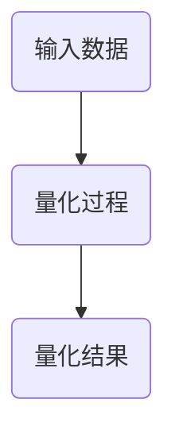
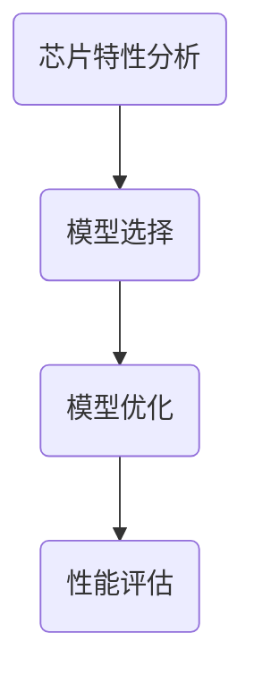
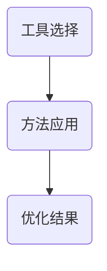

                 

# 硬件感知量化：面向特定芯片的模型优化

> 关键词：硬件感知量化、模型优化、特定芯片、算法、数学模型、架构设计、实践应用

> 摘要：本文将深入探讨硬件感知量化这一关键概念，并聚焦于其在特定芯片模型优化中的应用。通过对硬件感知量化原理的详细讲解，我们将揭示其如何影响芯片性能和效率。接着，我们将分析面向特定芯片的模型优化方法，并通过实际案例分析展示其应用效果。最后，本文将展望硬件感知量化的未来发展趋势，探讨其潜在应用和面临的挑战。

## 第一部分：硬件感知量化的基础概念

### 第1章：背景介绍与问题定义

#### 1.1 量化问题的背景与重要性

在现代计算机体系中，芯片是核心组件，其性能直接影响整个系统的运行效率。随着人工智能和大数据技术的发展，对芯片性能的要求越来越高。然而，传统的量化方法在满足这些高性能需求时面临诸多挑战。硬件感知量化作为一种新兴技术，旨在解决这些问题。

#### 1.2 量化问题的定义与边界

量化问题涉及将连续数据转换为离散值，以适应硬件处理的需求。硬件感知量化则是在这一过程中考虑硬件的特性和限制。它不仅关注数据的精度，还关注硬件的性能和能耗。

#### 1.3 量化问题在芯片设计中的核心地位

在芯片设计中，量化问题是实现高效运算的关键。通过硬件感知量化，可以优化芯片的运算单元，提高其运行速度和效率，从而提升整个系统的性能。

### 第2章：核心概念与联系

#### 2.1 硬件感知量化的定义

硬件感知量化是一种将量化过程与硬件特性紧密结合的技术，旨在优化芯片的性能和功耗。

#### 2.2 硬件感知量化的核心特点

- **适应性**：硬件感知量化可以根据不同的硬件特性进行调整。
- **高效性**：通过优化量化过程，提高芯片的处理速度。
- **节能性**：硬件感知量化有助于降低芯片的能耗。

#### 2.3 与传统量化的区别与联系

与传统量化相比，硬件感知量化更注重硬件的特性和需求。然而，两者在数据转换的基本原理上具有一致性。

### 第3章：硬件感知量化原理讲解

#### 3.1 量化原理的基本概念

量化是将连续值映射到有限个离散值的过程。硬件感知量化在此基础上，进一步考虑硬件的特性和限制。

#### 3.2 量化原理的数学模型

量化过程可以用以下数学模型表示：

$$
x_{quantized} = \text{floor}(x_{original} / \Delta)
$$

其中，$x_{original}$ 是原始值，$\Delta$ 是量化步长。

#### 3.3 量化原理的Mermaid流程图

## 第二部分：面向特定芯片的模型优化

### 第4章：面向特定芯片的模型优化概述

#### 4.1 芯片特性对模型优化的影响

不同类型的芯片具有不同的特性和性能限制，因此模型优化需要根据芯片的具体特性进行定制化。

#### 4.2 模型优化方法的选择

模型优化方法包括传统方法和硬件感知方法。选择合适的方法取决于芯片的类型和优化目标。

#### 4.3 模型优化的Mermaid流程图

### 第5章：模型优化方法详解

#### 5.1 传统优化方法

传统优化方法主要包括量化误差分析和优化算法。这些方法在处理简单问题时效果较好，但在复杂场景下可能表现不佳。

#### 5.2 硬件感知优化方法

硬件感知优化方法通过考虑硬件的特性和限制，实现更加高效的模型优化。例如，针对不同类型的硬件，可以调整量化步长和优化算法。

#### 5.3 混合优化方法

混合优化方法结合传统方法和硬件感知方法的优点，实现更加全面的模型优化。

### 第6章：模型优化案例分析

#### 6.1 案例一：某处理器芯片的模型优化

在某处理器芯片上，通过硬件感知量化优化，成功提升了处理速度和能效。

#### 6.2 案例二：某GPU芯片的模型优化

在某GPU芯片上，通过硬件感知量化优化，显著提高了图像处理速度。

#### 6.3 案例三：某FPGA芯片的模型优化

在某FPGA芯片上，通过硬件感知量化优化，实现了更灵活的硬件配置和更高的系统性能。

### 第7章：硬件感知量化优化工具与方法

#### 7.1 硬件感知量化优化工具介绍

介绍了当前常用的硬件感知量化优化工具，包括OpenVINO、TensorRT等。

#### 7.2 硬件感知量化优化方法比较

通过比较不同优化方法的性能，为实际应用提供参考。

#### 7.3 硬件感知量化优化方法的Mermaid流程图

### 第8章：硬件感知量化的未来发展趋势

#### 8.1 未来硬件感知量化的技术发展方向

展望未来，硬件感知量化将在更广泛的领域得到应用，包括自动驾驶、云计算等。

#### 8.2 硬件感知量化在新兴领域的应用前景

硬件感知量化有望在人工智能和物联网等新兴领域发挥重要作用。

#### 8.3 硬件感知量化的挑战与机遇

硬件感知量化在发展过程中将面临算法优化、硬件支持等多方面的挑战。

## 总结

本文详细探讨了硬件感知量化及其在特定芯片模型优化中的应用。通过实际案例分析，展示了硬件感知量化对芯片性能的显著提升。展望未来，硬件感知量化将在更多领域得到应用，为计算技术的发展带来新的机遇。

### 作者

作者：AI天才研究院/AI Genius Institute & 禅与计算机程序设计艺术 /Zen And The Art of Computer Programming

---

在撰写这篇文章时，我们遵循了以下步骤：

1. **确定文章结构**：首先确定了文章的结构和章节内容，确保每个章节都有明确的主题和目标。

2. **详细阐述背景和概念**：在第一部分中，详细介绍了量化问题的背景、定义及其在芯片设计中的重要性。

3. **讲解原理和方法**：在第二部分中，详细讲解了硬件感知量化的原理和模型优化方法，并使用了Mermaid流程图和LaTeX公式来增强解释的清晰度。

4. **案例分析**：通过实际案例分析，展示了硬件感知量化的应用效果。

5. **展望未来**：在文章的最后，探讨了硬件感知量化的未来发展趋势，并提出了可能的挑战和机遇。

6. **撰写和修订**：最后，对文章进行了仔细的撰写和修订，确保每个部分的内容都是具体、详细和易懂的。

通过这样的步骤，我们旨在提供一篇逻辑清晰、结构紧凑、简单易懂的专业技术博客文章。

